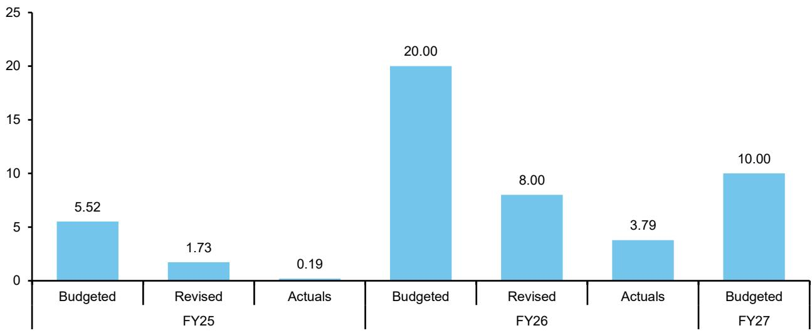
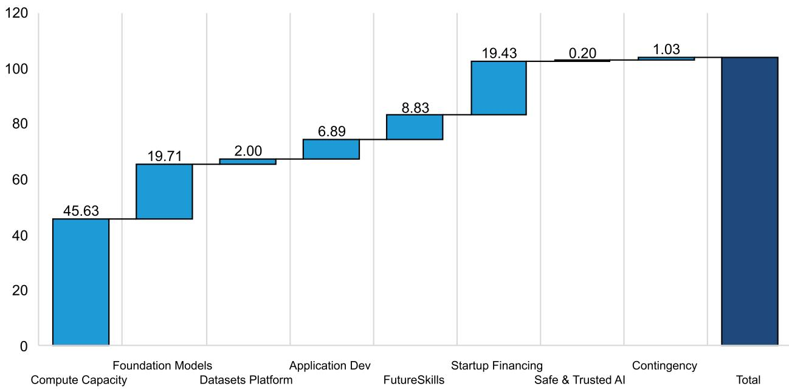

India Strategy

# India Strategy: Why India needs its own DeepSeek

  
Venugopal Garre

+65 6326 7643

venugopal.garre@bernsteinsg.com

Nikhil Arela

+91 226 842 1482

nikhil.arela@bernsteinsg.com

India can't build its AI future on borrowed models. While renting compute to power foreign LLMs may look like progress, it leaves the country dependent. The recent US restrictions on access to the latest AI model for non-citizens drive home the risk that India could find itself locked out some day, with its applications trailing those in the US and China. We had raised this topic even earlier but were muffled with noises of “LLM does not matter”. But the recent development compels us to have a relook.

AI is the next ‘fighter jet’: Technology access has been rationed and controlled in the past, and a trend emerging in last few years is shattering the “Global” image of AI. It started with critical minerals & semiconductors equipment, moved to GPUs and now exhibits itself in the form of restricted frontier models. The recent ban on Anthropic’s latest models for non-US citizens confirms that it’s no longer an anomaly. As AI moves from a mere commodity to a tool of strategic importance, one thing is clear: foundational models will no longer be SaaS products, they would rather be critical resources, becoming the “fighter jets” of an era where bleeding-edge models will be guardrailed. This will only aggravate further, with deep implications for India currently trying to convince itself that applications built on foreign LLMs and earning rent on datacentres is a sound AI strategy. To be clear, we are not dismissing this approach. There is value in participating in the ecosystem through infrastructure build-out and application layers. But at the very least, India needs to be aware about the risks embedded in effectively outsourcing the core AI models.

Why doesn't India have its own large-scale LLM? It may be counterintuitive that despite being the source of vast data, which is virtually the fuel to train global models, India itself hasn't harnessed this advantage to build competitive GenAI systems at global scale. This absence of an India “DeepSeek moment” is structural rather than a thought out strategy. India's tech ecosystem has long been services-led, with sparse consumer-facing platforms in areas like search, social media or messaging—domains that typically generate the rich, organized datasets critical for training advanced AI. The lack of such data ecosystems has never necessitated the development of talent pipelines and academic depth to build foundational models. The IT services model, where low cost labor effectively fine-tunes software built by global giants, further adds to the baggage of sticking to application layer. Heads of many leading Institutions have argued that India does not need its LLMs, but can focus on AI applications. These views are more reflective of the path India has taken to stand where it is today, rather than a deliberate strategic choice.

Can India afford its AI stack at the mercy of someone else? Let's picture this: India's core intelligence layer, from enterprise software to defence and space could be powered by foreign LLMs. Enter a geopolitical disruption, and that access could be curtailed overnight, bringing critical applications to a halt. A more likely outcome is subtler but equally concerning: India operates one or two generations behind. Applications built on older models struggle to compete with global offerings. An Indian IT giant with talent at its disposal could lose out to a young US SaaS firm bootstrapped by amateur coders having access to cutting-edge models. There is, however, a path that looks more resilient —building domain-specific LLMs on proprietary data and layering AI solutions on top. The real vulnerability lies with large-scale, horizontal GenAI applications built on external models....continued on page 2

## DETAILS

...continued from page 1. Framing India's AI Policy Choices: The solution set is not easy for policymakers. Ideas such as ringfencing AI for domestic firms (which we have given in the past) may lack practicality in a globally integrated technology landscape. That said, two strategic levers stand out. One approach is to restrict or pace access to global AI models, while channeling significant capital and talent into building India-native LLM capabilities. The other is to mandate or incentivize localization—requiring foreign firms to build and operate India-based AI stacks that are insulated from geopolitical controls. Both options are imperfect, but they frame the core policy trade-off between access and autonomy.

## INDIA'S TECH DEPENDENCE

For years, India's relationship with technology has followed a familiar script. Build locally where possible, but rely on global giants where it matters. The internet era was perhaps the clearest example. While China built walls and created large scale platforms that have provided it cash flows, talent pools and data to build AI models, India stayed open, and global platforms quietly became the rails on which its digital economy runs.

But here's the catch. What started as a story of internet dependence is, in reality, much bigger. Step back and look at the full stack. From hardware and core IT components to operating systems and enterprise software, India sits downstream across almost every layer. Exhibit 1 and Exhibit 2 make this stark. This is not just about apps or platforms; it is about systemic dependence. And overwhelmingly, that dependence points in one direction: the US. There have been attempts by Indian companies to break through in pockets, to build credible vertical platforms, but most have struggled to scale, out-competed by global incumbents with deeper moats, better products, and capital at scale.

Which brings us to today, and to AI. If history is any guide, the path forward seems obvious. Why fight it? Why not allow the same playbook to repeat, with global companies building, owning, and monetizing India's AI layer while domestic players participate on the margins? And yet, something feels different this time. AI is not just another application layer. It is emerging as the underlying rail for everything from enterprise workflows to consumer interactions. Importantly, it is still early. Unlike past technology cycles where India entered late, this is a moment where the contours are still being shaped. That is what is triggering the current debate around a sovereign AI stack. Not because India has suddenly discovered technological self-reliance, but because the cost of missing this wave could be far higher. Waiting 20–30 years, as India effectively did in earlier tech cycles, could entrench dependence in ways that are far harder to reverse, locking in value capture outside the country for decades.

But here lies the dilemma. Recognizing the importance of sovereignty is one thing; executing on it is another. The policy levers are limited, the competitive gap is large, and the alternatives outlined in our framework are far from straightforward. India may not dominate the core AI stack, but the choices it makes now will determine where value pools emerge, who captures them, and whether the next decade of AI-led growth deepens dependence or begins to rebalance it. The debate on LLMs, therefore, is not just a technology discussion. It is an early signal of how India intends to position itself in the AI economy. And this time, the decision cannot be deferred.

We believe India's real opportunity lies in owning and leveraging its rich, domain-specific datasets, especially across sectors like Industrials and healthcare. These datasets can become the foundation for building defensible, smaller, specialized LLMs by Indian technology companies, on top of which a wide range of applications can be developed. Importantly, these applications need not be confined to the digital world. They can extend into the physical economy as well, powering use cases such as training industrial robots, including next-generation humanoid systems where perhaps the Industrial context specific data set is more critical than the use of the latest Gen AI model and where older gen AI models may also work. The opportunity is, therefore, not just in software, but in shaping how AI integrates with real-world assets and workflows.

The core idea is simple but powerful: retain and control access to high-quality, hard-to-replicate vertical data. By limiting unrestricted access to such datasets for global platforms, India can create pockets of defensibility where domestic players can build meaningful capabilities. Over time, these can evolve into scalable solutions within India, and eventually be exported as global offerings. Realistically, this path may not produce trillion-dollar tech giants in the near term. But that is not the only metric of success. Even a shift toward building credible, globally relevant platforms anchored in proprietary data would expand India's share of value creation beyond IT services, and gradually reposition it within the global tech ecosystem. More importantly, it sets the foundation for the future. As talent and capital begin to recognize the viability of an India-led tech stack, it could trigger a virtuous cycle—one where the next generation of entrepreneurs builds not just for India, but from India.

EXHIBIT 1: India's tech dependence

<table><tr><td>Area</td><td>Main companies India depends on</td><td>Country of origin</td><td>Indian providers / initiatives</td></tr><tr><td colspan="4">Core compute: CPUs, GPUs, chipsets</td></tr><tr><td>PC/server CPUs</td><td>Intel, AMD</td><td>Intel: US; AMD: US</td><td>CDAC&#x27;s ARM designs for niche HPC; no mass CPU yet</td></tr><tr><td>Mobile SoCs</td><td>Qualcomm, MediaTek, Apple (A-series), Samsung Exynos</td><td>US; Taiwan; US; South Korea</td><td>Jio/Reliance design efforts (limited), none at scale</td></tr><tr><td>AI NPUs / accelerators</td><td>NVIDIA, AMD, Google TPU (cloud), Intel Gaudi</td><td>US; US; US; US</td><td>None in production; early RISC-V and fabless efforts</td></tr><tr><td>GPUs (datacenter/client)</td><td>NVIDIA, AMD</td><td>US; US</td><td>None meaningful; India is a GPU consumer onlyinstagram</td></tr><tr><td>Memory (DRAM, NAND)</td><td>Samsung, SK Hynix, Micron</td><td>South Korea; South Korea; US</td><td>No large domestic DRAM/NAND makers</td></tr><tr><td>Storage controllers, SSDs</td><td>Samsung, Western Digital, Seagate, Kioxia</td><td>KR; US; US; Japan</td><td>Only assembly/integration by Indian system integrators</td></tr><tr><td colspan="4">Operating systems (PC, mobile, server)</td></tr><tr><td>Desktop / laptop OS</td><td>Microsoft Windows (dominant), Apple macOS, desktop Linux</td><td>US; US; global OSS</td><td>Maya OS (Govt Linux-based for defence)facebook</td></tr><tr><td>Mobile OS</td><td>Google Android (incl. OEM skins), Apple iOS</td><td>US; US</td><td>BharatOS / homegrown Android forks (small share)</td></tr><tr><td>Server OS</td><td>Linux distros (Red Hat, Ubuntu, etc.), Windows Server</td><td>US/UK; US; others</td><td>Local Linux customizations in govt/PSUs</td></tr><tr><td colspan="4">Desktop productivity, content creation, key software</td></tr><tr><td>Office suites</td><td>Microsoft 365/Office</td><td>US</td><td>Zoho Workplace (Zoho, India); LibreOffice (OSS)</td></tr><tr><td>PDF tools</td><td>Adobe Acrobat</td><td>US</td><td>Small Indian PDF tools; none at Adobe&#x27;s scale</td></tr><tr><td>Creative suite (photo, video, design)</td><td>Adobe Creative Cloud, Corel, Autodesk</td><td>US; Canada; US</td><td>Inkscape, GIMP (OSS); few Indian pro-grade suites</td></tr><tr><td>IDEs &amp; dev tools</td><td>Microsoft (VS, VS Code), JetBrains, open-source tools</td><td>US; Czech/Netherlands</td><td>Indian plugin/tool vendors; core IDEs foreign</td></tr><tr><td>Browsers</td><td>Google Chrome, Apple Safari, Microsoft Edge, Firefox</td><td>US; US; US; US</td><td>Indian Chromium forks possible; no large consumer brand</td></tr><tr><td colspan="4">Enterprise applications: ERP, accounting, CRM</td></tr><tr><td>Large-enterprise ERP</td><td>SAP, Oracle, Microsoft Dynamics, Infor, Sage</td><td>Germany; US; US; US; UK</td><td>Ramco Systems, Tally Solutions, Focus Softnet, Bsquare Pothera ERP</td></tr><tr><td>SME accounting / ERP</td><td>Tally (very dominant), Zoho Books, QuickBook</td><td>India; India; US</td><td>Tally Solutions (India), Zoho (India)</td></tr><tr><td>CRM / SaaS business apps</td><td>Salesforce, Microsoft, HubSpot, SAP, Oracle</td><td>US; US; US; Germany; US</td><td>Zoho CRM (India), Freshworks (Freshdesk, etc.), LeadSquared</td></tr><tr><td>HR / payroll</td><td>SAP SuccessFactors, Oracle HCM, Workday</td><td>Germany; US; US</td><td>Darwinbox, Keka, GreytHR (India)</td></tr><tr><td colspan="4">PCs, laptops, and other client hardware</td></tr><tr><td>Laptops / PCs</td><td>HP, Dell, Lenovo, Acer, Asus, Apple</td><td>US; US; China; Taiwan; Taiwan; US</td><td>HCL (legacy PCs), Reliance, Lava, Dixon assembling for brands</td></tr><tr><td>PC components</td><td>Motherboards, GPUs, RAM, SSDs from global brands (ASUS, Gigabyte, MSI, etc.)</td><td>Taiwan; Taiwan; Taiwan</td><td>No major Indian component brands; mostly import-dependent</td></tr><tr><td>Monitors</td><td>Samsung, LG, Dell, HP</td><td>KR; KR; US; US</td><td>A few Indian labels (e.g. Intex, Zebronics) using imported panels</td></tr></table>

MediaTek, Samsung, SK Hynix, Micron and Kioxia are covered by Mark Li; Microsoft, Adobe, SAP, Oracle, Salesforce, HubSpot and Workday are covered by Mark Moerdler; Apple, Western Digital, Seagate, HP and Dell are covered by Mark Newman; Alphabet (owns Android, Chrome) is covered by Mark Shmulik; Sage is covered by Richard Nguyen; Intel, AMD, Qualcomm and Nvidia are covered by Stacy Rasgon

Lenovo, Acer, Asus, Gigabyte, MSI, LG Electronics, Reliance, Ramco Systems, HCL Tech and Freshworks are not covered

Remaining companies are unlisted

Source: Company Data, Bernstein Analysis

EXHIBIT 2: India's tech dependence

<table><tr><td>Area</td><td>Main companies India depends on</td><td>Country of origin</td><td>Indian providers / initiatives</td></tr><tr><td colspan="4">Smartphones, feature phones, and mobile hardware</td></tr><tr><td>Smartphones (brands)</td><td>Samsung, Xiaomi, Vivo, Oppo, Apple, OnePlus, Motorola</td><td>KR; China; China; China; US; China; US</td><td>Lava, Micromax (smaller), JioPhone (Reliance), Karbonn</td></tr><tr><td>ODM / manufacturing</td><td>Chinese/Taiwanese ODMs; Foxconn, Wistron, Pegatron, etc.</td><td>Taiwan; Taiwan; Taiwan</td><td>Dixon, local EMS units under PLI schemes</td></tr><tr><td>Modems / RF chips</td><td>Qualcomm, MediaTek, UNISOC</td><td>US; Taiwan; China</td><td>No domestic RF baseband vendor</td></tr><tr><td>Displays &amp; batteries</td><td>Samsung, LG, BOE, CATL, others</td><td>KR; KR; China; China</td><td>Limited local battery assembly, cells largely imported</td></tr><tr><td colspan="4">Telecom networks and equipment</td></tr><tr><td>Mobile RAN &amp; core</td><td>Ericsson, Nokia, Huawei (historically), ZTE, Cisco</td><td>Sweden; Finland; China; China; US</td><td>Tejas Networks, HFCL, ITI, C-DOT-aligned vendors</td></tr><tr><td>Transmission &amp; fiber</td><td>Nokia, Ericsson, Huawei; global fiber makers</td><td>Finland; Sweden; China</td><td>HFCL, Sterlite Technologies (STL) for fiber and some gear</td></tr><tr><td>Tower infra</td><td>American Tower, global OEMs for gear</td><td>US, others</td><td>Indus Towers (India), Bharti Infratel (now merged)</td></tr><tr><td>Routers/switches (IP)</td><td>Cisco, Juniper, Huawei, Nokia</td><td>US; US; China; Finland</td><td>Some L2/L3 switches by Indian OEMs; not yet at Tier-1 scale</td></tr><tr><td colspan="4">Cloud, hyperscale, and developer platforms</td></tr><tr><td>Public cloud IaaS/PaaS</td><td>AWS, Microsoft Azure, Google Cloud</td><td>US</td><td>Niche Indian DC/cloud providers (CtrlS, ESDS, Krutrim)</td></tr><tr><td>SaaS productivity</td><td>Microsoft 365, Google Workspace, Zoom, Slack</td><td>US</td><td>Zoho suite (India), Flock (India)</td></tr><tr><td>Code hosting</td><td>GitHub, GitLab,</td><td>US</td><td>Few Indian Git alternatives; minor adoption</td></tr><tr><td colspan="4">Social media, messaging, consumer internet</td></tr><tr><td>Social media</td><td>Meta (Facebook, Instagram), X (Twitter), LinkedIn</td><td>US</td><td>ShareChat, Koo, Josh (short video)</td></tr><tr><td>Video streaming</td><td>YouTube, Netflix, Amazon Prime Video, Disney+ Hotstar</td><td>US</td><td>JioCinema, SonyLIV, Zee5</td></tr><tr><td>Messaging apps</td><td>WhatsApp, Telegram, Signal, iMessage</td><td>US; UAE/Cyprus; US; US</td><td>Hike (pivoted), JioChat; limited scale now</td></tr><tr><td>E-commerce</td><td>Amazon, Walmart/Flipkart</td><td>US</td><td>Reliance JioMart, Tata Neu, Snapdeal</td></tr><tr><td>Payments / UPI</td><td>Google Pay, PhonePe (Walmart-backed), Paytm</td><td>US; US; India</td><td>Paytm (India), many Indian UPI apps</td></tr><tr><td colspan="4">Peripherals and other PC/mobile parts</td></tr><tr><td>Keyboards, mice</td><td>Logitech, HP, Dell, local OEM imports</td><td>Switzerland; US; US</td><td>Zebronics, Intex, iBall (brand/OEM, not deep IP)</td></tr><tr><td>Printers, scanners</td><td>HP, Canon, Epson, Brother</td><td>US; Japan; Japan; Japan</td><td>Very limited Indian printer IP; mostly imports</td></tr><tr><td>Power adapters, chargers</td><td>OEMs from China/Taiwan</td><td>China; Taiwan</td><td>Many small Indian brands; core designs imported</td></tr><tr><td>PC cabinets, PSUs</td><td>Cooler Master, Corsair, Antec, OEM imports</td><td>Taiwan; US; US</td><td>Local brands (e.g. Artis); still largely imported components</td></tr></table>

Xiaomi is covered by Eunice Lee; Netflix is covered by Laurent Yoon; American Tower is covered by Madison Rezaei; Samsung is covered by Mark Li; Microsoft (owns Github) and Salesforce (owns Slack) are covered by Mark Moerdler; Apple, HP and Dell are covered by Mark Newman; Amazon, Alphabet and Meta are covered by Mark Shmulik; CATL is covered by Neil Beveridge; Zoom and GitLab are covered by Peter Weed; Paytm is covered by Pranav Gundlapalle; Ericsson and Nokia are covered by Ulrich Rathe; Walmart is covered by Zhihan Ma

Hon hai, Wistron, Pegatron, BOE tech, Lenovo, Reliance, HFCL, Sterlite Tech, Indus Towers, Bharti Airtel, Ola (owns Krutrim), Zee, ZTE, Cisco, Juniper, Logitech, Canon, Epson, Brother Industries, Corsair, Antec and TCS (owns Tejas Networks) are not covered

Rest of the companies are unlisted

Source: Company Data, Bernstein Analysis

## INDIA'S AI APPROACH SO FAR

Much like the period following the computer revolution, Indian technology leaders may be at risk of falling into a similar structural challenge, this time with potentially far greater consequences. Historically, India's technology industry was built on a services-led model. While global firms developed the core platforms that powered digital ecosystems, Indian companies excelled at maintaining, customizing, and extending these platforms through incremental layers of code and services. This model proved highly effective in an era defined by large software systems with relatively modest customization needs.

However, the dynamics with AI appear fundamentally different. As foundational models become increasingly powerful, the value may shift away from incremental application-layer work. Applications built on top of these models could become more standardized and widely accessible, reducing the differentiation that service-led models once provided. An additional layer of complexity arises from potential dependencies on foundational models developed and controlled outside India. If access to these models were to be constrained, for instance by policy decisions in countries where they are developed, it could introduce strategic vulnerabilities for companies that rely heavily on them.

## TOO LUMPY, TOO LITTLE

While this approach can be viewed as a cautious response shaped by past experience, it is also important to acknowledge another reality. India did see early momentum around foundational models, with several announcements that later lost traction or evolved into different directions. Some Indian companies initially outlined ambitions to build large, multi-billion-dollar LLMs, but over time these plans were either scaled back or reoriented.

At the policy level, the India AI Mission, launched in 2024 with an outlay of approximately INR 104 billion, or about USD 1.2 billion spread over five years, identified compute, data, research, and foundational models as key pillars. Since then, participation has become more focused, and among the original set of players, Sarvam currently appears to be one of the most committed efforts toward building a sovereign LLM stack.

At the same time, funding trends have been uneven. Allocations toward AI saw a notable reduction in the revised FY2025 budget in 2026, highlighting some volatility in execution. More broadly, the overall financial commitment, while meaningful, remains modest when viewed in a global context. For instance, reported public investments in AI in China are significantly larger, running into tens of billions of dollars annually.

EXHIBIT 3: Too lumpy, too little: India's AI strategy so far has been that of trying to do a lot from less resources

Allocation and Actual Spend in India's AI mission (INR bn)

  
Actuals for FY26 are till $9^{\text{th}}$ February, 2026 when government responded to a question on India's AI mission in the Rajya Sabha Source: Budget Documents, Government Response in Rajya Sabha, Bernstein Analysis

## DEFOCUSED, THINLY SPREAD

Beyond funding, the broader strategic approach also appears widely distributed across multiple priorities, which may make it challenging to achieve meaningful depth in any one area. As noted earlier, India's AI Mission was framed with an ambitious scope, spanning compute, data, research, hardware, applications, and foundational models. While comprehensive in intent, such a wide canvas can make focused execution more difficult.

Within the overall allocation of approximately USD 1.2 billion over five years, only a portion is directed toward foundational models. A little over USD 220 million, or under 20 percent, has been earmarked for this area. A similar amount has been set aside to support startups over the same period, while a significantly larger share, about 44 percent, is directed toward expanding access to compute capacity, including through imports.

In practice, there is often a gap between initial ambition and eventual outcomes. However, in this case, the challenge may begin at the level of prioritization. The current approach reflects an effort to build capabilities across multiple layers of the AI stack at once. While this ensures broad participation, it may also dilute the ability to build leadership in any single segment.

This contrasts with the more sequential approaches observed in other major AI ecosystems. In the United States, early momentum was anchored in access to compute and the strength of private capital, which enabled rapid advances in model performance alongside supporting infrastructure. China, on the other hand, placed a strong emphasis on model efficiency, while also investing in semiconductor capabilities in response to external constraints. Over time, both ecosystems expanded their focus across the stack, but this followed an initial phase of concentrated investment in specific strengths.

A related consideration is the scale of investment required. Building capabilities across multiple areas of AI simultaneously demands significant capital and institutional depth. In the absence of this, spreading resources too broadly can limit effectiveness, particularly in areas where domestic capabilities are still evolving. In such cases, a portion of the investment may flow toward procuring external technologies, which can reduce the impact on local capability building.

The other question is: should the Government be even involved? The involvement if any should be on the policy front - like “the great firewall” in China as long as there are identified Indian companies willing to participate in the LLM race. If there arent any - and everyone wants to build applications then even a Government su

EXHIBIT 4: Too defocused, thinly spread: Even with lesser and lumpy allocations, the focus is all over the place, creating no single area with meaningful advantage for India

How Government's INR 104 billion AI allocation is split  
  
Source: Parliamentary Response by the Government, Bernstein Analysis

## THE CRACKS IN THE AI 'GLOBALISATION'

Technology is often cited as a great leveller, but that misses an important caveat hidden between the lines - it is a great leveller given everyone has equal adoption, and more importantly, equal access to it. In the absence of the these, particularly the latter, it becomes the catalyst for a widening gap that continuously compounds with time. Technology, particularly in sectors such as defence, nuclear, and chemicals, has long been treated as a strategic sovereign asset. A new theme has joined these ranks over the last 4-5 years - the theme of Artificial Intelligence, as it has been reframed from a general purpose technology into a critical resource giving nations an edge over others. Governments have increasingly used classic export control tools to lock down key inputs like high-end GPUs, most visible in the successive US rounds of restrictions on exporting advanced semiconductor technology to China (Exhibit 5). At the same time, national strategies increasingly have started to talk about “sovereign AI”, where control over not just data, but even compute and foundational models is treated as paramount for gaining (or retaining) future economic and geopolitical power.

AI has often been framed as a force for global progress. However, early signs suggest that this vision of a seamless, globally accessible AI ecosystem is not evolving in practice. Initial measures focused on restricting access to advanced chip fabrication technologies and Electronic Design Automation tools. This was followed by limitations on the export of high-end GPUs. More recently, access to certain advanced AI models has also become more selective, reflecting a broader shift in how countries are approaching control over critical technologies, while adding LLMs as the newest entry to the list of restricted technologies. The trend only points one way → we will increasingly see more section 232s and 301s in the post-AI world.

EXHIBIT 5: US limiting actions on AI and related equipment on the world (primarily China)

<table><tr><td>Month</td><td colspan="2">US Limiting Action</td></tr><tr><td>Oct-22</td><td colspan="2">Semiconduction Manufacturing Equipment and Advance logic chips added to Commerce Control List (CCL)</td></tr><tr><td>Oct-23</td><td colspan="2">China entities involved in advanced computing added to Entity List (EL)</td></tr><tr><td>Oct-23</td><td colspan="2">Worldwide license requirements imposed for usage on behalf of entities either headquartered in, or with parent companies headquartered in China</td></tr><tr><td>Oct-23</td><td colspan="2">License requirements for chips designed for China - below October 2022 thresholds</td></tr><tr><td>Dec-24</td><td colspan="2">Expanded the Foreign Direct Product Rule to apply to SME and Chips</td></tr><tr><td>Dec-24</td><td colspan="2">Added 140 Chinese and China-linked entities to EL</td></tr><tr><td>Jan-25</td><td colspan="2">AI diffusion rule proposed, dividing the countries into three tiers based on relations with US. Tier to be instrumental in determining what can be exported</td></tr><tr><td>Mar-25</td><td colspan="2">Added 42 China entities to the EL, rescinded AI diffusion rule</td></tr><tr><td>May-25</td><td colspan="2">Issued guidance that any use of Huawei&#x27;s Ascend AI chips violates U.S. export controls.</td></tr><tr><td>Sep-25</td><td colspan="2">Removed named PRC facilities of Samsung and SK Hynix from the Validated End User program.Added 23 China entities to the EL.</td></tr><tr><td>Jun-26</td><td colspan="2">US issues export control directive to Anthropic to suspend access to Fable 5 and Mythos 5 for all foreign nationals, including non-citizen employees inside the US</td></tr><tr><td colspan="3">US Chip Restrictions</td></tr><tr><td>Oct-22</td><td>Controls on A100 and H100 chips</td><td>Modified China chips announced by Nvidia: A800 and H800</td></tr><tr><td>Nov-23</td><td>Restrictions on A800 and H800 chips</td><td>New chips announced for China: H20, L20 and L2</td></tr><tr><td>May-25</td><td>Initial controls on H20</td><td>Nvidia announces efforts to develop B30 and B40 for China</td></tr><tr><td>Jul-25</td><td>Export license for H20 Sales to China granted</td><td></td></tr><tr><td>Sep-25</td><td>Reports of BIS consultations with Nvidia regarding the B30 and possibly the B40</td><td>Cyberspace Administration of China effectively &quot;blacklisted&quot; the B40</td></tr></table>

Nvidia is covered by Stacy Rasgon

The US Entity List is a trade restriction published by the US Department of Commerce's Bureau of Industry and Security (BIS). It identifies foreign individuals, companies, and organizations believed to be involved in activities contrary to US national security or foreign policy interests, subjecting them to strict export license requirements

The Foreign Direct Product Rule (FDPR) is a strict U.S. export control that extends American regulatory jurisdiction to products manufactured entirely outside the United States

Source: Congress.gov, Bernstein Analysis

EXHIBIT 6: Alternate platforms from China for US technology

<table><tr><td>Huawei</td><td>US/Global</td></tr><tr><td>Kirin 9000S</td><td>Qualcomm Snapdragon</td></tr><tr><td>Kirin X90</td><td>Intel Core processor</td></tr><tr><td>Kunpeng 920</td><td>x86-based server CPU</td></tr><tr><td>Ascend 910C</td><td>Nvidia H100 &amp; H20</td></tr><tr><td>CloudMatrix 384</td><td>Nvidia GB200 NVL72</td></tr><tr><td>CANN</td><td>Nvidia CUDA</td></tr><tr><td>EulerOS</td><td>Other Linux-based server OS</td></tr><tr><td>MindSpore</td><td>PyTorch, TensorFlow</td></tr><tr><td>HarmonyOS Next</td><td>Android mobile OS</td></tr><tr><td>HarmonyOS PC</td><td>Windows OS</td></tr><tr><td>MetaERP</td><td>Oracle, SAP</td></tr><tr><td>GaussDB</td><td>Oracle SQL Developer</td></tr></table>

Huawei is not listed. Nvidia, Qualcomm and Intel Corp are covered by Stacy Rasgon. Alphabet (owns Android) is covered by Mark Shmulik. Microsoft (owns Windows) and Oracle are covered by Mark Moerdler.
Source: Brookings, Bernstein Analysis

## LESSONS FROM OTHER INDUSTRIES - AND WHY AI WILL FOLLOW

Even though China is the current focal point, this largely reflects the reality that it is the strongest challenger to Western dominance in the global AI race. It does not insulate India from future potential actions, and in fact, India can very well be caught in the cross-fire of the global sovereign AI conflict. It isn't surprising too, since throughout history, India has been no stranger to west-led sanctions - and they have chased it across fields like Nuclear, Space tech and defence (Exhibit 7).

The trend has already begun in AI, and it's only a matter of time when AI is so deeply entrenched in all systems that it moves from a corporate or academic productivity enhancer to a major tool that nations and their infra depends on. And that will be the time lack of sovereign models will hurt the most. Mere application layer presence, however wide, will not work. Imagine your entire layer working on top of foundational models whose access can be turned on or off like a tap by another nation thousands of miles away. Deep capabilities become a necessity, not a luxury.

The IT services parallel to AI is promising but ultimately misleading: while IT services in India exported Indian cheap labor and applied it to foreign platforms, the application layer of AI will rather export value creation that is powered by the very foundational models west has built. So while there was little alternative to the former in the west, the latter can have startups springing to life by previously non-tech savvy people or “vibe coders”, spearheading the west into the “services powered by AI” era.

EXHIBIT 7: Export controls and restrictions placed on India

<table><tr><td>Field</td><td>Period</td><td>Incident</td><td>Subsequent Technology/Items Restrictions</td><td>Impact on India</td></tr><tr><td>Nuclear</td><td>1974</td><td>India&#x27;s nuclear tests triggered concerns over proliferation</td><td>Advanced nuclear reactors, fuel-cycle technology, heavy water, reprocessing and enrichment tech placed under tight export controls to India</td><td>Slowed India&#x27;s access to latest reactor designs and fuel, constrained nuclear power growth. India doubled down on domestic ecosystem and pursued 3 stage thorium-based program</td></tr><tr><td>Space</td><td>1990s</td><td>Concern that India&#x27;s space launch vehicle work could aid ballistic missile programs; MTCR rules led to restrictions on missile-relevant tech transfer</td><td>Sanctions on Indian Space Research Organisation (ISRO) and related entities; denial of dual-use items like high-end electronics, materials, and some satellite/launch tech</td><td>Restricted access to some high-performance components, delayed a few commercial collaborations and increased cost/time to source equipment from non-US suppliers. Also instrumental behind India&#x27;s indigenisation and launch capabilities today being largely domestic</td></tr><tr><td>Defence/ Nuclear</td><td>1998</td><td>Pokhran-II triggered mandatory US sanctions and similar measures by other OECD partners</td><td>Suspension of foreign aid and most military sales, denial of dual-use exports for nuclear/missile reasons, opposition to non-basic-human-needs multilateral lending. Japan halted new yen loans</td><td>Short-term macro and financial pressure and tighter access to high-end dual-use equipment for industry and research</td></tr><tr><td>Semi-conductors</td><td>2018</td><td>Concerns over military applications of AI, advanced chips, quantum, drones and additive manufacturing; focus more on China/Russia but controls are country-agnostic and apply to non-NATO countries</td><td>Stricter licensing on advanced semiconductor tools, quantum devices, AI accelerator chips, some high-precision machine tools and additive manufacturing equipment.</td><td>Friction in acquiring cutting-edge fab equipment and some high-end AI hardware under blanket dual-use controls, even with deepening strategic partnership with the US/EU</td></tr></table>

Source: Bernstein Analysis

## WHAT THE AI FUTURE WILL LOOK LIKE - THE LIKELY AND THE EXTREME CASE

In the most plausible trajectory, AI is likely to settle into a world of stratified access. Advanced nations or blocs/alliances will have their own powerful foundational models, but will reserve the bleeding-edge capabilities for domestic use in defence, intelligence and critical infrastructure. Exportable versions will be older or fine-tuned to be less lethal, as is the case with defense. In practice, that will restrict emerging markets like India to N-1 or N-2 models. Over time, the effects of that artificially created gap will compound - whoever controls the most powerful foundational models rules military planning, owns the best intelligence and shapes scientific discoveries in the new age.

The extreme scenario is even harsher. AI models become strategic exports - reserved for only the elite and their allies. Access can be turned off not just for the governments, but also companies and researchers in “unfriendly” countries or countries that simply lose favor with a major AI power. India could one day wake up and find that the most powerful applications in finance or military are no longer working, and the APIs and weights they rely on have vanished overnight. For as much talent as Indian IT services companies may boast of, an upstart business bootstrapped by vibe coders elsewhere that have access to cutting edge models may ultimately give them a tough competition, taking away all the labor moat.

India cannot afford to operate on someone else's trapdoor. If foundational models represent the new strategic high ground, this demands a clear pivot in India's technology ambitions. While India may not replicate China's state-led behemoths or field multiple firms with the balance sheets to deploy tens of billions in R&D, it doesn't need to. A portfolio of “imperfect” but pragmatic strategies—leveraging its talent depth, open ecosystems, and frugal innovation can still carve out a meaningful edge in what is fast becoming a contested global AI landscape.

India's unique data reservoir and digital infra is a big leverage. Government mandates on critical sector models (finance, health, defence, etc) using data to be built and trained inhouse can be a starting step. India's far more access to global fabs and GPUs compared to China enables it to build domestic training capacity, and pair horizontal LLMs with deep vertical champions in domains where India is structurally strong - or which are critical for national security. With smaller steps taken, India may even realize the goal of a general purpose LLM some day. This is no longer a side hustle, but a critical component in nation building. India's own “DeepSeek” has stopped being a luxury; it is now a means to ensure that its brightest engineers do not suddenly discover one day that they are merely petty citizens of a transformed technology empire, ruled by someone else.

DISCLOSURE APPENDIX

## I. REQUIRED DISCLOSURES

References to "Bernstein" or the "Firm" in these disclosures relate to the following entities: Bernstein Institutional Services LLC (April 1, 2024 onwards), Bernstein & Co., LLC (pre April 1, 2024), Bernstein Autonomous LLP, BSG France S.A. (April 1, 2024 onwards), Bernstein (Hong Kong) Limited 盛博香港有限公司, Bernstein (Canada) Limited, Bernstein (India) Private Limited (SEBI registration no. INH000006378), Bernstein (Singapore) Private Limited, Bernstein Japan KK (サンフォード・C・バーンスタイン株式会社) and analysts employed by SG Africa Technologies & Services to produce Bernstein under a Global Services Agreement in place between Bernstein and SG.

Bernstein is part of a joint venture between SG (SG) and AllianceBernstein, L.P. (AB). Unless specifically noted otherwise, for purposes of these disclosures, references to Bernstein's “affiliates” relate to both SG and AB and their respective affiliates.

## RATINGS DEFINITIONS, BENCHMARKS AND DISTRIBUTION

## EQUITY RATINGS DEFINITIONS

## Bernstein brand

The Bernstein brand rates stocks based on forecasts of relative performance for the next 12 months versus the S&P 500 for stocks listed on the U.S. and Canadian exchanges, versus the Bloomberg Europe Developed Markets Large and Mid Cap Price Return Index EUR (EDME) for stocks listed on the European exchanges and emerging markets exchanges outside of the Asia Pacific region, versus the Bloomberg Japan Large and Mid Cap Price Return Index USD (JPL) for stocks listed on the Japanese exchanges, and versus the Bloomberg Asia ex-Japan Large and Mid Cap Price Return Index (ASIAX) for stocks listed on the Asian (ex-Japan) exchanges -unless otherwise specified.

The Bernstein brand has three categories of ratings:

\- Outperform: Stock will outpace the market index by more than 15 pp

• Market-Perform: Stock will perform in line with the market index to within +/-15 pp

• Underperform: Stock will trail the performance of the market index by more than 15 pp

Coverage Suspended: Coverage of a company under the Bernstein brand has been suspended. Ratings and price targets are suspended temporarily, are no longer current, and should therefore not be relied upon.

Not Rated: A rating assigned when the stock cannot be accurately valued, or the performance of the company accurately predicted, at the present time. The covering analyst may continue to publish research reports on the company to update investors on events and developments.

Not Covered (NC) denotes companies that are not under coverage.

Bernstein brand stock ratings are based on a 12-month time horizon.

## Autonomous brand – common stocks

The Autonomous brand rates common stocks as indicated below. As our benchmarks we use the Bloomberg Europe 500 Banks And Financial Services Index (BEBANKS) and Bloomberg Europe Dev Mkt Financials Large and Mid Cap Price Ret Index EUR (EDMFI) index for developed European banks and Payments, the Bloomberg Europe 500 Insurance Index (BEINSUR) for European insurers, the S&P 500 and S&P Financials for US banks and Payments coverage, S5LIFE for US Insurance, the S&P Insurance Select Industry (SPSIINS) for US Non-Life Insurers coverage, and the Bloomberg Emerging Markets Financials Large, Mid and Small Cap Price Return Index (EMLSF) for emerging market banks and insurers and Payments. Ratings are stated relative to the sector (not the market).

The Autonomous brand has three categories of common stock ratings:

\- Outperform (OP): Stock will outpace the relevant index by more than 10 pp

\- Neutral (N): Stock will perform in line with the market index to within +/-10 pp

\- Underperform (UP): Stock will trail the performance of the relevant index by more than 10 pp

Coverage Suspended: Coverage of a company under the Autonomous research brand has been suspended. Ratings and price targets are suspended temporarily, are no longer current, and should therefore not be relied upon.

Not Rated: A rating assigned when the stock cannot be accurately valued, or the performance of the company accurately predicted, at the present time. The covering analyst may continue to publish research reports on the company to update investors on events and developments.

Those denoted as ‘Feature’ (e.g., Feature Outperform FOP, Feature Under Outperform FUP) are our core ideas.

Not Covered (NC) denotes companies that are not under coverage.

Autonomous brand common stock ratings are based on a 12-month time horizon.

## Autonomous brand – preferred stocks

The Autonomous brand has three categories of preferred stock ratings:

\- Outperform (OP): The total return of the preferred instrument is expected to outperform preferred securities of other issuers operating in similar sectors or rating categories over the next six months.

\- Neutral (N): The total return of the preferred instrument is expected to perform in line with preferred securities of other issuers operating in similar sectors or rating categories over the next six months.

\- Underperform (UP): The total return of the preferred instrument is expected to underperform preferred securities of other issuers operating in similar sectors or rating categories over the next six months.

Autonomous preferred stock ratings are based on a 6-month time horizon.

## AUTONOMOUS CREDIT RESEARCH

Where this report contains investment recommendations for credit instruments, as defined in article 3(1)(35) of the Market Abuse Regulation, the information below is presented to comply with its disclosure requirements.

The report may also include reference(s) to published opinions by other Autonomous or Bernstein analysts covering the equity securities of the issuer(s) referenced herein. Please note an investment recommendation for credit instruments published by the author(s) of this report may differ from the published view of the analyst covering equity securities for the issuer(s) contained in this report and vice versa.

## CREDIT RATINGS DEFINITIONS

The Autonomous brand has three categories of credit ratings:

\- Credit Outperform (C-OP): The total return of the Reference Credit Instrument is expected to outperform the credit spread of bonds of other issuers operating in similar sectors or rating categories over the next six months.

\- Credit Neutral (C-N): The total return of the Reference Credit Instrument is expected to perform in line with the credit spread of bonds of other issuers operating in similar sectors or rating categories over the next six months.

\- Credit Underperform (C-UP): The total return of the Reference Credit Instrument is expected to underperform the credit spread of bonds of other issuers operating in similar sectors or rating categories over the next six months.

Autonomous credit ratings are based on a 6-month time horizon.

A list of all investment recommendations produced by the author(s) of this report alongside credit ratings history are available upon request.

It is at the sole discretion of the Firm as to when to initiate, update and cease research coverage. The Firm has established, maintains and relies on information barriers to control the flow of information contained in one or more areas (i.e. the private side)

within the Firm, and into other areas, units, groups or affiliates (i.e. public side) of the Firm

## DISTRIBUTION OF EQUITY RATINGS/INVESTMENT BANKING SERVICES

<table><tr><td>Equity Rating</td><td>Market Abuse Regulation (MAR) and FINRA Rating Category</td><td>Global Rating Distribution</td><td>Investment Banking Relationships*</td></tr><tr><td>Outperform</td><td>BUY</td><td>51.1%</td><td>16.5%</td></tr><tr><td>Market-Perform (Bernstein Brand) Neutral (Autonomous Brand)</td><td>HOLD</td><td>36.3%</td><td>17.8%</td></tr><tr><td>Underperform</td><td>SELL</td><td>12.6%</td><td>14.9%</td></tr></table>

\* These figures represent the percentage of companies within each equity rating category for which affiliates of Bernstein have provided investment banking services within the previous 12 months.
As of March 31, 2026. All figures are updated quarterly.

## OTHER MATTERS

The legal entity(ies) employing the analyst(s) listed in this report, and their location, can be determined by the country code of their phone number, as follows:

+1 Bernstein Institutional Services LLC; New York, New York, USA

+44 Bernstein Autonomous LLP; London UK

+212 SG Africa Technologies & Services; Casablanca, Morocco

+33 BSG France S.A.; Paris, France

+34 BSG France S.A.; Madrid, Spain

+41 Bernstein Autonomous LLP; Geneva, Switzerland

+49 BSG France S.A.; Frankfurt, Germany

+91 Bernstein (India) Private Limited; Mumbai, India

+852 Bernstein (Hong Kong) Limited 盛博香港有限公司; Hong Kong, China

+65 Bernstein (Singapore) Private Limited; Singapore

+81 Bernstein Japan KK; Tokyo, Japan

Where this report has been prepared by research analyst(s) employed by a non-US affiliate, such analyst(s), is/are (unless otherwise expressly noted below) not registered as associated persons of Bernstein Institutional Services LLC or any other SEC-registered broker-dealer and are not licensed or qualified as research analysts with FINRA. Accordingly, such analyst(s) may not be subject to FINRA's restrictions regarding (among other things) communications by research analysts with a subject company, interactions between research analysts and investment banking personnel, participation by research analysts in solicitation and marketing activities relating to investment banking transactions, public appearances by research analysts, and trading securities held by a research analyst account.

Where this report has been prepared by research analyst(s) employed by SG Africa Technologies & Services (part of the SG group of companies), it has been prepared on behalf of a Bernstein company under a Global Services Agreement in place between Bernstein and SG.

## CERTIFICATION

Each research analyst listed in this report, who is primarily responsible for the preparation of the content of this report, certifies that all of the views expressed in this publication accurately reflect that analyst's personal views about any and all of the subject securities or issuers and that no part of that analyst's compensation was, is, or will be, directly or indirectly, related to the specific recommendations or views in this publication.

## II. ADDITIONAL GLOBAL CONFLICT DISCLOSURES

It is at the sole discretion of the Firm as to when to initiate, update and cease research coverage. The Firm has established, maintains and relies on information barriers to control the flow of information contained in one or more areas (i.e., the private side) within the Firm, and into other areas, units, groups or affiliates (i.e., public side) of the Firm.

## III. OTHER IMPORTANT INFORMATION AND DISCLOSURES

Separate branding is maintained for “Bernstein” and “Autonomous” research products.

\- Bernstein produces a number of different types of research products including, among others, fundamental analysis and quantitative analysis under both the “Autonomous” and “Bernstein” brands. Recommendations contained within one type of research product may differ from recommendations contained within other types of research products, whether as a result of differing time horizons, methodologies or otherwise. Furthermore, views or recommendations within a research product issued under one brand may differ from views or recommendations under the same type of research product issued under the other brand. The Research Ratings System for the two brands and other information related to those Rating Systems are included in the previous section.

\- Autonomous operates as a separate business unit within the following entities: Bernstein Institutional Services LLC, Bernstein Autonomous LLP, Bernstein (Hong Kong) Limited 盛博香港有限公司 and Bernstein (India) Private Limited. For information relating to “Autonomous” branded products (including certain Sales materials) please visit: www.autonomous.com. For information relating to Bernstein branded products please visit: www.bernsteinresearch.com.

Analysts are compensated based on aggregate contributions to the research franchise as measured by account penetration, productivity and proactivity of investment ideas. No analysts are compensated based on performance in, or contributions to, generating investment banking revenues.

This report has been produced by an independent analyst as defined in Article 3 (1)(34)(i) of EU 596/2014 Market Abuse Regulation (“MAR”) and the same article of MAR as it forms part of United Kingdom domestic law by virtue of the European Union (Withdrawal) Act 2018.

To our readers in the United States: Bernstein Institutional Services LLC, a broker-dealer registered with the U.S. Securities and Exchange Commission (“SEC”) and a member of the U.S. Financial Industry Regulatory Authority, Inc. (“FINRA”) is distributing this publication in the United States and accepts responsibility for its contents. Where this material contains an analysis of debt product(s), such material is intended only for institutional investors and is not subject to the US independence and disclosure standards applicable to debt research prepared for retail investors.

Bernstein Institutional Services LLC may act as principal for its own account or as agent for another person (including an affiliate) in sales or purchases of any security which is a subject of this report. This report does not purport to meet the objectives or needs of any specific individuals, entities or accounts.

To our readers in Canada: If this publication pertains to a Canadian domiciled company, it is being distributed in Canada by Bernstein (Canada) Limited, which is licensed and regulated by the Canadian Investment Regulatory Organization. If the publication pertains to a non-Canadian domiciled company, it is being distributed by Bernstein Institutional Services LLC, which is licensed and regulated by both the SEC and FINRA, into Canada under the International Dealers Exemption.

This document may not be passed onto any person in Canada unless that person qualifies as "permitted client" as defined in Section 1.1 of NI 31-103.

To our readers in Brazil: This report has been prepared by Bernstein Institutional Services LLC, and Banco BTG Pactual S.A. ("BTG") is responsible for the distribution of this report in Brazil.

To readers in the United Kingdom: This publication has been issued or approved for issue in the United Kingdom by Bernstein Autonomous LLP, authorised and regulated by the Financial Conduct Authority and located at 60 London Wall, London EC2M 5SH, +44 (0)20-7170-5000. Registered in England & Wales No OC343985.

This document is for distribution only to persons who (i) have professional experience in matters relating to investments falling within Article 19(5) of the Financial Services and Markets Act 2000 (Financial Promotion) Order 2005 (as amended, the “Financial Promotion Order”), (ii) are persons falling within Article 49(2)(a) to (d) (“high net worth companies, unincorporated associations, etc.") of the Financial Promotion Order, (iii) are outside the United Kingdom, or (iv) are persons to whom an invitation or inducement to engage in investment activity (within the meaning of section 21 of the FSMA) in connection with the issue or sale of any securities may otherwise lawfully be communicated or caused to be communicated (all such persons together being referred to as “relevant persons”). This document is directed only at relevant persons and must not be acted on or relied on by persons who are not relevant persons. Any investment or investment activity to which this document relates is available only to relevant persons and will be engaged in only with relevant persons.

To our readers in the member states of the EEA: This publication is being distributed by BSG France SA, which is authorised and regulated by the Autorité de Contrôle Prudentiel et de Résolution (ACPR) and Autorité des Marchés Financiers (AMF).

To our readers in Hong Kong: This publication is being distributed in Hong Kong by Bernstein (Hong Kong) Limited 盛博香港有限公司, which is licensed and regulated by the Hong Kong Securities and Futures Commission (Central Entity No. AXC846) to carry out Type 4 (Advising on Securities) regulated activities and subject to the licensing conditions mentioned in the SFC Public Register (https://www.sfc.hk/publicregWeb/corp/AXC846/details)). This publication is solely for professional investors, as defined in the Securities and Futures Ordinance (Cap. 571). The purpose of this report is solely to provide an analysis of the issuers referred to in this report and is not intended for any purpose contrary to the laws of Hong Kong.

To our readers in Singapore: This publication is being distributed in Singapore by Bernstein (Singapore) Private Limited, only to accredited investors or institutional investors, as defined in the Securities and Futures Act 2001 of Singapore ("SFA"). Recipients in Singapore should contact Bernstein (Singapore) Private Limited in respect of matters arising from, or in connection with, this publication. Bernstein (Singapore) Private Limited is regulated by the Monetary Authority of Singapore and licensed under the SFA as a capital markets services licence holder for dealing in capital markets products that are securities and collective investment schemes and an exempt financial adviser for advising on, issuing and promulgating analyses and reports on securities. Bernstein (Singapore) Private Limited is registered in Singapore with Company Registration No. 20213710W and located at 8 Marina Boulevard, #12-01, Marina Bay Financial Centre, Singapore 018981, +65-6326-7000.

To our readers in the People's Republic of China: The securities referred to in this document are not being offered or sold and may not be offered or sold, directly or indirectly, in the People's Republic of China (for such purposes, not including the Hong Kong and Macau Special Administrative Regions or Taiwan, the "PRC") in contravention of any applicable laws of the PRC.

This document does not constitute an offer to sell or the solicitation of an offer to buy any securities in the PRC to any person to whom it is unlawful to make the offer or solicitation in the PRC.

We do not represent that this document may be lawfully distributed, or that any securities may be lawfully offered, in compliance with any applicable registration or other requirements in the PRC, or pursuant to an exemption available thereunder, or assume any responsibility for facilitating any such distribution or offering. In particular, no action has been taken by us which would permit a public offering of any securities or distribution of this document in the PRC. Accordingly, the securities are not being offered or sold within the PRC by means of this document or any other document. Neither this document nor any advertisement or other offering material may be distributed or published in the PRC, except under circumstances that will result in compliance with any applicable laws and regulations.

To our readers in Japan: This publication is being distributed in Japan by Bernstein Japan KK (サンフォード・C・バーンスタイン株式会社), which is registered in Japan as a Financial Instruments Business Operator with the Kanto Local Finance Bureau (registration number: The Director-General of Kanto Local Finance Bureau (FIBO) No.3387) and regulated by the Financial Services Agency. It is also a member of Investment Management Association of Japan. This publication is solely for qualified institutional investors in Japan only, as defined in Article 2, paragraph (3), items (i) of the Financial Instruments and Exchange Act.

For the institutional client readers in Japan who have been granted access to the Bernstein website by Daiwa Group Inc. ("Daiwa"), your access to this document should not be construed as meaning that Bernstein is providing you with investment advice for any purposes. Whilst Bernstein has prepared this document, your relationship is, and will remain with, Daiwa, and Bernstein has neither any contractual relationship with you nor any obligations towards you.

To our readers in Australia: Bernstein (Hong Kong) Limited 盛博香港有限公司 is responsible for distributing research in Australia. It is regulated by the Securities and Exchange Commission under U.S. laws, by the Financial Conduct Authority under U.K. laws, which differs from Australian laws. Bernstein (Hong Kong) Limited 盛博香港有限公司 is exempt from the requirement to hold an Australian financial services license under the Corporations Act 2001 in respect of the provision of the following financial services to wholesale clients:

• providing financial product advice;

• dealing in a financial product;

\- making a market for a financial product; and

• providing a custodial or depository service.

To our readers in India: This publication is being distributed in India by Bernstein (India) Private Limited (SCB India) which is licensed and regulated by Securities and Exchange Board of India ("SEBI") as a research analyst entity under the SEBI (Research Analyst) Regulations, 2014, having registration no. INH000006378 and as a stock broker having registration no. INZ000213537. SCB India is currently engaged in the business of providing research and stock broking services. Please refer to www.bernsteinresearch.in for more information.

\- SCB India is a Private limited company incorporated under the Companies Act, 2013, on April 12, 2017 bearing corporate identification number U65999MH2017FTC293762, and registered office at Level 3A, 4th Floor, First International Financial Centre, Plot Nos C-54 and C-55, G Block, Near CBI Office, Bandra Kurla Complex, Bandra (East), Mumbai 400098, Maharashtra, India (Phone No: +91-22-68421401).

\- For details of Associates (i.e., affiliates/group companies) of SCB India, kindly email MUM-BERNSTEIN-InCompliance@bernsteinsg.com.

• SCB India does not have any disciplinary history as on the date of this report.

\- Except as noted above, SCB India and/or its Associates (i.e., affiliates/group companies), the Research Analysts authoring this report, and their relatives

• do not have any financial interest in the subject company

• do not have actual/beneficial ownership of one percent or more in securities of the subject company;

\- is not engaged in any investment banking activities for Indian companies, as such;

• have not managed or co-managed a public offering in the past twelve months for any Indian companies;

\- have not received any compensation for investment banking services or merchant banking services from the subject company in the past 12 months;

• have not received compensation for brokerage services from the subject company in the past twelve months;

\- have not received any compensation or other benefits from the subject company or third party related to the specific recommendations or views in this report; and

\- do not currently, but may in the future, act as a market maker in the financial instruments of the companies covered in the report.

\- do not have any conflict of interest in the subject company as of the date of this report.

\- Except as noted above, the subject company has not been a client of SCB India during twelve months preceding the date of distribution of this research report. Neither SCB India nor its Associates (i.e., affiliates/group companies) have received compensation for products or services other than investment banking, merchant banking or brokerage services from the subject company in the past twelve months.

\- The principal research analyst(s) who prepared this report, members of the analysts' team, and members of their households are not an officer, director, employee or advisory board member of the companies covered in the report.

\- Our Compliance officer / Grievance officer is Ms. Rupal Talati, who can be reached at +91-22-68421451, or MUM-BERNSTEIN-InCompliance@bernsteinsg.com / Scbin-investorgrievance@bernsteinsg.com

\- The Research investor charter and Terms & Conditions of SCB India are available on its website and may be accessed at Bernstein (India) Private Limited (https://bernsteinresearch.in/) for your reference.

\- Disclaimer: Registration granted by SEBI, and certification from NISM, is in no way a guarantee of performance of the intermediary or provide any assurance of returns to investors. Investments in securities market are subject to market risks. Read

all the related documents carefully before investing.

To our readers in Switzerland: This document is provided in Switzerland by or through Bernstein Autonomous LLP, and is provided only to qualified investors as defined in article 10 of the Swiss Collective Investment Scheme Act (“CISA”) and related provisions of the Collective Investment Scheme Ordinance and in strict compliance with applicable Swiss law and regulations. The products mentioned in this document may not be suitable for all types of investors. This document is based on the Directives on the Independence of Financial Research issued by the Swiss Bankers Association (SBA) in January 2008.

To our readers in the Middle East: Bernstein Autonomous LLP, DIFC branch has its principal office at Gate Village 06, DIFC, Dubai, UAE. Bernstein Autonomous LLP, DIFC branch is regulated by the Dubai Financial Services Authority (DFSA) with the registration number CL10040 and is provisioned for Arranging Deals in Investments and Advising on Financial Products. All communications and services are directed at Professional Clients and Market Counterparties only (as defined in the DFSA rulebook). Persons other than Professional Clients and Market Counterparties, such as Retail Clients, are not the intended recipients of our communications or services.

## LEGAL

All research publications are disseminated to our clients through posting on the firm's password protected websites, bernsteinresearch.com and autonomous.com. Certain, but not all, research publications are also made available to clients through third-party vendors or redistributed to clients through alternate electronic means as a convenience.

This publication has been published and distributed in accordance with the Firm's policy for management of conflicts of interest in investment research, a copy of which is available from Bernstein Institutional Services LLC, Director of Compliance, 245 Park Avenue, New York, NY 10167. Additional disclosures and information regarding Bernstein's business are available on our website www.bernsteinresearch.com.

The securities described herein may not be eligible for sale in all jurisdictions or to certain categories of investors where that permission profile is not consistent with the licenses held by the entities noted herein. This document is for distribution only as may be permitted by law. This publication is not directed to, or intended for distribution to or use by, any person or entity who is a citizen or resident of, or located in any locality, state, country or other jurisdiction where such distribution, publication, availability or use would be contrary to law or regulation or which would subject any of the entities referenced herein or any of their subsidiaries or affiliates to any registration or licensing requirement within such jurisdiction. This publication is based upon public sources we believe to be reliable, but no representation is made by us that the publication is accurate or complete. We do not undertake to advise you of any change in the reported information or in the opinions herein. This publication was prepared and issued by entity referred to herein for distribution to eligible counterparties or professional clients. This publication is not an offer to buy or sell any security, and it does not constitute investment, legal or tax advice. The investments referred to herein may not be suitable for you. Investors must make their own investment decisions in consultation with their professional advisors in light of their specific circumstances. The value of investments may fluctuate, and investments that are denominated in foreign currencies may fluctuate in value as a result of exposure to exchange rate movements. Information about past performance of an investment is not necessarily a guide to, indicator of, or assurance of, future performance.

This report is directed to and intended only for our clients who are “eligible counterparties”, “professional clients”, “institutional investors” and/or “professional investors” as defined by the aforementioned regulators, and must not be redistributed to retail clients as defined by the aforementioned regulators. Retail clients who receive this report should note that the services of the entities noted herein are not available to them and should not rely on the material herein to make an investment decision. The result of such act will not hold the entities noted herein liable for any loss thus incurred as the entities noted herein are not registered/authorised/licensed to deal with retail clients and will not enter into any contractual agreement/arrangement with retail clients. This report is provided subject to the terms and conditions of any agreement that the clients may have entered into with the entities noted herein. All research reports are disseminated on a simultaneous basis to eligible clients through electronic publication to our client portal.

The information in this report was prepared by Bernstein solely for the internal business use of our clients. Clients may store, display, analyze, reformat and print the information in this report for this limited use only. Clients may not copy, alter, create derivative works, resell, reverse engineer, commercially exploit, share or distribute any part of the information contained herein for any purpose without Bernstein's express written consent. These restrictions include extracting data or using the content to develop indices or other products. Further, you may not use this report, or any portion of this report, to train or finetune any third-party machine learning or artificial intelligence system, or as a prompt or input into any such system. You also may not, without Bernstein's express written consent, do any of the foregoing in connection with your own internal machine learning or artificial intelligence system.

Bernstein may use artificial intelligence tools in the preparation of its materials. Any such materials are reviewed by Bernstein's research analysts prior to publication.

This report has been prepared for information purposes only and is based on current public information that we consider reliable, but the entities noted herein do not warrant or represent (express or implied) as to the sources of information or data contained herein are accurate, complete, not misleading or as to its fitness for the purpose intended even though the entities noted herein rely on reputable or trustworthy data providers, it should not be relied upon as such. Opinions expressed are the author(s)' current opinions as of the date appearing on the material only and we do not undertake to advise you of any change in the reported information or in the opinions herein.

Any references to SG herein are purely factual, based upon publicly available information, and included for comparative purposes only. They do not constitute an opinion or recommendation with respect to the securities of SG.

This publication was prepared and issued by the entity referred to herein for distribution to eligible counterparties or professional clients. The information in this report is intended for general circulation and does not constitute an offer to buy or sell any security, investment, legal or tax advice nor a personal recommendation, as defined by any of the aforementioned regulators. It does not take into account the particular investment objectives, financial situations, or needs of individual investors. The report has not been reviewed by any of the aforementioned regulators and does not represent any official recommendation from the aforementioned regulators. The investments referred to herein may not be suitable for you. Investors must make their own investment decisions in consultation with advice sought from a financial adviser regarding the suitability of the investment product, taking into account the specific investment objectives, financial situation or particular needs of any recipient of the recommendation, before the recipient makes a commitment to purchase the investment product.

The analysis contained herein is based on numerous assumptions. Different assumptions could result in materially different results. The information in this report does not constitute, or form part of, any offer to sell or issue, or any offer to purchase or subscribe for shares, or to induce engagement in any other investment activity. The value of any securities or financial instruments mentioned in this report may fluctuate subject to market conditions. Information about past performance of an investment is not necessarily a guide to, indicative of, or assurance of future performance. Estimates of future performance mentioned by the research analyst in this report are based on assumptions that may not be realized due to unforeseen factors like market volatility/fluctuation. In relation to securities or financial instruments denominated in a foreign currency other than the clients' home currency, movements in exchange rates will have an effect on the value, either favorable or unfavorable. Before acting on any recommendations in this report, recipients should consider the appropriateness of investing in the subject securities or financial instruments mentioned in this report and, if necessary, seek independent professional advice.

The securities described herein may not be eligible for sale in all jurisdictions or to certain categories of investors where that permission profile is not consistent with the licenses held by the entities noted herein. This document is for distribution only as may be permitted by law. It is not directed to, or intended for distribution to or use by, any person or entity who is a citizen or resident of or located in any locality, state, country or other jurisdiction where such distribution, publication, availability or use would be contrary to law or regulation or would subject the entities noted herein to any regulation or licensing requirement within such jurisdiction.

Source: Bloomberg Index Services Limited. BLOOMBERG® is a trademark and service mark of Bloomberg Finance L.P. and its affiliates (collectively “Bloomberg”). Bloomberg or Bloomberg’s licensors own all proprietary rights in the Bloomberg Indices. Neither Bloomberg nor Bloomberg’s licensors approves or endorses this material, or guarantees the accuracy or completeness of any information herein, or makes any warranty, express or implied, as to the results to be obtained therefrom and, to the maximum extent allowed by law, neither shall have any liability or responsibility for injury or damages arising in connection therewith.

No part of this material may be reproduced, distributed or transmitted or otherwise made available without prior consent of the entities noted herein. Copyright Bernstein Institutional Services LLC Bernstein Autonomous LLP, BSG France S.A., Bernstein (Hong Kong) Limited 盛博香港有限公司, Bernstein (Canada) Limited, Bernstein (India) Private Limited (SEBI registration no. INH000006378), Bernstein (Singapore) Private Limited and Bernstein Japan KK (サンフォード・C・バーンスタイン株式会社). All rights reserved. The trademarks and service marks contained herein are the property of their respective owners. Any unauthorized use or disclosure is strictly prohibited. The entities noted herein may pursue legal action if the unauthorized use results in any defamation and/or reputational risk to the entities noted herein and research published under the Bernstein and Autonomous brands.