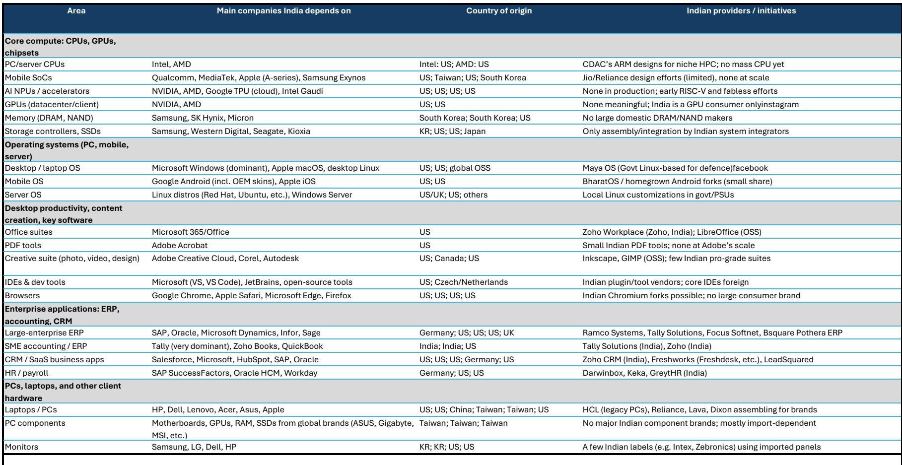
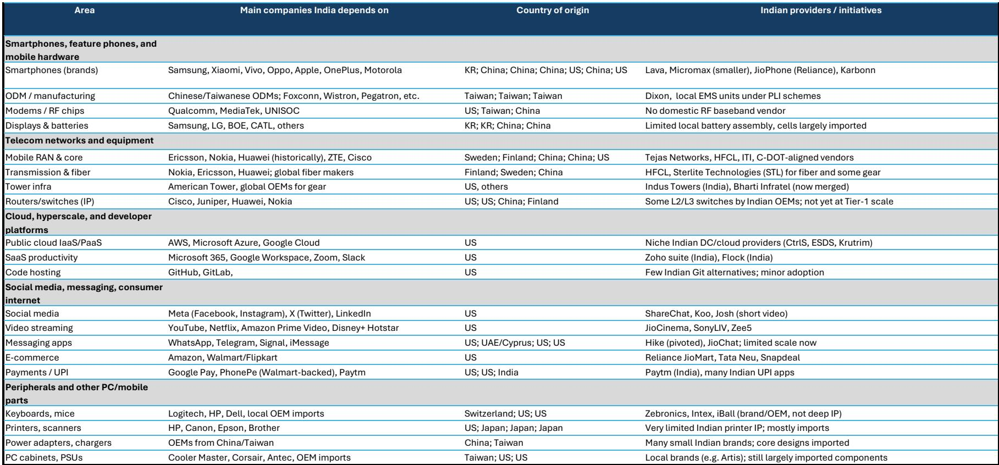
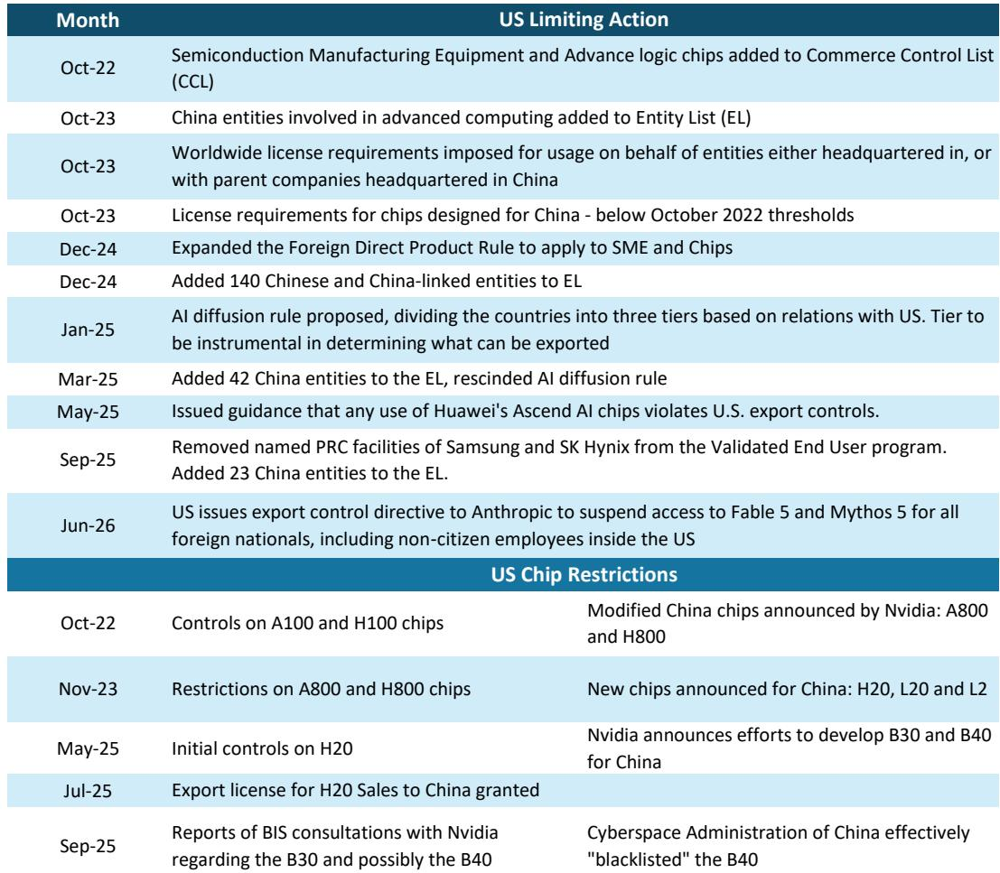

# Bernstein：印度真正需要的不是算力租用，而是自己的“DeepSeek 时刻”

这份来自Bernstein的研报，提出了一个在当下争论中容易被忽视的核心判断：印度无法在借来的模型上构建自己的AI未来。当市场将目光集中于算力基础设施的建设和应用层的快速迭代时，报告指出，一个更深层的结构性风险正在浮现——基础模型正在从开放的商品演变为受地缘政治管控的战略资产。对于印度而言，问题不在于是否要参与AI生态，而在于其在AI价值链上的定位是否可持续。

报告选择在此时重提这个话题，本身就意味着一种紧迫感。过去，关于“大语言模型不重要”的论调在印度技术圈并不少见。但近期美国对非公民访问最新AI模型的限制，将这一风险从理论推向了现实。这份研报的价值在于，它没有停留在对依赖性的泛泛批评，而是通过梳理印度信息技术产业的深层结构，解释了为什么印度没有出现自己的“DeepSeek 时刻”，并为决策者提供了一套权衡“开放”与“自主”的政策框架。

## 1. 基础模型不再是SaaS产品，而是正在成为受管控的“战斗机”

Bernstein报告的核心洞见在于对AI资产属性的重新定义。它指出，技术访问权在过去一直是被配给和管控的。从关键矿产和半导体设备，到GPU，再到如今对前沿模型本身的限制，这一趋势正在打破AI“全球化”的幻觉。报告以Anthropic最新模型对非美国公民的限制为例，认为这不再是孤立事件，而是新常态的开始。

这意味着，基础模型将从一种可以随意订阅的软件服务，转变为类似于“战斗机”的国家战略资源。其背后的逻辑是，谁控制了最前沿的模型，谁就掌握了定义下一个时代应用能力的钥匙。对于正在说服自己“基于外国LLM构建应用、靠数据中心收租”是明智AI战略的印度而言，这一判断具有深刻的警示意义。Bernstein并未全盘否定这种参与方式，但它明确警告：印度至少需要意识到，将核心AI模型外包出去所蕴含的风险。

## 2. 印度没有出现“DeepSeek 时刻”是结构性的，而非战略选择

一个看似矛盾的现象是：印度是全球数据的重要来源，却未能利用这一优势打造具有全球竞争力的生成式AI系统。报告认为，这种缺失是结构性的。印度科技生态长期以来以服务为导向，缺乏像搜索、社交媒体或即时通讯这样能产生丰富、结构化数据集的消费级平台。这种数据生态的匮乏，从未催生出构建基础模型所需的人才储备和学术深度。

更深层的原因在于，印度IT服务模式的“路径依赖”。在这种模式下，低成本劳动力本质上是为全球巨头开发的软件进行微调。这进一步固化了印度企业停留在应用层的倾向。报告指出，许多印度顶尖机构的负责人曾主张“印度不需要自己的大语言模型，只需聚焦AI应用”。Bernstein认为，这些观点并非深思熟虑的战略选择，而更多是印度走到今天这条路径的自然反应。这揭示了一个核心问题：印度的技术生态缺乏从底层创造“原生AI”的土壤。

## 3. 系统性依赖的真相：从互联网到AI，印度几乎在所有关键层都处于下游

报告通过详尽的表格（Exhibit 1和Exhibit 2）展示了印度在技术栈上的系统性依赖。从CPU、GPU等核心计算芯片，到操作系统、企业软件，再到云服务、社交媒体，印度几乎在所有关键层都依赖美国公司。这种依赖不是孤立的，而是贯穿整个技术栈的。过去，印度在互联网时代接受了这种模式——保持开放，让全球平台成为其数字经济运行的轨道。

但AI不同。报告认为，AI不仅仅是又一个应用层，它正在成为所有企业流程和消费者交互的底层“轨道”。更重要的是，现在还为时过早。与以往印度总是晚入场的技术周期不同，AI的轮廓仍在塑造之中。这正是当前关于“主权AI栈”争论的根源。印度并非突然发现了技术自主的重要性，而是因为错过这一波的代价将远高于以往。如果印度像过去一样等待20-30年才介入，这种依赖将被固化，价值捕获将在未来几十年被锁定在境外。

## 4. 真正的机会不在追赶通用模型，而在于掌控垂直领域的数据护城河

面对构建通用大模型的高昂成本和激烈竞争，Bernstein为印度指出了一个更务实的路径：拥有并利用其丰富的、特定领域的数据集，尤其是在工业和医疗保健等领域。这些数据集可以成为印度科技公司构建可防御的、更小、更专业的LLM的基础。

报告的核心逻辑是：保留并控制对高质量、难以复制的垂直数据的访问权。通过限制全球平台对这些数据集的无限访问，印度可以为本土企业创造可防御的“口袋阵地”。这些能力可以逐步演变为可扩展的解决方案，并最终作为全球产品出口。报告甚至指出了AI与物理世界结合的可能性，例如在训练工业机器人或下一代人形机器人时，特定工业场景的数据集可能比使用最前沿的通用AI模型更为关键。

这一判断意味着，印度AI领域的价值创造可能不会来自与OpenAI或Google的正面竞争，而是来自对特定行业知识的数字化和智能化。这并非追求万亿市值的科技巨头，而是通过将AI与真实世界的资产和工作流结合，在价值链中寻找属于自己的位置。

## 5. 政策框架的两难：在“访问”与“自主”之间，没有完美答案

报告在政策层面提出了一个坦率的框架，承认了决策的复杂性。它否定了“为国内企业圈定AI领域”这种缺乏现实可行性的想法。Bernstein提出了两个战略杠杆，但明确指出两者都不完美。

第一种选择是限制或放缓对全球AI模型的访问，同时将大量资本和人才引导至建设印度本土的LLM能力。这相当于“闭关修炼”，但可能在全球一体化的技术生态中导致自身孤立和落后。

第二种选择是强制或激励本地化——要求外国公司在印度建立并运营不受地缘政治管控的AI栈。这类似于“筑巢引凤”，但执行难度极大，且可能面临来自全球科技巨头的抵制。

这个框架的价值不在于给出了标准答案，而在于清晰地揭示了决策者需要面对的核心权衡：是选择短期内的技术访问便利，还是追求长期的战略自主。报告暗示，答案可能不是非此即彼，而更像是一种动态的、基于风险管理的组合策略。

## 报告尚未完全回答的关键问题：如何从“数据主权”跨越到“模型主权”？

尽管报告为印度AI战略提供了富有洞察力的分析框架，但它留下了一个关键问题：拥有数据是必要的，但这是否足以构建可持续的“模型主权”？

报告强调的垂直领域LLM路径，其成功依赖于几个尚未被充分验证的假设。首先，高质量的垂直数据集是否足以弥补算力、算法和顶尖人才上的差距？其次，在“应用层”上构建的垂直模型，其护城河是否足够深，能够抵御未来全球通用模型能力提升带来的“降维打击”？最后，印度科技公司是否有能力将这些垂直模型转化为在全球范围内具有竞争力的产品，而不仅仅是服务于本土市场的“替代品”？

这些问题，报告只是点到为止。它指出了方向，但并未给出如何从“数据拥有者”演变为“模型定义者”的具体路线图。而这恰恰是决定印度能否在AI时代真正改变其技术依赖地位的核心。

## 如何搭建你自己的观察框架

对于关注印度市场或全球科技供应链的读者，这份报告提供了一个三层过滤框架：

第一层，关注“依赖性”的演变。不要只看印度AI初创公司的融资新闻，而要追踪其底层模型的来源。如果大量高价值应用仍构建在外部模型之上，那么依赖模式并未改变。

第二层，追踪“垂直数据”的壁垒。观察印度本土企业是否在关键行业（如医疗影像、工业制造、农业）建立了独特且难以复制的数据集。这将是评估其未来议价能力的关键指标。

第三层，评估政策的“执行精度”。印度政府是否会采取报告提到的两种政策杠杆中的一种，或是寻找第三条道路？政策的执行力度和连贯性，将决定印度AI生态的最终走向。

这份Bernstein的研报，其价值不在于预测印度AI的未来，而在于为理解这个未来提供了一个冷静、结构化的分析起点。它提醒我们，在AI竞赛中，技术能力固然重要，但更深层的竞争，是关于战略选择、路径依赖和风险定价的较量。

Personal reading notes and learning share only. Not investment advice.

