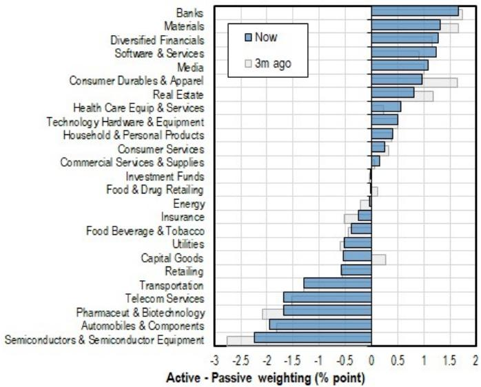
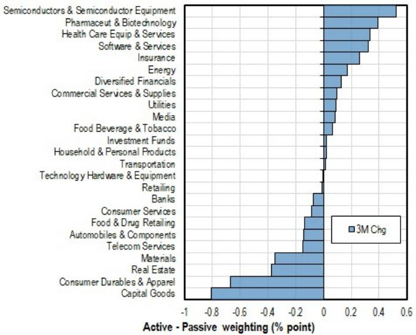
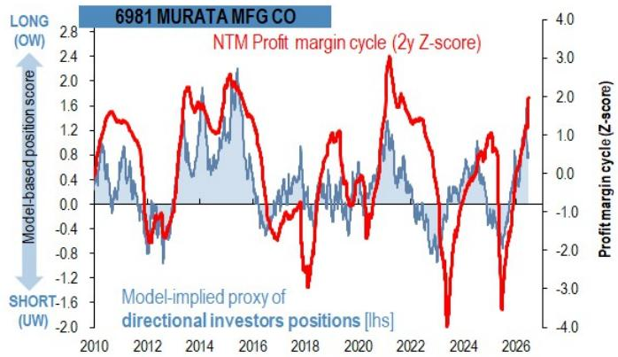

# JPM：市场低估了“供给瓶颈”在日本MLCC股中的定价权，而非AI需求本身

**主判断：** 当前日本MLCC相关股票的上涨，并非单纯由AI需求驱动，更核心的是其作为“供给瓶颈”环节所享有的超额利润定价权。这一轮上涨的结构与2000年代中期的EM商品热潮高度相似，真正的风险不在于需求见顶，而在于“瓶颈效应”向下游转移。

这份来自JPM量化与衍生品策略团队的研报，提供了一个与市场主流叙事截然不同的分析框架。大多数投资者将村田制作所与太阳诱电的强势表现归结为AI带来的基本面增长，但该报告从技术面和资金结构切入，认为这轮上涨的内在逻辑更接近“供给瓶颈溢价”的重现。报告的核心洞察在于：超额利润的可持续性，更多取决于企业在供应链网络中的“瓶颈位置”，而非其自身的竞争力。

为什么现在这个判断重要？因为市场正在将MLCC股票视为AI周期的纯受益者，却忽略了其背后一个更脆弱的结构性特征——高Beta、低Quality。这意味着一旦“瓶颈”转移，这些股票的调整速度可能远超基本面投资者的预期。报告提供了一个历史参照系，以及一套用于观察“瓶颈转移”的信号框架。

以下是对这份研报核心逻辑的拆解与延伸。

## 1. 超额利润的来源并非技术壁垒，而是供应链中的“瓶颈位置”

报告最引人注目的论点，是将当前MLCC股票的上涨与2000年代EM热潮中的特定日本股票进行对比。在EM热潮初期（2002-2005年），住友金属矿山（镍冶炼）、三井金属（超薄铜箔）、信越化学（硅片）以及新报国材料（低热膨胀合金）等公司，都曾经历过一段超额利润的爆发期。这些公司的共同点是什么？它们都处于当时全球供应链中难以快速扩产的“瓶颈环节”。

报告通过动态时间规整（DTW）方法，将当前MLCC股票的股价走势与上述EM热潮中的瓶颈股进行相似度测量，发现两者呈现出高度一致的模式。这意味着，当前市场对MLCC股票的定价，并非完全基于其技术领先或产品独特性，而是基于一个更结构性的前提：在AI需求爆发的背景下，MLCC的供给结构（寡头垄断、产能扩张缓慢）使其成为供应链中新的“瓶颈”。

**这意味着什么？** 对于投资者而言，评估这些公司价值的关键变量，不应仅仅是AI需求的增速，更应关注其“瓶颈地位”是否被其他环节侵蚀。一旦上游半导体、设备或材料环节出现新的瓶颈，资本可能会从MLCC板块快速撤离，转向新的“瓶颈资产”。这种转移并非因为MLCC公司本身变差了，而是超额利润的来源发生了位移。

## 2. 高Beta与低Quality的组合：短期动量的双刃剑

报告对MLCC相关股票及所属电气设备行业的因子结构进行了估算，发现一个值得警惕的特征：动量（Momentum）和贝塔（Beta）因子显著偏高，而质量（Quality）因子则处于低位。这意味着，当前股价的支撑主要来自价格趋势和市场相关性，而非盈利质量的持续改善。

从短期交易的角度看，这种因子组合反而意味着较高的预期回报。报告明确指出，核心买家是趋势跟踪型短期动量交易者，只要盈利边际改善的势头得以维持，这些交易者仍有建仓空间。然而，这种结构的脆弱性同样明显——一旦动量逆转，高Beta特性会放大下行速度，而低Quality意味着缺乏基本面支撑来缓冲下跌。

**这引申出一个关键问题：** 对于长线投资者而言，当前价格是否已经充分反映了“瓶颈溢价”？报告给出的暗示是，全球主动型投资信托对日本科技硬件与设备板块的配置仍处于中性至小幅低配状态，这意味着长期资本尚未大规模入场。但这恰恰可能成为未来价格修正时的买入力量，而非当前追高的理由。

## 3. 长期资本的转向正在为日本瓶颈股创造结构性“顺风”

报告的另一重要贡献，是将MLCC股票的走势置于全球资产配置的宏观叙事中。数据显示，全球主动型基金正在持续减少对中国（包括A股和港股）的区域配置，并将资金转向日本、韩国和台湾。这种“减中国、增日本”的再平衡，并非短期战术调整，而是基于地缘政治风险、供应链重构以及增长预期差异的战略性转移。

对于日本电气设备板块而言，这一资金流向构成了结构性的“顺风”。报告指出，日本电气设备行业（包含MLCC相关公司）是这一轮区域再平衡的主要受益者之一。当长期资本开始系统性增配日本时，那些处于供给瓶颈位置、具备定价权的公司，自然会获得额外的资金流入。

**这意味着，** MLCC股票的上涨逻辑并非孤立存在，而是与全球基金的区域配置调整形成了共振。这种共振一旦确立，其持续性可能超出许多投资者的预期。但与此同时，投资者需要警惕的是，区域配置的转向同样具有周期性，一旦中国资产重新获得吸引力，或者日本市场出现系统性风险，这股“顺风”也可能迅速转为逆风。

## 4. 报告尚未完全回答的关键问题：瓶颈转移的触发条件与时间窗口

报告最精彩的部分，是对EM热潮末期“瓶颈转移”的复盘。2007年下半年，EM相关股票集体崩盘，表面诱因是次贷危机，但JPM认为根本原因在于供给瓶颈从电子元器件转向了大宗商品和海运价格。当投机资本发现新的瓶颈环节出现时，它们迅速从原有的股票组合中撤出，转向新的目标。这种“瓶颈级联效应”导致了旧有板块的同步崩溃。

当前，报告认为MLCC板块尚未出现这种转移的明确信号。上游半导体、制造设备、HBM和CoWoS等环节仍处于扩张趋势，瓶颈位置大概率仍将停留在当前股票组合中。但这里存在一个尚未完全回答的问题：**“瓶颈转移”的触发条件是什么？** 是某个关键上游环节的产能突破？还是AI需求从训练侧转向推理侧带来的需求结构变化？抑或是地缘政治事件引发的供应链重塑？

报告提供了一个观察框架，但并未给出明确的时间表或阈值。例如，当上游半导体设备板块的利润增速开始超过MLCC板块时，是否就是转移的起点？当海运价格或大宗商品价格出现类似2007年的飙升时，是否意味着资本将再次大规模迁移？这些问题的答案，需要投资者结合后续的行业数据和资金流向进行动态判断。

## 5. 投资者的观察框架：三个关键信号与一个核心假设

综合报告的逻辑，我们可以提炼出一套用于跟踪“瓶颈转移”的观察框架，包含三个关键信号和一个核心假设。

**三个关键信号：**
1. **上游半导体与制造设备周期的位置：** 当这些环节的资本开支开始收缩，或出现新的、更难以突破的瓶颈时，超额利润可能向上游移动。
2. **长期海外资本的配置变化：** 如果全球主动型基金对日本电气设备板块的配置从低配转为超配，并且开始出现系统性减仓信号，可能是动量即将耗尽的预警。
3. **下一个瓶颈相关板块的崛起：** 密切关注大宗商品、海运、特定材料或封装环节是否出现类似2007年的价格飙升和利润爆发，这可能是资本迁移的前兆。

**一个核心假设：** 报告的分析建立在“AI boom仍处于早期至中期阶段”这一前提之上。如果AI需求意外见顶，或者技术路径发生重大变化，整个“瓶颈溢价”的逻辑将被颠覆。这是所有投资者在参考这份报告时必须明确的边界条件。

**最后，** 这份JPM报告的价值不仅在于它对MLCC股票的判断，更在于它提供了一个理解“供给瓶颈定价权”的分析框架。在供应链日益复杂、地缘政治风险加剧的时代，理解“瓶颈在哪里”以及“瓶颈将向哪里移动”，可能比单纯预测终端需求更具策略意义。对于那些希望深度参与日本科技股结构性行情的投资者而言，如何在这套框架下建立自己的跟踪体系，将决定他们能否在“瓶颈转移”发生之前做出正确的仓位调整。

Personal reading notes and learning share only. Not investment advice.

