CHINA CONSUMER DURABLES: APPLIANCE TRACKER

# May 2026: Still weak domestic demand yet base will ease into June, 618 in focus; exports sequentially improved

Domestic appliances data continued to demonstrate weakness on a high base for both retail and ex-factory shipment in May: 1) NBS home appliances and electronics retail sales fell by 16% yoy, a similar pace to Apr despite a more challenging base; 2) AC domestic ex-factory shipment came in below expectations at -15% yoy (vs -9% in the previous production plan as compiled by IOL), presumably impacted by front-loaded demand in the previous year and price hikes. Going forward, we view it as likely that domestic demand growth will remain under pressure in early June due to a high base. However, base pressure may sequentially ease into late June/July as the trade-in boost started to fade from June last year. Specifically for 618, initial sales data does not look encouraging, against low market expectations. Moreover, we noted lower prices vs Singles' Day for select brands, which may indicate that brands resorted to promotion to boost demand despite rising input costs.

Appliances exports growth sequentially improved and beat IOL and market expectations in May. Overall appliances exports growth accelerated to HSD% growth in May with a lower base per customs data. The AC exports decline also narrowed and came in above previous production plan (-4% yoy in May). Consumer sentiment in the US/Europe and US housing sales data also demonstrated sequential improvements recently. Going forward, as details become available following the signing of the US-Iran Memorandum of Understanding, visibility around demand could improve, providing scope for leading Chinese players to further gain share in overseas markets, especially those with product portfolios with a strong value proposition.

On cyclical factors, shipping rates further increased in the past month. Key commodities costs stayed largely stable in the past month. Regarding stock ideas, we continue to favor Buy-rated Midea (A/H) as we see limited downside risk protected by shareholder returns and upside potential from overseas markets and emerging business. We continue to hold a constructive view on Ninebot for its growth potential from a comprehensive product line-up, including share gains in the domestic E2W market, structural growth of robotic lawn mowers and overseas E2W potential, against a near historical low valuation. We also like Hisense Home Appliances on stabilizing central AC business, sequentially recovering revenue growth/profitability off easing bases, and mid to long-term margin expansion

Nicolas Yi
+86(21)2401-8922 |
nicolas.yi@goldmansachs.cn
GS (China) Securities
Company Limited

Cecilia Tang
+86(21)2401-8738 |
cecilia.tang@goldmansachs.cn
GS (China) Securities
Company Limited

potential with downside protected by dividend yield.  
Exhibit 1: Domestic data continued to show weakness, while exports data sequentially improved in May
Appliances data dashboard

<table><tr><td rowspan="2"></td><td colspan="14">yoy growth (%)</td><td colspan="3">MoM trend</td><td colspan="3">vs. 2019 CAGR</td><td colspan="3">MoM trend</td></tr><tr><td>Apr-25</td><td>May-25</td><td>Jun-25</td><td>Jul-25</td><td>Aug-25</td><td>Sep-25</td><td>Oct-25</td><td>Nov-25</td><td>Dec-25</td><td>Jan-26</td><td>Feb-26</td><td>Mar-26</td><td>Apr-26</td><td>May-26</td><td>Mar-26</td><td>Apr-26</td><td>May-26</td><td>Mar-26</td><td>Apr-26</td><td>May-26</td><td>Mar-26</td><td>Apr-26</td><td>May-26</td></tr><tr><td colspan="24">Retail sales</td></tr><tr><td>NBS (above designated size)</td><td>39%</td><td>53%</td><td>32%</td><td>29%</td><td>14%</td><td>3%</td><td>-15%</td><td>-19%</td><td>-19%</td><td>3%</td><td></td><td>-5%</td><td>-15%</td><td>-16%</td><td>▼</td><td>▼</td><td>—</td><td>9%</td><td>5%</td><td>4%</td><td>▲</td><td>▼</td><td>—</td></tr><tr><td colspan="24">Ex-factory shipment</td></tr><tr><td colspan="24">Total shipment</td></tr><tr><td>Split AC</td><td>2%</td><td>2%</td><td>4%</td><td>2%</td><td>-1%</td><td>-10%</td><td>-20%</td><td>-32%</td><td>-19%</td><td>12%</td><td>-20%</td><td>-2%</td><td>-9%</td><td>-11%</td><td>▲</td><td>▼</td><td>▼</td><td>5%</td><td>2%</td><td>2%</td><td>▼</td><td>▼</td><td>▲</td></tr><tr><td>Washing machine</td><td>12%</td><td>10%</td><td>4%</td><td>9%</td><td>7%</td><td>8%</td><td>-2%</td><td>8%</td><td>7%</td><td>4%</td><td>9%</td><td>1%</td><td>4%</td><td></td><td>▼</td><td>▲</td><td></td><td>3%</td><td>4%</td><td></td><td>▼</td><td>▲</td><td></td></tr><tr><td>Refrigerator</td><td>0%</td><td>2%</td><td>1%</td><td>5%</td><td>2%</td><td>0%</td><td>-6%</td><td>-3%</td><td>-3%</td><td>9%</td><td>2%</td><td>-4%</td><td>6%</td><td></td><td>▼</td><td>▲</td><td></td><td>2%</td><td>4%</td><td></td><td>▼</td><td>▲</td><td></td></tr><tr><td>VRF</td><td>-20%</td><td>-20%</td><td>-18%</td><td>-1%</td><td>1%</td><td>2%</td><td>-5%</td><td>-1%</td><td>-2%</td><td>15%</td><td>-16%</td><td>-8%</td><td>-5%</td><td></td><td>▲</td><td>▲</td><td></td><td>5%</td><td>1%</td><td></td><td>▼</td><td>▼</td><td></td></tr><tr><td colspan="24">Domestic shipment</td></tr><tr><td>Split AC</td><td>4%</td><td>13%</td><td>16%</td><td>14%</td><td>1%</td><td>-3%</td><td>-21%</td><td>-40%</td><td>-27%</td><td>15%</td><td>-21%</td><td>6%</td><td>-7%</td><td>-15%</td><td>▲</td><td>▼</td><td>▼</td><td>5%</td><td>2%</td><td>2%</td><td>▲</td><td>▼</td><td>—</td></tr><tr><td>Washing machine</td><td>8%</td><td>15%</td><td>1%</td><td>1%</td><td>1%</td><td>-7%</td><td>-9%</td><td>-5%</td><td>-10%</td><td>-3%</td><td>-8%</td><td>-6%</td><td>-6%</td><td></td><td>▲</td><td>▼</td><td></td><td>-2%</td><td>1%</td><td></td><td>▼</td><td>▲</td><td></td></tr><tr><td>Refrigerator</td><td>0%</td><td>14%</td><td>12%</td><td>8%</td><td>6%</td><td>-7%</td><td>-11%</td><td>-16%</td><td>-13%</td><td>2%</td><td>-24%</td><td>-5%</td><td>-4%</td><td></td><td>▲</td><td>▲</td><td></td><td>-2%</td><td>0%</td><td></td><td>▼</td><td>▲</td><td></td></tr><tr><td>VRF</td><td>-25%</td><td>-26%</td><td>-20%</td><td>-3%</td><td>3%</td><td>1%</td><td>-5%</td><td>-1%</td><td>-5%</td><td>14%</td><td>-21%</td><td>-10%</td><td>-6%</td><td></td><td>▲</td><td>▲</td><td></td><td>4%</td><td>-1%</td><td></td><td>▼</td><td>▼</td><td></td></tr><tr><td colspan="24">Export shipment</td></tr><tr><td>Split AC</td><td>0%</td><td>-13%</td><td>-13%</td><td>-16%</td><td>-4%</td><td>-18%</td><td>-19%</td><td>-26%</td><td>-13%</td><td>10%</td><td>-19%</td><td>-10%</td><td>-12%</td><td>-4%</td><td>▲</td><td>▼</td><td>▲</td><td>4%</td><td>2%</td><td>3%</td><td>▼</td><td>▼</td><td>▲</td></tr><tr><td>Washing machine</td><td>17%</td><td>6%</td><td>5%</td><td>17%</td><td>12%</td><td>24%</td><td>6%</td><td>23%</td><td>25%</td><td>11%</td><td>26%</td><td>7%</td><td>14%</td><td></td><td>▼</td><td>▲</td><td></td><td>9%</td><td>10%</td><td></td><td>▼</td><td>▲</td><td></td></tr><tr><td>Refrigerator</td><td>-1%</td><td>-6%</td><td>-5%</td><td>3%</td><td>-1%</td><td>8%</td><td>-1%</td><td>10%</td><td>8%</td><td>14%</td><td>24%</td><td>-3%</td><td>13%</td><td></td><td>▼</td><td>▲</td><td></td><td>10%</td><td>8%</td><td></td><td>▼</td><td>▼</td><td></td></tr><tr><td>VRF</td><td>12%</td><td>30%</td><td>-3%</td><td>11%</td><td>-13%</td><td>14%</td><td>-9%</td><td>2%</td><td>19%</td><td>22%</td><td>9%</td><td>5%</td><td>1%</td><td></td><td>▼</td><td>▼</td><td></td><td>18%</td><td>16%</td><td></td><td>▼</td><td>▼</td><td></td></tr></table>

Source: AVC, IOL, NBS, Data compiled by GS Global Investment Research

## Ex-factory shipments showed divergence between domestic and exports

According to China Industry Online (IOL), AC total ex-factory shipments growth weakened to -11% yoy in May (vs -9% yoy in Apr), with weaker growth from domestic (-15% yoy in May vs -7% yoy in Apr) but better growth from exports (-4% yoy in May vs -12% yoy in Apr). Compared to previous production plans, domestic came lower than expected but exports came above (vs -9% and -6% yoy of previous production plan respectively). Similar to previous months, we note that overall exports by Chinese players should be greater than that indicated by IOL export data as leading companies such as Midea also export from their overseas factories.

Domestic shipment came in weaker than expected by IOL in May on a high base, consistent with continued weakness from retail sales, presumably impacted by front-loaded demand in the previous year and price hikes since Apr. Going forward, IOL revised down the growth forecast to a low-teens % decline (vs previously SD% yoy decline) for major white goods in 2Q26 on the back of weak demand.

Exports sequentially improved and came in better than expected in May. Apart from a lower base, exports showed resilience despite the Middle East conflict, likely supported by Chinese players' continued share gains. Property sales data (Exhibit 12) in DM and consumer sentiment (Exhibit 11) both showed sequential improvements in the past month. Going forward, the current production plan still indicates SD% yoy exports decline for major white goods in 2Q26 with relatively better growth from refrigerators and washing machines vs AC.

By brand, Haier and Hisense outpaced the industry in terms of total shipments growth, while Gree and Midea lagged. Haier's total AC ex-factory shipments were up by 6% yoy, underpinned by +5%/+10% domestic/exports growth. Hisense's total AC ex-factory shipments decreased by 8% yoy in May, underpinned by +3%/-17% domestic/exports growth. Midea's total AC ex-factory shipments decreased by 23% yoy in May, with a wider decline of domestic and but better exports (-35% and +4% yoy). Gree's total AC ex-factory shipments decreased by 13% yoy in May, with above-industry domestic but below-industry exports (-6% and -33% yoy).

Total ex-factory shipment volume growth for washing machines/refrigerators demonstrated improving trends in Apr.

\- Washing machine total shipments growth improved to $+4\%$ yoy in Apr (vs $+1\%$ yoy in Mar). Domestic decline stayed stable at $-6\%$ yoy in Apr, but exports growth improved to $+14\%$ yoy (vs $+7\%$ yoy in Mar). By brand, both Midea and Haier came in below industry. Midea's total shipments were up by $+3\%$ yoy in Apr, with domestic/export shipments growing by $-1\%/ +8\%$ yoy. Haier's total shipments were flattish yoy in Apr, with domestic/exports growth of $-1\%/ +2\%$ yoy.

Refrigerator total shipments growth improved to +6% yoy in Apr (vs -4% yoy in Mar). Domestic sales narrowed slightly to -4% yoy in Apr (vs -5% yoy in Mar), and exports growth turned positive to +6% yoy (vs -3% yoy in Mar). By brand, Midea and Hisense came above industry but Haier came below in Apr. Midea's total shipments grew by +25% yoy, with domestic/export shipments growing by +25%/+26% yoy. Hisense's total shipments grew by +15% yoy, with domestic/overseas shipments growth

+2%/+21% yoy. Haier's total shipments were flattish yoy, of which domestic/exports growth -24%/+36% yoy.

Total shipment value for variable refrigerant flow systems (VRF) decreased by 5% in Apr, narrowed from -8% yoy in Mar. Domestic shipment decline narrowed but export shipment growth moderated (domestic/exports -6%/+1% yoy in Apr vs -10%/+5% yoy in Mar). By brand, in domestic market growth, Midea, Gree and Hisense-Hitachi came above industry at -2%/-2%/-3% yoy, while Daikin lagged at -10% yoy. For exports, Midea and Daikin showed faster growth vs the industry average.

May ex-factory shipment data for refrigerators/washing machines/refrigerant flow systems will be released at the end of June.

Exhibit 2: AC domestic ex-factory shipment growth weakened sequentially in May
Domestic ex-factory shipment vol. (10,000 units)  
  
Source: IOL, Data compiled by GS Global Investment Research

Exhibit 3: AC domestic shipment moderated in May (-15% yoy in May vs -7% yoy in Apr)...

AC domestic ex-factory shipment vol. (LHS, 10,000 units); yoy growth (RHS, %)

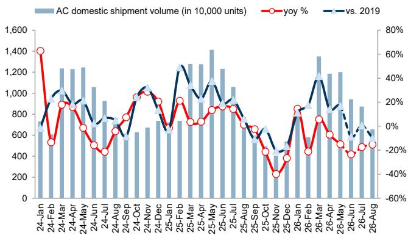  
Source: IOL  
Washing machine domestic ex-factory shipment vol. (LHS, 10,000 units); yoy growth (RHS, %)

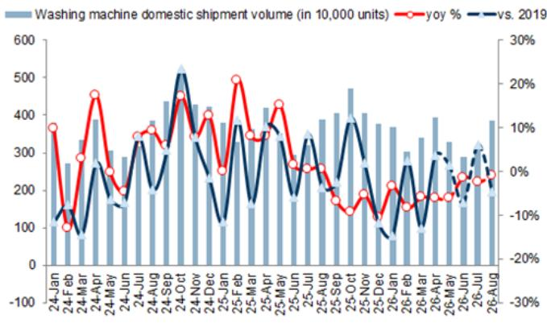  
Source: IOL  
Exhibit 7: Domestic refrigerator ex-factory shipments improved to -4% yoy growth in Apr
Refrigerator domestic ex-factory shipment vol. (LHS, 10,000 units); yoy growth (RHS, %)

Exhibit 4: ...with Midea/Gree/Haier/Hisense's domestic shipments growing by -35%/-6%/+5%/-5% yoy in May AC ex-factory domestic shipment yoy growth by company

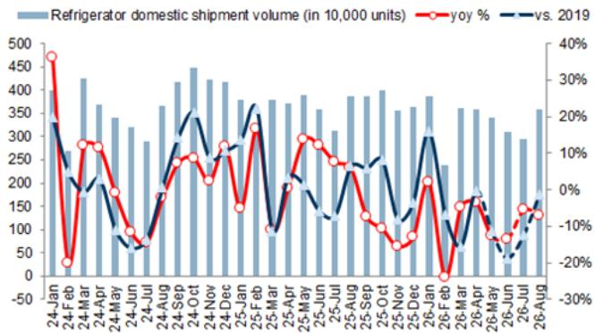

Exhibit 5: Washing machine domestic shipment growth stayed at -6% yoy in Apr  
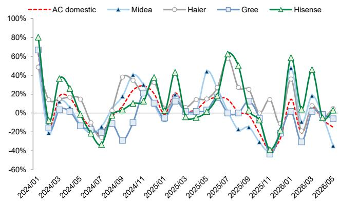  
Source: IOL  
Exhibit 6: Haier/Midea grew above industry at -1%/-1% yoy in Apr  
Washing machine (WM) domestic ex-factory shipment yoy growth by company

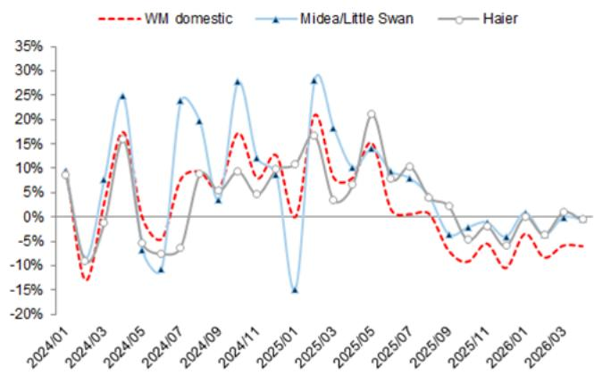  
Source: IOL  
Source: IOL  
Exhibit 8: Midea/Haier came above/in-line with the industry at +25%/-4% yoy growth in Apr
Refrigerator domestic ex-factory shipment yoy growth by company

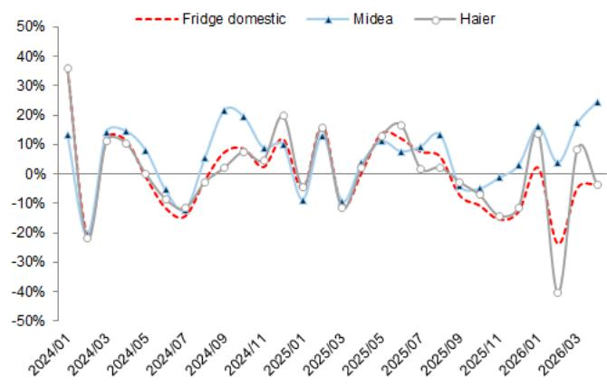  
Source: IOL

Washing machine export ex-factory shipment vol. (LHS, 10,000 units); yoy growth (RHS, %)

Exhibit 9: Domestic VRF ex-factory sales improved to -6% yoy in Apr
VRF domestic sales (LHS, RMB mn); yoy growth (RHS, %)  
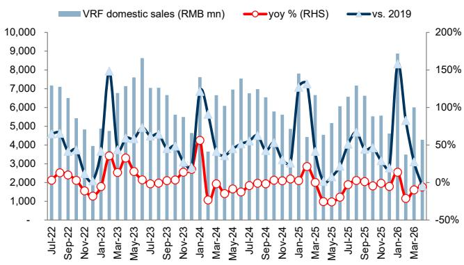  
Source: IOL

Exhibit 10: Gree, Midea and Hisense-Hitachi came above industry, while Daikin lagged
VRF domestic sales yoy growth by company  
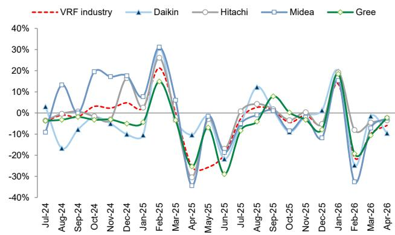  
Source: IOL

Exhibit 11: China white goods exports improved in Apr, with better EU/US consumer sentiment in May/Jun  
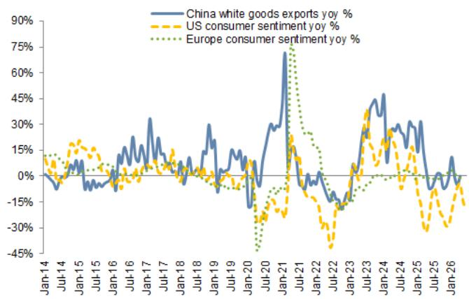  
Source: IOL, University of Michigan

Exhibit 12: US pending home sales, a leading indicator of existing home sales, showed improvements in May  
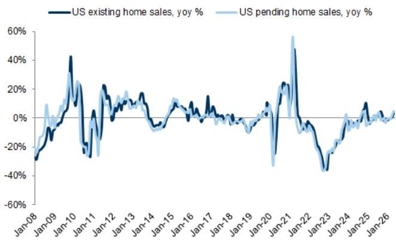  
Source: Bureau of Economic Analysis, Wind, National Association of Realtors (NAR)  
Exhibit 13: AC ex-factory export shipments decreased by 4% yoy in May, up from -12% yoy in Apr
AC export ex-factory shipment vol. (LHS, 10,000 units); yoy growth (RHS, %)

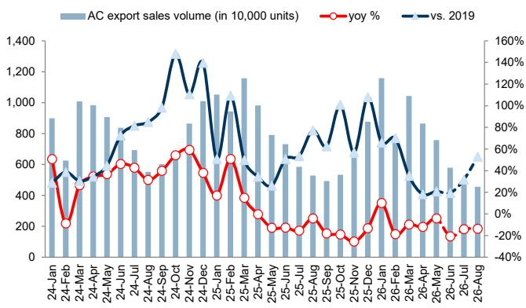  
Source: IOL  
Exhibit 14: Washing machine export growth was +14% yoy in Apr, vs. +7% yoy in Mar

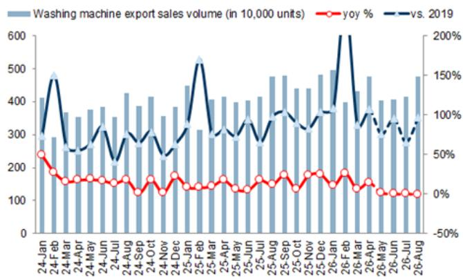  
Source: IOL

Exhibit 15: Refrigerator export shipment growth improved to +13% yoy in Apr, vs. -3% yoy in Mar  
Refrigerator export ex-factory shipment vol. (LHS, 10,000 units); yoy growth (RHS, %)  
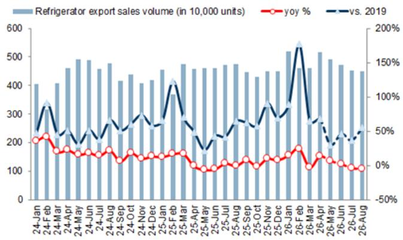  
Source: IOL

Exhibit 17: Shipping rates increased in the past month...
Weekly CCFI  
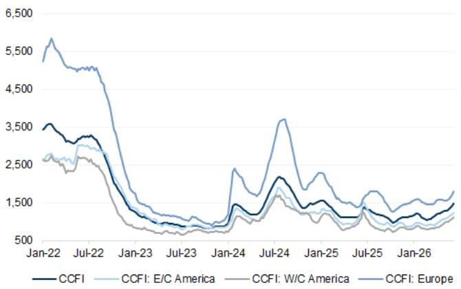  
Source: Wind

## Exhibit 16: VRF export ex-factory sales grew +1% yoy in Apr

VRF export sales (LHS, RMB mn); yoy growth (RHS, %)  
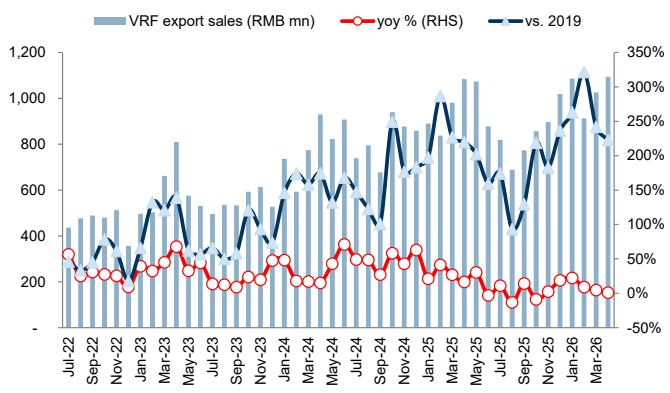  
Source: IOL

Exhibit 18: ... and yoy growth increased as of mid-June
Weekly CCFI yoy growth %  
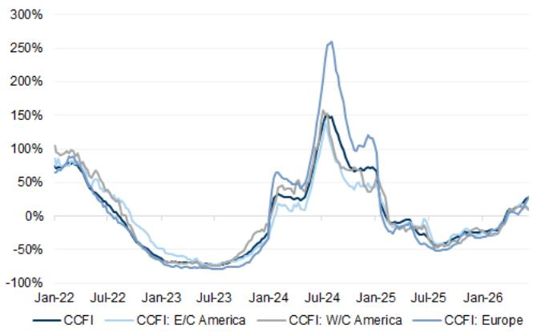  
Source: Wind

## Retail sales remained weak on a higher base

Retail sales growth showed a similar yoy decline in May as in Apr, despite an elevated base. NBS home appliances and electronics retail sales decreased by 16% yoy in May, a similar pace vs -15% yoy in Apr.

Product wise, while most categories continued to record yoy declines in May, electric water heaters and dishwashers relatively outperformed with positive growth in the online channel. Channel wise, more categories showed better online growth vs. offline in May, similar to previous months.

Regarding pricing, ASP growth continued to show mixed trends in May. Select small appliances such as pressure cookers and soymilk makers showed positive ASP growth in both online and offline channels, while select white goods and small appliances such as AC, washing machine and RVC exhibited ASP growth pressure yoy. Based on our AC price tracking for entry-level products, we noticed select brands including Midea, Haier and Xiaomi lowered prices vs 2025 Singles' Day, though higher than last year's 618, while Gree largely maintained their prices vs 2025 Singles' Day.

Brand-wise, leading white goods companies generally showed similar yoy declines as the industry on Tmall+Taobao in May. In cleaning appliances, Roborock relatively outperformed with a smaller decline vs. the industry on Tmall+Taobao in May, while Ecovacs was in-line with the industry. In small kitchen appliances, Morphy Richards outperformed with positive yoy growth on Tmall+Taobao in May, while Bear relatively lagged.

Exhibit 19: Online appliances sales continued to show yoy growth pressure in May Sales/Volume/ASP yoy growth by category on Tmall & Taobao

<table><tr><td rowspan="2" colspan="2"></td><td colspan="5">Sales (% yoy)</td><td colspan="5">Volume (% yoy)</td><td colspan="5">ASP (% yoy)</td></tr><tr><td>May-25</td><td>Mar-26</td><td>Apr-26</td><td>May-26</td><td>MoM Trend</td><td>May-25</td><td>Mar-26</td><td>Apr-26</td><td>May-26</td><td>MoM Trend</td><td>May-25</td><td>Mar-26</td><td>Apr-26</td><td>May-26</td><td>MoM Trend</td></tr><tr><td colspan="17">Tmall &amp; Taobao</td></tr><tr><td colspan="2">Major home appliances</td><td>16%</td><td>-9%</td><td>-25%</td><td>-50%</td><td>▼</td><td>-22%</td><td>6%</td><td>-13%</td><td>-24%</td><td>▼</td><td>50%</td><td>-14%</td><td>-14%</td><td>-35%</td><td>▼</td></tr><tr><td colspan="2">Kitchen appliances</td><td>-1%</td><td>-18%</td><td>-12%</td><td>-50%</td><td>▼</td><td>-14%</td><td>1%</td><td>-9%</td><td>-22%</td><td>▼</td><td>15%</td><td>-19%</td><td>-3%</td><td>-36%</td><td>▼</td></tr><tr><td colspan="2">Small kitchen appliances</td><td>-17%</td><td>-5%</td><td>-2%</td><td>-15%</td><td>▼</td><td>-23%</td><td>7%</td><td>-13%</td><td>-8%</td><td>▲</td><td>8%</td><td>-11%</td><td>12%</td><td>-8%</td><td>▼</td></tr><tr><td rowspan="3">Cleaning appliances</td><td>RVC</td><td>45%</td><td>3%</td><td>-42%</td><td>-53%</td><td>▼</td><td>34%</td><td>-18%</td><td>-40%</td><td>-46%</td><td>▼</td><td>8%</td><td>26%</td><td>-4%</td><td>-13%</td><td>▼</td></tr><tr><td>Wet dry vacuums</td><td>7%</td><td>-6%</td><td>-47%</td><td>-54%</td><td>▼</td><td>31%</td><td>27%</td><td>-37%</td><td>-36%</td><td>▲</td><td>-18%</td><td>-26%</td><td>-15%</td><td>-28%</td><td>▼</td></tr><tr><td>Vacuum cleaners</td><td>-19%</td><td>1%</td><td>-48%</td><td>-60%</td><td>▼</td><td>-21%</td><td>-9%</td><td>-28%</td><td>-31%</td><td>▼</td><td>3%</td><td>12%</td><td>-28%</td><td>-42%</td><td>▼</td></tr><tr><td colspan="2">Projectors</td><td>-2%</td><td>-55%</td><td>-58%</td><td>-43%</td><td>▲</td><td>-31%</td><td>-35%</td><td>-42%</td><td>-15%</td><td>▲</td><td>43%</td><td>-30%</td><td>-27%</td><td>-33%</td><td>▼</td></tr><tr><td colspan="2">Home furniture</td><td>-6%</td><td>-16%</td><td>-17%</td><td>-25%</td><td>▼</td><td>-18%</td><td>-3%</td><td>-5%</td><td>-19%</td><td>▼</td><td>15%</td><td>-13%</td><td>-12%</td><td>-8%</td><td>▲</td></tr><tr><td colspan="17">JD</td></tr><tr><td colspan="2">Major home appliances</td><td>8%</td><td>-26%</td><td>-19%</td><td>-8%</td><td>▲</td><td>1%</td><td>-3%</td><td>4%</td><td>17%</td><td>▲</td><td>7%</td><td>-24%</td><td>-23%</td><td>-22%</td><td>▲</td></tr><tr><td colspan="2">Kitchen appliances</td><td>44%</td><td>-22%</td><td>-22%</td><td>-22%</td><td>▼</td><td>57%</td><td>-5%</td><td>-12%</td><td>-9%</td><td>▲</td><td>-9%</td><td>-17%</td><td>-12%</td><td>-15%</td><td>▼</td></tr><tr><td colspan="2">Small kitchen appliances</td><td>54%</td><td>-16%</td><td>-8%</td><td>-23%</td><td>▼</td><td>35%</td><td>-11%</td><td>4%</td><td>1%</td><td>▼</td><td>14%</td><td>-5%</td><td>-11%</td><td>-23%</td><td>▼</td></tr><tr><td rowspan="3">Cleaning appliances</td><td>RVC</td><td>47%</td><td>-48%</td><td>-43%</td><td>26%</td><td>▲</td><td>21%</td><td>-46%</td><td>-40%</td><td>33%</td><td>▲</td><td>21%</td><td>-4%</td><td>-5%</td><td>-5%</td><td>▼</td></tr><tr><td>Wet dry vacuums</td><td>41%</td><td>-10%</td><td>-12%</td><td>24%</td><td>▲</td><td>20%</td><td>6%</td><td>19%</td><td>39%</td><td>▲</td><td>18%</td><td>-14%</td><td>-26%</td><td>-10%</td><td>▲</td></tr><tr><td>Vacuum cleaners</td><td>64%</td><td>-24%</td><td>-20%</td><td>-19%</td><td>▲</td><td>54%</td><td>-11%</td><td>-10%</td><td>-17%</td><td>▼</td><td>6%</td><td>-15%</td><td>-11%</td><td>-3%</td><td>▲</td></tr><tr><td colspan="2">Projectors</td><td>9%</td><td>-20%</td><td>1%</td><td>-17%</td><td>▼</td><td>-17%</td><td>-20%</td><td>-1%</td><td>-20%</td><td>▼</td><td>32%</td><td>0%</td><td>2%</td><td>4%</td><td>▲</td></tr><tr><td colspan="2">Home furniture</td><td>80%</td><td>-26%</td><td>-21%</td><td>-25%</td><td>▼</td><td>41%</td><td>8%</td><td>14%</td><td>6%</td><td>▼</td><td>27%</td><td>-32%</td><td>-31%</td><td>-29%</td><td>▲</td></tr><tr><td colspan="17">Tmall &amp; Taobao + JD</td></tr><tr><td colspan="2">Major home appliances</td><td>12%</td><td>-19%</td><td>-22%</td><td>-31%</td><td>▼</td><td>-16%</td><td>3%</td><td>-8%</td><td>-10%</td><td>▼</td><td>34%</td><td>-21%</td><td>-15%</td><td>-23%</td><td>▼</td></tr><tr><td colspan="2">Kitchen appliances</td><td>27%</td><td>-21%</td><td>-20%</td><td>-30%</td><td>▼</td><td>33%</td><td>-4%</td><td>-11%</td><td>-12%</td><td>▼</td><td>-4%</td><td>-18%</td><td>-9%</td><td>-21%</td><td>▼</td></tr><tr><td colspan="2">Small kitchen appliances</td><td>-4%</td><td>-8%</td><td>-4%</td><td>-18%</td><td>▼</td><td>-10%</td><td>1%</td><td>-8%</td><td>-5%</td><td>▲</td><td>6%</td><td>-9%</td><td>5%</td><td>-13%</td><td>▼</td></tr><tr><td rowspan="3">Cleaning appliances</td><td>RVC</td><td>46%</td><td>-31%</td><td>-43%</td><td>-20%</td><td>▲</td><td>27%</td><td>-34%</td><td>-40%</td><td>-9%</td><td>▲</td><td>14%</td><td>4%</td><td>-5%</td><td>-13%</td><td>▼</td></tr><tr><td>Wet dry vacuums</td><td>16%</td><td>-8%</td><td>-31%</td><td>-29%</td><td>▲</td><td>26%</td><td>16%</td><td>-8%</td><td>-3%</td><td>▲</td><td>-8%</td><td>-20%</td><td>-24%</td><td>-26%</td><td>▼</td></tr><tr><td>Vacuum cleaners</td><td>-2%</td><td>-10%</td><td>-36%</td><td>-46%</td><td>▼</td><td>1%</td><td>-10%</td><td>-21%</td><td>-25%</td><td>▼</td><td>-3%</td><td>0%</td><td>-20%</td><td>-28%</td><td>▼</td></tr><tr><td colspan="2">Projectors</td><td>2%</td><td>-45%</td><td>-43%</td><td>-34%</td><td>▲</td><td>-26%</td><td>-30%</td><td>-28%</td><td>-17%</td><td>▲</td><td>37%</td><td>-21%</td><td>-20%</td><td>-20%</td><td>▼</td></tr><tr><td colspan="2">Home furniture</td><td>8%</td><td>-19%</td><td>-18%</td><td>-25%</td><td>▼</td><td>-12%</td><td>-1%</td><td>-2%</td><td>-15%</td><td>▼</td><td>23%</td><td>-18%</td><td>-16%</td><td>-12%</td><td>▲</td></tr></table>

Source: Moojing, Data compiled by GS Global Investment Research

Exhibit 20: Leading white goods companies showed similar growth pressure as the industry in May, while leading players in cleaning appliances and small kitchen appliances recorded divergent growth rates
Market share/Sales/Volume/ASP yoy growth by company on EC channel (Tmall & Taobao only)

<table><tr><td rowspan="2"></td><td colspan="5">Market share</td><td colspan="5">Sales (% yoy)</td><td colspan="5">Volume (% yoy)</td><td colspan="5">ASP (% yoy)</td></tr><tr><td>May-25</td><td>Mar-26</td><td>Apr-26</td><td>May-26</td><td>YoY Trend</td><td>May-25</td><td>Mar-26</td><td>Apr-26</td><td>May-26</td><td>MoM Trend</td><td>May-25</td><td>Mar-26</td><td>Apr-26</td><td>May-26</td><td>MoM Trend</td><td>May-25</td><td>Mar-26</td><td>Apr-26</td><td>May-26</td><td>MoM Trend</td></tr><tr><td colspan="21">Major home appliances</td></tr><tr><td>Midea</td><td>16%</td><td>19%</td><td>13%</td><td>20%</td><td>▲</td><td>52%</td><td>6%</td><td>-35%</td><td>-52%</td><td>▼</td><td>37%</td><td>2%</td><td>-31%</td><td>-49%</td><td>▼</td><td>11%</td><td>4%</td><td>-6%</td><td>-6%</td><td>▼</td></tr><tr><td>Haier</td><td>15%</td><td>21%</td><td>14%</td><td>20%</td><td>▲</td><td>28%</td><td>1%</td><td>-34%</td><td>-47%</td><td>▼</td><td>17%</td><td>14%</td><td>-30%</td><td>-35%</td><td>▼</td><td>9%</td><td>-11%</td><td>-5%</td><td>-19%</td><td>▼</td></tr><tr><td>Gree</td><td>6%</td><td>4%</td><td>4%</td><td>8%</td><td>▲</td><td>37%</td><td>-25%</td><td>-33%</td><td>-50%</td><td>▼</td><td>-17%</td><td>-43%</td><td>-47%</td><td>-69%</td><td>▼</td><td>65%</td><td>32%</td><td>25%</td><td>62%</td><td>▲</td></tr><tr><td>Little Swan</td><td>4%</td><td>6%</td><td>4%</td><td>6%</td><td>▲</td><td>25%</td><td>2%</td><td>-8%</td><td>-46%</td><td>▼</td><td>-10%</td><td>13%</td><td>14%</td><td>-25%</td><td>▼</td><td>39%</td><td>-10%</td><td>-19%</td><td>-28%</td><td>▼</td></tr><tr><td>Hisense</td><td>3%</td><td>4%</td><td>3%</td><td>4%</td><td>▲</td><td>41%</td><td>3%</td><td>-5%</td><td>-41%</td><td>▼</td><td>15%</td><td>-2%</td><td>-15%</td><td>-36%</td><td>▼</td><td>23%</td><td>6%</td><td>11%</td><td>-8%</td><td>▼</td></tr><tr><td colspan="21">Kitchen appliances</td></tr><tr><td>Robam</td><td>20%</td><td>16%</td><td>11%</td><td>16%</td><td>▼</td><td>61%</td><td>-22%</td><td>-35%</td><td>-65%</td><td>▼</td><td>44%</td><td>-58%</td><td>-53%</td><td>-67%</td><td>▼</td><td>12%</td><td>86%</td><td>36%</td><td>5%</td><td>▼</td></tr><tr><td>Vatti</td><td>12%</td><td>10%</td><td>7%</td><td>9%</td><td>▼</td><td>56%</td><td>-26%</td><td>-18%</td><td>-66%</td><td>▼</td><td>25%</td><td>-44%</td><td>-46%</td><td>-64%</td><td>▼</td><td>25%</td><td>33%</td><td>51%</td><td>-8%</td><td>▼</td></tr><tr><td colspan="21">Cleaning appliances</td></tr><tr><td>Ecovacs</td><td>28%</td><td>37%</td><td>17%</td><td>52%</td><td>▲</td><td>58%</td><td>22%</td><td>-28%</td><td>-54%</td><td>▼</td><td>15%</td><td>65%</td><td>20%</td><td>-14%</td><td>▼</td><td>37%</td><td>-26%</td><td>-40%</td><td>-46%</td><td>▼</td></tr><tr><td>Roborock</td><td>27%</td><td>26%</td><td>16%</td><td>58%</td><td>▲</td><td>128%</td><td>78%</td><td>1%</td><td>-43%</td><td>▼</td><td>93%</td><td>43%</td><td>39%</td><td>-38%</td><td>▼</td><td>18%</td><td>25%</td><td>-28%</td><td>-9%</td><td>▲</td></tr><tr><td>Tineco</td><td>29%</td><td>27%</td><td>13%</td><td>39%</td><td>▲</td><td>-12%</td><td>19%</td><td>-42%</td><td>-60%</td><td>▼</td><td>6%</td><td>8%</td><td>13%</td><td>-26%</td><td>▼</td><td>-17%</td><td>11%</td><td>-49%</td><td>-46%</td><td>▲</td></tr><tr><td colspan="21">Projector</td></tr><tr><td>XGimi</td><td>16%</td><td>11%</td><td>8%</td><td>18%</td><td>▲</td><td>18%</td><td>-36%</td><td>-50%</td><td>-51%</td><td>▼</td><td>-34%</td><td>-49%</td><td>-28%</td><td>-10%</td><td>▲</td><td>80%</td><td>25%</td><td>-30%</td><td>-46%</td><td>▼</td></tr><tr><td colspan="21">Small kitchen appliances</td></tr><tr><td>Supor</td><td>7%</td><td>10%</td><td>6%</td><td>9%</td><td>▲</td><td>-15%</td><td>34%</td><td>34%</td><td>-12%</td><td>▼</td><td>-14%</td><td>4%</td><td>35%</td><td>23%</td><td>▼</td><td>-1%</td><td>28%</td><td>-1%</td><td>-28%</td><td>▼</td></tr><tr><td>Joyoung</td><td>4%</td><td>6%</td><td>4%</td><td>6%</td><td>▲</td><td>-9%</td><td>29%</td><td>14%</td><td>-10%</td><td>▼</td><td>-7%</td><td>-14%</td><td>19%</td><td>17%</td><td>▼</td><td>-2%</td><td>50%</td><td>-4%</td><td>-23%</td><td>▼</td></tr><tr><td>Bear</td><td>4%</td><td>5%</td><td>3%</td><td>3%</td><td>▼</td><td>31%</td><td>37%</td><td>14%</td><td>-35%</td><td>▼</td><td>12%</td><td>-20%</td><td>47%</td><td>38%</td><td>▼</td><td>17%</td><td>71%</td><td>-22%</td><td>-53%</td><td>▼</td></tr><tr><td>Morphy Richards</td><td>1%</td><td>1%</td><td>1%</td><td>1%</td><td>▲</td><td>-15%</td><td>60%</td><td>41%</td><td>9%</td><td>▼</td><td>-24%</td><td>12%</td><td>26%</td><td>15%</td><td>▼</td><td>12%</td><td>43%</td><td>12%</td><td>-5%</td><td>▼</td></tr></table>

Market share calculation is based on total sales of a broad product category by Moojing, so the market share could be lower than in the specific product category. The market share of Ecovacs/Tineco/Roborock refers to that in the RVC/wet dry vacuums/RVC and wet dry vacuums market.

Source: Moojing, Data compiled by GS Global Investment Research

Exhibit 21: Retail sales growth showed continued growth pressure into May-June YoY growth of retail sales by product category

<table><tr><td>Category</td><td>Value</td><td>ASP</td><td>Category</td><td>Value</td><td>ASP</td></tr><tr><td colspan="6">White goods</td></tr><tr><td>AC</td><td></td><td></td><td>Electric water heater</td><td></td><td></td></tr><tr><td>Mar-26</td><td>-10%</td><td>-7%</td><td>Mar-26</td><td>-12%</td><td>-13%</td></tr><tr><td>Apr-26</td><td>-17%</td><td>-5%</td><td>Apr-26</td><td>-13%</td><td>-1%</td></tr><tr><td>May-26</td><td>-16%</td><td>-1%</td><td>May-26</td><td>-11%</td><td>-6%</td></tr><tr><td>Jun W1</td><td>-19%</td><td></td><td>Jun W1</td><td>-29%</td><td></td></tr><tr><td>Jun W2</td><td>-46%</td><td></td><td>Jun W2</td><td>-25%</td><td></td></tr><tr><td>Refrigerator</td><td></td><td></td><td>Gas water heater</td><td></td><td></td></tr><tr><td>Mar-26</td><td>-20%</td><td>16%</td><td>Mar-26</td><td>-25%</td><td>-9%</td></tr><tr><td>Apr-26</td><td>-9%</td><td>-9%</td><td>Apr-26</td><td>-18%</td><td>-3%</td></tr><tr><td>May-26</td><td>-8%</td><td>-6%</td><td>May-26</td><td>-7%</td><td>-3%</td></tr><tr><td>Jun W1</td><td>-34%</td><td></td><td>Jun W1</td><td>-49%</td><td></td></tr><tr><td>Jun W2</td><td>-37%</td><td></td><td>Jun W2</td><td>-39%</td><td></td></tr><tr><td>Washing machine</td><td></td><td></td><td></td><td></td><td></td></tr><tr><td>Mar-26</td><td>-19%</td><td>13%</td><td></td><td></td><td></td></tr><tr><td>Apr-26</td><td>-6%</td><td>-5%</td><td></td><td></td><td></td></tr><tr><td>May-26</td><td>-8%</td><td>-2%</td><td></td><td></td><td></td></tr><tr><td>Jun W1</td><td>-40%</td><td></td><td></td><td></td><td></td></tr><tr><td>Jun W2</td><td>-36%</td><td></td><td></td><td></td><td></td></tr><tr><td colspan="6">Kitchen appliances</td></tr><tr><td>Range hood</td><td></td><td></td><td>Gas hob</td><td></td><td></td></tr><tr><td>Mar-26</td><td>-28%</td><td>-9%</td><td>Mar-26</td><td>-33%</td><td>-13%</td></tr><tr><td>Apr-26</td><td>-23%</td><td>-2%</td><td>Apr-26</td><td>-28%</td><td>-7%</td></tr><tr><td>May-26</td><td>-12%</td><td>-2%</td><td>May-26</td><td>-19%</td><td>-9%</td></tr><tr><td>Jun W1</td><td>-52%</td><td></td><td>Jun W1</td><td>-53%</td><td></td></tr><tr><td>Jun W2</td><td>-45%</td><td></td><td>Jun W2</td><td>-44%</td><td></td></tr><tr><td>Kitchen appliances set</td><td></td><td></td><td>Dishwasher</td><td></td><td></td></tr><tr><td>Mar-26</td><td></td><td></td><td>Mar-26</td><td>-34%</td><td>-3%</td></tr><tr><td>Apr-26</td><td></td><td></td><td>Apr-26</td><td>-6%</td><td>-1%</td></tr><tr><td>May-26</td><td></td><td></td><td>May-26</td><td>6%</td><td>-1%</td></tr><tr><td>Jun W1</td><td></td><td></td><td>Jun W1</td><td>-49%</td><td></td></tr><tr><td>Jun W2</td><td></td><td></td><td>Jun W2</td><td>-44%</td><td></td></tr><tr><td>Integrated stove</td><td></td><td></td><td></td><td></td><td></td></tr><tr><td>Mar-26</td><td>-42%</td><td>-6%</td><td></td><td></td><td></td></tr><tr><td>Apr-26</td><td>-46%</td><td>-3%</td><td></td><td></td><td></td></tr><tr><td>May-26</td><td>-17%</td><td>2%</td><td></td><td></td><td></td></tr><tr><td>Jun W1</td><td>-57%</td><td></td><td></td><td></td><td></td></tr><tr><td>Jun W2</td><td>-29%</td><td></td><td></td><td></td><td></td></tr><tr><td colspan="6">Small appliances</td></tr><tr><td>Rice cooker</td><td></td><td></td><td>High speed blender</td><td></td><td></td></tr><tr><td>Mar-26</td><td>-24%</td><td>-10%</td><td>Mar-26</td><td>-28%</td><td>-4%</td></tr><tr><td>Apr-26</td><td>-21%</td><td>-8%</td><td>Apr-26</td><td>-23%</td><td>-4%</td></tr><tr><td>May-26</td><td>-22%</td><td>-6%</td><td>May-26</td><td>-30%</td><td>-4%</td></tr><tr><td>Jun W1</td><td>-39%</td><td></td><td>Jun W1</td><td>-38%</td><td></td></tr><tr><td>Jun W2</td><td>-31%</td><td></td><td>Jun W2</td><td>-35%</td><td></td></tr><tr><td>Pressure cooker</td><td></td><td></td><td>Soymilk maker</td><td></td><td></td></tr><tr><td>Mar-26</td><td>-11%</td><td>-1%</td><td>Mar-26</td><td>-34%</td><td>-11%</td></tr><tr><td>Apr-26</td><td>-7%</td><td>3%</td><td>Apr-26</td><td>-12%</td><td>3%</td></tr><tr><td>May-26</td><td>-6%</td><td>6%</td><td>May-26</td><td>-7%</td><td>2%</td></tr><tr><td>Jun W1</td><td>-25%</td><td></td><td>Jun W1</td><td>-8%</td><td></td></tr><tr><td>Jun W2</td><td>-12%</td><td></td><td>Jun W2</td><td>-9%</td><td></td></tr><tr><td>Robotic Vacuum Cleaner</td><td></td><td></td><td></td><td></td><td></td></tr><tr><td>Mar-26</td><td>-21%</td><td>-10%</td><td></td><td></td><td></td></tr><tr><td>Apr-26</td><td>2%</td><td>-6%</td><td></td><td></td><td></td></tr><tr><td>May-26</td><td>-50%</td><td>-2%</td><td></td><td></td><td></td></tr><tr><td>Jun W1</td><td>-30%</td><td></td><td></td><td></td><td></td></tr><tr><td>Jun W2</td><td>-26%</td><td></td><td></td><td></td><td></td></tr></table>

Source: AVC

<table><tr><td colspan="6">Online</td></tr><tr><td>Category</td><td>Value</td><td>ASP</td><td>Category</td><td>Value</td><td>ASP</td></tr><tr><td colspan="6">White goods</td></tr><tr><td>AC</td><td></td><td></td><td>Electric water heater</td><td></td><td></td></tr><tr><td>Mar-26</td><td>34%</td><td>3%</td><td>Mar-26</td><td>10%</td><td>8%</td></tr><tr><td>Apr-26</td><td>32%</td><td>-5%</td><td>Apr-26</td><td>6%</td><td>1%</td></tr><tr><td>May-26</td><td>11%</td><td>12%</td><td>May-26</td><td>5%</td><td>-4%</td></tr><tr><td>Jun W1</td><td>6%</td><td></td><td>Jun W1</td><td>3%</td><td></td></tr><tr><td>Jun W2</td><td>47%</td><td></td><td>Jun W2</td><td>1%</td><td></td></tr><tr><td>Refrigerator</td><td></td><td></td><td>Gas water heater</td><td></td><td></td></tr><tr><td>Mar-26</td><td>0%</td><td>4%</td><td>Mar-26</td><td>0%</td><td>13%</td></tr><tr><td>Apr-26</td><td>3%</td><td>9%</td><td>Apr-26</td><td>-7%</td><td>10%</td></tr><tr><td>May-26</td><td>-3%</td><td>3%</td><td>May-26</td><td>-4%</td><td>1%</td></tr><tr><td>Jun W1</td><td>18%</td><td></td><td>Jun W1</td><td>-17%</td><td></td></tr><tr><td>Jun W2</td><td>-10%</td><td></td><td>Jun W2</td><td>-28%</td><td></td></tr><tr><td>Washing machine</td><td></td><td></td><td></td><td></td><td></td></tr><tr><td>Mar-26</td><td>8%</td><td>7%</td><td></td><td></td><td></td></tr><tr><td>Apr-26</td><td>0%</td><td>-4%</td><td></td><td></td><td></td></tr><tr><td>May-26</td><td>-1%</td><td>-9%</td><td></td><td></td><td></td></tr><tr><td>Jun W1</td><td>-17%</td><td></td><td></td><td></td><td></td></tr><tr><td>Jun W2</td><td>-8%</td><td></td><td></td><td></td><td></td></tr><tr><td colspan="6">Kitchen appliances</td></tr><tr><td>Range hood</td><td></td><td></td><td>Gas hob</td><td></td><td></td></tr><tr><td>Mar-26</td><td>13%</td><td>12%</td><td>Mar-26</td><td>14%</td><td>11%</td></tr><tr><td>Apr-26</td><td>-1%</td><td>15%</td><td>Apr-26</td><td>-6%</td><td>9%</td></tr><tr><td>May-26</td><td>9%</td><td>14%</td><td>May-26</td><td>-11%</td><td></td></tr><tr><td>Jun W1</td><td>1%</td><td></td><td>Jun W1</td><td>-17%</td><td></td></tr><tr><td>Jun W2</td><td>-18%</td><td></td><td>Jun W2</td><td>-17%</td><td></td></tr><tr><td>Kitchen appliances set</td><td></td><td></td><td>Dishwasher</td><td></td><td></td></tr><tr><td>Mar-26</td><td>41%</td><td>32%</td><td>Mar-26</td><td>32%</td><td>-5%</td></tr><tr><td>Apr-26</td><td>209%</td><td>42%</td><td>Apr-26</td><td>42%</td><td>-7%</td></tr><tr><td>May-26</td><td>241%</td><td>36%</td><td>May-26</td><td>12%</td><td>-7%</td></tr><tr><td>Jun W1</td><td>202%</td><td></td><td>Jun W1</td><td>-11%</td><td></td></tr><tr><td>Jun W2</td><td>188%</td><td></td><td>Jun W2</td><td>2%</td><td></td></tr><tr><td>Integrated stove</td><td></td><td></td><td></td><td></td><td></td></tr><tr><td>Mar-26</td><td>38%</td><td>-22%</td><td></td><td></td><td></td></tr><tr><td>Apr-26</td><td>-43%</td><td>-20%</td><td></td><td></td><td></td></tr><tr><td>May-26</td><td>-50%</td><td>-27%</td><td></td><td></td><td></td></tr><tr><td>Jun W1</td><td>-61%</td><td></td><td></td><td></td><td></td></tr><tr><td>Jun W2</td><td>-55%</td><td></td><td></td><td></td><td></td></tr><tr><td colspan="6">Small appliances</td></tr><tr><td>Rice cooker</td><td></td><td></td><td>High speed blender</td><td></td><td></td></tr><tr><td>Mar-26</td><td>3%</td><td>7%</td><td>Mar-26</td><td>-8%</td><td>11%</td></tr><tr><td>Apr-26</td><td>0%</td><td>4%</td><td>Apr-26</td><td>-10%</td><td>9%</td></tr><tr><td>May-26</td><td>-8%</td><td>3%</td><td>May-26</td><td>-16%</td><td>1%</td></tr><tr><td>Jun W1</td><td>-2%</td><td></td><td>Jun W1</td><td></td><td></td></tr><tr><td>Jun W2</td><td>-8%</td><td></td><td>Jun W2</td><td>-14%</td><td></td></tr><tr><td>Pressure cooker</td><td></td><td></td><td>Soymilk maker</td><td></td><td></td></tr><tr><td>Mar-26</td><td>4%</td><td>7%</td><td>Mar-26</td><td>13%</td><td>11%</td></tr><tr><td>Apr-26</td><td>3%</td><td>2%</td><td>Apr-26</td><td>10%</td><td>9%</td></tr><tr><td>May-26</td><td>6%</td><td>2%</td><td>May-26</td><td>-17%</td><td>6%</td></tr><tr><td>Jun W1</td><td>29%</td><td></td><td>Jun W1</td><td>30%</td><td></td></tr><tr><td>Jun W2</td><td>-21%</td><td></td><td>Jun W2</td><td>1%</td><td></td></tr><tr><td>Robotic Vacuum Cleaner</td><td></td><td></td><td>Projectors</td><td></td><td></td></tr><tr><td>Mar-26</td><td>-19%</td><td>-10%</td><td>Mar-26</td><td></td><td></td></tr><tr><td>Apr-26</td><td>-31%</td><td>-4%</td><td>Apr-26</td><td></td><td></td></tr><tr><td>May-26</td><td>-8%</td><td>-5%</td><td>May-26</td><td></td><td></td></tr><tr><td>Jun W1</td><td>24%</td><td></td><td></td><td></td><td></td></tr><tr><td>Jun W2</td><td>8%</td><td></td><td></td><td></td><td></td></tr></table>

Exhibit 22: Roborock gained share mom
Online market share for RVC and wet dry vacuums on Taobao, Tmall and JD (%)

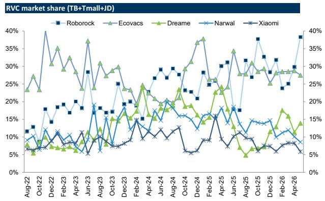  
Source: Moojing, Data compiled by GS Global Investment Research

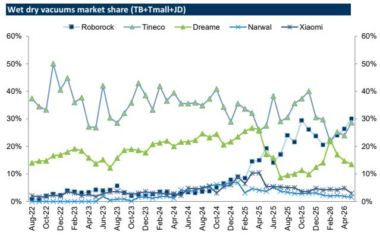  
Exhibit 23: Midea, Xiaomi and Haier showed mom market share increase in Apr, while Gree lost share mom Online market share for AC on Taobao, Tmall and JD (%)

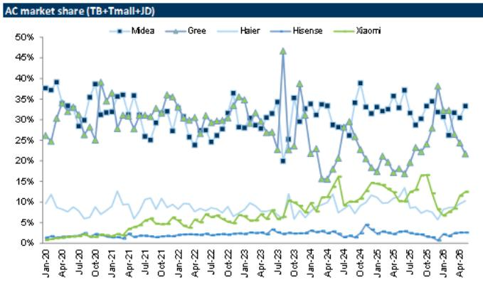  
Source: Moojing, Data compiled by GS Global Investment Research  
Exhibit 24: We note select brands like Midea and Xiaomi lowered prices during 618 vs 2025 Singles' Day, but higher than last 618
Pricing of entry-level AC

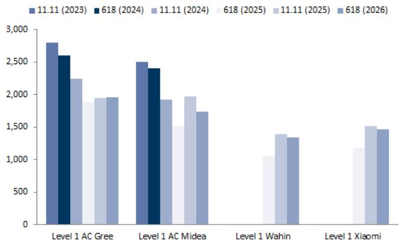  
Source: JD.com, Taobao, Data compiled by GS Global Investment Research

## Overseas RVC and robotic lawn mower growth remained robust

RVC industry app downloads growth (a proxy of retail demand growth) in overseas markets accelerated to +38% yoy in May (vs +34% yoy in Apr). By region, Americas and Europe accelerated, while APAC decelerated (Americas/Europe/APAC

+36%/+43%/+30% yoy in May vs +32%/+33%/+38% yoy in Apr). Roborock overseas downloads growth accelerated to +54% yoy in May (vs +47% yoy in Apr), still faster than the industry average. By region, Roborock gained share in the Americas and Europe (+10ppt/+2ppt yoy to 27%/31%), while it maintained stable share in APAC (32% in May).

Amazon US RVC sales data showed mom moderation in May (-16% yoy in May vs +6% yoy in Apr). Roborock gained share, while Eufy, iRobot, Shark and Ecovacs relatively underperformed.

Based on overseas lawn mowers app download data (tracked by Sensor Tower), robotic lawn mower demand remained solid with DD% growth and Ninebot's continued market share gains with 100%+ growth in May.

Exhibit 25: RVC industry download growth in overseas markets accelerated to +38% in May (vs +34% yoy in Apr)
Download growth of leading RVC apps  
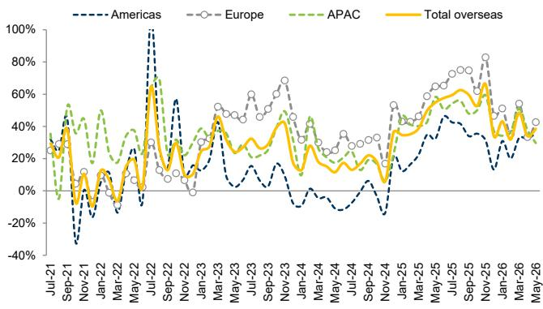  
Source: SensorTower, Data compiled by GS Global Investment Research

Exhibit 26: Roborock overseas downloads were up +54% yoy, faster than the industry
Roborock's market share  
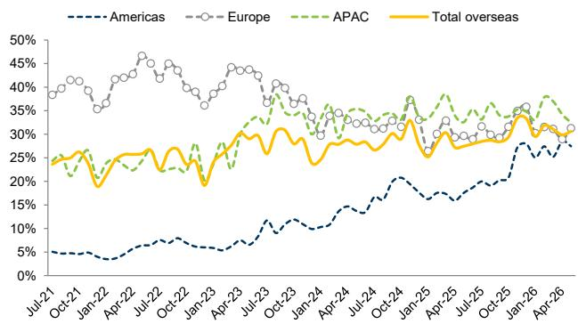  
Source: SensorTower, Data compiled by GS Global Investment Research

Exhibit 27: Growth of RVC moderated mom on Amazon US in May
Sales/Volume/ASP yoy growth by category & Market share/Sales/Volume/ASP yoy growth by company on EC channel (Amazon US)

<table><tr><td rowspan="2"></td><td colspan="5">Sales (% yoy)</td><td colspan="5">Volume (% yoy)</td><td colspan="5">ASP (% yoy)</td></tr><tr><td>May-25</td><td>Mar-26</td><td>Apr-26</td><td>May-26</td><td>MoM Trend</td><td>May-25</td><td>Mar-26</td><td>Apr-26</td><td>May-26</td><td>MoM Trend</td><td>May-25</td><td>Mar-26</td><td>Apr-26</td><td>May-26</td><td>MoM Trend</td></tr><tr><td colspan="16">Amazon US</td></tr><tr><td>RVC</td><td>75%</td><td>54%</td><td>6%</td><td>-16%</td><td>▼</td><td>45%</td><td>30%</td><td>-17%</td><td>-18%</td><td>▼</td><td>21%</td><td>19%</td><td>28%</td><td>3%</td><td>▼</td></tr><tr><td rowspan="2"></td><td colspan="5">Market share</td><td colspan="5">Market share chg (% yoy)</td><td colspan="5">Sales (% yoy)</td></tr><tr><td>May-25</td><td>Mar-26</td><td>Apr-26</td><td>May-26</td><td>YoY Trend</td><td>May-25</td><td>Mar-26</td><td>Apr-26</td><td>May-26</td><td>MoM Trend</td><td>May-25</td><td>Mar-26</td><td>Apr-26</td><td>May-26</td><td>MoM Trend</td></tr><tr><td colspan="16">RVC</td></tr><tr><td>iRobot</td><td>10%</td><td>8%</td><td>9%</td><td>8%</td><td>▼</td><td>-8%</td><td>-7%</td><td>-5%</td><td>-2%</td><td>▲</td><td>-1%</td><td>-19%</td><td>-32%</td><td>-34%</td><td>▼</td></tr><tr><td>Roborock</td><td>21%</td><td>34%</td><td>29%</td><td>32%</td><td>▲</td><td>8%</td><td>14%</td><td>5%</td><td>10%</td><td>▲</td><td>176%</td><td>162%</td><td>28%</td><td>25%</td><td>▼</td></tr><tr><td>Ecovacs</td><td>6%</td><td>3%</td><td>6%</td><td>5%</td><td>▼</td><td>5%</td><td>-4%</td><td>-2%</td><td>-1%</td><td>▲</td><td>790%</td><td>-39%</td><td>-15%</td><td>-29%</td><td>▼</td></tr><tr><td>Shark</td><td>15%</td><td>8%</td><td>9%</td><td>11%</td><td>▼</td><td>3%</td><td>-1%</td><td>0%</td><td>-4%</td><td>▼</td><td>121%</td><td>36%</td><td>7%</td><td>-36%</td><td>▼</td></tr><tr><td>Eufy</td><td>24%</td><td>14%</td><td>6%</td><td>10%</td><td>▼</td><td>12%</td><td>-2%</td><td>-7%</td><td>-15%</td><td>▼</td><td>257%</td><td>38%</td><td>-51%</td><td>-66%</td><td>▼</td></tr></table>

Monthly sales data showed volatility so the absolute yoy growth might look outsized.  
Source: Moojing, Data compiled by GS Global Investment Research

Exhibit 28: Robotic lawn mower demand remained solid with DD% growth and Ninebot's continued market share gains with $100\%+$ growth in May

Download growth of leading robotic lawn mower apps (yoy, %)

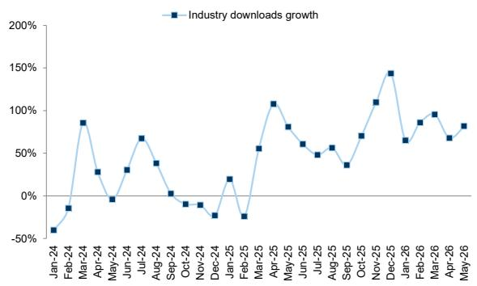  
Source: SensorTower, Data compiled by GS Global Investment Research

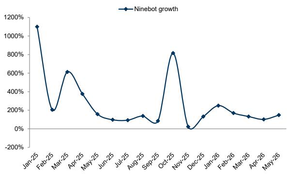

## Residential property completions and sales decline were largely stable in May vs Apr

Exhibit 29: Residential property completions decline narrowed slightly to -20% in May (vs. -22% in Apr), 45% below pre-Covid levels
Residential property completions (LHS, mn sqm); yoy growth (RHS, %); growth vs. 2019 (RHS, %)

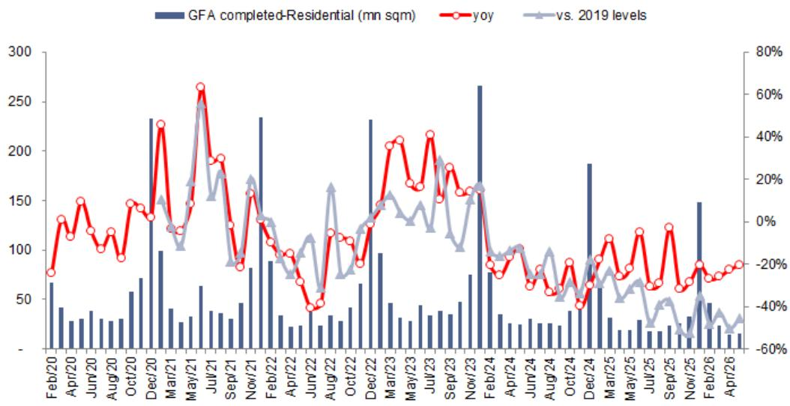  
Source: NBS

Exhibit 30: Residential properties sold (vol) declined 12% yoy in May, weaker than -9% yoy in Apr, 57% below pre-Covid levels

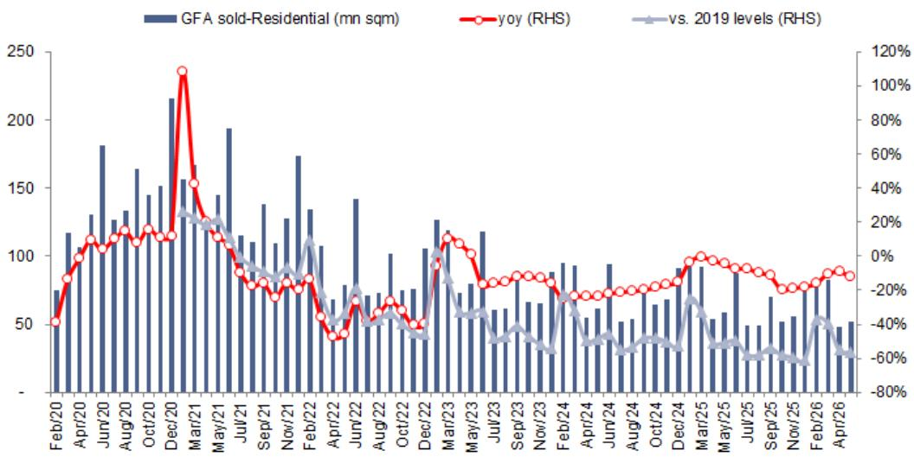  
Source: NBS

More details in China Property.

## Copper/CRC/aluminum stayed largely stable in the past month

Exhibit 31: Weekly CRC price was stable in the past month, -1%/+5% mom/yoy as of mid-Jun
Steel-CRC price (LHS, RMB/ton); yoy growth (RHS, %)  
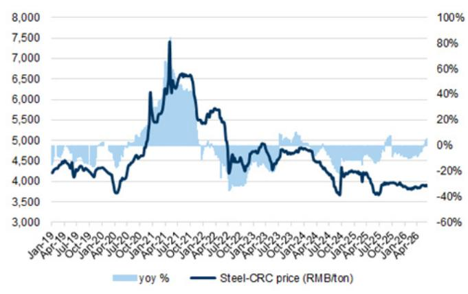  
Source: Wind

Exhibit 32: SHFE copper price increased mildly in the past month, +2%/+34% mom/yoy as of mid-Jun
SHFE copper price (LHS, RMB/ton); yoy growth (RHS, %)  
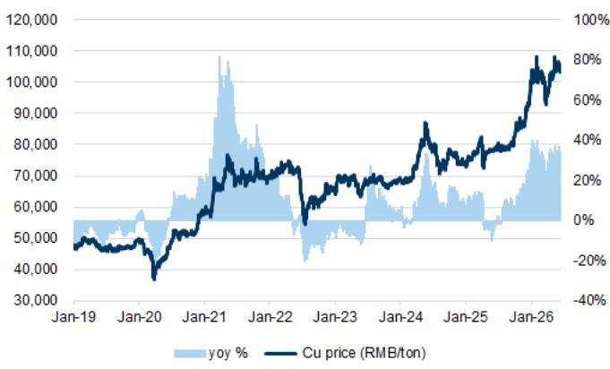  
Source: Wind

Exhibit 33: SHFE aluminum price grew by -2%/+16% mom/yoy as of mid-Jun  
SHFE aluminum price (LHS, RMB/ton); yoy growth (RHS, %)  
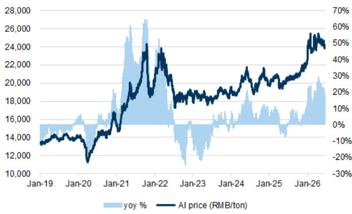  
Source: Wind

## Sector performance and valuation

Exhibit 34: Our covered appliances companies' share prices changed by -25% to +14% in the past month, yielding YTD returns of -38% to +12%

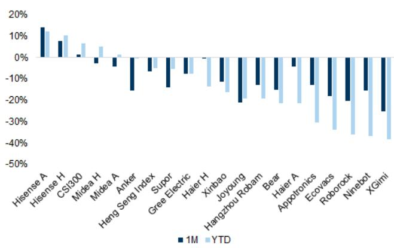  
Prices as of May 19, 2026.  
Exhibit 35: Valuations of most covered appliances companies showed weaker performances in the past month  
Source: Wind  
12-m forward P/Es of our covered companies vs. the historical range (as early as 2016)

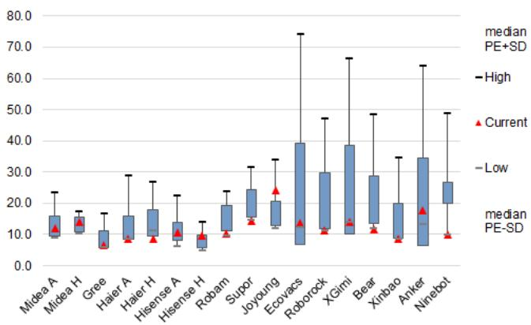  
Prices as of June 18, 2026.  
Source: Wind, GS Global Investment Research

Exhibit 36: Appliances comp table

<table><tr><td rowspan="2">Company</td><td rowspan="2">Ticker</td><td rowspan="2">PCY</td><td rowspan="2">Last closing price</td><td rowspan="2">Target price</td><td rowspan="2">Upside/ (downside)</td><td rowspan="2">Rating</td><td rowspan="2">Mkt Cap (US$bn)</td><td rowspan="2">25-28E EPS CAGR</td><td colspan="3">P/E</td><td colspan="3">P/B</td><td colspan="3">EV/EBITDA</td></tr><tr><td>2026E</td><td>2027E</td><td>2028E</td><td>2026E</td><td>2027E</td><td>2028E</td><td>2026E</td><td>2027E</td><td>2028E</td></tr><tr><td colspan="18">China appliances</td></tr><tr><td>Midea Group A</td><td>000333.SZ</td><td>CNY</td><td>78.00</td><td>99.00</td><td>27%</td><td>Buy</td><td>87.7</td><td>8%</td><td>12.5x</td><td>11.4x</td><td>10.7x</td><td>2.5x</td><td>2.4x</td><td>2.3x</td><td>9.5x</td><td>8.8x</td><td>8.0x</td></tr><tr><td>Midea Group H</td><td>0300.HK</td><td>HKD</td><td>84.20</td><td>113.00</td><td>34%</td><td>Buy</td><td>81.6</td><td>8%</td><td>11.6x</td><td>10.6x</td><td>10.0x</td><td>2.4x</td><td>2.2x</td><td>2.2x</td><td>9.0x</td><td>8.1x</td><td>7.4x</td></tr><tr><td>Gree Electric</td><td>000651.SZ</td><td>CNY</td><td>36.72</td><td>41.00</td><td>12%</td><td>Neutral</td><td>32.7</td><td>1%</td><td>7.2x</td><td>7.1x</td><td>6.9x</td><td>1.3x</td><td>1.2x</td><td>1.1x</td><td>5.0x</td><td>4.7x</td><td>4.4x</td></tr><tr><td>Haier A</td><td>600690.SS</td><td>CNY</td><td>19.45</td><td>29.00</td><td>49%</td><td>Buy</td><td>26.0</td><td>7%</td><td>9.1x</td><td>8.2x</td><td>7.6x</td><td>1.4x</td><td>1.3x</td><td>1.3x</td><td>5.7x</td><td>4.9x</td><td>4.3x</td></tr><tr><td>Haier H</td><td>6690.HK</td><td>HKD</td><td>20.38</td><td>30.00</td><td>47%</td><td>Buy</td><td>23.5</td><td>7%</td><td>8.2x</td><td>7.4x</td><td>6.8x</td><td>1.3x</td><td>1.2x</td><td>1.1x</td><td>5.2x</td><td>4.4x</td><td>3.7x</td></tr><tr><td>Hisense A</td><td>000921.SZ</td><td>CNY</td><td>26.94</td><td>30.00</td><td>11%</td><td>Buy</td><td>5.5</td><td>7%</td><td>11.4x</td><td>10.4x</td><td>9.6x</td><td>2.0x</td><td>1.8x</td><td>1.7x</td><td>7.2x</td><td>6.3x</td><td>5.4x</td></tr><tr><td>Hisense H</td><td>0921.HK</td><td>HKD</td><td>24.80</td><td>27.00</td><td>9%</td><td>Buy</td><td>4.4</td><td>7%</td><td>9.0x</td><td>8.3x</td><td>7.6x</td><td>1.6x</td><td>1.4x</td><td>1.3x</td><td>5.9x</td><td>5.0x</td><td>4.3x</td></tr><tr><td>Median</td><td></td><td></td><td></td><td></td><td>27%</td><td></td><td>26.0</td><td>7%</td><td>9.1x</td><td>8.3x</td><td>7.6x</td><td>1.6x</td><td>1.4x</td><td>1.3x</td><td>5.9x</td><td>5.0x</td><td>4.4x</td></tr><tr><td colspan="18">China kitchen appliances</td></tr><tr><td>Hangzhou Robam</td><td>002508.SZ</td><td>CNY</td><td>15.52</td><td>20.00</td><td>29%</td><td>Buy</td><td>2.2</td><td>7%</td><td>11.1x</td><td>10.1x</td><td>9.4x</td><td>1.2x</td><td>1.2x</td><td>1.2x</td><td>9.3x</td><td>8.4x</td><td>7.7x</td></tr><tr><td>Median</td><td></td><td></td><td></td><td></td><td>29%</td><td></td><td>1.5</td><td>7%</td><td>11.1x</td><td>10.1x</td><td>9.4x</td><td>1.2x</td><td>1.2x</td><td>1.2x</td><td>9.3x</td><td>8.4x</td><td>7.7x</td></tr><tr><td colspan="18">China small appliances</td></tr><tr><td>Supor</td><td>002032.SZ</td><td>CNY</td><td>41.03</td><td>53.00</td><td>29%</td><td>Buy</td><td>5.0</td><td>5%</td><td>15.0x</td><td>14.0x</td><td>13.4x</td><td>5.2x</td><td>5.2x</td><td>5.2x</td><td>12.6x</td><td>11.8x</td><td>11.4x</td></tr><tr><td>Joyoung</td><td>002242.SZ</td><td>CNY</td><td>8.35</td><td>4.50</td><td>-46%</td><td>Sell</td><td>0.9</td><td>31%</td><td>34.5x</td><td>27.4x</td><td>23.2x</td><td>1.9x</td><td>1.8x</td><td>1.8x</td><td>36.9x</td><td>20.7x</td><td>15.6x</td></tr><tr><td>Bear</td><td>002959.SZ</td><td>CNY</td><td>32.95</td><td>42.00</td><td>27%</td><td>Neutral</td><td>0.8</td><td>4%</td><td>14.1x</td><td>12.6x</td><td>11.8x</td><td>1.6x</td><td>1.5x</td><td>1.4x</td><td>4.5x</td><td>3.6x</td><td>2.9x</td></tr><tr><td>Xinbao</td><td>002705.SZ</td><td>CNY</td><td>11.31</td><td>13.70</td><td>21%</td><td>Neutral</td><td>1.4</td><td>5%</td><td>10.8x</td><td>8.5x</td><td>8.0x</td><td>1.0x</td><td>0.9x</td><td>0.9x</td><td>3.0x</td><td>2.3x</td><td>1.8x</td></tr><tr><td>Ecovacs</td><td>603486.SS</td><td>CNY</td><td>53.08</td><td>55.00</td><td>4%</td><td>Sell</td><td>4.4</td><td>7%</td><td>17.5x</td><td>15.9x</td><td>14.3x</td><td>3.0x</td><td>2.6x</td><td>2.3x</td><td>10.6x</td><td>9.1x</td><td>7.6x</td></tr><tr><td>Roborock</td><td>688169.SS</td><td>CNY</td><td>97.27</td><td>170.00</td><td>75%</td><td>Buy</td><td>3.7</td><td>30%</td><td>13.9x</td><td>10.3x</td><td>8.4x</td><td>1.6x</td><td>1.4x</td><td>1.2x</td><td>12.4x</td><td>8.6x</td><td>6.2x</td></tr><tr><td>Ninebot</td><td>689009.SS</td><td>CNY</td><td>33.94</td><td>62.00</td><td>83%</td><td>Buy</td><td>3.6</td><td>25%</td><td>13.7x</td><td>9.5x</td><td>7.5x</td><td>3.1x</td><td>2.8x</td><td>2.5x</td><td>6.6x</td><td>5.1x</td><td>4.0x</td></tr><tr><td>XGimi</td><td>688696.SS</td><td>CNY</td><td>68.33</td><td>87.00</td><td>27%</td><td>Sell</td><td>0.7</td><td>32%</td><td>29.2x</td><td>19.4x</td><td>14.1x</td><td>1.5x</td><td>1.5x</td><td>1.4x</td><td>25.6x</td><td>16.0x</td><td>11.1x</td></tr><tr><td>Appotronics</td><td>688007.SS</td><td>CNY</td><td>13.21</td><td>6.00</td><td>-55%</td><td>Sell</td><td>0.9</td><td>-180%</td><td>-114.0x</td><td>139.3x</td><td>43.3x</td><td>2.7x</td><td>2.6x</td><td>2.5x</td><td>96.0x</td><td>40.8x</td><td>24.6x</td></tr><tr><td>Median</td><td></td><td></td><td></td><td></td><td>27%</td><td></td><td>1.4</td><td>7%</td><td>14.0x</td><td>13.3x</td><td>12.6x</td><td>1.7x</td><td>1.7x</td><td>1.6x</td><td>11.5x</td><td>8.9x</td><td>6.9x</td></tr></table>

All prices are as of Jun 18, 2026 unless otherwise specified. Target prices are based on a 12-month time frame.  
Source: Datastream, Company data, GS Global Investment Research

## Price Target Risks and Methodology

## Midea

Valuation: Our 12-m TPs (A/H-share) of Rmb99/HK\$113 are based on a 16x exit multiple applied to our 2028E EPS, discounted back to 2027E using a 9.5% cost of equity.

Key risks: 1) Worse-than-expected disruption on white goods demand from weaker macro globally; 2) rising material costs affecting product margins; 3) execution risk of its premiumization strategy; and 4) rising competition in the low-to-mid-end segment.

## Ninebot

Valuation: Our 12-month target price of Rmb62 is based on a 16x exit P/E multiple applied to our 2028E EPS and discounted back to 2027E using a 9.5% cost of equity.

Key risks: 1) Decline in disposable income and consumer confidence from weaker macro conditions; 2) Slower-than-expected product launches or new category expansion; 3) Intensifying competition in domestic/overseas markets; 4) Potential tariffs/anti-dumping duties may reduce profitability; 5) Higher-than-expected raw materials cost.

## Hisense Home Appliances

Valuation: Our 12-m TP (A/H-share) of Rmb30/HK\$27 is based on 14x/11x 2028E P/Es for Hisense-Hitachi JV/legacy white goods, discounted back to 2027E at a 9.5% COE.

Key risks: 1) Worse-than-expected disruption in white goods demand from weaker macro globally; 2) a further property market slowdown leading to sluggish demand for VRF; 3) increasing competition from domestic players that may jeopardize the leading position of its Hisense-Hitachi JV.

## Disclosure Appendix

## Reg AC

We, Nicolas Yi and Cecilia Tang, hereby certify that all of the views expressed in this report accurately reflect our personal views about the subject company or companies and its or their securities. We also certify that no part of our compensation was, is or will be, directly or indirectly, related to the specific recommendations or views expressed in this report.

Contributing Authors: Nicolas Yi GS (China) Securities Company Limited, Cecilia Tang GS (China) Securities Company Limited.

Unless otherwise stated, the individuals listed in the Contributing Authors disclosure of this report are analysts in GS' Global Investment Research division.

## GS Factor Profile

The GS Factor Profile provides investment context for a stock by comparing key attributes to the market (i.e. our universe of rated stocks) and its sector peers. The four key attributes depicted are: Growth, Financial Returns, Multiple (e.g. valuation) and Integrated (a composite of Growth, Financial Returns and Multiple). Growth, Financial Returns and Multiple are calculated by using normalized ranks for specific metrics for each stock. The normalized ranks for the metrics are then averaged and converted into percentiles for the relevant attribute. The precise calculation of each metric may vary depending on the fiscal year, industry and region, but the standard approach is as follows:

Growth is based on a stock's forward-looking sales growth, EBITDA growth and EPS growth (for financial stocks, only EPS and sales growth), with a higher percentile indicating a higher growth company. Financial Returns is based on a stock's forward-looking ROE, ROCE and CROCI (for financial stocks, only ROE), with a higher percentile indicating a company with higher financial returns. Multiple is based on a stock's forward-looking P/E, P/B, price/dividend (P/D), EV/EBITDA, EV/FCF and EV/Debt Adjusted Cash Flow (DACF) (for financial stocks, only P/E, P/B and P/D), with a higher percentile indicating a stock trading at a higher multiple. The Integrated percentile is calculated as the average of the Growth percentile, Financial Returns percentile and (100% - Multiple percentile).

Financial Returns and Multiple use the GS analyst forecasts at the fiscal year-end at least three quarters in the future. Growth uses inputs for the fiscal year at least seven quarters in the future compared with the year at least three quarters in the future (on a per-share basis for all metrics).

For a more detailed description of how we calculate the GS Factor Profile, please contact your GS representative.

## M&A Rank

Across our global coverage, we examine stocks using an M&A framework, considering both qualitative factors and quantitative factors (which may vary across sectors and regions) to incorporate the potential that certain companies could be acquired. We then assign a M&A rank as a means of scoring companies under our rated coverage from 1 to 3, with 1 representing high (30%-50%) probability of the company becoming an acquisition target, 2 representing medium (15%-30%) probability and 3 representing low (0%-15%) probability. For companies ranked 1 or 2, in line with our standard departmental guidelines we incorporate an M&A component into our target price. M&A rank of 3 is considered immaterial and therefore does not factor into our price target, and may or may not be discussed in research.

## Quantum

Quantum is GS' proprietary database providing access to detailed financial statement histories, forecasts and ratios. It can be used for in-depth analysis of a single company, or to make comparisons between companies in different sectors and markets.

## Disclosures

## Distribution of ratings/investment banking relationships

GS Investment Research global Equity coverage universe

<table><tr><td rowspan="2"></td><td colspan="3">Rating Distribution</td><td colspan="3">Investment Banking Relationships</td></tr><tr><td>Buy</td><td>Hold</td><td>Sell</td><td>Buy</td><td>Hold</td><td>Sell</td></tr><tr><td>Global</td><td>50%</td><td>34%</td><td>16%</td><td>65%</td><td>60%</td><td>45%</td></tr></table>

As of April 1, 2026, GS Global Investment Research had investment ratings on 3,074 equity securities. GS assigns stocks as Buys and Sells on various regional Investment Lists; stocks not so assigned are deemed Neutral. Such assignments equate to Buy, Hold and Sell for the purposes of the above disclosure required by the FINRA Rules. See ‘Ratings, Coverage universe and related definitions’ below. The Investment Banking Relationships chart reflects the percentage of subject companies within each rating category for whom GS has provided investment banking services within the previous twelve months.

## Regulatory disclosures

## Disclosures required by United States laws and regulations

See company-specific regulatory disclosures above for any of the following disclosures required as to companies referred to in this report: manager or co-manager in a pending transaction; 1% or other ownership; compensation for certain services; types of client relationships; managed/co-managed public offerings in prior periods; directorships; for equity securities, market making and/or specialist role. GS trades or may trade as a principal in debt securities (or in related derivatives) of issuers discussed in this report.

The following are additional required disclosures: Ownership and material conflicts of interest: GS policy prohibits its analysts, professionals reporting to analysts and members of their households from owning securities of any company in the analyst's area of coverage. Analyst compensation: Analysts are paid in part based on the profitability of GS, which includes investment banking revenues. Analyst as officer or director: GS policy generally prohibits its analysts, persons reporting to analysts or members of their households from serving as an officer, director or advisor of any company in the analyst's area of coverage. Non-U.S. Analysts: Non-U.S. analysts may not be associated persons of GS & Co. LLC and therefore may not be subject to FINRA Rule 2241 or FINRA Rule 2242 restrictions on communications with a subject company, public appearances and trading in securities covered by the analysts.

Distribution of ratings: See the distribution of ratings disclosure above. Price chart: See the price chart, with changes of ratings and price targets in prior periods, above, or, if electronic format or if with respect to multiple companies which are the subject of this report, on the GS website at https://www.gs.com/research/hedge.html.

Additional disclosures required under the laws and regulations of jurisdictions other than the United States
The following disclosures are those required by the jurisdiction indicated, except to the extent already made above pursuant to United States laws and regulations. Australia: GS Australia Pty Ltd and its affiliates are not authorised deposit-taking institutions (as that term is defined in the Banking Act 1959 (Cth)) in Australia and do not provide banking services, nor carry on a banking business, in Australia. This research, and any access to it, is intended only for “wholesale clients” within the meaning of the Australian Corporations Act, unless otherwise agreed by GS. In producing research reports, members of Global Investment Research of GS Australia may attend site visits and other meetings hosted by the companies and other entities which are the subject of its research reports. In some instances the costs of such site visits or meetings may be met in part or in whole by the issuers concerned if GS Australia considers it is appropriate and reasonable in the specific circumstances relating to the site visit or meeting. To the extent that the contents of this document contains any financial product advice, it is general advice only and has been prepared by GS without taking into account a client’s objectives, financial situation or needs. A client should, before acting on any such advice, consider the appropriateness of the advice having regard to the client’s own objectives, financial situation and needs. A copy of certain GS Australia and New Zealand disclosure of interests and a copy of GS’ Australian Sell-Side Research Independence Policy Statement are available at: https://www.goldmansachs.com/disclosures/australia-new-zealand/index.html. Brazil: Disclosure information in relation to CVM Resolution n. 20 is available at https://www.gs.com/worldwide/brazil/area/gir/index.html. Where applicable, the Brazil-registered analyst primarily responsible for the content of this research report, as defined in Article 20 of CVM Resolution n. 20, is the first author named at the beginning of this report, unless indicated otherwise at the end of the text. Canada: This information is being provided to you for information purposes only and is not, and under no circumstances should be construed as, an advertisement, offering or solicitation by GS & Co. LLC for purchasers of securities in Canada to trade in any Canadian security. GS & Co. LLC is not registered as a dealer in any jurisdiction in Canada under applicable Canadian securities laws and generally is not permitted to trade in Canadian securities and may be prohibited from selling certain securities and products in certain jurisdictions in Canada. If you wish to trade in any Canadian securities or other products in Canada please contact GS Canada Inc., an affiliate of The GS Group Inc., or another registered Canadian dealer. Hong Kong: Further information on the securities of covered companies referred to in this research may be obtained on request from GS (Asia) L.L.C. India: Further information on the subject company or companies referred to in this research may be obtained from GS (India) Securities Private Limited, Research Analyst - SEBI Registration Number INH000001493, 10th Floor, Ascent-Worli, Sudam Kalu Ahire Marg, Worli, Mumbai-400 025, India, Corporate Identity Number U74140MH2006FTC160634, Phone +91 22 6616 9000, Fax +91 22 6616 9001. GS may beneficially own 1% or more of the securities (as such term is defined in clause 2 (h) the Indian Securities Contracts (Regulation) Act, 1956) of the subject company or companies referred to in this research report. Investment in securities market are subject to market risks. Read all the related documents carefully before investing. Registration granted by SEBI and certification from NISM in no way guarantee performance of the intermediary or provide any assurance of returns to investors. GS (India) Securities Private Limited compliance officer and investor grievance contact details can be found at: https://www.goldmansachs.com/worldwide/india/documents/Grievance-Redressal-and-Escalation-Matrix.pdf, and a copy of the annual audit compliance report can be found at this link: https://publishing.gs.com/content/site/india-annual-compliance-report.html. Japan: See below. Korea: This research, and any access to it, is intended only for “professional investors” within the meaning of the Financial Services and Capital Markets Act, unless otherwise agreed by GS. Further information on the subject company or companies referred to in this research may be obtained from GS (Asia) L.L.C., Seoul Branch. New Zealand: GS New Zealand Limited and its affiliates are neither “registered banks” nor “deposit takers” (as defined in the Reserve Bank of New Zealand Act 1989) in New Zealand. This research, and any access to it, is intended for “wholesale clients” (as defined in the Financial Advisers Act 2008) unless otherwise agreed by GS. A copy of certain GS Australia and New Zealand disclosure of interests is available at: https://www.goldmansachs.com/disclosures/australia-new-zealand/index.html.
Russia: Research reports distributed in the Russian Federation are not advertising as defined in the Russian legislation, but are information and analysis not having product promotion as their main purpose and do not provide appraisal within the meaning of the Russian legislation on appraisal activity. Research reports do not constitute a personalized investment recommendation as defined in Russian laws and regulations, are not addressed to a specific client, and are prepared without analyzing the financial circumstances, investment profiles or risk profiles of clients. GS assumes no responsibility for any investment decisions that may be taken by a client or any other person based on this research report. Singapore: GS (Singapore) Pte. (Company Number: 198602165W), which is regulated by the Monetary Authority of Singapore, accepts legal responsibility for this research, and should be contacted with respect to any matters arising from, or in connection with, this research. Taiwan: This material is for reference only and must not be reprinted without permission. Investors should carefully consider their own investment risk. Investment results are the responsibility of the individual investor. United Kingdom: Persons who would be categorized as retail clients in the United Kingdom, as such term is defined in the rules of the Financial Conduct Authority, should read this research in conjunction with prior GS on the covered companies referred to herein and should refer to the risk warnings that have been sent to them by GS International. A copy of these risks warnings, and a glossary of certain financial terms used in this report, are available from GS International on request.

European Union and United Kingdom: Disclosure information in relation to Article 6 (2) of the European Commission Delegated Regulation (EU) (2016/958) supplementing Regulation (EU) No 596/2014 of the European Parliament and of the Council (including as that Delegated Regulation is implemented into United Kingdom domestic law and regulation following the United Kingdom's departure from the European Union and the European Economic Area) with regard to regulatory technical standards for the technical arrangements for objective presentation of investment recommendations or other information recommending or suggesting an investment strategy and for disclosure of particular interests or indications of conflicts of interest is available at https://www.gs.com/disclosures/europeanpolicy.html which states the European Policy for Managing Conflicts of Interest in Connection with Investment Research.

Japan: GS Japan Co., Ltd. is a Financial Instrument Dealer registered with the Kanto Financial Bureau under registration number Kinsho 69, and a member of Japan Securities Dealers Association, Financial Futures Association of Japan Type II Financial Instruments Firms Association, and Investment Management Association of Japan. Sales and purchase of equities are subject to commission pre-determined with clients plus consumption tax. See company-specific disclosures as to any applicable disclosures required by Japanese stock exchanges, the Japanese Securities Dealers Association or the Japanese Securities Finance Company.

## Ratings, coverage universe and related definitions

Buy (B), Neutral (N), Sell (S) Analysts recommend stocks as Buys or Sells for inclusion on various regional Investment Lists. Being assigned a Buy or Sell on an Investment List is determined by a stock's total return potential relative to its coverage universe. Any stock not assigned as a Buy or a Sell on an Investment List with an active rating (i.e., a stock that is not Rating Suspended, Not Rated, Early-Stage Biotech, Coverage Suspended or Not Covered), is deemed Neutral. Each region manages Regional Conviction Lists, which are selected from Buy rated stocks on the respective region's Investment Lists and represent investment recommendations focused on the size of the total return potential and/or the likelihood of the realization of the return across their respective areas of coverage. The addition or removal of stocks from such Conviction Lists are managed by the Investment Review Committee or other designated committee in each respective region and do not represent a change in the analysts' investment rating for such stocks.

Total return potential represents the upside or downside differential between the current share price and the price target, including all paid or anticipated dividends, expected during the time horizon associated with the price target. Price targets are required for all covered stocks. The total return potential, price target and associated time horizon are stated in each report adding or reiterating an Investment List membership.

Coverage Universe: A list of all stocks in each coverage universe is available by primary analyst, stock and coverage universe at https://www.gs.com/research/hedge.html.

Not Rated (NR). The investment rating, target price and earnings estimates (where relevant) are removed pursuant to GS policy when

GS is acting in an advisory capacity in a merger or in a strategic transaction involving this company, when there are legal, regulatory or policy constraints due to GS' involvement in a transaction, and in certain other circumstances. Early-Stage Biotech (ES). An investment rating and a target price are not assigned pursuant to GS policy when this company has neither a drug, treatment or medical device that has passed a Phase II clinical trial nor a license to distribute a post-Phase II drug, treatment or medical device. Rating Suspended (RS). GS has suspended the investment rating and price target for this stock, because there is not a sufficient fundamental basis for determining an investment rating or target price. The previous investment rating and target price, if any, are no longer in effect for this stock and should not be relied upon. Coverage Suspended (CS). GS has suspended coverage of this company. Not Covered (NC). GS does not cover this company.

## Global product; distributing entities

GS Global Investment Research produces and distributes research products for clients of GS on a global basis. Analysts based in GS offices around the world produce research on industries and companies, and research on macroeconomics, currencies, commodities and portfolio strategy. This research is disseminated in Australia by GS Australia Pty Ltd (ABN 21 006 797 897); in Brazil by GS do Brasil Corretora de Títulos e Valores Mobiliários S.A.; Public Communication Channel GS Brazil: 0800 727 5764 and / or contatogoldmanbrasil@gs.com. Available Weekdays (except holidays), from 9am to 6pm. Canal de Comunicação com o Público GS Brasil: 0800 727 5764 e/ou contatogoldmanbrasil@gs.com. Horário de funcionamento: segunda-feira à sexta-feira (exceto feriados), das 9h às 18h; in Canada by GS & Co. LLC; in Hong Kong by GS (Asia) L.L.C.; in India by GS (India) Securities Private Ltd.; in Japan by GS Japan Co., Ltd.; in the Republic of Korea by GS (Asia) L.L.C., Seoul Branch; in New Zealand by GS New Zealand Limited; in Russia by OOO GS; in Singapore by GS (Singapore) Pte. (Company Number: 198602165W); and in the United States of America by GS & Co. LLC. GS International has approved this research in connection with its distribution in the United Kingdom.

GS International (“GSI”), authorised by the Prudential Regulation Authority (“PRA”) and regulated by the Financial Conduct Authority (“FCA”) and the PRA, has approved this research in connection with its distribution in the United Kingdom.

European Economic Area: GS Bank Europe SE (“GSBE”) is a credit institution incorporated in Germany and, within the Single Supervisory Mechanism, subject to direct prudential supervision by the European Central Bank and in other respects supervised by German Federal Financial Supervisory Authority (Bundesanstalt für Finanzdienstleistungsaufsicht, BaFin) and Deutsche Bundesbank and disseminates research within the European Economic Area.

## General disclosures

This research is for our clients only. Other than disclosures relating to GS, this research is based on current public information that we consider reliable, but we do not represent it is accurate or complete, and it should not be relied on as such. The information, opinions, estimates and forecasts contained herein are as of the date hereof and are subject to change without prior notification. We seek to update our research as appropriate, but various regulations may prevent us from doing so. Other than certain industry reports published on a periodic basis, the large majority of reports are published at irregular intervals as appropriate in the analyst's judgment.

GS conducts a global full-service, integrated investment banking, investment management, and brokerage business. We have investment banking and other business relationships with a substantial percentage of the companies covered by Global Investment Research. GS & Co. LLC, the United States broker dealer, is a member of SIPC (https://www.sipc.org).

Our salespeople, traders, and other professionals may provide oral or written market commentary or trading strategies to our clients and principal trading desks that reflect opinions that are contrary to the opinions expressed in this research. Our asset management area, principal trading desks and investing businesses may make investment decisions that are inconsistent with the recommendations or views expressed in this research.

The analysts named in this report may have from time to time discussed with our clients, including GS salespersons and traders, or may discuss in this report, trading strategies that reference catalysts or events that may have a near-term impact on the market price of the equity securities discussed in this report, which impact may be directionally counter to the analyst's published price target expectations for such stocks. Any such trading strategies are distinct from and do not affect the analyst's fundamental equity rating for such stocks, which rating reflects a stock's return potential relative to its coverage universe as described herein.

We and our affiliates, officers, directors, and employees will from time to time have long or short positions in, act as principal in, and buy or sell, the securities or derivatives, if any, referred to in this research, unless otherwise prohibited by regulation or GS policy.

The views attributed to third party presenters at GS arranged conferences, including individuals from other parts of GS, do not necessarily reflect those of Global Investment Research and are not an official view of GS.

Any third party referenced herein, including any salespeople, traders and other professionals or members of their household, may have positions in the products mentioned that are inconsistent with the views expressed by analysts named in this report.

This research is not an offer to sell or the solicitation of an offer to buy any security in any jurisdiction where such an offer or solicitation would be illegal. It does not constitute a personal recommendation or take into account the particular investment objectives, financial situations, or needs of individual clients. Clients should consider whether any advice or recommendation in this research is suitable for their particular circumstances and, if appropriate, seek professional advice, including tax advice. The price and value of investments referred to in this research and the income from them may fluctuate. Past performance is not a guide to future performance, future returns are not guaranteed, and a loss of original capital may occur. Fluctuations in exchange rates could have adverse effects on the value or price of, or income derived from, certain investments.

Certain transactions, including those involving futures, options, and other derivatives, give rise to substantial risk and are not suitable for all investors. Investors should review current options and futures disclosure documents which are available from GS sales representatives or at https://www.theocc.com/about/publications/character-risks.jsp and https://www.goldmansachs.com/disclosures/cftc\_fcm\_disclosures. Transaction costs may be significant in option strategies calling for multiple purchase and sales of options such as spreads. Supporting documentation will be supplied upon request.

Differing Levels of Service provided by Global Investment Research: The level and types of services provided to you by GS Global Investment Research may vary as compared to that provided to internal and other external clients of GS, depending on various factors including your individual preferences as to the frequency and manner of receiving communication, your risk profile and investment focus and perspective (e.g., marketwide, sector specific, long term, short term), the size and scope of your overall client relationship with GS, and legal and regulatory constraints. As an example, certain clients may request to receive notifications when research on specific securities is published, and certain clients may request that specific data underlying analysts' fundamental analysis available on our internal client websites be delivered to them electronically through data feeds or otherwise. No change to an analyst's fundamental research views (e.g., ratings, price targets, or material changes to earnings estimates for equity securities), will be communicated to any client prior to inclusion of such information in a research report broadly disseminated through electronic publication to our internal client websites or through other means, as necessary, to all clients who are entitled to receive such reports.

All research reports are disseminated and available to all clients simultaneously through electronic publication to our internal client websites. Not all research content is redistributed to our clients or available to third-party aggregators, nor is GS responsible for the redistribution of our research by third party aggregators. For research, models or other data related to one or more securities, markets or asset classes (including related services) that may be available to you, please contact your GS representative or go to https://research.gs.com.

Disclosure information is also available at https://www.gs.com/research/hedge.html or from Research Compliance, 200 West Street, New York, NY 10282.

## © 2026 GS.

You are permitted to store, display, analyze, modify, reformat, and print the information made available to you via this service only for your own use. You may not resell or reverse engineer this information to calculate or develop any index for disclosure and/or marketing or create any other derivative works or commercial product(s), data or offering(s) without the express written consent of GS. You are not permitted to publish, transmit, or otherwise reproduce this information, in whole or in part, in any format to any third party without the express written consent of GS. This foregoing restriction includes, without limitation, using, extracting, downloading or retrieving this information, in whole or in part, to train or finetune a machine learning or artificial intelligence system, or to provide or reproduce this information, in whole or in part, as a prompt or input to any such system.