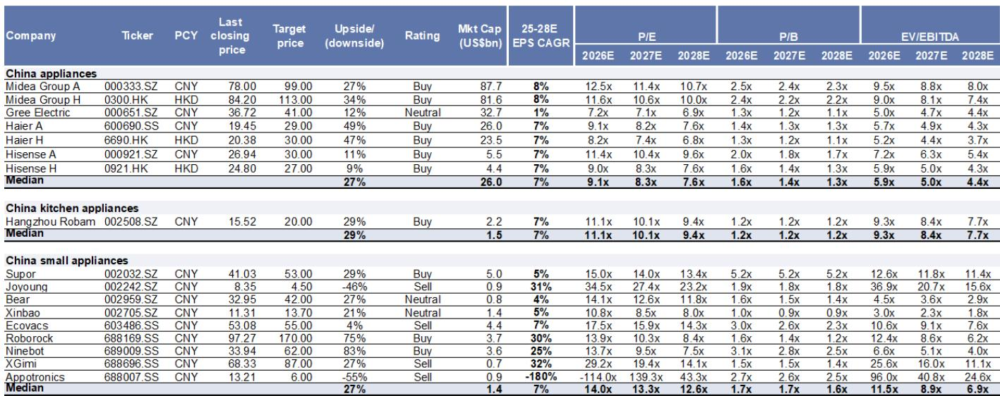
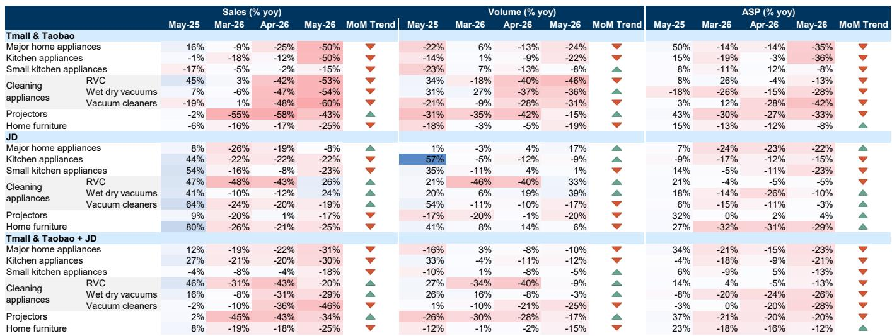
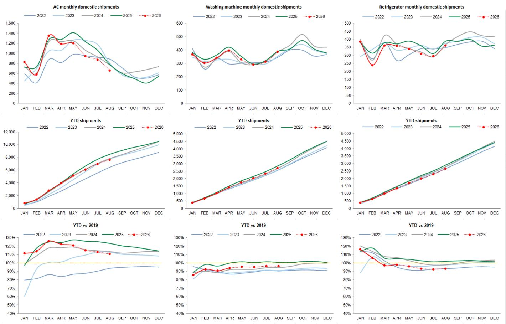

# GS：家电内需压力尚未出清，但出口的结构性机会比想象中更值得关注

五月的数据再次确认了一个判断：中国家电行业正处于“内需承压、外需修复”的错位周期中。GS最新发布的五月家电追踪报告显示，国内零售和出厂数据延续了4月的疲软态势，而出口则出现了超预期的环比改善。这份报告的核心信号并非简单的“内冷外热”，而在于两个更值得推敲的结构性变化：一是国内需求的下行斜率正在放缓，基数效应将在6月下旬开始提供缓冲；二是出口的韧性并非仅靠低基数，中国企业在海外市场的份额持续扩张正在成为更持久的驱动力。

对于投资者而言，当前阶段的关键问题不再是“行业是否见底”，而是“底部的形态和分化路径是什么”。GS在报告中明确指出了对美的集团、九号公司和海信家电的偏好，其逻辑并非押注行业整体反转，而是捕捉那些在周期底部仍能通过海外扩张、产品组合和股东回报构建安全边际的公司。

以下是对这份报告核心洞察的拆解。

## 1. 五月内需数据低于预期，但真正的拐点信号在于基数的“前高后低”

五月国内家电零售额同比下降16%，与4月-15%的降幅基本持平。空调国内出厂量更是同比下降15%，显著低于此前行业生产计划所隐含的-9%的预期。GS认为，这主要是受到去年同期需求前置以及4月以来部分品牌提价的叠加影响。

但比单月数据更重要的是趋势判断。报告指出，由于去年6月“以旧换新”政策的效果开始逐步消退，从今年6月下旬开始，国内需求的同比基数压力将明显缓解。这意味着，即使终端需求没有显著回暖，7月之后的同比读数也可能出现自然改善。换句话说，当前市场对“内需持续恶化”的线性外推，很可能低估了基数效应带来的读数修复。

这里需要谨慎的是：读数的改善并不等于需求的复苏。真正的拐点需要看到终端动销的实质回升，而非仅仅是统计意义上的低基数。GS也据此将二季度主要白电国内出货增长预期从此前的低个位数下调至低十位数负增长。

## 2. 出口超预期改善的背后，是中国企业份额扩张与海外需求的同步修复

与内需形成鲜明对比的是，五月家电出口出现了明显的环比改善。空调出口降幅从4月的-12%收窄至-4%，显著好于生产计划预期的-6%的降幅。洗衣机出口增速从+7%提升至+14%，冰箱出口更是由负转正至+13%。

GS将这一改善归因于两个因素的叠加：一是去年同期的低基数，二是中国企业在海外市场的持续份额扩张。报告特别提到，尽管中东局势仍存在不确定性，但中国品牌的出口仍展现出韧性。与此同时，美国和欧洲的消费者信心指数以及美国成屋销售领先指标——待售房屋销售数据，均在5月出现了环比改善。

这意味着，出口的改善并非单纯的中国供给端“以价换量”，而是海外需求端本身也在边际修复。对于投资者而言，这比单纯的低基数更具持续性价值。GS认为，随着美伊谅解备忘录签署后更多细节的披露，市场需求的可视度有望进一步提升，这将为中国头部企业进一步扩大海外份额提供空间。

## 3. 品牌分化加剧：谁在失去国内市场，谁在海外建立护城河

GS的数据清晰地展示了品牌层面的分化。五月空调国内出货量，海尔同比增长5%，海信下降5%，而美的和格力分别下降35%和6%。海尔在国内市场的相对稳健，与其在高端品牌卡萨帝和渠道效率上的持续投入有关。而美的国内出货的大幅下滑，部分原因可能是其主动调整渠道库存或产品结构。

但在出口端，美的空调出口同比增长4%，显著好于格力的-33%和海信的-17%。这一反差揭示了不同公司的战略侧重：美的通过海外工厂的本地化布局，在应对贸易摩擦和汇率波动时拥有更大的灵活性。报告也明确指出，中国企业的整体出口量应大于IOL统计的出厂数据，因为头部企业如美的也在通过海外工厂直接出口。

在冰箱领域，美的和海尔的分化同样显著。四月冰箱总出货量，美的同比增长25%，海尔持平，海信增长15%。美的在国内和出口市场均实现了两位数增长，显示出其在产品组合和渠道覆盖上的优势。

这些数据合在一起意味着：当前周期中，企业能否将规模转化为议价权，能否在海外市场建立真正的本地化能力，正在成为区分赢家与输家的关键。单纯依赖国内市场份额和价格战的公司，面临的挑战将更为严峻。

## 4. 618促销季的信号：品牌被迫以价换量，但成本端并未同步放松

报告对618的初步销售数据给出了并不乐观的评价。GS注意到，部分品牌包括美的、海尔和小米的入门级空调产品，其618定价低于2025年双十一，但仍高于去年同期。而格力基本维持了与双十一相当的价格水平。

这一现象值得深思。在原材料成本——尤其是铜、钢等关键大宗商品价格——过去一个月保持基本稳定的背景下，部分品牌仍选择降价促销，说明终端需求压力已经传导至定价策略层面。这并非健康的竞争信号。如果成本端未来出现上行，而品牌因需求疲软无法转嫁成本，利润率将面临双重挤压。

GS并未在报告中给出具体的利润率预测，但其隐含的判断是：能够通过产品结构升级和海外市场对冲国内价格压力的公司，将拥有更强的盈利韧性。

## 5. 航运成本上升：一个被市场低估的周期变量

报告还提及了一个容易被忽视的变量：航运成本。过去一个月，中国出口集装箱运价指数(CCFI)持续上升，同比增速也在6月中旬进一步扩大。对于家电出口企业而言，航运成本上升会直接侵蚀FOB模式下的利润空间，或迫使企业调整海外定价策略。

GS并未对此展开深入分析，但这是一个值得投资者持续跟踪的变量。如果航运成本持续高位运行，那些在海外拥有本地化产能的企业——如美的——将获得相对优势，因为它们可以通过本地生产、本地销售来规避部分运费压力。而对于依赖国内生产再出口的企业，成本压力将更为直接。

## 6. 报告尚未完全回答的关键问题：内需的真实底部在哪里？

尽管GS给出了清晰的短期判断——基数效应将在6月下旬缓解压力——但报告并未深入探讨内需的“真实底部”在哪里。当前的需求疲软，究竟是因为高基数、前置需求透支，还是因为居民消费信心和房地产财富效应的结构性低迷？如果是后者，那么即便基数效应消退，需求的修复也将是缓慢且脆弱的。

此外，报告对“以旧换新”政策的后续影响着墨不多。去年该政策在6月后效果递减，今年是否有新的政策接力，目前仍不明朗。这可能是影响下半年内需走向的最大变量。

这些未解问题，正是投资者在阅读完整报告时需要重点思考的方向。GS的报告提供了高质量的数据和框架，但最终的判断仍需要结合更宏观的消费环境和政策节奏来做出。

---

以上是对GS这份五月家电追踪报告的核心解读。报告中还有更多关于各品类、各品牌的分项数据，以及GS对美的、九号、海信等个股的详细估值逻辑和风险提示，受限于篇幅无法一一展开。

如果你对以下问题感兴趣——比如，美的海外工厂的产能和利润贡献如何拆解？九号公司在电动两轮车和机器人领域的增长故事是否可持续？海信中央空调业务的利润率拐点何时到来？——欢迎来星球微信群里继续讨论。我们会在社群中分享完整报告的原始图表和GS对个股的详细分析框架，并持续跟踪后续数据的变化。

Personal reading notes and learning share only. Not investment advice.

