CHINA MUSINGS

# 1Q26 Earnings Brochure: A-share tech in the driver's seat

Following the conclusion of the 1Q26 results season, we highlight the key trends and themes emerging from the financial statements of \~7,000 listed Chinese companies, as well as 4,500+ conference call transcripts:

1. A-share tech leading the growth: A stark earnings growth gap emerged as onshore indices (CSI300 +9%, ChiNext +22%, STAR +198% yoy) outpaced their offshore counterparts (MSCI China -8%), driven by the “Hard vs. Soft” tech divide. We project 2Q26 and 2026E earnings growth of +11%/+20% yoy for CSI300 vs. 0%/+8% yoy for MSCI China, validating our preference for A over H-shares.

2. AI profits shifting towards hardware, both globally and domestically. Within China's AI supply chain, the hardware profit share rebounded to $54\%$ in 1Q26 (from $41\%$ in 2024), while downstream software applications faced margin compression.

3. Recovering aggregate revenues but bifurcated margins in “involuted” sectors: Margins compressed for consumer-facing New Economy/POEs and Banks, whereas Old Economy/SOEs experienced a margin recovery.

4. “Going global” is still ongoing: Despite tariff uncertainties, Chinese corporates expanded their overseas revenue exposure to 18% in 2025 (from 16% in 2024), led by Autos, Semis, Cap Goods, Pharma, and Transportation.

5. Total corporate cash returns are projected to reach a record Rmb3.8tn in 2026 (from Rmb3.4tn in 2025), representing a total shareholder yield of 2.9%. Payouts are driven by robust dividends, while remaining cash is increasingly allocated to R&D and acquisitions.

6. Textual analysis of earnings calls reveals that market participants' AI focus has shifted from downstream software toward upstream hardware, while “Going Global” initiatives remain a common theme across manufacturing and hard-tech sectors.

Earnings Strategy: Combining our top-down earnings themes with recent corporate disclosures, we screen 25 names for our refreshed GS China Growth Portfolio to help investors capture growth opportunities with compelling risk/reward profiles.

## Kevin Wang, CFA

Kevin Wang, CFA
+852-2978-2446 | kevin.wang@gs.com
GS (Asia) L.L.C.

Kinger Lau, CFA
+852-2978-1224 | kinger.lau@gs.com
GS (Asia) L.L.C.

Timothy Moe, CFA
+65-6889-1199 | timothy.moe@gs.com
GS (Singapore) Pte

Si Fu, Ph.D.
+852-2978-0200 | si.fu@gs.com
GS (Asia) L.L.C.

## 1) A-share tech leading the growth

A outpacing H: Aggregate net profits for all listed Chinese companies (\~7,000 names across A, H, and ADRs) delivered a resilient 6% yoy growth in 1Q26 (vs +7% in 2025 and -4% in 4Q25). However, a substantial divergence has emerged among major indices: CSI300 (+9% yoy) significantly outpaced MSCI China (-8% yoy) in 1Q26. The outperformance of A-shares was driven by indices with higher AI hardware exposure, such as ChiNext (+22% yoy) and STAR (+198% yoy). Conversely, the offshore index continues to be weighed down by quick commerce subsidies and rising AI Capex.

■ Sector divergence: SOE profit growth picked up to +7% yoy in 1Q26 (vs. +1% in 2025), while POE growth slowed down to +4% yoy in 1Q26 (from +11% in 2025). At the sector level, upstream and technology sectors maintained robust momentum, led by Materials (+73% yoy), Tech Hardware (+25%), and Energy (+48%). In contrast, growth in consumer and property-related sectors remained subdued, with Retailing (-50%) and Autos (-27%) both contracting sharply.

Looking ahead: We have recently revised down our MSCI China EPS growth forecasts to 8%/12% for 2026/27E, while maintaining our CSI300 EPS growth forecasts at 20%/12%, supported by the ongoing “Soft vs. Hard” tech divide. Consensus estimates for ChiNext and STAR50 also point to robust growth of +34%/+25% and +83%/+60% yoy for 2026/27E, respectively. On a quarterly basis, our top-down model and analysts’ estimates collectively project 0%/+11% earnings growth yoy for MSCI China/CSI300 in the upcoming 2Q26 results season starting in August, reflecting a delayed earnings recovery for offshore mega-caps under the headwinds mentioned above.

Exhibit 1: A-share tech/small-mid caps led year-on-year earnings growth in 1Q26

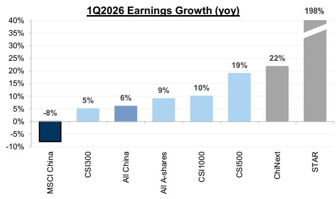  
Source: FactSet, Wind, MSCI, GS Global Investment Research  
Exhibit 2: Better earnings revision trend in A-shares/IT compared to MSCI China/Internet

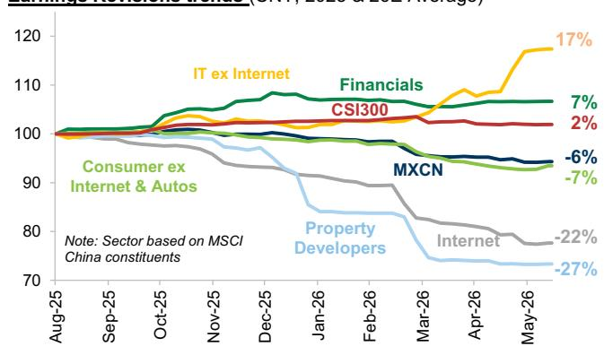  
Source: FactSet, MSCI, GS Global Investment Research

Exhibit 3: We now expect 8%/12% earnings growth for MSCI China in 2026/27E, below consensus estimates  
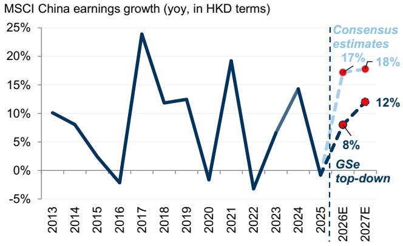  
Source: MSCI, FactSet, GS Global Investment Research

Exhibit 4: Profit growth momentum for offshore tech could improve in 2H26 per GS and consensus expectations  
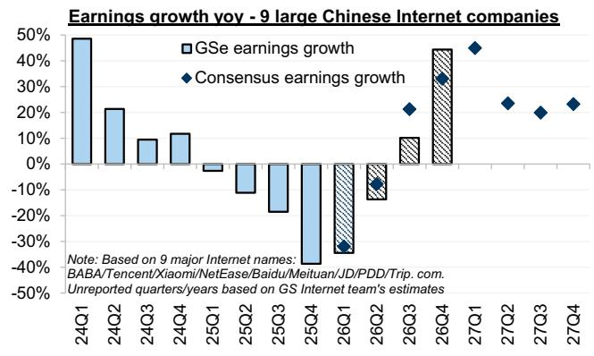  
Source: MSCI, FactSet, GS Global Investment Research  
Exhibit 5: The 1H/2Q26 earnings season will kick off in August

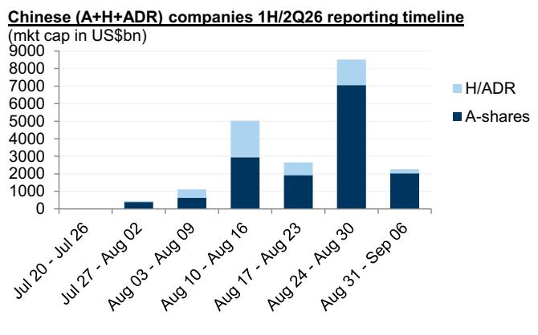  
Source: Bloomberg, GS Global Investment Research

Exhibit 6: Based on our top-down model and analysts estimates, we expect 0%/+11%/+9% earnings growth yoy for MSCI China/CSI300/All China in 2Q26  
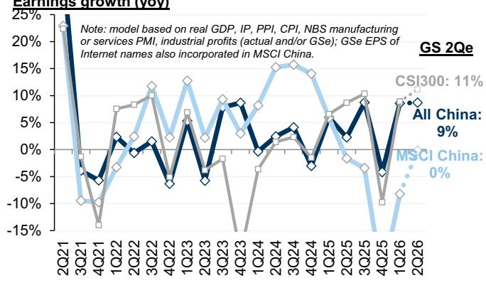  
Source: Wind, FactSet, NBS, GS Global Investment Research

## 2) AI profits shifting towards hardware, both globally and domestically

Global AI profit pool: We laid out our global AI equity universe maps in March, covering over 3,700 companies across 29 industries and 5 thematic layers, representing a total market cap of \$42tn. While the US dominates high-margin IP layers, such as IC Design, capturing 66% of global AI earnings, China's share is shrinking from 10% in 2024 to 9% in 2025 and 8% in 1Q26. Other regions (primarily North Asia) have capitalized on advanced foundry and memory demand, growing their global earnings share from 24% in 2024 to 27% in 1Q26. The Chinese AI universe's earnings grew by 10%/35% yoy in 2025/1Q26 (led by upstream hardware, with Chinese Power, Semis, and Infrastructure layers growing 18%/12%/46% in 2025 and 32%/141%/70% in 1Q26, respectively), while the US AI universe's earnings grew by 30%/67% yoy.

Within China's AI supply chain, the profit pool has undergone a pronounced rebound toward hardware (to $54\%$ in 1Q26 vs $41\%$ in 2024). This was particularly evident in semiconductors, with Memory, IC Design, and Materials gaining the most earnings share, while Foundry slightly lost share. Among the power and infrastructure layers, the profit pool shifted toward Data Center, Power Generation, and PCB/CCL. Consequently, AI applications lost share, falling from $59\%$ in 2024 to $46\%$ in 1Q26.

\- Capex drivers: This rebound toward hardware is heavily supported by the massive Capex commitments of major CSPs. As shown in Exhibit 9, US hyperscalers continue to aggressively scale up AI Capex, while Chinese CSPs are also accelerating their spending, providing a visible demand runway for upstream hardware players.

Exhibit 7: China's share in global AI profit pool declined as other regions gained  
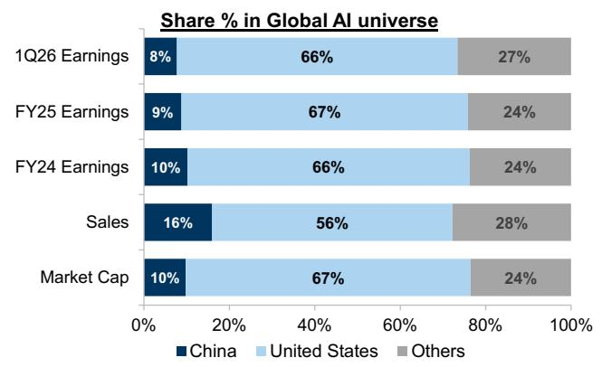  
Source: FactSet, MSCI, GS Global Investment Research

Exhibit 8: The margin profile for Chinese AI companies still lags global peers  
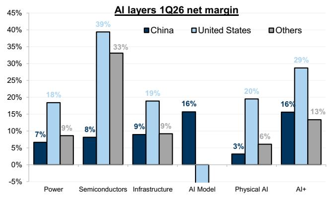  
Source: FactSet, MSCI, GS Global Investment Research

Exhibit 9: Both US and Chinese hyperscalers keep scaling up AI Capex estimates by GS Internet team (US\$bn)

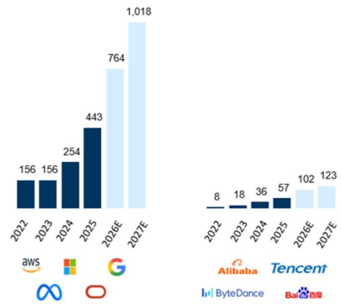  
Our Internet analysts calculate Bytedance's (Not Covered) relevant operating metrics by analyzing the industry and companies that they cover, and then extrapolating them to Bytedance.

Exhibit 10: The semiconductors layer grew the fastest in the Chinese AI universe in 1Q26  
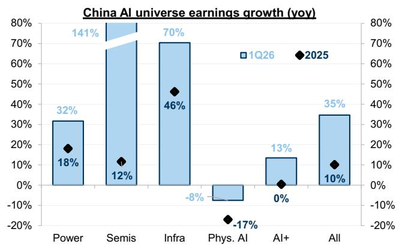  
Source: FactSet, MSCI, GS Global Investment Research  
Source: Company data, GS Global Investment Research  
Exhibit 11: Within China's AI supply chain, the internal profit pool has undergone a rebound toward hardware

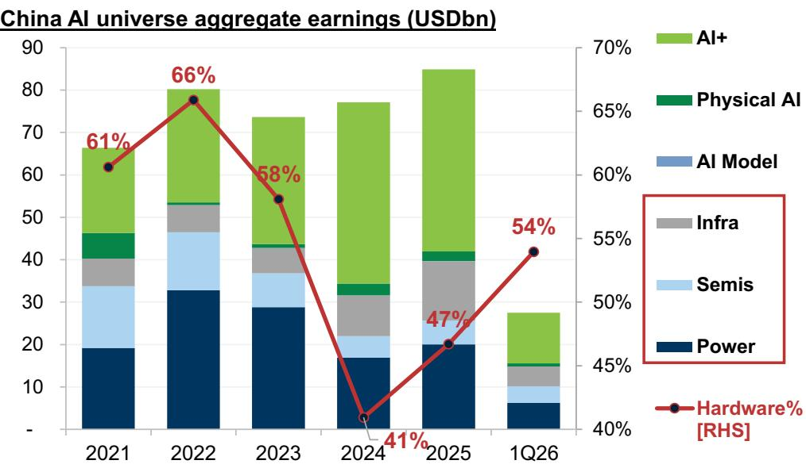  
For definition and weighting methods of the AI universe, please refer to China Strategy | AI changes the game (Part 2): A top-down guide to the Chinese AI universe  
Source: FactSet, MSCI, GS Global Investment Research

## 3) Recovering aggregate revenues but bifurcated margins in “involuted” sectors

■ Revenue acceleration: In 1Q26, the aggregate revenue growth for the listed universe picked up to +4% yoy, up from +1% in 2025 and -1% in 2024. This overall improvement masks a bifurcated sector landscape, characterized by sharp rebounds in cyclicals and tech-heavy sectors (Brokers/IT/Industrial all +15% yoy in 1Q26), a stabilization in consumer staples, and substantial declines in Real Estate.

Margin divergence: The net margin for the listed universe remained stable, ticking up slightly to 9.0% in 1Q26 (from 8.9% in 1Q25). Consumer-facing New Economy/POE and Banks (pressured by narrowing NIM) generally underperformed their Old Economy/SOE counterparts. Among our defined “involuted” sectors, Semiconductors, Industrial Metals, and Airlines (aided by an 8% yoy decline in domestic jet fuel prices in 1Q26) were the primary margin gainers. Conversely, the margin erosion was exacerbated in select consumer sectors (Autos, Agriculture, and E-commerce), Construction Materials (such as Cement and Steel) and Solar Equipment, highlighting a stark divergence between a hard-tech recovery and a consumer/property-linked slowdown. See Exhibit 33 in Appendix for more details.

Exhibit 12: Aggregate revenue growth for the All China universe accelerated to 4% in 1Q26 vs. +1% in 2025  
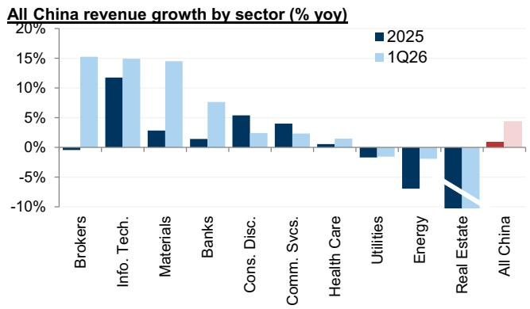  
Source: Wind, FactSet, Bloomberg, GS Global Investment Research

Exhibit 13: Mixed margin profile across the “involuted” sectors in 1Q26  
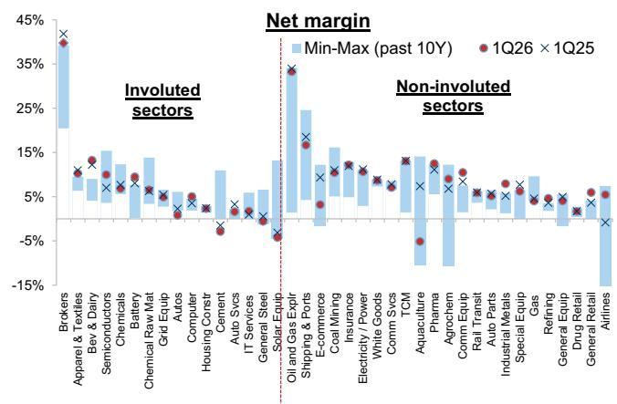  
Source: Wind, FactSet, GS Global Investment Research

## 4) "Going Global" is still ongoing

Sustained momentum: Chinese corporate overseas revenue exposure continued its upward trajectory to 18% in 2025 from 16% in 2024. The Auto sector has been the leader of this globalization trend, surging to 29% in 2025 (+8pp vs. 2024 due to rapid EV overseas expansion), and the 1Q26 results for the sector leader confirmed the trend. This globalization trend is increasingly broad-based, with Semiconductors, Transportation, Capital Goods, Durables, and Pharma & Biotech also making inroads. Conversely, Tech Hardware (driven by smartphones) and Energy both declined.

Profitability premium: Most sectors still enjoy better profit margins in overseas markets compared to their domestic operations (as shown in Exhibit 16), providing a strong structural incentive for continued international expansion. In fact, Chinese exporters (>50% overseas exposure) delivered robust growth across both revenue and earnings in 1Q26 (see Exhibit 28 in Appendix), significantly higher than the aggregate listed universe.

FX impact: The FX impact reversed to a net loss of Rmb5.8bn in 2025 from a net gain of Rmb3.3bn in 2024, driven by a slight appreciation of the CNY against the USD (on a full-year average basis). Export-heavy and commodity-related segments (including Industrials, Materials, Energy, and IT) experienced a squeeze, while USD-debt-heavy sectors (such as Airlines) and Consumer Discretionary capitalized on this currency strength.

Exhibit 14: Foreign sales exposure of Chinese listed universe rose further to 18% despite tariff headwinds

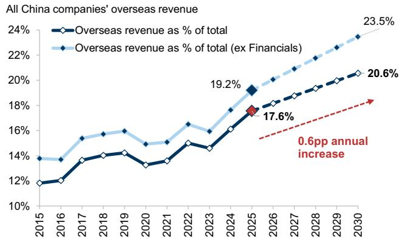  
Source: Wind, FactSet, GS Global Investment Research  
Exhibit 15: Autos and Pharma are the leaders in the globalization trend

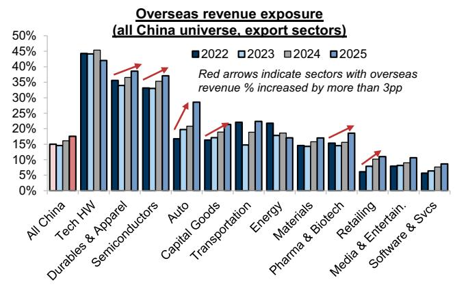  
Source: Wind, FactSet, GS Global Investment Research

Exhibit 16: Most sectors enjoy better profitability in the overseas markets  
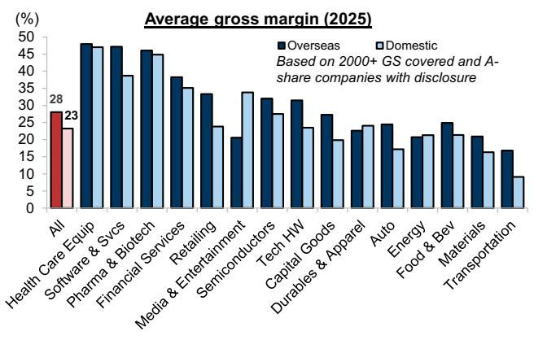  
Source: Wind, FactSet, GS Global Investment Research

Exhibit 17: A slight FX loss was recorded in 2025 due to CNY appreciation  
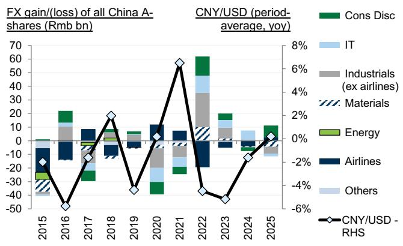  
Source: FactSet, MSCI, GS Global Investment Research

## 5) Record cash returns along with more R&D and acquisitions

Record-high cash returns driven by dividends: Aggregate dividends distributed by the All-China listed universe aligned with our prior expectations at Rmb3.0tn in 2025. Traditional and SOE-dominated sectors, such as Consumer Staples, Utilities, Financials, and Energy raised their dividend payouts, supported by regulatory directives that encourage higher payout ratios and interim and quarterly dividend distributions.

■ Conversely, share buybacks fell short, totaling Rmb0.4tn (-11% yoy). This decline in buybacks was heavily concentrated in Internet (Retailing and Media), where buyback volume fell 28% in 2025 as companies prioritized AI spending and quick commerce subsidies. Despite lower volumes, net buybacks remain accretive to EPS for existing MSCI China universe (ex-Financials).

Shifts in corporate cash allocation: Beyond shareholder returns, growth investments grew by 3% yoy (vs. -5% in 2024). Sector-level spending varied dramatically underneath a flat Capex (remaining at Rmb6.4tn): Retailing, Tech Hardware, and Media grew by 94%, 22%, and 16% yoy, respectively, whereas Real Estate, Solar Equipment, and Materials declined by 33%, 48%, and 8% yoy, reflecting a disciplined approach to capacity expansion in oversupplied industries. Conversely, cash allocated to acquisitions surged by 46% yoy to Rmb0.7tn, as relaxed regulatory frameworks prompted leading Chinese firms to increasingly prioritize inorganic growth, industry consolidation, and overseas expansion. Meanwhile, R&D spending rose 3% yoy to Rmb2.1tn, driven by sustained corporate commitments to localized technology and AI hardware.

For 2026, we project total shareholder returns to reach Rmb3.8tn, led by a 15% yoy increase in dividends to Rmb3.4tn, which represents a total shareholder yield of 2.9% (vs. 2.7% in 2025). The surge is supported by robust A-share and upstream earnings growth and favorable regulatory tailwinds. Growth investments are also expected to remain flat, with modestly lower Capex (primarily in “involuted” sectors, while remaining strong in Tech Hardware) offset by higher spending on R&D and acquisitions.

All China - Dividend Payout Ratio  
Exhibit 18: Chinese corporates spent more cash on dividends, acquisitions, and R&D in 2025 (Rmb tn/%) All China listed universe - Use of Cash  
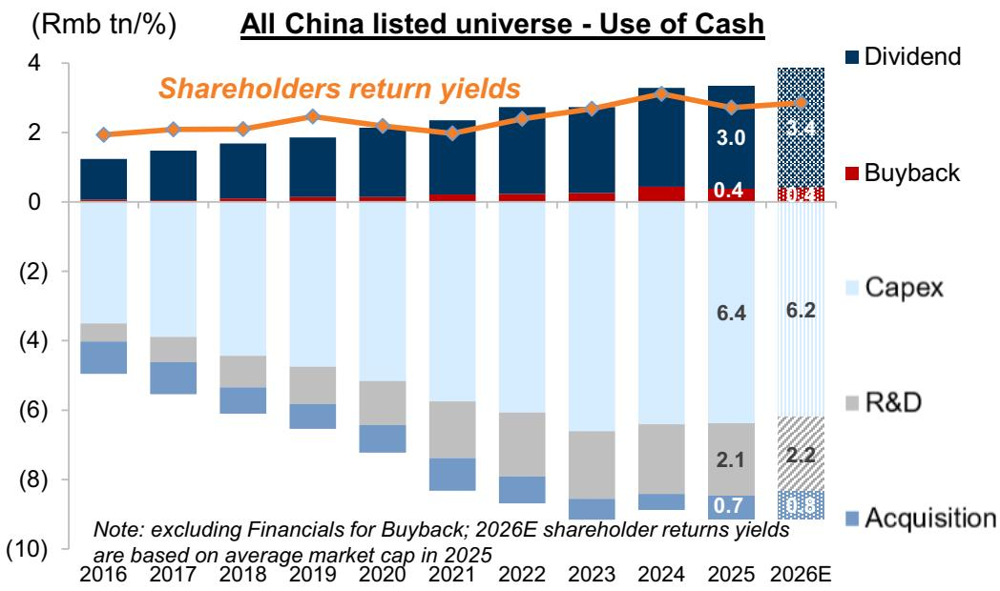  
Source: FactSet, Wind, GS Global Investment

Exhibit 19: Dividend payout ratio edged up to 39% in 2025  
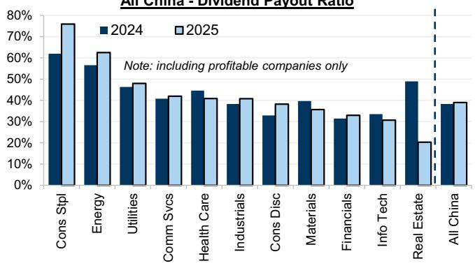  
Source: FactSet, Wind, GS Global Investment

Exhibit 20: Net buybacks remain accretive to EPS despite lower absolute volumes  
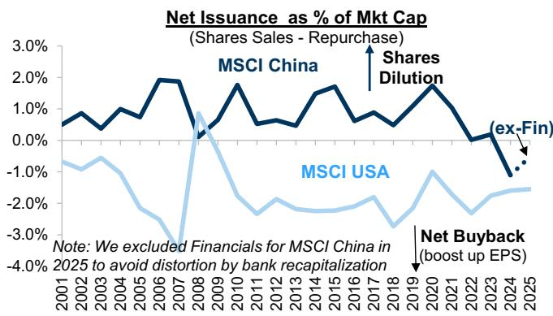  
Represents the net change in the carrying value of common and preferred stock  
Source: FactSet, MSCI, GS Global Investment Research

6) Key themes from earnings calls: AI and “Going Global”

AI discussion trends: We compiled over 4,500 earnings call transcripts released by Chinese companies and extracted the key themes discussed by management and investors. Overall, approximately 1/4 of companies directly referenced “artificial intelligence” or closely related keywords (such as semiconductors, memory chips, and humanoid robots) on earnings calls. The surge in AI-related discussions has been notable in physical and hardware-heavy sectors, such as Capital Goods, Tech Hardware, and Materials, compared to previous quarters. Conversely, downstream segments experienced a relative moderation.

Sustained focus on globalization: Concurrently, “Going Global” initiatives remained a dominant strategic focus across nearly all manufacturing and hard-tech sectors in 1Q26. Sectors such as Capital Goods, Materials, Tech Hardware, and Biotechnology saw a notable rise in overseas expansion discussions. Direct mentions of tariff headwinds generally moderated or stabilized at lower levels compared to the peaks of 1Q25.

Exhibit 21: AI/Technology and shareholder (returns) were frequently mentioned in listed companies' earnings transcripts.

Exhibit 22: Our textual analysis reveals a notable surge in AI-related discussions within physical and hardware-heavy sectors in A-shares

<table><tr><td rowspan="2">Industry Group</td><td colspan="3">AI</td><td colspan="3">Tariff</td><td colspan="2">Shareholder Returns</td><td colspan="2">Anti-Involution</td><td colspan="2">Going global</td><td rowspan="2" colspan="2">*Ytd Perf</td></tr><tr><td>1Q26</td><td>1H/2Q25</td><td>CY24/1Q25</td><td>1Q26</td><td>1H/2Q25</td><td>CY24/1Q25</td><td>1Q26</td><td>1H/2Q25</td><td>1Q26</td><td>1H/2Q25</td><td>1Q26</td><td>1H/2Q25</td></tr><tr><td>Semis</td><td>3.1</td><td>2.9</td><td>1.4</td><td>0.3</td><td>0.5</td><td>1.3</td><td>0.9</td><td>0.1</td><td>0.7</td><td>0.1</td><td>1.8</td><td>0.4</td><td>28%</td><td></td></tr><tr><td>Tech Hardware</td><td>3.8</td><td>3.2</td><td>2.4</td><td>0.4</td><td>0.6</td><td>2.0</td><td>1.4</td><td>0.1</td><td>0.9</td><td>0.1</td><td>2.7</td><td>0.4</td><td>18%</td><td></td></tr><tr><td>Energy</td><td>0.1</td><td>1.6</td><td>0.2</td><td>0.0</td><td>0.2</td><td>1.1</td><td>0.2</td><td>0.8</td><td>0.1</td><td>0.4</td><td>0.3</td><td>0.2</td><td>12%</td><td></td></tr><tr><td>Utilities</td><td>0.2</td><td>0.6</td><td>0.3</td><td>0.1</td><td>0.2</td><td>0.2</td><td>0.6</td><td>0.9</td><td>0.1</td><td>0.1</td><td>0.3</td><td>0.2</td><td>5%</td><td></td></tr><tr><td>Capital Goods</td><td>5.1</td><td>2.6</td><td>0.5</td><td>0.9</td><td>0.8</td><td>1.2</td><td>2.5</td><td>0.4</td><td>1.4</td><td>0.1</td><td>5.6</td><td>0.7</td><td>-1%</td><td></td></tr><tr><td>Cons Durables</td><td>1.2</td><td>3.9</td><td>1.1</td><td>0.4</td><td>1.4</td><td>5.8</td><td>0.9</td><td>0.7</td><td>0.5</td><td>0.1</td><td>1.8</td><td>0.6</td><td>-2%</td><td></td></tr><tr><td>Banks</td><td>0.2</td><td>0.9</td><td>0.5</td><td>0.0</td><td>0.1</td><td>0.1</td><td>0.3</td><td>0.7</td><td>0.1</td><td>0.1</td><td>0.1</td><td>0.1</td><td>-3%</td><td></td></tr><tr><td>Materials</td><td>2.1</td><td>0.9</td><td>0.3</td><td>0.8</td><td>0.3</td><td>1.3</td><td>2.4</td><td>0.3</td><td>1.6</td><td>0.1</td><td>3.4</td><td>0.3</td><td>-4%</td><td></td></tr><tr><td>Software Svcs</td><td>2.6</td><td>4.9</td><td>6.3</td><td>0.2</td><td>0.2</td><td>0.2</td><td>0.7</td><td>0.0</td><td>0.2</td><td>0.1</td><td>0.9</td><td>0.2</td><td></td><td>-8%</td></tr><tr><td>Biotech</td><td>0.8</td><td>0.9</td><td>0.7</td><td>0.4</td><td>0.2</td><td>1.4</td><td>0.9</td><td>0.4</td><td>0.4</td><td>0.1</td><td>1.7</td><td>0.2</td><td></td><td>-11%</td></tr><tr><td>Transportation</td><td>0.4</td><td>3.5</td><td>0.9</td><td>0.1</td><td>1.1</td><td>1.3</td><td>0.5</td><td>0.5</td><td>0.1</td><td>0.2</td><td>0.4</td><td>0.9</td><td></td><td>-13%</td></tr><tr><td>Div Financials</td><td>0.1</td><td>1.8</td><td>1.7</td><td>0.0</td><td>0.4</td><td>0.0</td><td>0.2</td><td>0.4</td><td>0.0</td><td>0.7</td><td>0.2</td><td>0.4</td><td></td><td>-14%</td></tr><tr><td>Food Bev</td><td>0.5</td><td>0.9</td><td>0.1</td><td>0.2</td><td>0.1</td><td>1.0</td><td>0.6</td><td>0.4</td><td>0.4</td><td>0.2</td><td>1.0</td><td>0.1</td><td></td><td>-15%</td></tr><tr><td>Property</td><td>0.2</td><td>1.6</td><td>0.6</td><td>0.0</td><td>0.6</td><td>0.0</td><td>0.4</td><td>0.0</td><td>0.1</td><td>0.1</td><td>0.3</td><td>0.5</td><td></td><td>-18%</td></tr><tr><td>HC Equip &amp; Svcs</td><td>0.9</td><td>1.1</td><td>2.0</td><td>0.3</td><td>0.7</td><td>1.4</td><td>0.6</td><td>0.2</td><td>0.3</td><td>0.1</td><td>1.4</td><td>0.7</td><td></td><td>-20%</td></tr><tr><td>Cons Svcs</td><td>0.6</td><td>2.0</td><td>1.2</td><td>0.1</td><td>1.5</td><td>0.0</td><td>0.5</td><td>0.5</td><td>0.1</td><td>0.2</td><td>0.6</td><td>1.5</td><td></td><td>-21%</td></tr><tr><td>Autos</td><td>1.1</td><td>4.0</td><td>0.3</td><td>0.1</td><td>0.4</td><td>2.4</td><td>0.4</td><td>0.1</td><td>0.2</td><td>0.2</td><td>0.9</td><td>0.4</td><td></td><td>-21%</td></tr><tr><td>Telecom Svcs</td><td>0.0</td><td>2.7</td><td>1.3</td><td>0.0</td><td>0.0</td><td>0.2</td><td>0.0</td><td>0.2</td><td>0.0</td><td>0.2</td><td>0.0</td><td>0.0</td><td></td><td>-22%</td></tr><tr><td>Media &amp; Ent</td><td>1.2</td><td>3.3</td><td>5.7</td><td>0.2</td><td>0.3</td><td>0.2</td><td>0.9</td><td>0.5</td><td>0.3</td><td>0.2</td><td>1.1</td><td>0.3</td><td></td><td>-25%</td></tr><tr><td>Retailing</td><td>0.2</td><td>0.3</td><td>1.4</td><td>0.1</td><td>0.1</td><td>0.4</td><td>0.2</td><td>0.1</td><td>0.1</td><td>0.0</td><td>0.4</td><td>0.1</td><td></td><td>-38%</td></tr></table>

\*YTD performance references refer to CSI300 performance by industry group.  
Source: Wind, FactSet, GS Global Investment Research

Methodology & Tools: To systematically track corporate sentiment, we utilized our text-mining tools to parse over 4,500 earnings call transcripts and investor relations Q&A sessions released by 3,000+ listed Chinese companies (primarily A-shares) since April 2026. Our analysis follows the approach below:

1. Data acquisition: We download the raw transcripts of earnings calls (primarily in Chinese), which typically cover both management presentation and investor Q&A sessions.

2. Thematic keyword mapping: We defined and categorized key search terms into distinct strategic themes (e.g., “AI/Semis/Chips/Humanoid robots” under the AI theme, and “Overseas expansion/exports” under the “Going Global” theme).

3. Frequency calculation: We calculated the adjusted frequency as the number of keywords per thousand words.

4. Historical comparison: We compared the frequency and sentiment of these discussions against our previous textual analysis exercises conducted in 1H/2Q25 and CY24/1Q25, which allows us to identify shifting thematic trends and corporate priorities.

## Following the profit growth: refreshing GS China Growth Portfolio

To help investors identify high-conviction growth opportunities with compelling risk/reward profiles, we have refreshed our GS China Growth Portfolio, selecting 25 premier names across the China A-share and H-share markets. Our selection process systematically leverages corporate disclosures, earnings call transcripts, profit guidance, and NDR notes to target companies aligned with our core structural themes.

To ensure the portfolio remains highly selective and geared toward high-performing leaders, we have upgraded our screening framework across three key dimensions:

☐ a) Near-term catalysts: we prioritize companies with clear operational tailwinds, specifically focusing on price increases, Capex expansion, or overseas market penetration. Eligible constituents must have explicitly discussed these strategic drivers in their recent earnings calls or corporate announcements;

☐ b) Robust growth profile: we have raised our growth threshold, now requiring an estimated 2025–27E EPS CAGR of greater than 10%, compared to >5% EPS CAGR previously;

☐ c) Positive earnings momentum: selected companies must demonstrate positive revision trends, defined as an average upward revision of at least 1% in their 2026/2027E EPS estimates over the trailing month.

The refreshed portfolio exhibits a highly robust fundamental profile, with the 25 constituents having a median market cap/ADVT/25-27E EPS CAGR of US\$16bn/US\$249mn/39%. On an equal-weighted basis, the portfolio trades at a forward P/E of 23x and a forward PEG of 1.4x. This strong absolute and relative performance—rallying +102% ytd and +14% in the past 4 weeks (equal-weighted from the start of the period)—strongly validates our core investment thesis for visible earnings delivery. In the current environment, low valuation in isolation is no longer a reliable driver of outperformance; instead, the focus has shifted decisively to where earnings are actually being generated.

We also compiled the 1Q26 earnings wraps by our sector analysts in Exhibit 26, which highlights the key surprises and key stock ideas for implementation.

Exhibit 23: We screen for 25 names as our refreshed GS China Growth Portfolio to help investors identify growth opportunities with compelling risk/reward profiles

<table><tr><td colspan="8">Discussed in companyannouncements / earnings calls</td><td>&gt;=5bn</td><td>&gt;20mn</td><td>&gt;10%</td><td></td><td>&gt;=1%</td></tr><tr><td>Ticker</td><td>Name</td><td>GICS Industry Group</td><td>Price hike</td><td>Capex / overseas expansion</td><td>25 Foreign sales exposure %</td><td>Quoted Price</td><td>Quoted Ccy</td><td>Total Mkt Cap (US$bn)</td><td>ADVT (US$mn)</td><td>25-27E EPS CAGR (%)</td><td>26E P/E (X)</td><td>26/27 Avg EPS rev in past 1M (%)</td></tr><tr><td colspan="13">GS China Growth Portfolio</td></tr><tr><td>300308 CS</td><td>Zhongji Innolight</td><td>Tech HW</td><td></td><td>√</td><td>91%</td><td>1,367.9</td><td>CNY</td><td>226</td><td>3420</td><td>122</td><td>45</td><td>+1</td></tr><tr><td>2899 HK</td><td>Zijin Mining</td><td>Materials</td><td>√</td><td>√</td><td>57%</td><td>32.1</td><td>HKD</td><td>115</td><td>342</td><td>38</td><td>9</td><td>+1</td></tr><tr><td>002475 CS</td><td>Luxshare Precision</td><td>Tech HW</td><td></td><td>√</td><td>85%</td><td>69.9</td><td>CNY</td><td>75</td><td>1512</td><td>29</td><td>24</td><td>+1</td></tr><tr><td>600183 CG</td><td>Shengyi Tech</td><td>Tech HW</td><td>√</td><td>√</td><td>24%</td><td>183.9</td><td>CNY</td><td>66</td><td>781</td><td>52</td><td>77</td><td>+4</td></tr><tr><td>3986 HK</td><td>GigaDevice Semi</td><td>Semis</td><td>√</td><td></td><td></td><td>939.0</td><td>HKD</td><td>66</td><td>125</td><td>154</td><td>70</td><td>+2</td></tr><tr><td>3993 HK</td><td>China Molybdenum</td><td>Materials</td><td>√</td><td>√</td><td>92%</td><td>18.9</td><td>HKD</td><td>61</td><td>136</td><td>33</td><td>11</td><td>+1</td></tr><tr><td>2338 HK</td><td>Weichai Power</td><td>Cap Goods</td><td>√</td><td>√</td><td>53%</td><td>39.7</td><td>HKD</td><td>40</td><td>91</td><td>33</td><td>21</td><td>+2</td></tr><tr><td>1888 HK</td><td>Kingboard Laminates</td><td>Tech HW</td><td>√</td><td>√</td><td>8%</td><td>91.9</td><td>HKD</td><td>37</td><td>207</td><td>86</td><td>40</td><td>+36</td></tr><tr><td>600176 CG</td><td>China Jushi</td><td>Materials</td><td>√</td><td>√</td><td>33%</td><td>53.5</td><td>CNY</td><td>32</td><td>562</td><td>50</td><td>36</td><td>+4</td></tr><tr><td>301217 CS</td><td>Tongguan Copper Foil</td><td>Materials</td><td>√</td><td>√</td><td>3%</td><td>200.0</td><td>CNY</td><td>25</td><td>364</td><td>408</td><td>200</td><td>+22</td></tr><tr><td>301308 CS</td><td>Longsys Electronics</td><td>Tech HW</td><td>√</td><td>√</td><td>67%</td><td>577.8</td><td>CNY</td><td>24</td><td>1048</td><td>99</td><td>18</td><td>+64</td></tr><tr><td>002080 CS</td><td>Sinoma Science &amp; Tech</td><td>Materials</td><td>√</td><td>√</td><td>9%</td><td>80.6</td><td>CNY</td><td>20</td><td>395</td><td>45</td><td>47</td><td>+2</td></tr><tr><td>1929 HK</td><td>Chow Tai Fook</td><td>Retailing</td><td>√</td><td></td><td></td><td>12.4</td><td>HKD</td><td>16</td><td>29</td><td>15</td><td>12</td><td>+4</td></tr><tr><td>601689 CG</td><td>Ningbo Tuopu</td><td>Autos</td><td></td><td>√</td><td>21%</td><td>62.3</td><td>CNY</td><td>16</td><td>358</td><td>19</td><td>33</td><td>+1</td></tr><tr><td>1138 HK</td><td>COSCO Shipping Energy</td><td>Energy</td><td>√</td><td>√</td><td>76%</td><td>15.9</td><td>HKD</td><td>14</td><td>80</td><td>27</td><td>8</td><td>+2</td></tr><tr><td>002648 CS</td><td>Satellite Petro</td><td>Materials</td><td>√</td><td>√</td><td>17%</td><td>21.7</td><td>CNY</td><td>11</td><td>249</td><td>32</td><td>9</td><td>+2</td></tr><tr><td>000960 CS</td><td>Yunnan Tin</td><td>Materials</td><td>√</td><td>√</td><td>24%</td><td>41.7</td><td>CNY</td><td>10</td><td>400</td><td>39</td><td>20</td><td>+13</td></tr><tr><td>600460 CG</td><td>Silan Microelectronics</td><td>Semis</td><td>√</td><td>√</td><td></td><td>41.8</td><td>CNY</td><td>10</td><td>297</td><td>84</td><td>76</td><td>+4</td></tr><tr><td>600426 CG</td><td>Hualu-Hengsheng</td><td>Materials</td><td>√</td><td>√</td><td>5%</td><td>25.5</td><td>CNY</td><td>8</td><td>156</td><td>29</td><td>11</td><td>+1</td></tr><tr><td>600988 CG</td><td>Chifeng Jilong Gold</td><td>Materials</td><td>√</td><td>√</td><td>71%</td><td>30.6</td><td>CNY</td><td>8</td><td>387</td><td>39</td><td>10</td><td>+1</td></tr><tr><td>601233 CG</td><td>Tongkun Group</td><td>Materials</td><td>√</td><td>√</td><td>8%</td><td>21.0</td><td>CNY</td><td>7</td><td>141</td><td>49</td><td>11</td><td>+7</td></tr><tr><td>300037 CS</td><td>Capchem</td><td>Materials</td><td>√</td><td>√</td><td>17%</td><td>83.3</td><td>CNY</td><td>7</td><td>249</td><td>51</td><td>30</td><td>+2</td></tr><tr><td>002126 CS</td><td>Yinlun Machinery</td><td>Autos</td><td></td><td>√</td><td>21%</td><td>52.7</td><td>CNY</td><td>6</td><td>179</td><td>29</td><td>36</td><td>+2</td></tr><tr><td>002444 CS</td><td>Great Star Indus</td><td>Cons Dur</td><td>√</td><td>√</td><td>94%</td><td>29.6</td><td>CNY</td><td>5</td><td>65</td><td>18</td><td>12</td><td>+1</td></tr><tr><td>300866 CS</td><td>Anker Innovations</td><td>Tech HW</td><td></td><td>√</td><td>97%</td><td>117.1</td><td>CNY</td><td>5</td><td>95</td><td>25</td><td>20</td><td>+1</td></tr><tr><td>Median</td><td></td><td></td><td></td><td></td><td></td><td>52.7</td><td></td><td>16</td><td>249</td><td>39</td><td>21</td><td>+2</td></tr></table>

Notes: Prices as of Jun 18, 2026; Valuation and EPS revision items are I/B/E/S consensus.

Source: Wind, FactSet, Bloomberg, IBES, GS Global Investment Research

Exhibit 24: The refreshed portfolio exhibits strong performance and EPS revision trends  
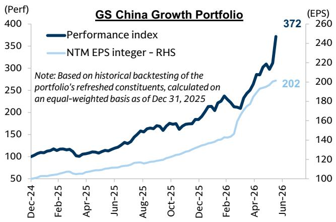  
Source: FactSet, IBES, GS Global Investment Research

Exhibit 25: The portfolio trades at 23x fP/E and 1.4x fPEG on an equal-weighted basis  
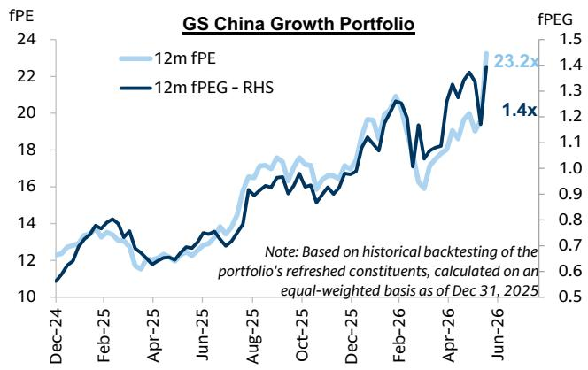  
Source: FactSet, IBES, GS Global Investment Research

Exhibit 26: Summary of 1Q26 earnings results by sector

<table><tr><td>Sector</td><td>Sub-sector</td><td>1Q26 result summary</td><td>Key surprises</td></tr><tr><td rowspan="4">Consumer</td><td>Cosmetics</td><td>In line; sales up, GPM down.</td><td>Positive: Botanee beat.Negative: Jahwa &amp; Bloomage missed.</td></tr><tr><td>Sportswear</td><td>Mixed; GPM contracted on discounts.</td><td>Positive: Li Ning &amp; Anta beat.Negative: Xtep missed.</td></tr><tr><td>Consumer Durables</td><td>Flat sales, profits -3%. White goods resilient.</td><td>Positive: White goods margins beat.Negative: Furniture missed.</td></tr><tr><td>Pet Food</td><td>Online sales grew; domestic outperformed.</td><td>Negative: Missed on high promo costs &amp; FX.</td></tr><tr><td rowspan="2">Healthcare</td><td>Plasma</td><td>Revenue down; pressure from VAT &amp; VBP.</td><td>Negative: Oversupply &amp; vaccine ASP risk.</td></tr><tr><td>Drug Chains</td><td>Stabilized; SSSG positive since mid-2025.</td><td>Positive: SSSG ~5% on prescription outflow.</td></tr><tr><td>Industrials</td><td>Industrial Tech</td><td>In line; FX &amp; material cost headwinds.</td><td>Positive: Han&#x27;s Laser &amp; Hongfa beat.Negative: Sungrow missed.</td></tr><tr><td rowspan="2">Transportation</td><td>Airports</td><td>SIAC in line; GBIA beat.</td><td>Positive: GBIA D&amp;A lower.Negative: SIAC DFS rental down.</td></tr><tr><td>Airlines</td><td>Returned to profit in 1Q26.</td><td>Negative: Labor Day traffic weak (-5% YoY).</td></tr><tr><td rowspan="2">Financials</td><td>Insurance</td><td>Beat on tax/bond sales; NBV strong.</td><td>Positive: China Life NBV beat.Negative: Solvency down.</td></tr><tr><td>Banks</td><td>PPOP +12% (+6% beat); NP +4%.</td><td>Positive: NIM +2bps QoQ.Negative: Provisions +29% YoY.</td></tr><tr><td rowspan="7">Technology &amp; Internet</td><td>Cloud</td><td>Strong revenue growth driven by AI demand.</td><td>Positive: Alibaba Cloud AI grew triple-digit.Negative: None.</td></tr><tr><td>Data Centers</td><td>Softer 1Q26 capacity expansion on seasonality and chip constraints.</td><td>Positive: Robust YTD orders.Negative: GDS China pricing pressure.</td></tr><tr><td>Games</td><td>Healthy segment mostly uncorrelated to macro with margin expansion.</td><td>Positive: Apple/Google reduced China commission rates.Negative: None.</td></tr><tr><td>Entertainment</td><td>Diverging trends with Bilibili strong but Kuaishou/TME soft.</td><td>Positive: Kling AI reached $500mn ARR.Negative: Kuishou ads/eCommerce headwinds.</td></tr><tr><td>eCommerce</td><td>Soft 2Q online retail trends led to moderated growth.</td><td>Positive: JD Retail maintained solid margins.Negative: PDD growth slowed on taxes.</td></tr><tr><td>Mobility &amp; Local Services</td><td>Clear paths toward profit recovery starting in 2H26E.</td><td>Positive: Meituan achieved faster 2Q breakeven.Negative: DiDi near-term group profit pressure.</td></tr><tr><td>AI Models</td><td>MiniMax launched M3; Zhipu/MiniMax target $1bn ARR.</td><td>Positive: M3 priced twice predecessor&#x27;s rate.Negative: Intense API price cuts.</td></tr><tr><td rowspan="7">Basic Materials</td><td>Steel</td><td>Unit gross profits and earnings estimates revised down.</td><td>Positive: None.Negative: Delayed capacity cuts depressed margins.</td></tr><tr><td>Coal</td><td>Spot price forecasts and earnings estimates revised up.</td><td>Positive: Strong supply/demand fundamentals.Negative: Yankuang-A downgraded on overvaluation.</td></tr><tr><td>Cement</td><td>Unit gross profits and earnings estimates revised down.</td><td>Positive: Demand expected to stabilize in 2H26.Negative: Weaker 2Q26E pricing.</td></tr><tr><td>Aluminum</td><td>Spreads expected to decline in 2H26E, minor earnings changes.</td><td>Positive: Spreads expected to normalize in 2H26E.Negative: Spreads declining HoH.</td></tr><tr><td>Copper</td><td>Price forecasts and earnings estimates revised up.</td><td>Positive: Global market in deficit.Negative: Slower mine production recovery.</td></tr><tr><td>Gold</td><td>Price forecasts cut by 5%, slightly reducing earnings.</td><td>Positive: Bullish target of $5,400/oz by end-2026E.Negative: Near-term forecast cut.</td></tr><tr><td>Paper</td><td>Earnings revised down on declining paper prices.</td><td>Positive: None.Negative: New capacity additions kept utilization low.</td></tr><tr><td rowspan="4">Agriculture</td><td>Hog &amp; feed</td><td>Price assumptions and earnings estimates revised down.</td><td>Positive: Cyclical upturn expected in 2H26E.Negative: Weak 1H26 pricing.</td></tr><tr><td>Fertilizer</td><td>Unit gross profits and earnings estimates revised down.</td><td>Positive: Margin recovery expected in 2H26E.Negative: Rising sulfur input costs.</td></tr><tr><td>Traditional seed</td><td>Sales volume and earnings estimates revised down.</td><td>Positive: None.Negative: Delayed purchases due to high fertilizer prices.</td></tr><tr><td>Animal health &amp; feed additive</td><td>Minor earnings revisions of -1% to 2%.</td><td>Positive: Adisseo supported by methionine pricing.Negative: Weak vaccine sales.</td></tr></table>

Source: GS Global Investment Research

## Appendix

Exhibit 27: Top-line growth may pick up for MSCI China universe  
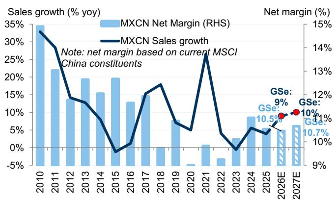  
Source: Wind, FactSet, Bloomberg, GS Global Investment Research

Exhibit 28: Exporters saw resilient top-line and earnings growth in 1Q26  
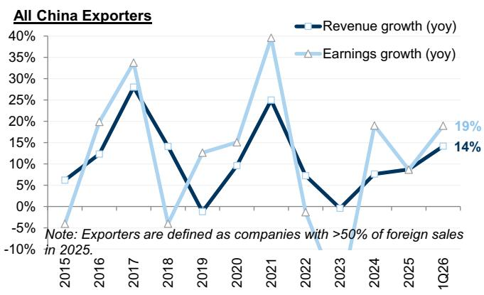  
Source: Wind, Bloomberg, FactSet, GS Global Investment Research

Exhibit 29: All listed developers incurred around Rmb400bn of net losses in 2025  
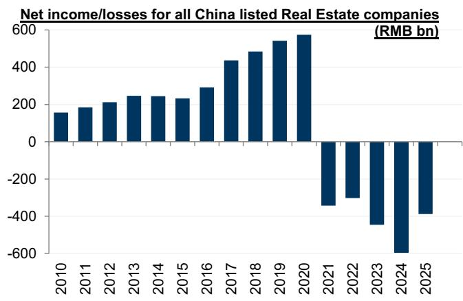  
Including both developers and property management companies; Losses in recent years are underestimated as some real estate companies stopped/delayed disclosing financial results  
Source: Wind, GS Global Investment Research  
Exhibit 30: Still around 60% of companies in property sector are loss-making

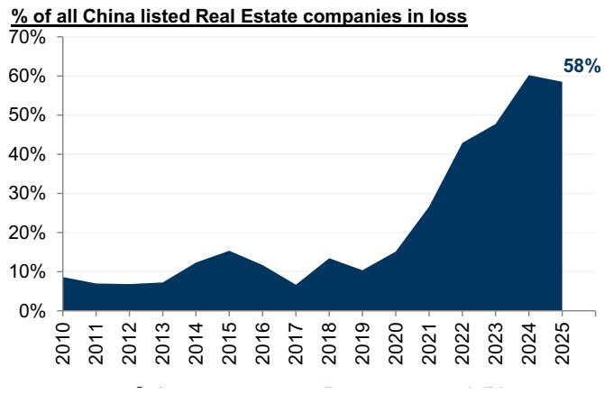  
Including both developers and property management companies; % in recent years are underestimated as some real estate companies stopped/delayed disclosing financial results  
Source: Wind, GS Global Investment Research

Exhibit 33: Consensus estimates Capex growth to moderate in most sectors while tech hardware notably upscales the Capex

<table><tr><td></td><td>All China listed universe (A+H+ADR)</td><td colspan="3">Earnings Growth (yoy)</td><td colspan="3">Revenue Growth (yoy)</td><td colspan="3">Net Margin</td><td colspan="3">R&amp;D intensity</td><td colspan="3">Capex Growth (yoy)</td><td></td></tr><tr><td>Cohorts</td><td>Industry</td><td>CY19-1Q26 trend</td><td>1Q26 vs 19-25 median</td><td>26-28E vs 19-25 median</td><td>CY19-1Q26 trend</td><td>1Q26 vs 19-25 median</td><td>26-28E vs 19-25 median</td><td>CY19-1Q26 trend</td><td>1Q26 vs 19-25 median</td><td>26-28E vs 19-25 median</td><td>CY19-1Q26 trend</td><td>1Q26 vs 19-25 median</td><td></td><td>CY19-1Q26 trend</td><td>1Q26 vs 19-25 median</td><td>26-28E vs 19-25 median</td><td></td></tr><tr><td rowspan="4">Traditional Energy</td><td>Oil Gas &amp; Consumable Fuels</td><td></td><td>↑</td><td>↑</td><td></td><td>↑</td><td>↑</td><td></td><td>↑</td><td>↑</td><td></td><td>↑</td><td>↓</td><td></td><td>↓</td><td>↓</td><td></td></tr><tr><td>Energy Equipment &amp; Services</td><td></td><td>↓</td><td>↑</td><td></td><td>↓</td><td>↓</td><td></td><td>↓</td><td>↑</td><td></td><td>→</td><td>↓</td><td></td><td>↓</td><td>↓</td><td></td></tr><tr><td>Ground Transportation</td><td></td><td>↑</td><td>↑</td><td></td><td>↑</td><td>↑</td><td></td><td>↓</td><td>↑</td><td></td><td>→</td><td>↓</td><td></td><td>↑</td><td>↓</td><td></td></tr><tr><td>Gas Utilities</td><td></td><td>↓</td><td>↑</td><td></td><td>↓</td><td>↓</td><td></td><td>↓</td><td>↓</td><td></td><td>→</td><td>↑</td><td></td><td>↓</td><td>↓</td><td></td></tr><tr><td rowspan="4">Renewables/ Semiconductor</td><td>Chemicals</td><td></td><td>↑</td><td>↑</td><td></td><td>↑</td><td>↑</td><td></td><td>↑</td><td>↑</td><td></td><td>→</td><td>↑</td><td></td><td>↓</td><td>↓</td><td></td></tr><tr><td>Metals &amp; Mining</td><td></td><td>↑</td><td>↑</td><td></td><td>↑</td><td>↑</td><td></td><td>↑</td><td>↑</td><td></td><td>↑</td><td>↓</td><td></td><td>↑</td><td>↓</td><td></td></tr><tr><td>Semiconductors &amp; Semiconductor Equipment</td><td></td><td>↑</td><td>↑</td><td></td><td>↓</td><td>↑</td><td></td><td>↑</td><td>↑</td><td></td><td>↑</td><td>↓</td><td></td><td>↓</td><td>↓</td><td></td></tr><tr><td>Independent Power and Renewable Electricity Producers</td><td></td><td>↓</td><td>↓</td><td></td><td>↓</td><td>↓</td><td></td><td>↓</td><td>↑</td><td></td><td>↑</td><td>↓</td><td></td><td>↓</td><td>↓</td><td></td></tr><tr><td rowspan="2">Autos</td><td>Automobile Components</td><td></td><td>↓</td><td>↑</td><td></td><td>↓</td><td>↑</td><td></td><td>↓</td><td>↑</td><td></td><td>↑</td><td>↑</td><td></td><td>↓</td><td>↓</td><td></td></tr><tr><td>Automobiles</td><td></td><td>↓</td><td>↑</td><td></td><td>↓</td><td>↑</td><td></td><td>↓</td><td>↑</td><td></td><td>↑</td><td>↑</td><td></td><td>↓</td><td>↓</td><td></td></tr><tr><td rowspan="5">Tech Hardware/ Telecom</td><td>Electronic Equipment Instruments &amp; Components</td><td></td><td>↑</td><td>↑</td><td></td><td>↑</td><td>↑</td><td></td><td>↑</td><td>↑</td><td></td><td>↓</td><td>↓</td><td></td><td>↑</td><td>↓</td><td></td></tr><tr><td>Technology Hardware Storage &amp; Peripherals</td><td></td><td>↓</td><td>↑</td><td></td><td>↓</td><td>↓</td><td></td><td>↓</td><td>↑</td><td></td><td>↑</td><td>↓</td><td></td><td>↑</td><td>↓</td><td></td></tr><tr><td>Communications Equipment</td><td></td><td>↑</td><td>↑</td><td></td><td>↑</td><td>↑</td><td></td><td>↑</td><td>↑</td><td></td><td>↑</td><td>↓</td><td></td><td>↑</td><td>↓</td><td></td></tr><tr><td>Diversified Telecommunication Services</td><td></td><td>↓</td><td>↓</td><td></td><td>↓</td><td>↓</td><td></td><td>↓</td><td>↑</td><td></td><td>→</td><td>↑</td><td></td><td>↑</td><td>↓</td><td></td></tr><tr><td>Wireless Telecommunication Services</td><td></td><td>↓</td><td>↓</td><td></td><td>↓</td><td>↓</td><td></td><td>↓</td><td>↓</td><td></td><td>→</td><td>↑</td><td></td><td>↓</td><td>↓</td><td></td></tr><tr><td rowspan="4">Property</td><td>Building Products</td><td></td><td>↓</td><td>↑</td><td></td><td>↓</td><td>↑</td><td></td><td>↓</td><td>↑</td><td></td><td>→</td><td>↑</td><td></td><td>↓</td><td>↓</td><td></td></tr><tr><td>Diversified Real Estate Activities</td><td></td><td>↑</td><td>↑</td><td></td><td>↓</td><td>↑</td><td></td><td>↑</td><td>↑</td><td></td><td>→</td><td>↑</td><td></td><td>↓</td><td>↓</td><td></td></tr><tr><td>Real Estate Development</td><td></td><td>↓</td><td>↓</td><td></td><td>↓</td><td>↓</td><td></td><td>↓</td><td>↑</td><td></td><td>→</td><td>↓</td><td></td><td>↓</td><td>↓</td><td></td></tr><tr><td>Real Estate Operating Companies</td><td></td><td>↑</td><td>↑</td><td></td><td>↑</td><td>↓</td><td></td><td>↑</td><td>↑</td><td></td><td>↓</td><td>↓</td><td></td><td>↑</td><td>↓</td><td></td></tr><tr><td rowspan="4">Infrastructure</td><td>Construction &amp; Engineering</td><td></td><td>↓</td><td>↑</td><td></td><td>↓</td><td>↓</td><td></td><td>↓</td><td>↓</td><td></td><td>↓</td><td>↑</td><td></td><td>↓</td><td>↓</td><td></td></tr><tr><td>Electrical Equipment</td><td></td><td>↑</td><td>↑</td><td></td><td>↑</td><td>↑</td><td></td><td>↓</td><td>↑</td><td></td><td>↓</td><td>↓</td><td></td><td>↑</td><td>↓</td><td></td></tr><tr><td>Machinery</td><td></td><td>↑</td><td>↑</td><td></td><td>↑</td><td>↑</td><td></td><td>↑</td><td>↑</td><td></td><td>↑</td><td>↓</td><td></td><td>↓</td><td>↓</td><td></td></tr><tr><td>Transportation Infrastructure</td><td></td><td>↑</td><td>↑</td><td></td><td>↑</td><td>↑</td><td></td><td>↓</td><td>↑</td><td></td><td>↑</td><td>↑</td><td></td><td>↑</td><td>↑</td><td></td></tr><tr><td rowspan="5">Consumer</td><td>Household Durables</td><td></td><td>↓</td><td>↑</td><td></td><td>↓</td><td>↑</td><td></td><td>↓</td><td>↑</td><td></td><td>→</td><td>↑</td><td></td><td>↑</td><td>↓</td><td></td></tr><tr><td>Textiles Apparel &amp; Luxury Goods</td><td></td><td>↓</td><td>↑</td><td></td><td>↑</td><td>↑</td><td></td><td>↑</td><td>↑</td><td></td><td>→</td><td>↓</td><td></td><td>↓</td><td>↓</td><td></td></tr><tr><td>Beverages</td><td></td><td>↓</td><td>↓</td><td></td><td>↓</td><td>↓</td><td></td><td>↓</td><td>↑</td><td></td><td>→</td><td>↓</td><td></td><td>↓</td><td>↓</td><td></td></tr><tr><td>Food Products</td><td></td><td>↓</td><td>↑</td><td></td><td>↓</td><td>↓</td><td></td><td>↓</td><td>↑</td><td></td><td>↑</td><td>↓</td><td></td><td>↓</td><td>↓</td><td></td></tr><tr><td>Hotels Restaurants &amp; Leisure</td><td></td><td>↑</td><td>↑</td><td></td><td>↑</td><td>↑</td><td></td><td>↑</td><td>↑</td><td></td><td>↓</td><td>↑</td><td></td><td>↓</td><td>↓</td><td></td></tr><tr><td rowspan="7">Financials</td><td>Banks</td><td></td><td>↑</td><td>↑</td><td></td><td>↑</td><td>↑</td><td></td><td>↓</td><td>↑</td><td></td><td>→</td><td>→</td><td></td><td>↑</td><td>→</td><td></td></tr><tr><td>Capital Markets</td><td></td><td>↓</td><td>↓</td><td></td><td>↑</td><td>↓</td><td></td><td>↓</td><td>↑</td><td></td><td>→</td><td>↑</td><td></td><td>↓</td><td>↓</td><td></td></tr><tr><td>Insurance</td><td></td><td>↓</td><td>↑</td><td></td><td>↓</td><td>↑</td><td></td><td>↑</td><td>↑</td><td></td><td>→</td><td>→</td><td></td><td>↓</td><td>↑</td><td></td></tr><tr><td>Health Care Equipment &amp; Supplies</td><td></td><td>↓</td><td>↑</td><td></td><td>↓</td><td>↑</td><td></td><td>↓</td><td>↑</td><td></td><td>↑</td><td>↑</td><td></td><td>↓</td><td>↓</td><td></td></tr><tr><td>Biotechnology</td><td></td><td>↑</td><td>↑</td><td></td><td>↓</td><td>↑</td><td></td><td>↑</td><td>↑</td><td></td><td>↓</td><td>↓</td><td></td><td>↓</td><td>↓</td><td></td></tr><tr><td>Life Sciences Tools &amp; Services</td><td></td><td>↑</td><td>↑</td><td></td><td>↑</td><td>↓</td><td></td><td>↑</td><td>↑</td><td></td><td>→</td><td>↓</td><td></td><td>↑</td><td>↓</td><td></td></tr><tr><td>Pharmaceuticals</td><td></td><td>↑</td><td>↑</td><td></td><td>↓</td><td>↑</td><td></td><td>↓</td><td>↑</td><td></td><td>↑</td><td>↑</td><td></td><td>↓</td><td>↓</td><td></td></tr><tr><td rowspan="2" colspan="2"></td><td colspan="2"># of industry ↑</td><td>18</td><td colspan="2">30 ↑</td><td>16</td><td colspan="2">22 ↑</td><td>14</td><td colspan="2">33 ↑</td><td>15</td><td colspan="2">21 ↑</td><td>16</td><td>4</td></tr><tr><td colspan="2"># of industry ↓</td><td>18</td><td colspan="2">6 ↓</td><td>20</td><td colspan="2">14 ↓</td><td>22</td><td colspan="2">3 ↓</td><td>9</td><td colspan="2">23 ↓</td><td>31</td><td>41</td></tr></table>

Source: Wind, FactSet, Bloomberg, IBES, GS Global Investment Research

Note: The universe includes all Chinese listed firms including A shares, HK-listed and US-listed; Earnings are in RMB terms; Estimates are Bloomberg consensus; Data as of Jun 9, 2026
'NM' replaces numbers that are not meaningful, when the base is negative or close to zero;
US/HK Dual-primary and secondary listings are counted only under US-listed;
\*MSCI China: index weights rather than market cap weights are used; earnings growth in CNY term, and would be different from HKD term due to FX change

Exhibit 34: All China listed/MSCI China universe has reported with 1Q26 earnings rising 6%/declining 8% yoy, accounting for 21%/21% of 26E consensus estimates

<table><tr><td rowspan="3">Sectors</td><td rowspan="3">26E earnings weights</td><td colspan="2">All China</td><td colspan="2">1Q26 Earnings</td><td colspan="3">A shares</td><td colspan="3">HK-listed</td><td colspan="3">US-listed</td></tr><tr><td rowspan="2"># of cos reported</td><td rowspan="2">% mkt cap reported</td><td rowspan="2">growth yoy</td><td rowspan="2">% of 26E est.</td><td rowspan="2">% mkt cap reported</td><td colspan="2">1Q26 Earnings</td><td rowspan="2">% mkt cap reported</td><td colspan="2">1Q26 Earnings</td><td rowspan="2">% mkt cap reported</td><td colspan="2">1Q26 Earnings</td></tr><tr><td>growth yoy</td><td>% of 26E est.</td><td>growth yoy</td><td>% of 26E est.</td><td>growth yoy</td><td>% of 26E est.</td></tr><tr><td>Autos</td><td>3%</td><td>259</td><td>96%</td><td>-27%</td><td>11%</td><td>100%</td><td>-24%</td><td>13%</td><td>77%</td><td>-40%</td><td>16%</td><td>99%</td><td>NM</td><td>1648%</td></tr><tr><td>Banks</td><td>26%</td><td>59</td><td>95%</td><td>4%</td><td>26%</td><td>100%</td><td>5%</td><td>26%</td><td>88%</td><td>3%</td><td>-</td><td>-</td><td>-</td><td>-</td></tr><tr><td>Capital Goods</td><td>8%</td><td>1147</td><td>93%</td><td>6%</td><td>20%</td><td>100%</td><td>7%</td><td>20%</td><td>26%</td><td>-6%</td><td>20%</td><td>17%</td><td>NM</td><td>-12%</td></tr><tr><td>Comm &amp; Prof Svcs</td><td>0%</td><td>171</td><td>94%</td><td>11%</td><td>20%</td><td>100%</td><td>12%</td><td>18%</td><td>6%</td><td>-11%</td><td>-</td><td>98%</td><td>16%</td><td>22%</td></tr><tr><td>Retailing</td><td>6%</td><td>82</td><td>92%</td><td>-50%</td><td>9%</td><td>100%</td><td>22%</td><td>44%</td><td>3%</td><td>27%</td><td>-</td><td>100%</td><td>-58%</td><td>8%</td></tr><tr><td>Cons Dur</td><td>3%</td><td>269</td><td>78%</td><td>-8%</td><td>22%</td><td>100%</td><td>-8%</td><td>22%</td><td>19%</td><td>-15%</td><td>13%</td><td>99%</td><td>16%</td><td>24%</td></tr><tr><td>Cons Svcs</td><td>1%</td><td>63</td><td>42%</td><td>37%</td><td>11%</td><td>100%</td><td>73%</td><td>12%</td><td>6%</td><td>7%</td><td>19%</td><td>60%</td><td>35%</td><td>10%</td></tr><tr><td>Stpl retailing</td><td>0%</td><td>28</td><td>42%</td><td>41%</td><td>30%</td><td>100%</td><td>35%</td><td>29%</td><td>0%</td><td>-</td><td>-</td><td>84%</td><td>2846%</td><td>34%</td></tr><tr><td>Energy</td><td>6%</td><td>97</td><td>97%</td><td>48%</td><td>22%</td><td>100%</td><td>6%</td><td>22%</td><td>92%</td><td>343%</td><td>-</td><td>0%</td><td>-</td><td>-</td></tr><tr><td>Fin Svcs</td><td>3%</td><td>97</td><td>91%</td><td>15%</td><td>25%</td><td>100%</td><td>23%</td><td>27%</td><td>54%</td><td>17%</td><td>-</td><td>85%</td><td>-58%</td><td>11%</td></tr><tr><td>Food Bev</td><td>5%</td><td>218</td><td>88%</td><td>-24%</td><td>27%</td><td>100%</td><td>-24%</td><td>27%</td><td>8%</td><td>-24%</td><td>-</td><td>95%</td><td>60%</td><td>29%</td></tr><tr><td>Health Care Equip</td><td>1%</td><td>163</td><td>85%</td><td>-7%</td><td>25%</td><td>100%</td><td>-8%</td><td>26%</td><td>12%</td><td>-1%</td><td>19%</td><td>0%</td><td>-</td><td>-</td></tr><tr><td>Household Products</td><td>0%</td><td>39</td><td>70%</td><td>-12%</td><td>23%</td><td>100%</td><td>-10%</td><td>25%</td><td>0%</td><td>-</td><td>-</td><td>100%</td><td>NM</td><td>-41%</td></tr><tr><td>Insurance</td><td>6%</td><td>11</td><td>92%</td><td>-18%</td><td>18%</td><td>100%</td><td>-18%</td><td>17%</td><td>89%</td><td>-17%</td><td>22%</td><td>0%</td><td>-</td><td>-</td></tr><tr><td>Materials</td><td>8%</td><td>864</td><td>94%</td><td>73%</td><td>23%</td><td>100%</td><td>70%</td><td>24%</td><td>43%</td><td>136%</td><td>7%</td><td>0%</td><td>-</td><td>-</td></tr><tr><td>Media</td><td>7%</td><td>155</td><td>96%</td><td>4%</td><td>21%</td><td>100%</td><td>17%</td><td>24%</td><td>94%</td><td>17%</td><td>20%</td><td>99%</td><td>-30%</td><td>23%</td></tr><tr><td>Pharma</td><td>2%</td><td>351</td><td>76%</td><td>6%</td><td>21%</td><td>100%</td><td>6%</td><td>25%</td><td>15%</td><td>-3%</td><td>9%</td><td>92%</td><td>NM</td><td>2%</td></tr><tr><td>Real Estate</td><td>0%</td><td>132</td><td>60%</td><td>NM</td><td>-101%</td><td>100%</td><td>NM</td><td>75%</td><td>1%</td><td>NM</td><td>-</td><td>98%</td><td>16%</td><td>25%</td></tr><tr><td>Semis</td><td>1%</td><td>249</td><td>97%</td><td>NM</td><td>4%</td><td>100%</td><td>NM</td><td>4%</td><td>68%</td><td>26%</td><td>20%</td><td>95%</td><td>NM</td><td>53%</td></tr><tr><td>Software</td><td>0%</td><td>248</td><td>83%</td><td>NM</td><td>34%</td><td>100%</td><td>NM</td><td>18%</td><td>0%</td><td>-</td><td>-</td><td>74%</td><td>-37%</td><td>1047%</td></tr><tr><td>Tech HW</td><td>6%</td><td>561</td><td>97%</td><td>25%</td><td>15%</td><td>100%</td><td>50%</td><td>16%</td><td>74%</td><td>-55%</td><td>10%</td><td>59%</td><td>NM</td><td>82%</td></tr><tr><td>Telecom</td><td>1%</td><td>16</td><td>100%</td><td>-7%</td><td>23%</td><td>100%</td><td>-16%</td><td>22%</td><td>99%</td><td>-4%</td><td>24%</td><td>-</td><td>-</td><td>-</td></tr><tr><td>Transportation</td><td>3%</td><td>142</td><td>86%</td><td>13%</td><td>26%</td><td>99%</td><td>12%</td><td>29%</td><td>51%</td><td>23%</td><td>16%</td><td>100%</td><td>2%</td><td>22%</td></tr><tr><td>Utilities</td><td>2%</td><td>149</td><td>87%</td><td>-6%</td><td>24%</td><td>100%</td><td>-5%</td><td>24%</td><td>24%</td><td>-11%</td><td>31%</td><td>-</td><td>-</td><td>-</td></tr><tr><td>Market</td><td>100%</td><td>5579</td><td>91%</td><td>6%</td><td>21%</td><td>100%</td><td>9%</td><td>23%</td><td>59%</td><td>10%</td><td>19%</td><td>93%</td><td>-45%</td><td>11%</td></tr><tr><td>Market ex fin.</td><td>65%</td><td>5419</td><td>91%</td><td>9%</td><td>20%</td><td>100%</td><td>12%</td><td>21%</td><td>53%</td><td>22%</td><td>19%</td><td>94%</td><td>-44%</td><td>11%</td></tr><tr><td>Market ex fin. &amp; energy</td><td>60%</td><td>5323</td><td>90%</td><td>5%</td><td>19%</td><td>100%</td><td>13%</td><td>21%</td><td>50%</td><td>0%</td><td>19%</td><td>94%</td><td>-44%</td><td>11%</td></tr><tr><td>POE</td><td>44%</td><td>4009</td><td>89%</td><td>4%</td><td>17%</td><td>100%</td><td>20%</td><td>19%</td><td>48%</td><td>-1%</td><td>19%</td><td>93%</td><td>-45%</td><td>11%</td></tr><tr><td>SOE</td><td>56%</td><td>1570</td><td>94%</td><td>7%</td><td>24%</td><td>100%</td><td>4%</td><td>25%</td><td>74%</td><td>15%</td><td>19%</td><td>-</td><td>-</td><td>-</td></tr><tr><td>New China</td><td>32%</td><td>2816</td><td>91%</td><td>6%</td><td>20%</td><td>100%</td><td>12%</td><td>20%</td><td>57%</td><td>2%</td><td>19%</td><td>94%</td><td>-25%</td><td>20%</td></tr><tr><td>Old China</td><td>68%</td><td>2763</td><td>91%</td><td>6%</td><td>22%</td><td>100%</td><td>8%</td><td>24%</td><td>61%</td><td>13%</td><td>20%</td><td>93%</td><td>-56%</td><td>8%</td></tr><tr><td>MSCI China</td><td></td><td>508</td><td>87%</td><td>-8%</td><td>21%</td><td>CSI300</td><td>9%</td><td>24%</td><td></td><td></td><td></td><td></td><td></td><td></td></tr></table>

Exhibit 35: All China listed/MSCI China universe has reported with CY25 earnings rising 7%/declining 5% yoy, accounting for 92%/93% of 25E consensus estimates

<table><tr><td rowspan="3">Sectors</td><td colspan="6">All China</td><td colspan="4">A shares</td><td colspan="4">HK-listed</td><td colspan="4">US-listed</td></tr><tr><td rowspan="2">25E earnings weights</td><td rowspan="2"># of cos reported</td><td rowspan="2">% mkt cap reported</td><td colspan="2">CY25 Earnings</td><td>4Q25</td><td rowspan="2">% mkt cap reported</td><td colspan="2">CY25 Earnings</td><td>4Q25</td><td rowspan="2">% mkt cap reported</td><td colspan="2">CY25 Earnings</td><td>4Q25</td><td rowspan="2">% mkt cap reported</td><td colspan="2">CY25 Earnings</td><td>4Q25</td></tr><tr><td>growth yoy</td><td>% of 25E est.</td><td>growth yoy</td><td>growth yoy</td><td>% of 25E est.</td><td>growth yoy</td><td>growth yoy</td><td>% of 25E est.</td><td>growth yoy</td><td>growth yoy</td><td>% of 25E est.</td><td>growth yoy</td></tr><tr><td>Autos</td><td>2%</td><td>287</td><td>100%</td><td>10%</td><td>92%</td><td>32%</td><td>100%</td><td>8%</td><td>87%</td><td>29%</td><td>98%</td><td>4%</td><td>101%</td><td>-7%</td><td>100%</td><td>NM</td><td>88%</td><td>NM</td></tr><tr><td>Banks</td><td>29%</td><td>74</td><td>100%</td><td>2%</td><td>99%</td><td>3%</td><td>100%</td><td>2%</td><td>99%</td><td>3%</td><td>100%</td><td>2%</td><td>105%</td><td>3%</td><td>-</td><td>-</td><td>-</td><td>-</td></tr><tr><td>Capital Goods</td><td>8%</td><td>1284</td><td>100%</td><td>-2%</td><td>88%</td><td>-30%</td><td>100%</td><td>2%</td><td>93%</td><td>-24%</td><td>99%</td><td>-15%</td><td>47%</td><td>-44%</td><td>81%</td><td>NM</td><td>40%</td><td>NM</td></tr><tr><td>Comm &amp; Prof Svcs</td><td>0%</td><td>211</td><td>100%</td><td>18%</td><td>99%</td><td>NM</td><td>100%</td><td>55%</td><td>90%</td><td>NM</td><td>100%</td><td>-17%</td><td>117%</td><td>-21%</td><td>99%</td><td>22%</td><td>100%</td><td>24%</td></tr><tr><td>Retailing</td><td>6%</td><td>128</td><td>100%</td><td>-30%</td><td>83%</td><td>-59%</td><td>100%</td><td>-48%</td><td>79%</td><td>NM</td><td>100%</td><td>NM</td><td>58%</td><td>NM</td><td>100%</td><td>-31%</td><td>84%</td><td>-52%</td></tr><tr><td>Cons Dur</td><td>3%</td><td>351</td><td>100%</td><td>-1%</td><td>98%</td><td>-43%</td><td>100%</td><td>-6%</td><td>98%</td><td>-65%</td><td>100%</td><td>5%</td><td>99%</td><td>-5%</td><td>100%</td><td>264%</td><td>87%</td><td>247%</td></tr><tr><td>Cons Svcs</td><td>1%</td><td>145</td><td>100%</td><td>-43%</td><td>69%</td><td>NM</td><td>100%</td><td>33%</td><td>91%</td><td>NM</td><td>99%</td><td>-92%</td><td>17%</td><td>NM</td><td>100%</td><td>63%</td><td>77%</td><td>50%</td></tr><tr><td>Stpl retailing</td><td>0%</td><td>51</td><td>100%</td><td>31%</td><td>73%</td><td>NM</td><td>100%</td><td>-54%</td><td>40%</td><td>NM</td><td>100%</td><td>222%</td><td>81%</td><td>128%</td><td>100%</td><td>-42%</td><td>63%</td><td>-91%</td></tr><tr><td>Energy</td><td>6%</td><td>130</td><td>99%</td><td>-6%</td><td>87%</td><td>58%</td><td>100%</td><td>-12%</td><td>87%</td><td>-4%</td><td>99%</td><td>44%</td><td>99%</td><td>NM</td><td>100%</td><td>NM</td><td>-</td><td>NM</td></tr><tr><td>Fin Svcs</td><td>3%</td><td>167</td><td>100%</td><td>41%</td><td>100%</td><td>5%</td><td>100%</td><td>41%</td><td>101%</td><td>9%</td><td>99%</td><td>39%</td><td>61%</td><td>5%</td><td>98%</td><td>50%</td><td>96%</td><td>-33%</td></tr><tr><td>Food Bev</td><td>5%</td><td>271</td><td>100%</td><td>-19%</td><td>86%</td><td>-87%</td><td>100%</td><td>-22%</td><td>86%</td><td>-96%</td><td>100%</td><td>-1%</td><td>88%</td><td>-11%</td><td>100%</td><td>-16%</td><td>101%</td><td>NM</td></tr><tr><td>Health Care Equip</td><td>1%</td><td>233</td><td>100%</td><td>-1%</td><td>91%</td><td>8%</td><td>100%</td><td>-7%</td><td>94%</td><td>-9%</td><td>100%</td><td>38%</td><td>82%</td><td>25%</td><td>99%</td><td>NM</td><td>-</td><td>-100%</td></tr><tr><td>Household Products</td><td>0%</td><td>56</td><td>100%</td><td>16%</td><td>94%</td><td>71%</td><td>100%</td><td>3%</td><td>91%</td><td>105%</td><td>100%</td><td>20%</td><td>100%</td><td>18%</td><td>99%</td><td>NM</td><td>-76%</td><td>NM</td></tr><tr><td>Insurance</td><td>8%</td><td>22</td><td>99%</td><td>26%</td><td>96%</td><td>-55%</td><td>100%</td><td>23%</td><td>97%</td><td>NM</td><td>100%</td><td>29%</td><td>94%</td><td>-11%</td><td>20%</td><td>46%</td><td>109%</td><td>51%</td></tr><tr><td>Materials</td><td>5%</td><td>961</td><td>100%</td><td>34%</td><td>90%</td><td>46%</td><td>100%</td><td>36%</td><td>92%</td><td>75%</td><td>100%</td><td>24%</td><td>78%</td><td>-17%</td><td>33%</td><td>NM</td><td>-</td><td>NM</td></tr><tr><td>Media</td><td>8%</td><td>244</td><td>100%</td><td>19%</td><td>89%</td><td>11%</td><td>100%</td><td>65%</td><td>84%</td><td>NM</td><td>100%</td><td>21%</td><td>86%</td><td>20%</td><td>100%</td><td>5%</td><td>99%</td><td>-21%</td></tr><tr><td>Pharma</td><td>2%</td><td>455</td><td>100%</td><td>-16%</td><td>72%</td><td>NM</td><td>100%</td><td>-14%</td><td>80%</td><td>NM</td><td>99%</td><td>-21%</td><td>69%</td><td>74%</td><td>100%</td><td>NM</td><td>-31%</td><td>NM</td></tr><tr><td>Real Estate</td><td>0%</td><td>281</td><td>99%</td><td>NM</td><td>102%</td><td>NM</td><td>100%</td><td>NM</td><td>NM</td><td>NM</td><td>99%</td><td>NM</td><td>-2577%</td><td>NM</td><td>98%</td><td>-30%</td><td>91%</td><td>-62%</td></tr><tr><td>Semis</td><td>0%</td><td>267</td><td>100%</td><td>NM</td><td>NM</td><td>NM</td><td>100%</td><td>NM</td><td>NM</td><td>NM</td><td>100%</td><td>NM</td><td>749%</td><td>NM</td><td>100%</td><td>NM</td><td>54%</td><td>NM</td></tr><tr><td>Software</td><td>0%</td><td>311</td><td>100%</td><td>NM</td><td>NM</td><td>NM</td><td>100%</td><td>NM</td><td>56%</td><td>NM</td><td>100%</td><td>NM</td><td>352%</td><td>NM</td><td>99%</td><td>NM</td><td>-131%</td><td>NM</td></tr><tr><td>Tech HW</td><td>5%</td><td>628</td><td>100%</td><td>44%</td><td>94%</td><td>59%</td><td>100%</td><td>34%</td><td>97%</td><td>69%</td><td>100%</td><td>84%</td><td>87%</td><td>28%</td><td>97%</td><td>NM</td><td>213%</td><td>NM</td></tr><tr><td>Telecom</td><td>2%</td><td>21</td><td>100%</td><td>0%</td><td>96%</td><td>-23%</td><td>100%</td><td>0%</td><td>96%</td><td>-49%</td><td>100%</td><td>0%</td><td>97%</td><td>-20%</td><td>-</td><td>-</td><td>-</td><td>-</td></tr><tr><td>Transportation</td><td>3%</td><td>184</td><td>99%</td><td>-6%</td><td>95%</td><td>-23%</td><td>99%</td><td>-5%</td><td>96%</td><td>-25%</td><td>100%</td><td>-12%</td><td>92%</td><td>-32%</td><td>100%</td><td>23%</td><td>95%</td><td>28%</td></tr><tr><td>Utilities</td><td>3%</td><td>195</td><td>100%</td><td>1%</td><td>98%</td><td>1%</td><td>100%</td><td>3%</td><td>98%</td><td>-5%</td><td>100%</td><td>-3%</td><td>99%</td><td>-25%</td><td>-</td><td>-</td><td>-</td><td>-</td></tr><tr><td>Market</td><td>100%</td><td>6975</td><td>100%</td><td>7%</td><td>92%</td><td>-4%</td><td>100%</td><td>4%</td><td>93%</td><td>-14%</td><td>100%</td><td>20%</td><td>89%</td><td>27%</td><td>99%</td><td>-14%</td><td>87%</td><td>-42%</td></tr><tr><td>Market ex fin.</td><td>60%</td><td>6719</td><td>100%</td><td>6%</td><td>87%</td><td>-8%</td><td>100%</td><td>0%</td><td>87%</td><td>-45%</td><td>100%</td><td>34%</td><td>88%</td><td>69%</td><td>100%</td><td>-17%</td><td>86%</td><td>-43%</td></tr><tr><td>Market ex fin. &amp; energy</td><td>55%</td><td>6590</td><td>100%</td><td>7%</td><td>87%</td><td>-17%</td><td>100%</td><td>2%</td><td>87%</td><td>-66%</td><td>100%</td><td>33%</td><td>88%</td><td>40%</td><td>100%</td><td>-17%</td><td>86%</td><td>-43%</td></tr><tr><td>POE</td><td>76%</td><td>5282</td><td>100%</td><td>11%</td><td>93%</td><td>3%</td><td>100%</td><td>7%</td><td>95%</td><td>-2%</td><td>100%</td><td>72%</td><td>87%</td><td>115%</td><td>99%</td><td>-14%</td><td>87%</td><td>-42%</td></tr><tr><td>SOE</td><td>24%</td><td>1693</td><td>100%</td><td>1%</td><td>89%</td><td>-14%</td><td>100%</td><td>-4%</td><td>88%</td><td>-49%</td><td>100%</td><td>6%</td><td>93%</td><td>5%</td><td>-</td><td>-</td><td>-</td><td>-</td></tr><tr><td>New China</td><td>31%</td><td>3547</td><td>100%</td><td>11%</td><td>87%</td><td>-31%</td><td>100%</td><td>10%</td><td>91%</td><td>-50%</td><td>100%</td><td>12%</td><td>80%</td><td>-14%</td><td>99%</td><td>8%</td><td>85%</td><td>-48%</td></tr><tr><td>Old China</td><td>69%</td><td>3428</td><td>100%</td><td>6%</td><td>94%</td><td>3%</td><td>100%</td><td>2%</td><td>94%</td><td>-9%</td><td>99%</td><td>24%</td><td>101%</td><td>46%</td><td>99%</td><td>-20%</td><td>87%</td><td>-41%</td></tr><tr><td>MSCI China</td><td></td><td>555</td><td>100%</td><td>-5%</td><td>93%</td><td>-24%</td><td>CSI300</td><td>5%</td><td>94%</td><td>-10%</td><td></td><td></td><td></td><td></td><td></td><td></td><td></td><td></td></tr></table>

Note: The universe includes all Chinese listed firms including A shares, HK-listed and US-listed; Earnings are in RMB terms; Estimates are Bloomberg consensus; Data as of May 8, 2026
\*NM\* replaces numbers that are not meaningful, when the base is negative or close to zero;
US/HK Dual-primary and secondary listings are counted only under US-listed;
\*MSCI China: index weights rather than market cap weights are used; earnings growth in CNY term, and would be different from HKD term due to FX change

## Disclosure Appendix

## Reg AC

We, Kevin Wang, CFA, Kinger Lau, CFA, Timothy Moe, CFA and Si Fu, Ph.D., hereby certify that all of the views expressed in this report accurately reflect our personal views, which have not been influenced by considerations of the firm's business or client relationships.

Unless otherwise stated, the individuals listed on the cover page of this report are analysts in GS' Global Investment Research division.

Contributing Authors: Kevin Wang, CFA GS (Asia) L.L.C., Kinger Lau, CFA GS (Asia) L.L.C., Timothy Moe, CFA GS (Singapore) Pte, Si Fu, Ph.D. GS (Asia) L.L.C..

Unless otherwise stated, the individuals listed in the Contributing Authors disclosure of this report are analysts in GS' Global Investment Research division.

## Disclosures

## Regulatory disclosures

## Disclosures required by United States laws and regulations

See company-specific regulatory disclosures above for any of the following disclosures required as to companies referred to in this report: manager or co-manager in a pending transaction; 1% or other ownership; compensation for certain services; types of client relationships; managed/co-managed public offerings in prior periods; directorships; for equity securities, market making and/or specialist role. GS trades or may trade as a principal in debt securities (or in related derivatives) of issuers discussed in this report.

The following are additional required disclosures: Ownership and material conflicts of interest: GS policy prohibits its analysts, professionals reporting to analysts and members of their households from owning securities of any company in the analyst's area of coverage. Analyst compensation: Analysts are paid in part based on the profitability of GS, which includes investment banking revenues. Analyst as officer or director: GS policy generally prohibits its analysts, persons reporting to analysts or members of their households from serving as an officer, director or advisor of any company in the analyst's area of coverage. Non-U.S. Analysts: Non-U.S. analysts may not be associated persons of GS & Co. LLC and therefore may not be subject to FINRA Rule 2241 or FINRA Rule 2242 restrictions on communications with a subject company, public appearances and trading in securities covered by the analysts.

Additional disclosures required under the laws and regulations of jurisdictions other than the United States
The following disclosures are those required by the jurisdiction indicated, except to the extent already made above pursuant to United States laws and regulations. Australia: GS Australia Pty Ltd and its affiliates are not authorised deposit-taking institutions (as that term is defined in the Banking Act 1959 (Cth)) in Australia and do not provide banking services, nor carry on a banking business, in Australia. This research, and any access to it, is intended only for “wholesale clients” within the meaning of the Australian Corporations Act, unless otherwise agreed by GS. In producing research reports, members of Global Investment Research of GS Australia may attend site visits and other meetings hosted by the companies and other entities which are the subject of its research reports. In some instances the costs of such site visits or meetings may be met in part or in whole by the issuers concerned if GS Australia considers it is appropriate and reasonable in the specific circumstances relating to the site visit or meeting. To the extent that the contents of this document contains any financial product advice, it is general advice only and has been prepared by GS without taking into account a client’s objectives, financial situation or needs. A client should, before acting on any such advice, consider the appropriateness of the advice having regard to the client’s own objectives, financial situation and needs. A copy of certain GS Australia and New Zealand disclosure of interests and a copy of GS’ Australian Sell-Side Research Independence Policy Statement are available at: https://www.goldmansachs.com/disclosures/australia-new-zealand/index.html. Brazil: Disclosure information in relation to CVM Resolution n. 20 is available at https://www.gs.com/worldwide/brazil/area/gir/index.html. Where applicable, the Brazil-registered analyst primarily responsible for the content of this research report, as defined in Article 20 of CVM Resolution n. 20, is the first author named at the beginning of this report, unless indicated otherwise at the end of the text. Canada: This information is being provided to you for information purposes only and is not, and under no circumstances should be construed as, an advertisement, offering or solicitation by GS & Co. LLC for purchasers of securities in Canada to trade in any Canadian security. GS & Co. LLC is not registered as a dealer in any jurisdiction in Canada under applicable Canadian securities laws and generally is not permitted to trade in Canadian securities and may be prohibited from selling certain securities and products in certain jurisdictions in Canada. If you wish to trade in any Canadian securities or other products in Canada please contact GS Canada Inc., an affiliate of The GS Group Inc., or another registered Canadian dealer. Hong Kong: Further information on the securities of covered companies referred to in this research may be obtained on request from GS (Asia) L.L.C. India: Further information on the subject company or companies referred to in this research may be obtained from GS (India) Securities Private Limited, Research Analyst - SEBI Registration Number INH000001493, 10th Floor, Ascent-Worli, Sudam Kalu Ahire Marg, Worli, Mumbai-400 025, India, Corporate Identity Number U74140MH2006FTC160634, Phone +91 22 6616 9000, Fax +91 22 6616 9001. GS may beneficially own 1% or more of the securities (as such term is defined in clause 2 (h) the Indian Securities Contracts (Regulation) Act, 1956) of the subject company or companies referred to in this research report. Investment in securities market are subject to market risks. Read all the related documents carefully before investing. Registration granted by SEBI and certification from NISM in no way guarantee performance of the intermediary or provide any assurance of returns to investors. GS (India) Securities Private Limited compliance officer and investor grievance contact details can be found at: https://www.goldmansachs.com/worldwide/india/documents/Grievance-Redressal-and-Escalation-Matrix.pdf, and a copy of the annual audit compliance report can be found at this link: https://publishing.gs.com/content/site/india-annual-compliance-report.html. Japan: See below. Korea: This research, and any access to it, is intended only for “professional investors” within the meaning of the Financial Services and Capital Markets Act, unless otherwise agreed by GS. Further information on the subject company or companies referred to in this research may be obtained from GS (Asia) L.L.C., Seoul Branch. New Zealand: GS New Zealand Limited and its affiliates are neither “registered banks” nor “deposit takers” (as defined in the Reserve Bank of New Zealand Act 1989) in New Zealand. This research, and any access to it, is intended for “wholesale clients” (as defined in the Financial Advisers Act 2008) unless otherwise agreed by GS. A copy of certain GS Australia and New Zealand disclosure of interests is available at: https://www.goldmansachs.com/disclosures/australia-new-zealand/index.html.
Russia: Research reports distributed in the Russian Federation are not advertising as defined in the Russian legislation, but are information and analysis not having product promotion as their main purpose and do not provide appraisal within the meaning of the Russian legislation on appraisal activity. Research reports do not constitute a personalized investment recommendation as defined in Russian laws and regulations, are not addressed to a specific client, and are prepared without analyzing the financial circumstances, investment profiles or risk profiles of clients. GS assumes no responsibility for any investment decisions that may be taken by a client or any other person based on this research report. Singapore: GS (Singapore) Pte. (Company Number: 198602165W), which is regulated by the Monetary Authority of Singapore, accepts legal responsibility for this research, and should be contacted with respect to any matters arising from, or in connection with, this research. Taiwan: This material is for reference only and must not be reprinted without permission. Investors should carefully consider their own investment risk. Investment results are the responsibility of the individual investor. United Kingdom: Persons who would be categorized as retail clients in the United Kingdom, as such term is

defined in the rules of the Financial Conduct Authority, should read this research in conjunction with prior GS on the covered companies referred to herein and should refer to the risk warnings that have been sent to them by GS International. A copy of these risks warnings, and a glossary of certain financial terms used in this report, are available from GS International on request.

European Union and United Kingdom: Disclosure information in relation to Article 6 (2) of the European Commission Delegated Regulation (EU) (2016/958) supplementing Regulation (EU) No 596/2014 of the European Parliament and of the Council (including as that Delegated Regulation is implemented into United Kingdom domestic law and regulation following the United Kingdom's departure from the European Union and the European Economic Area) with regard to regulatory technical standards for the technical arrangements for objective presentation of investment recommendations or other information recommending or suggesting an investment strategy and for disclosure of particular interests or indications of conflicts of interest is available at https://www.gs.com/disclosures/europeanpolicy.html which states the European Policy for Managing Conflicts of Interest in Connection with Investment Research.

Japan: GS Japan Co., Ltd. is a Financial Instrument Dealer registered with the Kanto Financial Bureau under registration number Kinsho 69, and a member of Japan Securities Dealers Association, Financial Futures Association of Japan Type II Financial Instruments Firms Association, and Investment Management Association of Japan. Sales and purchase of equities are subject to commission pre-determined with clients plus consumption tax. See company-specific disclosures as to any applicable disclosures required by Japanese stock exchanges, the Japanese Securities Dealers Association or the Japanese Securities Finance Company.

## Global product; distributing entities

GS Global Investment Research produces and distributes research products for clients of GS on a global basis. Analysts based in GS offices around the world produce research on industries and companies, and research on macroeconomics, currencies, commodities and portfolio strategy. This research is disseminated in Australia by GS Australia Pty Ltd (ABN 21 006 797 897); in Brazil by GS do Brasil Corretora de Títulos e Valores Mobiliários S.A.; Public Communication Channel GS Brazil: 0800 727 5764 and / or contatogoldmanbrasil@gs.com. Available Weekdays (except holidays), from 9am to 6pm. Canal de Comunicação com o Público GS Brasil: 0800 727 5764 e/ou contatogoldmanbrasil@gs.com. Horário de funcionamento: segunda-feira à sexta-feira (exceto feriados), das 9h às 18h; in Canada by GS & Co. LLC; in Hong Kong by GS (Asia) L.L.C.; in India by GS (India) Securities Private Ltd.; in Japan by GS Japan Co., Ltd.; in the Republic of Korea by GS (Asia) L.L.C., Seoul Branch; in New Zealand by GS New Zealand Limited; in Russia by OOO GS; in Singapore by GS (Singapore) Pte. (Company Number: 198602165W); and in the United States of America by GS & Co. LLC. GS International has approved this research in connection with its distribution in the United Kingdom.

GS International (“GSI”), authorised by the Prudential Regulation Authority (“PRA”) and regulated by the Financial Conduct Authority (“FCA”) and the PRA, has approved this research in connection with its distribution in the United Kingdom.

European Economic Area: GS Bank Europe SE (“GSBE”) is a credit institution incorporated in Germany and, within the Single Supervisory Mechanism, subject to direct prudential supervision by the European Central Bank and in other respects supervised by German Federal Financial Supervisory Authority (Bundesanstalt für Finanzdienstleistungsaufsicht, BaFin) and Deutsche Bundesbank and disseminates research within the European Economic Area.

## General disclosures

This research is for our clients only. Other than disclosures relating to GS, this research is based on current public information that we consider reliable, but we do not represent it is accurate or complete, and it should not be relied on as such. The information, opinions, estimates and forecasts contained herein are as of the date hereof and are subject to change without prior notification. We seek to update our research as appropriate, but various regulations may prevent us from doing so. Other than certain industry reports published on a periodic basis, the large majority of reports are published at irregular intervals as appropriate in the analyst's judgment.

GS conducts a global full-service, integrated investment banking, investment management, and brokerage business. We have investment banking and other business relationships with a substantial percentage of the companies covered by Global Investment Research. GS & Co. LLC, the United States broker dealer, is a member of SIPC (https://www.sipc.org).

Our salespeople, traders, and other professionals may provide oral or written market commentary or trading strategies to our clients and principal trading desks that reflect opinions that are contrary to the opinions expressed in this research. Our asset management area, principal trading desks and investing businesses may make investment decisions that are inconsistent with the recommendations or views expressed in this research.

We and our affiliates, officers, directors, and employees will from time to time have long or short positions in, act as principal in, and buy or sell, the securities or derivatives, if any, referred to in this research, unless otherwise prohibited by regulation or GS policy.

The views attributed to third party presenters at GS arranged conferences, including individuals from other parts of GS, do not necessarily reflect those of Global Investment Research and are not an official view of GS.

Any third party referenced herein, including any salespeople, traders and other professionals or members of their household, may have positions in the products mentioned that are inconsistent with the views expressed by analysts named in this report.

This research is focused on investment themes across markets, industries and sectors. It does not attempt to distinguish between the prospects or performance of, or provide analysis of, individual companies within any industry or sector we describe.

Any trading recommendation in this research relating to an equity or credit security or securities within an industry or sector is reflective of the investment theme being discussed and is not a recommendation of any such security in isolation.

This research is not an offer to sell or the solicitation of an offer to buy any security in any jurisdiction where such an offer or solicitation would be illegal. It does not constitute a personal recommendation or take into account the particular investment objectives, financial situations, or needs of individual clients. Clients should consider whether any advice or recommendation in this research is suitable for their particular circumstances and, if appropriate, seek professional advice, including tax advice. The price and value of investments referred to in this research and the income from them may fluctuate. Past performance is not a guide to future performance, future returns are not guaranteed, and a loss of original capital may occur. Fluctuations in exchange rates could have adverse effects on the value or price of, or income derived from, certain investments.

Certain transactions, including those involving futures, options, and other derivatives, give rise to substantial risk and are not suitable for all investors. Investors should review current options and futures disclosure documents which are available from GS sales representatives or at https://www.theocc.com/about/publications/character-risks.jsp and https://www.goldmansachs.com/disclosures/cftc\_fcm\_disclosures. Transaction costs may be significant in option strategies calling for multiple purchase and sales of options such as spreads. Supporting documentation will be supplied upon request.

Differing Levels of Service provided by Global Investment Research: The level and types of services provided to you by GS Global Investment Research may vary as compared to that provided to internal and other external clients of GS, depending on various factors including your individual preferences as to the frequency and manner of receiving communication, your risk profile and investment focus and perspective (e.g., marketwide, sector specific, long term, short term), the size and scope of your overall client relationship with GS, and legal and regulatory constraints. As an example, certain clients may request to receive notifications when research on specific securities is published, and certain clients may request that specific data underlying analysts' fundamental analysis available on our internal client websites be delivered to them electronically through data feeds or otherwise. No change to an analyst's fundamental research views (e.g., ratings, price targets, or material changes to earnings estimates for equity securities), will be communicated to any client prior to inclusion of such information in a research report broadly disseminated through electronic publication to our internal client websites or through other means, as necessary, to all clients who are entitled to receive such reports.

All research reports are disseminated and available to all clients simultaneously through electronic publication to our internal client websites. Not all research content is redistributed to our clients or available to third-party aggregators, nor is GS responsible for the redistribution of our research by third party aggregators. For research, models or other data related to one or more securities, markets or asset classes (including related services) that may be available to you, please contact your GS representative or go to https://research.gs.com.

Disclosure information is also available at https://www.gs.com/research/hedge.html or from Research Compliance, 200 West Street, New York, NY 10282.

## © 2026 GS.

You are permitted to store, display, analyze, modify, reformat, and print the information made available to you via this service only for your own use. You may not resell or reverse engineer this information to calculate or develop any index for disclosure and/or marketing or create any other derivative works or commercial product(s), data or offering(s) without the express written consent of GS. You are not permitted to publish, transmit, or otherwise reproduce this information, in whole or in part, in any format to any third party without the express written consent of GS. This foregoing restriction includes, without limitation, using, extracting, downloading or retrieving this information, in whole or in part, to train or finetune a machine learning or artificial intelligence system, or to provide or reproduce this information, in whole or in part, as a prompt or input to any such system.