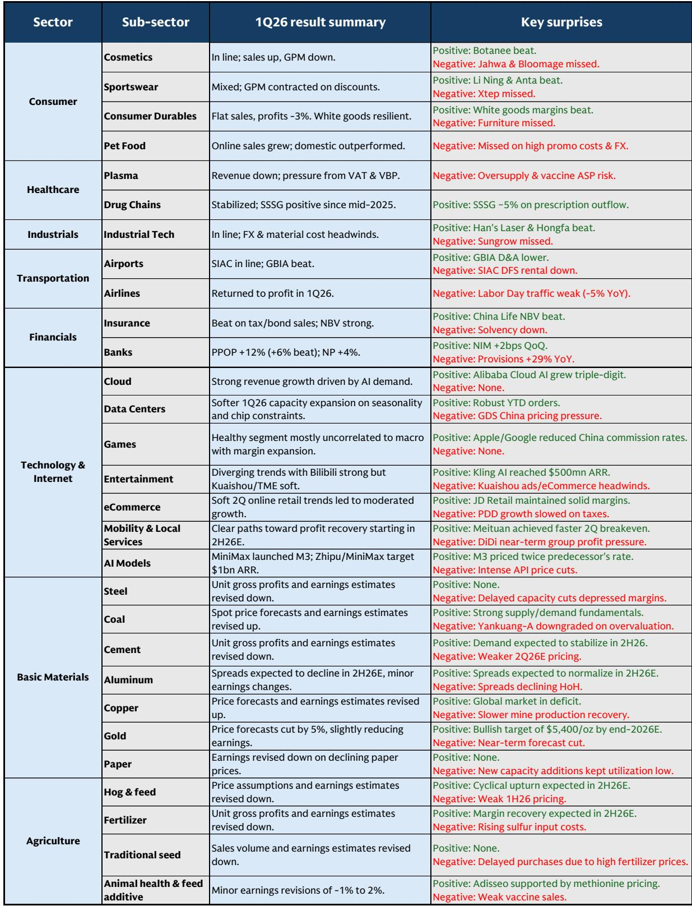
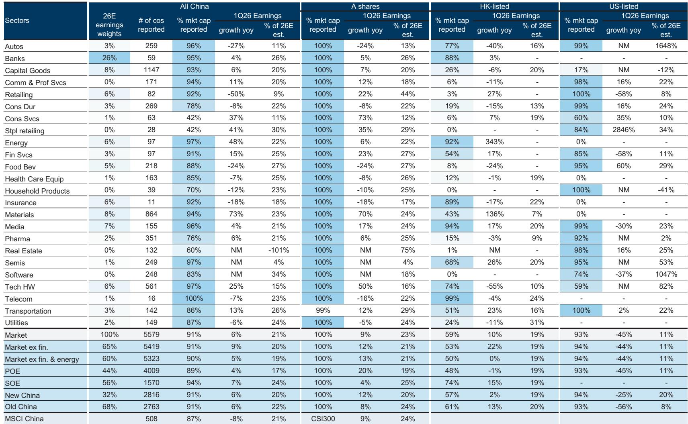
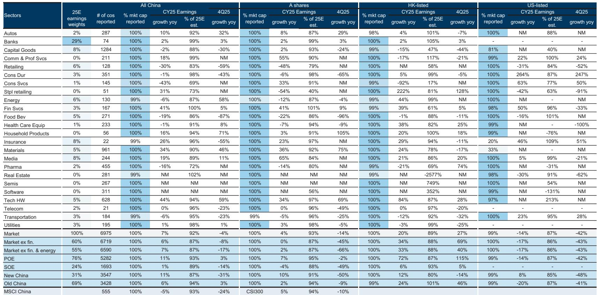

# The AI Profit Shift Has Rewired China's Earnings Landscape: Hardware Is Now the Engine, Not the Application Layer

The 1Q26 earnings season for China's listed universe of roughly 7,000 companies has delivered a clear and decisive verdict: the center of gravity in Chinese equity earnings has shifted, and it has shifted toward A-share hardware-linked technology companies. Aggregate net profits grew a resilient 6% year-on-year, but that headline masks a chasm. Onshore indices such as the CSI300 posted 9% earnings growth, while the offshore MSCI China index contracted by 8%. The divergence is not a statistical anomaly. It is the direct consequence of a structural reallocation of profits within China's artificial intelligence supply chain, where the hardware layer has reclaimed profit share from software applications, and where government-directed capital expenditure by hyperscale cloud providers is creating a visible demand runway that the consumer economy cannot match.

This is not a cyclical rotation. It is a regime change in how Chinese corporates generate returns, how they allocate cash, and where investors should place their bets for the remainder of 2026. The report from which this analysis is drawn covers over 4,500 earnings call transcripts and financial statements across A-shares, H-shares, and ADRs. What emerges is a picture of a market bifurcated along three axes: onshore versus offshore, hardware versus software, and state-owned enterprises versus private enterprises. The implications for portfolio construction are profound, and they demand a framework that goes beyond simple sector tilts.

The argument that follows is not a summary of the report. It is an interpretation of what the patterns mean, where the logic leads, and what questions remain unanswered. Readers who want the full dataset, the original charts, and the screened portfolio of 25 names should join the community to access the complete research.

## The A-Share Premium Is Real and Structural, Driven by the Hard Tech Profit Pool, Not Just Sentiment

The earnings growth gap between onshore and offshore Chinese equities is not a fleeting phenomenon. In 1Q26, the CSI300 delivered 9% year-on-year earnings growth, while the MSCI China index contracted by 8%. The STAR board, which is heavily weighted toward semiconductor and AI hardware companies, posted an extraordinary 198% year-on-year earnings surge. The ChiNext index, also tilted toward technology and small-cap growth, grew 22%. These are not index construction quirks. They reflect a fundamental divergence in where profits are being generated within the Chinese economy.

The offshore index is weighed down by two structural headwinds. First, the quick commerce and internet platform companies that dominate MSCI China have been engaged in aggressive subsidy wars, compressing margins. Second, these same companies are engaged in a capital expenditure arms race for AI infrastructure, spending heavily on data centers and computing resources without near-term earnings payback. The result is that the offshore index is absorbing the cost of AI investment, while the onshore index is capturing the revenue from supplying the hardware that makes that investment possible.

This divergence is projected to persist. The report estimates 2Q26 earnings growth of 11% for the CSI300 versus 0% for MSCI China, and full-year 2026 growth of 20% versus 8%. The message is clear: the hard tech supply chain that is listed onshore is where the earnings momentum resides. The question for investors is whether this is a multi-year trend or a one-time catch-up. The evidence from capital expenditure commitments suggests it is the former.

## The AI Profit Pool Has Rebalanced Toward Hardware, and the Capex Cycle Provides Visibility Through 2027

Within China's AI supply chain, the internal distribution of profits has undergone a dramatic reversal. In 2024, downstream software applications captured 59% of AI-related profits. By 1Q26, that share had fallen to 46%, while the hardware layer rebounded to 54%. This is not a marginal shift. It represents a reordering of the value chain that has been accelerated by the massive capital expenditure programs of both US and Chinese hyperscale cloud providers.

The report documents that US hyperscalers continue to scale AI capex aggressively, but the critical insight for China-focused investors is that Chinese CSPs are accelerating their own spending. This provides a visible and multi-year demand runway for upstream hardware players in semiconductors, power infrastructure, data center equipment, and printed circuit boards. Within the Chinese AI universe, the semiconductors layer grew earnings by 141% year-on-year in 1Q26, while the power and infrastructure layers grew 70%. These are not one-quarter anomalies. They are the earnings manifestation of a capex cycle that is still in its early innings.

The strategic implication is that investors should not treat AI as a single theme. The profit pool is migrating upstream, and the companies that supply the picks and shovels of AI infrastructure are capturing a growing share of the economic value. The downstream application layer, by contrast, is facing margin compression as competition intensifies and as the cost of compute inputs remains elevated. The report's textual analysis of over 4,500 earnings call transcripts confirms this shift: AI-related discussions are surging in capital goods, tech hardware, and materials sectors, while moderating in downstream software segments.

## The Margin Bifurcation Between "Involuted" Sectors Reveals Which Industries Are Recovering and Which Are Still Trapped

Aggregate revenue growth for the listed universe accelerated to 4% year-on-year in 1Q26, up from 1% in 2025 and negative 1% in 2024. This top-line improvement, however, masks a stark divergence in margin performance that cuts across traditional sector classifications. The report defines a set of "involuted" sectors—industries characterized by intense competition and capacity oversupply—and finds that margins are bifurcating sharply within this group.

On one side, semiconductors, industrial metals, and airlines are gaining margins. Semiconductors benefit from the AI hardware demand cycle. Industrial metals are supported by infrastructure spending and a recovery in manufacturing activity. Airlines are aided by an 8% year-on-year decline in domestic jet fuel prices. On the other side, autos, agriculture, e-commerce, construction materials, and solar equipment are experiencing margin erosion. The auto sector, despite its leadership in overseas expansion, is facing domestic price competition that is compressing profitability. Solar equipment, which was a high-growth darling in prior cycles, is now in a capacity-driven downcycle.

The so-what for investors is that the old economy versus new economy distinction is no longer sufficient. Within the old economy, some cyclical industries are experiencing genuine margin recovery driven by supply discipline and demand stabilization. Within the new economy, the consumer-facing and property-linked segments remain under pressure. The report's framework suggests that the margin recovery is concentrated in sectors that are either linked to the hard tech capex cycle or that have undergone sufficient capacity rationalization. The sectors that remain trapped are those where competition is still intensifying and where demand remains weak.

## Going Global Is Not a Hedge; It Is a Structural Profitability Advantage That Survives Tariff Uncertainty

Despite the escalation of tariff uncertainties and geopolitical headwinds, Chinese corporates continue to expand their overseas revenue exposure. The aggregate foreign sales ratio for the listed universe rose to 18% in 2025, up from 16% in 2024. The auto sector leads this trend, with overseas exposure surging to 29%, driven by rapid electric vehicle expansion into international markets. But the trend is increasingly broad-based, with semiconductors, transportation, capital goods, durables, and pharmaceuticals all increasing their international footprint.

The critical insight from the report is not the revenue growth itself, but the profitability premium that overseas operations command. For most sectors, profit margins in international markets are higher than in domestic operations. This provides a powerful structural incentive for continued globalization, regardless of tariff frictions. Chinese exporters with more than 50% overseas exposure delivered significantly higher revenue and earnings growth in 1Q26 than the aggregate listed universe. The tariff headwinds, while real, are being absorbed and managed rather than deterring expansion.

The report's textual analysis of earnings calls confirms that "Going Global" remains a dominant strategic focus across nearly all manufacturing and hard-tech sectors. Direct mentions of tariff headwinds have moderated or stabilized compared to the peaks of early 2025. This suggests that corporate management teams are learning to navigate the new trade environment and are not retreating from international markets. For investors, the implication is that companies with demonstrated overseas execution capability deserve a valuation premium, not a discount for geopolitical risk.

## The Report Leaves a Critical Question Unanswered: Can the Software Layer Recover Margin Once the Capex Cycle Matures?

The report is comprehensive in documenting the shift of profits toward hardware, but it leaves open a question that will define the next phase of the AI investment cycle. If the current capex boom eventually matures and hyperscaler spending growth decelerates, will the downstream software and application layer regain pricing power and margin? Or has the structure of the AI value chain permanently shifted in favor of hardware?

The report provides data but not a definitive answer. The Chinese AI universe's share of global AI earnings has actually declined, from 10% in 2024 to 8% in 1Q26, as other regions, particularly North Asia, have captured the foundry and memory demand. This suggests that China's AI profit pool is not only shifting internally toward hardware, but is also losing share globally to competitors with more advanced semiconductor manufacturing capabilities. The question is whether China's hardware companies can move up the value chain into higher-margin segments such as advanced foundry and memory, or whether they will remain in lower-margin assembly and component supply.

The report also notes that the margin profile for Chinese AI companies still lags global peers. This is not surprising, given that the US dominates high-margin intellectual property layers such as IC design. But it raises a strategic question: if Chinese AI hardware companies cannot close the margin gap with global leaders, then the current profit shift toward hardware may be a cyclical rather than structural phenomenon. Investors should watch for evidence that Chinese semiconductor and infrastructure companies are gaining pricing power and improving return on invested capital, rather than simply riding a volume-driven capex cycle.

## A Decision Framework for Investors: Three Filters to Navigate the Bifurcated Landscape

The report provides ample data but does not prescribe a simple formula for portfolio construction. Based on the patterns identified, a three-filter decision framework emerges for investors seeking to position for the remainder of 2026.

First, filter by listing venue and index exposure. The evidence strongly supports an overweight to A-shares relative to H-shares, particularly in indices with high AI hardware exposure such as the STAR board and ChiNext. The earnings growth differential is projected to persist through at least 2Q26, and the structural drivers of the divergence—capex spending by CSPs and the composition of index weights—show no signs of reversing.

Second, filter by position in the AI value chain. Within the AI theme, favor upstream hardware and infrastructure over downstream software and applications. The profit pool has shifted decisively, and the capex cycle provides visibility. Companies in semiconductors, data center equipment, power infrastructure, and printed circuit boards are capturing the earnings growth. Software and internet platforms are absorbing the costs.

Third, filter by overseas revenue exposure and margin premium. The "Going Global" theme is not a speculative narrative; it is a measurable driver of earnings outperformance. Companies with high and growing overseas exposure, particularly in sectors where international margins exceed domestic margins, deserve a structural premium. The report's data shows that exporters are delivering superior results, and the earnings call analysis confirms that management teams are committed to this strategy.

## Join the Community to Read the Full Report and Review the Original Charts

The analysis presented here is based on a detailed research report covering approximately 7,000 listed Chinese companies and over 4,500 earnings call transcripts. The report includes 22 exhibits that provide granular data on earnings growth by index, sector, and AI layer; margin trends across involuted sectors; overseas revenue exposure by industry; cash allocation trends including dividends, buybacks, R&D, and acquisitions; and textual analysis of management commentary on AI, tariffs, and globalization. It also screens 25 names for a refreshed growth portfolio designed to capture the themes identified.

The full report contains the charts, the data tables, and the stock-level analysis that cannot be reproduced here. It also addresses the open questions that this article has identified, including the sustainability of the hardware profit shift and the path to margin recovery for the software layer. For investors who want to make informed decisions based on the complete evidence base, the report is essential reading.

Join the community to read the full report and review the original charts.

*This article is for learning and discussion only and does not constitute investment advice.*

Personal reading notes and learning share only. Not investment advice.

