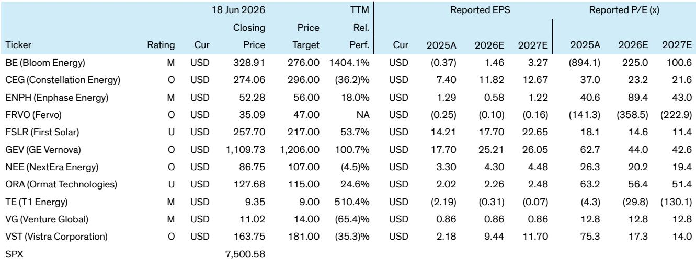
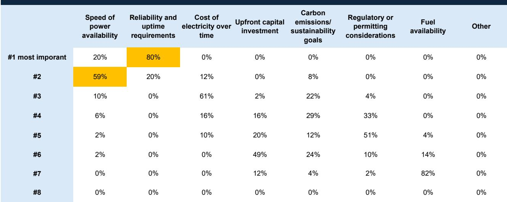
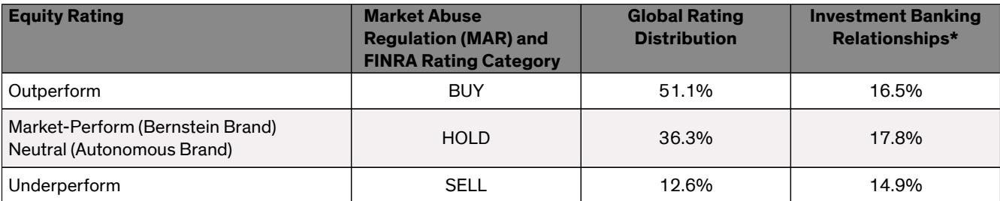

# Bernstein：数据中心供电的真正瓶颈不在技术，在电网的“连接组织”

过去一年，市场对AI和数据中心电力需求的讨论，几乎都围绕一个核心问题：电力从哪里来？天然气、核能、可再生能源、燃料电池，每一种技术路线都有自己的拥护者。但Bernstein刚刚发布的一份基于50多家数据中心运营商调研的报告，给出了一个更底层、也更令人不安的回答——问题从来不是“发多少电”，而是“电能不能送到”。

这份报告最值得关注的判断是：数据中心运营商最想要的，是电网连接。不是离网自建，不是孤岛运行，而是接入大电网。但他们面临的现实是，电网的“连接组织”——从并网审批到输电容量到设备交付——正在成为整个AI基础设施扩张的最大瓶颈。这个瓶颈的持续时间，不是一两年，而是以十年为单位。

## 1. 电网连接是首选，但并网等待时间已经突破运营商的容忍底线

调研中，98%的受访数据中心运营商表示，电网连接是未来5-10年新项目的首选供电方式。对于100MW以上的大型数据中心，86%的运营商明确偏好“电网连接为主、现场发电为辅”的模式。现场发电（behind-the-meter）目前仅占数据中心电力市场的约5%，Bernstein预计到2030年代，这个比例也只会上升到5-10%。

这个偏好本身并不令人意外。电网供电在成本、可靠性和可扩展性上，通常优于任何形式的现场自发电。真正值得关注的是，运营商对并网等待时间的容忍度极低。调研显示，绝大多数受访者认为“等待超过三年”是不可接受的。但现实是，目前美国主要区域的并网排队时间普遍在4年以上，CAISO区域甚至更久。

这意味着什么？意味着在电网基础设施没有显著改善之前，大量数据中心项目的实际落地时间表，可能要比市场预期的更长。这不是需求不足的问题，而是供给侧的交付时间被电网瓶颈锁死了。

## 2. 速度和可靠性压倒成本，这重新定义了“能赢”的资产类型

当被问及选择供电方式的最重要因素时，80%的受访者将“可靠性”排在第一位，20%将“速度”排在第一位。成本、碳排放、监管等因素，在优先级上都明显靠后。甚至有10%的受访者明确表示，成本不是驱动因素，他们愿意为现场发电支付更高费用。

这个排序对投资逻辑的影响是直接的。拥有已并网资产的独立发电商（IPP），如Constellation Energy和Vistra，在Bernstein的框架中获得了跑赢评级（Outperform），因为它们不需要等待新的并网审批。而能够快速交付现场发电方案的供应商，如Bloom Energy（燃料电池，55-90天交付），也在速度维度上获得了市场表现评级（Market-Perform）。

但这里有一个容易被忽略的深层含义：如果速度和可靠性压倒成本，那么传统以“最低成本”为核心的电厂估值模型，可能需要调整。在数据中心供电的语境下，能够提供确定性交付时间的资产，应该享有估值溢价。这个溢价目前是否已经被市场完全定价，报告没有展开，但这是一个值得持续追踪的问题。

## 3. 现场备份电源不再是备选，而是数据中心设计的刚性组件

调研显示，超过95%的受访者将现场备份电源列为关键设计要素。更值得关注的是，90%以上的受访者认为，现场备份不是过渡安排，而是长期存在的架构特征。未来大型数据中心将普遍采用“电网+现场发电”的混合供电架构。

在具体技术路线上，45%的受访者偏好化石燃料（天然气涡轮机或往复式内燃机），其次是太阳能加储能（Solar+BESS）和燃料电池。这个分布说明，在“可靠性第一”的约束下，运营商对技术路线的选择是务实的：天然气是成熟的、可调度的；太阳能加储能在白天有优势；燃料电池在安静和低排放场景中有价值。

这个趋势对电网设备供应商GE Vernova是明确的利好。Bernstein在报告中特别指出，市场可能低估了与数据中心相关的“连接组织”需求——即变压器、开关设备、输电线路等电网基础设施的升级和扩容。这不是一个短暂的周期，而是长达数十年的资本支出周期。

## 4. 可持续性承诺在大型项目中仍占一席之地，但优先级明显后移

调研中，Bernstein将运营商对可持续性的态度分为三个类别。多数受访者表示，在大规模项目中会考虑可持续性目标，尤其是在与超大规模云服务商合作时。但从前面的优先级排序可以看出，碳排放在所有因素中排在可靠性、速度和成本之后。

这对不同资产类型的影响是分化的。拥有大量可再生能源资产的NextEra Energy（跑赢评级）和拥有大型核电机组的Constellation Energy，在可持续性维度上仍有优势。地热公司Fervo（跑赢评级）也已经与超大规模客户签署了超过650MW的长协合同。但可持续性本身，目前还不足以成为驱动供电决策的独立变量。

## 5. 报告尚未完全回答的关键问题：电网升级的“谁买单”和“多快能”

Bernstein的调研清晰地指出了瓶颈所在——并网等待时间、审批不确定性、输电容量限制。但报告没有完全回答的问题是：谁来为电网升级买单？以及，升级的速度能有多快？

从历史经验看，美国电网基础设施的投资决策和成本回收，涉及联邦、州、公用事业公司、监管机构等多个利益相关方。数据中心运营商愿意为速度和可靠性支付溢价，但这个溢价是否足以覆盖电网升级的全部成本，并转化为公用事业公司和设备供应商的可持续盈利，仍需要更清晰的监管和政策信号。

此外，报告提到“互联队列”（interconnection queues）是4年以上的等待时间，但并没有深入分析：这些队列中的项目有多少是真正会建设的？有多少是投机性的？如果大量项目最终无法落地，电网升级的投资回报假设是否需要调整？

这些未解问题，恰恰是深度研究最有价值的部分。Bernstein的这份调研提供了一个坚实的基础框架，但真正的投资判断，需要在更细颗粒度的数据、更具体的监管动态、更深入的公司竞争力拆解中完成。

## 6. 对于产业决策者和投资者的观察框架

基于Bernstein的调研结论，我们可以建立一个三层观察框架：

第一层，识别“谁拥有已并网资产”。在并网审批等待时间超过4年的环境下，已经接入电网的发电资产是稀缺资源。Constellation Energy和Vistra的核能和天然气机组，NextEra的可再生能源项目，都属于这一类。

第二层，追踪“谁在提供连接组织”。GE Vernova的电网设备业务、以及所有参与输电和配电基础设施升级的公司，将受益于数十年的资本支出周期。这个主题的确定性，可能比单纯预测电价走势更高。

第三层，关注“现场发电技术的成本曲线和交付速度”。燃料电池、天然气内燃机、太阳能加储能，这些技术的成本下降速度和交付能力，将决定它们能在多大程度上填补电网不足留下的缺口。Bloom Energy的燃料电池能否从5-10%的市场份额向上突破，取决于它能否持续证明比等待并网更快的交付速度。

这三个层次不是互斥的，而是叠加的。最清晰的alpha机会，可能来自那些同时受益于多个维度的公司。

---

以上是对Bernstein这份数据中心供电调研报告的深度解读。但报告本身包含的细节远不止这些——比如不同区域互联队列的具体差异、运营商对氢能和长时储能的真实态度、以及Bernstein对12只覆盖股票的详细评级逻辑和估值框架，都值得逐字阅读。如果你希望获取完整报告原文和原始图表，或者想和更多关注能源与AI基础设施交叉领域的读者一起讨论这些未解问题，欢迎来星球微信群里继续交流。

Personal reading notes and learning share only. Not investment advice.

