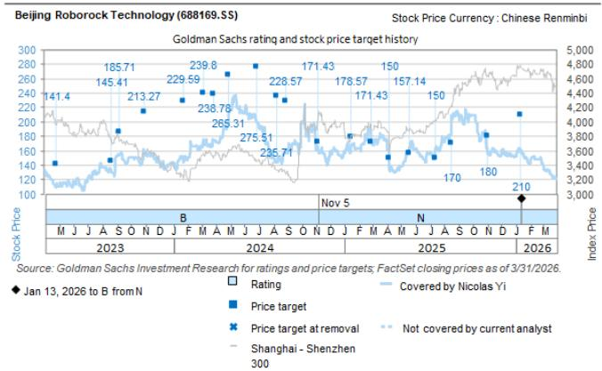
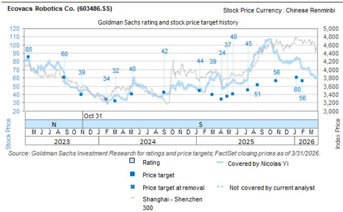
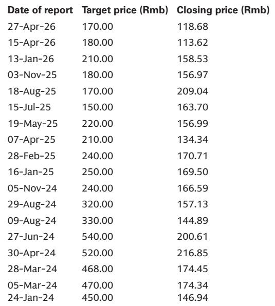

# The EU Anti-Dumping Pause on Chinese Robotic Lawn Mowers Is a Strategic Window, Not a Reprieve

The European Commission’s decision to continue its anti-dumping investigation into Chinese robotic lawn mowers without imposing provisional duties is not simply good news for Chinese manufacturers. It is a structural inflection point that redefines the competitive timeline for an entire industry. The market’s immediate reaction—a relief rally in shares of Ninebot, Ecovacs, and Roborock—captures only the surface effect. The deeper strategic implication is that Chinese players have just been handed a multi-quarter window to execute on globalisation strategies that were previously under existential threat.

This matters now because the window is finite. The investigation will conclude by January 2027 at the latest, and duties could be applied retroactively. The difference between winning and losing in this industry will be determined by what companies do in the next twelve to eighteen months, not by whether provisional tariffs were imposed in June 2026. The EU’s technical complexity argument—the stated reason for postponing provisional measures—masks a more fundamental reality: European regulators are struggling to assess the competitive dynamics of a product category that did not exist meaningfully a decade ago. That regulatory uncertainty is an asset for the prepared and a trap for the complacent.

The core thesis of this article is straightforward: the EU’s decision creates a strategic window for Chinese robotic lawn mower players to lock in market share, build pricing power, and establish production flexibility before any tariff regime takes effect. Companies that use this window to deepen their competitive moats will emerge stronger regardless of the investigation’s outcome. Those that treat it as a simple extension of business as usual will find themselves exposed when the regulatory axe eventually falls.

## The Postponement of Provisional Duties Reshapes the 2026 Competitive Landscape More Than It Delays the Ultimate Outcome

The immediate impact of the EU’s announcement is a preservation of the status quo through the critical 2026 selling season. Most Chinese manufacturers had planned to ship the majority of their 2026 European sales targets by the first half of the year, anticipating that provisional duties would take effect in June. That assumption is now invalid.

The strategic significance of this shift cannot be overstated. The European robotic lawn mower market is experiencing structural growth as consumers shift from traditional petrol-powered mowers to robotic alternatives. The summer months represent the peak demand period in Northern and Central Europe. By maintaining the existing tariff structure through this period, Chinese manufacturers preserve their pricing competitiveness against European incumbents such as Husqvarna, who initiated the complaint. They also avoid the disruptive scenario of having to raise prices mid-season to absorb duty costs, which would have ceded market share precisely when consumer adoption decisions are being made.

For investors, the key metric to watch is not whether duties are eventually imposed, but what happens to market share during this window. The report identifies Ninebot as the largest beneficiary given its 9% revenue exposure to robotic lawn mowers and higher profit contribution from the segment. But the logic extends across the sector. A stable tariff environment through the peak selling season means that pricing strategies can remain disciplined rather than reactive. Companies that had built contingency pricing into their 2026 plans now have the flexibility to either maintain margins or invest in market share gains—a strategic choice that was not available under a provisional duty scenario.

The so what here is that the competitive dynamics of 2026 will look fundamentally different from what was priced into the market before the announcement. The risk of a sharp margin compression in the second half of the year has been deferred, and the opportunity for top-line growth has been preserved.

## Chinese Manufacturers Gain a Critical Window to Build Production Flexibility, But Relocation Economics Remain Challenging

The most underappreciated implication of the EU’s decision is the time it buys for manufacturing relocation strategies. The report notes that the current announcement leaves a longer time window for Chinese players to prepare for potential duties, such as relocating manufacturing capacity overseas. This is not a trivial consideration. Manufacturing relocation typically involves cost increases of 10% to 20% in the early stages due to less efficient labour productivity and immature supply chains.

The strategic framing here is essential. Relocation is not a binary decision that happens overnight. It involves site selection, regulatory approvals, equipment installation, workforce training, and supply chain development. A timeline that was previously compressed into months can now extend across years. This allows companies to sequence their relocation investments more efficiently, potentially avoiding the most costly rush scenarios.

However, the report’s observation that longer preparation time helps improve efficiency but does not entirely eliminate the cost gap is a crucial caveat. The structural cost advantage of Chinese manufacturing—particularly in components, batteries, and electronics integration—is not easily replicated elsewhere. The gap is not just about labour costs; it is about ecosystem density, component availability, and the institutional knowledge embedded in Chinese supply chains.

The so what for strategic decision-makers is that relocation should not be viewed as a tariff avoidance tactic. It should be viewed as a long-term competitive positioning decision. Companies that use the current window to build overseas capacity while maintaining their Chinese operations will have a dual-production capability that provides both cost efficiency and regulatory flexibility. Those that delay will face the same relocation cost penalties under a tighter timeline if duties are eventually imposed with retrospective effect.

## The Divergence Between Leading Brands and Small Players Will Accelerate as the Investigation Window Lengthens

The report makes a clear distinction between leading brands like Ninebot and smaller players in their ability to cope with potential tariff impacts. Leading brands benefit from higher pricing positions and the ability to adjust production globally. This distinction becomes more important, not less, as the investigation window lengthens.

The reason is structural. A longer investigation timeline increases the uncertainty premium that smaller players must carry. They lack the balance sheet flexibility to pre-invest in overseas capacity without certainty of tariffs. They also lack the pricing power to absorb duties without destroying demand. For these companies, the current window is not an opportunity—it is a period of strategic paralysis.

Leading brands, by contrast, can use the window to make calculated investments. Ninebot’s dual-brand strategy, its established offline channel presence in Europe, and its broader micro-mobility revenue base provide a cushion that pure-play robotic lawn mower manufacturers do not have. Roborock’s expanding product range beyond robotic vacuum cleaners into wet-dry vacuums and lawn mowers gives it a similar diversification advantage.

The so what is that the competitive structure of the industry is likely to become more concentrated over the next twelve to eighteen months. Larger players will use the window to build brand equity, expand distribution, and potentially acquire weaker competitors who face existential risk from eventual tariffs. This is not a prediction of aggressive M&A activity—the report does not provide data on that—but a logical consequence of asymmetric strategic flexibility.

## What the Report Does Not Fully Answer: The Retrospective Duty Risk and the Shape of the Final Tariff Regime

The most significant analytical gap in the current assessment concerns the nature of the final tariff regime. The EU retains the ability to impose anti-dumping duties with retrospective effect upon completion of the investigation. This means that even if no duties are collected during 2026, companies could face a significant liability once the investigation concludes.

The report acknowledges this uncertainty but does not fully model its implications. The critical questions that remain unanswered are threefold. First, what is the likely range of duty rates if the EU concludes that dumping has occurred? The complaint was filed by Husqvarna, a dominant European manufacturer, and the political dynamics of European trade policy suggest that some form of remedy is probable. Second, how will retrospective duties be calculated—will they apply to all shipments during the investigation period, or only to shipments after a certain date? Third, will the EU consider alternative remedies such as price undertakings rather than duties, which would create a different set of competitive dynamics?

These questions matter because they determine whether the current window is truly an opportunity or merely a deferred reckoning. If retrospective duties are applied broadly, companies that increased their European shipments during the investigation period could face a substantial financial hit. The report’s positive view on the announcement assumes that the market will focus on near-term relief rather than long-term liability risk, but that assumption needs to be stress-tested.

For serious investors, the unresolved question is whether the current valuation uplift in Chinese robotic lawn mower stocks adequately discounts the probability and magnitude of retrospective duties. The report’s price targets—Rmb62 for Ninebot, Rmb170 for Roborock, and Rmb55 for Ecovacs—were set before the announcement and may not fully reflect the new risk-reward calculus.

## A Decision Framework for Investors: Three Scenarios and the Actions They Imply

The current situation lends itself to a structured scenario analysis that can guide investment decisions. The framework has three dimensions: the probability of final duties, the magnitude of those duties, and the retrospective application scope.

In the first scenario—low probability of duties or minimal rates—the current window represents a pure positive. Chinese manufacturers maintain their competitive position, market share continues to grow, and the overhang on valuations dissipates. The action implication is to overweight the highest-exposure names, particularly Ninebot, and to focus on companies with the strongest pricing power and distribution networks.

In the second scenario—moderate duties with limited retrospective application—the window provides time to adjust. Companies that have used the period to build overseas capacity or negotiate price increases with European distributors will be better positioned. The action implication is to favour companies with demonstrated relocation progress and to discount those that have been passive.

In the third scenario—high duties with full retrospective application—the window becomes a trap. Companies that increased European shipments during the investigation period face a significant liability, and the competitive advantage of Chinese manufacturing is eroded. The action implication is to reduce exposure to the sector and to focus on companies with the most diversified revenue bases and strongest balance sheets.

The report’s analysis provides the raw material for this framework but does not explicitly construct it. Investors should use the report’s data on company exposures, margin structures, and relocation capabilities to assign probabilities to each scenario and position accordingly.

## The Strategic Imperative: This Window Is Not for Resting, It Is for Building

The final and most important insight is that the EU’s decision does not change the structural trajectory of the industry. Chinese robotic lawn mower manufacturers are still facing a regulatory environment that is becoming more restrictive in Europe, and the long-term trend toward trade friction in consumer durables is unlikely to reverse.

The companies that will emerge strongest from this process are those that treat the current window not as a reprieve but as a mandate for strategic action. They should be accelerating their overseas manufacturing investments, deepening their European distribution partnerships, and building brand equity that can sustain pricing power even under a tariff regime. They should also be preparing for the possibility that the investigation’s conclusion brings not just duties but also ongoing monitoring and potential escalation.

For investors, the lesson is equally clear. The market’s initial reaction to the announcement—a relief rally in the affected stocks—captures only the first-order effect. The second-order effects—on competitive dynamics, on manufacturing strategy, and on long-term valuation—will play out over the next twelve to eighteen months. The winners will not be those who simply held their positions through the announcement. They will be those who used the analytical framework provided by reports like this to make active, scenario-based decisions about which companies are genuinely building strategic advantage and which are merely enjoying a temporary tailwind.

The full report contains detailed charts on company exposures, margin structures, and valuation frameworks that are essential for constructing these scenarios. The original analysis also includes the specific price targets and risk assessments that inform the investment thesis.

Join the community to read the full report and review the original charts.

*This article is for learning and discussion only and does not constitute investment advice.*

Personal reading notes and learning share only. Not investment advice.

