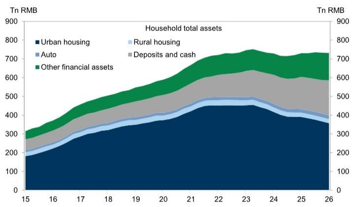
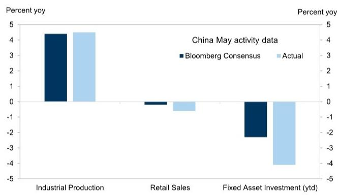

# GS：中国家庭资产正在经历从房产到金融资产的结构性迁移

五月的经济数据提供了一个令人不安的对照：出口同比增长19.4%，但零售销售同比下降0.6%——这是除疫情封控期外，中国首次出现零售负增长。出口强劲与内需疲软之间的裂口，已经不只是周期性的问题，它正在重塑中国经济的底层结构。

GS在最新发布的研报中，用一份长期专题研究给出了一个关键判断：中国家庭资产负债表的再平衡，可能才是理解未来五年资产价格走向的真正主线。这份报告的核心洞察不在于短期数据波动，而在于一个正在发生的结构性迁移——中国家庭资产正在从房产向金融资产转移，而这一过程的深度和速度，可能被市场严重低估。

---

## 1. 五月数据暴露的不只是需求疲软，而是家庭部门正在经历主动去杠杆

五月零售销售同比下降0.6%，固定资产投资同样录得同比收缩。GS指出，这是“除疫情封控期外首次出现负增长”。出口增长19.4%与内需收缩并存，意味着中国经济的“双轨”格局已经固化：生产端和出口端依然有韧性，但消费端和投资端的动力正在流失。

这里需要追问一个“所以呢”的问题：消费收缩是因为收入下降，还是因为家庭主动减少了支出？

GS的报告虽然没有直接给出答案，但结合其同期发布的家庭资产负债表研究，逻辑链条是清晰的。中国家庭资产中房产占比高达52%，而房价持续下跌意味着家庭净资产在缩水。当资产端缩水时，家庭部门为了修复资产负债表，会主动减少消费、增加储蓄。这不是需求暂时被压抑，而是家庭部门正在经历一轮自发的去杠杆。

这意味着，短期刺激政策可能难以撬动消费。如果家庭部门的去杠杆行为是结构性的，那么任何依赖消费反弹的经济预测都需要重新审视其假设。

---

## 2. 家庭资产结构正在经历从“房产主导”到“金融资产主导”的转折

GS在最新发布的“中国长期系列”研究中，构建了一套中国家庭资产负债表数据集。截至2026年第一季度，中国家庭总资产中，房产占比52%，现金和存款占比25%，两者合计接近80%。而权益和保险类资产的占比仍然较低。

但GS预计，未来几年权益和保险类资产的占比将显著扩大，而房产占比将继续收缩。这个判断的核心驱动因素有两个：一是房价持续下行导致的财富效应逆转，二是政策层面正在推动的资本市场改革和人民币国际化。

这里的关键问题是：这种迁移的速度有多快？GS的报告给出了一个方向性的判断，但没有给出具体的时间表。从历史经验来看，日本家庭资产从房产向金融资产的转移用了将近十年。中国市场可能因为政策推动而加速，但居民对房产的偏好惯性仍然很强。

对投资者而言，这意味着中国金融资产的长期需求结构正在发生变化。如果家庭部门每年将1%的资产从房产转移至权益市场，对应的资金规模就在万亿级别。这可能会成为A股和港股市场长期资金流入的重要来源。

---

## 3. 陆家嘴论坛释放的信号：货币政策框架转型与人民币国际化正在同步推进

GS在另一份报告中详细解读了今年陆家嘴论坛上释放的关键信号。央行行长潘功胜宣布将隔夜回购利率走廊从70个基点收窄至50个基点。这看似是一个技术性调整，但其含义是深远的：中国正在从数量型货币政策框架向价格型框架转型。

利率走廊收窄意味着央行对短期利率的控制更加精准，市场利率的波动性将降低。这对债券市场是利好，但更重要的是，它为未来的利率市场化改革铺平了道路。

与此同时，论坛上宣布的几项措施值得关注：为外国官方机构设立FIMA人民币回购便利、在香港推出五年期国债期货、在上海建立离岸人民币交易中心。这些措施的共同指向是：人民币国际化正在从“贸易结算”阶段进入“金融资产储备”阶段。

GS的报告指出，这些措施“表明人民币国际化正在加速”。但这里有一个尚未被充分讨论的隐含含义：如果人民币国际化成功，中国债券市场将迎来全球央行和主权基金的持续配置需求。这会改变中国利率的定价逻辑，使其从国内因素驱动转向全球因素驱动。

---

## 4. 报告没有完全回答的问题：家庭去杠杆何时见底

GS的家庭资产负债表研究提供了一组重要的基准数据，但有一个关键问题尚未得到充分回答：中国家庭部门的去杠杆过程何时能够结束？

从日本的经验来看，家庭去杠杆的结束需要满足三个条件：房价企稳、收入增长恢复、金融资产回报率显著高于存款利率。目前中国的情况是，房价仍在调整中，收入增长面临压力，而存款利率已经降至历史低位。第三个条件正在形成，但前两个条件仍存在不确定性。

报告提到了“持续去杠杆”（ongoing deleveraging），但没有给出量化终点。这意味着，投资者需要密切关注两个领先指标：一是70城房价数据中一线城市的走势——GS已经注意到五月一线城市房价环比出现上涨；二是居民中长期贷款的变化，如果居民开始重新增加借贷，可能意味着去杠杆接近尾声。

---

## 5. 对投资者的观察框架：关注三个信号，而不是一个数字

基于GS的这份研报，投资者可以建立一个更清晰的观察框架，而不是被月度经济数据的波动牵着走。

第一个信号是家庭资产配置的边际变化。如果银行存款增速开始下降，而公募基金和保险产品的销售开始回暖，这可能意味着家庭资产从存款向权益的迁移已经开始加速。

第二个信号是人民币资产的全球吸引力。FIMA回购便利和离岸国债期货的推出，为境外机构提供了更便利的人民币资产配置工具。如果境外机构对中国债券的持有量出现趋势性增长，这可能是一个重要的先行指标。

第三个信号是政策框架的转型速度。利率走廊收窄只是第一步。如果未来央行进一步推进利率市场化，甚至考虑引入类似美联储的“前瞻指引”机制，那将意味着中国金融市场的定价逻辑正在发生根本性变化。

这三个信号的共同指向是：中国正在从“土地财政+房地产储蓄”的模式，转向“资本市场+金融资产配置”的模式。这一转变的深度和速度，将决定中国资产在未来五年的定价。

---

五月的数据让人不安，但GS的报告提供了一个更长期的视角。短期波动是噪音，结构迁移才是主线。家庭资产从房产向金融资产的转移，是中国经济转型的必然结果，也是未来资本市场最大的结构性变量。

但这份报告也留下了一些未解的问题：家庭去杠杆何时见底？权益资产占比的扩张能否达到GS预期的速度？人民币国际化能否真正吸引全球资本的持续流入？这些问题的答案，可能藏在报告未能完全展开的图表和假设之中。

如果你对这些未解的问题感兴趣，欢迎来星球微信群里继续讨论。我们会结合报告原文的图表和详细数据，逐一拆解这些关键假设的验证条件和潜在风险。

---

Personal reading notes and learning share only. Not investment advice.

