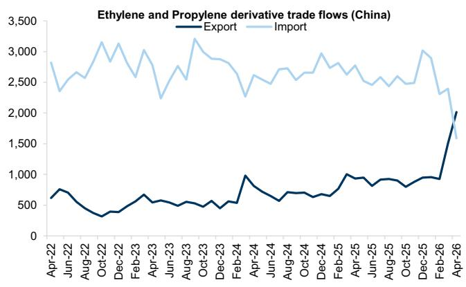
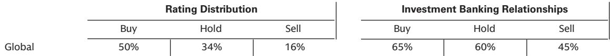

# GS：欧洲化工的真正危机不是红海冲突，而是冲突结束后暴露的结构性过剩

当市场还在关注地缘冲突何时结束、物流何时恢复时，一份来自GS的研报给出了一个反直觉的判断：冲突的终结可能才是欧洲化工行业真正考验的开始。

GS分析师团队在参加ICIS与欧洲化工分销商协会（Fecc）联合举办的CEO圆桌会议后，发布了一份基调偏冷的研究笔记。出席会议的包括Equilex董事会主席Patrick Elie、Integra Petrochemicals CEO Gina Fyffe、IMCD CEO Marcus Jordan以及National Chemical Co. CEO Alan Looney。这些行业高管的共识性判断，指向一个令人不安的前景：当前的市场疲软并非单纯的季节性因素，而是价值毁灭的真实信号。

这份研报的核心洞察可以浓缩为一句话：欧洲化工行业正在经历一场“双重挤压”——短期面临需求疲软与物流紊乱带来的交易混乱，中期则面临中国产能外溢、欧洲本地产能永久性关停，以及结构性配方重构的三重冲击。GS认为，真正值得关注的不是冲突何时结束，而是结束后暴露出来的过剩产能将如何重塑全球化工竞争格局。

## 1. 冲突结束并非利好，而是暴露潜在过剩产能的催化剂

市场普遍认为红海冲突的结束将带来供应链正常化，但GS从圆桌会议中捕捉到的信号恰恰相反：冲突结束可能让行业变得更糟。

Integra Petrochemicals的CEO明确指出，即使假设冲突已经结束，正常化所需的时间将远超预期。仅清理积压的船舶就需要6至8周。第三季度预计将非常混乱，因为买家害怕做决策，对公平定价存在不确定性。

更深层的担忧在于，一旦冲突结束，生产恢复常态，供应重新变得充足，市场将直接暴露在潜在过剩产能面前。这种过剩将被释放的中东原料进一步放大。Equilex主席警告，当前市场上已经出现了明确的价值毁灭信号，而不仅仅是季节性需求疲软。

这意味着，对于欧洲化工企业而言，过去两年在供应链紧张中获得的定价权和议价能力，可能在冲突结束后迅速瓦解。那些依赖短缺逻辑维持利润的公司，将面临最直接的冲击。

## 2. 中国正利用这场危机完成从大宗到精细的出口升级

GS研报中一个被反复提及的关键变量，是中国在这场危机中的战略定位。Equilex主席观察到，中国在中间体和溶剂领域显著利用危机实现了自身定位的转变。

背后的逻辑链条值得拆解：当其他亚洲国家遭遇原料供应问题时，中国国内需求依然低迷。过剩的产能迫使产品大量外溢，对全球市场造成了显著扰动。ICIS的数据印证了这一判断：今年3月和4月，中国对亚洲其他地区的化学品出口增长了70%。

更值得警惕的是，这种出口扩张并非仅仅是量的增长，而是质的迁移。研报指出，中国不仅在基础大宗化学品领域占据主导，而且正在向半精细化学品领域进军。分销商已经开始积极考察中国和亚洲的领先生产商，以应对未来的供应格局。

GS的分析隐含了一个重要判断：中国正在利用这场地缘危机，完成从“大宗出口国”向“精细化工竞争者”的产业升级。对于欧洲精细化工企业而言，这不再是远期的威胁，而是正在发生的竞争态势。

## 3. 配方重构正在加速，部分变化将是永久性的结构威胁

研报中一个容易被忽视但可能最具长期影响力的判断，是关于配方重构（reformulation）的加速。GS明确将其称为“需求的结构性威胁”。

高原料价格迫使运营商和消费者进行配方重构，因为昂贵的投入成本已经无法被市场接受。Equilex主席虽然认为配方重构大体上是暂时性、可逆的措施，但他也承认，部分运营商可能选择永久性改变配方。

IMCD的CEO确认了配方重构需求的显著上升，并将其视为专业分销领域的积极机会。但从行业整体来看，这意味着对某些高成本原料的需求可能永久性流失。

GS在报告中特别强调了一个数据维度：那些拥有高比例客户定制配方销售的公司（如奇华顿，96%的销售来自客户定制配方，而行业平均为52%）和高研发投入的公司（如诺维信，研发占销售比例11%，行业平均为6%），更有可能在这场重构中保持竞争优势。

这里的投资含义很清楚：当客户开始重新审视配方，那些只能提供标准化产品、缺乏创新能力的供应商，将面临最严重的需求流失风险。

## 4. 欧洲采购份额三年下降20个百分点，本地化生产偏好反而强化

研报中一个触目惊心的数字来自National Chemical Co.的CEO：欧洲采购份额从三年前的约80%下降到了目前的约60%。这意味着欧洲化工企业在短短三年内，已经将20个百分点的采购转移到了欧洲以外。

然而，悖论在于，客户对欧洲生产、欧洲消费的价值认知正在强化。很多产品在欧洲根本买不到，客户反而在主动要求欧洲生产商重启某些化学品的生产。

这揭示了一个两难困境：欧洲既无法维持自给自足的供应能力，又无法完全依赖进口。这种“既不能完全自产，又不愿完全依赖进口”的尴尬位置，恰恰是欧洲化工行业未来几年最核心的战略挑战。

对于投资者而言，这意味着那些拥有多源供应网络、能在全球范围内灵活调配产能的企业，将获得明显的竞争优势。GS在报告中特别提到，IMCD凭借其多源供应网络，在整个冲突期间成功避免了产品短缺，这得益于其供应商（如巴斯夫）在美国和中国都设有工厂，能够重新调配网络。

## 5. 欧洲产能永久性关停的风险被低估

Integra Petrochemicals的CEO发出了一个严峻的警告：现在可能已经太晚了。欧洲正在关停的工厂很可能不会再重启。

原因有两个层面。其一，一些工厂面临巨大的资本支出压力，因为它们正在接近碳排放上限，合规成本高企。其二，炼油厂的关闭导致化工企业失去了原料供应基础，被迫停产。

Equilex主席补充了一个被低估的风险：失去一个主要供应商（principal）带来的破坏性远超想象。替代一个主要供应商通常需要6至8个月，而且伴随着更大的物流成本带来的利润率侵蚀，以及供应可靠性风险。

GS在报告的风险部分也明确列出了“欧洲化工竞争力因能源成本、监管负担和资本外逃而持续结构性侵蚀”这一下行风险。这意味着，欧洲化工产能的缩减不是周期性的，而是结构性的。那些依赖欧洲本地供应的下游企业，将面临持续的成本上升和供应不确定性。

## 6. 报告尚未完全回答的关键问题：AI能多大程度缓解结构性库存压缩？

圆桌会议中提到了一个值得关注的信号：持续供应链中断已导致客户结构性降低营运资本，要求分销商和供应商在库存和需求水平上变得更加快速和智能。Equilex主席认为这正是AI可以发挥作用的领域，特别是在需求预测和库存优化方面。

然而，报告并没有深入探讨AI在多大程度上能够真正缓解这种结构性库存压缩。这是一个尚未被充分回答的问题。

如果AI能够显著提高需求预测精度，那么整个化工供应链的库存水平可能找到新的均衡点，从而降低对安全库存的需求。但反过来，如果AI只是让“更低库存”成为可能，那么分销商和供应商面临的波动性风险实际上可能被放大——因为缓冲垫消失了。

这个问题的答案，将直接影响化工分销行业的商业模式和盈利稳定性。GS没有给出明确判断，但这是一个值得持续跟踪的关键变量。

## 7. 投资者的观察框架：从“谁有货”转向“谁有定价权”

综合GS这份研报的全部分析，我们可以提炼出一个适用于当下化工投资的观察框架。

过去两年，市场关注的核心问题是“谁有货”——供应链断裂时，谁能保证供应，谁就拥有定价权。但未来，核心问题将转向“谁有定价权”——当产能过剩、需求疲软、配方重构成为常态，企业的竞争力将取决于三个维度：

第一，供应链的灵活性与韧性。不是“有没有供应”，而是“能否在多源供应中快速切换成本最优的方案”。巴斯夫、IMCD这类拥有全球多基地布局的企业，优势将更加明显。

第二，创新能力与客户定制化程度。当标准化产品面临中国产能的竞争压力，高研发投入、高客户定制比例的企业（如奇华顿、诺维信）能够建立起更深的护城河。

第三，对结构性变化的适应能力。欧洲产能的永久性关停、客户营运资本的结构性降低、配方重构的不可逆性——这些变化不是周期性的，而是永久性的。能够适应这些变化的企业，才能在新的竞争格局中生存。

GS在这份研报中给出了明确的买入评级：巴斯夫、奇华顿和诺维信。但比评级本身更有价值的，是这些评级背后的分析框架——当市场还在关注短期冲突走势时，真正聪明的资本已经在布局结构性变化的赢家。

---

这些关于AI对库存管理的实际影响、欧洲产能关停的具体节奏、以及中国精细化工出口升级的详细数据与图表，在完整报告中都有更深入的拆解。欢迎来星球微信群里继续讨论，我们将分享原始报告全文与更多交叉验证的数据分析。

Personal reading notes and learning share only. Not investment advice.

