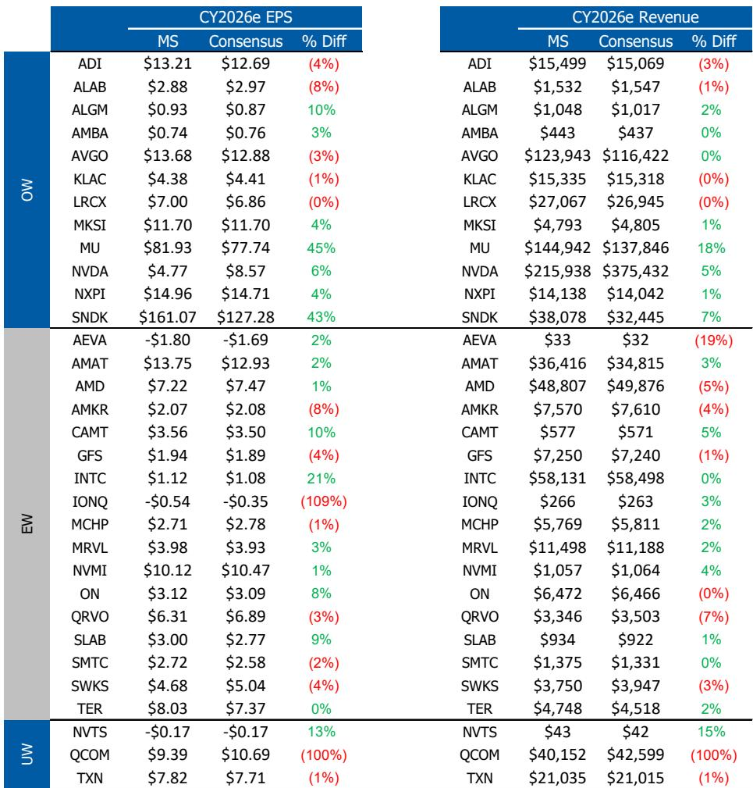
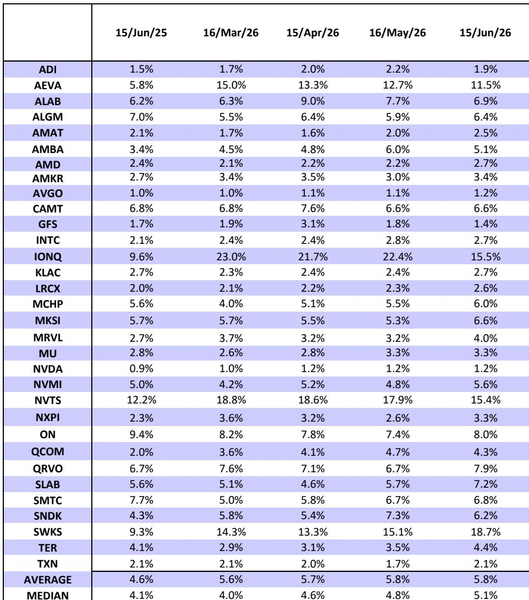
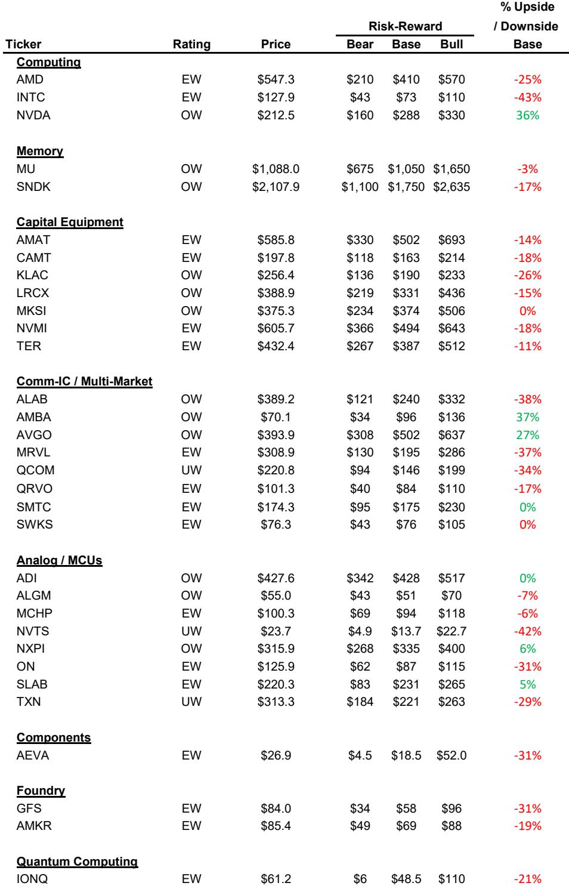

# The Semiconductor Cycle Is No Longer Cyclical: Why Supply Constraints and Structural Demand Are Rewriting the Rules for Memory and AI Infrastructure

The prevailing assumption that semiconductor cycles are self-correcting—that high prices inevitably attract enough supply to reset the market—is facing its most serious challenge in decades. For investors who have lived through the boom-bust rhythm of memory and chip markets, the current environment demands a fundamental rethink. The evidence from two upcoming earnings reports, one from a memory giant and one from a newly public AI compute company, points to a regime shift: supply is not responding to price signals with the speed or scale that historical models predict, and demand is not merely cyclical but structurally underwritten by multiyear customer commitments. The implications for portfolio strategy are profound, because the market may be pricing these companies as if the old rules still apply.

This is not a normal upcycle. It is a structural repricing of scarcity in two of the most critical layers of the AI stack: memory bandwidth and specialized compute. And the earnings reports scheduled for the coming week will provide the clearest test yet of whether the market is ready to accept that narrative.

## The Memory Supply Response Is Failing to Keep Pace, and That Changes the Valuation Debate Permanently

The most important insight from the upcoming Micron earnings is not the magnitude of the beat, but what the beat reveals about the durability of the cycle. Current estimates already call for dramatic sequential pricing increases: DRAM average selling prices up 45% quarter-over-quarter, NAND up 50%. Third-party forecasts are even more aggressive, with some calling for 60% and 75% increases respectively. The market has already absorbed these numbers into consensus, and the stock has moved accordingly. The real question is whether the current pricing trajectory can sustain itself beyond the next two quarters.

The answer hinges on supply, and here the data tells a story that is far more interesting than the headline numbers suggest. Capital expenditure is rising sharply—the report raises the fiscal year capex estimate from $25 billion to $27 billion, with an upward bias. But the effective supply increase from that spending is being diluted by three structural factors that are not temporary. First, construction timelines for new fabrication facilities are lengthening, meaning that dollars spent today do not translate into wafers for 18 to 24 months. Second, the shift to high-bandwidth memory consumes significantly more wafer capacity per bit shipped, because HBM requires advanced packaging and interposer layers that reduce effective output. Third, node migration efficiency is declining; each new process node delivers a smaller bit density improvement than previous generations, so the same capital investment yields less supply growth.

The result is that bit shipment increases remain in the mid-single digits quarter-over-quarter, even as demand appears to be growing much faster. This is not a temporary mismatch. It is a structural gap that will take years to close, if it closes at all. For investors, this means that the traditional peak-earnings multiple compression trade—where you sell memory stocks when earnings are at their highest because a downturn is coming—may be premature. If the supply response is structurally constrained, the peak may be higher and later than anyone expects.

## Strategic Customer Agreements Are the Market's Real Blind Spot, and Limited Disclosure Should Not Be Mistaken for Limited Progress

One of the most debated features of the current memory cycle is the rise of long-term strategic customer agreements. Micron disclosed a five-year agreement a quarter ago but provided almost no detail on pricing, volume commitments, or financial terms. The market has treated this lack of transparency with skepticism, and the stock may decline if the upcoming earnings call does not provide more clarity.

That skepticism is likely misplaced. The very fact that customers are willing to sign multiyear agreements in a market that has historically been spot-priced and volatile is itself the signal. Customers are not signing these agreements because they expect memory prices to fall. They are signing them because they expect memory to remain tight for years, and they need guaranteed supply to support their own AI infrastructure buildouts. The lack of disclosure is not a sign of weakness; it is a negotiating tactic. Micron is likely in conversations with multiple customers simultaneously and does not want to reveal its hand on pricing or volume commitments.

The strategic implication is that the market may be undervaluing the earnings power of memory companies by applying a cyclical multiple to what is becoming a structurally tighter market. At 9.3 times fiscal year 2027 earnings estimates, the stock is not pricing in the possibility that earnings can remain elevated for multiple years. If the strategic agreements provide a floor under revenue and margins, the appropriate multiple may be significantly higher. The risk is not that the cycle turns; the risk is that investors miss the re-rating because they are waiting for disclosure that may never come.

## For AI Compute Startups, the Investment Debate Has Shifted from Technology Risk to Execution Risk, and That Changes the Risk-Reward Calculus

The narrative for the newly public AI compute company is different but equally instructive. The company has a differentiated architecture based on a wafer-scale engine, and it has already secured large take-or-pay agreements that de-risk the demand side of the equation. The near-term investment debate is no longer about whether the technology works or whether customers want it. It is about whether the company can execute on its capacity deployment timeline.

The numbers tell a story of a business in transition. Core revenue is expected to be roughly flat in the June quarter, while core gross margin is expected to decline from 44% to 24%. This is not a sign of weakening demand; it is a function of the rent-back arrangements with a key customer that support the initial capacity ramp. These arrangements are a drag on reported margins, but they are also the mechanism by which the company is funding its expansion. The market understands these headwinds, and the stock has already priced them in.

The critical question is what happens when the initial 250-megawatt tranche comes online, which is expected by mid-2027. At that point, the rent-back arrangements should fade, and the company's gross margins should expand significantly. The report models core gross margins of 51% by fiscal year 2027, up from 29.5% in fiscal year 2026. If the company can execute on its capacity plan, the earnings trajectory from 2027 onward could be dramatically higher than current expectations.

But execution is not guaranteed. Building large-scale AI compute infrastructure is complex, and delays are common. The company must demonstrate that it can bring capacity online on time and on budget, and that the wafer-scale engine can deliver meaningful value to customers at scale. The technology is differentiated, but differentiation alone does not guarantee commercial success. The next two quarters will be about proving that the company can execute, not about proving that the technology works.

## What the Report Does Not Fully Answer: The Interaction Between Memory Constraints and AI Compute Demand Creates a Feedback Loop That Is Poorly Understood

The report provides detailed analysis of both the memory company and the AI compute company, but it does not fully explore the interaction between the two. This is a meaningful gap, because the two stories are linked. AI compute requires massive amounts of high-bandwidth memory, and memory supply constraints are a binding constraint on AI infrastructure deployment. If memory remains tight, it may slow the pace of AI compute deployment, which would affect the revenue trajectory of companies that sell AI compute systems.

Conversely, if AI compute deployment accelerates, it will increase demand for memory, potentially exacerbating the supply constraints that are already driving pricing higher. This creates a feedback loop that is difficult to model: higher memory prices may slow AI compute deployment, but slower AI compute deployment may reduce memory demand, which could bring prices down. The net effect is uncertain, and the report does not provide a clear framework for thinking about the dynamics.

There is also an open question about the durability of demand for the AI compute company's wafer-scale architecture. The report notes that the company's long-term success depends on whether the technology proves to be a durable competitive advantage. But the competitive landscape in AI compute is evolving rapidly, and the company's largest competitors are investing heavily in alternative architectures. The report is constructive on the near term, but it leaves open the question of whether the wafer-scale engine can maintain its differentiation as the market matures.

## A Decision Framework for Investors Navigating the Structural Shift

For investors trying to position for the next 12 to 18 months, the report suggests a framework with three distinct lenses.

The first lens is supply-side analysis. The critical variable is not the headline capital expenditure number, but the effective supply growth after accounting for construction timelines, HBM trade ratios, and node migration efficiency. Investors should track these three factors closely, because they determine whether the supply response will be sufficient to close the gap with demand. If the effective supply growth remains in the mid-single digits, pricing should remain elevated, and memory companies should continue to generate strong earnings.

The second lens is customer commitment structure. The rise of strategic customer agreements is a structural shift that changes the risk profile of memory companies. Investors should focus on the number and duration of these agreements, not on the specific pricing terms. If companies are signing agreements of three to five years, it suggests that customers expect tightness to persist, and the earnings power of memory companies may be more durable than the market assumes.

The third lens is the execution timeline for AI compute infrastructure. For companies that are building new AI compute capacity, the critical variable is the timeline for bringing that capacity online. Investors should track progress against announced milestones, because delays in capacity deployment will compress margins and delay the inflection point for earnings growth. The market is currently giving these companies the benefit of the doubt on execution, but that benefit may not persist if timelines slip.

## The Unresolved Questions That Make This Story Worth Following

The report leaves several meaningful questions unanswered, and these questions are precisely what make the story worth following. How will the memory supply response evolve as new fabrication capacity comes online in 2027 and 2028? Will the strategic customer agreements provide a floor under earnings, or will they prove to be less binding than expected? Can the AI compute company execute on its capacity deployment timeline, or will delays compress margins for longer than anticipated? And how will the feedback loop between memory constraints and AI compute deployment affect both markets?

These questions cannot be answered with the information currently available. They will be resolved through earnings calls, industry data, and competitive dynamics over the coming quarters. For investors who want to understand the structural shifts that are reshaping the semiconductor industry, these are the questions to watch.

Join the community to read the full report and review the original charts.

*This article is for learning and discussion only and does not constitute investment advice.*

Personal reading notes and learning share only. Not investment advice.

