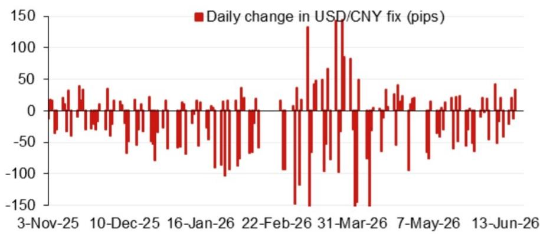
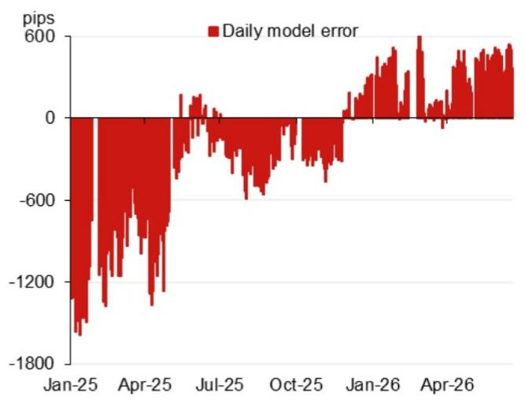

# NOM：人民币中间价模型正在传递一个比市场预期更克制的信号

这份NOM亚洲外汇策略团队的最新报告，看似只更新了一个每日模型预测数字，但拆解其内部结构和参数调整后，一个清晰的信号浮现出来：当前人民币定价机制中的“逆周期因子”正在发挥比表面数字更重要的校准作用，市场对汇率单向波动的定价可能过于激进。

报告的核心判断并不复杂：NOM模型给出的美元兑人民币中间价预测为6.7787，较前次预测下移了343个基点。但当我们把目光从绝对数字移开，聚焦于模型内部的结构性调整时，会发现一个更具深意的变化——计入逆周期因子后的预测值为6.8008，与前一交易日官方收盘价的偏离仅为122个基点。这个差值，才是真正值得关注的信号。

市场往往习惯于将注意力集中在人民币汇率的绝对水平上，讨论“破7”还是“守7”，讨论升值还是贬值的方向。但这份NOM报告提示了一个更精细的观察维度：政策制定者正在通过逆周期因子，对模型输出的“纯粹”市场定价进行微调，而这种微调的幅度和频率，才是理解当前汇率政策意图的真正钥匙。

## 1. 模型预测的下移并非线性趋势，而是多重短期因素的一次性校准

NOM模型预测从6.8130下移至6.7787，表面上看是343个基点的显著变化。但报告中的“无逆周期因子模型预测”和“含逆周期因子模型预测”两个数值的差异，揭示了这并非一个简单的方向性信号。

从报告提供的图表看，模型误差和隔夜贡献因素的变化，是推动预测下移的主要驱动力。这些因素包括隔夜美元指数的波动、其他亚洲货币的交叉汇率变动、以及市场情绪的短期扰动。它们具有明显的时效性，而非结构性趋势的改变。

一个关键点在于：模型预测的下移幅度，与官方中间价的实际调整幅度之间存在差距。这种差距本身就是一种政策信号。当市场参与者单纯追逐模型预测的方向时，他们可能会忽略逆周期因子正在发挥的“缓冲”作用。

这意味着，任何基于单一模型预测做出的汇率方向性判断，都可能高估了短期波动的持续性。真正的变量不在于6.7787还是6.8008，而在于政策制定者愿意容忍多大的偏离。

## 2. 逆周期因子的校准幅度，才是当前汇率管理的核心观察指标

报告中最值得反复推敲的数据点，是“含逆周期因子模型预测”6.8008与前一交易日官方收盘价的差值——122个基点。这个数值代表了政策制定者通过逆周期因子对市场定价进行的主动干预幅度。

逆周期因子的本质，是央行在人民币中间价形成机制中引入的一个“调节阀”。当市场情绪过度乐观或悲观时，这个阀门可以被拧紧或放松，以平滑汇率的短期过度波动。122个基点的偏离，在历史数据中属于中等偏上的水平，表明政策制定者认为当前市场定价存在一定程度的偏离，需要进行温和校正。

但更重要的是，这个偏离值本身也在变化。报告显示，此前的模型预测与官方收盘价的偏离为164个基点，而当前已收窄至122个基点。这种收窄趋势，可能意味着两件事中的一件：要么市场定价正在向政策合意区间靠拢，要么政策制定者正在逐步减少干预力度。无论是哪一种，都指向一个结论：当前汇率定价的“政策锚”比市场想象的更稳定，而非更脆弱。

对于关注人民币资产定价的投资者而言，这意味着不应将短期汇率波动解读为政策转向的信号。逆周期因子的存在，恰恰是为了防止这种误读。

## 3. 报告未完全展开的关键问题：逆周期因子的校准是否存在一个“隐含目标区间”

这份NOM报告的核心价值在于提供了精确的模型预测和校准数据，但它也留下了一个未完全回答的问题：逆周期因子的校准是否存在一个隐含的目标区间？或者更直白地说，政策制定者心中是否有一个“合意汇率水平”？

从报告提供的图表来看，模型误差和每日中间价变动呈现出明显的波动性。逆周期因子的调整似乎是对这些短期波动的反应，而非对某个长期目标的追逐。但这恰恰是问题所在：如果没有一个隐含的目标区间，那么逆周期因子的校准就只是“头痛医头”的被动应对；如果存在目标区间，那么当前的校准幅度就是政策意图的直接体现。

报告没有提供足够的历史数据来回答这个问题。我们看到的只是单一时间点的模型预测和校准值，缺乏对逆周期因子调整规律的系统性分析。这是一个值得深入探讨的方向：通过回溯逆周期因子调整与关键事件（如政治局会议、重要外交活动）的关联性，或许能够推断出更清晰的政策逻辑。

这一未解问题，恰恰是深入阅读完整报告和持续跟踪数据更新的价值所在。仅凭单次模型预测，无法得出关于政策意图的可靠结论。

## 4. 2026年下半年的事件日历，为汇率定价提供了可预期的压力测试场景

报告附录中列出的2026年下半年事件日历，虽然看似只是常规的日程安排，但将其与汇率模型结合起来看，就构成了一个清晰的“压力测试”框架。

7月底的政治局会议、11月的APEC峰会、年底前可能发生的领导人会晤，以及12月的中央经济工作会议——这些事件每一个都可能成为影响汇率预期的关键节点。尤其是APEC会议在中国深圳举办，以及年底前可能的中美领导人会晤，都意味着汇率稳定在特定时间段内具有更高的政策优先级。

这意味着，逆周期因子的校准幅度可能会在这些关键事件前后发生可预期的变化。在市场关注度最高的时间窗口，政策制定者倾向于维持汇率稳定；而在事件间隔期，模型预测的纯粹市场定价可能会获得更大的自由度。

对于交易者和投资者而言，这意味着不应将当前的逆周期因子校准幅度视为常态。它可能在未来几个月内根据事件日程发生显著调整。理解这种“事件驱动型”的汇率管理逻辑，比猜测一个具体的汇率点位更有价值。

## 5. 一个更务实的观察框架：关注模型误差的变化趋势，而非单一预测值

基于上述分析，我们建议读者建立一个更务实的观察框架：将注意力从“模型预测的绝对水平”转移到“模型误差的变化趋势”上。

报告提供的图表显示，模型误差（即模型预测与实际中间价的差值）本身就是一个动态变量。当误差持续扩大时，意味着市场定价与模型预测之间的分歧在加大，这可能预示着逆周期因子的调整力度需要加强。反之，误差收窄则表明市场正在向政策合意区间靠拢。

这个框架的优势在于，它不依赖于对汇率方向的判断，而是关注定价机制本身的“紧张程度”。一个紧张程度上升的市场，意味着更大的政策干预概率和更高的波动风险；一个紧张程度下降的市场，则意味着更顺畅的定价传导和更小的政策不确定性。

对于产业决策者和高净值投资者而言，这个框架比单纯谈论“汇率会升还是会贬”更具可操作性。它提供了一个动态的风险监测指标，而非一个静态的预测结论。

---

这份NOM报告的价值，不在于它给出了一个具体的汇率预测数字，而在于它揭示了当前人民币定价机制中一个被市场普遍低估的变量——逆周期因子的校准逻辑。模型预测的下移是短期因素的反映，而逆周期因子的调整才是政策意图的载体。两者之间的差距，正是市场需要深入理解的关键地带。

报告没有回答的问题还有很多：逆周期因子的调整是否存在一个系统性规则？不同事件窗口下的校准力度是否有规律可循？模型误差的哪些成分是政策制定者最关注的？这些问题的答案，需要结合更长时间序列的数据和更细致的政策分析才能得出。

欢迎来星球微信群里继续讨论。我们将持续追踪NOM及其他头部机构的汇率模型更新，拆解逆周期因子的调整规律，并在关键事件前后提供更及时的分析。如果你对人民币定价机制背后的政策逻辑有更深入的兴趣，这些讨论或许能提供比单篇报告更完整的视角。

Personal reading notes and learning share only. Not investment advice.

