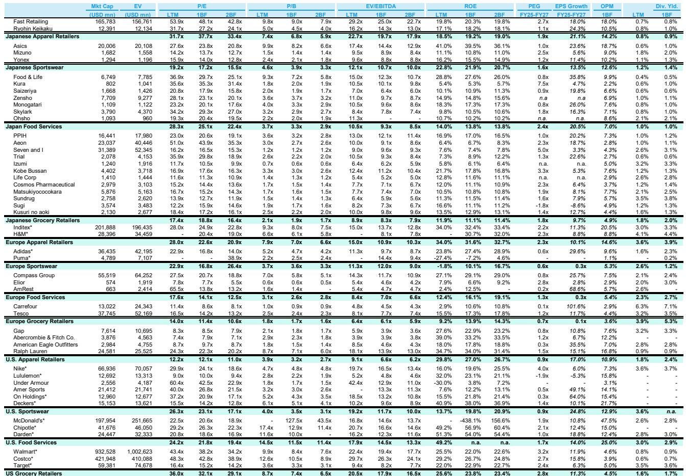
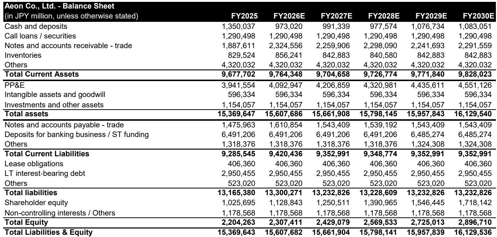
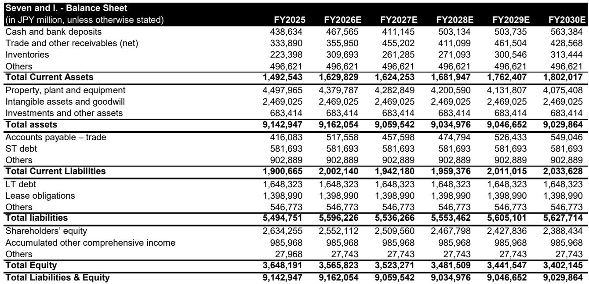

# Bernstein：日本零售业真正被低估的不是消费复苏，而是供给侧的整合拐点

全球投资者长期将日本国内零售视为一个“已被充分讨论”的市场——人口萎缩、增长有限、整合停滞。这种看法本身并没有错，但它遗漏了一个关键变量：过去三十年“失去的岁月”同时也是一个漫长的通缩过滤器，弱者被淘汰，幸存者的运营效率在压力下持续进化。Bernstein最新发布的日本零售系列报告提出了一个与市场共识截然不同的判断：日本国内零售业正在接近一个加速整合的拐点，而这一变化的驱动力已经从周期性转向结构性。

这份报告的核心洞见在于，日本零售业当前面临的不是需求端的短期波动，而是供给端成本结构的根本性重塑。超市行业约1.5%的经营利润率，对应着约14%的人工成本率——这个方程式在最低工资自2015年以来累计上涨超过30%、远超CPI约10%涨幅的背景下，已经变得不可持续。支撑行业碎片化的传统支柱——店内生鲜加工、地理分散化、对非正规劳动力的依赖——正在同时瓦解。规模较小的企业，缺乏投资自动化和中央加工的能力，正在被系统性边缘化。

这与西方零售业完成整合的历史路径不同。西欧和美国在几十年前就完成了这一过程，而日本现在才进入“中场局”。对于产业决策者和投资者而言，这意味着一个清晰的、未来十年的集中度提升路径正在形成，而非市场普遍预期的“一成不变”。

## 1. 消费者行为的分裂正在结构性淘汰中间业态

日本现代消费者呈现出一种鲜明的二元模式：工作日的“效用型”购物——快速、功能性支出集中在药妆店——与周末的“寻宝型”消费在折扣零售商处完成。这种分裂几乎没有给中间路线业态留下生存空间。

综合超市（GMS）曾经是“一站式解决方案”，但现在正被专业零售商和更聚焦的业态持续蚕食品类份额。结果是，GMS逐渐变成了一个难以定义自身价值主张的业态——在运营上仍然存在，但在战略上已经过时。Bernstein的报告用了一个精准的比喻：GMS正在变成“僵尸”——运营上存在，但战略上已经死亡。

这个观察的意义在于，它解释了为什么日本零售业的整合不会是均匀的。整合将首先发生在那些“夹心层”业态，而折扣店和药妆店将受益于消费者行为的结构性转移。对于持有GMS相关资产的企业和投资者来说，这不仅仅是周期性问题，而是需要重新评估资产长期价值的信号。

## 2. 人工成本压力不再是周期波动，而是不可逆的结构性重置

这是整份报告最关键的论据之一。日本超市行业1.5%的OPM与14%的人工成本率之间的差距，在过去十年中因最低工资大幅上涨而急剧扩大。传统的应对方式——依赖非正规劳动力、分散化运营、店内现做——正在失去效力。

Bernstein的分析指出，规模较小的企业无法负担自动化投资和中央加工设施，这意味着它们的成本劣势正在从“可管理”变成“致命”。这不是一个短期劳动力市场紧张的问题，而是日本人口结构、劳动力供给和最低工资政策共同作用下的长期趋势。

对于产业决策者而言，这个判断的蕴含是：整合的驱动力不是来自管理层的战略选择，而是来自成本结构的物理约束。那些能够通过规模效应实现自动化、中央化处理的企业，将获得不可逆的成本优势。那些不能的企业，无论管理层多么优秀，都将被结构性地挤出市场。

## 3. 折扣业态的“高毛利-高成本-高利润”模型为何值得关注

在整体零售利润微薄的背景下，Bernstein对PPIH（唐吉诃德母公司）给出了跑赢大盘的评级。这个判断背后的逻辑值得仔细拆解。

PPIH属于折扣零售中的特殊子类别。报告描述其运营模式为“高毛利率、高成本、高利润”——约7%的经营利润率在行业中极为突出。这听起来有些反直觉：折扣店如何能实现高毛利？关键在于其独特的商品组合和供应链策略。免税销售和自有品牌的增长提供了额外的结构性增长空间，而竞争对手难以复制其复杂的采购和定价能力。

这个案例的价值在于，它展示了在整合浪潮中，真正的赢家可能不是最大规模的参与者，而是拥有独特运营模型的企业。对于投资者来说，这意味着需要超越传统的“规模效应”框架，去理解哪些企业拥有难以复制的“护城河式”运营能力。

## 4. 综合商超的估值泡沫：市场对整合协同效应的预期可能过热

Bernstein对永旺（AEON）给出了跑输大盘的评级，理由是其估值已经透支了潜在的整合协同效应。当前约50倍的TTM市盈率，已经计入了大量尚未实现的整合收益和雄心勃勃的协同假设，而执行风险仍然显著。

这个判断揭示了一个重要的投资原则：整合叙事虽然诱人，但市场往往在整合真正完成之前就将收益计入价格。永旺的案例中，市场似乎假设了整合带来的成本节约和收入协同能够顺利实现，但Bernstein的分析认为，这种假设过于乐观。整合的复杂性——文化融合、系统整合、门店改造——往往被低估。

对于产业决策者而言，这个案例提供了另一个维度的启示：在整合浪潮中，作为收购方，估值溢价是否合理，取决于整合执行的能力，而不仅仅是交易规模。

## 5. 便利店业态的巅峰已过，但企业价值重估的期权仍然存在

Seven & i Holdings（7-Eleven母公司）的情况更为复杂。Bernstein给出了中性评级，理由是其核心便利店业务已过巅峰期，加盟商经济性正在恶化，治理压力也在上升。但同时，股票仍然保留了显著的“企业价值重估期权”——来自Couche-Tard的收购底价，以及伊藤忠与创始家族主导的便利店重组可能性。

这个判断的核心是：Seven & i的价值不再完全取决于其运营表现，而是越来越多地取决于公司结构和所有权变化带来的价值释放。对于投资者来说，这意味着需要同时评估运营基本面和企业治理动态——两者之间的脱节可能正是机会所在。

对于产业决策者而言，这个案例提出了一个更广泛的问题：在日本零售业整合加速的背景下，哪些企业可能成为整合的目标，而不是整合的推动者？那些业务结构复杂、运营效率下降、但资产价值被低估的企业，可能成为资本运作的标的。

## 报告尚未完全回答的关键问题：整合速度与执行风险的平衡

尽管Bernstein的报告提供了令人信服的结构性分析框架，但它也留下了一些尚未完全解决的问题。其中最核心的是：整合的速度到底有多快？报告指出，日本零售业现在进入“中场局”，但“中场局”具体意味着多长时间——五年、十年还是更长？这个时间跨度对投资决策和产业规划至关重要。

另一个没有被完全展开的问题是：整合的阻力来源。日本的商业文化、区域保护主义、以及小型零售商的生存韧性，都可能延缓整合进程。报告提到了“僵尸”业态，但没有深入分析这些僵尸企业是否可能通过政府支持或地方保护主义继续存活更长时间。

此外，报告对PPIH的评级基于其独特的运营模型，但这一模型的可持续性仍需验证。随着更多竞争者进入折扣领域，PPIH的“高毛利-高成本-高利润”模型是否能够维持？自有品牌和免税销售的增量空间有多大？这些关键假设的验证，需要更深入的数据和实地调研。

这些未解问题，恰恰是后续研究和讨论最有价值的方向。欢迎来到星球微信群里继续探讨——我们会在群内分享更多维度的一线调研反馈，以及对这些关键问题的持续跟踪分析。

---

Personal reading notes and learning share only. Not investment advice.

