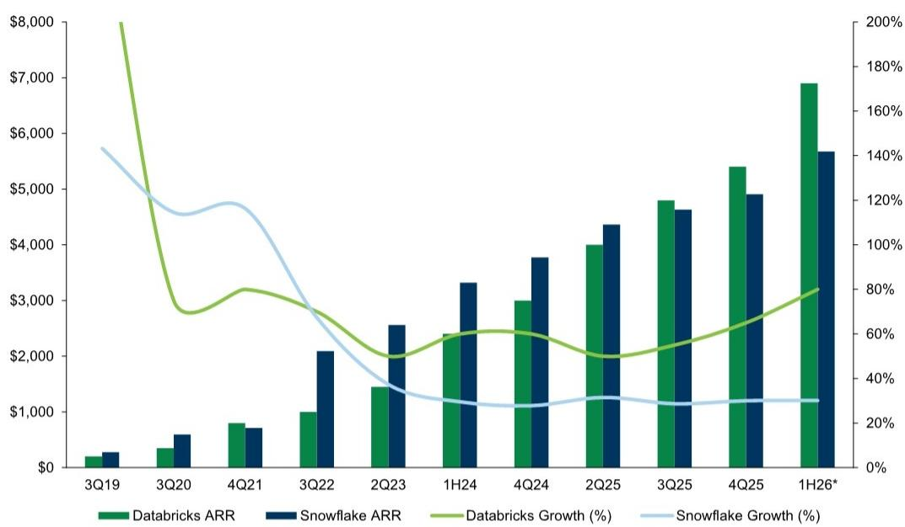
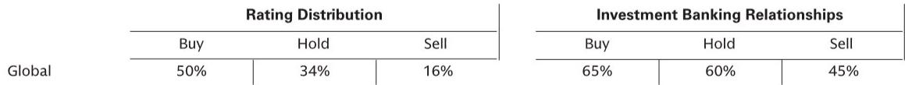

# GS：软件行业的真正分水岭不是AI本身，而是“好粘性”与“坏粘性”的重新定价

Databricks年度大会结束后，GS软件团队发布了一份不同寻常的报告。它没有罗列产品更新清单，而是提出了一个判断：软件行业的估值分化将加速，而分化的核心变量不是AI能力的有无，而是“粘性”的质量。

这份报告的洞察起点是一个简单却尖锐的问题：当AI让数据迁移成本骤降，哪些软件公司的护城河会变浅？哪些反而会更深？GS分析师给出的框架是“好粘性”与“坏粘性”之分。前者靠持续创新和客户热爱来锁定用户，后者依赖历史遗留的迁移成本。AI正在系统性地瓦解后者。

这意味着，未来12-18个月，软件投资的核心命题不再是“谁有AI故事”，而是“谁的商业模式经得起重新定价”。

## 1. 迁移成本正在被AI工具系统性地压低，依赖“坏粘性”的公司面临估值重塑

GS的报告明确点出了一个被市场低估的结构性变化：AI不仅改变了软件的功能边界，更改变了竞争的基础设施。过去，一家SaaS公司只要把客户数据锁在自己的格式里，就能获得相当可观的定价权。客户即使不满意，也会因为迁移成本过高而选择留下。这种“坏粘性”曾经是很多软件公司利润率的基石。

但Databricks在大会上的产品发布，尤其是LTAP（Lake Transactional/Analytical Processing）和Open Sharing协议，清晰地展示了新范式：数据可以在开放格式下自由流动，分析引擎和事务引擎可以共享同一个数据源。当客户的数据不再被某个特定平台绑架，迁移成本就大幅下降。

GS分析师特别指出，Databricks的定价策略本身就反映了这种逻辑。公司内部明确表示，它可以选择定价高出两倍，但短期定价优化往往会牺牲长期竞争力和客户终身价值。这种“以开放换增长”的策略，实际上是在提高整个行业的竞争标准。

对于投资者而言，这意味着需要重新审视那些过去依赖高迁移成本来维持续费率的公司。当客户可以更容易地用AI工具完成数据迁移，那些产品创新速度放缓、客户满意度下降的公司，其估值中的“粘性溢价”需要被重新定价。

## 2. 软件行业正在从“打包应用”走向“定制代理”，中间层成为新的价值高地

GS报告中最具前瞻性的洞察之一，是对软件架构演进的判断。传统的SaaS应用是孤立的，每个应用管理自己的一套数据和流程。但真正有价值的AI代理应用，恰恰需要跨越这些孤岛，存在于SaaS系统之间的“空白地带”。

这意味着，未来软件行业的TAM（可寻址市场）将发生结构性变化。GS此前已经量化过，代理式AI将在2030年前为软件行业带来20%的TAM提升，相当于行业增速从7%提升到9%。但这份报告进一步指出，增量中的大部分将流向“定制应用”而非“打包应用”。

支撑定制应用的核心是“操作系统层”——一个能够从各种记录系统和企业数据存储中拉取数据的智能中间层。GS识别了四种构建这一层的路径：Databricks的Ontology产品、Palantir的工程外包模式、云厂商的生态系统（如微软的“前沿智能”愿景），以及ServiceNow等AI点产品的控制塔。

这里的关键判断是：组织复杂度决定了选择。复杂的企业组织更可能选择定制路径，而简单的SMB可能继续使用现成的SaaS。这意味着，能够帮助客户构建和维护这个中间层的公司——无论是通过平台、工程服务还是治理工具——将获得更大的价值分配。

## 3. Databricks正在用“数据库革命”来支撑代理时代，而市场可能低估了LTAP的长期影响

GS报告用大量篇幅分析了Databricks的产品创新，但最核心的观点是：当整个行业都在追逐代理应用时，Databricks选择回头解决数据库基础设施层面的问题。这看起来是“向后看”，实际上是“向前看”的必要条件。

LTAP的发布被GS称为“解决了数据库工程中40年的问题”。它统一了OLTP（在线事务处理）和OLAP（在线分析处理）两个长期分离的世界。过去，企业需要为事务数据库、ETL工具、数据仓库、BI系统、治理和AI分别采购不同的产品。Databricks的目标是把这个碎片化的市场压缩成一个基于开放格式、共享治理和统一数据层的集成平台。

更值得关注的是Databricks对Postgres的押注。在代理驱动的世界里，工作负载以机器速度运行，需要低成本、确定性高且可分支的环境。Lakebase引入了近乎实时的数据库分支能力，让代理可以安全地分叉数据集、实验、写入更改并在需要时回退。这不是一个渐进式改进，而是为代理工作负载重新设计数据库基础设施。

GS的数据显示，Databricks的核心收入增长（排除代币转售）已经连续五个季度加速。这并非偶然，而是产品市场匹配度提升的直接结果。

## 4. 定制代理应用的维护成本正在被系统性降低，但报告尚未完全回答“谁将获得最大份额”

GS报告提到了一个被很多人忽视的关键点：维护成本是定制应用最大的隐性障碍。ServiceNow此前曾量化，定制应用的总拥有成本是SaaS的5-10倍。这解释了为什么过去大多数企业选择打包SaaS而非自建。

但Databricks的多项创新直接瞄准了这一痛点。Unity Catalog作为通用治理层嵌入Ontology；Ontology利用单一数据源；LTAP消除了不同数据源之间脆弱的管道和ETL流程。这些创新的综合效果，是大幅降低定制应用的维护TCO。

然而，报告也留下了一个未完全回答的问题：当维护成本下降，定制应用变得可行，谁将最终获得最大的价值份额？是提供平台和工具的Databricks？是提供工程服务的Palantir？还是那些能够将定制能力产品化的SaaS厂商？

GS的分析倾向于认为，短期内“水涨船高”，所有相关公司都会受益。但中期来看，竞争格局将取决于谁能更有效地降低客户的组织复杂性。这里的关键变量不是技术能力，而是“工程交付”的效率和可扩展性。

## 5. 观察框架：用“创新速度”和“定价策略”两个维度重新评估软件公司的护城河

基于GS的分析，我们可以提炼出一个更简洁的观察框架来评估软件公司。这个框架只有两个维度：创新速度与定价策略。

创新速度不仅仅看产品发布数量，更要看是否解决了客户的核心痛点。GS用Shopify和Cloudflare作为正面案例——它们的创新速度高，定价策略具有破坏性，目标是用低价获取长期市场份额。Shopify曾直言其Plus产品是“企业软件中最好的交易”，Cloudflare则因为在SASE领域拥有极低的边际服务成本而能够激进定价。

定价策略则反映了公司的竞争哲学。选择短期利润最大化还是长期市场份额最大化？Databricks明确选择了后者，并以此构建了公司的R&D和M&A策略。这种选择的结果是，公司必须保持极高的创新强度来维持竞争优势，但同时也限制了未来新进入者的空间。

将这两个维度组合起来，可以形成一个简单的四象限：高创新+激进定价的公司，处于最有利的位置；低创新+高定价的公司，其“坏粘性”正在被侵蚀；而中间状态的公司，则需要关注其护城河的变化方向。

---

Databricks大会上的产品发布让人目不暇接，但GS这份报告的价值在于，它提供了一个框架来理解这些技术变化的商业含义。当AI让数据自由流动，当定制应用变得可行，当迁移成本下降，软件行业的竞争规则正在被重写。

但仍有几个关键问题值得持续追踪：LTAP是否真的能大规模落地并替代现有的数据库架构？Palantir与Databricks之间的竞合关系会如何演变？那些依赖“坏粘性”的公司，其估值何时会开始反映这一变化？

这些问题的答案，可能决定了未来几年软件投资的核心回报来源。欢迎来星球微信群里继续讨论，我们会持续跟踪这些公司的季度表现和产品演进，并结合完整报告中的原始图表和财务数据，做更深度的推演。

Personal reading notes and learning share only. Not investment advice.

