US ECONOMICS ANALYST

# Mid-Year Inflation Outlook: Oil and AI vs. Wages and Rent

Core PCE inflation has reaccelerated this year, partly reflecting a combination of energy price passthrough, AI-related price pressures amplified by measurement issues, and financial services inflation driven by higher equity prices. In this week's Analyst, we take stock of the inflation outlook.

The US-Iran agreement has reduced upside risks to inflation from higher energy prices. Our commodity strategists lowered their oil forecasts to \$80 on average in 2026Q4 and \$75 in 2027 (vs. \$90 and \$80 previously), which implies about 0.2pp and 0.05pp less upward pressure on headline and core PCE inflation this year than our previous assumptions. In the near term, lower gasoline prices will translate into soft headline inflation prints in June, and our preliminary headline CPI and PCE estimates for June stand at -0.13% and 0.07%, respectively. The prices of several other non-oil Gulf exports have also declined meaningfully in recent days. We now estimate that commodity prices will deliver a roughly 0.4pp boost to year-over-year core PCE inflation through 2026Q4.

AI-related pressure on memory prices has pushed up computer software and accessories inflation, generating an especially large boost to core PCE because of measurement distortions. We expect monthly software and accessories inflation to slow from about 4-5% in recent months to about 0.6% by 2026Q4, reflecting a sharp slowdown in memory price inflation in recent months. We also expect higher memory prices to increase phone and computer inflation throughout 2026, though with smaller contributions to overall core PCE than software and accessories. Taken together, we estimate that AI-related price pressures will boost year-over-year core PCE inflation by about 0.4pp in December 2026 (with a peak of 0.6pp earlier in 2026H2, vs. 0.25pp already realized) and core CPI inflation by about 0.1pp.

We continue to have a benign outlook for underlying core inflation outside AI-related components and energy price passthrough. We expect rent growth to slow to below its pre-pandemic pace, reflecting soft new-tenant rent growth. We also expect slow nominal wage growth to put downward pressure on core nonhousing services inflation, though we expect healthcare inflation to remain around its current pace as prices continue to catch up to costs. Our indicators of persistent inflation risk and pipeline inflation pressures suggest that underlying inflation risk rose slightly in recent months but remains modest.

We forecast year-over-year core PCE inflation of 3.2% in December 2026,

Manuel Abecasis
+1(212)902-8357 |
manuel.abecasis@gs.com
GS & Co. LLC

followed by a slowdown to 2.2% by December 2027 as the AI and energy effects wane. In the near term, we expect strong increases in lagged equity prices to boost monthly core PCE inflation by 0.10pp in May and 0.05pp in June. We expect core CPI—which is less affected by AI measurement issues and stock market swings—to slow to 2.6% year-over-year by December 2026 and 2.2% by December 2027. We see risks to our forecast skewed to the upside on net, particularly if the situation in the Middle East deteriorates or if higher inflation expectations cause businesses to raise prices beyond increases in their input costs.

## Mid-Year Inflation Outlook: Oil and AI vs. Wages and Rent

Core PCE inflation has reaccelerated this year, partly reflecting a combination of energy price passthrough, AI-related price pressures amplified by measurement issues, and higher equity prices. In this week's Analyst, we take stock of the inflation outlook.

## Relief From the US-Iran Agreement

The US-Iran agreement and recent decline in oil prices have reduced upside risks to inflation. Our commodity strategists lowered their oil forecasts to \$80 on average in 2026Q4 and \$75 in 2027 (vs. \$90 and \$80 previously). In an upside scenario where the Strait of Hormuz remains disrupted through 2027, they expect Brent would rise to \$130 in 2026 and average \$105 in 2027. In a downside scenario with greater flows and stronger supply, they expect Brent would average just under \$70 in 2026Q4 and just under \$60 in 2027 (Exhibit 1).

Our strategists' new forecasts imply about 0.2pp and 0.05pp less upward pressure on headline and core PCE inflation by year-end than our previous assumptions. In the meantime, the recent decline in Brent and gasoline prices will translate into soft headline inflation prints in June, and our preliminary headline CPI and PCE estimates for the month stand at -0.13% and 0.07%, respectively.

Exhibit 1: Our Oil Strategists Now Expect Brent to Average \$80 in 2026Q4 and \$75 in 2027 (vs. \$90 and \$80 Previously)  
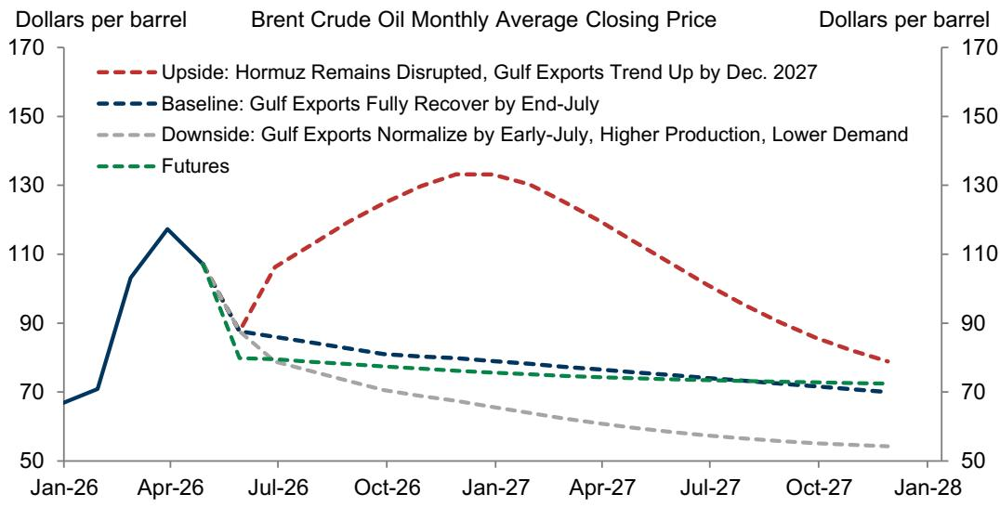  
Source: GS Global Investment Research, Department of Energy

Beyond oil, we incorporate two other developments related to the conflict in the Middle East. First, the prices of non-oil Gulf exports like nitrogen and polyethylene have declined after rising sharply after the start of the war. Several products' prices are now close to their pre-war levels, though others remain elevated—particularly sulfur and ammonia (left side of Exhibit 2). Second, margins on refined oil products like jet fuel and gasoline rose significantly in May in the US, though they have since retraced some of their earlier increases (right side of Exhibit 2). Goods transportation costs also rose meaningfully in May, with the relevant PPI increasing a bit more than its typical relationship with oil prices would imply. Going forward, we expect refined product

spreads and goods transportation costs to normalize gradually as supply conditions in the Middle East improve.

Exhibit 2: Beyond Oil, the Prices of Several Gulf Exports Have Retraced From Their Recent Peaks, and Some Are Now Close to Pre-War Levels; US Refined Product Spreads Rose Sharply in May  
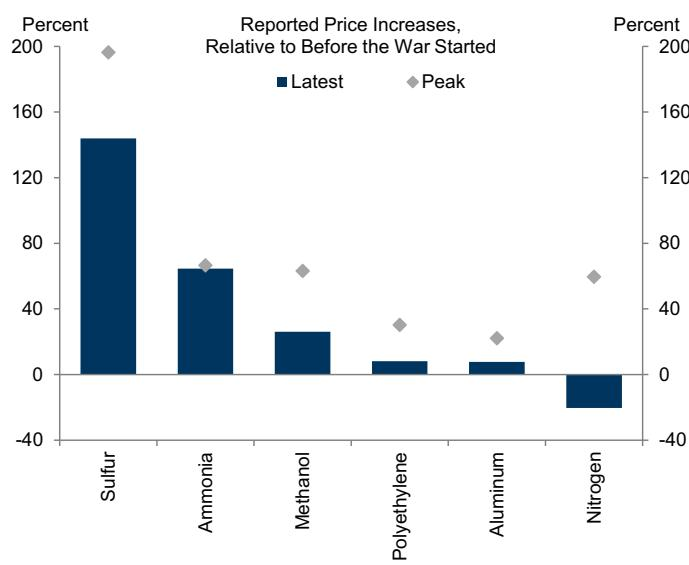  
Source: GS Global Investment Research, Bloomberg

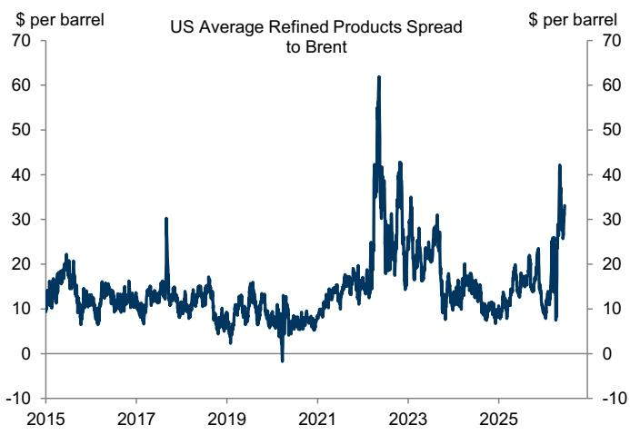  
Note: Weighted average refined product cash prices of gasoline, diesel, jet fuel, fuel oil, and naphtha. Weights based on relative demand for each product in 2025.

In Exhibit 3, we update our commodity price passthrough framework, including our oil strategists' latest forecasts, changes in goods transportation costs, and refined product spreads. We assume that refined product spreads gradually normalize over the next couple of months and that transportation costs behave in line with their usual relationship with oil. Taken together, we estimate that commodity prices will deliver a roughly 0.4pp boost to year-over-year core PCE inflation this year, with a smaller sequential boost in 2026H2.

Exhibit 3: We Estimate That Higher Commodity Prices Will Deliver a Roughly 0.4pp Boost to Year-over-Year Core PCE Inflation This Year, Which We Expect to Fade in 2027  
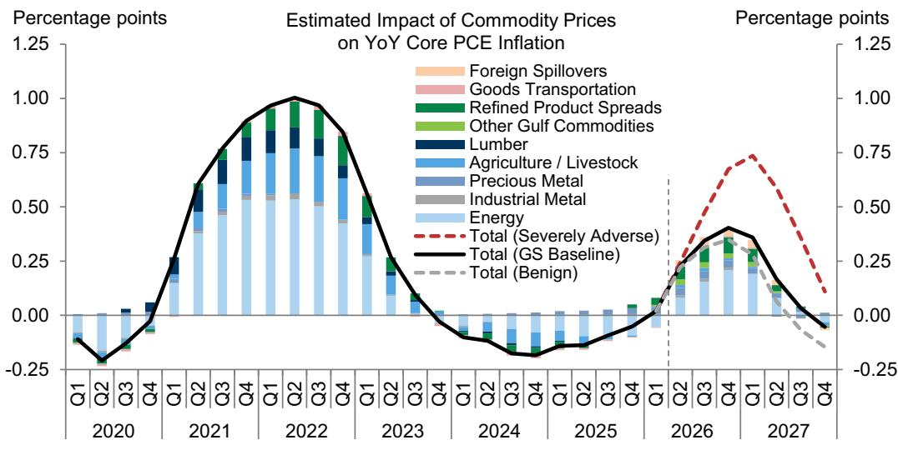  
Source: GS Global Investment Research

Exhibit 4 shows the implications of our commodity strategists' updated oil price scenarios for headline and core PCE inflation. In our baseline forecast, we expect year-over-year headline PCE inflation to start normalizing in June. In their upside scenario, we estimate a boost to core PCE inflation of 0.2pp and to headline PCE inflation of 1.1pp relative to our baseline. In their downside scenario, we estimate a drag on core PCE inflation of 0.1pp and on headline PCE inflation of 0.4pp relative to our baseline.

Exhibit 4: We Expect Headline Inflation to Slow From Here; Our Strategists' Upside Scenario Would Add Another 1.1pp to Headline PCE and 0.2pp to Core PCE, While Their Downside Scenario Would Subtract 0.4pp and 0.1pp  
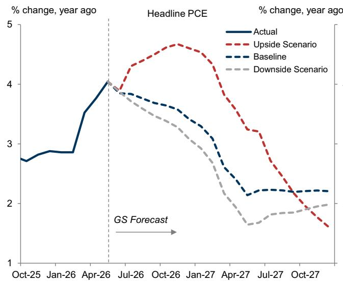

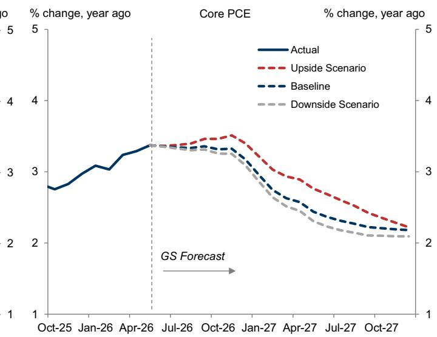  
Note: Includes GS estimate for May PCE based on CPI, PPI, and import prices. Baseline assumes oil prices average \$88 in June and \$86 in July before declining to \$80 by 2026Q4. Downside scenario assumes oil prices average \$88 in June and \$84 in July before declining to \$70 by 2026Q4. Upside scenario assumes oil prices average \$88 in June and peak at \$130 in 2026 before declining to \$105 on average in 2027.  
Source: GS Global Investment Research, Department of Commerce

## The Inflationary Impulse From AI: Larger for PCE Than for CPI

The AI infrastructure boom led to a spike in memory prices as companies sought to buy chips to equip data centers. Prices for some types of memory rose 10-15x in a few months between 2025Q4 and 2026Q1 (left side of Exhibit 5). More recently, spot memory prices have remained very high relative to pre-2025Q4, but the pace of increases has slowed significantly. Contract prices faced by electronics manufacturers can lag spot prices by a few months, but the pace of increases has slowed for those too.

Higher memory prices have pushed up computer software and accessories inflation, generating an especially large boost to core PCE because of measurement distortions. While this component measures both software and accessories prices, in practice most of its variation can be explained by changes in memory prices that largely affect accessories costs (right side of Exhibit 5). We model computer software and accessories inflation using high-frequency memory prices, data from memory manufacturers, and our equity analysts' forecasts. Our model suggests that software and accessories inflation will slow from about 4–5% month-over-month in recent months to about 0.6% by year-end, reflecting the recent slowdown in memory price inflation.

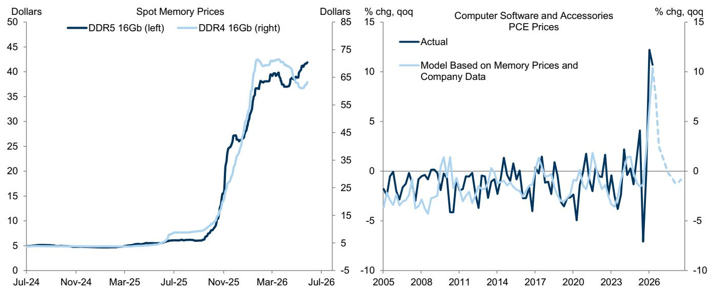  
Exhibit 5: Memory Prices Rose Sharply in 2025Q4 and 2026Q1 but Have Stalled Since; As a Result, We Expect Computer Software and Accessories Inflation to Slow in Coming Months  
Source: GS Global Investment Research, Trendforce, Department of Commerce

Computer software and accessories prices were flat in the May CPI report, suggesting that some of this slowdown is already underway. That said, this component is not seasonally adjusted by the BLS, and it has slowed by about 3pp relative to its prior trend in each of the last three Mays (reversing consistent accelerations earlier in the year), so much of the slowdown this May was likely residual seasonality. Going forward, we expect software prices to increase by 2-3% for the next couple of months and to slow further for the rest of the year.

We also expect higher memory prices to boost phone and computer inflation throughout 2026 as manufacturers pass through higher production costs. That said, the boost to core PCE should be smaller than that of software and accessories, in part because these categories receive smaller weights in PCE. Taken together, we estimate that AI-related pressure will boost year-over-year core PCE inflation by about 0.4pp in December 2026 (vs. 0.25pp so far, and a 0.6pp peak in 2026H2). We estimate a much smaller boost to core CPI inflation, of about 0.1pp, largely because CPI does not suffer from the same methodological issues as PCE.

Exhibit 6: We Expect AI-Related Price Pressures to Boost Year-over-Year Core PCE Inflation by 0.4pp by December 2026, With a 0.6pp Peak Earlier in H2; We Expect AI-Related Price Pressures to Boost Core CPI by About 0.1pp by December 2026

  
Source: GS Global Investment Research, Department of Commerce, Department of Labor

## Disinflation From Rent and Wages

We continue to see a relatively benign outlook for core inflation outside of AI pressure and energy passthrough. We expect rent growth to slow to below its pre-pandemic pace, reflecting continued softness in new-lease rent growth (Exhibit 7). Monthly housing inflation has been volatile recently, spiking in April as the negative bias from last year's government shutdown unwound. Housing prices also rose at an above-trend pace in May, but most of the acceleration relative to the prior trend was concentrated in the Northeast, which we suspect reflected statistical noise. Going forward, we continue to expect housing inflation to slow and to settle at a pace roughly $1 - 1\frac{1}{2}$ pp below the pre-pandemic pace.

\*Average of Costar, Yardi, and Zillow measures of rent growth.

Exhibit 7: We Expect Housing Inflation to Continue to Slow This Year, Reflecting Soft New-Tenant Rent Inflation  
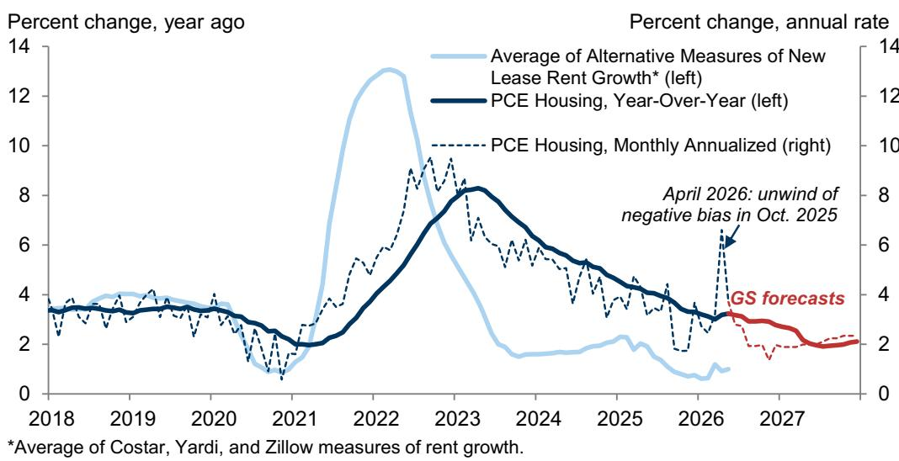  
Source: GS Global Investment Research, Department of Commerce, CoStar, Yardi, Zillow

We also expect slower wage growth to put downward pressure on nonhousing services inflation, excluding airfares—which are largely driven by oil price changes—and portfolio management—which are driven by equity prices. Wage growth has continued to slow this year, and we expect wage-sensitive PCE services to follow suit over the next several months. We think that the World Cup has likely temporarily boosted hotel prices but expect that to fade as the reservation window moves past the tournament’s end.

Exhibit 8: Slower Wage Growth in Labor-Intensive Services Should Provide an Additional Disinflationary Impulse This Year  
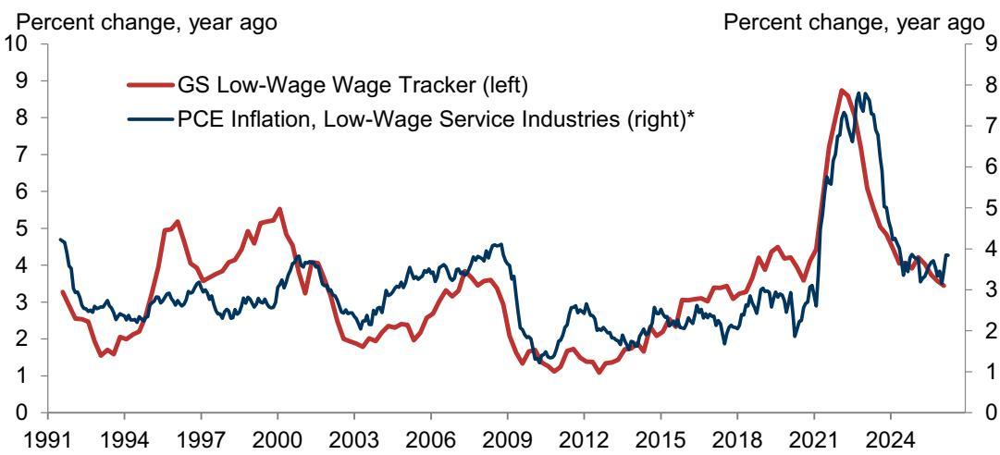  
\* Includes food services, hotels and casinos, other recreational services, nursing homes, motor vehicle services, personal services, social services, household maintenance.

## Source: GS Global Investment Research, Department of Commerce

One exception within nonhousing services is the healthcare services category, which we expect to remain elevated this year. Healthcare services costs, as measured by the Centers for Medicare & Medicaid Services' Medicare Economic Index, have increased by 26% since 2020Q1, while consumer prices have increased 18%, making healthcare the last major remaining example of “catch-up inflation.” At the same time, we expect slowing wage growth for healthcare workers and a smaller Medicare fee update this year—an important anchor point in negotiations between healthcare providers and insurance companies—to keep healthcare inflation around its current 3% pace, roughly 1-1½pp above the pre-pandemic pace.

With housing and healthcare receiving roughly equal weight in core PCE, we expect the overshoot in healthcare inflation to roughly offset the similarly-sized undershoot in housing inflation, leaving their combined contribution around the pre-pandemic level.

Exhibit 9: Continued Catch-Up to Costs Will Put Upward Pressure on Healthcare Inflation, Though a Smaller Medicare Fee Increase (and Slowing Wage Growth) Should Limit the Upside  
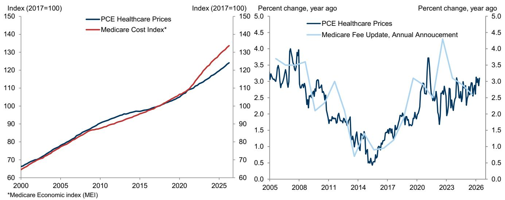  
Source: GS Global Investment Research, Department of Commerce, Department of Health and Human Services

## Broader Inflation Risk

Our indicators of persistent inflation risk and pipeline inflation pressures suggest that underlying inflation risk rose slightly in recent months but remains modest. Exhibit 10 shows that our measure of pipeline pressures based on the signal from the PPIs accelerated in recent months, but most of this reflected price increases in energy and related products.

Exhibit 10: Our Tool for Tracking Input Cost Pressures Across the Supply Chain Accelerated Somewhat in Recent Months, but This Largely Reflected Energy Passthrough

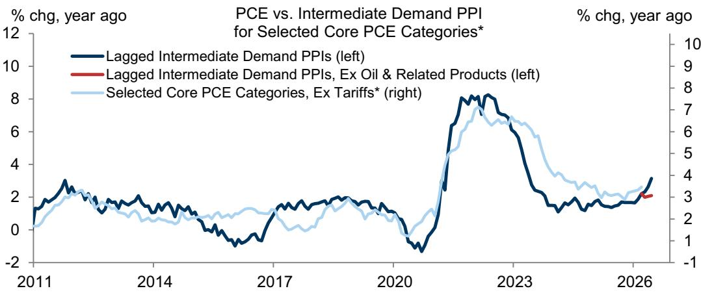  
\* Sports and recreational vehicles, household appliances, clothing and footwear, pets and related products, food services, and other services.  
Note: We adjust both the PCE series and our intermediate demand PPIs for our estimates of the indirect effect of tariffs on input prices across the supply chain.  
Source: GS Global Investment Research, Department of Labor

Exhibit 11 shows our persistent inflation risk indicator, which combines key signals including slack and wage pressures, medium- and long-term inflation expectations, and the breadth of inflation. Our indicator suggests that persistent inflation risk has increased somewhat in recent months but remains broadly in line with its 2000s level and significantly below the aftermath of the pandemic.

Exhibit 11: Our Persistent Inflation Risk Indicator Ticked Up Somewhat in Recent Months but Remains Broadly in Line With Its Post-1995 Average

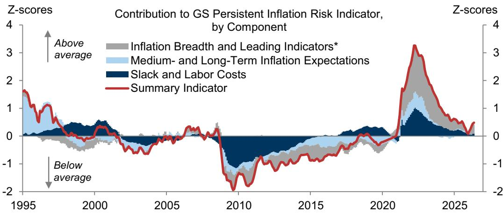  
Note: We exclude our estimates of the effects of tariffs on each PCE category, as well as the computer software and accessories component (see "US Economics Analyst: AI and (Measured) Inflation: Up Then Down," May 2026).  
Source: GS Global Investment Research

## The Inflation Outlook

We forecast year-over-year core PCE inflation of $3.2\%$ in December 2026, as last year's tariff boost fades but AI and oil-related pressures keep inflation elevated (left side of

Exhibit 12). We then expect core PCE inflation to slow to 2.2% by December 2027 as the energy and AI effects wane. In the near term, we expect strong increases in equity prices to boost monthly core PCE inflation by about 0.10pp in May and 0.05pp in June. We expect core CPI to slow to 2.6% year-over-year by December 2026 and 2.2% by December 2027, as it is less affected by AI measurement issues and financial services pressures (right side of Exhibit 12).

We see risks to our forecast skewed to the upside, particularly if the situation in the Middle East deteriorates or if higher inflation expectations cause businesses to raise prices beyond the increase in their input costs. Inflation could prove lower than we expect if shelter inflation slows more quickly than we assume, oil prices fall by more than we expect, or the AI-related memory crunch resolves faster than we anticipate.

Exhibit 12: We Expect Energy Price Passthrough, AI-Related Pressure, and the Stock Market Boom to Keep Year-over-Year Core PCE Inflation at 3.2% in December 2026, Even as Core CPI Inflation Slows to 2.6%; We Expect Both PCE and CPI Inflation to Be Close to 2% by December 2027  
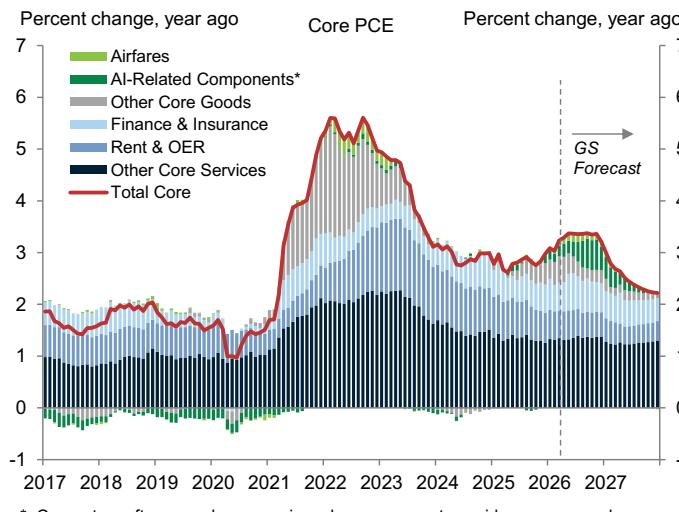  
\* Computer software and accessories, phones, computers, video games, and electricity input costs.

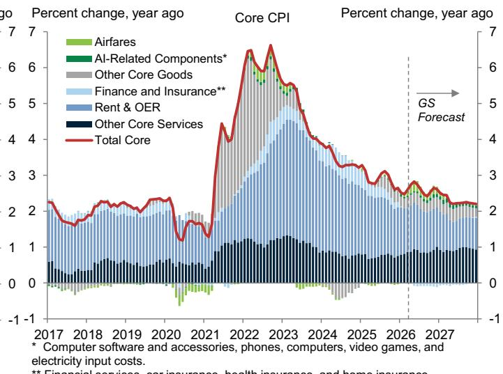  
\*\* Financial services, car insurance, health insurance, and home insurance.  
Source: GS Global Investment Research, Department of Commerce, Department of Labor

Appendix

<table><tr><td rowspan="3"></td><td rowspan="3">Weight</td><td colspan="5">GS Bottom-up Core PCE Model</td></tr><tr><td>May 2026*</td><td colspan="2">Dec. 2026</td><td colspan="2">Dec. 2027</td></tr><tr><td>YoY</td><td>YoY</td><td>Contribution to Change</td><td>YoY</td><td>Contribution to Change</td></tr><tr><td>Core PCE</td><td>100.0</td><td>3.4</td><td>3.2</td><td>-0.2</td><td>2.2</td><td>-1.2</td></tr><tr><td>Core Goods</td><td>24.4</td><td>2.4</td><td>2.7</td><td>0.1</td><td>0.2</td><td>-0.5</td></tr><tr><td>New Vehicles</td><td>2.1</td><td>0.3</td><td>0.1</td><td>0.0</td><td>0.0</td><td>0.0</td></tr><tr><td>Used Vehicles</td><td>1.2</td><td>-2.2</td><td>-2.1</td><td>0.0</td><td>-0.4</td><td>0.0</td></tr><tr><td>Household Appliances</td><td>0.5</td><td>-1.1</td><td>1.2</td><td>0.0</td><td>-1.2</td><td>0.0</td></tr><tr><td>Video, Audio, Computers</td><td>2.4</td><td>8.3</td><td>16.1</td><td>0.2</td><td>-0.7</td><td>-0.2</td></tr><tr><td>Recreational Vehicles</td><td>0.5</td><td>3.7</td><td>1.7</td><td>0.0</td><td>2.1</td><td>0.0</td></tr><tr><td>Jewelry, Watches</td><td>0.6</td><td>16.7</td><td>15.1</td><td>0.0</td><td>0.8</td><td>-0.1</td></tr><tr><td>Clothing &amp; Footwear</td><td>3.0</td><td>4.2</td><td>5.0</td><td>0.0</td><td>2.3</td><td>-0.1</td></tr><tr><td>Pharma &amp; Medical</td><td>3.8</td><td>-2.2</td><td>-2.2</td><td>0.0</td><td>0.1</td><td>0.1</td></tr><tr><td>Pets Products</td><td>0.6</td><td>1.5</td><td>2.2</td><td>0.0</td><td>0.3</td><td>0.0</td></tr><tr><td>Expenditures Abroad</td><td>0.1</td><td>5.7</td><td>3.4</td><td>0.0</td><td>1.4</td><td>0.0</td></tr><tr><td>Residual Core Goods</td><td>9.6</td><td>2.8</td><td>1.6</td><td>-0.1</td><td>-0.1</td><td>-0.3</td></tr><tr><td>Core goods ex. autos</td><td>21.1</td><td>3.0</td><td>3.4</td><td>0.1</td><td>0.3</td><td>-0.6</td></tr><tr><td>Core Services</td><td>75.6</td><td>3.7</td><td>3.4</td><td>-0.2</td><td>2.9</td><td>-0.6</td></tr><tr><td>Housing</td><td>17.5</td><td>3.2</td><td>2.7</td><td>-0.1</td><td>2.2</td><td>-0.2</td></tr><tr><td>Ground Transportation</td><td>0.6</td><td>0.9</td><td>9.7</td><td>0.1</td><td>-0.2</td><td>0.0</td></tr><tr><td>Air Transportation</td><td>1.1</td><td>13.9</td><td>9.8</td><td>0.0</td><td>-2.3</td><td>-0.2</td></tr><tr><td>Food Services &amp; Accommodation</td><td>7.9</td><td>3.7</td><td>4.3</td><td>0.0</td><td>3.7</td><td>0.0</td></tr><tr><td>Financial Services &amp; Insurance</td><td>9.3</td><td>7.9</td><td>6.2</td><td>-0.2</td><td>4.9</td><td>-0.3</td></tr><tr><td>Medical Services</td><td>18.9</td><td>3.1</td><td>2.9</td><td>0.0</td><td>2.9</td><td>0.0</td></tr><tr><td>Foreign Travel</td><td>1.5</td><td>-1.2</td><td>3.2</td><td>0.1</td><td>2.9</td><td>0.1</td></tr><tr><td>Residual Core Services</td><td>18.8</td><td>2.6</td><td>2.2</td><td>-0.1</td><td>2.5</td><td>0.0</td></tr><tr><td>Core services ex. housing</td><td>58.1</td><td>3.8</td><td>3.6</td><td>-0.1</td><td>3.1</td><td>-0.4</td></tr></table>

\* GS tracking based on May CPI, PPI, and import prices.  
Source: GS Global Investment Research, Department of Commerce

\* Weighted average of metro-level HPIs for 381 metro cities where the weights are dollar values of housing stock reported in the American Community Survey. Annual numbers are Q4/Q4.
\*\* Annual inflation numbers are December year-on-year values. Quarterly values are Q4/Q4.

Source: GS Global Investment Research.

## The US Economic and Financial Outlook

<table><tr><td rowspan="2"></td><td rowspan="2">2023</td><td rowspan="2">2024</td><td rowspan="2">2025</td><td rowspan="2">2026</td><td rowspan="2">2027</td><td rowspan="2">2025Q4</td><td colspan="4">2026</td><td colspan="4">2027</td></tr><tr><td>Q1</td><td>Q2</td><td>Q3</td><td>Q4</td><td>Q1</td><td>Q2</td><td>Q3</td><td>Q4</td></tr><tr><td colspan="15">OUTPUT AND SPENDING</td></tr><tr><td>Real GDP</td><td>2.9</td><td>2.8</td><td>2.1</td><td>2.1</td><td>2.2</td><td>0.5</td><td>1.6</td><td>2.6</td><td>2.0</td><td>2.0</td><td>2.1</td><td>2.2</td><td>2.3</td><td>2.3</td></tr><tr><td>Real GDP (annual=Q4/Q4, quarterly=yoy)</td><td>3.4</td><td>2.4</td><td>2.0</td><td>2.1</td><td>2.2</td><td>2.0</td><td>2.6</td><td>2.3</td><td>1.7</td><td>2.1</td><td>2.2</td><td>2.1</td><td>2.2</td><td>2.2</td></tr><tr><td>Consumer Expenditures</td><td>2.6</td><td>2.9</td><td>2.6</td><td>1.9</td><td>1.8</td><td>1.9</td><td>1.4</td><td>1.9</td><td>1.5</td><td>1.5</td><td>1.9</td><td>2.0</td><td>2.1</td><td>2.2</td></tr><tr><td>Residential Fixed Investment</td><td>-7.8</td><td>3.2</td><td>-2.2</td><td>-3.9</td><td>1.5</td><td>-1.7</td><td>-6.3</td><td>-5.6</td><td>1.5</td><td>1.5</td><td>2.2</td><td>2.2</td><td>2.2</td><td>2.2</td></tr><tr><td>Business Fixed Investment</td><td>7.3</td><td>2.9</td><td>4.1</td><td>6.5</td><td>5.8</td><td>2.4</td><td>10.1</td><td>7.3</td><td>7.5</td><td>6.9</td><td>4.9</td><td>4.9</td><td>4.9</td><td>4.9</td></tr><tr><td>Structures</td><td>16.7</td><td>1.1</td><td>-5.3</td><td>-3.8</td><td>2.0</td><td>-6.6</td><td>-5.4</td><td>0.4</td><td>-1.0</td><td>-0.2</td><td>3.5</td><td>3.5</td><td>3.5</td><td>3.5</td></tr><tr><td>Equipment</td><td>2.9</td><td>3.5</td><td>8.3</td><td>10.7</td><td>7.0</td><td>4.3</td><td>17.2</td><td>13.2</td><td>11.0</td><td>9.5</td><td>5.0</td><td>5.0</td><td>5.0</td><td>5.0</td></tr><tr><td>Intellectual Property Products</td><td>6.2</td><td>3.5</td><td>5.6</td><td>7.9</td><td>6.2</td><td>5.4</td><td>11.6</td><td>5.0</td><td>8.2</td><td>7.8</td><td>5.5</td><td>5.5</td><td>5.5</td><td>5.5</td></tr><tr><td>Federal Government</td><td>3.3</td><td>3.8</td><td>-1.2</td><td>-1.5</td><td>0.7</td><td>-16.7</td><td>9.5</td><td>-3.0</td><td>1.0</td><td>1.0</td><td>1.0</td><td>1.0</td><td>1.0</td><td>1.0</td></tr><tr><td>State &amp; Local Government</td><td>3.6</td><td>3.8</td><td>2.5</td><td>1.4</td><td>0.9</td><td>1.5</td><td>1.5</td><td>0.8</td><td>0.5</td><td>1.0</td><td>1.0</td><td>1.0</td><td>1.0</td><td>1.0</td></tr><tr><td>Net Exports ($bn, &#x27;17)</td><td>-925</td><td>-1,033</td><td>-1,091</td><td>-1,102</td><td>-1,178</td><td>-969</td><td>-1,064</td><td>-1,090</td><td>-1,117</td><td>-1,139</td><td>-1,154</td><td>-1,170</td><td>-1,186</td><td>-1,202</td></tr><tr><td>Inventory Investment ($bn, &#x27;17)</td><td>47</td><td>44</td><td>29</td><td>26</td><td>61</td><td>-16</td><td>-26</td><td>35</td><td>45</td><td>50</td><td>55</td><td>60</td><td>65</td><td>65</td></tr><tr><td>Nominal GDP</td><td>6.7</td><td>5.3</td><td>5.0</td><td>6.1</td><td>5.0</td><td>4.2</td><td>5.2</td><td>9.3</td><td>4.7</td><td>4.5</td><td>4.8</td><td>4.8</td><td>4.6</td><td>4.4</td></tr><tr><td>Industrial Production, Mfg.</td><td>-1.0</td><td>-1.0</td><td>0.8</td><td>3.6</td><td>4.0</td><td>-3.4</td><td>5.3</td><td>8.6</td><td>5.2</td><td>4.1</td><td>3.4</td><td>3.3</td><td>3.3</td><td>3.3</td></tr><tr><td colspan="15">HOUSING MARKET</td></tr><tr><td>Housing Starts (units, thous)</td><td>1,421</td><td>1,370</td><td>1,356</td><td>1,319</td><td>1,322</td><td>1,323</td><td>1,413</td><td>1,290</td><td>1,280</td><td>1,292</td><td>1,304</td><td>1,316</td><td>1,328</td><td>1,340</td></tr><tr><td>New Home Sales (units, thous)</td><td>666</td><td>684</td><td>679</td><td>654</td><td>644</td><td>711</td><td>627</td><td>690</td><td>662</td><td>638</td><td>626</td><td>632</td><td>649</td><td>670</td></tr><tr><td>Existing Home Sales (units, thous)</td><td>4,103</td><td>4,067</td><td>4,076</td><td>4,095</td><td>4,254</td><td>4,157</td><td>4,053</td><td>4,073</td><td>4,107</td><td>4,149</td><td>4,191</td><td>4,233</td><td>4,275</td><td>4,317</td></tr><tr><td>Case-Shiller Home Prices (%yoy)*</td><td>5.3</td><td>3.8</td><td>0.7</td><td>0.7</td><td>2.2</td><td>0.7</td><td>0.3</td><td>0.8</td><td>0.7</td><td>0.7</td><td>1.1</td><td>1.4</td><td>1.8</td><td>2.2</td></tr><tr><td colspan="15">INFLATION (% ch, yr/yr)</td></tr><tr><td>Consumer Price Index (CPI)**</td><td>3.3</td><td>2.9</td><td>2.7</td><td>3.3</td><td>2.2</td><td>2.7</td><td>2.7</td><td>3.9</td><td>3.4</td><td>3.3</td><td>3.0</td><td>2.0</td><td>2.2</td><td>2.2</td></tr><tr><td>Core CPI **</td><td>3.9</td><td>3.2</td><td>2.6</td><td>2.6</td><td>2.2</td><td>2.7</td><td>2.5</td><td>2.8</td><td>2.5</td><td>2.6</td><td>2.5</td><td>2.2</td><td>2.2</td><td>2.2</td></tr><tr><td>Core PCE** †</td><td>3.1</td><td>3.0</td><td>3.0</td><td>3.2</td><td>2.2</td><td>2.9</td><td>3.1</td><td>3.3</td><td>3.4</td><td>3.3</td><td>2.8</td><td>2.5</td><td>2.3</td><td>2.2</td></tr><tr><td colspan="15">LABOR MARKET</td></tr><tr><td>Unemployment Rate (%)^</td><td>3.8</td><td>4.1</td><td>4.4</td><td>4.4</td><td>4.3</td><td>4.4</td><td>4.3</td><td>4.3</td><td>4.3</td><td>4.4</td><td>4.4</td><td>4.4</td><td>4.3</td><td>4.3</td></tr><tr><td>U6 Underemployment Rate (%)^</td><td>7.2</td><td>7.6</td><td>8.4</td><td>8.2</td><td>8.1</td><td>8.4</td><td>8.0</td><td>8.1</td><td>8.2</td><td>8.2</td><td>8.2</td><td>8.2</td><td>8.1</td><td>8.1</td></tr><tr><td>Payrolls (thous, monthly rate)</td><td>210</td><td>122</td><td>10</td><td>72</td><td>50</td><td>-39</td><td>73</td><td>130</td><td>40</td><td>45</td><td>50</td><td>50</td><td>50</td><td>50</td></tr><tr><td>Employment-Population Ratio (%)^</td><td>60.1</td><td>59.9</td><td>59.7</td><td>59.1</td><td>59.0</td><td>59.7</td><td>59.2</td><td>59.2</td><td>59.1</td><td>59.1</td><td>59.0</td><td>59.0</td><td>59.0</td><td>59.0</td></tr><tr><td>Labor Force Participation Rate (%)^</td><td>62.5</td><td>62.5</td><td>62.4</td><td>61.8</td><td>61.6</td><td>62.4</td><td>61.9</td><td>61.8</td><td>61.8</td><td>61.8</td><td>61.7</td><td>61.7</td><td>61.7</td><td>61.6</td></tr><tr><td>Average Hourly Earnings (%yoy)</td><td>4.4</td><td>3.9</td><td>4.0</td><td>3.9</td><td>3.8</td><td>4.0</td><td>4.0</td><td>4.0</td><td>3.9</td><td>3.8</td><td>3.8</td><td>3.8</td><td>3.8</td><td>3.8</td></tr><tr><td colspan="15">GOVERNMENT FINANCE</td></tr><tr><td>Federal Budget (FY, $bn)</td><td>-1,694</td><td>-1,833</td><td>-1,775</td><td>-1,950</td><td>-2,050</td><td>--</td><td>--</td><td>--</td><td>--</td><td>--</td><td>--</td><td>--</td><td>--</td><td>--</td></tr><tr><td colspan="15">FINANCIAL INDICATORS</td></tr><tr><td>FF Target Range (Bottom-Top, %)^</td><td>5.25-5.5</td><td>4.25-4.5</td><td>3.5-3.75</td><td>3.5-3.75</td><td>3-3.25</td><td>3.5-3.75</td><td>3.5-3.75</td><td>3.5-3.75</td><td>3.5-3.75</td><td>3.5-3.75</td><td>3.5-3.75</td><td>3.25-3.5</td><td>3.25-3.5</td><td>3-3.25</td></tr><tr><td>10-Year Treasury Note^</td><td>3.88</td><td>4.58</td><td>4.18</td><td>4.40</td><td>4.25</td><td>4.18</td><td>4.30</td><td>4.50</td><td>4.45</td><td>4.40</td><td>4.35</td><td>4.30</td><td>4.25</td><td>4.25</td></tr><tr><td>Euro (€/$)^</td><td>1.11</td><td>1.04</td><td>1.17</td><td>1.18</td><td>1.20</td><td>1.17</td><td>1.15</td><td>1.16</td><td>1.19</td><td>1.18</td><td>1.19</td><td>1.20</td><td>1.20</td><td>1.20</td></tr><tr><td>Yen ($/¥)^</td><td>141</td><td>157</td><td>157</td><td>158</td><td>141</td><td>157</td><td>159</td><td>158</td><td>158</td><td>158</td><td>156</td><td>141</td><td>101</td><td>141</td></tr></table>

† PCE = Personal consumption expenditures. ^ Denotes end of period.  
Note: Published figures in bold.

Source: GS Global Investment Research

## The US Economics Team

## Jan Hatzius

+1(212)902-0394
jan.hatzius@gs.com
GS & Co. LLC

## Ronnie Walker

+1(917)343-4543
ronnie.walker@gs.com
GS & Co. LLC

## Pierfrancesco Mei

+1(212)902-8809
pierfrancesco.mei@gs.com
GS & Co. LLC

## Alec Phillips

+1(202)637-3746
alec.phillips@gs.com
GS & Co. LLC

## Manuel Abecasis

+1(212)902-8357
manuel.abecasis@gs.com
GS & Co. LLC

## Jessica Rindels

+1(972)368-1516
jessica.rindels@gs.com
GS & Co. LLC

## David Mericle

+1(212)357-2619
david.mericle@gs.com
GS & Co. LLC

Elsie Peng
+1(212)357-3137
elsie.peng@gs.com
GS & Co. LLC

## Disclosure Appendix

## Reg AC

I, Manuel Abecasis, hereby certify that all of the views expressed in this report accurately reflect my personal views, which have not been influenced by considerations of the firm's business or client relationships.

Unless otherwise stated, the individuals listed on the cover page of this report are analysts in GS' Global Investment Research division.

Contributing Authors: Manuel Abecasis GS & Co. LLC.

Unless otherwise stated, the individuals listed in the Contributing Authors disclosure of this report are analysts in GS' Global Investment Research division.

## Disclosures

## Regulatory disclosures

## Disclosures required by United States laws and regulations

See company-specific regulatory disclosures above for any of the following disclosures required as to companies referred to in this report: manager or co-manager in a pending transaction; 1% or other ownership; compensation for certain services; types of client relationships; managed/co-managed public offerings in prior periods; directorships; for equity securities, market making and/or specialist role. GS trades or may trade as a principal in debt securities (or in related derivatives) of issuers discussed in this report.

The following are additional required disclosures: Ownership and material conflicts of interest: GS policy prohibits its analysts, professionals reporting to analysts and members of their households from owning securities of any company in the analyst's area of coverage. Analyst compensation: Analysts are paid in part based on the profitability of GS, which includes investment banking revenues. Analyst as officer or director: GS policy generally prohibits its analysts, persons reporting to analysts or members of their households from serving as an officer, director or advisor of any company in the analyst's area of coverage. Non-U.S. Analysts: Non-U.S. analysts may not be associated persons of GS & Co. LLC and therefore may not be subject to FINRA Rule 2241 or FINRA Rule 2242 restrictions on communications with a subject company, public appearances and trading in securities covered by the analysts.

## Additional disclosures required under the laws and regulations of jurisdictions other than the United States

Additional disclosures required under the laws and regulations of jurisdictions other than the United States

The following disclosures are those required by the jurisdiction indicated, except to the extent already made above pursuant to United States laws and regulations. Australia: GS Australia Pty Ltd and its affiliates are not authorised deposit-taking institutions (as that term is defined in the Banking Act 1959 (Cth)) in Australia and do not provide banking services, nor carry on a banking business, in Australia. This research, and any access to it, is intended only for “wholesale clients” within the meaning of the Australian Corporations Act, unless otherwise agreed by GS. In producing research reports, members of Global Investment Research of GS Australia may attend site visits and other meetings hosted by the companies and other entities which are the subject of its research reports. In some instances the costs of such site visits or meetings may be met in part or in whole by the issuers concerned if GS Australia considers it is appropriate and reasonable in the specific circumstances relating to the site visit or meeting. To the extent that the contents of this document contains any financial product advice, it is general advice only and has been prepared by GS without taking into account a client’s objectives, financial situation or needs. A client should, before acting on any such advice, consider the appropriateness of the advice having regard to the client’s own objectives, financial situation and needs. A copy of certain GS Australia and New Zealand disclosure of interests and a copy of GS’ Australian Sell-Side Research Independence Policy Statement are available at: https://www.goldmansachs.com/disclosures/australia-new-zealand/index.html. Brazil: Disclosure information in relation to CVM Resolution n. 20 is available at https://www.gs.com/worldwide/brazil/area/gir/index.html. Where applicable, the Brazil-registered analyst primarily responsible for the content of this research report, as defined in Article 20 of CVM Resolution n. 20, is the first author named at the beginning of this report, unless indicated otherwise at the end of the text. Canada: This information is being provided to you for information purposes only and is not, and under no circumstances should be construed as, an advertisement, offering or solicitation by GS & Co. LLC for purchasers of securities in Canada to trade in any Canadian security. GS & Co. LLC is not registered as a dealer in any jurisdiction in Canada under applicable Canadian securities laws and generally is not permitted to trade in Canadian securities and may be prohibited from selling certain securities and products in certain jurisdictions in Canada. If you wish to trade in any Canadian securities or other products in Canada please contact GS Canada Inc., an affiliate of The GS Group Inc., or another registered Canadian dealer. Hong Kong: Further information on the securities of covered companies referred to in this research may be obtained on request from GS (Asia) L.L.C. India: Further information on the subject company or companies referred to in this research may be obtained from GS (India) Securities Private Limited, Research Analyst - SEBI Registration Number INH000001493, 10th Floor, Ascent-Worli, Sudam Kalu Ahire Marg, Worli, Mumbai-400 025, India, Corporate Identity Number U74140MH2006FTC160634, Phone +91 22 6616 9000, Fax +91 22 6616 9001. GS may beneficially own 1% or more of the securities (as such term is defined in clause 2 (h) the Indian Securities Contracts (Regulation) Act, 1956) of the subject company or companies referred to in this research report. Investment in securities market are subject to market risks. Read all the related documents carefully before investing. Registration granted by SEBI and certification from NISM in no way guarantee performance of the intermediary or provide any assurance of returns to investors. GS (India) Securities Private Limited compliance officer and investor grievance contact details can be found at: https://www.goldmansachs.com/worldwide/india/documents/Grievance-Redressal-and-Escalation-Matrix.pdf, and a copy of the annual audit compliance report can be found at this link: https://publishing.gs.com/content/site/india-annual-compliance-report.html. Japan: See below. Korea: This research, and any access to it, is intended only for “professional investors” within the meaning of the Financial Services and Capital Markets Act, unless otherwise agreed by GS. Further information on the subject company or companies referred to in this research may be obtained from GS (Asia) L.L.C., Seoul Branch. New Zealand: GS New Zealand Limited and its affiliates are neither “registered banks” nor “deposit takers” (as defined in the Reserve Bank of New Zealand Act 1989) in New Zealand. This research, and any access to it, is intended for “wholesale clients” (as defined in the Financial Advisers Act 2008) unless otherwise agreed by GS. A copy of certain GS Australia and New Zealand disclosure of interests is available at: https://www.goldmansachs.com/disclosures/australia-new-zealand/index.html.

Russia: Research reports distributed in the Russian Federation are not advertising as defined in the Russian legislation, but are information and analysis not having product promotion as their main purpose and do not provide appraisal within the meaning of the Russian legislation on appraisal activity. Research reports do not constitute a personalized investment recommendation as defined in Russian laws and regulations, are not addressed to a specific client, and are prepared without analyzing the financial circumstances, investment profiles or risk profiles of clients. GS assumes no responsibility for any investment decisions that may be taken by a client or any other person based on this research report. Singapore: GS (Singapore) Pte. (Company Number: 198602165W), which is regulated by the Monetary Authority of Singapore, accepts legal responsibility for this research, and should be contacted with respect to any matters arising from, or in connection with, this research. Taiwan: This material is for reference only and must not be reprinted without permission. Investors should carefully consider their own investment risk. Investment results are the responsibility of the individual investor. United Kingdom: Persons who would be categorized as retail clients in the United Kingdom, as such term is defined in the rules of the Financial Conduct Authority, should read this research in conjunction with prior GS on the covered

companies referred to herein and should refer to the risk warnings that have been sent to them by GS International. A copy of these risks warnings, and a glossary of certain financial terms used in this report, are available from GS International on request.

European Union and United Kingdom: Disclosure information in relation to Article 6 (2) of the European Commission Delegated Regulation (EU) (2016/958) supplementing Regulation (EU) No 596/2014 of the European Parliament and of the Council (including as that Delegated Regulation is implemented into United Kingdom domestic law and regulation following the United Kingdom's departure from the European Union and the European Economic Area) with regard to regulatory technical standards for the technical arrangements for objective presentation of investment recommendations or other information recommending or suggesting an investment strategy and for disclosure of particular interests or indications of conflicts of interest is available at https://www.gs.com/disclosures/europeanpolicy.html which states the European Policy for Managing Conflicts of Interest in Connection with Investment Research.

Japan: GS Japan Co., Ltd. is a Financial Instrument Dealer registered with the Kanto Financial Bureau under registration number Kinsho 69, and a member of Japan Securities Dealers Association, Financial Futures Association of Japan Type II Financial Instruments Firms Association, and Investment Management Association of Japan. Sales and purchase of equities are subject to commission pre-determined with clients plus consumption tax. See company-specific disclosures as to any applicable disclosures required by Japanese stock exchanges, the Japanese Securities Dealers Association or the Japanese Securities Finance Company.

## Global product; distributing entities

GS Global Investment Research produces and distributes research products for clients of GS on a global basis. Analysts based in GS offices around the world produce research on industries and companies, and research on macroeconomics, currencies, commodities and portfolio strategy. This research is disseminated in Australia by GS Australia Pty Ltd (ABN 21 006 797 897); in Brazil by GS do Brasil Corretora de Títulos e Valores Mobiliários S.A.; Public Communication Channel GS Brazil: 0800 727 5764 and / or contatogoldmanbrasil@gs.com. Available Weekdays (except holidays), from 9am to 6pm. Canal de Comunicação com o Público GS Brasil: 0800 727 5764 e/ou contatogoldmanbrasil@gs.com. Horário de funcionamento: segunda-feira à sexta-feira (exceto feriados), das 9h às 18h; in Canada by GS & Co. LLC; in Hong Kong by GS (Asia) L.L.C.; in India by GS (India) Securities Private Ltd.; in Japan by GS Japan Co., Ltd.; in the Republic of Korea by GS (Asia) L.L.C., Seoul Branch; in New Zealand by GS New Zealand Limited; in Russia by OOO GS; in Singapore by GS (Singapore) Pte. (Company Number: 198602165W); and in the United States of America by GS & Co. LLC. GS International has approved this research in connection with its distribution in the United Kingdom.

GS International (“GSI”), authorised by the Prudential Regulation Authority (“PRA”) and regulated by the Financial Conduct Authority (“FCA”) and the PRA, has approved this research in connection with its distribution in the United Kingdom.

European Economic Area: GS Bank Europe SE (“GSBE”) is a credit institution incorporated in Germany and, within the Single Supervisory Mechanism, subject to direct prudential supervision by the European Central Bank and in other respects supervised by German Federal Financial Supervisory Authority (Bundesanstalt für Finanzdienstleistungsaufsicht, BaFin) and Deutsche Bundesbank and disseminates research within the European Economic Area.

## General disclosures

This research is for our clients only. Other than disclosures relating to GS, this research is based on current public information that we consider reliable, but we do not represent it is accurate or complete, and it should not be relied on as such. The information, opinions, estimates and forecasts contained herein are as of the date hereof and are subject to change without prior notification. We seek to update our research as appropriate, but various regulations may prevent us from doing so. Other than certain industry reports published on a periodic basis, the large majority of reports are published at irregular intervals as appropriate in the analyst's judgment.

GS conducts a global full-service, integrated investment banking, investment management, and brokerage business. We have investment banking and other business relationships with a substantial percentage of the companies covered by Global Investment Research. GS & Co. LLC, the United States broker dealer, is a member of SIPC (https://www.sipc.org).

Our salespeople, traders, and other professionals may provide oral or written market commentary or trading strategies to our clients and principal trading desks that reflect opinions that are contrary to the opinions expressed in this research. Our asset management area, principal trading desks and investing businesses may make investment decisions that are inconsistent with the recommendations or views expressed in this research.

We and our affiliates, officers, directors, and employees will from time to time have long or short positions in, act as principal in, and buy or sell, the securities or derivatives, if any, referred to in this research, unless otherwise prohibited by regulation or GS policy.

The views attributed to third party presenters at GS arranged conferences, including individuals from other parts of GS, do not necessarily reflect those of Global Investment Research and are not an official view of GS.

Any third party referenced herein, including any salespeople, traders and other professionals or members of their household, may have positions in the products mentioned that are inconsistent with the views expressed by analysts named in this report.

This research is focused on investment themes across markets, industries and sectors. It does not attempt to distinguish between the prospects or performance of, or provide analysis of, individual companies within any industry or sector we describe.

Any trading recommendation in this research relating to an equity or credit security or securities within an industry or sector is reflective of the investment theme being discussed and is not a recommendation of any such security in isolation.

This research is not an offer to sell or the solicitation of an offer to buy any security in any jurisdiction where such an offer or solicitation would be illegal. It does not constitute a personal recommendation or take into account the particular investment objectives, financial situations, or needs of individual clients. Clients should consider whether any advice or recommendation in this research is suitable for their particular circumstances and, if appropriate, seek professional advice, including tax advice. The price and value of investments referred to in this research and the income from them may fluctuate. Past performance is not a guide to future performance, future returns are not guaranteed, and a loss of original capital may occur. Fluctuations in exchange rates could have adverse effects on the value or price of, or income derived from, certain investments.

Certain transactions, including those involving futures, options, and other derivatives, give rise to substantial risk and are not suitable for all investors. Investors should review current options and futures disclosure documents which are available from GS sales representatives or at https://www.theocc.com/about/publications/character-risks.jsp and https://www.goldmansachs.com/disclosures/cftc\_fcm\_disclosures. Transaction costs may be significant in option strategies calling for multiple purchase and sales of options such as spreads. Supporting documentation will be supplied upon request.

Differing Levels of Service provided by Global Investment Research: The level and types of services provided to you by GS Global Investment Research may vary as compared to that provided to internal and other external clients of GS, depending on various factors including your individual preferences as to the frequency and manner of receiving communication, your risk profile and investment focus and perspective (e.g.,

marketwide, sector specific, long term, short term), the size and scope of your overall client relationship with GS, and legal and regulatory constraints. As an example, certain clients may request to receive notifications when research on specific securities is published, and certain clients may request that specific data underlying analysts' fundamental analysis available on our internal client websites be delivered to them electronically through data feeds or otherwise. No change to an analyst's fundamental research views (e.g., ratings, price targets, or material changes to earnings estimates for equity securities), will be communicated to any client prior to inclusion of such information in a research report broadly disseminated through electronic publication to our internal client websites or through other means, as necessary, to all clients who are entitled to receive such reports.

All research reports are disseminated and available to all clients simultaneously through electronic publication to our internal client websites. Not all research content is redistributed to our clients or available to third-party aggregators, nor is GS responsible for the redistribution of our research by third party aggregators. For research, models or other data related to one or more securities, markets or asset classes (including related services) that may be available to you, please contact your GS representative or go to https://research.gs.com.

Disclosure information is also available at https://www.gs.com/research/hedge.html or from Research Compliance, 200 West Street, New York, NY 10282.

## © 2026 GS.

You are permitted to store, display, analyze, modify, reformat, and print the information made available to you via this service only for your own use. You may not resell or reverse engineer this information to calculate or develop any index for disclosure and/or marketing or create any other derivative works or commercial product(s), data or offering(s) without the express written consent of GS. You are not permitted to publish, transmit, or otherwise reproduce this information, in whole or in part, in any format to any third party without the express written consent of GS. This foregoing restriction includes, without limitation, using, extracting, downloading or retrieving this information, in whole or in part, to train or finetune a machine learning or artificial intelligence system, or to provide or reproduce this information, in whole or in part, as a prompt or input to any such system.