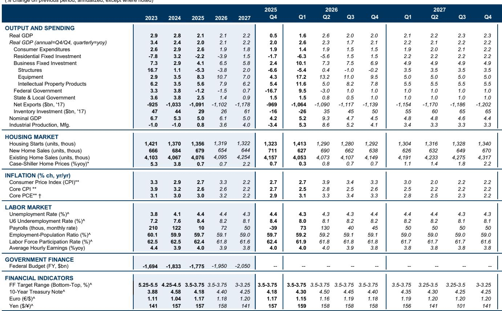
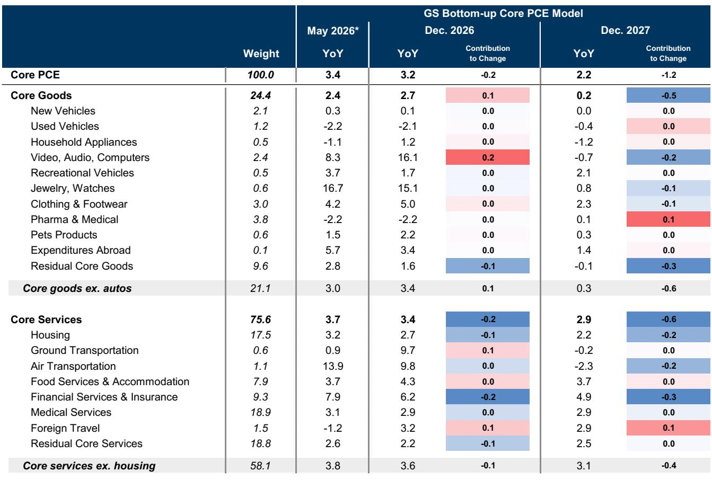
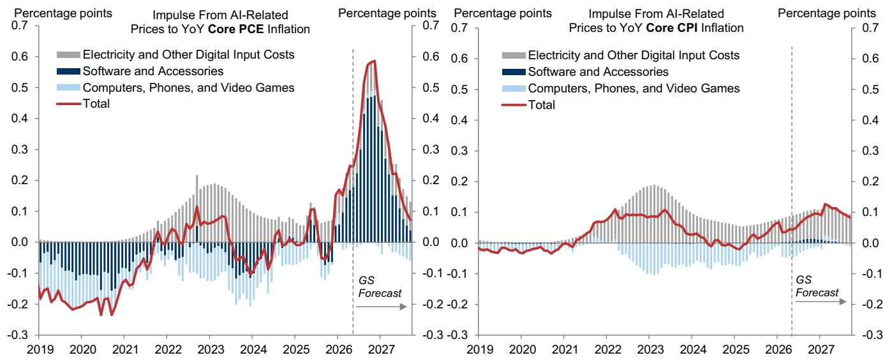

# The Inflation Narrative Has Shifted: The Old Disinflation Playbook No Longer Applies, and Investors Must Navigate a Three-Front Battle

For much of the past two years, the dominant narrative in US macroeconomics was straightforward: the post-pandemic inflation spike was fading, and the Federal Reserve was on a gradual path toward normalization. That narrative is now outdated. The data from the first half of this year reveals a more complex and structurally different inflation environment—one where the traditional drivers of disinflation (cooling rents, slower wage growth) are being offset by entirely new forces that have little to do with the post-pandemic recovery cycle.

The core Personal Consumption Expenditures (PCE) price index has reaccelerated in recent months, and the composition of that reacceleration matters far more than the headline number itself. This is not a repeat of 2021-2022. Instead, we are witnessing a three-front battle: energy price passthrough from geopolitical disruptions, a distinct and measurable inflationary impulse from the artificial intelligence infrastructure buildout, and the lingering effects of financial conditions transmitted through equity market gains. Meanwhile, the disinflationary forces from housing and labor markets remain intact but are being overwhelmed in the near term.

The critical insight for strategic decision-makers is this: the current inflation cycle is being shaped by supply-side idiosyncrasies and measurement distortions, not by broad-based demand overheating. This means the path to 2% is neither linear nor assured, but it also means that the risks of a 1970s-style wage-price spiral are low. The investment implications are profound—sector allocation, duration positioning, and currency strategy all depend on correctly parsing these crosscurrents. The report from a leading global investment bank provides the analytical framework to do so, and its findings demand a reassessment of the consensus view.

## The Geopolitical Risk Premium in Oil Has Compressed, but the Passthrough to Core Inflation Is Still Unfolding

The most significant near-term development is the reduction in upside inflation risk from energy markets, driven by the US-Iran agreement. The investment bank's commodity strategists have revised their oil price forecasts downward meaningfully: Brent crude is now expected to average $80 in the fourth quarter of 2026 and $75 in 2027, compared to previous estimates of $90 and $80, respectively. This revision alone implies approximately 0.2 percentage points less upward pressure on headline PCE inflation and 0.05 percentage points less on core PCE by year-end relative to prior assumptions.

Yet the story does not end with the headline oil price. The passthrough mechanism is more granular and persistent than many investors appreciate. The report identifies three distinct channels beyond the crude oil benchmark: the prices of non-oil Gulf exports (such as nitrogen, polyethylene, sulfur, and ammonia) have declined from war-induced peaks but remain elevated for certain products; US refined product spreads—particularly for jet fuel and gasoline—rose sharply in May, though they have partially retraced; and goods transportation costs increased more than their historical relationship with oil would suggest.

The analytical framework here is critical. The bank estimates that, taken together, commodity prices will deliver a roughly 0.4 percentage point boost to year-over-year core PCE inflation through the fourth quarter of 2026. This is not a one-time shock that quickly fades; it is a persistent headwind that will keep core inflation elevated even as other components moderate. The implication is that energy-sensitive sectors—transportation, airlines, chemicals, and logistics—face a margin squeeze that is already priced into spot markets but may not yet be fully reflected in forward earnings estimates. Investors should scrutinize whether their portfolio companies have the pricing power to pass through these costs, or whether they are absorbing them.

The open question that the report does not fully resolve is the tail risk scenario. The bank's upside scenario, where Strait of Hormuz disruptions persist through 2027, would push Brent to $130 in 2026 and average $105 in 2027, adding 1.1 percentage points to headline PCE and 0.2 percentage points to core PCE relative to baseline. This is a non-trivial risk that cannot be dismissed, and it introduces a binary element to inflation forecasting that standard econometric models struggle to capture.

## The AI Infrastructure Boom Is Creating a Measurable, Transitory Inflation Spike That Distorts the Core PCE Reading

Perhaps the most novel and underappreciated finding in the report concerns the inflationary impact of the AI buildout. This is not a theoretical or second-order effect; it is a direct, measurable price pressure that is already showing up in the data. The surge in memory chip prices—some types rose 10 to 15 times in a few months between late 2025 and early 2026—has pushed up the cost of computer software and accessories, a component of core PCE that is particularly sensitive to measurement methodology.

The mechanics are important. The "computer software and accessories" category in the PCE largely reflects memory chip costs, which have been driven by unprecedented demand from data center construction. The bank's model suggests that monthly inflation in this category will slow from approximately 4-5% in recent months to about 0.6% by the end of 2026, reflecting the recent stall in spot memory prices. However, the peak impact on year-over-year core PCE inflation is estimated at 0.6 percentage points in the second half of 2026, with a residual boost of 0.4 percentage points still present in December 2026.

The distortion is larger for PCE than for CPI, and the reason is methodological. The PCE calculation amplifies the impact of this category due to weighting and imputation issues that do not affect the CPI to the same degree. This creates a divergence between the two inflation measures that has strategic implications: market participants who focus exclusively on CPI may underestimate the persistence of elevated PCE readings, which in turn influences Fed communication and market pricing of monetary policy.

The critical strategic takeaway is that this AI-driven inflation is transitory by nature. As memory supply chains adjust and spot prices stabilize, this source of upward pressure will fade. But the timing is uncertain. The report notes that phone and computer inflation will likely remain elevated throughout 2026 as manufacturers pass through higher production costs, even as the software and accessories component slows. The net effect is a hump-shaped contribution to core inflation that peaks in the second half of 2026 and dissipates in 2027. For investors, this argues against extrapolating current core PCE readings into a permanent regime shift. The risk is that markets overreact to elevated prints in the coming quarters, mispricing the duration of this particular shock.

## The Disinflationary Engine from Housing and Labor Is Still Running, but It Is Being Masked by Temporary Factors

Beneath the surface of the reacceleration, the structural disinflationary forces that the Fed has been counting on remain intact. The report provides strong evidence that rent growth is continuing to slow, reflecting softness in new-tenant lease rates. Monthly housing inflation has been volatile—spiking in April due to the unwinding of a negative bias from the previous year's government shutdown, and remaining above trend in May, concentrated in the Northeast. The bank's assessment is that this is statistical noise, not a trend reversal. They expect housing inflation to settle at a pace roughly 1 to 1.5 percentage points below the pre-pandemic pace.

Similarly, nominal wage growth has continued to decelerate, which should put downward pressure on core non-housing services inflation (excluding airfares and portfolio management, which are driven by oil and equity prices respectively). The World Cup has temporarily boosted hotel prices, but this effect is expected to fade as the reservation window passes the tournament's end.

The one notable exception within services is healthcare. The report identifies healthcare as the last major example of "catch-up inflation," where costs have risen 26% since early 2020 compared to 18% for consumer prices overall. However, the bank expects healthcare inflation to remain around its current 3% pace—roughly 1 to 1.5 percentage points above pre-pandemic levels—as slowing wage growth for healthcare workers and a smaller Medicare fee update act as offsets. The arithmetic is telling: housing and healthcare have roughly equal weights in core PCE, so the overshoot in healthcare is expected to roughly offset the undershoot in housing, leaving their combined contribution near the pre-pandemic level.

The strategic implication is that the underlying inflation trend, stripped of AI and energy effects, is broadly consistent with the Fed's 2% target over a longer horizon. The risk is that policymakers and markets focus too heavily on the noisy headline prints and fail to recognize that the core disinflationary process is still working. This creates a potential mispricing of both the terminal rate and the timing of rate cuts.

## The Report's Forecast Implies a Tug-of-War That Leaves a Critical Analytical Gap: How Do Financial Conditions Feed Back Into Inflation?

The bank's baseline forecast is for year-over-year core PCE inflation of 3.2% in December 2026, followed by a slowdown to 2.2% by December 2027. Core CPI is expected to reach 2.6% by December 2026 and 2.2% by December 2027. The divergence between the two measures in 2026 is almost entirely attributable to the AI measurement issue and the impact of equity markets on financial services inflation.

This forecast leaves a critical analytical gap that the report does not fully address: the feedback loop between financial conditions and inflation. The report acknowledges that strong increases in lagged equity prices are expected to boost monthly core PCE inflation by 0.10 percentage points in May and 0.05 percentage points in June, driven by portfolio management fees and other financial services. But this is treated as a mechanical passthrough, not as part of a broader endogenous cycle.

The deeper question is whether the current level of equity market valuations—and the wealth effects they generate—are themselves contributing to demand-side inflation pressures that could offset the disinflation from housing and labor. If the stock market continues to rally on AI optimism and geopolitical de-escalation, the wealth effect could sustain consumption growth in a way that keeps core services inflation (outside of healthcare) from slowing as much as the model predicts. Conversely, if the market corrects, the disinflationary impulse from financial conditions could accelerate the return to 2%.

This is the most important unresolved question for investors. The report provides a detailed decomposition of supply-side drivers, but it does not fully model the demand-side consequences of the very financial conditions it describes. Readers who want to make their own assessment will need to integrate the bank's supply-side framework with their own views on equity market sustainability and consumer behavior.

## A Decision Framework for Investors: Distinguishing Between Persistent and Transitory Inflation Components

For portfolio construction and risk management, the report's analytical contribution can be distilled into a practical decision framework. Investors should separate inflation into three categories based on persistence: transitory supply shocks (AI memory chips, energy passthrough), structural disinflation (housing, wage-sensitive services), and regime-dependent factors (financial services inflation, healthcare catch-up).

The transitory components argue for short-duration positioning in inflation-sensitive assets. The AI-driven boost to PCE will fade by 2027, so long-dated inflation breakevens may be overpricing this risk. Energy passthrough is similarly time-bound, though the tail risk from geopolitical escalation requires hedging, not forecasting.

The structural disinflation from housing and labor supports a view that the Fed's terminal rate is lower than current market pricing implies. If the underlying trend in core services (ex-AI, ex-energy) is indeed consistent with 2%, then the current elevated readings are noise, and the central bank should be able to cut rates in 2027. This argues for a steepening of the yield curve and a long position in front-end rates.

The regime-dependent factors are the wild card. Healthcare inflation is sticky but bounded; financial services inflation is a direct function of equity market performance. Investors who are bullish on equities must accept that they are implicitly betting on higher measured inflation in the near term, which could delay the Fed's easing cycle. This creates a tension that the report does not resolve: you cannot simultaneously expect strong equity returns and rapid disinflation.

The most prudent approach is to hedge the tail risks. The report's upside scenario—deterioration in the Middle East or a rise in inflation expectations leading to broader price increases—would invalidate the benign base case. Investors should consider positions that benefit from a reacceleration in headline inflation, such as long positions in commodity-linked currencies or inflation swaps, even if their base case is for normalization.

## The Full Report Contains the Charts That Make This Framework Actionable

The analysis above captures the strategic logic of the report, but the full value lies in the original charts and data tables that the investment bank provides. Exhibits showing the decomposition of core PCE into AI, energy, and underlying components; the path of memory prices versus software inflation; the evolution of new-tenant rent growth; and the scenario analysis for oil prices—these are the tools that allow an investor to stress-test their own assumptions against the bank's framework.

The report also contains detailed model outputs for the persistent inflation risk indicator and the pipeline pressure index, which are not reproduced here. These indicators provide a real-time check on whether the inflation narrative is shifting from transitory to persistent. Joining the community to read the full report and review the original charts is the logical next step for any investor who wants to move beyond headlines and build a defensible inflation thesis.

The inflation debate is no longer about whether prices are rising or falling. It is about parsing the signal from the noise, distinguishing between the structural and the cyclical, and positioning for a world where the old playbook no longer applies. The report provides the map. The rest is execution.

*This article is for learning and discussion only and does not constitute investment advice.*

Personal reading notes and learning share only. Not investment advice.

