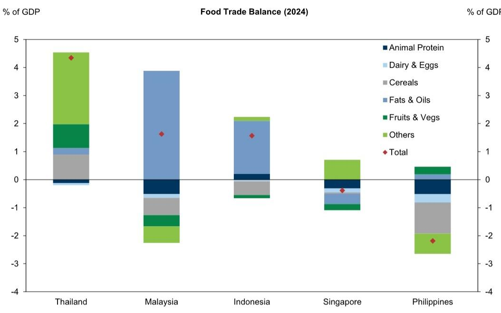
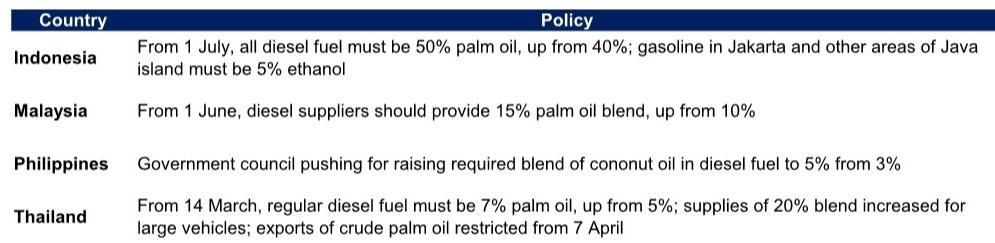
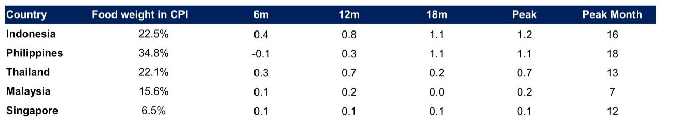

# ASEAN Food Inflation Is No Longer a Weather Bet — It Is a Structural Supply Shock That Central Banks Cannot Ignore

The conventional view that ASEAN food inflation is a cyclical nuisance driven by weather and energy pass-through is becoming dangerously outdated. A global investment bank report now quantifies what many market participants have sensed but few have modeled: the convergence of an oil price shock, a fertilizer cost surge, and a potential strong El Niño event in late 2026 could add, on average, 2.1 percentage points to ASEAN food inflation over the next twelve months. That number is not a forecast of total inflation; it is the additional impulse on top of the existing trend. For Indonesia, the Philippines, and Thailand, the peak impact on headline CPI could reach 0.7 to 1.2 percentage points. For a region where food carries between 6.5 and 34.8 percent of the CPI basket, these are not trivial numbers.

The timing matters as much as the magnitude. The oil shock from the Middle East conflict has already shown up in fuel-sensitive CPI items such as transport and airfare. The second-round effects — higher fertilizer prices feeding into farm input costs, and the potential for a strong El Niño to disrupt harvests — are still working their way through the food pipeline. This means the worst of the inflationary pressure may not have arrived yet, even as headline inflation numbers in some ASEAN economies begin to moderate. The risk is that policymakers declare victory too early, only to be blindsided by food price pressures that build with a lag.

Three shocks are colliding in a way that is historically unusual. Oil prices have risen sharply, fertilizer markets have been squeezed by disruptions to key shipping lanes, and NOAA's forecast models point to a meaningful probability of a very strong El Niño event around November 2026 to January 2027. Each of these shocks alone would be manageable. Together, they create a compound supply shock that is poorly captured by standard inflation forecasting models, which tend to treat food prices as a residual rather than a first-order policy variable.

The argument here is not that ASEAN is headed for a crisis. It is that the region faces a structural test of its inflation management frameworks, and that the outcome will depend less on the size of the shocks themselves and more on the credibility and speed of policy responses. Investors who treat ASEAN food inflation as a transient weather story are missing the deeper strategic question: how resilient are the region's food supply chains and monetary policy frameworks to simultaneous input cost and climate shocks?

## Oil and Fertilizer Pass-Through Is Larger and More Persistent Than the Region's Central Banks Assume

The report's empirical core is a local projections analysis that traces how food CPI responds to oil, fertilizer, and El Niño shocks over 18-month horizons. The results are striking in their consistency. A 10 percent increase in local-currency oil prices raises ASEAN food inflation by approximately 0.3 percentage points after 12 months, with statistically significant effects across the forecast horizon. The fertilizer channel is smaller but builds over time, reaching 0.2 percentage points after 12 months. These numbers may appear modest, but they compound when both shocks occur simultaneously and when food already accounts for a large share of household spending.

The country-level estimates reveal meaningful heterogeneity. Thailand shows the strongest oil pass-through: a 10 percent oil price increase raises its food CPI by 0.56 percentage points after 12 months, significant at the 1 percent level. Indonesia and the Philippines show pass-through of around 0.32 percentage points, though with lower statistical significance. Singapore and Malaysia show smaller and less consistent effects. This pattern is intuitive. Thailand is the region's net food exporter, but it imports over 90 percent of its fertilizer, making it vulnerable to input cost shocks. Indonesia and the Philippines are net food importers, directly exposed to global price movements. Singapore and Malaysia, by contrast, have more diversified import sources and smaller food weights in their CPI baskets.

The fertilizer channel deserves more attention than it typically receives. The report estimates that a 10 percent increase in fertilizer prices raises ASEAN food CPI by 0.16 to 0.25 percentage points after 18 months for Thailand, Singapore, and Malaysia. The Philippines shows a negative coefficient, which is likely a statistical artifact rather than a genuine economic relationship — possibly reflecting the fact that fertilizer shocks in the Philippines have historically been offset by rapid import liberalization. The key insight is that fertilizer effects are not instantaneous; they build over time as farmers adjust planting decisions and as higher input costs are passed through to wholesale and retail prices. This means the fertilizer shock from the first half of 2026 is still feeding into food prices in late 2026 and early 2027, precisely when the El Niño shock may be at its peak.

## El Niño Is the Wild Card That Breaks the Forecasting Models — But Policy Responses Have Historically Blunted the Pass-Through

The report's El Niño estimates are the least precisely measured and the most strategically important. A 1-degree Celsius increase in the Relative Oceanic Nino Index (RONI) produces widely varying food CPI responses across countries. For the Philippines, the estimated cumulative response reaches 2.95 percentage points after 12 months and 3.07 percentage points after 18 months. For Indonesia, it reaches 0.96 percentage points after 12 months and 2.37 percentage points after 18 months. For Thailand, Singapore, and Malaysia, the estimates swing between positive and negative values and are not statistically significant.

Why such dispersion? The report offers a compelling explanation: domestic policy responses blur the El Niño shock estimates. Past episodes show that ASEAN governments have used buffer stock releases, import liberalization, subsidies, and price controls to cushion domestic food prices during El Niño events. Thailand's release of its massive rice stockpile during the 2015-16 El Niño drought actively held prices down, despite lower domestic production. Indonesia's State Logistics Agency (Bulog) used carryover stocks from heavy rice imports in 2018 to stabilize prices when drought cut rice output in 2019. The Philippines' 2019 Rice Tariffication Law, which replaced quantitative import restrictions with tariffs, allowed private-sector imports to expand supply and produced 17 consecutive months of negative rice inflation.

These policy responses are not automatic. They require fiscal space, institutional capacity, and political will. The report's estimates therefore capture not just the pure supply shock from El Niño, but the net effect after policy intervention. This is both a strength and a limitation. It means the estimates are realistic for historical episodes where governments acted decisively. But it also means they may understate the potential inflation impact in a scenario where fiscal constraints, political gridlock, or coordination failures prevent timely intervention.

The open question is whether the current environment is different. The oil shock has already strained fiscal positions in several ASEAN economies. Higher fuel subsidies and price controls are costly. The biofuel mandates in Indonesia, Malaysia, the Philippines, and Thailand — which divert palm oil into energy use — are adding demand pressure to a market already constrained by yields and potential El Niño-related rainfall shortfalls. Governments face a trade-off between energy security and food price stability that did not exist in previous El Niño episodes. If fiscal space is more limited and policy options are more constrained, the historical El Niño pass-through estimates may be too low.

## The Biofuel Mandate Creates a New Transmission Channel That the Report Does Not Fully Explore

One of the most provocative findings in the report is the list of biofuel mandates that ASEAN governments have accelerated in response to the oil shock. Indonesia now requires all diesel fuel to be 50 percent palm oil, up from 40 percent. Malaysia requires a 15 percent palm oil blend, up from 10 percent. Thailand has raised its palm oil blend to 7 percent and restricted crude palm oil exports. The Philippines is pushing for a higher coconut oil blend in diesel.

These policies create a direct link between oil prices and food prices that goes beyond the traditional cost-push channel. Higher oil prices make biofuel mandates more economically attractive for governments seeking to reduce fuel import bills. But the mandates also pull edible oils out of the food supply chain and into energy use, tightening food markets precisely when El Niño threatens palm oil yields. The report notes this tension but does not quantify it. The implication is that the estimated oil pass-through to food prices may be understated in the current environment, because the biofuel channel adds demand-side pressure to the supply-side cost shock.

This is a second-order effect that deserves more analytical attention. The report's local projections model captures the historical relationship between oil prices and food CPI, but that relationship may have shifted structurally as biofuel mandates have become more aggressive. If the share of palm oil diverted to energy use continues to rise, the elasticity of food prices to oil prices could increase. Investors and policymakers who rely on historical pass-through estimates may be underestimating the inflationary risk from the oil shock.

## A Decision Framework for Investors: Four Questions to Ask Before Positioning for ASEAN Food Inflation

The report provides the analytical building blocks, but it does not offer a simple trading recommendation. That is appropriate, because the implications depend on how the shocks evolve and how governments respond. The following four questions can help investors translate the report's findings into a actionable framework.

First, how much fiscal space does each ASEAN government have to deploy the policy buffers that historically blunted food inflation? Thailand's rice stockpile was built through a fiscally costly pledging scheme. Indonesia's Bulog buffer depends on prior import volumes. The Philippines' tariff liberalization required legislative action. In each case, the policy response was not automatic; it required prior investment or political capital. Investors should assess whether current fiscal positions and political conditions allow for a repeat of those responses. If fiscal space is tighter, the pass-through from El Niño to food prices could be larger than the historical estimates suggest.

Second, how will the biofuel mandate interact with the El Niño shock? If a strong El Niño reduces palm oil yields in Indonesia and Malaysia, the mandated biodiesel blends will compete directly with food demand for a smaller supply. This could drive edible oil prices sharply higher, with spillover effects to other food categories. The report's estimates do not capture this channel explicitly. Investors should stress-test their inflation assumptions for a scenario where biofuel mandates are not relaxed despite supply constraints.

Third, which countries have the largest food weights in their CPI baskets and the highest exposure to imported food? The Philippines, with a 34.8 percent food weight, is the most exposed. Indonesia and Thailand, with food weights around 22 percent, are next. Singapore and Malaysia, with food weights of 6.5 percent and 15.6 percent respectively, are less vulnerable. But even within these countries, the distributional effects matter. Food inflation hits lower-income households hardest, which can create political pressure for additional subsidies or price controls, further straining fiscal positions.

Fourth, what is the path of oil prices? The report's estimates assume that oil prices remain at their current elevated levels. If the Middle East conflict escalates further, the pass-through to food prices could be larger than the central estimates. If oil prices decline, the pipeline pressure would ease. The asymmetric risk is to the upside, because the fertilizer and El Niño shocks are independent of oil prices. Even if oil prices moderate, the fertilizer cost shock and potential weather disruption would still feed through.

## What the Report Does Not Fully Answer — And Why That Matters

The report is unusually transparent about its limitations. The El Niño estimates are imprecise. The fertilizer effects are small and uneven. The model cannot fully disentangle the pure supply shock from the policy response. These are not weaknesses; they are honest acknowledgments of the uncertainty inherent in forecasting food inflation in a region where government intervention is both common and unpredictable.

But there are three questions the report leaves open that are critical for investors. First, how will the biofuel mandate interact with El Niño in real time? The report documents the mandates but does not model their impact on food prices. This is the most important gap in the analysis. Second, what is the spillover risk from ASEAN food inflation to broader inflation expectations? If food prices rise sharply, households may adjust their inflation expectations upward, making it harder for central banks to anchor them. The report focuses on food CPI specifically, not on the second-round effects on core inflation or wage setting. Third, how will the region's central banks respond? The report is an economics analysis, not a monetary policy assessment. But the implications for interest rate decisions are profound. If food inflation adds 0.7 to 1.2 percentage points to headline CPI in Indonesia, the Philippines, and Thailand, central banks may need to tighten policy even if core inflation remains subdued.

These open questions are not reasons to dismiss the report. They are reasons to read it carefully and to think about the scenarios that the model cannot capture. The report provides the best available quantification of the supply shocks facing ASEAN food markets. The strategic judgment about how those shocks will play out depends on factors that no model can fully capture: government policy choices, geopolitical developments, and the unpredictable path of the El Niño event itself.

## Why This Analysis Deserves a Place in Your Investment Process

The report's core contribution is not its point estimates. It is the framework it provides for thinking about food inflation as a compound shock rather than a series of independent events. Oil, fertilizer, and El Niño are not separate risks. They are connected through biofuel mandates, input cost pass-through, and the fiscal capacity of governments to intervene. Investors who treat them as independent are likely to underestimate the tail risk.

The report also makes a powerful case for why ASEAN food inflation deserves more attention from macro investors. The region's food CPI is highly synchronized, with the first common factor explaining around 70 percent of the variation across countries. This means that a shock in one country is likely to propagate to others through trade links, commodity price arbitrage, and regional supply chains. Food inflation in ASEAN is not a collection of national stories; it is a regional phenomenon that requires regional analysis.

For investors who want to go deeper, the full report includes the original charts showing the cumulative food CPI responses to each shock, the country-level estimates with statistical significance levels, and the detailed policy response case studies. These are not available in this summary. The charts alone are worth the time: they show the trajectory of the shocks over 18 months, the dispersion across countries, and the peak month for each economy. Understanding when the peak impact is likely to occur — month 7 for Malaysia, month 12 for Singapore, month 13 for Thailand, month 16 for Indonesia, month 18 for the Philippines — is essential for timing any positioning.

Join the community to read the full report and review the original charts.

*This article is for learning and discussion only and does not constitute investment advice.*

Personal reading notes and learning share only. Not investment advice.

