GLOBAL MARKETS ANALYST

# Where the AI Boom Stands Now—Markets Ahead of the Macro

We compared the current AI boom to the 1990s tech bubble late last year. We argued that the investment boom remained on track; that the macro imbalances that signaled the end of the 1990s boom were not yet visible; but that market pricing had run further, building in a significant amount of potential value from AI up front. Those conclusions still hold, but the tension between favorable fundamentals and high valuations continues to grow.

Of the four key macro developments that signaled potential bubble issues in the late 1990s, only one has changed meaningfully: the AI capex boom is neither as broad-based nor as long-lived as the 1990s tech boom, but it is now matching its scale. Other macro dynamics are not yet following the 1990s path. Profit margins have remained high; the corporate sector financial balance has remained quite stable on aggregate; and the current account deficit has narrowed.

Market gains in AI-related areas have grown further. Plausible estimates of AI-related market gains now comfortably exceed our “baseline” estimates of the present discounted value of increased capital revenues from AI for the US economy. It is still possible to reconcile this market value with a macro estimate of future profit gains. But it requires more optimistic assumptions about adoption, capital shares, productivity or US companies’ ability to capture global revenues.

Vickie Chang
+1(212)902-6915 |
vickie.chang@gs.com
GS & Co. LLC

We think the most credible upside stories rely on AI-related companies capturing a higher share of AI-related productivity gains than normal. This is the story so far and it may continue. But there is a risk that markets are extrapolating near-term trends—including profits fueled by the investment boom itself—too far into the future. Robust profits make it less obvious than in 1999-2000 that the gains implied by the market exceed what the economy can deliver. But the clearest ways to avoid that conclusion risk overestimating the persistence of unusually high earnings.

While comparisons with the late 1990s look more reassuring than not, the macro backdrop to this boom—and the vulnerabilities it generates—may just be different. In the late 1990s, the Asia and EM crises helped to mask and extend a broad-based domestic boom. The AI boom may be masking a more fragile macro backdrop outside AI-supported areas. This makes the imbalances that precipitated the 2001 recession less likely but leaves the economy more vulnerable to shocks.

Dominic Wilson
+1(212)902-5924 |
dominic.wilson@gs.com
GS & Co. LLC

The investment boom is likely to extend, and near-term expectations of its scope may still need to rise. But with a lot of value already built in, markets are more vulnerable to news that challenges an optimistic view. Until the peak in the investment cycle draws closer, robust earnings may dominate macro concerns, so we want to find ways of staying invested while limiting downside. But we think equity volatility is likely to rise further and the risk that rates ultimately end up meaningfully lower beyond the peak of the investment boom is higher than normal.

## Where the AI Boom Stands Now—Markets Ahead of the Macro

AI-related optimism has helped drive markets to fresh highs in recent months. The sustainability and pricing of the AI boom is once again the central dynamic for many markets. We compared the current AI boom to the 1990s tech bubble in detail last November, arguing that the investment boom remained firmly on track and that macro imbalances that foreshadowed the end of the 1990s boom were not clearly visible yet. We also showed that market pricing had run further ahead than the macro cycle, building in a significant amount of potential value from AI up front.

Six months later, those conclusions still hold. Despite an acceleration in the investment boom, strong profit growth has mostly prevented 1990s-style imbalances from emerging. But the value that the market is assigning to AI gains has also grown even further. The path of the economy so far looks different to the late 1990s investment boom, and the vulnerabilities may also be different as a result.

## Beyond the investment boom, few new imbalances

We identified four key macro developments that signaled potential bubble issues in the late 1990s, most of which appeared from 1998 onward: sustained investment at unusually high levels; a decline in profit margins in the macro data; a sharp rise in corporate financing needs and leverage; and a widening current account deficit. As of late 2025, those dynamics were largely absent in the AI boom.

Since then, only the first of these has changed meaningfully. Over the last six months, the investment boom has accelerated. Tech investment as a percentage of GDP has breached the 1990 highs and has risen more sharply than it did then (Exhibit 1). Capex expectations from the hyperscalers for 2026 are now nearly 80% higher than they were 6 months ago (Exhibit 2). And AI-related investment is on track to approach the peak level of the 1990s tech investment boom within the next couple of years and could exceed it. The AI investment boom is neither as broad-based nor as long-lived as the 1990s tech boom yet (Exhibit 3), but it is matching its scale (Exhibit 4).

Exhibit 1: Tech investment share is at a new high  
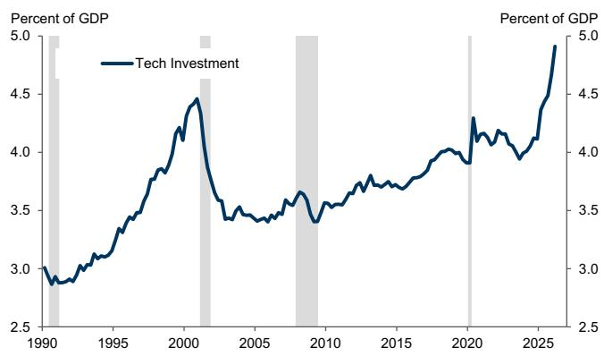  
Shading indicates NBER recessions. Tech investment includes private nonresidential fixed investment in software and information processing equipment.

Exhibit 2: Hyperscaler capex estimates have risen sharply since late 2025  
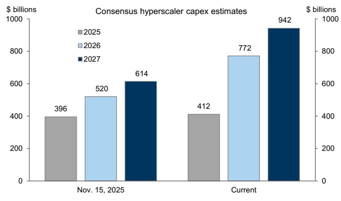  
Source: FactSet, GS Global Investment Research  
Source: Haver Analytics, GS Global Investment Research

Exhibit 3: Tech investment contributions to growth now match the 1990s, but have not been as sustained yet  
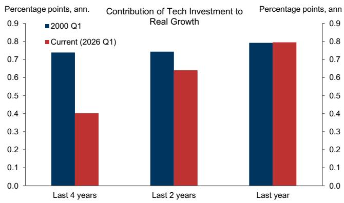

Exhibit 4: AI investment now likely to be comparable to if not exceed the 1990s tech peak  
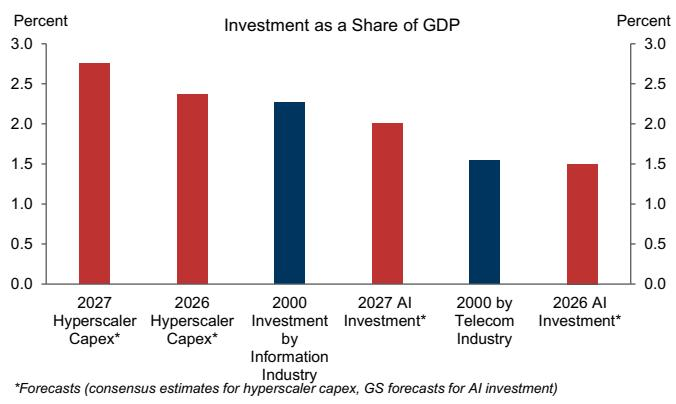  
Source: Haver Analytics, GS Global Investment Research  
Source: Haver Analytics, GS Global Investment Research

But other dynamics are not yet following the 1990s path. Most importantly, profit margins—which peaked in late 1997 on macro measures—have risen to new highs (Exhibit 5). Helping this dynamic, strong productivity growth has not been eroded by the kind of wage acceleration that pushed unit labor costs higher from 1998-2000 (Exhibit 6). Nor are there signs of the growing imbalances that signaled growing macro vulnerability from 1997 onwards.

Corporate financing needs from the hyperscalers have risen and free cash flow across that group has fallen sharply (Exhibit 7). But the corporate sector financial balance as a whole—the difference between savings and investment—has not deteriorated meaningfully in recent months, as rising profits have largely matched rising investment rates. Alongside that, the current account deficit has been shrinking rather than growing, so international imbalances have not increased either (Exhibit 8).

Exhibit 5: Corporate profits have remained near record levels  
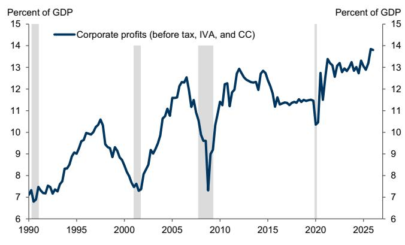  
Source: Haver Analytics, GS Global Investment Research

Exhibit 6: Unit labor costs and wages are growing more slowly than in late 1990s  
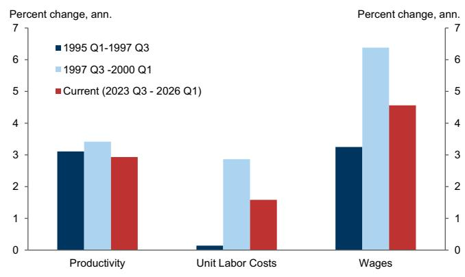  
Source: Haver Analytics, GS Global Investment Research

Exhibit 7: Free cash flow for hyperscalers has dropped sharply, but not for the market as a whole  
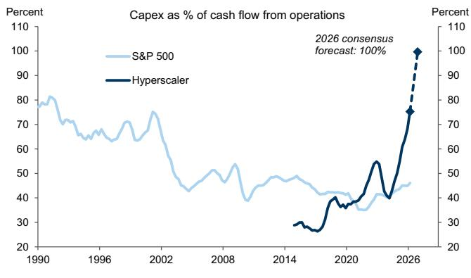  
Source: Compustat, FactSet, GS Global Investment Research

Exhibit 8: No meaningful deterioration in corporate financial balance and current account has improved  
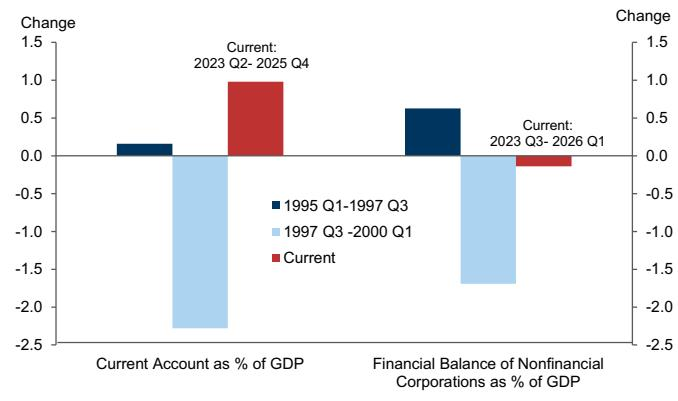  
Source: Bureau of Economic Analysis, Federal Reserve, Haver Analytics, GS Global Investment Research

## A further sharp rise in AI-related value

Market gains in AI-related areas have remained impressive, especially over the last 2-3 months. The key difference relative to the end of the 1990s boom is that earnings—and earnings expectations—have been rising rapidly too. Conventional valuations of the US equity market are still very high by historic standards and backward-looking measures like the Shiller P/E are at levels only exceeded in late 1999 and 2000 (Exhibit 9). But as our equity strategists have pointed out, with earnings expectations rising, forward-looking P/E measures have not risen this year even with the ongoing rally in stock prices (Exhibit 10). In short, the market gains have been more “earnings-driven” than “valuation-driven” lately.

Exhibit 9: US valuations remain high, particularly on “backward-looking” measures  
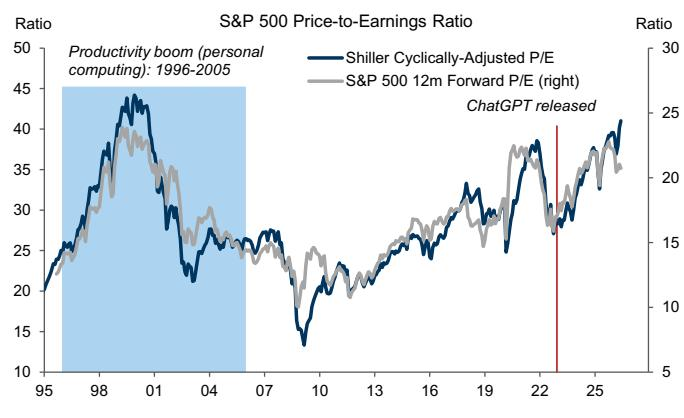  
Source: FactSet, Haver Analytics, Robert Shiller, GS Global Investment Research

Exhibit 10: Earnings revisions, not valuations have driven the rally this year  
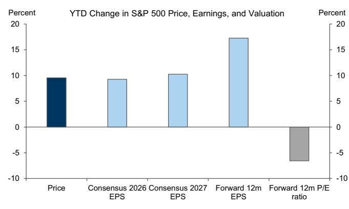  
Source: FactSet, GS Global Investment Research

We have used a simple macro approach as a cross-check on the valuation story, based on estimates of the Present Discounted Value (PDV) of the potential additional profits from AI productivity gains from our global economics team. Those estimates were initially developed to show that those potential gains could justify a sizable investment boom—and they still show that the current capex boom is on solid ground if those gains are coming. But we also illustrated that this PDV could be compared with the value that had been built into equity markets already in AI-related areas, as shown in Exhibit 11. This macro approach sets constraints on what is collectively possible for the economy to deliver. That can be helpful because what may look reasonable for each company may not be reasonable for all of them. We have highlighted that this “fallacy of aggregation”—where collective gains exceed what the economy can plausibly generate—has been a feature of some past booms.

Exhibit 11: Substantial value added to AI-related areas of the market since late 2022  
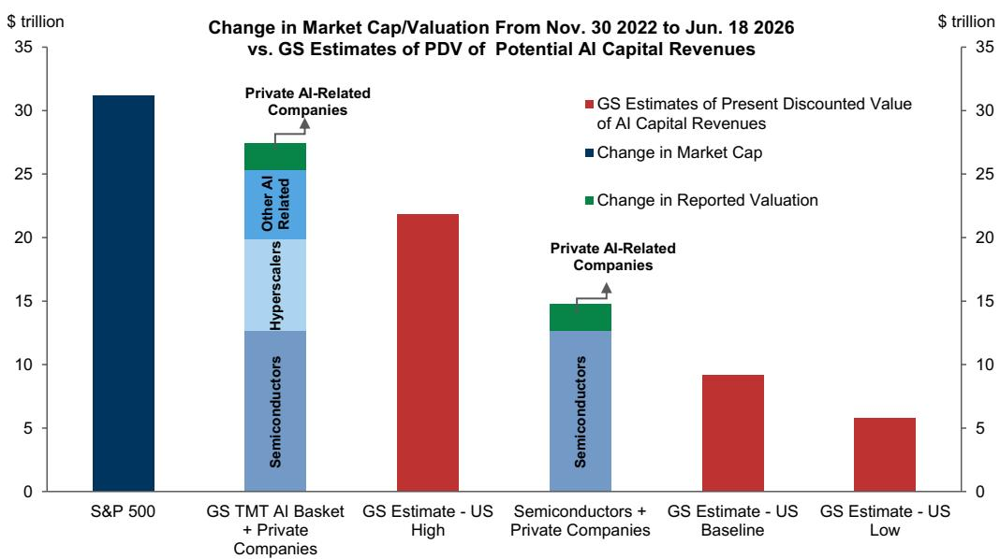  
"Semiconductors", "hyperscalers", and "other AI-related" are constituents of the GS TMT AI basket (developed by GS Global Banking & Markets)  
Source: Bloomberg, FactSet, GS Global Investment Research

We showed in November that the additional market value built into AI-related areas since the introduction of ChatGPT comfortably exceeded our baseline estimate of the present discounted value of additional capital revenues from the boost to the US economy from AI. Six months later, that conclusion is even clearer. Since the end of November 2022, the gain in value for AI-related companies is now around \$27trn, up from around \$19trn in November 2025.

## More generous assumptions can close the gap

The gap between the likely benefits from AI and the market value assigned to these gains is almost certainly narrower than a simple interpretation of Exhibit 11 would suggest. On one side of the ledger, the broad totals of market gains are an overstatement of the valuation gains from AI alone for several reasons:

1. Non-AI companies have earned a return over that period too, and late 2022 was close to the Fed-induced low in US equities. Adjusting for either of those issues $^{1}$ reduces the total value that can plausibly be attributed to AI by a few trillion dollars.

2. The gains in these companies are not all attributable to AI. Many companies (the hyperscalers in particular) have substantial non-AI businesses which may have driven gains in their stocks over the same period. A very conservative approach would be to look at the change in value in a subset of companies whose gains have been much more obviously driven by the AI boom, which amounts to \$14trn. Attributing only 25% of the gains in the hyperscalers and other AI-related companies beyond that group to potential AI-related benefits, which we suspect is also conservative $^{2}$ , brings the total to \$17trn.

3. This approach may undercount the value that has been lost in non-AI areas. Several sectors—most prominently, software—came under pressure due to concerns about disruption to their businesses from AI. $^{3}$ We do not think adjusting for these losses reduces the total gains materially, particularly as the largest software companies are already included in our AI-related basket so any loss of value there is already being counted. But it might become a bigger issue going forward.

As Exhibit 12 shows, these adjustments could materially lower the estimate of the value that is being assigned to AI gains from the “naïve” calculation. But even including all of them, any plausible estimate still comfortably exceeds the baseline estimate of \$9trn of increased capital value from AI productivity benefits for the US economy.

On the other side of the ledger, that baseline estimate relies on several assumptions: more optimistic versions of those assumptions would increase the estimated potential capital revenue gains. If companies capture a larger share of overall revenues; if

adoption rates are faster; or if productivity gains are larger than we assume, then the estimated value of the AI boom to companies will be higher. US companies might also capture an outsized share of non-US AI-related gains, which would boost the total value that could accrue to them. A lower discount rate on AI-related cash flows would raise predicted values too, though we are conscious that lowering discount rate expectations has historically been an easy way to justify excessive valuations. The wide range of estimates of potential value itself also illustrates that there is still a lot of uncertainty around the scope of potential gains.

Exhibit 13 shows the estimated capital revenue gains under a range of these assumptions: US companies capturing a larger share (50%) of international gains; a much higher capital share (60%, relative to an economy-wide share of 42%); faster overall productivity gains; and faster adoption. While these provide material boosts relative to our baseline, it is generally necessary to make more than one of these optimistic assumptions to match even the more conservative estimates of the market value that has been built into AI-related companies so far.

Exhibit 12: Increased value attributable to AI is likely lower than the broader estimates, but still substantial  
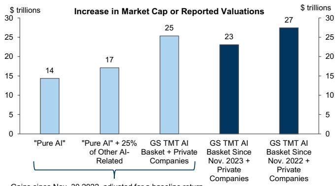  
Gains since Nov. 30 2022, adjusted for a baseline return

“Pure AI” consists of semiconductor constituents of GS TMT AI Basket + private companies  
Exhibit 13: More optimistic assumptions would raise the Present Discounted Value of potential AI-related capital revenues  
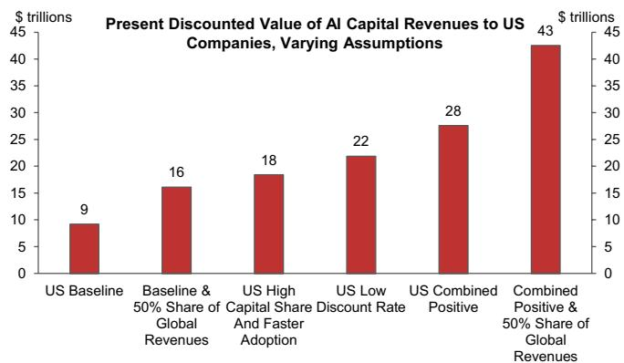  
See “The AI Spending Boom Is Not Too Big”, Briggs, October 2025 for details. Estimates are from varying assumptions of the key parameters.  
Source: FactSet, GS Global Investment Research  
Source: GS Global Investment Research

## From aggregation to extrapolation

Combining key elements of Exhibit 12 and Exhibit 13 in Exhibit 14 below illustrates that we are still at a point where it is possible to reconcile the market value assigned to AI so far with a macro estimate of the future profit gains. That reconciliation, however, needs increasingly optimistic assumptions on both sides of the comparison: both that a smaller portion of the overall value that has accrued in the market is attributable to AI and that the gains in future capital revenues will be at the larger end of the plausible spectrum. That is particularly true because what we identify here are the gains only for AI-related companies. If non-AI companies ultimately capture some of the gains from AI—as you might expect—those would either need to be redistributed from current AI winners, or expectations of the aggregate total value from AI would need to rise even further. $^{4}$

Exhibit 14: A mix of more optimistic assumptions is needed to exceed even more conservative estimates of market value comfortably
See Exhibits 12 and 13 for details  
  
Source: FactSet, GS Global Investment Research

We think the most credible upside stories rely on the assumption that AI-related companies capture a higher share of profits than the economy-wide average share in our baseline. Earnings have been strong and margins are high for the semiconductors and the hyperscalers. The economy-wide profit share has trended higher for some time and has risen more sharply again recently. High profitability has been a key part of avoiding macro imbalances, limiting the rise in valuations and dampening concerns about credit quality.

The underlying assumption that the market is making is that this process will continue. By driving up prices in line with earnings (even without raising valuations), the market is implicitly assuming that these shifts in earnings shares are likely to be highly persistent; that companies—and specifically those involved in supplying the boom—will capture a large portion of the potential economic gains from AI; and that the economy-wide profit share will continue to move higher. There are some good reasons to think that the technological characteristics and market structure of AI could raise the profit share further. AI has some of the potential features of “capital-biased” technological change and market concentration amongst the key players is quite high. But there are risks in the other direction. Accelerating productivity growth often leads to increased economy-wide profit shares initially (Exhibit 15). But competition, investment and further innovation can erode those gains over time (Exhibit 16). And it remains to be seen how solid entry barriers will be in protecting incumbents from subsequent profit erosion.

Exhibit 15: Higher productivity growth is correlated with increased profit shares in the short term...

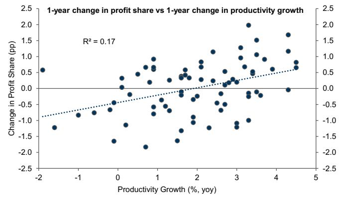  
Source: Haver Analytics, GS Global Investment Research

Exhibit 16: ...but this relationship is much weaker over longer time periods  
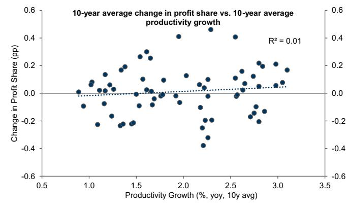

As importantly, the investment boom is itself fueling a substantial part of profit generation. The peak of the investment boom does not look close at hand, so the near-term path of investment and earnings revisions may still be higher. But over the longer term, those investment rates will fall. The risk here too is that the market is overestimating the persistence of those earnings streams beyond the next 2-3 years, particularly for those who are benefiting directly from supplying the capex boom. Earnings projections a couple of years forward may still look very robust, but it is harder to know what earnings profiles will look like beyond that point after the phase of rapid investment is over, so low multiples do not necessarily imply cheapness. $^{5}$ In the meantime, assumptions of strong profitability are vulnerable to any signs that the investment boom is slowing or hitting financing constraints; any path where the benefits materialize more slowly or costs limit adoption; and any innovation that reduces the need for this intensity of capital spending.

## Market dynamics

Beyond high valuations, we highlighted other market dynamics that, alongside the macro imbalances, marked a shift in the 1990s bubble. We showed that credit spreads and equity volatility began to move higher in 1998 alongside rising equity prices. Despite periodic concerns, and an increase in AI-related issuance, credit spreads have mostly stayed tight, helped by strong investor appetite and much lower leverage than in the late 1998-2000 period. Shifts in equity volatility have become more noticeable, however, in the last six months.

We highlighted that equity volatility could climb as the market focused more on both the distribution and size of the potential gains from AI. So far it is the distributional axis that has dominated. We have seen a very clear pickup in single-stock volatility in the last few months. Skew in US single-stock options has also shifted sharply lower as appetite for calls relative to puts has risen. Implied correlation has fallen—in some cases to record lows—but even with that dampening effect, longer-dated index volatility is rising slowly too. The late 1990s suggests that there may still be plenty of room for equity volatility to rise further. But the behavior of options markets suggests that the bull market has already entered a new phase.

Exhibit 17: Rise in equity volatility has so far mostly been at single stock level, with correlations falling to record lows  
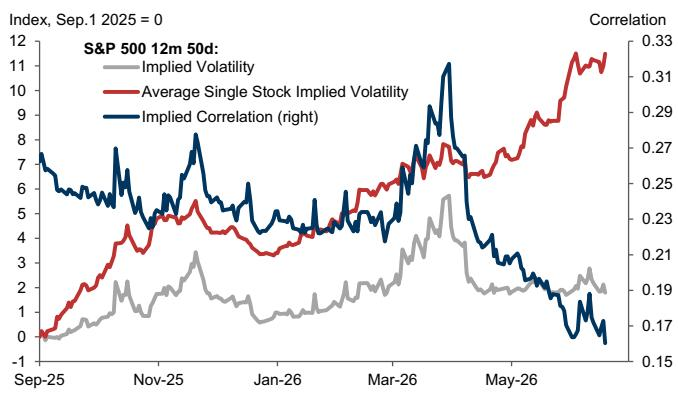  
Source: GS FICC and Equities, GS Global Investment Research  
Exhibit 18: Late 1990s saw higher volatility at both single stock and index levels

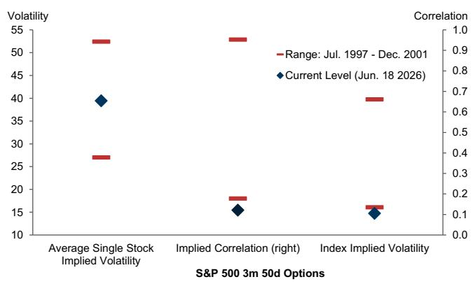  
Source: GS FICC and Equities, GS Global Investment Research

The pace of equity gains has also picked up, another feature of the last 1990s experience. While broad US index returns still look more contained, the gains in semiconductor indices like SOX over the last couple of years now look comparable to the Nasdaq returns of the late 1990s. And the gains in April and May across a wide range of AI-linked indices—Nasdaq, Korea, Taiwan, SOX and baskets of non-profitable tech companies—were the highest back-to-back monthly gains for several years.

Exhibit 19: Returns in broad indices more moderate, but narrower indices now matching late 1990s returns

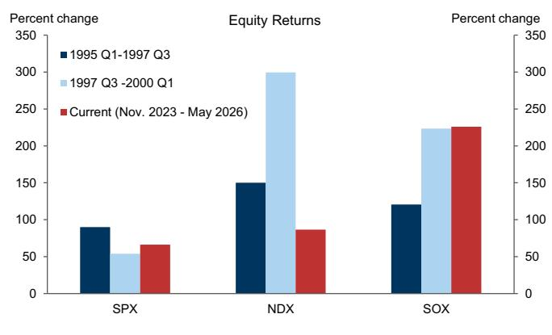  
Source: Bloomberg, GS Global Investment Research

Exhibit 20: April-May 2026 saw an acceleration in returns in key indices  
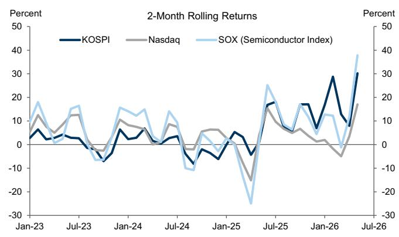  
Source: GS FICC and Equities, GS Global Investment Research

## From the macro masking the boom, to the boom masking the macro

While comparisons with the late 1990s still look more reassuring than not, we think it is important not to press that point too hard. Analogues can only take us so far. We may simply be discovering that the macro backdrop to this investment boom—and the vulnerabilities that it may generate—is different.

The 1990s saw a very broad-based domestic demand boom. Real domestic demand growth was nearly 6% on an annualized basis for the last two years of that cycle; consumer spending, residential and non-tech investment all grew at comparable rates; and the federal budget briefly moved into surplus. The Asia and EM crises of 1997-98, which generated significant capital inflows to the US, a sharp rise in the US dollar, and a disinflationary impulse to global goods prices, masked the potential inflationary effects of that boom. This helped it to extend further than it might otherwise have done but also contributed to the mix of a widening current account, real wage acceleration, profit erosion and easy monetary policy that ultimately undermined the expansion.

The situation looks different now. Outside the AI-related areas, the broader economy looks much less robust than in the 1990s. Non-tech investment has mostly been weak. Consumer spending growth has been much less impressive than in the late 1990s despite a gain in household wealth and a decline in the savings rate that are larger than they were then. And real disposable income has grown at an annualized rate of around 1% over the last 2 years, compared to a 5-6% rate at the end of the 1990s boom.

Exhibit 21: We have seen a large rise in US household wealth and a sharp fall in the savings rate  
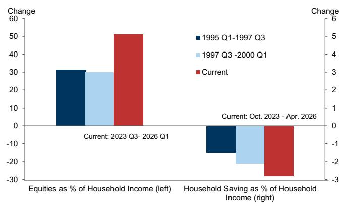  
Source: Haver Analytics, GS Global Investment Research

Exhibit 22: US spending and income growth outside tech investment much more muted than in late 1990s  
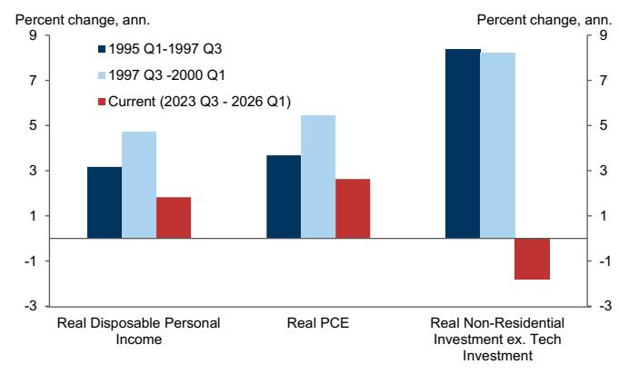  
Source: Haver Analytics, GS Global Investment Research

Where the 1990s macro picture masked an inflationary domestic boom, the AI boom currently may be offsetting a more fragile macro backdrop outside those areas buoyed by AI investment or equity wealth effects. This more subdued picture may make the kind of extreme bubble that we saw in 1999 and 2000 less likely. It also means that the kind of overheating and imbalances that created the basis for the 2001 recession are not yet visible. But it potentially increases a different kind of vulnerability—an economy that may be more vulnerable to macro shocks (including from the supply side) and to any challenges to the optimistic AI macro story.

Because the path of profits and earnings looks different, it is less obvious than it was in late 1999 and early 2000 that the collective gains implied by the market exceed what the economy can plausibly deliver. But the clearest routes to avoiding that conclusion raise the chance that investors overestimate the persistence of above-average earnings, particularly for those benefiting directly from AI infrastructure spending. Put simply, the risk of a pure “valuation bubble” seems lower than in the late 1990s, but the risk of an “earnings bubble” may be growing.

In the process, the tension between a favorable fundamental backdrop and high valuations that we have highlighted for some time continues to sharpen. The macro story around AI still looks quite secure, especially compared to the late 1990s. The investment boom still appears to have room to grow, in the absence of unexpected shocks, so the outlook for beneficiaries of that boom still looks supportive. But the market has continued to boost the value it is assigning to those future gains, making it more vulnerable to any news that challenges that optimistic assessment.

Until the peak in that investment cycle looks more imminent, we think robust earnings may continue to dominate valuation concerns. So we want to find ways of staying invested while limiting the downside, difficult though that can be. We think equity volatility is likely to rise further as the boom extends, adding to the appeal of put protection or call replacement as a route to that goal. With a more fragile macro picture outside AI-related areas, we think the risks that rates ultimately end up meaningfully lower beyond the peak of this investment boom is higher than normal—despite a market that has been focused more recently on the upside risks to inflation and yields.

Dominic Wilson

Vickie Chang

## Disclosure Appendix

## Reg AC

We, Dominic Wilson and Vickie Chang, hereby certify that all of the views expressed in this report accurately reflect our personal views, which have not been influenced by considerations of the firm's business or client relationships.

Unless otherwise stated, the individuals listed on the cover page of this report are analysts in GS' Global Investment Research division.

Contributing Authors: Dominic Wilson GS & Co. LLC, Vickie Chang GS & Co. LLC.

Unless otherwise stated, the individuals listed in the Contributing Authors disclosure of this report are analysts in GS' Global Investment Research division.

## Disclosures

## Regulatory disclosures

## Disclosures required by United States laws and regulations

See company-specific regulatory disclosures above for any of the following disclosures required as to companies referred to in this report: manager or co-manager in a pending transaction; 1% or other ownership; compensation for certain services; types of client relationships; managed/co-managed public offerings in prior periods; directorships; for equity securities, market making and/or specialist role. GS trades or may trade as a principal in debt securities (or in related derivatives) of issuers discussed in this report.

The following are additional required disclosures: Ownership and material conflicts of interest: GS policy prohibits its analysts, professionals reporting to analysts and members of their households from owning securities of any company in the analyst's area of coverage. Analyst compensation: Analysts are paid in part based on the profitability of GS, which includes investment banking revenues. Analyst as officer or director: GS policy generally prohibits its analysts, persons reporting to analysts or members of their households from serving as an officer, director or advisor of any company in the analyst's area of coverage. Non-U.S. Analysts: Non-U.S. analysts may not be associated persons of GS & Co. LLC and therefore may not be subject to FINRA Rule 2241 or FINRA Rule 2242 restrictions on communications with a subject company, public appearances and trading in securities covered by the analysts.

## Additional disclosures required under the laws and regulations of jurisdictions other than the United States

The following disclosures are those required by the jurisdiction indicated, except to the extent already made above pursuant to United States laws and regulations. Australia: GS Australia Pty Ltd and its affiliates are not authorised deposit-taking institutions (as that term is defined in the Banking Act 1959 (Cth)) in Australia and do not provide banking services, nor carry on a banking business, in Australia. This research, and any access to it, is intended only for “wholesale clients” within the meaning of the Australian Corporations Act, unless otherwise agreed by GS. In producing research reports, members of Global Investment Research of GS Australia may attend site visits and other meetings hosted by the companies and other entities which are the subject of its research reports. In some instances the costs of such site visits or meetings may be met in part or in whole by the issuers concerned if GS Australia considers it is appropriate and reasonable in the specific circumstances relating to the site visit or meeting. To the extent that the contents of this document contains any financial product advice, it is general advice only and has been prepared by GS without taking into account a client’s objectives, financial situation or needs. A client should, before acting on any such advice, consider the appropriateness of the advice having regard to the client’s own objectives, financial situation and needs. A copy of certain GS Australia and New Zealand disclosure of interests and a copy of GS’ Australian Sell-Side Research Independence Policy Statement are available at: https://www.goldmansachs.com/disclosures/australia-new-zealand/index.html. Brazil: Disclosure information in relation to CVM Resolution n. 20 is available at https://www.gs.com/worldwide/brazil/area/gir/index.html. Where applicable, the Brazil-registered analyst primarily responsible for the content of this research report, as defined in Article 20 of CVM Resolution n. 20, is the first author named at the beginning of this report, unless indicated otherwise at the end of the text. Canada: This information is being provided to you for information purposes only and is not, and under no circumstances should be construed as, an advertisement, offering or solicitation by GS & Co. LLC for purchasers of securities in Canada to trade in any Canadian security. GS & Co. LLC is not registered as a dealer in any jurisdiction in Canada under applicable Canadian securities laws and generally is not permitted to trade in Canadian securities and may be prohibited from selling certain securities and products in certain jurisdictions in Canada. If you wish to trade in any Canadian securities or other products in Canada please contact GS Canada Inc., an affiliate of The GS Group Inc., or another registered Canadian dealer. Hong Kong: Further information on the securities of covered companies referred to in this research may be obtained on request from GS (Asia) L.L.C. India: Further information on the subject company or companies referred to in this research may be obtained from GS (India) Securities Private Limited, Research Analyst - SEBI Registration Number INH000001493, 10th Floor, Ascent-Worli, Sudam Kalu Ahire Marg, Worli, Mumbai-400 025, India, Corporate Identity Number U74140MH2006FTC160634, Phone +91 22 6616 9000, Fax +91 22 6616 9001. GS may beneficially own 1% or more of the securities (as such term is defined in clause 2 (h) the Indian Securities Contracts (Regulation) Act, 1956) of the subject company or companies referred to in this research report. Investment in securities market are subject to market risks. Read all the related documents carefully before investing. Registration granted by SEBI and certification from NISM in no way guarantee performance of the intermediary or provide any assurance of returns to investors. GS (India) Securities Private Limited compliance officer and investor grievance contact details can be found at: https://www.goldmansachs.com/worldwide/india/documents/Grievance-Redressal-and-Escalation-Matrix.pdf, and a copy of the annual audit compliance report can be found at this link: https://publishing.gs.com/content/site/india-annual-compliance-report.html. Japan: See below. Korea: This research, and any access to it, is intended only for “professional investors” within the meaning of the Financial Services and Capital Markets Act, unless otherwise agreed by GS. Further information on the subject company or companies referred to in this research may be obtained from GS (Asia) L.L.C., Seoul Branch. New Zealand: GS New Zealand Limited and its affiliates are neither “registered banks” nor “deposit takers” (as defined in the Reserve Bank of New Zealand Act 1989) in New Zealand. This research, and any access to it, is intended for “wholesale clients” (as defined in the Financial Advisers Act 2008) unless otherwise agreed by GS. A copy of certain GS Australia and New Zealand disclosure of interests is available at: https://www.goldmansachs.com/disclosures/australia-new-zealand/index.html. Russia: Research reports distributed in the Russian Federation are not advertising as defined in the Russian legislation, but are information and analysis not having product promotion as their main purpose and do not provide appraisal within the meaning of the Russian legislation on appraisal activity. Research reports do not constitute a personalized investment recommendation as defined in Russian laws and regulations, are not addressed to a specific client, and are prepared without analyzing the financial circumstances, investment profiles or risk profiles of clients. GS assumes no responsibility for any investment decisions that may be taken by a client or any other person based on this research report. Singapore: GS (Singapore) Pte. (Company Number: 198602165W), which is regulated by the Monetary Authority of Singapore, accepts legal responsibility for this research, and should be contacted with respect to any matters arising from, or in connection with, this research. Taiwan: This material is for reference only and must not be reprinted without permission. Investors should carefully consider their own investment risk. Investment results are the responsibility of the individual investor. United Kingdom: Persons who would be categorized as retail clients in the United Kingdom, as such term is defined in the rules of the Financial Conduct Authority, should read this research in conjunction with prior GS on the covered

companies referred to herein and should refer to the risk warnings that have been sent to them by GS International. A copy of these risks warnings, and a glossary of certain financial terms used in this report, are available from GS International on request.

European Union and United Kingdom: Disclosure information in relation to Article 6 (2) of the European Commission Delegated Regulation (EU) (2016/958) supplementing Regulation (EU) No 596/2014 of the European Parliament and of the Council (including as that Delegated Regulation is implemented into United Kingdom domestic law and regulation following the United Kingdom's departure from the European Union and the European Economic Area) with regard to regulatory technical standards for the technical arrangements for objective presentation of investment recommendations or other information recommending or suggesting an investment strategy and for disclosure of particular interests or indications of conflicts of interest is available at https://www.gs.com/disclosures/europeanpolicy.html which states the European Policy for Managing Conflicts of Interest in Connection with Investment Research.

Japan: GS Japan Co., Ltd. is a Financial Instrument Dealer registered with the Kanto Financial Bureau under registration number Kinsho 69, and a member of Japan Securities Dealers Association, Financial Futures Association of Japan Type II Financial Instruments Firms Association, and Investment Management Association of Japan. Sales and purchase of equities are subject to commission pre-determined with clients plus consumption tax. See company-specific disclosures as to any applicable disclosures required by Japanese stock exchanges, the Japanese Securities Dealers Association or the Japanese Securities Finance Company.

## Global product; distributing entities

GS Global Investment Research produces and distributes research products for clients of GS on a global basis. Analysts based in GS offices around the world produce research on industries and companies, and research on macroeconomics, currencies, commodities and portfolio strategy. This research is disseminated in Australia by GS Australia Pty Ltd (ABN 21 006 797 897); in Brazil by GS do Brasil Corretora de Títulos e Valores Mobiliários S.A.; Public Communication Channel GS Brazil: 0800 727 5764 and / or contatogoldmanbrasil@gs.com. Available Weekdays (except holidays), from 9am to 6pm. Canal de Comunicação com o Público GS Brasil: 0800 727 5764 e/ou contatogoldmanbrasil@gs.com. Horário de funcionamento: segunda-feira à sexta-feira (exceto feriados), das 9h às 18h; in Canada by GS & Co. LLC; in Hong Kong by GS (Asia) L.L.C.; in India by GS (India) Securities Private Ltd.; in Japan by GS Japan Co., Ltd.; in the Republic of Korea by GS (Asia) L.L.C., Seoul Branch; in New Zealand by GS New Zealand Limited; in Russia by OOO GS; in Singapore by GS (Singapore) Pte. (Company Number: 198602165W); and in the United States of America by GS & Co. LLC. GS International has approved this research in connection with its distribution in the United Kingdom.

GS International (“GSI”), authorised by the Prudential Regulation Authority (“PRA”) and regulated by the Financial Conduct Authority (“FCA”) and the PRA, has approved this research in connection with its distribution in the United Kingdom.

European Economic Area: GS Bank Europe SE (“GSBE”) is a credit institution incorporated in Germany and, within the Single Supervisory Mechanism, subject to direct prudential supervision by the European Central Bank and in other respects supervised by German Federal Financial Supervisory Authority (Bundesanstalt für Finanzdienstleistungsaufsicht, BaFin) and Deutsche Bundesbank and disseminates research within the European Economic Area.

## General disclosures

This research is for our clients only. Other than disclosures relating to GS, this research is based on current public information that we consider reliable, but we do not represent it is accurate or complete, and it should not be relied on as such. The information, opinions, estimates and forecasts contained herein are as of the date hereof and are subject to change without prior notification. We seek to update our research as appropriate, but various regulations may prevent us from doing so. Other than certain industry reports published on a periodic basis, the large majority of reports are published at irregular intervals as appropriate in the analyst's judgment.

GS conducts a global full-service, integrated investment banking, investment management, and brokerage business. We have investment banking and other business relationships with a substantial percentage of the companies covered by Global Investment Research. GS & Co. LLC, the United States broker dealer, is a member of SIPC (https://www.sipc.org).

Our salespeople, traders, and other professionals may provide oral or written market commentary or trading strategies to our clients and principal trading desks that reflect opinions that are contrary to the opinions expressed in this research. Our asset management area, principal trading desks and investing businesses may make investment decisions that are inconsistent with the recommendations or views expressed in this research.

We and our affiliates, officers, directors, and employees will from time to time have long or short positions in, act as principal in, and buy or sell, the securities or derivatives, if any, referred to in this research, unless otherwise prohibited by regulation or GS policy.

The views attributed to third party presenters at GS arranged conferences, including individuals from other parts of GS, do not necessarily reflect those of Global Investment Research and are not an official view of GS.

Any third party referenced herein, including any salespeople, traders and other professionals or members of their household, may have positions in the products mentioned that are inconsistent with the views expressed by analysts named in this report.

This research is focused on investment themes across markets, industries and sectors. It does not attempt to distinguish between the prospects or performance of, or provide analysis of, individual companies within any industry or sector we describe.

Any trading recommendation in this research relating to an equity or credit security or securities within an industry or sector is reflective of the investment theme being discussed and is not a recommendation of any such security in isolation.

This research is not an offer to sell or the solicitation of an offer to buy any security in any jurisdiction where such an offer or solicitation would be illegal. It does not constitute a personal recommendation or take into account the particular investment objectives, financial situations, or needs of individual clients. Clients should consider whether any advice or recommendation in this research is suitable for their particular circumstances and, if appropriate, seek professional advice, including tax advice. The price and value of investments referred to in this research and the income from them may fluctuate. Past performance is not a guide to future performance, future returns are not guaranteed, and a loss of original capital may occur. Fluctuations in exchange rates could have adverse effects on the value or price of, or income derived from, certain investments.

Certain transactions, including those involving futures, options, and other derivatives, give rise to substantial risk and are not suitable for all investors. Investors should review current options and futures disclosure documents which are available from GS sales representatives or at https://www.theocc.com/about/publications/character-risks.jsp and https://www.goldmansachs.com/disclosures/cftc\_fcm\_disclosures. Transaction costs may be significant in option strategies calling for multiple purchase and sales of options such as spreads. Supporting documentation will be supplied upon request.

Differing Levels of Service provided by Global Investment Research: The level and types of services provided to you by GS Global Investment Research may vary as compared to that provided to internal and other external clients of GS, depending on various factors including your individual preferences as to the frequency and manner of receiving communication, your risk profile and investment focus and perspective (e.g.,

marketwide, sector specific, long term, short term), the size and scope of your overall client relationship with GS, and legal and regulatory constraints. As an example, certain clients may request to receive notifications when research on specific securities is published, and certain clients may request that specific data underlying analysts' fundamental analysis available on our internal client websites be delivered to them electronically through data feeds or otherwise. No change to an analyst's fundamental research views (e.g., ratings, price targets, or material changes to earnings estimates for equity securities), will be communicated to any client prior to inclusion of such information in a research report broadly disseminated through electronic publication to our internal client websites or through other means, as necessary, to all clients who are entitled to receive such reports.

All research reports are disseminated and available to all clients simultaneously through electronic publication to our internal client websites. Not all research content is redistributed to our clients or available to third-party aggregators, nor is GS responsible for the redistribution of our research by third party aggregators. For research, models or other data related to one or more securities, markets or asset classes (including related services) that may be available to you, please contact your GS representative or go to https://research.gs.com.

Disclosure information is also available at https://www.gs.com/research/hedge.html or from Research Compliance, 200 West Street, New York, NY 10282.

## © 2026 GS.

You are permitted to store, display, analyze, modify, reformat, and print the information made available to you via this service only for your own use. You may not resell or reverse engineer this information to calculate or develop any index for disclosure and/or marketing or create any other derivative works or commercial product(s), data or offering(s) without the express written consent of GS. You are not permitted to publish, transmit, or otherwise reproduce this information, in whole or in part, in any format to any third party without the express written consent of GS. This foregoing restriction includes, without limitation, using, extracting, downloading or retrieving this information, in whole or in part, to train or finetune a machine learning or artificial intelligence system, or to provide or reproduce this information, in whole or in part, as a prompt or input to any such system.