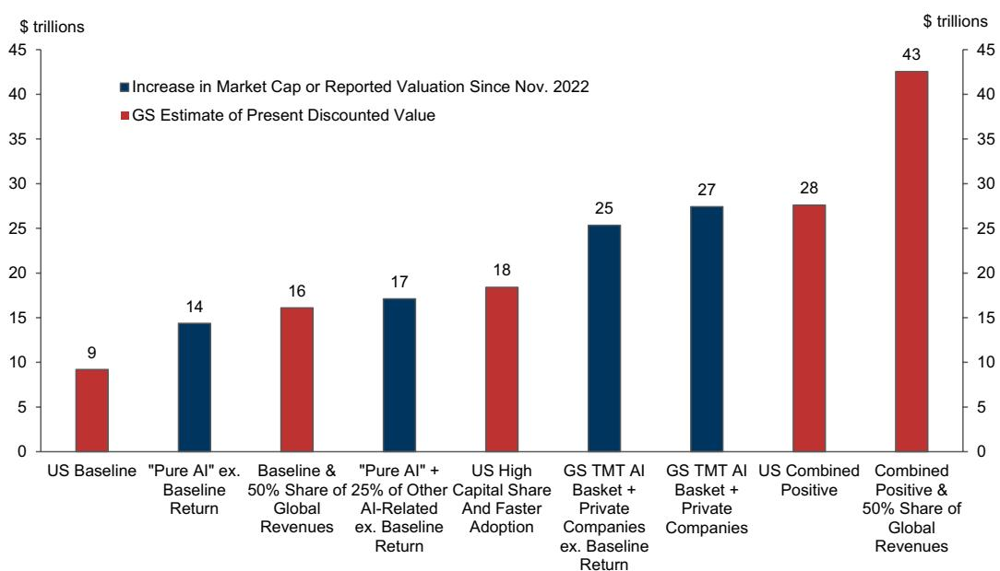

# The AI Boom Is Still Justified by Fundamentals, But the Valuation Gap Has Become Too Wide to Ignore

The AI investment cycle has accelerated faster than most strategists predicted six months ago, and markets have followed. But the core tension that defined the boom in late 2025 has only intensified: the macro fundamentals remain supportive, while the value already priced into AI-related equities has grown to a level that demands increasingly heroic assumptions to justify. This is not yet a bubble in the 1990s sense, but the margin for error is shrinking.

The key difference between now and the late 1990s is not the scale of investment—which has now matched the tech boom—but the absence of the macro imbalances that ultimately broke that cycle. Profit margins are at record highs, not declining. Corporate financing needs remain contained outside the hyperscaler group. The current account deficit has narrowed, not widened. These are not the conditions that preceded the 2001 recession. Yet the very absence of those traditional warning signs may be creating a different kind of vulnerability: a boom that is narrower in its base, more concentrated in its beneficiaries, and more exposed to a single narrative about AI's transformative potential.

The question for serious investors is no longer whether AI investment is justified. It is whether the market has already priced in the most optimistic version of the story, and what happens when the next piece of data fails to confirm it.

## The Investment Boom Has Matched the 1990s in Scale, But Not in Breadth or Duration

Tech investment as a share of GDP has now breached the peaks of the late 1990s, and the pace of acceleration has been sharper. Hyperscaler capex expectations for 2026 have risen nearly 80% in just six months. On a simple scale comparison, the AI investment boom is now comparable to the tech boom at its height.

But this is where the similarity ends. The 1990s investment boom was broad-based, spanning telecommunications, networking, software, hardware, and a vast ecosystem of startups and incumbents. It lasted for nearly five years at elevated levels. The current boom is overwhelmingly concentrated in a small group of hyperscalers and semiconductor firms. It has been running at full intensity for less than two years. The investment is massive, but it is not yet systemic in the way the 1990s boom was.

This concentration matters because it changes the transmission mechanism from investment to the broader economy. In the 1990s, the capex boom generated widespread employment gains, wage growth, and consumer spending that rippled through multiple sectors. Today, the AI investment boom is generating enormous profits for a narrow set of companies, but the spillover effects into the rest of the economy are more limited. The macro data looks healthy on aggregate, but that health is heavily dependent on the performance of a small number of firms.

The risk is not that the AI investment cycle will collapse—it is that the rest of the economy is more fragile than the aggregate numbers suggest, and that fragility will become visible only when the investment cycle begins to slow. The 1990s boom masked the Asia and emerging market crises. The AI boom may be masking a more precarious macro backdrop outside the AI-supported sectors.

## Profit Margins Have Held, But the Corporate Sector Is More Concentrated Than It Appears

The most reassuring macro data point is the resilience of profit margins. Unlike the late 1990s, when margins began declining from 1997 onward, economy-wide profit margins have risen to new highs. Unit labor costs have not accelerated in the way they did from 1998 to 2000. Wage growth has remained moderate relative to productivity gains.

This is a genuine difference, and it is the primary reason the current cycle has not yet generated the classic signs of macro strain. But the aggregate data obscures an important distributional shift. The profit margin gains are not evenly spread. They are concentrated in the same narrow set of AI-related companies that are driving the investment boom. The hyperscalers and semiconductor firms are generating extraordinary margins, while many other sectors—software, media, traditional industrials—are facing margin pressure from AI-related disruption or from the cost of adopting AI themselves.

The corporate sector financial balance has not deteriorated meaningfully, but that is because rising profits in the AI winners have offset rising investment in that same group. Outside that group, the picture is more mixed. Free cash flow for hyperscalers has dropped sharply, but for the market as a whole it has held up. This is not yet a problem, but it is a sign that the resilience of the aggregate numbers depends on the continued outperformance of a very small number of companies.

The so-what is straightforward: if profit margins in the AI winners begin to normalize—through competition, regulation, or simply the natural maturation of the investment cycle—the aggregate macro picture could deteriorate quickly. The current stability is contingent, not structural.

## The Market Has Priced in More Optimism Than the Economy Can Easily Deliver

The most striking finding from the report is the growing gap between the market value assigned to AI-related companies and any plausible estimate of the present discounted value of future profits from AI. Since November 2022, the gain in value for AI-related companies is now around $27 trillion. Even after conservative adjustments—subtracting baseline market returns, attributing only a portion of gains to AI, and focusing on the purest AI beneficiaries—the remaining value still comfortably exceeds the baseline estimate of $9 trillion in increased capital value from AI productivity gains for the US economy.

This does not mean the market is wrong. It means the market is making aggressive assumptions about adoption rates, capital shares, productivity gains, and the ability of US companies to capture global revenues. The report shows that it is possible to close the gap with a combination of optimistic assumptions: US companies capturing 50% of international AI gains, a capital share of 60% versus the economy-wide average of 42%, faster productivity growth, and rapid adoption. But it generally requires more than one of these assumptions to be true simultaneously.

The most credible upside story is that AI-related companies will capture a higher share of AI-related productivity gains than the economy-wide average. This is what has happened so far, and it is consistent with the market structure of AI, which features high concentration among a small number of firms with significant entry barriers. But there is a risk that the market is extrapolating near-term trends too far into the future. The high profits of the AI winners are partly fueled by the investment boom itself—companies are spending heavily on AI infrastructure, and that spending flows directly to the revenues of semiconductor and hyperscaler firms. When the investment cycle peaks, that source of profit growth will fade.

The report does not fully answer the question of how persistent these profit shares will be. It notes that accelerating productivity growth often leads to increased profit shares initially, but that competition, investment, and further innovation can erode those gains over time. The key unknown is the strength of entry barriers in AI. If the current leaders can maintain their advantages in data, compute, and talent, the profit share may remain elevated for an extended period. If not, the market's implicit assumption of persistence could prove costly.

## The Vulnerabilities Are Different This Time, and That Makes Them Harder to Model

The late 1990s boom ended when a combination of declining profit margins, rising corporate leverage, a widening current account deficit, and an overvalued equity market collided with a tightening monetary policy. The current boom has none of those features. Profit margins are high. Corporate leverage is moderate. The current account is improving. Monetary policy, while restrictive, is not as tight relative to inflation as it was in 2000.

But the absence of traditional imbalances does not mean the cycle is safe. It may mean the vulnerabilities are different and harder to anticipate. The AI boom is narrower, more concentrated, and more dependent on a single narrative about technological transformation. The macro economy outside AI is more fragile than the aggregates suggest. The market is pricing in a level of future profits that requires multiple optimistic assumptions to hold simultaneously.

The most dangerous scenario is not a 2001-style recession driven by macro imbalances. It is a more subtle unwind in which the investment cycle peaks, profit growth in the AI winners decelerates, and the broader economy proves less resilient than expected. In that scenario, the market's high embedded expectations create a vulnerability to any news that challenges the optimistic view. The report notes that equity volatility is likely to rise further, and that the risk of rates ending up meaningfully lower beyond the peak of the investment boom is higher than normal.

This is a different kind of risk from the 1990s, but it is no less real. It is a risk that cannot be captured by traditional macro indicators, and it is a risk that is difficult to hedge with conventional portfolio strategies.

## A Decision Framework for Investors: Three Questions

For investors trying to navigate this environment, the report suggests a framework built around three questions.

First, where are we in the investment cycle? The report argues that the investment boom is likely to extend, and that near-term expectations of its scope may still need to rise. Until the peak draws closer, robust earnings may continue to dominate macro concerns. This suggests that staying invested is still the right default, but with an eye on the trajectory of capex announcements and hyperscaler guidance.

Second, how much of the AI story is already priced in? The gap between market value and plausible macro estimates is wide. This does not mean the market will correct, but it does mean that the bar for positive surprises is rising. Investors should be more sensitive to downside risks to the AI narrative—slowing adoption, regulatory constraints, competitive pressures, or simply a deceleration in the pace of technological improvement.

Third, what is the macro vulnerability that no one is talking about? The report suggests that the AI boom may be masking fragility in non-AI sectors. Investors should look for signs of stress in areas that are not benefiting from the AI cycle: small-cap companies, traditional industrials, software firms facing disruption, and consumer-facing businesses that are not seeing the productivity gains that AI promises. If those areas begin to show weakness, the aggregate macro picture could deteriorate faster than the AI-focused indices suggest.

The most important insight from the report is that the current cycle is not a repeat of the 1990s. It is a different animal, with different strengths and different vulnerabilities. The tools that worked in the past—watching profit margins, corporate leverage, and the current account—may not capture the risks that matter today. Investors need to develop new frameworks for a cycle that is narrower, more concentrated, and more dependent on a single technological narrative.

## The Open Questions the Report Leaves Unanswered

The report is rigorous in its analysis, but it leaves several meaningful questions unresolved. How persistent will the profit shares of AI winners be? The report notes that competition and innovation can erode high margins over time, but it does not provide a clear framework for assessing the strength of entry barriers in AI. This is the single most important unknown for long-term valuation.

What happens to non-AI sectors as the investment cycle matures? The report acknowledges that the macro picture outside AI is more fragile than the aggregates suggest, but it does not quantify that fragility. Are there specific sectors or regions that are particularly exposed? What would be the trigger for a broader slowdown?

How should investors think about the discount rate for AI-related cash flows? The report is appropriately cautious about lowering discount rate expectations to justify high valuations, but it does not provide guidance on what the appropriate discount rate should be. This is a critical input for any valuation framework, and it is inherently uncertain.

Finally, what is the path to a soft landing for the AI boom? The report describes a scenario in which the investment cycle peaks, profit growth decelerates, and the market adjusts without a crash. But it does not identify the conditions that would make that scenario more likely. Is there a policy response that could smooth the adjustment? Are there structural features of the AI economy that make a gradual normalization more plausible than a sharp correction?

These are not criticisms of the report. They are the natural questions that arise from a serious analytical effort. The report provides a framework for thinking about the AI boom, but it does not pretend to have all the answers. That is exactly what makes it valuable.

Join the community to read the full report and review the original charts.

*This article is for learning and discussion only and does not constitute investment advice.*

Personal reading notes and learning share only. Not investment advice.

