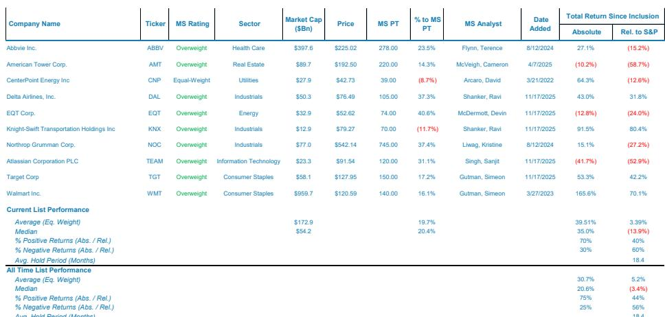
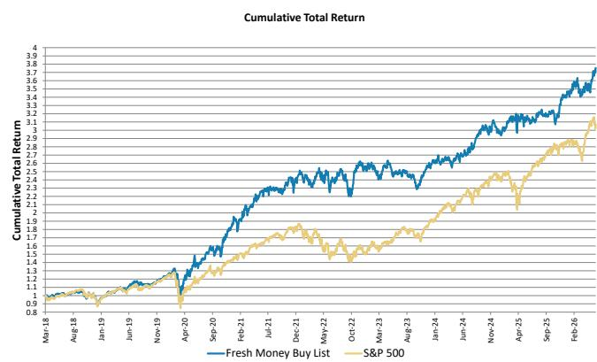
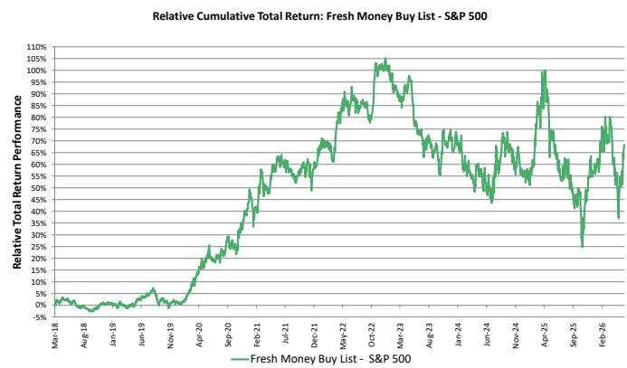

# 摩根斯坦利：MS：沃什的第一次FOMC会议，市场真正该关注的是流动性而非加息

这份MS最新周报的核心判断值得每一个资产配置者重视：凯文·沃什被提名为美联储主席以来，标普500/黄金比率已经上涨了约40%，这是市场在投信任票。但信任票兑现的过程，可能伴随着短期阵痛。报告明确指出，当前对股市更现实的威胁不是加息，而是流动性正在收紧。

沃什第一次主持FOMC会议，释放的信号比市场预期的更加清晰。他明确表示美联储的首要任务是通胀，而不是就业或经济增长。他甚至公开批评美联储过去五年持续偏离通胀目标。这种“新警长上任”的姿态，在报告看来，是重建美联储信誉的必要步骤，但也意味着市场需要适应一个更少“手把手指导”的央行。

## 1. 沃什的鹰派转向并非意在加息，而是为了给长期“热运行”策略铺路

市场普遍将沃什的强硬表态解读为鹰派，但MS的分析视角更为精细。报告认为，沃什的真正意图不是要立刻加息压制经济，而是要通过重建美联储在通胀问题上的信誉，来为政府“以增长化解债务”的长期策略赢得时间与空间。

沃什在会议上的措辞值得玩味。他一方面强调通胀是首要任务，另一方面又暗示“2字头”的通胀是可以接受的。这实际上是在说，2%到3%的通胀区间是可以容忍的。报告将此解读为一种精妙的平衡：既要让市场相信央行不会失控，又要为经济“热运行”保留必要的弹性空间。放弃点阵图、减少前瞻指引，本质上是在为未来的政策操作保留“惊喜”能力。

> **KC评论：** 沃什的做法很像一位企业CEO，先通过严厉表态重置市场预期，再在实际操作中保留灵活性。市场如果只看到“鹰派”的一面，可能会忽略他真正关心的长期目标——在不引发债券市场叛乱的前提下，让名义GDP增速尽可能跑在高位。完整报告中对“热运行”策略与债务化解之间的逻辑链条有更详细的推演，值得细读。

## 2. 标普500/黄金比率飙升40%背后，是市场对“去资产负债表工具化”的认可

报告提供了一个非常直观的观察指标：自沃什被提名以来，标普500与黄金的比率飙升了近40%，这是过去十年最大的单次涨幅。在MS看来，这不是简单的风险偏好回升，而是市场在押注沃什会改变美联储的政策工具箱——减少对资产负债表的依赖，让市场信号重新成为政策制定的主要依据。

黄金在过去几年的大幅上涨，本质上反映的是市场对央行信誉的怀疑。当投资者担心“印钱还债”最终会引发美元贬值或通胀失控时，黄金成为天然的避险选择。沃什的上任，恰恰是针对这一痛点。报告认为，沃什明确表示要减少前瞻指引、更多依赖市场数据做决策，这会让市场重新获得“定价权”，而不是被央行的预期管理牵着鼻子走。

> **KC评论：** 这个视角非常关键。过去十年，美联储的资产负债表扩张和前瞻指引实际上扭曲了市场信号。沃什想做的，是把“裁判”和“球员”的角色重新分开。如果成功，股市和黄金的比价关系可能会发生结构性变化。但报告也提醒，这个过渡期可能伴随着更高的波动性——因为市场需要重新学习如何在没有“安全网”的情况下解读数据。完整报告中有关于沃什如何利用市场信号做决策的具体论述，对理解这一转变非常有帮助。

## 3. 流动性收紧才是未来几个月股市的真正考验，而非加息恐惧

这是报告中最为务实的分析。MS指出，市场对加息的担忧可能过度了，真正需要关注的是流动性环境的变化。美联储的储备管理计划（RMP）规模已经从每月400亿美元缩减至100亿美元，降幅达75%。同时，财政部的回购操作也削减了约50%。在贷款需求因经济强劲而加速增长的背景下，净流动性条件正在收紧。

报告通过其专有的流动性指标判断，这种收紧态势可能持续到7月。这意味着股市在未来几个月将面临一个“双刃剑”的局面：一方面，盈利增长依然强劲，足以支撑估值；另一方面，流动性收紧会压制风险偏好，导致市场对任何负面消息都更为敏感。沃什在第一次会议上刻意淡化了对资产负债表政策的讨论，只表示将成立工作组进行审查，这本身就增加了短期的不确定性。

> **KC评论：** 很多投资者在看到鹰派表态时会习惯性地关注利率路径，但MS提醒我们，对当前市场而言，流动性环境的边际变化比利率本身更重要。RMP缩减和回购减少是正在发生的事实，而不是预期。如果市场在未来几周出现压力测试，沃什团队是否会调整资产负债表策略，将是决定市场走向的关键变量。完整报告中包含了MS的专有流动性指标图表，以及其对不同情景的推演分析。

## 4. 盈利复苏的广度被低估，但市场尚未充分定价这一变化

报告指出，MS在年初对盈利复苏的判断在当时属于“非共识”，但现在这一观点已经不再独特。然而，报告认为市场仍然低估了盈利复苏的广度和韧性。从“Fresh Money Buy List”中可以看到，当前推荐的10只股票覆盖了医疗保健、房地产、工业、信息技术、消费等多个板块，并非集中于某个单一主题。

这一轮盈利增长的驱动力来自“滚动复苏”和政策红利——包括税收减免、监管放松、以及DOGE（政府效率部门）和移民限制带来的劳动力市场结构性收紧。报告认为，全年盈利大概率会超出预期，而这一增长已经在一定程度上抵消了年初至今的估值压缩。如果流动性压力在7月后缓解，盈利超预期将成为推动市场进一步上行的核心动力。

## 5. 一个尚未被充分讨论的风险：沃什如何应对市场的“试探”

报告在结尾处提出了一个非常关键但尚未展开的问题：沃什如何应对市场对其决心的试探？美联储历史上，每一次新主席上任后的头几个月，市场都会有意无意地测试其底线。沃什在第一次会议上表现出的强硬姿态，可能会在短期内加剧市场的紧张情绪，尤其是在流动性已经收紧的背景下。

报告没有给出明确的答案，而是将这个问题留给了市场去观察。它暗示，未来几周可能会出现一个压力测试窗口：当流动性变化的速率与盈利修正的峰值相遇时，市场可能会对沃什的“新规则”产生一次真正的考验。届时，美联储是坚持立场，还是会像过去那样在压力面前退缩，将决定整个资产定价框架的走向。

> **KC评论：** 这是报告中最具洞察力但也最“意犹未尽”的部分。沃什说要减少前瞻指引、让市场自由反应，但当一个真正的流动性危机或信用事件出现时，他是否还能保持定力？过去十年，美联储的每一次“压力测试”都以扩表告终。这一次，如果沃什真的坚持“让市场说话”，那么市场的调整幅度可能会比过去更深。这个问题的答案，可能要到7月之后才能逐渐清晰。完整报告中对这一情景有更详细的推演，包括对不同压力情景下美联储可能采取的对策分析。

---

这些未解问题，恰恰是深入理解这份报告价值的入口。沃什治下的美联储正在开启一个全新的政策范式，而市场对这一范式的适应过程，必然伴随着信息的密集释放和观点的激烈碰撞。

我们每天会由AI agent和人工review生成国际投行中文摘要与KC评论，每日更新约10-40页，并整理当天最新数据图表合集。这些内容既方便喂给AI进行二次分析，也方便人工快速把握全球市场的动态变化。如果你想持续跟踪沃什时代的政策演变、MS的独家流动性指标，以及更多未被公开讨论的市场细节，欢迎来我们的知识星球和微信群一起讨论。

Personal reading notes and learning share only. Not investment advice.

