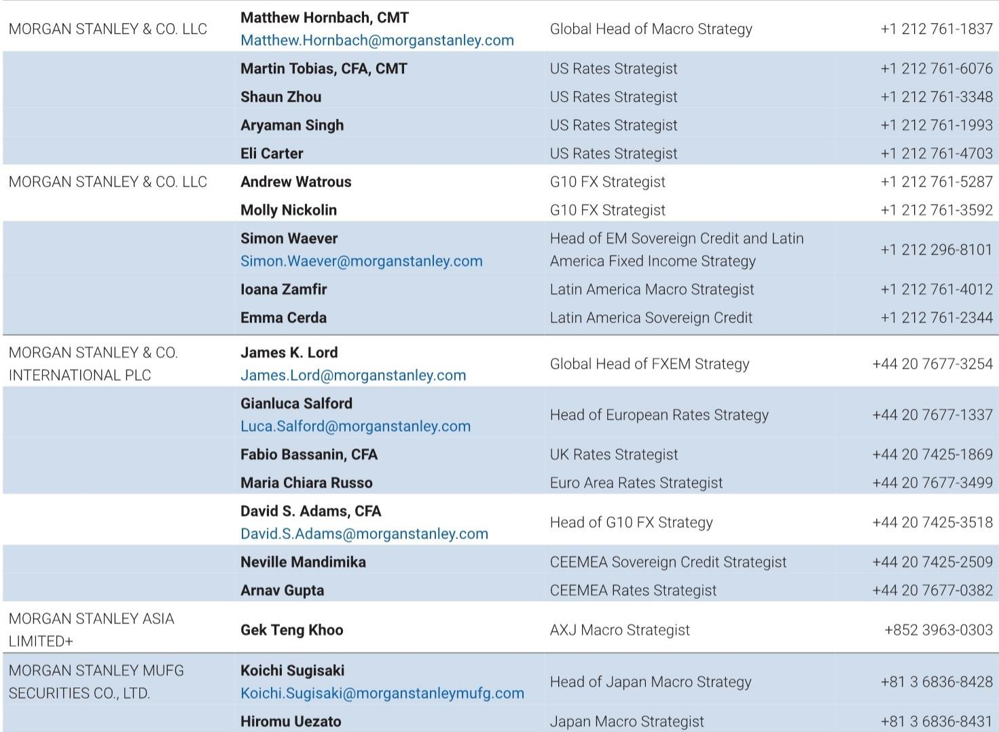
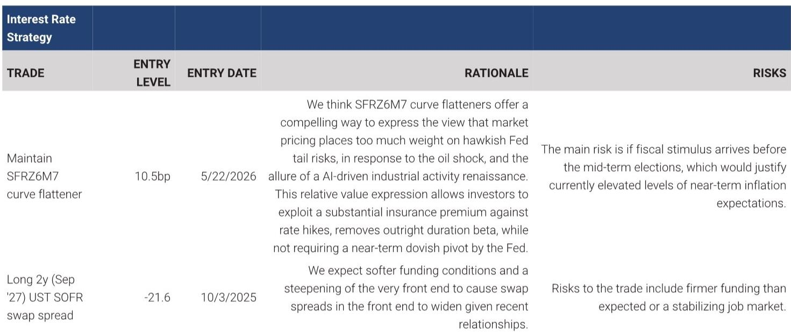
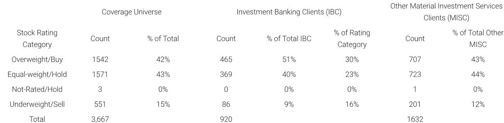

# 摩根斯坦利：MS：美债市场即将回归“格林斯潘时代”，波动率才是真正的分水岭

理解美联储未来的政策路径，市场习惯盯着利率水平——降息几次、终点利率在哪、点阵图如何移动。但MS全球宏观策略主管Matthew Hornbach团队在一份题为《Get Ready For the Noisiest US Front End In a Generation》的研报中，提出了一个完全不同的分析框架：决定利率市场“体质”的，不是利率的绝对水平，而是美联储使用的政策工具箱。而这一框架指向一个明确的结论——无论下一任美联储主席是谁，只要政策风格向格林斯潘时代回归，美债前端市场就将迎来一代人以来最嘈杂的交易环境。

这份报告的核心主张是：**不要只看利率水平，要看波动率的分布。** 基于对格林斯潘、伯南克、耶伦、鲍威尔四任主席任期内数据的拆解，MS发现，前端波动率和曲线形态波动率才是区分不同利率体制的真正标尺。在格林斯潘时代，前端是整条曲线的引擎，2年期收益率变动拉动整条曲线移动。而在耶伦时代，前端几乎静止，长端主导曲线。两者形成了近乎镜像的关系。

这一判断在当前市场环境下尤其重要。随着美联储缩表进程持续推进、前瞻指引的使用趋于克制，市场正在从耶伦/鲍威尔早期的“指引锚定”模式，向格林斯潘式的“市场定价”模式过渡。对于投资者而言，这意味着过去几年那种低波动、窄区间、曲线形态稳定的交易环境可能正在系统性改变。

> **KC评论：** MS不是在预测利率会涨还是会跌，而是在说“市场波动的性质”将发生根本变化。这对所有持有利率相关头寸的机构都是重要信号——即使你的方向判断对了，波动率环境的改变也会影响仓位管理和风险预算。完整报告中有36年的数据图表，清晰展示了四任主席期间前端波动率的阶梯式变化，值得仔细看。

## 1. 决定利率体制的不是主席本人，而是主席使用的工具箱

MS首先排除了一个常见的错误分类方式：按利率水平划分四任主席的任期。格林斯潘时期利率高，是因为1990年代利率整体处于高位。耶伦时期利率低，是因为她管理的是零利率环境。利率水平反映的是经济周期，不是主席的个性或风格。

真正有效的区分指标是前端波动率。报告用3个月期收益率的63天滚动标准差（年化）来衡量前端波动率，数据呈现出清晰的阶梯状：格林斯潘任期前端波动率约为110个基点（年化），伯南克期间下降，耶伦期间降至仅21个基点，鲍威尔期间回升至约60个基点。而长端（10年期）波动率在四任主席期间几乎没有变化，始终在90-100个基点附近。耶伦的21个基点之所以如此之低，是因为政策利率被钉在零，前端自然无法波动。

这一数据点出了关键结论：**不同主席任期的差异主要出现在曲线前端，而不是长端。** 前端波动率的高低，直接反映了美联储对市场的“控制力”有多强。耶伦的低波动率不是她个人的功劳，而是零利率+强前瞻指引这一工具组合的产物。同理，如果下一任主席减少对前瞻指引的依赖、缩表至更小规模，前端波动率就会向格林斯潘时代回归。

## 2. 格林斯潘时代：前端拉动整条曲线，2年期是“引擎”

这是整份报告最具分析穿透力的部分。MS构建了一个简单的相关性指标：2年期收益率日变动与2s10s曲线斜率日变动的相关性。逻辑非常直观——如果前端主导，2年期收益率上升（卖出）会使得曲线平坦化，两者反向运动，相关性为负。如果前端被锚定，长端决定斜率，两者同向运动，相关性为正。

数据结果令人印象深刻：格林斯潘任期内，这一相关性平均值约为-0.28，前端明显主导。耶伦任期内，平均值约为+0.29，长端主导而前端几乎不动。鲍威尔目前处于-0.13，部分回到了格林斯潘模式。伯南克接近零，处于两个世界的过渡期。

报告还用了另一个更直观的指标：前端（1个月-2年期）收益率变动占总曲线（1个月-30年期）变动的比例。在格林斯潘时代，前端解释了曲线约90%的变动。在耶伦时代，这一比例骤降至约10%。换句话说，格林斯潘时代的前端“就是”曲线本身，而耶伦时代的前端几乎可以忽略不计。

> **KC评论：** 这个“前端解释力”的指标对交易策略有直接含义。如果市场回归格林斯潘模式，那么2年期将重新成为曲线定价的锚点，而不是追随长端。那些基于“长端决定曲线”建立的相对价值交易可能需要重新评估。完整报告中包含了这一指标的滚动一年期图表，可以清晰看到不同体制间的切换时点。

## 3. 前瞻指引越少，曲线形态越不稳定——这可能是最被忽视的风险

大多数市场参与者关注前端波动率，但较少有人关注曲线形态的波动率。MS的数据显示，这两者高度联动。当一个主席减少前瞻指引，把更多定价工作交还给市场，不确定性不会停留在前端，而是沿着曲线向外扩散，体现在斜率和曲率的波动上。

报告测量了2s10s曲线斜率的63天滚动年化波动率，以及2s10s30s蝶式曲率的波动率。结果同样呈现清晰的阶梯状：格林斯潘的曲率波动率最高，约为80个基点；耶伦最低，约为44个基点；鲍威尔居中，约为52个基点。前瞻指引时代不仅压低了前端波动率，也压低了整条曲线的形态波动率。

报告特别指出，投资者往往低估这一部分。大多数人关注前端波动率，少数人关注曲线形态的波动率。如果下一任主席减少指引，两者将同时上升，而曲线形态波动率的上升可能让最多投资者措手不及。那些在低波动环境下建立的、基于曲线形态稳定的头寸，将是风险最高的仓位。

## 4. 回到格林斯潘工具箱，不等于利率水平回到1990年代

这是整份报告最容易被误解的地方。MS明确区分了“利率水平”和“利率行为”。格林斯潘工具箱——简短的声明、很少的前瞻指引、小规模的资产负债表——并不会改变利率的绝对水平。经济基本面决定利率水平。但工具箱会改变曲线的行为方式：前端移动更多，斜率和曲率波动更大，市场重新接手自2009年以来由前瞻指引承担的工作。

报告用一张“体制计分卡”将四任主席在三个波动率维度上同时排名。格林斯潘在前端波动率、斜率波动率、曲率波动率三个维度上均排名最高。耶伦在三个维度上均排名最低。伯南克和鲍威尔居中。这一计分卡直观地展示了：**体制切换不是单一维度的变化，而是整条曲线波动特征的系统性迁移。**

对于投资者而言，这意味着需要关注的不是“利率会升还是会降”，而是“利率会如何波动”。如果市场确实向格林斯潘模式回归，那么做多前端波动率和曲线形态波动率，而不是试图卖出波动率，将是更合理的策略。那些在低波动环境下建立的、依赖曲线形态稳定的头寸，可能面临系统性风险。

> **KC评论：** MS在报告末尾给出了两个具体的交易思路——维持SFRZ6M7曲线平坦化交易，以及维持2年期UST SOFR互换利差多头。但更重要的是，这些交易背后的逻辑框架。如果你想理解为什么这些交易在当前环境下有意义，以及如何根据这个框架构建自己的交易组合，完整报告中有详细的估值方法论和风险分析。

## 5. 报告尚未完全回答的关键问题：谁将成为下一任主席？

MS在整份报告中反复使用“如果下一任主席引导更少”的假设语气。这是报告逻辑链条中最关键但尚未完全回答的一环。报告的核心前提是政策工具箱决定利率体制，但谁将决定工具箱？下一任美联储主席的任命，以及国会可能对美联储独立性施加的影响，都会影响工具箱的选择。

报告提到了Warsh（凯文·沃什）作为潜在候选人，但并未深入分析不同候选人可能带来的工具箱差异。这是一个需要持续跟踪的关键变量。如果下一任主席倾向于更积极的前瞻指引，甚至推动更结构性的干预工具，那么格林斯潘式回归可能不会发生。反之，如果下一任主席倾向于更克制的干预、更依赖市场定价，那么报告描述的“一代人以来最嘈杂的前端”将成为现实。

此外，报告的分析基于美国市场，但全球利率市场的联动性意味着，如果美债前端波动率系统性上升，将通过套利和风险平价渠道传导至全球债券市场、外汇市场和新兴市场资产。这一二阶效应报告没有展开，但对于全球配置型投资者而言，这是必须纳入考量的因素。

## 6. 投资者的观察框架：从“利率水平”转向“波动率分布”

基于MS的分析框架，投资者可以从三个维度重新审视自己的利率敞口：

第一，监测前端波动率指标。报告使用的3个月期收益率63天滚动年化波动率是一个简单但有效的指标。如果这一指标从当前约60个基点的水平持续向100个基点以上移动，说明市场正在向格林斯潘模式靠拢。

第二，监测曲线形态波动率。2s10s斜率波动率和2s10s30s曲率波动率是更少人关注但同等重要的指标。如果这两个指标同步上升，说明波动率正在从前端向整条曲线扩散。

第三，重新评估相对价值交易的假设。过去几年，许多曲线交易和互换利差交易建立在“前端被锚定、曲线形态稳定”的假设之上。如果这一假设被打破，这些交易的风险回报特征将发生根本变化。MS的分析框架提供了一个重新审视这些假设的工具。

---

这份报告的价值不在于给出具体的利率预测，而在于提供了一个理解利率市场“体质”的分析框架。在美联储政策工具箱可能发生结构性变化的当下，这个框架比任何点阵图预测都更有指导意义。

我们每天会由AI agent加人工review生成国际投行中文摘要与KC评论，daily更新，约10-40页，也整理当天最新数据图表合集，既方便喂给AI，也方便人工快速把握market dynamics。欢迎来星球微信群里继续讨论这份报告中的曲线形态波动率指标、交易思路，以及下一任主席人选对工具箱的影响。

Personal reading notes and learning share only. Not investment advice.

