# U.S. Multi Industry & Electrical Equipment

# Data Center Chillers (1/3): Primer and free cooling economics

  
Varun Govindaraj

+1 917 344 8543

varun.govindaraj@bernsteinsg.com

Specialist Sales

Steve Song

+1 917 344 8401

steve.song@bernsteinsg.com

Chillers are a critical part of data center cooling infrastructure both in liquid-cooled and air-cooled environments. They are responsible for creating chilled facility water that then pumps to CDUs to extract heat from the coolant or to CRAHs to reduce the temperature of air blowing through the data center. We size this as a \~\$8B market in 2026 (fully loaded cost including installation and ancillaries), but the growth outlook can vary significantly based on how you think chiller penetration changes. Assuming no such changes (our base case), we project a \~20% CAGR for the market with 2030 estimated at \~\$16.5B.

We often hear debates of when it makes sense to use air-cooled vs. water cooled units. As a quick primer, both types of chillers operate using a refrigerant cycle, but air-cooled units reject heat from the refrigerant into ambient air, while water-cooled units reject to another water loop (either a cooling tower or a dry cooler). Air-cooled units are lower capex, but much less energy efficient. Water-cooled units need more upfront investment and consume large quantities of water (if a cooling tower is used), but tend to consume less power for the same tonnage. So it really is a sensitivity analysis of what you think your operating conditions and input costs will be when making the decision.

To illustrate this, we looked at how much it would cost to run an 800 ton chiller (roughly 2.5 MW) - assuming it was air-cooled or water-cooled. When the compressor of the chiller ran 24X7, annual operating costs were roughly 25% higher for an air-cooled chiller vs. a water-cooled unit, implying a \~3 year payback on the cost differential. So water-cooled units are always better, right?

It is not that simple. This dynamic can change quite drastically when you take free-cooling into account. Free-cooling is a when the ambient temperature drops enough for the data center operator to tone down (and in some cases switch off) the compressor in the chiller. It's a bit of a misnomer, the cooling isn't entirely free (you still need some power) but it's a fraction of what you'd need with the compressor running at 100%.

Energy consumption drops significantly for both air-cooled and water-cooled units. However, water costs stay relatively constant for water-cooled chillers (assuming a cooling tower is used). So as you spend more time in a free cooling environment, you may run into a situation where it is actually cheaper to operate an air-cooled chiller vs. a water-cooled chiller. This could be why we are hearing people talk about air-cooled chillers gaining share in the market.

We also spent some time benchmarking chiller offerings by key players available or announced in the market (like we did with our earlier primer on CDUs). We do not find the differences to be as stark; while there are some variations between companies, and they all have their own edge, we think these variations in specs are far outweighed by the overwhelming supply shortage and demand we are seeing for chillers today.

This is the first of our three part series on chillers. In part two, we will discuss “chiller gate” in more depth and in part three dive into the economics of servicing a chiller unit.

## BERNSTEIN TICKER TABLE

<table><tr><td rowspan="2"></td><td colspan="4">18 Jun 2026</td><td>TTM</td><td colspan="4">Adjusted EPS</td><td colspan="3">Adjusted P/E (x)</td></tr><tr><td></td><td></td><td rowspan="2">Closing Price</td><td rowspan="2">Price Target</td><td rowspan="2">Rel. Perf.</td><td rowspan="2">Cur</td><td rowspan="2">2025A</td><td rowspan="2">2026E</td><td rowspan="2">2027E</td><td rowspan="2">2025A</td><td rowspan="2">2026E</td><td rowspan="2">2027E</td></tr><tr><td>Ticker</td><td>Rating</td><td>Cur</td></tr><tr><td>TT (Trane)</td><td>O</td><td>USD</td><td>483.40</td><td>550.00</td><td>(10.5)%</td><td>USD</td><td>13.06</td><td>14.96</td><td>17.61</td><td>37.0</td><td>32.3</td><td>27.4</td></tr><tr><td>CARR (Carrier)</td><td>M</td><td>USD</td><td>71.81</td><td>75.00</td><td>(22.9)%</td><td>USD</td><td>2.57</td><td>2.81</td><td>3.20</td><td>27.9</td><td>25.6</td><td>22.4</td></tr><tr><td>JCI (Johnson Controls)</td><td>O</td><td>USD</td><td>144.82</td><td>176.00</td><td>14.3%</td><td>USD</td><td>3.78</td><td>5.06</td><td>6.04</td><td>38.3</td><td>28.6</td><td>24.0</td></tr><tr><td>VRT (Vertiv)</td><td>O</td><td>USD</td><td>333.05</td><td>416.00</td><td>154.0%</td><td>USD</td><td>4.20</td><td>6.52</td><td>9.21</td><td>79.3</td><td>51.1</td><td>36.2</td></tr><tr><td>SPX</td><td></td><td></td><td>7,500.58</td><td></td><td></td><td></td><td></td><td></td><td></td><td></td><td></td><td></td></tr></table>

O - Outperform, M - Market-Perform, U - Underperform, NR - Not Rated, CS - Coverage Suspended

Source: Bloomberg, Bernstein estimates and analysis.

## INVESTMENT IMPLICATIONS

We rate TT Outperform with a target price of \$550.

We rate CARR Market-perform with a target price of \$75.

We rate JCI Outperform with a target price of \$176.

We rate VRT Outperform with a target price of \$416.

Annual Operating costs (water + power)

EXHIBIT 1: When should you buy an air-cooled vs. water-cooled chiller?  
Annual OpEx differential in an 800-ton chiller (air-cooled vs. water-cooled)  
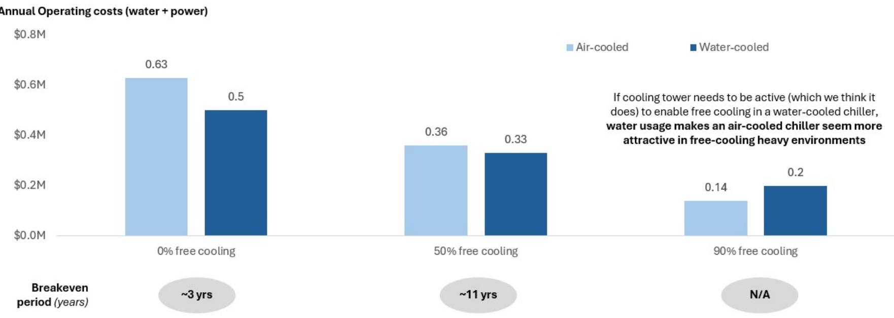  
If cooling tower needs to be active (which we think it does) to enable free cooling in a water-cooled chiller, water usage makes an air-cooled chiller seem more attractive in free-cooling heavy environments  
However, this is based on national averages for power and water costs; reality-will look quite different based on the region of operation  
Source: Bernstein Analysis and Estimates

EXHIBIT 2: Trade-offs by chiller type and regional variation  
Deciding between air-cooled and water-cooled chillers based on geography  
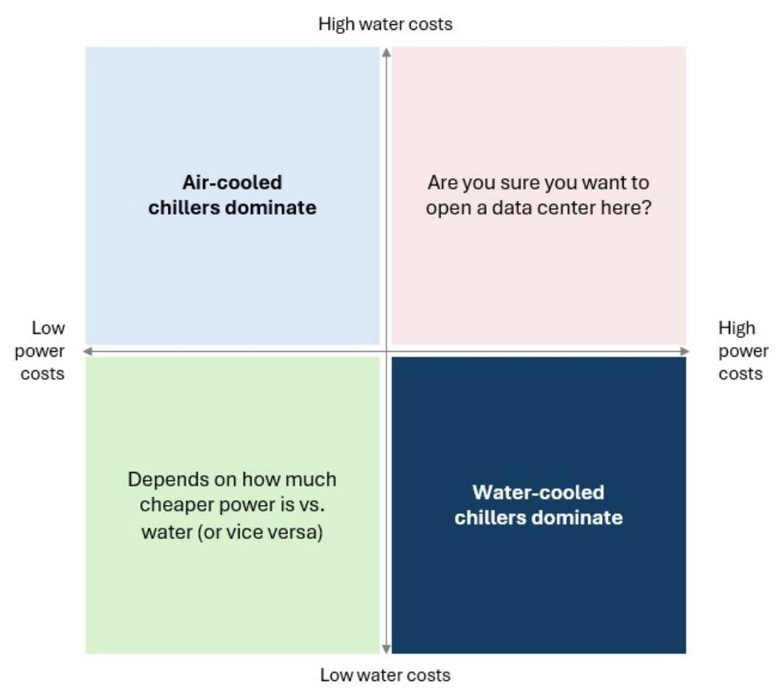  
Note: Power costs are \$10.25, \$6.26, \$6.7, \$9.19 per 100 kWh for NoVa, DFW, ATL, ORD from EIA; Water costs are \$12.5, \$11, \$20, \$10 for NoVa, DFW, ATL, ORD pulled from regional sites (actual industrial rates may vary); Numbers by region assume an 800-ton chiller operating

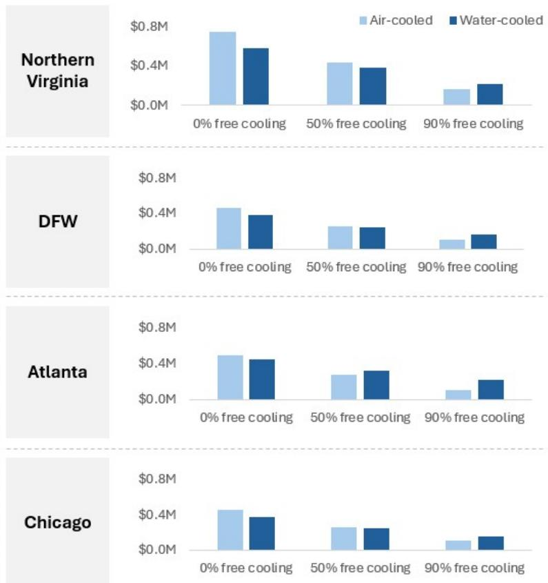

Source: Bernstein Analysis

## What is a chiller?

A chiller is a piece of equipment, which, as the name suggests, reduces the temperature of a stream of matter (usually a liquid). In the context of a data center, chillers are useful not only for liquid cooling (to cool the FWS) but also in air cooled environments where cold water flows to a CRAH to reduce the temperature of air that flows through it. Any chiller runs through a refrigerant compression cycle; this has four stages of operation as described below.

Evaporator: The warm liquid that needs to be chilled exchanges heat with cold liquid refrigerant in the chiller. This refrigerant picks up heat from the warm water and cools it, evaporating in the process.

Compressor: The most energy intensive part of a chiller. A compressor (scroll, screw, centrifugal) compresses the gaseous refrigerant, increasing its temperature. This is done to create a higher temperature gradient which makes heat transfer easier at a later stage.

Condenser: The hot, high-pressure, gaseous refrigerant comes into thermal contact with another stream of heat rejection (usually cool water in the case of a water-cooled chiller or ambient air in the case of an air-cooled chiller). The difference in temperature between the hot refrigerant and the cool heat sink facilitates heat rejection from the former to the latter. The refrigerant temperature lowers, and it condenses as a result (reverting to a liquid state).

Expansion valve: High pressure, liquid refrigerant passes through an expansion valve. This rapidly reduces pressure, which in turn reduces the temperature of the refrigerant (but keeps it in a liquid state). From here, the liquid refrigerant flows back to the evaporator and the cycle repeats.

EXHIBIT 3: Physics of Chiller Operation  
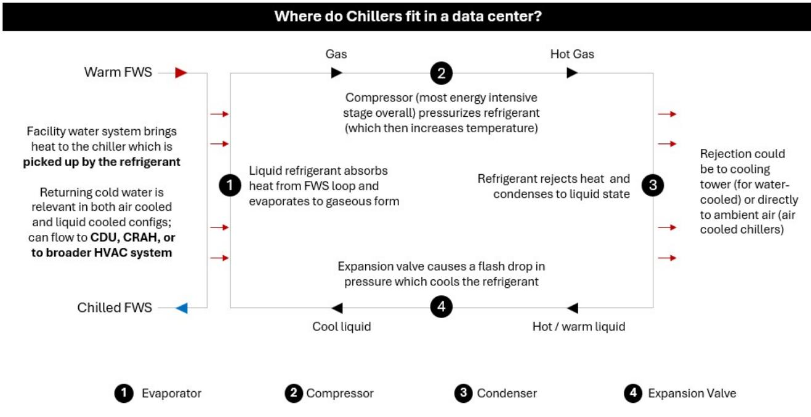

## Types of chillers

In general, comparisons are made between two types of chillers - air-cooled and water-cooled. The differences due to how the condenser rejects heat to the environment; if air is used it is air-cooled, if water is used (either through a dry cooler, or more commonly a cooling tower) it is water-cooled. There are some performance trade-offs from choosing one type of chiller vs. another. Air-cooled units are much less energy efficient (\~30% worse than water-cooled unit) but have lower up front capex and do not require any water to operate. In contrast, water cooled chillers are much better at heat transfer to the environment, so the compressor needs to do less work reducing their energy bill. But they do need water in most cases (although some dry cooler configurations solve that issue) which can shift the balance (especially in free-cooling environments where power usage for both air-cooled and water-cooled chillers drops significantly while water consumption stays relatively constant). We explore this cost-benefit analysis later in our note.

EXHIBIT 4: Air-cooled vs. Water-cooled Chillers  
  
Source: Bernstein Analysis and Estimates, Company Reports

More as a point of clarification, we would also like to highlight the different types of compressors in chillers. OEMs regularly talk about scroll vs. screw vs. centrifugal chillers, and it is worth understanding how they differ. Scroll chillers generally do not see data center applications; they are small, simple, silent units with limited ability to scale. Screw compressors are mid-sized units and see data center deployment. They are more complex and better at handling variable loads. Finally, centrifugal compressors see deployment in large scale data center environments; most OEM flagship products launched today are centrifugal chillers. These are the most complex, and require significant engineering to stand up but also deliver the most cooling power.

EXHIBIT 5: Comparison of compressors  
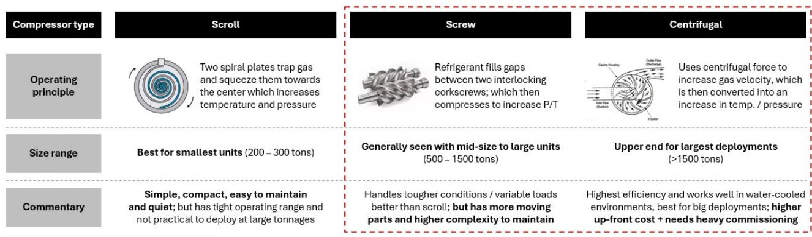  
Source: Images from Atlas Copco and Engineeringlearn.com

Most appropriate for data center loads

Source: Bernstein Analysis

## How big is the market?

We have seen a wide dispersion of market sizes for chillers. Part of it also depends on what you are referencing - just the unit, or all the ancillary pieces that come with it? We have used a top-down estimate to size the overall market using GW added as a starting point. While we do have a base / bull / bear case for chillers in the exhibit below, these are based on variation in chiller penetration (not in terms of GW added). Our approach is as follows.

First, we look at new GW capacity being added each year. This creates a thermal baseline in terms of power consumed. Most of that power is released from chips, with an additional factor (assumed to be 1.2x in our model) to account for power wastage and headroom for safety. Next, we assume a cost per ton of \$1,500. This is a blend of both air cooled and water cooled chiller capex and includes the unit, engineering + commissioning + any supporting equipment that is needed (pumps, cooling towers, etc.). Finally, we multiply this by the share of GW that are cooled using chillers (75% in 2026 since it is how the majority of cooling takes place, but with base, bear, and bull cases for chillers based on how that could evolve). We size the fully loaded market for chillers at \~\$8B in 2026, growing to \~\$16.5B in 2030 assuming chillers continue to cool the same share of DC compute. In our bear case, where dry coolers steal share, the number drops to \~\$9B, while in the bull case where chillers gain share we size it at \~\$20B. This implies annual growth rates of \~20%, <5%, and >25% in the base, bear, and bull cases respectively.

Naturally, this model is sensitive to any assumptions you may have (especially GW added which can vary substantially between sources). The benefit of our approach is that one can relatively easily modify these assumptions and see what the market would be accordingly.

EXHIBIT 6: Chiller Market Size (Fully loaded) by Scenario  
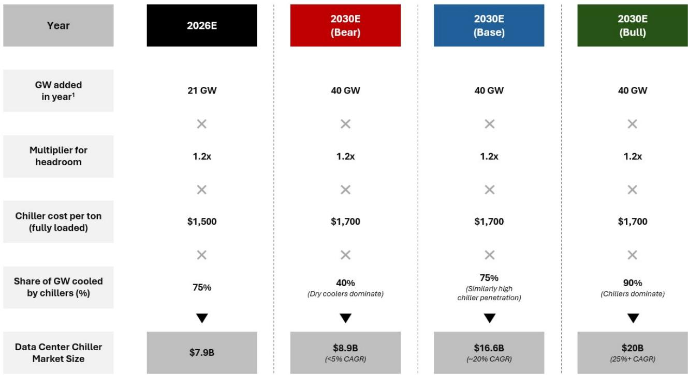  
Source: Bernstein Analysis and Estimates, McKinsey Data Center Model (for GW), CSE mag for cost per ton with 3% annual inflation

## Air vs. Water ... what's better?

Both air-cooled and water-cooled chillers have clear niches. Generally, air-cooled chillers make more sense when power costs are low (because they consume more power at a given tonnage vs. water-cooled chillers) or if water costs are high / water is limited / unavailable. In contrast, water-cooled chillers make sense in water-rich environments / when water costs are low or when power costs are high (since they are more energy efficient). When running at 100%, the extra cost of using water in a water-cooled chiller is more than offset by the savings in power.

However, this dynamic does change when you start to leverage free cooling (especially if you have a water-side economizer). In this environment, the compressor is switched off / used less, significantly reducing power consumption. But water consumption from a cooling tower continues, which keeps water costs relatively constant. At very high free cooling ratios, this could mean that the power savings from using a water-cooled chiller are actually offset by the cost of water. Given the increased focus on

water management in data centers (some counties have even capped the amount of water a data center can consume) we think it could help make the case for air-cooled chillers long-term over water-cooled units. The only exception is when the water-cooled chiller uses a dry cooler vs. a cooling tower (which JCI now advertises as possible with their new York HT chiller unit, although this likely comes with higher power costs due to higher lift).

EXHIBIT 7: Water costs can overtake power in modes with high free cooling (assumes use of cooling tower)  
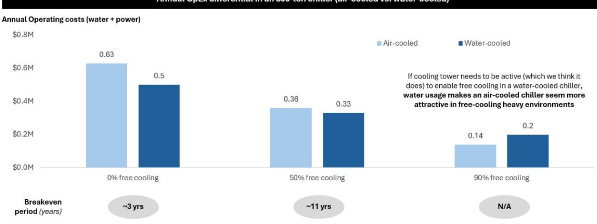  
However, this is based on national averages for power and water costs; reality-will look quite different based on the region of operation

## Source: Bernstein Analysis and Estimates

There is some variation by geography, largely dependent on the ration of power to water costs. In areas like Atlanta, where water costs seem to be high, air-cooled outperform water cooled chillers with as little as 50% free cooling while in most other key data center markets in the US, it takes more free cooling before the attractiveness flips. We are hearing from players in the space that air-cooled chillers are gaining popularity over water-cooled units (although the latter still remains important).

EXHIBIT 8: Air-cooled vs. Water-cooled; when do you deploy it?  
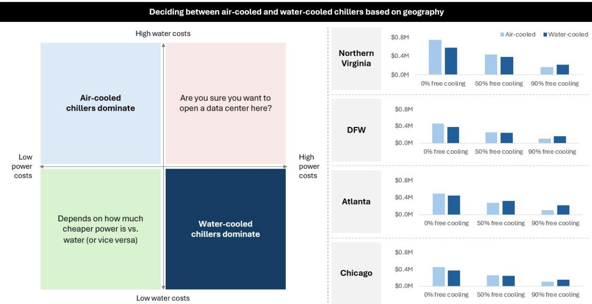  
Note: Power costs are \$10.25, \$6.26, \$6.7, \$9.19 per 100 kWh for NoVa, DFW, ATL, ORD from EIA; Water costs are \$12.5, \$11, \$20, \$10 for NoVa, DFW, ATL, ORD pulled from regional sites (actual industrial rates may vary); Numbers by region assume an 800-ton chiller operating

Source: Bernstein Analysis and Estimates, EIA

We reached our estimates on water consumption using EPA guidelines on cooling towers; $\sim 1.8$ gallon per ton-hour of cooling as evaporation and another $\sim 0.5$ gallons per ton-hour for blow down (purge of liquid to eliminate dissolved solids).

EXHIBIT 9: How much water does a water-cooled chiller use?  
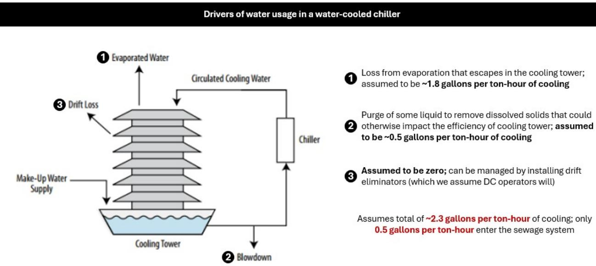  
Source: EPA, Bernstein Analysis and Estimates

## Competitor benchmarking of products

Broadly, we think Trane, JCI, and Carrier all have strong products. On the air-cooled side, JCI and Carrier have announced new products in 2026 (we have not been able to find anything from Trane). As a result, some metrics (restart time, capacity per square foot) seem to lag flagship products from competitors (although it is very likely Trane will announce a new product at some point). Vertiv is taking a different positioning to the market with a trim cooler; it still has a chiller in it but seems to operate like a dry cooler for most of the time (enabling lower energy costs). Visually, it looks like an air cooled chiller. Vertiv does have a separate chiller line as well, but we could not find it displayed on their US website.

On the water cooled side, all three major chiller players have their own areas of differentiation. Trane has the biggest product at 21MW. JCI advertises its lift of $110^{0}\mathrm{F}$ which enables use of a dry cooler even in hot climates and eliminates water usage. Carrier talks about a short restart time under 3 minutes. Many of these products still do not have full spec sheets available, so we will need to wait and see before passing a verdict. But given the current market we are in, it really doesn't matter all that much. These are all great products (unlike with CDUs where we saw meaningful differentiation among Vertiv, Trane, Carrier, JCI) and given the commentary on demand, we expect these companies to continue to see strong order booking and the broader chiller space to remain capacity-constrained.

EXHIBIT 10: Comparison of flagship air-cooler chiller specs.  
Data Center Chiller Comparison

<table><tr><td rowspan="2">Company / Product</td><td colspan="4">Air-Cooled</td></tr><tr><td>TT</td><td>JCI</td><td>CARR</td><td>VRT</td></tr><tr><td>Model number</td><td>TCAB850</td><td>YDAM</td><td>AquaEdge 30CF</td><td>CoolLoop Trim Cooler1</td></tr><tr><td>Announce date</td><td>Mar 2025</td><td>Feb 2026</td><td>Feb 2026</td><td>Mar 2025</td></tr><tr><td>Capacity</td><td>Up to 3 MW</td><td>Up to 3.5 MW</td><td>“More than” 3 MW</td><td>Up to 3 MW</td></tr><tr><td>Pump type</td><td>Centrifugal</td><td>Centrifugal</td><td>Centrifugal</td><td>Unclear</td></tr><tr><td>Bearing type</td><td>Magnetic</td><td>Magnetic</td><td>Magnetic</td><td>N/A Assumed Oil</td></tr><tr><td>Footprint</td><td>~5.3 kW/sq. ft</td><td>~7.8 kW/sq. ft</td><td>N/A</td><td>~7.3 kW/sq. ft</td></tr><tr><td>Free Cooling</td><td>Compressor assisted</td><td>Compressor assisted</td><td>Unclear Could be coil / compressor assisted</td><td>Cooling coils</td></tr><tr><td>Operating temp range</td><td>-29°C to 54°C</td><td>-29°C to 54°C (Assumed YVAM)</td><td>-29°C to 60°C</td><td>-20°C to 52°C</td></tr><tr><td>Restart time</td><td>100% in ~4 minutes</td><td>100% in under 3 minutes</td><td>100% in under 3 minutes</td><td>N/A</td></tr></table>

1. Magnetic Bearing Chiller Available, but not on US website and capacity is 2MW; uses high GWP refrigerant  
Source: Bernstein Analysis, Company Reports

EXHIBIT 11: Comparison of flagship water-cooled chiller specs

<table><tr><td colspan="5">Data Center Chiller Comparison</td></tr><tr><td rowspan="2">Company / Product</td><td colspan="4">Water-Cooled</td></tr><tr><td>TT</td><td>JCI</td><td>CARR</td><td>VRT</td></tr><tr><td>Model number</td><td>CenTraVac CDHH</td><td>York HT</td><td>AquaEdge 19MV4</td><td></td></tr><tr><td>Announce date</td><td>Launched in 2020, but has seen refreshes</td><td>Feb 2026</td><td>April 2026</td><td></td></tr><tr><td>Capacity</td><td>Up to 21 MW</td><td>~11 MW</td><td>~3 MW</td><td></td></tr><tr><td>Pump type</td><td>Centrifugal</td><td>Centrifugal</td><td>Centrifugal</td><td></td></tr><tr><td>COP</td><td>~7.0</td><td>N/A</td><td>~6.7</td><td>While Vertiv seems to have a water-cooled chiller, we do not see it advertised on the North America website</td></tr><tr><td>Lift</td><td>80°F</td><td>110°F Allows zero water usage by pairing with dry coolers</td><td>N/A</td><td></td></tr><tr><td>Free Cooling</td><td>Yes (up to 45% of capacity)</td><td>Flash tank economizer</td><td>Unclear, but assumed yes</td><td></td></tr><tr><td>Operating temp range</td><td>N/A</td><td>N/A</td><td>Up to 55°C</td><td></td></tr><tr><td>Restart time</td><td>100% in ~4 minutes</td><td>N/A</td><td>100% in under 2.5 minutes</td><td></td></tr></table>

Source: Bernstein Analysis, Company Reports

The authors would like to thank Bhavik Kotecha for his contributions to this note.

## I. REQUIRED DISCLOSURES

References to "Bernstein" or the "Firm" in these disclosures relate to the following entities: Bernstein Institutional Services LLC (April 1, 2024 onwards), Bernstein & Co., LLC (pre April 1, 2024), Bernstein Autonomous LLP, BSG France S.A. (April 1, 2024 onwards), Bernstein (Hong Kong) Limited 盛博香港有限公司, Bernstein (Canada) Limited, Bernstein (India) Private Limited (SEBI registration no. INH000006378), Bernstein (Singapore) Private Limited, Bernstein Japan KK (サンフォード・C・バーンスタイン株式会社) and analysts employed by SG Africa Technologies & Services to produce Bernstein under a Global Services Agreement in place between Bernstein and SG.

Bernstein is part of a joint venture between SG (SG) and AllianceBernstein, L.P. (AB). Unless specifically noted otherwise, for purposes of these disclosures, references to Bernstein's “affiliates” relate to both SG and AB and their respective affiliates.

## VALUATION METHODOLOGY

## Trane Technologies PLC

We value Trane at 22x NTM + 1 EBITDA of \$5.6B to reach our target price of \$550.

## Carrier Global Corporation

We value Carrier using an 18x EV/EBIT ratio and an NTM + 1 EBIT estimate of \$3.9B to reach our target price of \$75.

## Johnson Controls International PLC

We value JCI using a 20x EV/EBITDA ratio and an NTM + 1 EBITDA estimate of \$5.9B to reach our target price of \$176.

## Vertiv Holdings Co

We value Vertiv at 32x NTM + 1 EBITDA of \$5.1B to reach our target price of \$416.

## RISKS

## Trane Technologies PLC

Downside: (i) Price fixing lawsuit escalates for Trane, (ii) More players achieve similar level of product innovation in CDUs / broader liquid cooling, (iii) Residential / transport numbers deteriorate further than expected, (iv) Chiller headwinds (both sales and service) outweigh liquid cooling tailwind

## Carrier Global Corporation

Upside: (i) Resi / light commercial cycle turns in the US (we think this is easily the biggest driver for Carrier looking ahead), (ii) Continued growth in data centers (we'd be especially impressed if this came from CDUs) (iii) Policy changes in the UK / Germany driving heat pump uptake

Downside: (i) Escalation of price fixing lawsuit (Carrier uniquely exposed, (ii) Slowing of data center CapEx by hyperscalers, (iii) Supply of R-410A does not tighten as expected / drags out for longer

## Johnson Controls International PLC

Downside: Lean transformation does not successfully cascade through org., Data center weakness from chiller headwinds, Operating leverage <50% based on management guidance

## Vertiv Holdings Co

Downside: (i) Efficiency increasing to the point where less cooling needed, (ii) Unexpected slowing of data center expansion, (iii) Faster than expected shift away from NVIDIA chips to custom silicon (impacts Vertiv because of strong relationships), (iv) Tech.

## shift away from DTC / 800 VDC if Vertiv can't react fast enough

## RATINGS DEFINITIONS, BENCHMARKS AND DISTRIBUTION

## EQUITY RATINGS DEFINITIONS

## Bernstein brand

The Bernstein brand rates stocks based on forecasts of relative performance for the next 12 months versus the S&P 500 for stocks listed on the U.S. and Canadian exchanges, versus the Bloomberg Europe Developed Markets Large and Mid Cap Price Return Index EUR (EDME) for stocks listed on the European exchanges and emerging markets exchanges outside of the Asia Pacific region, versus the Bloomberg Japan Large and Mid Cap Price Return Index USD (JPL) for stocks listed on the Japanese exchanges, and versus the Bloomberg Asia ex-Japan Large and Mid Cap Price Return Index (ASIAX) for stocks listed on the Asian (ex-Japan) exchanges -unless otherwise specified.

The Bernstein brand has three categories of ratings:

\- Outperform: Stock will outpace the market index by more than 15 pp

• Market-Perform: Stock will perform in line with the market index to within +/-15 pp

• Underperform: Stock will trail the performance of the market index by more than 15 pp

Coverage Suspended: Coverage of a company under the Bernstein brand has been suspended. Ratings and price targets are suspended temporarily, are no longer current, and should therefore not be relied upon.

Not Rated: A rating assigned when the stock cannot be accurately valued, or the performance of the company accurately predicted, at the present time. The covering analyst may continue to publish research reports on the company to update investors on events and developments.

Not Covered (NC) denotes companies that are not under coverage.

Bernstein brand stock ratings are based on a 12-month time horizon.

## Autonomous brand – common stocks

The Autonomous brand rates common stocks as indicated below. As our benchmarks we use the Bloomberg Europe 500 Banks And Financial Services Index (BEBANKS) and Bloomberg Europe Dev Mkt Financials Large and Mid Cap Price Ret Index EUR (EDMFI) index for developed European banks and Payments, the Bloomberg Europe 500 Insurance Index (BEINSUR) for European insurers, the S&P 500 and S&P Financials for US banks and Payments coverage, S5LIFE for US Insurance, the S&P Insurance Select Industry (SPSIINS) for US Non-Life Insurers coverage, and the Bloomberg Emerging Markets Financials Large, Mid and Small Cap Price Return Index (EMLSF) for emerging market banks and insurers and Payments. Ratings are stated relative to the sector (not the market).

The Autonomous brand has three categories of common stock ratings:

\- Outperform (OP): Stock will outpace the relevant index by more than 10 pp

\- Neutral (N): Stock will perform in line with the market index to within +/-10 pp

\- Underperform (UP): Stock will trail the performance of the relevant index by more than 10 pp

Coverage Suspended: Coverage of a company under the Autonomous research brand has been suspended. Ratings and price targets are suspended temporarily, are no longer current, and should therefore not be relied upon.

Not Rated: A rating assigned when the stock cannot be accurately valued, or the performance of the company accurately predicted, at the present time. The covering analyst may continue to publish research reports on the company to update investors on events and developments.

Those denoted as ‘Feature’ (e.g., Feature Outperform FOP, Feature Under Outperform FUP) are our core ideas.

Not Covered (NC) denotes companies that are not under coverage.

Autonomous brand common stock ratings are based on a 12-month time horizon.

## Autonomous brand – preferred stocks

The Autonomous brand has three categories of preferred stock ratings:

\- Outperform (OP): The total return of the preferred instrument is expected to outperform preferred securities of other issuers operating in similar sectors or rating categories over the next six months.

\- Neutral (N): The total return of the preferred instrument is expected to perform in line with preferred securities of other issuers operating in similar sectors or rating categories over the next six months.

\- Underperform (UP): The total return of the preferred instrument is expected to underperform preferred securities of other issuers operating in similar sectors or rating categories over the next six months.

Autonomous preferred stock ratings are based on a 6-month time horizon.

## AUTONOMOUS CREDIT RESEARCH

Where this report contains investment recommendations for credit instruments, as defined in article 3(1)(35) of the Market Abuse Regulation, the information below is presented to comply with its disclosure requirements.

The report may also include reference(s) to published opinions by other Autonomous or Bernstein analysts covering the equity securities of the issuer(s) referenced herein. Please note an investment recommendation for credit instruments published by the author(s) of this report may differ from the published view of the analyst covering equity securities for the issuer(s) contained in this report and vice versa.

## CREDIT RATINGS DEFINITIONS

The Autonomous brand has three categories of credit ratings:

\- Credit Outperform (C-OP): The total return of the Reference Credit Instrument is expected to outperform the credit spread of bonds of other issuers operating in similar sectors or rating categories over the next six months.

\- Credit Neutral (C-N): The total return of the Reference Credit Instrument is expected to perform in line with the credit spread of bonds of other issuers operating in similar sectors or rating categories over the next six months.

\- Credit Underperform (C-UP): The total return of the Reference Credit Instrument is expected to underperform the credit spread of bonds of other issuers operating in similar sectors or rating categories over the next six months.

Autonomous credit ratings are based on a 6-month time horizon.

A list of all investment recommendations produced by the author(s) of this report alongside credit ratings history are available upon request.

It is at the sole discretion of the Firm as to when to initiate, update and cease research coverage. The Firm has established, maintains and relies on information barriers to control the flow of information contained in one or more areas (i.e. the private side) within the Firm, and into other areas, units, groups or affiliates (i.e. public side) of the Firm

DISTRIBUTION OF EQUITY RATINGS/INVESTMENT BANKING SERVICES

<table><tr><td>Equity Rating</td><td>Market Abuse Regulation (MAR) and FINRA Rating Category</td><td>Global Rating Distribution</td><td>Investment Banking Relationships*</td></tr><tr><td>Outperform</td><td>BUY</td><td>51.1%</td><td>16.5%</td></tr><tr><td>Market-Perform (Bernstein Brand) Neutral (Autonomous Brand)</td><td>HOLD</td><td>36.3%</td><td>17.8%</td></tr><tr><td>Underperform</td><td>SELL</td><td>12.6%</td><td>14.9%</td></tr></table>

\* These figures represent the percentage of companies within each equity rating category for which affiliates of Bernstein have provided investment banking services within the previous 12 months.
As of March 31, 2026. All figures are updated quarterly.

## PRICE CHARTS / RATINGS AND PRICE TARGET HISTORY

Outperform (O); Market-Perform (M); Underperform (U); Coverage Suspended (CS); Not Covered (NC)  
Trane Technologies PLC (TT) Rating History for Bernstein as of 06/19/2026  
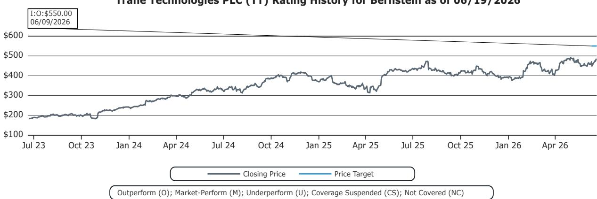

Carrier Global Corporation (CARR) Rating History for Bernstein as of 06/19/2026  
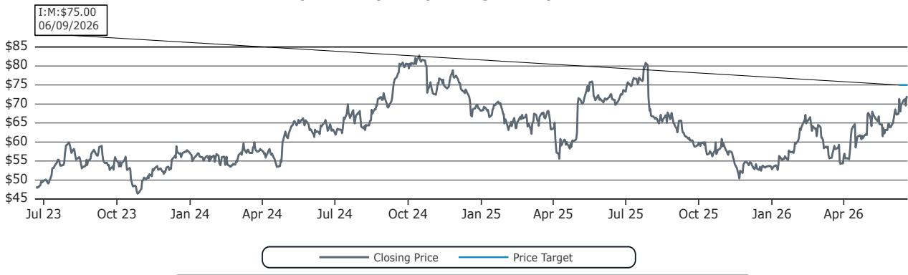

Johnson Controls International PLC (JCI) Rating History for Bernstein as of 06/19/2026  
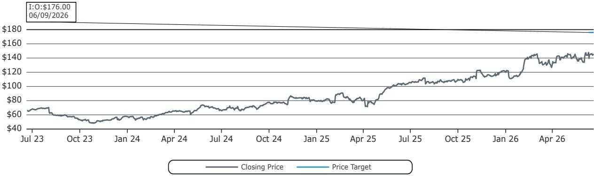  
Outperform (O); Market-Perform (M); Underperform (U); Coverage Suspended (CS); Not Covered (NC)

Vertiv Holdings Co (VRT) Rating History for Bernstein as of 06/19/2026  
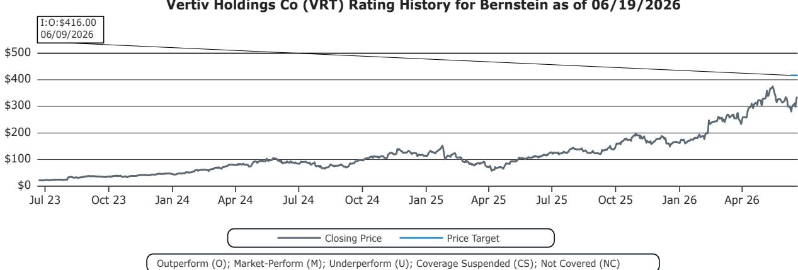  
All price target and closing price data in the chart(s) above are denominated in the currency noted in the Ticker Table of this report.

## CONFLICTS OF INTEREST

Bernstein Autonomous LLP or BSG France SA, beneficially, has either a net long or short position of 0.5% or more of the total issued share capital of a class of common equity securities of the following MiFID eligible securities: Trane Technologies PLC and Carrier Global Corporation.

SG and/or its affiliates beneficially own 0.5% or more of [the total issued share capital/any class of common equity securities] with a net [long/short] position of: Trane Technologies PLC.

Bernstein and/or affiliates have received compensation for non-investment banking securities-related products or services in the previous twelve months from the following clients: Carrier Global Corporation.

Certain affiliates of Bernstein act as market maker or liquidity provider in the equities securities of: Trane Technologies PLC, Carrier Global Corporation, Johnson Controls International PLC and Vertiv Holdings Co.

Certain affiliates of Bernstein act as market maker or liquidity provider in the debt securities of: Carrier Global Corporation.

## OTHER MATTERS

The legal entity(ies) employing the analyst(s) listed in this report, and their location, can be determined by the country code of their phone number, as follows:

+1 Bernstein Institutional Services LLC; New York, New York, USA

+44 Bernstein Autonomous LLP; London UK

+212 SG Africa Technologies & Services; Casablanca, Morocco

+33 BSG France S.A.; Paris, France

+34 BSG France S.A.; Madrid, Spain

+41 Bernstein Autonomous LLP; Geneva, Switzerland

+49 BSG France S.A.; Frankfurt, Germany

+91 Bernstein (India) Private Limited; Mumbai, India

+852 Bernstein (Hong Kong) Limited 盛博香港有限公司; Hong Kong, China

+65 Bernstein (Singapore) Private Limited; Singapore

+81 Bernstein Japan KK; Tokyo, Japan

Where this report has been prepared by research analyst(s) employed by a non-US affiliate, such analyst(s), is/are (unless otherwise expressly noted below) not registered as associated persons of Bernstein Institutional Services LLC or any other SEC-registered broker-dealer and are not licensed or qualified as research analysts with FINRA. Accordingly, such analyst(s) may not be subject to FINRA's restrictions regarding (among other things) communications by research analysts with a subject company, interactions between research analysts and investment banking personnel, participation by research analysts in solicitation and marketing activities relating to investment banking transactions, public appearances by research analysts, and trading securities held by a research analyst account.

Where this report has been prepared by research analyst(s) employed by SG Africa Technologies & Services (part of the SG group of companies), it has been prepared on behalf of a Bernstein company under a Global Services Agreement in place between Bernstein and SG.

## CERTIFICATION

Each research analyst listed in this report, who is primarily responsible for the preparation of the content of this report, certifies that all of the views expressed in this publication accurately reflect that analyst's personal views about any and all of the subject securities or issuers and that no part of that analyst's compensation was, is, or will be, directly or indirectly, related to the specific recommendations or views in this publication.

## II. ADDITIONAL GLOBAL CONFLICT DISCLOSURES

It is at the sole discretion of the Firm as to when to initiate, update and cease research coverage. The Firm has established, maintains and relies on information barriers to control the flow of information contained in one or more areas (i.e., the private side) within the Firm, and into other areas, units, groups or affiliates (i.e., public side) of the Firm.

## III. OTHER IMPORTANT INFORMATION AND DISCLOSURES

Separate branding is maintained for “Bernstein” and “Autonomous” research products.

\- Bernstein produces a number of different types of research products including, among others, fundamental analysis and quantitative analysis under both the “Autonomous” and “Bernstein” brands. Recommendations contained within one type of research product may differ from recommendations contained within other types of research products, whether as a result of differing time horizons, methodologies or otherwise. Furthermore, views or recommendations within a research product issued under one brand may differ from views or recommendations under the same type of research product issued under the other brand. The Research Ratings System for the two brands and other information related to those Rating Systems are included in the previous section.

\- Autonomous operates as a separate business unit within the following entities: Bernstein Institutional Services LLC, Bernstein Autonomous LLP, Bernstein (Hong Kong) Limited 盛博香港有限公司 and Bernstein (India) Private Limited. For information relating to “Autonomous” branded products (including certain Sales materials) please visit: www.autonomous.com. For information relating to Bernstein branded products please visit: www.bernsteinresearch.com.

Analysts are compensated based on aggregate contributions to the research franchise as measured by account penetration, productivity and proactivity of investment ideas. No analysts are compensated based on performance in, or contributions to, generating investment banking revenues.

This report has been produced by an independent analyst as defined in Article 3 (1)(34)(i) of EU 596/2014 Market Abuse Regulation (“MAR”) and the same article of MAR as it forms part of United Kingdom domestic law by virtue of the European Union (Withdrawal) Act 2018.

To our readers in the United States: Bernstein Institutional Services LLC, a broker-dealer registered with the U.S. Securities and Exchange Commission (“SEC”) and a member of the U.S. Financial Industry Regulatory Authority, Inc. (“FINRA”) is distributing this publication in the United States and accepts responsibility for its contents. Where this material contains an analysis of debt product(s), such material is intended only for institutional investors and is not subject to the US independence and disclosure standards applicable to debt research prepared for retail investors.

Bernstein Institutional Services LLC may act as principal for its own account or as agent for another person (including an affiliate) in sales or purchases of any security which is a subject of this report. This report does not purport to meet the objectives or needs

of any specific individuals, entities or accounts.

To our readers in Canada: If this publication pertains to a Canadian domiciled company, it is being distributed in Canada by Bernstein (Canada) Limited, which is licensed and regulated by the Canadian Investment Regulatory Organization. If the publication pertains to a non-Canadian domiciled company, it is being distributed by Bernstein Institutional Services LLC, which is licensed and regulated by both the SEC and FINRA, into Canada under the International Dealers Exemption.

This document may not be passed onto any person in Canada unless that person qualifies as "permitted client" as defined in Section 1.1 of NI 31-103.

To our readers in Brazil: This report has been prepared by Bernstein Institutional Services LLC, and Banco BTG Pactual S.A. ("BTG") is responsible for the distribution of this report in Brazil.

To readers in the United Kingdom: This publication has been issued or approved for issue in the United Kingdom by Bernstein Autonomous LLP, authorised and regulated by the Financial Conduct Authority and located at 60 London Wall, London EC2M 5SH, +44 (0)20-7170-5000. Registered in England & Wales No OC343985.

This document is for distribution only to persons who (i) have professional experience in matters relating to investments falling within Article 19(5) of the Financial Services and Markets Act 2000 (Financial Promotion) Order 2005 (as amended, the “Financial Promotion Order”), (ii) are persons falling within Article 49(2)(a) to (d) (“high net worth companies, unincorporated associations, etc.”) of the Financial Promotion Order, (iii) are outside the United Kingdom, or (iv) are persons to whom an invitation or inducement to engage in investment activity (within the meaning of section 21 of the FSMA) in connection with the issue or sale of any securities may otherwise lawfully be communicated or caused to be communicated (all such persons together being referred to as “relevant persons”). This document is directed only at relevant persons and must not be acted on or relied on by persons who are not relevant persons. Any investment or investment activity to which this document relates is available only to relevant persons and will be engaged in only with relevant persons.

To our readers in the member states of the EEA: This publication is being distributed by BSG France SA, which is authorised and regulated by the Autorité de Contrôle Prudentiel et de Résolution (ACPR) and Autorité des Marchés Financiers (AMF).

To our readers in Hong Kong: This publication is being distributed in Hong Kong by Bernstein (Hong Kong) Limited 盛博香港有限公司, which is licensed and regulated by the Hong Kong Securities and Futures Commission (Central Entity No. AXC846) to carry out Type 4 (Advising on Securities) regulated activities and subject to the licensing conditions mentioned in the SFC Public Register (https://www.sfc.hk/publicregWeb/corp/AXC846/details)). This publication is solely for professional investors, as defined in the Securities and Futures Ordinance (Cap. 571). The purpose of this report is solely to provide an analysis of the issuers referred to in this report and is not intended for any purpose contrary to the laws of Hong Kong.

To our readers in Singapore: This publication is being distributed in Singapore by Bernstein (Singapore) Private Limited, only to accredited investors or institutional investors, as defined in the Securities and Futures Act 2001 of Singapore ("SFA"). Recipients in Singapore should contact Bernstein (Singapore) Private Limited in respect of matters arising from, or in connection with, this publication. Bernstein (Singapore) Private Limited is regulated by the Monetary Authority of Singapore and licensed under the SFA as a capital markets services licence holder for dealing in capital markets products that are securities and collective investment schemes and an exempt financial adviser for advising on, issuing and promulgating analyses and reports on securities. Bernstein (Singapore) Private Limited is registered in Singapore with Company Registration No. 20213710W and located at 8 Marina Boulevard, #12-01, Marina Bay Financial Centre, Singapore 018981, +65-6326-7000.

To our readers in the People's Republic of China: The securities referred to in this document are not being offered or sold and may not be offered or sold, directly or indirectly, in the People's Republic of China (for such purposes, not including the Hong Kong and Macau Special Administrative Regions or Taiwan, the "PRC") in contravention of any applicable laws of the PRC.

This document does not constitute an offer to sell or the solicitation of an offer to buy any securities in the PRC to any person to whom it is unlawful to make the offer or solicitation in the PRC.

We do not represent that this document may be lawfully distributed, or that any securities may be lawfully offered, in compliance with any applicable registration or other requirements in the PRC, or pursuant to an exemption available thereunder, or assume any responsibility for facilitating any such distribution or offering. In particular, no action has been taken by us which would permit a public offering of any securities or distribution of this document in the PRC. Accordingly, the securities are not being offered or sold within the PRC by means of this document or any other document. Neither this document nor any advertisement or other offering material may be distributed or published in the PRC, except under circumstances that will result in compliance with any applicable laws and regulations.

To our readers in Japan: This publication is being distributed in Japan by Bernstein Japan KK (サンフォード・C・バーンスタイン株式会社), which is registered in Japan as a Financial Instruments Business Operator with the Kanto Local

Finance Bureau (registration number: The Director-General of Kanto Local Finance Bureau (FIBO) No.3387) and regulated by the Financial Services Agency. It is also a member of Investment Management Association of Japan. This publication is solely for qualified institutional investors in Japan only, as defined in Article 2, paragraph (3), items (i) of the Financial Instruments and Exchange Act.

For the institutional client readers in Japan who have been granted access to the Bernstein website by Daiwa Group Inc. ("Daiwa"), your access to this document should not be construed as meaning that Bernstein is providing you with investment advice for any purposes. Whilst Bernstein has prepared this document, your relationship is, and will remain with, Daiwa, and Bernstein has neither any contractual relationship with you nor any obligations towards you.

To our readers in Australia: Bernstein (Hong Kong) Limited 盛博香港有限公司 is responsible for distributing research in Australia. It is regulated by the Securities and Exchange Commission under U.S. laws, by the Financial Conduct Authority under U.K. laws, which differs from Australian laws. Bernstein (Hong Kong) Limited 盛博香港有限公司 is exempt from the requirement to hold an Australian financial services license under the Corporations Act 2001 in respect of the provision of the following financial services to wholesale clients:

• providing financial product advice;

• dealing in a financial product;

\- making a market for a financial product; and

• providing a custodial or depository service.

To our readers in India: This publication is being distributed in India by Bernstein (India) Private Limited (SCB India) which is licensed and regulated by Securities and Exchange Board of India ("SEBI") as a research analyst entity under the SEBI (Research Analyst) Regulations, 2014, having registration no. INH000006378 and as a stock broker having registration no. INZ000213537. SCB India is currently engaged in the business of providing research and stock broking services. Please refer to www.bernsteinresearch.in for more information.

\- SCB India is a Private limited company incorporated under the Companies Act, 2013, on April 12, 2017 bearing corporate identification number U65999MH2017FTC293762, and registered office at Level 3A, 4th Floor, First International Financial Centre, Plot Nos C-54 and C-55, G Block, Near CBI Office, Bandra Kurla Complex, Bandra (East), Mumbai 400098, Maharashtra, India (Phone No: +91-22-68421401).

\- For details of Associates (i.e., affiliates/group companies) of SCB India, kindly email MUM-BERNSTEIN-InCompliance@bernsteinsg.com.

• SCB India does not have any disciplinary history as on the date of this report.

\- Except as noted above, SCB India and/or its Associates (i.e., affiliates/group companies), the Research Analysts authoring this report, and their relatives

• do not have any financial interest in the subject company

• do not have actual/beneficial ownership of one percent or more in securities of the subject company;

\- is not engaged in any investment banking activities for Indian companies, as such;

• have not managed or co-managed a public offering in the past twelve months for any Indian companies;

\- have not received any compensation for investment banking services or merchant banking services from the subject company in the past 12 months;

• have not received compensation for brokerage services from the subject company in the past twelve months;

\- have not received any compensation or other benefits from the subject company or third party related to the specific recommendations or views in this report; and

\- do not currently, but may in the future, act as a market maker in the financial instruments of the companies covered in the report.

\- do not have any conflict of interest in the subject company as of the date of this report.

\- Except as noted above, the subject company has not been a client of SCB India during twelve months preceding the date of distribution of this research report. Neither SCB India nor its Associates (i.e., affiliates/group companies) have received compensation for products or services other than investment banking, merchant banking or brokerage services from the subject company in the past twelve months.

\- The principal research analyst(s) who prepared this report, members of the analysts' team, and members of their households are not an officer, director, employee or advisory board member of the companies covered in the report.

\- Our Compliance officer / Grievance officer is Ms. Rupal Talati, who can be reached at +91-22-68421451, or MUM-BERNSTEIN-InCompliance@bernsteinsg.com / Scbin-investorgrievance@bernsteinsg.com

\- The Research investor charter and Terms & Conditions of SCB India are available on its website and may be accessed at Bernstein (India) Private Limited (https://bernsteinresearch.in/) for your reference.

\- Disclaimer: Registration granted by SEBI, and certification from NISM, is in no way a guarantee of performance of the intermediary or provide any assurance of returns to investors. Investments in securities market are subject to market risks. Read all the related documents carefully before investing.

To our readers in Switzerland: This document is provided in Switzerland by or through Bernstein Autonomous LLP, and is provided only to qualified investors as defined in article 10 of the Swiss Collective Investment Scheme Act (“CISA”) and related provisions of the Collective Investment Scheme Ordinance and in strict compliance with applicable Swiss law and regulations. The products mentioned in this document may not be suitable for all types of investors. This document is based on the Directives on the Independence of Financial Research issued by the Swiss Bankers Association (SBA) in January 2008.

To our readers in the Middle East: Bernstein Autonomous LLP, DIFC branch has its principal office at Gate Village 06, DIFC, Dubai, UAE. Bernstein Autonomous LLP, DIFC branch is regulated by the Dubai Financial Services Authority (DFSA) with the registration number CL10040 and is provisioned for Arranging Deals in Investments and Advising on Financial Products. All communications and services are directed at Professional Clients and Market Counterparties only (as defined in the DFSA rulebook). Persons other than Professional Clients and Market Counterparties, such as Retail Clients, are not the intended recipients of our communications or services.

## LEGAL

All research publications are disseminated to our clients through posting on the firm's password protected websites, bernsteinresearch.com and autonomous.com. Certain, but not all, research publications are also made available to clients through third-party vendors or redistributed to clients through alternate electronic means as a convenience.

This publication has been published and distributed in accordance with the Firm's policy for management of conflicts of interest in investment research, a copy of which is available from Bernstein Institutional Services LLC, Director of Compliance, 245 Park Avenue, New York, NY 10167. Additional disclosures and information regarding Bernstein's business are available on our website www.bernsteinresearch.com.

The securities described herein may not be eligible for sale in all jurisdictions or to certain categories of investors where that permission profile is not consistent with the licenses held by the entities noted herein. This document is for distribution only as may be permitted by law. This publication is not directed to, or intended for distribution to or use by, any person or entity who is a citizen or resident of, or located in any locality, state, country or other jurisdiction where such distribution, publication, availability or use would be contrary to law or regulation or which would subject any of the entities referenced herein or any of their subsidiaries or affiliates to any registration or licensing requirement within such jurisdiction. This publication is based upon public sources we believe to be reliable, but no representation is made by us that the publication is accurate or complete. We do not undertake to advise you of any change in the reported information or in the opinions herein. This publication was prepared and issued by entity referred to herein for distribution to eligible counterparties or professional clients. This publication is not an offer to buy or sell any security, and it does not constitute investment, legal or tax advice. The investments referred to herein may not be suitable for you. Investors must make their own investment decisions in consultation with their professional advisors in light of their specific circumstances. The value of investments may fluctuate, and investments that are denominated in foreign currencies may fluctuate in value as a result of exposure to exchange rate movements. Information about past performance of an investment is not necessarily a guide to, indicator of, or assurance of, future performance.

This report is directed to and intended only for our clients who are “eligible counterparties”, “professional clients”, “institutional investors” and/or “professional investors” as defined by the aforementioned regulators, and must not be redistributed to retail clients as defined by the aforementioned regulators. Retail clients who receive this report should note that the services of the entities noted herein are not available to them and should not rely on the material herein to make an investment decision. The result of such act will not hold the entities noted herein liable for any loss thus incurred as the entities noted herein are not registered/ authorised/ licensed to deal with retail clients and will not enter into any contractual agreement/arrangement with retail clients. This report is provided subject to the terms and conditions of any agreement that the clients may have entered into with the entities noted herein. All research reports are disseminated on a simultaneous basis to eligible clients through electronic publication to our client portal.

The information in this report was prepared by Bernstein solely for the internal business use of our clients. Clients may store, display, analyze, reformat and print the information in this report for this limited use only. Clients may not copy, alter, create derivative works, resell, reverse engineer, commercially exploit, share or distribute any part of the information contained herein for any purpose without Bernstein's express written consent. These restrictions include extracting data or using the content to develop indices or other products. Further, you may not use this report, or any portion of this report, to train or finetune any third-party machine learning or artificial intelligence system, or as a prompt or input into any such system. You also may not, without Bernstein's express written consent, do any of the foregoing in connection with your own internal machine learning or artificial intelligence system.

Bernstein may use artificial intelligence tools in the preparation of its materials. Any such materials are reviewed by Bernstein's research analysts prior to publication.

This report has been prepared for information purposes only and is based on current public information that we consider reliable, but the entities noted herein do not warrant or represent (express or implied) as to the sources of information or data contained herein are accurate, complete, not misleading or as to its fitness for the purpose intended even though the entities noted herein rely on reputable or trustworthy data providers, it should not be relied upon as such. Opinions expressed are the author(s)' current opinions as of the date appearing on the material only and we do not undertake to advise you of any change in the reported information or in the opinions herein.

Any references to SG herein are purely factual, based upon publicly available information, and included for comparative purposes only. They do not constitute an opinion or recommendation with respect to the securities of SG.

This publication was prepared and issued by the entity referred to herein for distribution to eligible counterparties or professional clients. The information in this report is intended for general circulation and does not constitute an offer to buy or sell any security, investment, legal or tax advice nor a personal recommendation, as defined by any of the aforementioned regulators. It does not take into account the particular investment objectives, financial situations, or needs of individual investors. The report has not been reviewed by any of the aforementioned regulators and does not represent any official recommendation from the aforementioned regulators. The investments referred to herein may not be suitable for you. Investors must make their own investment decisions in consultation with advice sought from a financial adviser regarding the suitability of the investment product, taking into account the specific investment objectives, financial situation or particular needs of any recipient of the recommendation, before the recipient makes a commitment to purchase the investment product.

The analysis contained herein is based on numerous assumptions. Different assumptions could result in materially different results. The information in this report does not constitute, or form part of, any offer to sell or issue, or any offer to purchase or subscribe for shares, or to induce engagement in any other investment activity. The value of any securities or financial instruments mentioned in this report may fluctuate subject to market conditions. Information about past performance of an investment is not necessarily a guide to, indicative of, or assurance of future performance. Estimates of future performance mentioned by the research analyst in this report are based on assumptions that may not be realized due to unforeseen factors like market volatility/fluctuation. In relation to securities or financial instruments denominated in a foreign currency other than the clients' home currency, movements in exchange rates will have an effect on the value, either favorable or unfavorable. Before acting on any recommendations in this report, recipients should consider the appropriateness of investing in the subject securities or financial instruments mentioned in this report and, if necessary, seek independent professional advice.

The securities described herein may not be eligible for sale in all jurisdictions or to certain categories of investors where that permission profile is not consistent with the licenses held by the entities noted herein. This document is for distribution only as may be permitted by law. It is not directed to, or intended for distribution to or use by, any person or entity who is a citizen or resident of or located in any locality, state, country or other jurisdiction where such distribution, publication, availability or use would be contrary to law or regulation or would subject the entities noted herein to any regulation or licensing requirement within such jurisdiction.

Source: Bloomberg Index Services Limited. BLOOMBERG® is a trademark and service mark of Bloomberg Finance L.P. and its affiliates (collectively “Bloomberg”). Bloomberg or Bloomberg’s licensors own all proprietary rights in the Bloomberg Indices. Neither Bloomberg nor Bloomberg’s licensors approves or endorses this material, or guarantees the accuracy or completeness of any information herein, or makes any warranty, express or implied, as to the results to be obtained therefrom and, to the maximum extent allowed by law, neither shall have any liability or responsibility for injury or damages arising in connection therewith.

No part of this material may be reproduced, distributed or transmitted or otherwise made available without prior consent of the entities noted herein. Copyright Bernstein Institutional Services LLC Bernstein Autonomous LLP, BSG France S.A., Bernstein (Hong Kong) Limited 盛博香港有限公司, Bernstein (Canada) Limited, Bernstein (India) Private Limited (SEBI registration no. INH000006378), Bernstein (Singapore) Private Limited and Bernstein Japan KK (サンフォード・C・バーンスタイン株式会社). All rights reserved. The trademarks and service marks contained herein are the property of their respective owners. Any unauthorized use or disclosure is strictly prohibited. The entities noted herein may pursue legal action if the unauthorized use results in any defamation and/or reputational risk to the entities noted herein and research published under the Bernstein and Autonomous brands.