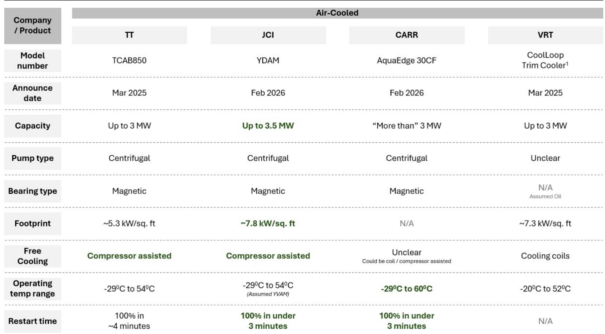
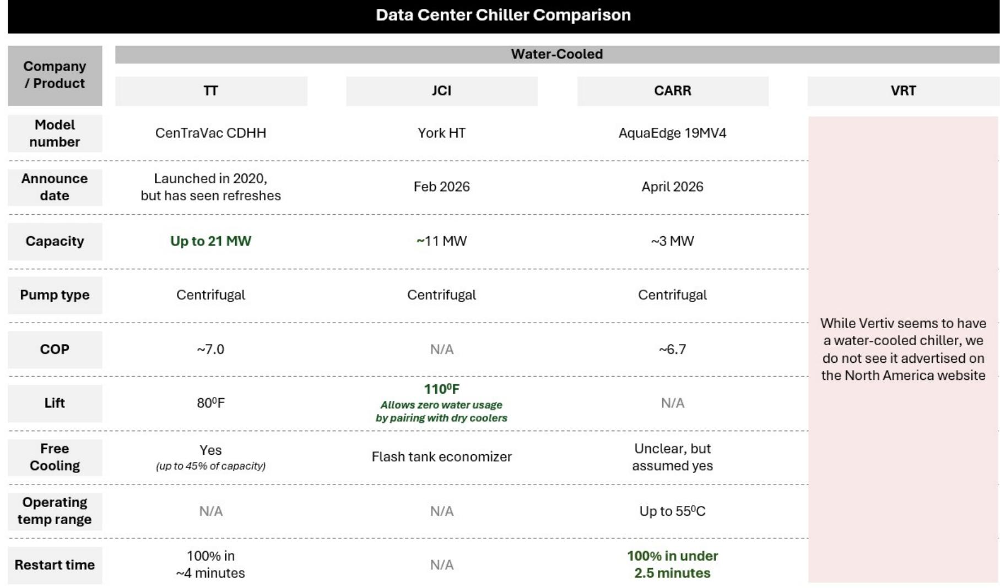
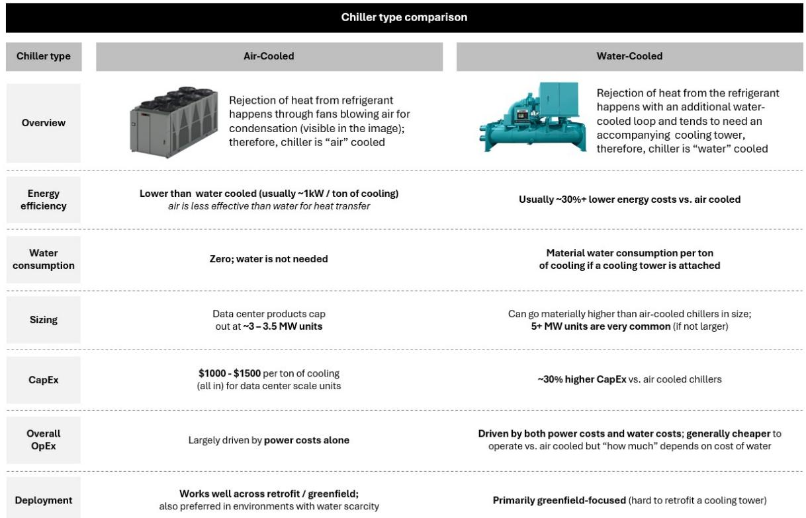

# The Hidden Economics of Data Center Cooling: Why Air-Cooled Chillers Are Poised to Disrupt a $16 Billion Market

The conventional wisdom in data center cooling holds that water-cooled chillers are superior to air-cooled units. They are more energy efficient, offer better heat rejection, and deliver lower total cost of ownership over the equipment lifecycle. This consensus, however, is built on assumptions that are rapidly becoming outdated. The critical missing variable is free cooling—the ability to reduce or disable the chiller compressor when ambient temperatures drop. Once free cooling enters the economic equation, the calculus flips, and air-cooled chillers can become the cheaper option in many operating environments. This insight, drawn from a detailed analysis by a global investment bank, has profound implications for the $8 billion chiller market projected to reach $16.5 billion by 2030, and for the competitive positioning of major industrial players.

The timing of this shift matters because the data center industry is confronting a structural tension. Power demand is surging as AI workloads proliferate, while water availability is becoming a binding constraint in key markets. Operators who default to water-cooled solutions based on legacy efficiency metrics may be locking themselves into higher long-term costs and operational risk. The real strategic question is not which chiller type is better in absolute terms, but under what conditions each technology wins—and how those conditions are shifting.

This article unpacks the economic mechanics behind chiller selection, explains why the free cooling variable changes everything, and translates these insights into a decision framework for operators, investors, and strategists. It also identifies critical questions that remain unanswered in the current research, particularly around the emerging "chiller gate" debate and the service economics that will shape aftermarket profitability.

## The Free Cooling Paradox: When Air-Cooled Becomes Cheaper Than Water-Cooled

The standard comparison between air-cooled and water-cooled chillers is straightforward. Air-cooled units have lower upfront capital costs but consume roughly 30% more energy because they reject heat directly into ambient air, which is a less efficient heat transfer medium than water. Water-cooled units require higher initial investment—including cooling towers, pumps, and piping—but their superior thermal efficiency means the compressor does less work, reducing power consumption. In a scenario where the compressor runs continuously, an 800-ton chiller operating as an air-cooled unit incurs annual operating costs approximately 25% higher than its water-cooled counterpart, implying a payback period of about three years on the cost differential.

This logic has driven the industry toward water-cooled solutions for large-scale deployments. But it rests on a hidden assumption: that the compressor runs at full load all the time. Free cooling changes this entirely.

Free cooling is the practice of using low ambient temperatures to reduce or eliminate the need for mechanical compression. When outside air is cold enough, the chiller can bypass the compressor and use the ambient environment as the primary heat sink. This is not entirely "free"—pumps and fans still consume power—but the energy draw drops to a fraction of what is required with the compressor running at full capacity. For both air-cooled and water-cooled units, free cooling dramatically reduces electricity consumption.

Here is where the paradox emerges. Water-cooled chillers that use cooling towers continue to consume water even during free cooling mode. The water loop must remain active to reject heat, and evaporation and blowdown losses persist regardless of compressor load. Water costs stay relatively constant. Air-cooled chillers, by contrast, have no water consumption at all. So as free cooling hours increase, the water cost advantage of air-cooled units grows, while the power cost advantage of water-cooled units shrinks.

The result is a crossover point. In environments with high free cooling availability—typical in northern climates or during significant portions of the year in many U.S. data center markets—the total operating cost of an air-cooled chiller can fall below that of a water-cooled unit. This is not a marginal effect. The analysis shows that at high free cooling ratios, water costs can overtake power costs as the dominant operating expense for water-cooled chillers, making air-cooled units economically attractive even without considering their lower upfront capital expenditure.

This explains why industry participants are increasingly discussing air-cooled chillers gaining share. The narrative is not about technological revolution; it is about a shift in the economic environment that changes the relative attractiveness of existing technologies.

## Geography Is Destiny: Why Local Power and Water Costs Dictate Chiller Economics

The crossover point between air-cooled and water-cooled economics is not uniform. It varies dramatically by region based on the ratio of power costs to water costs. This geographic sensitivity means that a one-size-fits-all approach to chiller selection is suboptimal, and that operators must model their specific local conditions rather than relying on national averages.

Consider four major U.S. data center markets: Northern Virginia (NoVa), Dallas-Fort Worth (DFW), Atlanta (ATL), and Chicago (ORD). Power costs per 100 kWh range from approximately $6.26 in DFW to $10.25 in NoVa. Water costs per 1,000 gallons range from approximately $10 in Chicago to $20 in Atlanta. The ratio of these inputs determines the free cooling threshold at which air-cooled becomes cheaper.

In Atlanta, where water costs are highest relative to power, air-cooled chillers outperform water-cooled units with as little as 50% free cooling. In Chicago, where water is cheap and power is moderate, the threshold is higher. In NoVa, the dominant data center market globally, the threshold falls somewhere in between. The implication is that operators in water-constrained or high-water-cost regions have a stronger economic case for air-cooled solutions, even if they have historically defaulted to water-cooled designs.

This analysis assumes the use of cooling towers for water-cooled chillers, which is the standard configuration. A notable exception is the emerging use of dry coolers in water-cooled systems, which eliminate water consumption entirely but require higher compressor lift and therefore higher power consumption. This trade-off creates a third dimension in the decision framework: water-cooled with cooling towers, water-cooled with dry coolers, and air-cooled. Each has its own cost curve, and the optimal choice depends on local power rates, water rates, and climate patterns.

The strategic takeaway is that chiller selection is not a binary technology decision but a location-specific optimization problem. As data center construction accelerates in secondary markets with different resource profiles, the aggregate mix of chiller types will shift. Operators who fail to account for regional variation risk locking in cost structures that are suboptimal for their specific operating environment.

## Market Sizing and the Penetration Uncertainty That Drives a 10x Growth Range

The chiller market is large and growing rapidly, but the range of possible outcomes is extraordinarily wide. Using a top-down model based on projected gigawatt additions, thermal load assumptions, and chiller penetration rates, the fully loaded market (including installation and ancillary equipment) is estimated at approximately $8 billion in 2026. Under base-case assumptions—where chillers continue to cool the same share of data center compute—this grows to roughly $16.5 billion by 2030, implying a compound annual growth rate of about 20%.

The bull and bear cases, however, span a range of nearly 10x in terminal value. In the bull case, where chillers gain share relative to alternative cooling technologies, the market reaches approximately $20 billion by 2030, with growth exceeding 25% annually. In the bear case, where dry coolers or other solutions displace chillers, the market stalls at roughly $9 billion, with growth below 5% annually.

This wide dispersion reflects genuine uncertainty about technology adoption paths. The bear case is not unrealistic: dry coolers offer lower water consumption and simpler maintenance, and their economics improve as free cooling hours increase. The bull case assumes that the thermal density of AI workloads continues to rise, requiring the higher cooling capacity that only chillers can provide, and that water-cooled solutions remain dominant in large-scale deployments.

The critical unknown is the pace at which alternative cooling architectures—direct-to-chip liquid cooling, immersion cooling, and dry cooler-based systems—gain traction. Chillers are essential in both air-cooled and liquid-cooled environments, but their penetration depends on how much of the thermal load is handled by chillers versus other heat rejection methods. This is not a question of whether cooling will be needed; it is a question of which equipment will provide it.

For investors and strategists, the key insight is that the growth rate of the chiller market is not solely a function of data center buildout. It is equally a function of technology mix. A scenario where AI workloads drive massive compute growth but cooling architectures shift toward dry coolers or direct liquid-to-air systems could leave chiller manufacturers with a much smaller addressable market than the headline GW numbers suggest.

## The Product Differentiation Paradox: Why Specs Matter Less Than Supply

A detailed benchmarking of flagship chiller products from major manufacturers reveals a surprising finding: product specifications matter less than one might expect in the current market environment. While there are meaningful differences in capacity, restart time, lift capability, and footprint, these variations are far outweighed by the overwhelming supply shortage and demand surge.

On the air-cooled side, Johnson Controls and Carrier announced new products in early 2026, while Trane's current offering dates from 2025. Vertiv has taken a differentiated approach with a "trim cooler" that operates like a dry cooler for most conditions while containing a chiller for peak loads. Capacity ranges from roughly 3 MW to 3.5 MW, with centrifugal compressors being the standard for large-scale units.

On the water-cooled side, Trane offers the largest single unit at 21 MW capacity. Johnson Controls advertises a lift capability of 110 degrees Fahrenheit, which enables dry cooler operation even in hot climates, eliminating water consumption entirely. Carrier promotes a restart time of under three minutes, which is valuable for applications requiring rapid recovery after power interruptions.

These differences are real and may become more important as the market matures and supply constraints ease. But in the current environment, where order backlogs are substantial and capacity is the binding constraint, any manufacturer with available production capacity can capture demand. The differentiation that matters today is not which product has the best coefficient of performance or the smallest footprint, but which company can deliver units on time and at scale.

This situation may not persist. As supply chains expand and new production capacity comes online, customers will become more discerning. The manufacturers that invest now in product features that address the specific pain points of data center operators—water efficiency, rapid restart, high ambient temperature operation, and serviceability—will build competitive advantages that compound over time.

## The Unanswered Questions: Chiller Gate and the Economics of Service

The current analysis, while comprehensive, leaves several critical questions unresolved. These are the questions that will determine whether the chiller market becomes a high-margin growth story or a commoditized volume business.

First, there is the emerging debate around "chiller gate"—the specific configuration and placement of chillers within data center cooling architectures. The term refers to decisions about how chillers interface with cooling distribution units, whether they serve as primary or backup cooling sources, and how redundancy is managed. The optimal design depends on reliability requirements, power density, and the specific liquid cooling architecture employed. The research hints at this topic for a future installment, but the implications for capital expenditure, operational complexity, and risk are substantial.

Second, and potentially more important for long-term profitability, is the economics of servicing chiller units. Chillers are complex mechanical systems with compressors, valves, pumps, and controls that require regular maintenance and eventual replacement. The service model—whether it is manufacturer-led, third-party, or operator-managed—will determine the lifetime value of each installed unit. In other industrial equipment markets, service revenues can exceed equipment revenues over the lifecycle, and margins on service are typically higher. The research promises a deep dive into this topic in a future report, but the preliminary implication is that the total addressable market for chillers may be significantly larger than the initial equipment sale suggests.

Third, the analysis does not fully resolve the question of how water scarcity regulations will evolve. Several counties have already capped water consumption for data centers, and this trend is likely to accelerate. If water availability becomes a binding constraint in more markets, the economic case for air-cooled chillers strengthens dramatically. But the timing and geographic scope of such regulations are uncertain, making it difficult to model their impact on chiller mix.

These open questions create a rich agenda for further research. The answers will determine not only which chiller technologies win, but which manufacturers build sustainable competitive moats.

## A Decision Framework for Chiller Selection

For operators and strategists evaluating chiller investments, the analysis suggests a structured decision framework with four dimensions:

**Dimension 1: Local Resource Prices.** Model power and water costs at the specific site, not using national averages. The ratio of power cost to water cost determines the free cooling threshold at which air-cooled becomes cheaper. Sites with high water costs or low power costs favor air-cooled solutions.

**Dimension 2: Free Cooling Availability.** Calculate the number of hours per year when ambient temperatures are low enough to enable free cooling. This varies by climate zone and can be estimated using historical weather data. Higher free cooling hours favor air-cooled units.

**Dimension 3: Water Constraints.** Assess regulatory and physical water availability. Sites with water use restrictions or high water scarcity risk should lean toward air-cooled or dry cooler solutions, even if the purely economic analysis favors water-cooled.

**Dimension 4: Thermal Density Requirements.** Higher rack densities require higher cooling capacity and may necessitate water-cooled solutions regardless of operating cost. This dimension may override the others for AI training clusters with extreme power densities.

The optimal decision is not static. As power prices evolve, water regulations tighten, and cooling technology improves, the optimal mix will shift. Operators should build flexibility into their cooling architecture to adapt to changing conditions.

## The Full Picture Awaits

The chiller market is at an inflection point. The conventional wisdom favoring water-cooled solutions is being challenged by the economics of free cooling, regional resource variation, and growing water constraints. Air-cooled chillers are gaining ground, and the market size could vary by a factor of two depending on technology adoption paths.

But the full story is more complex than any single analysis can capture. The interplay between chiller design, cooling architecture, service economics, and regulatory evolution will shape the market for years to come. The global investment bank that produced this research has committed to two further installments in this series—one on the "chiller gate" debate and one on the service economics that will determine aftermarket profitability. These are the details that separate a commodity equipment purchase from a strategic infrastructure investment.

For those who need to understand not just what is happening, but why it matters and where the risks lie, the full report provides the data, charts, and analytical depth that this summary can only gesture toward.

**Join the community to read the full report and review the original charts.**

*This article is for learning and discussion only and does not constitute investment advice.*

Personal reading notes and learning share only. Not investment advice.

