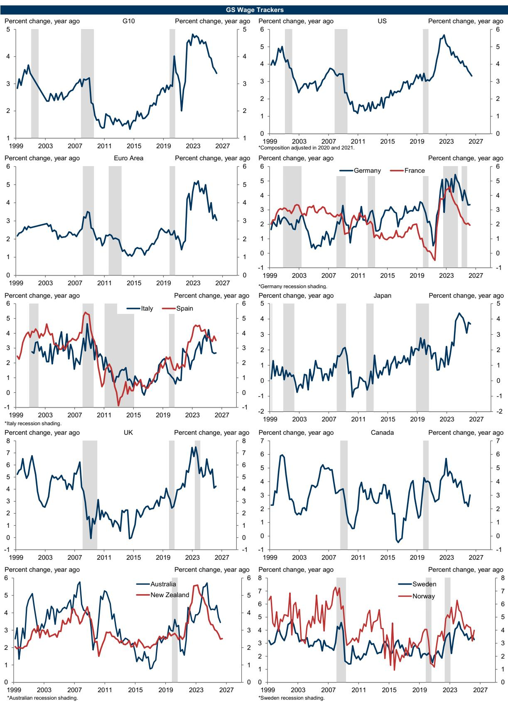
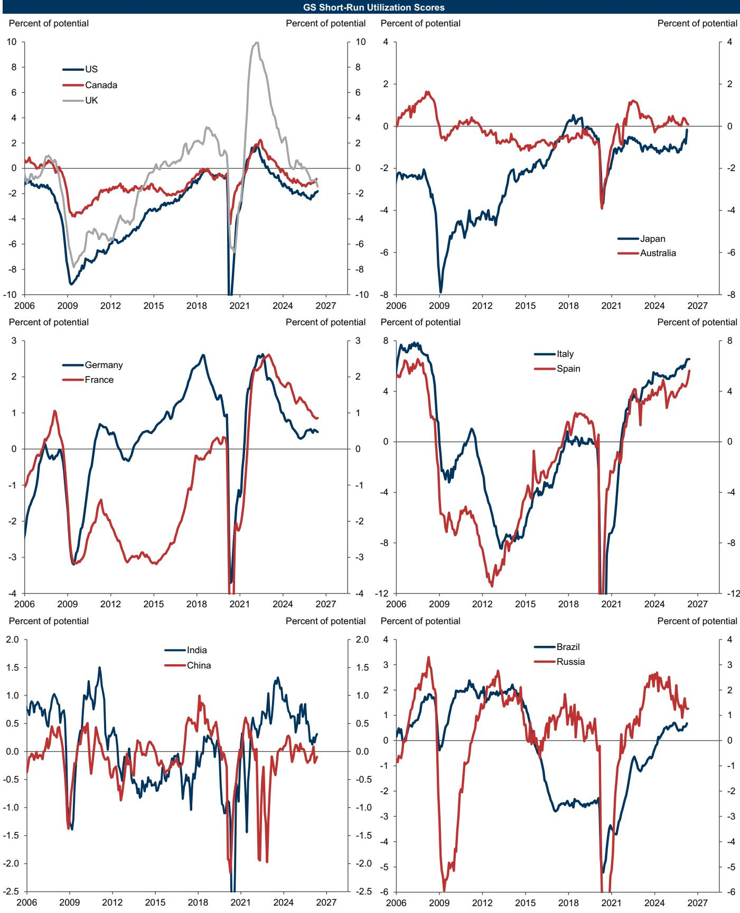
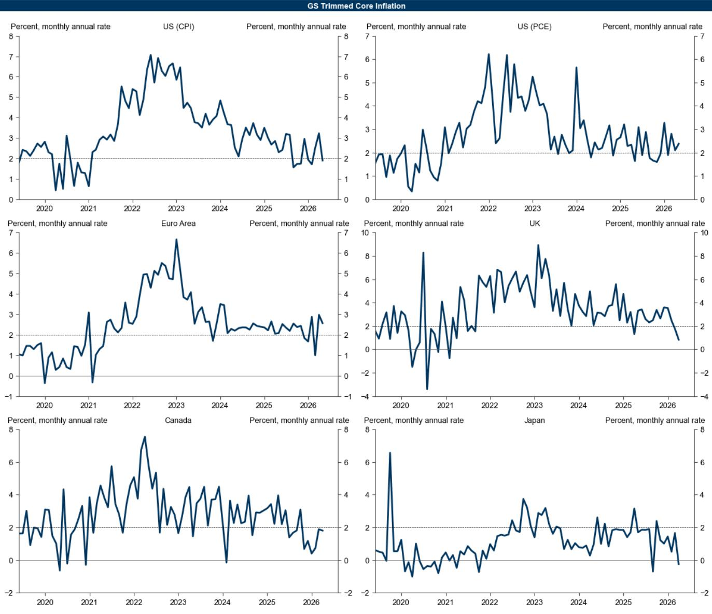

# Financial Conditions Are Easing in South Korea, but the Real Story Is What This Signals for Global Growth Dispersion

The latest weekly update from a global investment bank's proprietary economic indicators reveals a striking data point: South Korea's Financial Conditions Index (FCI) eased by 29 basis points last week, driven primarily by a technology-led equity rally. This is not merely a country-specific footnote. It is a signal that deserves far more attention than it is receiving from macro strategists who remain fixated on US exceptionalism and European stagnation.

The South Korea easing occurred against a backdrop where the global ex-Russia FCI tightened by 0.8 basis points over the same period. This divergence is not random noise. It reflects a structural shift in how financial conditions are transmitting across economies, and it carries implications for portfolio construction that most investors have not yet priced in.

Why now matters: the global economy is entering a phase where financial conditions are no longer moving in sync. The era of correlated easing and tightening that defined the post-pandemic period is giving way to a more fragmented regime. South Korea's experience this week is the canary in the coal mine for a world where equity market leadership, not central bank policy, becomes the primary driver of financial conditions in export-oriented economies.

The report's Current Activity Indicator data reinforces this reading. The global CAI remains above potential at +2.9 percent month-on-month annualized in May, but the composition is shifting. Emerging markets are running at +4.0 percent, while developed markets lag at +2.2 percent. Within developed markets, the dispersion is even more pronounced: Spain at +2.8 percent, the US at +2.6 percent, and Germany in negative territory at -0.9 percent.

This is not a uniform global expansion. It is a multi-speed world where financial conditions are becoming both a cause and a consequence of real economic divergence. Investors who treat the South Korea data as a narrow equity story are missing the broader strategic picture.

## The Technology-Led Equity Rally in South Korea Is Reshaping Financial Conditions in Ways That Challenge Conventional Monetary Transmission Models

The standard framework for understanding financial conditions centers on interest rates, credit spreads, and exchange rates. Equities are included, but they are typically treated as a secondary channel. The South Korea data from the past week turns this hierarchy on its head.

The 29 basis point easing in South Korea's FCI was overwhelmingly equity-driven. This is not an anomaly. It reflects a structural reality about the Korean economy: the technology sector has become so dominant in market capitalization that equity price movements now exert a first-order effect on overall financial conditions. When tech stocks rally, the wealth effect, the improvement in corporate balance sheets, and the reduction in equity risk premia cascade through the entire financial system.

The implication is uncomfortable for traditional macro forecasting. Models that weight interest rates and credit spreads as the primary drivers of financial conditions will systematically underestimate the easing impulse in economies where equity markets are concentrated in high-growth sectors. South Korea is the extreme case, but the same logic applies to Taiwan and, to a lesser extent, to the US itself.

This matters because financial conditions are one of the most reliable leading indicators for GDP growth with a four-quarter lag. If the equity channel is becoming more powerful in certain economies, then the growth outlook for those economies may be stronger than what interest-rate-focused models predict. Conversely, economies where equity markets are stagnant or declining may face tighter conditions than their policy rates suggest.

The report's FCI impulse data provides the analytical bridge. The FCI impulse measures the effect of financial conditions on real GDP growth over the next four quarters. If South Korea's equity-driven easing persists, the impulse will be positive and material. Investors should be asking whether their growth forecasts for Korea and similar economies adequately capture this channel.

## The Global CAI Remains Above Potential, but the Divergence Between Developed and Emerging Markets Is Creating a Two-Track Growth Regime That Demands Different Portfolio Strategies

The headline number is reassuring: the global CAI at +2.9 percent month-on-month annualized in May is consistent with above-trend growth. But the disaggregation tells a different story. Developed markets are running at +2.2 percent, while emerging markets are at +4.0 percent. Within developed markets, the US at +2.6 percent is pulling up the average, while the Euro area at +1.1 percent and the UK at 0.0 percent are dragging it down.

This is not a temporary divergence. It reflects fundamental differences in the structure of these economies and their exposure to the two dominant forces shaping the global outlook: technology-driven productivity gains and fiscal policy trajectories.

The emerging market advantage is being driven by India at +7.5 percent and China at +4.6 percent, though China's CAI fell by 0.8 percentage points week-on-week, which warrants close monitoring. These economies are benefiting from both domestic demand momentum and their positioning in global supply chains that are being reshaped by technology investment.

For investors, the implication is clear: a one-size-fits-all approach to global macro positioning is no longer viable. The old heuristic of "buy cyclicals when the global PMI is above 50" is too blunt. The relevant question is not whether the global economy is growing, but where the growth is coming from and how it is being financed.

Developed market investors who are overweight European equities based on a valuation argument are implicitly betting that the growth divergence will narrow. The CAI data suggests the opposite is happening. Spain at +2.8 percent is the exception, not the rule, and even that may reflect a catch-up effect rather than sustainable momentum.

The strategic question is whether to overweight emerging markets broadly or to be selective within them. The CAI data supports selectivity. India's +7.5 percent is in a league of its own. China's trajectory, with the weekly decline, is more uncertain and depends on the effectiveness of fiscal stimulus. Brazil at +2.1 percent is respectable but not exceptional.

## Wage Pressures Are Easing Across Most Developed Economies, but the Jobs-Workers Gap Data Suggests This Is a Cyclical Pause, Not a Structural Resolution

The report's wage tracker and jobs-workers gap data provide the most nuanced insight into the inflation outlook. The wage trackers across G10 economies are showing signs of moderation, which supports the narrative that central banks can begin easing without reigniting wage-price spirals.

But the jobs-workers gap data tells a more complicated story. This metric captures the difference between total labor demand and labor supply. When the gap is positive, it means there are more jobs available than workers to fill them, which creates upward pressure on wages. The report's data shows that while the gap has narrowed from its peak, it remains positive in several major economies.

This matters because the narrowing of the gap has been driven more by a decline in job openings than by an increase in labor supply. If the decline in openings is a leading indicator of a broader labor market slowdown, then wage moderation could persist. But if openings stabilize at current levels while labor force growth remains constrained by demographics, the gap could widen again, reigniting wage pressures.

The strategic implication is that the inflation outlook is not as settled as market pricing suggests. The market is currently pricing in a relatively smooth path to lower rates across developed markets. The wage and jobs data introduces a scenario where central banks ease prematurely, only to find that labor market tightness reasserts itself, forcing them to reverse course.

This scenario is particularly relevant for the US, where the short-run utilization score is at -1.8 percent of potential, suggesting some slack. But the US wage tracker remains elevated relative to pre-pandemic levels. The combination of slack in utilization but stickiness in wages is unusual and suggests structural changes in the labor market that may not be fully captured by traditional models.

## Fiscal Impulses Are Becoming a More Important Driver of Growth Dispersion Than Monetary Policy, and the Report's Data Reveals a Widening Gap Between the US and Europe

The report's top-down fiscal impulse data is perhaps the most underappreciated component of the analysis. The fiscal impulse measures the effect of fiscal policy on real GDP growth over the next four quarters. The data shows a clear divergence: the US fiscal impulse remains positive, driven by both discretionary spending and the tax-like effects of tariffs, while the Euro area and UK impulses are turning negative.

This divergence is not widely discussed in mainstream macro commentary, which tends to focus on monetary policy divergence. But fiscal policy is becoming the more important driver of growth differentials for a simple reason: central banks in most developed markets are approaching the end of their tightening cycles, leaving fiscal policy as the primary tool for demand management.

The US is running a fiscal experiment that combines expansionary spending with protectionist trade policies. The net effect, as captured by the fiscal impulse, is still positive for growth. Europe, by contrast, is consolidating fiscal policy at a time when its monetary policy is already restrictive. The result is a double drag on growth that the CAI data is already picking up.

For investors, the implication is that the US growth advantage over Europe is likely to persist through at least 2026, unless there is a significant shift in European fiscal policy. The report's GDP forecast data shows that the investment bank is already more optimistic on US growth than consensus, and the fiscal impulse analysis suggests this optimism is justified.

But there is a risk scenario that the report does not fully address: what happens if the US fiscal impulse turns negative? The current positive impulse is partly driven by tariff effects, which are a tax on imports that reduces real income. If tariffs escalate further, the negative income effect could outweigh the positive demand effect, turning the fiscal impulse negative. This is a tail risk that the market is not pricing.

## The Report's Proprietary Indicators Offer a Powerful Decision Framework, but Investors Must Understand the Limitations and the Questions the Data Cannot Answer

The value of the report's proprietary indicators is that they provide a systematic, comparable framework for assessing economic conditions across countries. The FCI, CAI, wage trackers, and fiscal impulses are not ad hoc metrics. They are constructed using consistent methodologies that allow for meaningful cross-country comparisons.

For a portfolio manager, the decision framework should proceed in three steps.

First, use the FCI data to identify where financial conditions are easing or tightening most rapidly. The South Korea data is the current outlier, but the weekly change across countries shows significant dispersion. The year-over-year change in FCI across countries reveals which economies have seen the most dramatic shifts in financial conditions over a longer horizon.

Second, use the CAI data to validate whether the FCI signals are translating into real economic activity. If financial conditions are easing but the CAI is declining, it may indicate that the easing is not reaching the real economy due to structural bottlenecks or credit constraints. If both are moving in the same direction, the signal is more reliable.

Third, use the wage and jobs data to assess the inflation implications. An economy with easing financial conditions, rising CAI, and rising wages is one where central banks will be reluctant to cut rates. An economy with easing conditions, rising CAI, but stable wages is one where rate cuts are more likely.

The limitation of this framework is that it is backward-looking. The FCI and CAI are based on historical data, even if they are updated weekly. They cannot predict sudden shocks or regime changes. The report's MAP surprise index partially addresses this by measuring how economic data releases are surprising relative to consensus, but it is a reactive measure, not a predictive one.

The most important question the report cannot answer is whether the current regime of growth dispersion is sustainable. If the US continues to outgrow Europe, the dollar will remain strong, which will tighten financial conditions in emerging markets and export-oriented economies like South Korea. The equity rally that is easing Korean conditions today could be self-limiting if it drives further dollar strength.

## The Full Report Contains the Charts and Granular Data That Make These Insights Actionable for Portfolio Decisions

The analysis above is based on the summary data and exhibits included in the weekly update. But the full report contains the detailed charts, historical series, and methodology notes that allow investors to customize this framework for their own portfolios.

The FCI level charts for each major economy show not just the weekly change but the trajectory over time. The FCI impulse charts translate the level data into GDP growth impacts. The CAI heatmap provides a snapshot of activity across 18 economies. The wage tracker and jobs-workers gap charts are essential for inflation forecasting.

These are not abstract indicators. They are the same tools that the investment bank's own strategists use to make asset allocation decisions. Having access to the underlying data and charts allows investors to form their own views rather than relying on second-hand interpretations.

The methodology notes are particularly valuable because they explain how each indicator is constructed and what its limitations are. Understanding the methodology is essential for knowing when to trust the signal and when to question it.

Join the community to read the full report and review the original charts.

*This article is for learning and discussion only and does not constitute investment advice.*

Personal reading notes and learning share only. Not investment advice.

