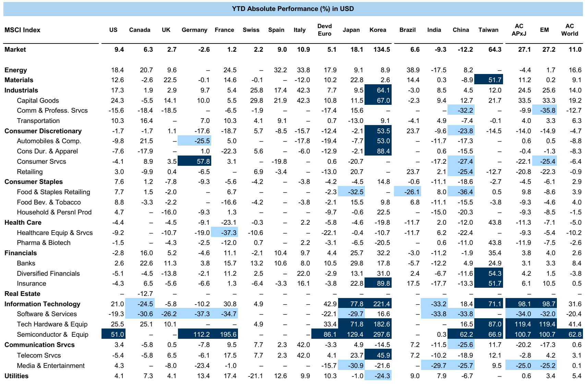
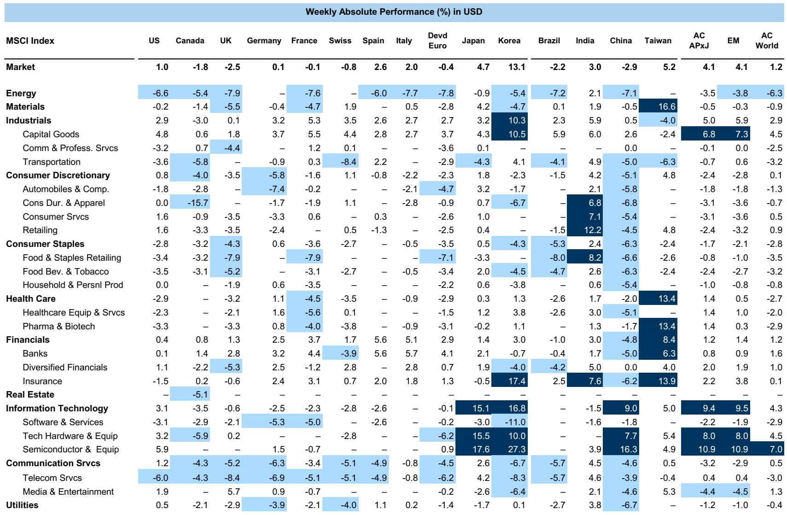
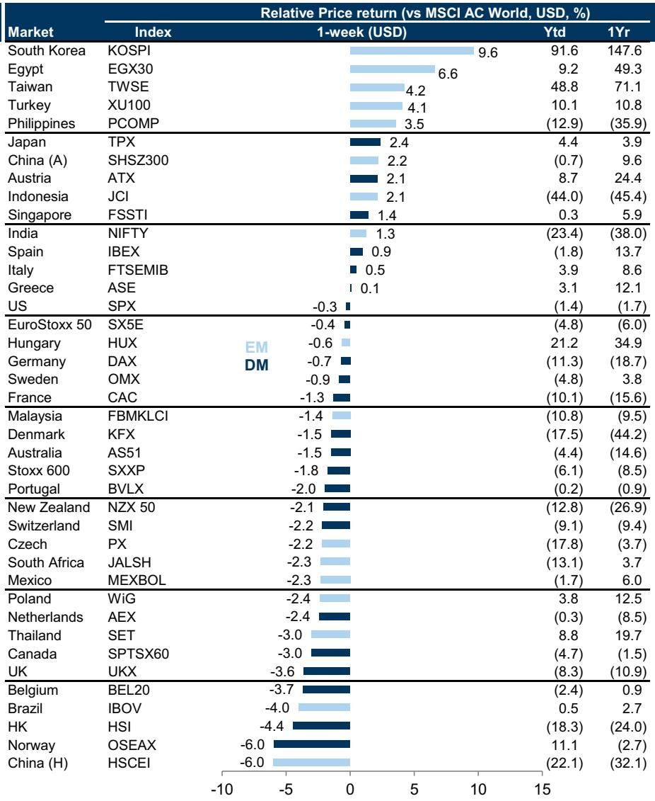

# The Post Modern Cycle Demands a New Investment Playbook: Earnings Growth, Not Valuation Expansion, Will Drive Returns

Equity markets rose 1.2% last week, but the headline number conceals a deeper structural shift that demands a fundamental rethinking of portfolio construction. The rally was led by Japan and Asia Pacific ex-Japan, up 4.6% and 4.1% respectively, while Energy plunged 6.3% as Brent crude fell approximately 8% on the back of US-Iran de-escalation talks. Technology continued its AI-driven momentum, gaining 4.3%. Cyclicals outperformed Defensives as risk appetite strengthened, and monthly global investor inflows reached an all-time high, driven overwhelmingly by passive funds.

These are not merely weekly fluctuations. They are surface manifestations of a much deeper transformation in the macroeconomic regime that will determine which assets compound and which destroy value over the next decade. The investment paradigm that served investors well for the past fifteen years is breaking down, and a new one is taking its place.

The core argument is this: we have entered what is best described as the Post Modern Cycle, a regime defined by higher macro volatility, structurally higher real interest rates, greater state intervention in markets, and the regionalisation of global supply chains. In this environment, equity returns will depend far less on valuation expansion and far more on genuine earnings per share growth. The implications for asset allocation, sector positioning, and stock selection are profound.

What makes this moment particularly consequential is the simultaneous emergence of a capital expenditure supercycle. Three powerful forces are converging: the artificial intelligence revolution is creating a new engine of private investment; energy security concerns and geopolitical competition are driving a synchronised increase in public spending; and supply chains are being rebuilt for resilience rather than efficiency, structurally raising cost bases and capital intensity across industries.

The report from which this analysis draws makes a compelling case that markets are broadening their opportunity sets. Higher private capex and rising government borrowing are pushing up the cost of capital, which in turn supports faster technology growth and stronger real asset values. The result is greater cross-sectional dispersion in returns and, critically, more scope for alpha generation. For active managers, this should be a welcome development after years of compressed dispersion that favoured passive strategies.

But the report also raises uncomfortable questions. The GS Bull/Bear Market Indicator stands at the 68th percentile, with the Shiller PE ratio at the 98th percentile of historical readings. The yield curve is steepening from deeply inverted levels, and core inflation remains above target. These are not conditions that historically have preceded sustained bull markets. Something has to give.

---

## The Old Regime Is Over: Disinflation, Deregulation, Falling Rates, and Globalisation Are Reversing

The investment playbook of the past fifteen years was built on a remarkably stable foundation. Disinflation allowed central banks to keep policy accommodative. Deregulation freed capital and encouraged risk-taking. Falling interest rates mechanically boosted the present value of future cash flows, making valuation expansion the primary driver of equity returns. Globalisation kept costs low and margins wide.

That foundation is crumbling. The Post Modern Cycle is defined by the reversal of each of these pillars. Inflation is more volatile and stickier than the market has priced. State intervention is rising across developed economies, from industrial policy to trade restrictions to direct market participation. Real interest rates are structurally higher, reflecting both larger fiscal deficits and the repricing of sovereign risk. And globalisation is giving way to regionalisation, as supply chains are reconfigured for national security and resilience rather than cost minimisation.

The consequence for investors is stark: returns will rely less on valuation expansion and more on EPS growth. This is not a subtle shift. It rewrites the basic calculus of portfolio construction. In the old regime, buying a high-quality business at any reasonable valuation often worked because falling rates would eventually bail out the entry price. In the new regime, entry price matters enormously. Companies must deliver genuine earnings growth to generate returns, and those that fail to do so will be punished severely.

The report's data supports this reading. The top-down estimates for 2026 and 2027 EPS growth from the investment bank's strategists are consistently below consensus bottom-up estimates. This suggests that analysts embedded in companies are still projecting earnings as if the old regime persists, while the macro framework suggests a more challenging environment. The gap between top-down and bottom-up forecasts is a warning signal that earnings expectations may need to be revised downward.

---

## The Capex Supercycle Is Real, But It Will Not Benefit All Sectors Equally

The capital expenditure supercycle is perhaps the most important structural development in the global economy today. Three forces are driving it simultaneously, and they are mutually reinforcing.

First, the AI revolution is generating an unprecedented wave of private investment in data centres, semiconductor fabrication, energy infrastructure, and enabling technologies. This is not a cyclical upturn; it is a structural shift in the capital intensity of the global economy. Companies that fail to invest in AI capabilities will find themselves competitively disadvantaged, creating a prisoner's dilemma that forces even reluctant firms to commit capital.

Second, energy security and geopolitical competition are driving a synchronised increase in public spending. Governments across the developed world are investing in domestic energy production, grid modernisation, defence manufacturing, and critical mineral supply chains. This is not discretionary spending; it is perceived as existential necessity.

Third, supply chains are being rebuilt for resilience. The era of just-in-time inventory management and single-source suppliers is giving way to just-in-case redundancy and multi-sourcing. This raises the capital intensity of every supply chain and structurally increases cost bases across industries.

The report makes clear that this capex supercycle is already visible in the data. Cyclicals outperformed Defensives last week as risk appetite strengthened, and the industrial sectors within Technology and Capital Goods showed particular strength. But the report also implies a critical nuance: not all capex is created equal. Investment that enhances productivity and competitive advantage will generate strong returns. Investment that merely maintains resilience or responds to regulatory pressure will destroy shareholder value.

The dispersion between winners and losers within the capex theme will be enormous. Investors cannot simply buy a basket of capital goods companies and expect superior returns. They must discriminate between companies that are investing in genuine competitive advantage and those that are investing merely to maintain their license to operate.

---

## The Risk Appetite Rebound Conceals a Dangerous Divergence in Fundamentals

Last week's market action showed a clear improvement in risk appetite. The Risk Appetite Indicator, based on 27 pair-trades across asset classes, strengthened as cyclicals outperformed defensives and passive fund inflows reached an all-time high. On the surface, this looks like a healthy broadening of market participation.

But the underlying data tells a more complicated story. The Energy sector fell 6.3% even as risk appetite improved, reflecting the specific geopolitical catalyst of US-Iran talks. More importantly, the sector performance table reveals extreme dispersion across regions. South Korea rose 11.4% in local currency terms, while Hong Kong fell 3.2% and China H-shares dropped 4.8%. This is not a uniform risk-on move; it is a highly selective rotation that rewards specific geographies and sectors while punishing others.

The report's sentiment indicators show a market that is priced for perfection. The Shiller PE is at the 98th percentile. The unemployment rate is at the 77th percentile of low readings. The yield curve has inverted and is now steepening, which historically has been a mixed signal for equities. Core inflation remains at the 53rd percentile, meaning it is still elevated relative to history even if it is no longer accelerating.

The danger is that the risk appetite rebound is being driven by passive fund flows rather than fundamental conviction. When monthly inflows reach an all-time high, it suggests that money is being deployed mechanically rather than selectively. This creates vulnerability: if the macro environment deteriorates or earnings disappoint, the withdrawal of those flows could be equally mechanical and equally violent.

The report does not resolve this tension. It presents the data on risk appetite and fund flows alongside the valuation and macro warning signals, leaving the reader to reconcile the conflicting messages. That is intellectually honest, but it also means that investors must make their own judgment about which signal will prevail.

---

## What the Report Does Not Fully Answer: How to Navigate the Valuation Conundrum

For all its analytical depth, the report leaves one critical question unresolved: how should investors reconcile the compelling structural case for the Post Modern Cycle with the extreme valuation levels that the Bull/Bear Market Indicator highlights?

The Shiller PE at the 98th percentile is a stark data point. Historically, such elevated valuations have been associated with below-average forward returns over multi-year horizons. The Bull/Bear Market Indicator at the 68th percentile is not at flashing red levels, but it is in the zone where caution is warranted.

Yet the report also makes a powerful case that this cycle is different. The capex supercycle, the AI revolution, and the structural shift toward higher capital intensity could justify higher equilibrium valuations. If earnings grow faster than historically normal, then today's elevated multiples could be sustained or even expanded further.

The report does not adjudicate between these two narratives. It presents the data and the framework, but it does not give a definitive answer on whether valuations are justified or dangerous. This is not a weakness; it is a recognition that the answer depends on assumptions about the future path of earnings, interest rates, and productivity that cannot be known with certainty.

For investors, the implication is that they must make their own probabilistic assessment. The report provides the analytical tools: the Post Modern Cycle framework for understanding the macro regime, the sector performance data for identifying where the market is rewarding capital, and the valuation indicators for assessing the margin of safety. But the final judgment requires integrating these inputs into a coherent portfolio strategy.

---

## A Decision Framework for the Post Modern Cycle

The report's insights can be translated into a practical decision framework for portfolio construction. This framework has three layers: regime identification, factor allocation, and stock selection.

**Regime identification** is the most important layer. Investors must determine whether they believe the Post Modern Cycle thesis is correct. If it is, then the old playbook of buying quality at any price and relying on valuation expansion must be abandoned. The new playbook prioritises earnings growth, cash flow generation, and pricing power. Companies that can grow earnings in an environment of higher real rates and higher input costs will be rewarded. Companies that rely on leverage or valuation expansion to generate returns will be punished.

**Factor allocation** follows from regime identification. In the Post Modern Cycle, the report suggests that value factors may underperform if they are driven by financial leverage rather than operational efficiency. Quality factors should be rewarded, but only if quality is defined as the ability to generate sustainable earnings growth rather than simply low volatility. Momentum factors may be more persistent given the greater cross-sectional dispersion in returns. And size factors may matter less than the specific exposure to the capex supercycle.

**Stock selection** becomes the most critical layer because dispersion is higher. The report's sector performance data shows enormous variation even within the same industry across different regions. Technology stocks in Japan and Korea performed very differently from technology stocks in China and Hong Kong. Energy stocks in the US performed differently from energy stocks in India. This is not a market where broad sector bets will work reliably.

The framework suggests that investors should focus on companies with three characteristics: exposure to the capex supercycle through genuine productivity-enhancing investment, pricing power that allows them to pass through higher input costs, and balance sheet strength that allows them to fund investment without excessive leverage. Companies that lack these characteristics, regardless of their sector or geography, are likely to underperform.

The report also implies a crucial negative screen: avoid companies that are dependent on falling interest rates, deregulation, or globalisation for their business models. Those tailwinds are reversing, and companies that relied on them will face structural headwinds.

---

## The Open Questions That Demand Further Analysis

The report is rich in data and insight, but it also leaves several important questions unanswered. These are the questions that should drive further research and debate among serious investors.

First, how durable is the risk appetite rebound? The all-time high in passive fund inflows suggests momentum-driven buying, but the valuation indicators suggest limited upside from current levels. If the macro environment deteriorates, the withdrawal of those flows could be swift and disorderly. The report does not model this scenario.

Second, how should investors think about the geopolitical risk embedded in the capex supercycle? The report notes that energy security and geopolitics are driving public spending, but it does not fully explore the tail risks. What happens if US-Iran talks break down? What happens if trade tensions escalate further between the US and China? These are not peripheral risks; they are central to the thesis.

Third, what is the correct discount rate for valuing companies in the Post Modern Cycle? Higher real rates and higher macro volatility suggest that discount rates should be higher than in the old regime. If discount rates rise, then even strong earnings growth may not generate attractive returns at current valuations. The report provides the framework for thinking about this, but it does not provide a specific answer.

Fourth, how will the passive fund dominance affect market dynamics? If the majority of inflows are going into passive vehicles, then active managers are fighting for a shrinking pool of alpha. The report notes that dispersion is increasing, which should benefit active management, but it does not address whether the structural flow dynamics will overwhelm the opportunity.

These are not criticisms of the report. They are the natural next questions that arise from a thoughtful analysis. Any investor who engages seriously with the report's framework will find themselves asking these questions, and the answers will determine their portfolio outcomes.

---

## The Full Report Contains the Charts and Data That Make the Argument Concrete

The analysis presented here draws on a comprehensive global strategy report that includes detailed charts on market performance, sector dispersion, valuation indicators, and macroeconomic forecasts. The exhibits referenced in this article show the precise data points that support the Post Modern Cycle thesis: the weekly performance of global equities, the sector-level dispersion across regions, the Bull/Bear Market Indicator and its components, the risk appetite indicator, and the top-down versus bottom-up earnings estimates.

These charts are not decorative. They are the analytical foundation for the argument that the investment regime has shifted. Seeing the data visually makes the case more compelling than any textual summary can achieve.

Join the community to read the full report and review the original charts.

*This article is for learning and discussion only and does not constitute investment advice.*

Personal reading notes and learning share only. Not investment advice.

