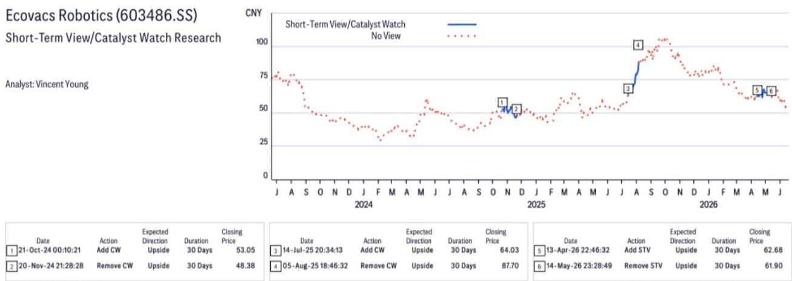
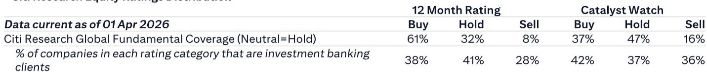
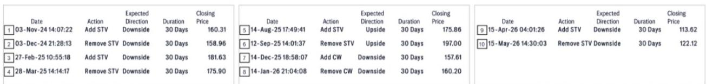

# Citi：扫地机器人赛道的最大悬念，不是关税，是618之后谁能把流量变成利润

中国扫地机器人行业刚刚经历了一个信号密集的星期。两个看似独立的事件，在Citi看来，共同指向了一个判断：行业竞争格局正在出现微妙但重要的分化。

6月19日，欧盟委员会拒绝了针对中国产割草机器人的临时反倾销税动议，将终裁推迟至2027年初。同一天前后，科沃斯公布了618全渠道GMV达到40.2亿元，同比增长23%。这两条消息，让Citi在覆盖的扫地机器人标的中，明确表达了对科沃斯的偏好，同时维持对石头科技的“中性”评级。

这不仅仅是一次评级调整。它折射出Citi对行业未来12-18个月核心驱动力的判断：关税风险正在阶段性后移，而国内电商大促的竞争质量，正在成为区分赢家与输家的关键标尺。

## 1. 欧盟割草机关税的“暂缓”，是窗口期，不是终局

Citi报告中最具时效性的信号，是欧盟对中国产机器人割草机反倾销调查的初步结论。欧盟委员会以“难以比较智能割草机的成本和定价”为由，拒绝征收临时反倾销税，并将调查推进至终裁阶段，预计2027年初才会有最终结论。

这个决定的直接含义是：科沃斯在欧洲割草机市场的短期风险被移除。Citi指出，科沃斯拥有欧洲最畅销的机器人割草机之一，在这一细分赛道的暴露度是覆盖标的中最高的。

但需要冷静看待的是，这只是“暂缓”，不是“豁免”。欧盟的终裁仍有变数。对中国企业而言，这提供了一个约18个月的窗口期，但窗口期的价值取决于企业如何利用它——是加紧本地化布局、优化供应链，还是继续依赖价格优势扩张。

> **KC评论：** 关税风险后移，不等于关税风险消失。对投资者而言，关键不是赌终裁结果，而是看企业是否在为“有税世界”做准备。Citi报告没有展开的是：科沃斯在欧洲的渠道布局、产能安排、以及是否与当地合作伙伴建立了更深的绑定关系——这些才是真正决定终裁风险敞口的变量。完整报告里有更多关于欧洲市场分渠道的拆解数据。

## 2. 科沃斯618的业绩，比市场预期的更“贵”

Citi认为科沃斯618的表现“好于市场预期”，这个判断值得拆解。40.2亿元的全渠道GMV、23%的同比增速，放在当前消费环境下并不算惊人。但Citi的着眼点在于结构：T90系列扫地机器人卖出29万台，Tineco Floor One系列卖出23万台，科沃斯在4000元以上高端市场占据份额第一，在擦窗机器人市场占据65%以上份额。

这些数字指向一个判断：科沃斯不是在靠降价换量，而是在高端区间保持了定价权。在消费电子行业普遍面临“量增价跌”压力的时候，能够守住高端份额意味着毛利率压力相对可控。

与此同时，石头科技在618期间的公开表态是“在天猫、京东、抖音三大平台扫地机器人品类份额第一”，但Citi指出，石头科技尚未公布完整的618周期业绩。两家公司对618成绩单的披露方式本身，也透露出不同的竞争姿态。

> **KC评论：** 618的数据本身不是最重要的，重要的是数据透露的竞争策略差异。科沃斯强调的是高端市场占有率，石头强调的是全渠道份额第一。一个侧重利润结构，一个侧重市场份额——这两种叙事的背后，是两家公司对当前竞争阶段的不同判断。完整报告里有两家公司分渠道、分价格带的详细对比图表，值得细看。

## 3. Citi的偏好背后，是“规模-利润”转化能力的重新定价

Citi对科沃斯的偏好，不是一次性的判断，而是延续了此前评级调整的逻辑。从评级历史可以看到，Citi在2025年7月将科沃斯评级上调至“买入”，目标价87.1元，随后在8月进一步上调至127.7元。尽管12月有所回调至102.2元，但2026年4月的最新目标价仍维持在89.3元，对应25倍2026年预期市盈率。

相比之下，石头科技的目标价在2026年4月被下调至120.8元，对应17倍2026年预期市盈率，评级维持在“中性”。Citi给出的估值溢价理由是：科沃斯“更注重资本回报和盈利能力”。

这个表述很关键。在扫地机器人行业，过去几年的竞争逻辑是“规模优先”——谁先做到最大，谁就能获得供应链优势和品牌认知。但Citi的视角暗示，这个逻辑正在切换：当行业增速放缓、竞争从增量转向存量时，能否把规模转化为利润，才是区分优秀与平庸的标准。

## 4. 报告没有完全回答的关键问题：石头科技的真实位置

Citi的报告对石头科技的讨论相对克制。石头科技在618开场期的份额领先是事实，但完整周期的数据缺失意味着市场无法判断：石头科技是否在后期被反超，还是保持了优势？如果保持了份额优势，代价是什么——是毛利率的牺牲，还是渠道费用的增加？

这恰恰是投资者最需要的信息。在行业竞争加剧的背景下，“份额第一”和“利润最优”往往是互斥的。石头科技如果选择了保份额，那么它的利润表可能会在未来几个季度承受压力；如果它同时保住了份额和利润，那说明它的产品力和品牌力已经形成了真正的护城河。

Citi的报告给出了一个框架，但没有给出最终答案。这需要等待石头科技的完整618数据，以及后续季度的财报来验证。

## 5. 对决策者的观察框架：三个需要持续跟踪的指标

基于Citi的报告逻辑，我们可以提炼出三个持续跟踪的竞争指标：

**第一，高端产品占比的变化。** 科沃斯在4000元以上市场的领先地位是Citi看好它的核心原因之一。如果石头科技或其他竞争对手在这个价格带取得突破，科沃斯的估值溢价就需要重新审视。

**第二，海外市场的利润贡献。** Citi提到了欧盟割草机关税风险的后移，但没有展开科沃斯和石头科技在海外其他市场的表现。海外市场的毛利率通常高于国内，但面临更高的渠道费用和关税不确定性。谁能更高效地运营海外业务，谁就能获得利润增量。

**第三，研发投入的转化效率。** 扫地机器人行业的技术迭代速度很快，但技术领先能否转化为定价权，取决于产品的落地速度和消费者的付费意愿。Citi没有在报告中深入讨论研发效率，这可能是完整报告里隐藏的另一个关键变量。

---

Citi这份报告的核心判断，可以浓缩为一句话：扫地机器人行业的竞争，正在从“谁更大”转向“谁更贵”。关税风险的阶段性后移和618的结构性数据，共同支持了科沃斯在当前阶段的相对优势。但真正的胜负手，还需要更长时间的数据来验证。

每天，我们的AI agent和人工团队会从全球投行最新研报中筛选出最有价值的判断，整理成10-40页的中文摘要和数据图表合集。这些内容既方便直接喂给AI做进一步分析，也方便人工快速把握市场动态。如果你对扫地机器人行业的竞争格局、欧洲市场的渠道拆解、或者两家公司的详细财务对比感兴趣，欢迎来我们的微信群继续讨论。

Personal reading notes and learning share only. Not investment advice.

