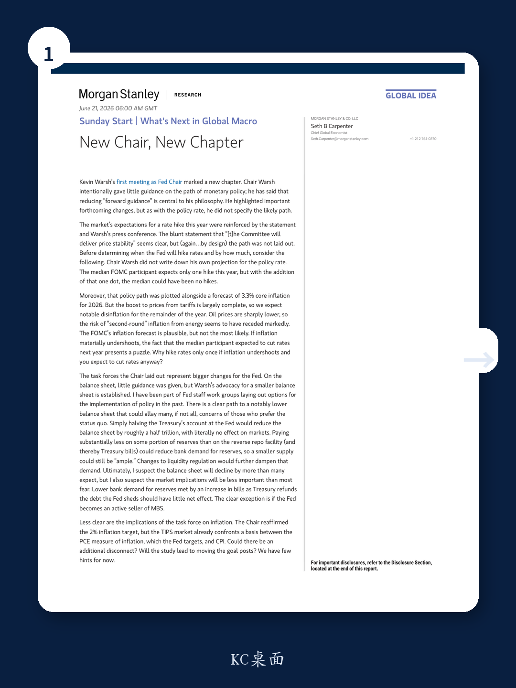
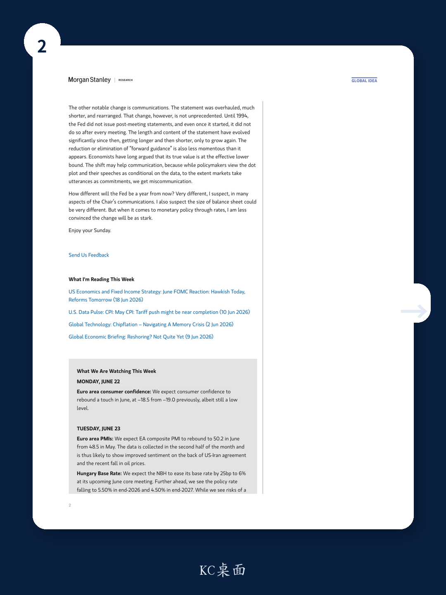

# The Fed’s New Chapter Is Not What Markets Think: Why the Real Transformation Is Structural, Not Tactical

The Federal Reserve under Chair Kevin Warsh has begun its first chapter, and the market’s immediate reaction has been to focus on the wrong question. The dominant narrative is whether the Fed will hike rates once this year or not at all. That debate, while tactically important, misses the deeper strategic shift underway. The most consequential changes at the Fed are not about the path of the policy rate in 2026. They are about the architecture of monetary policy itself: how the Fed communicates, how it manages its balance sheet, and how it defines its inflation mandate. Investors who spend the next six months obsessing over the dot plot will miss the transformation that will reshape the financial landscape for years.

The first meeting under Warsh was deliberately opaque on the rate path. The Chair gave little guidance, reduced forward guidance as a matter of philosophy, and even declined to write down his own rate projection. This was not a failure of communication; it was a signal. The Fed is moving away from a model in which markets expect the central bank to pre-commit to a trajectory. Instead, it is embracing a regime of deliberate ambiguity, where policy decisions are made meeting by meeting, and where the burden of interpretation shifts back to market participants. For investors accustomed to the Fed holding their hand, this is a profound change. The question is not whether the Fed will hike in September. The question is whether the market can learn to operate without the crutch of forward guidance.

The inflation picture further complicates the rate narrative. The FOMC’s median projection of 3.3% core inflation for 2026 is plausible but, as the report notes, not the most likely outcome. The boost from tariffs is largely complete. Oil prices have fallen sharply. The risk of second-round inflation from energy has receded. If inflation materially undershoots, the Fed’s own projections show the median participant expecting to cut rates next year. That creates an intellectual puzzle: why hike rates once this year if inflation is already decelerating and you expect to cut next year? The answer may be that the single hike is not about inflation at all. It is about re-establishing credibility for a new regime. The Fed may be willing to accept a temporary overshoot of its own inflation forecast to signal that it will not be trapped by prior guidance. That is a strategic choice, not a macroeconomic one.

## The Balance Sheet Will Shrink More Than Markets Expect, But the Market Impact Will Be Smaller Than Feared

The most underappreciated development from the June meeting is the creation of a task force on the balance sheet. Chair Warsh’s advocacy for a smaller balance sheet is well established, and the report outlines a clear path to a notably lower balance sheet that could allay many concerns of those who prefer the status quo. The key insight is that the Fed can reduce its balance sheet by roughly half a trillion dollars simply by halving the Treasury’s account at the Fed, with literally no effect on markets. That is a mechanical adjustment, not a monetary tightening. Further reductions can be achieved by paying substantially less on some portion of reserves than on the reverse repo facility. This would reduce bank demand for reserves, meaning a smaller supply can still be considered ample. Changes to liquidity regulation would further dampen that demand.

The net effect is that the balance sheet may decline by more than most expect, but the market implications will be less important than most fear. Lower bank demand for reserves, met by an increase in Treasury bills as the Treasury refunds the debt the Fed sheds, should have little net effect. The clear exception is if the Fed becomes an active seller of mortgage-backed securities. That would be a different story entirely, as it would directly affect the housing market and the duration of the fixed-income universe. But the report does not suggest that is imminent. The strategic implication is clear: the Fed is moving toward a smaller, more efficient balance sheet, but it is doing so in a way that minimizes market disruption. Investors should not confuse the size of the balance sheet reduction with the magnitude of its market impact.

## The Inflation Task Force Raises Questions the Market Is Not Asking: Could the Goal Posts Move?

Less clear, and potentially more consequential, is the implications of the task force on inflation. Chair Warsh reaffirmed the 2% inflation target, but the report raises a critical question that markets are not yet pricing in. The TIPS market already confronts a basis between the PCE measure of inflation, which the Fed targets, and CPI. Could there be an additional disconnect? Will the study lead to moving the goal posts? The report gives few hints for now, but the very existence of the task force suggests that the Fed is at least contemplating whether the current framework is optimal.

Consider the implications. If the Fed’s study concludes that the 2% target is appropriate but that the measurement of inflation should change, the market would face a period of uncertainty about what the Fed is actually targeting. If the study concludes that the target itself should be adjusted, the implications are even more profound. A higher target would be inflationary for asset prices; a lower target would be deflationary. The report does not tell us which direction this might go, and that ambiguity is itself a signal. Investors should watch the task force’s output closely, not because it will change policy tomorrow, but because it could redefine the framework within which policy is made for the next decade.

## The End of Forward Guidance Is Less Dramatic Than It Sounds, But More Important Than It Looks

The reduction or elimination of forward guidance has been framed as a radical departure. In practice, it is less momentous than it appears. Economists have long argued that the true value of forward guidance is at the effective lower bound. In normal times, forward guidance can create more problems than it solves, because markets take utterances as commitments while policymakers view them as conditional on the data. That mismatch leads to miscommunication. Warsh’s shift may actually improve communication by eliminating the false precision of the dot plot and forcing markets to interpret data for themselves.

But this shift is more important than it looks for one reason: it changes the burden of proof. Under the old regime, the Fed had to convince markets that it would deviate from its guidance. Under the new regime, the Fed has no guidance to deviate from. That means markets must form their own views about the likely path of policy, and the Fed’s actions will be judged against those views, not against its own prior statements. This increases volatility around data releases and reduces the predictability of policy meetings. For fixed-income investors, this means that the value of carry trades and curve positioning will depend more on the data and less on the Fed’s word. For equity investors, it means that the Fed put is less explicit and less automatic. The regime change is real, even if the mechanism is subtle.

## The Report Leaves a Critical Question Unanswered: How Will the Fed Handle the Next Recession?

For all its insight into the current transition, the report does not fully answer the most important question for long-term investors. If the Fed is reducing forward guidance, shrinking the balance sheet, and potentially rethinking its inflation framework, how will it respond to the next recession? The tools that were used in 2020—aggressive forward guidance, large-scale asset purchases, and a commitment to keep rates low for an extended period—are precisely the tools that the new regime is dismantling. If a recession arrives before the new framework is fully established, the Fed may find itself without a playbook.

The report hints at this tension but does not resolve it. The FOMC’s own projections show rate cuts next year, which implies that the Fed expects to have room to ease. But if the balance sheet is smaller and forward guidance is gone, the Fed’s ability to signal its intentions will be reduced. The market will have to infer the Fed’s reaction function from its actions alone, which could lead to delayed or overshooting responses. This is not a criticism of the new regime; it is a recognition that every regime has trade-offs, and the trade-off for reduced forward guidance is reduced predictability during stress. Investors should begin scenario planning now for how they would position if the Fed’s new tools prove insufficient in the next downturn.

## A Decision Framework for Investors Navigating the New Fed Regime

The report provides the raw material for a decision framework that investors can use to navigate the next twelve months. The framework has three dimensions: the rate path, the balance sheet, and the inflation framework. Each dimension has a range of possible outcomes, and the investor’s task is to identify which combinations are most likely and how to position for them.

On the rate path, the median FOMC participant expects one hike this year, but the report makes clear that this is fragile. If inflation undershoots, the case for a hike collapses. If inflation persists, the case for more than one hike emerges. The key variable to watch is not the dot plot but the actual inflation data, particularly the core PCE prints over the next three months. A sustained decline below 3% would make a hike unlikely. A reacceleration above 3.5% would make multiple hikes possible.

On the balance sheet, the direction is clear: smaller. But the pace matters. If the Fed reduces the balance sheet primarily through the Treasury account and changes to reserve remuneration, the market impact will be minimal. If the Fed begins active MBS sales, the impact will be significant. The signal to watch is the composition of the balance sheet, not just its size.

On the inflation framework, the uncertainty is highest. The task force could reaffirm the current target, adjust the measurement, or change the target itself. Each outcome has different implications for breakeven inflation rates, TIPS spreads, and the dollar. The signal to watch is the language in Fed speeches and the task force’s interim reports.

The most important insight from this framework is that the three dimensions are not independent. A smaller balance sheet combined with a higher inflation target would be very different from a smaller balance sheet combined with a reaffirmed target. Investors should think in terms of scenarios, not single-point forecasts.

## The Next Chapter Is Being Written Now, But the Full Story Requires the Original Data

The report from MS’s chief global economist provides a rare window into the thinking of someone who has been inside the Fed’s policy process. The insight that the balance sheet can be reduced by half a trillion dollars with no market impact, or that the inflation task force could lead to a redefinition of the target, is not available in standard market commentary. But the report is a summary of a larger body of work, and the full analytical value comes from reviewing the original charts, the detailed data tables, and the historical comparisons that support these conclusions.

The questions that remain unanswered are the ones that will define the next phase of the market cycle. How will the Fed’s new approach to communication affect volatility around FOMC meetings? What is the probability that the inflation target is formally changed? How will the balance sheet reduction interact with the Treasury’s funding needs? These are not academic questions. They are the strategic questions that will determine whether portfolios are positioned for a regime of stability or a regime of transition.

Join the community to read the full report and review the original charts.

*This article is for learning and discussion only and does not constitute investment advice.*

Personal reading notes and learning share only. Not investment advice.

