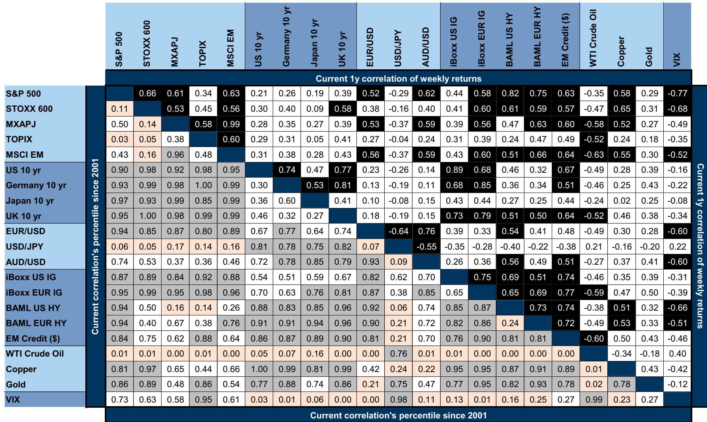
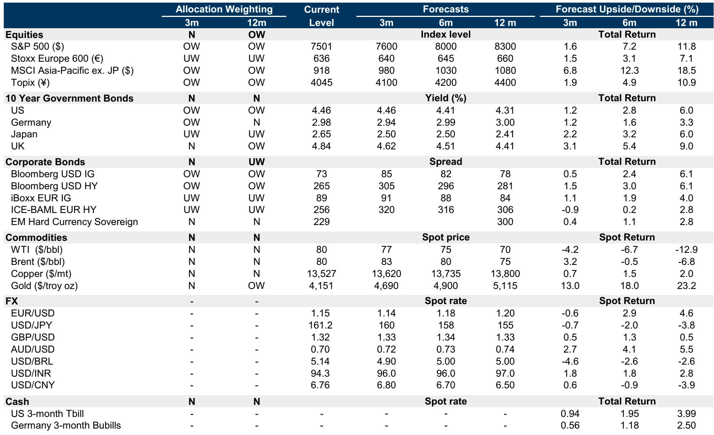
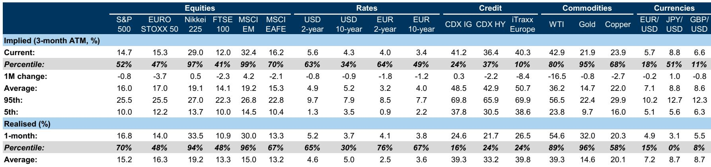

# GS：油价下跌是顺风，但前端的利率不确定性才是真正的逆风

上周的市场，被两股力量同时拉扯：一边是多家央行的议息会议，另一边是美伊谈判的持续推进。最终的结果，用一个词概括就是“分化”——大宗商品和债券市场在定价衰退风险缓解，而利率市场却在定价更加鹰派、更加不确定的货币政策路径。

这份GS最新的跨资产配置周报，给出了一个清晰但不简单的判断：**短期战术性中性，12个月战略性温和看多风险资产。** 但真正值得细读的，不是这个结论本身，而是支撑这个结论的三层逻辑——油价下跌如何改变了衰退概率，新主席的沟通风格如何重塑了利率预期，以及科技股为何在利率上行中依然坚挺。

## 1. 油价大跌让衰退概率减半，但GS并未因此全面看多

GS的大宗商品团队下调了布伦特原油价格预测，这一调整直接传导至宏观团队：他们将美国未来12个月衰退概率从25%下调至15%。逻辑很直接——更低的能源成本意味着更低的通胀压力，为消费者和企业提供了喘息空间，也给了美联储更多政策灵活性。

但有趣的是，GS并未因此大幅上调风险资产配置权重。报告显示，他们维持战术性中性，仅对12个月维度保持温和超配股票。这意味着，油价下跌带来的“顺风”被其他因素抵消了。

> **KC评论：** 衰退概率的下调是好事，但GS选择不以此作为加仓的理由。这提示投资者：不要因为一个好消息就全盘推翻之前的配置逻辑。完整报告中详细拆解了油价预测调整如何影响不同资产类别的收益率预期，以及GS内部跨部门观点是如何协调的——这些细节对于理解当前市场的定价结构非常关键。

## 2. 新主席的首秀让市场最不确定的不是方向，而是“如何沟通”

这是美联储主席Kevin Warsh的首次议息会议。他维持利率不变，但市场解读为“鹰派意外”——美元指数升至一年新高。GS用了一个非常精确的指标来量化这种不确定性：2年期与5年期利率互换波动率的比率，已升至2023年初以来的最高水平。

这个指标的含义是：市场对未来短期政策路径的不确定性，远高于对中期路径的不确定性。报告指出，这反映了Warsh偏好更少的前瞻指引和更少的新闻发布会，这可能导致政策结果分布更宽。换句话说，市场不怕加息，怕的是不知道什么时候加、加多少。

> **KC评论：** 这是一个被很多投资者低估的变化。过去几年，市场习惯了“看美联储点阵图做交易”。如果新主席有意减少前瞻指引，那意味着“美联储看跌期权”的透明度在下降。完整报告中有一张图展示了2年期美债收益率未来六个月波动超过正负50个基点的概率，这个概率在FOMC会议后已升至约41%——这个数字对利率敏感型资产的定价至关重要。

## 3. 科技股正在脱离利率的引力，这是AI叙事的力量

一个反直觉的现象正在发生：尽管实际利率上升，纳斯达克与标普500的比值却在走高。GS的解释是，AI相关的盈利乐观情绪和资本支出，正在抵消传统的估值逆风。

这意味着，科技股不再简单地跟随利率曲线波动。当市场相信AI将带来结构性增长时，估值对利率的敏感度就会下降。这种“脱钩”如果持续，将深刻改变资产配置的逻辑——传统上认为“利率上升利空成长股”的框架需要修正。

但报告也给出了一个冷却的视角：这种脱钩并非无条件的。当利率上升反映的是“更紧的政策路径”而非“更强劲的增长”时，市场整体会承压。当前的情况，恰恰是后者——利率上升是因为通胀预期和鹰派沟通，而非经济过热。

## 4. 黄金的短期风险被低估了：波动率已贵过股票和利率

GS将2026年底的黄金价格预测从之前的水平下调至4900美元/盎司，理由是利率敏感型黄金ETF需求下降，以及对发达国家央行独立性担忧的缓解。更值得关注的信号是：黄金波动率相对于股票和利率波动率已经变得昂贵。

这意味着，黄金作为对冲工具的成本正在上升。如果投资者继续用黄金来对冲利率冲击或地缘风险，他们需要支付更高的溢价。报告还点出了一个关键场景：如果发生政策或利率冲击，最有效的对冲工具不是黄金，而是债券看跌期权、长期利率支付者等。

## 5. 报告没有完全回答的问题：前端的“粘性”会持续多久？

GS的数据显示，市场正在定价一个“粘性的前端”——即短期利率将维持在当前水平附近，而不是大幅重新定价。期权隐含的概率表明，2年期美债收益率在未来六个月偏离当前水平超过50个基点的概率约为41%，虽然高于1月低点，但仍低于2022-2025年的大部分时间。

这种“粘性”意味着什么？它可能意味着市场预期美联储不会很快转向，但也意味着降息空间被压缩。对于持有现金或短久期债券的投资者来说，这似乎是个好消息——收益率还不错。但对于股票和信用债来说，高利率持续的时间越长，企业融资成本的压力就越难以忽视。

> **KC评论：** 这是整份报告最值得追问的问题：如果前端的“粘性”是新的常态，那么哪些资产会最先承受不住？GS在报告中给出了一个“利率冲击”场景下的对冲工具清单，但没有深入讨论这个场景的概率。完整报告中有一张图展示了不同资产在利率冲击下的beta系数，以及哪些对冲策略在历史上表现最好。这些细节对于构建一个真正有韧性的投资组合至关重要。

---

这份GS报告的核心矛盾在于：油价下跌和衰退概率下调是明确的顺风，但前端的利率不确定性和沟通风格的改变，构成了一个更难以量化的逆风。GS选择了战术性中性，等待更多的信号。

但真正的挑战在于，当“美联储看跌期权”变得模糊时，投资者需要建立自己的观察框架。以下三个问题值得持续跟踪：

第一，Warsh的沟通风格是否会进一步演变？如果下一次FOMC会议依然缺乏清晰的前瞻指引，市场可能需要重新定价整个利率路径。

第二，AI叙事能否持续支撑科技股脱离利率引力？如果AI资本支出开始放缓，或者盈利预期被下调，这种脱钩可能迅速逆转。

第三，黄金的昂贵波动率是否会抑制其作为对冲工具的需求？如果投资者开始寻找替代品，可能会改变整个避险资产的价格结构。

这些问题的答案，不会在一份周报中完全展开。但GS的数据和框架，为投资者提供了一个很好的起点。如果你希望深入理解这些图表背后的二阶影响，或者每天跟踪全球投行的最新研判，我们的社群每天会由AI agent和人工review生成国际投行中文摘要与KC评论，每日更新约10-40页，同时整理当天最新数据图表合集，方便喂给AI，也方便人工快速把握市场动态。欢迎来星球微信群里继续讨论。

Personal reading notes and learning share only. Not investment advice.

