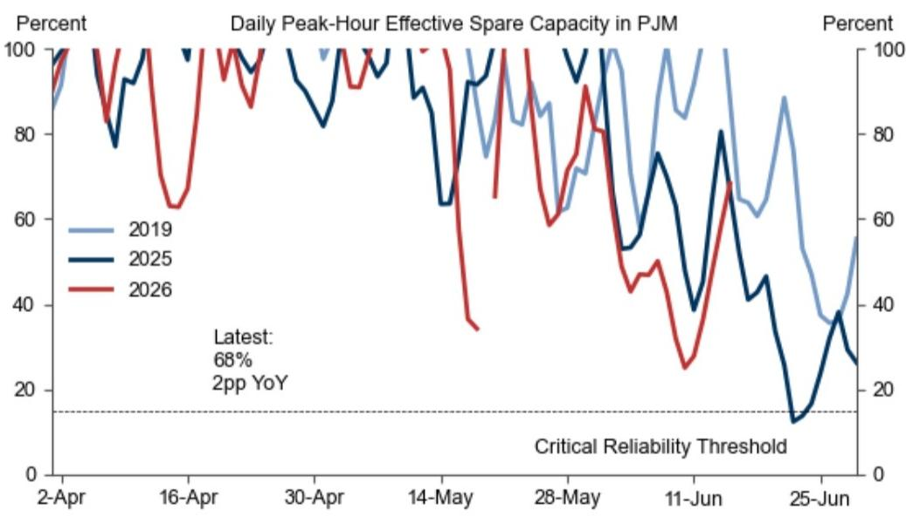
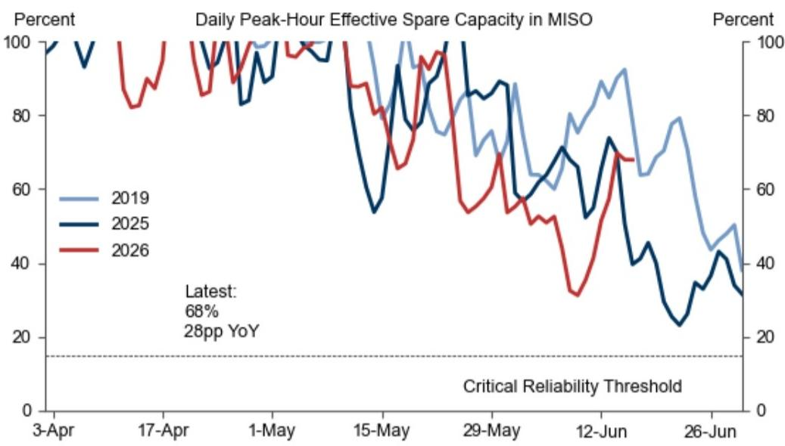
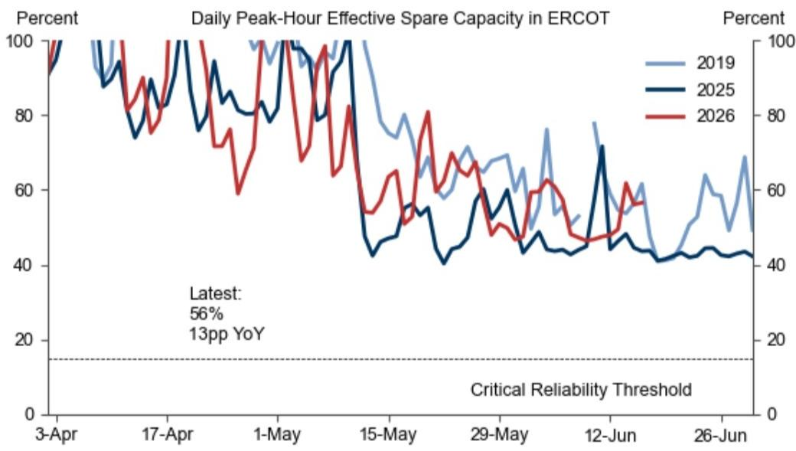

# GS：美国电力市场进入“区域撕裂”的夏季，PJM收紧而ERCOT松动

美国电力市场正在进入一个罕见的“区域分化”夏季。GS在最新发布的Power Tracker报告中提供了一个清晰但容易被忽视的判断：美国电力市场并非整体紧张，而是出现了以PJM（中大西洋地区）持续收紧和ERCOT（德州）逐步软化为核心的“区域撕裂”格局。这一判断的含金量在于，它直接指向了数据中心选址、能源投资和电力资产定价的结构性错位。

报告的核心信号是：PJM在6月合约换月时的电价涨幅远超十年均值，而ERCOT的同期涨幅却低于历史平均水平。这不是季节性波动，而是供给端基本面的根本性分化。GS还指出，联邦政府对煤电的7亿美元支持计划，对缓解市场紧张程度的作用可能有限。

---

## 1. PJM的6月电价跳升揭示了一个持续收紧的市场，而ERCOT的同期表现则确认了供给过剩的软化路径

GS通过观察6月1日区域电力市场从交易6月合约换月至交易7月合约时的价格变化，发现了一个关键信号。在PJM市场，2026年5月至6月的电价绝对涨幅达到28美元/兆瓦时，远高于2016-2025年历史均值15美元/兆瓦时；百分比涨幅为44%，也高于历史均值30%。这一涨幅是在天然气和煤炭等边际燃料价格涨幅更小的背景下实现的，说明电价上涨的动力来自供需基本面而非燃料成本。

相比之下，ERCOT市场同期绝对电价涨幅仅为24美元/兆瓦时，低于历史均值30美元/兆瓦时；百分比涨幅61%略高于历史均值56%，但5月和6月的价格水平均低于2024/2025年同期。这一对比直接验证了GS此前提出的“区域分化”观点：ERCOT自2025年下半年以来因大量新增电力供给而进入软化通道，而PJM预计在未来几年内仍将维持高度紧张状态。

> **KC评论：** 这意味着投资于PJM区域的数据中心和工业项目将面临更高的电力成本和更长的并网等待时间，而ERCOT区域的电力成本优势正在扩大。但对于打算在德州布局的投资者，需要警惕供给过剩可能带来的电价下行风险。

---

## 2. 联邦7亿美元煤电支持计划对缓解市场紧张程度的作用有限，尤其是在2028年之后

特朗普政府近期宣布了一项近7亿美元的煤电支持计划，主要通过融资和推迟/取消已排定的煤电机组退役来增加电力供给。GS认为，这一计划确实能在短期增加部分电力供给，但整体影响在2026-2028年期间有限，2028年后更是微乎其微。

原因有二。第一，大量已排定的煤电退役已经在2025年5月能源部首次紧急命令后被推迟，将原定2025/2026年退役的机组推迟至2026-2029年。剩余的退役计划面临物理和财务约束：已被推迟的机组再次推迟的门槛更高，且大多数煤电厂已老旧，原退役计划下缺乏大规模维护投入，累积的维护成本可能超出7亿美元基金的覆盖范围。

第二，2028年之后的政策不确定性依然存在。煤电厂和煤生产商面临持续的监管和政策不确定性，这抑制了大规模资本支出用于升级或扩建产能。一个典型案例是TVA（田纳西河流域管理局）电力市场，总计4.1吉瓦的煤电产能（原定于2028年底前全部退役）已被推迟，但2028年之后的退役时间表保持不变。

> **KC评论：** 市场对“政府救煤电”的预期可能过于乐观。7亿美元分散到多个州和多个机组，实际能延缓的退役规模有限。真正值得关注的不是这笔钱本身，而是政策信号背后的含义——政府已经意识到电力供给紧张，但干预工具箱有限。完整报告中有一张图表清晰展示了不同年份煤电退役推迟的规模分布，值得细看。

---

## 3. 数据中心需求正在加速增长，但区域分布不均将进一步加剧电力市场分化

GS的数据显示，美国数据中心容量继续增长，预计在2026年6月和下半年将加速。从区域分布看，德州、弗吉尼亚州在过去一年的数据中心容量扩张中领先，其次是亚利桑那州、印第安纳州、俄亥俄州和佐治亚州。而在2026年第二季度，俄亥俄州、德州和弗吉尼亚州是数据中心开发最活跃的地区。

PJM区域集中了美国39%的数据中心电力需求容量。这意味着，在PJM市场持续收紧的背景下，数据中心运营商将面临更大的电力获取难度和成本压力。GS预计，2026/2027年美国全国及主要区域电力市场的数据中心增长将显著加速。

报告还指出，弗吉尼亚州的数据中心电力需求仍在持续攀升，而该州正是PJM市场的重要组成部分。这种需求增长与供给增长之间的错配，是PJM市场持续紧张的核心驱动力。

> **KC评论：** 数据中心选址正在变成一场“电力争夺战”。PJM区域的电价上涨和供给紧张，将迫使更多数据中心运营商将目光转向ERCOT或其他区域。但ERCOT的供给过剩是暂时的还是结构性的？完整报告中对不同区域电力市场的供需平衡预测有更详细的拆解。

---

## 4. 电力需求增长的结构性分化：商业部门领跑，工业部门回暖，住宅部门疲软

GS对美国电力需求的分部门分析揭示了另一个重要信号。2026年1-3月，商业部门以2.7%的同比增长率成为电力需求增长最强的板块。工业部门在经历了1-2月的疲软后，3月出现回暖。住宅部门在1月开局疲弱后，2-3月同比基本持平。

值得注意的是，经天气调整后的美国总电力需求在2026年1-3月同比增长1.2%，低于2025年全年的增长水平。未经天气调整的3月总电力需求同比增长2.3%，也低于2025年全年2.4%的增速。这说明，尽管数据中心需求在加速，但整体电力需求增长并未出现全面加速，而是呈现结构性分化。

---

## 5. 报告尚未完全回答的关键问题：煤电支持计划的执行细节和2028年后的政策路径

GS的报告对煤电支持计划的分析质量很高，但仍留下了一些未解问题。第一，7亿美元基金的具体分配机制和执行效率尚未明确。资金是直接补贴给运营商，还是通过贷款或税收优惠？不同州的执行能力差异可能会影响实际效果。

第二，2028年后的政策不确定性是一个关键变量。报告提到了TVA案例，但未深入分析其他区域煤电厂在2028年后的退役计划是否会因政策变化而调整。如果2028年后煤电退役加速，PJM等市场的紧张程度可能会进一步加剧。

第三，报告对数据中心需求的预测基于当前的建设计划，但未充分讨论AI能耗效率提升或技术路线变化可能对电力需求产生的下行风险。

---

## 6. 对产业决策者的观察框架：三个维度判断电力市场的真实走向

基于GS的分析，产业决策者可以从以下三个维度建立自己的观察框架：

第一，关注PJM与ERCOT的价差变化。如果PJM电价持续高于ERCOT且价差扩大，说明区域分化在加剧，数据中心和工业项目的选址决策应更倾向于ERCOT区域。

第二，跟踪煤电退役的实际执行情况。7亿美元支持计划的效果需要观察2026年下半年是否有更多机组被推迟退役，以及这些推迟是否可持续。

第三，关注数据中心建设速度与电力供给增长的匹配度。GS预计2026年下半年数据中心增长将加速，但如果电力供给增长跟不上，PJM等市场的紧张程度将进一步上升。

---

GS的这份报告提供了一个清晰的结论：美国电力市场正在进入一个“区域撕裂”的夏季，PJM收紧而ERCOT松动。这一格局对数据中心选址、能源投资和电力资产定价都有深远影响。但报告也留下了一些未解问题——煤电支持计划的执行细节、2028年后的政策路径、以及数据中心需求的技术风险——这些都需要更深入的讨论。

每天，我们的AI agent和人工团队会一起生成国际投行中文摘要与KC评论，每日更新约10-40页，同时整理当天最新数据图表合集。这些内容既方便喂给AI，也方便人工快速把握市场动态。如果你对电力市场、数据中心选址或能源投资有进一步思考，欢迎来我们的知识星球和微信群继续讨论。

Personal reading notes and learning share only. Not investment advice.

