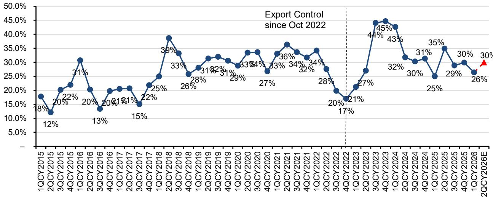
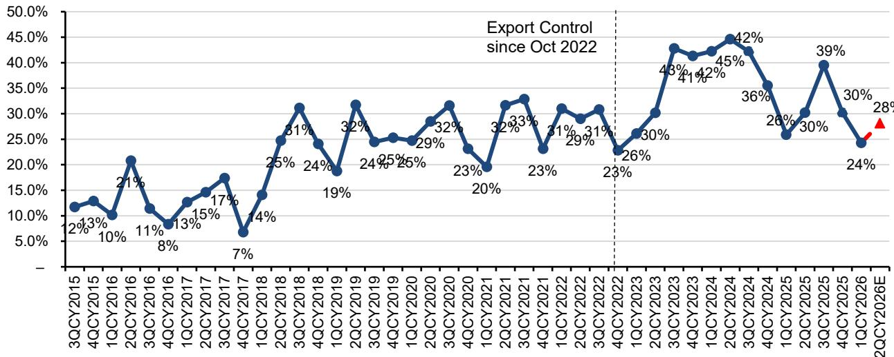
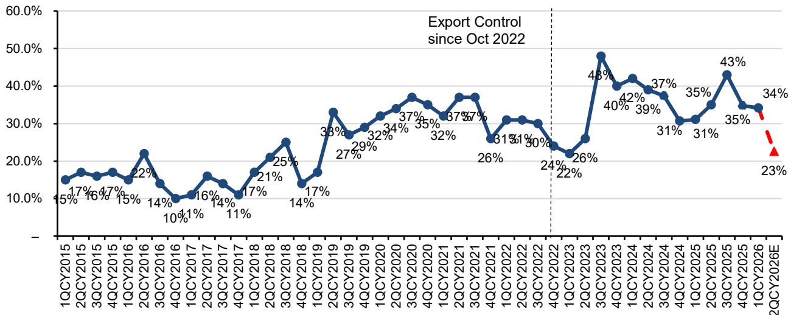

# China’s WFE Import Weakness Is a Supply Problem, Not a Demand Problem — And the Recovery Will Be Sharper Than Expected

The narrative around China’s semiconductor equipment market has turned cautious. Year-to-date through May 2026, wafer fabrication equipment imports to China have fallen 12% year-over-year, with total imports reaching just $12 billion. May alone saw only $2.2 billion in imports, well below last year’s monthly average of $3.2 billion. For investors watching the global semiconductor capital equipment cycle, this looks like a clear signal of softening Chinese demand. That reading is wrong.

The weakness in China’s WFE imports is not a demand story. It is a supply story, and more specifically, a lithography supply story. The data reveals a market where Chinese fabs are ready to spend but constrained by the availability of critical equipment, particularly from a single Dutch supplier. The year-to-date decline is almost entirely driven by a 24% drop in lithography imports, which have fallen to $2.14 billion. Strip out lithography, and the rest of the WFE import picture tells a very different story — one of resilience, substitution, and accelerating domestic capability.

This distinction matters because it changes the forward view. If the weakness were demand-driven, the outlook would be prolonged and uncertain. But because it is supply-driven, the recovery — when it arrives — will be sharp, concentrated, and potentially disruptive to consensus expectations. The second half of 2026 is shaping up to be much stronger than the first, driven by a recovery in memory investment and an eventual easing of lithography bottlenecks. Investors who interpret the current data as a trend rather than a temporary constraint are likely to be caught offside.

## The May Import Data Confirms the Pattern: Lithography Is the Constraint, Not the Canary

The May 2026 single-month data reinforces what the year-to-date numbers have been signaling. Total WFE imports of $2.2 billion were down 20% month-over-month and 9% year-over-year. On the surface, this looks like broad-based weakness. But the composition tells a more nuanced story.

Lithography imports recovered from April’s historically low point, coming in at $297 million — up 171% month-over-month and essentially flat year-over-year. That recovery is encouraging, but the level remains at the lower end of the historical range. The real drag came from dry etch and other equipment categories, which saw double-digit year-over-year declines. Meanwhile, deposition equipment and process control both posted double-digit year-over-year increases, signaling that Chinese fabs are actively investing in non-lithography tool sets wherever possible.

This pattern is consistent with a market that is making do with what it can get. When lithography tools are unavailable, fabs cannot complete their tool sets, and overall import numbers are suppressed. The fact that deposition and process control imports are growing even as total imports decline suggests that Chinese fabs are front-loading orders for equipment that is not supply-constrained, preparing for the moment when lithography tools finally arrive.

The regional import data adds another layer of insight. Imports from Singapore and Korea showed strong year-over-year growth of 38% and 12% respectively. Combined imports from Singapore, the United States, and Malaysia reached $1.1 billion in May, down just 3% year-over-year. This is consistent with a longer-term trend: U.S. suppliers are increasingly shipping to China from their Singapore and Malaysia production facilities rather than directly from the United States. The share of U.S.-plus-Southeast-Asia imports has risen to 44% year-to-date in 2026, up from 35% in 2025 and 33% in 2024. This is not a sign of weakening demand — it is a sign of supply chain adaptation.

## The Lithography Bottleneck Will Break in the Second Half, and Memory Will Lead the Recovery

The single most important analytical question for the China WFE outlook is whether the lithography supply constraint is structural or temporary. The evidence points to the latter.

The year-to-date lithography import decline of 24% is dramatic, but it follows an extraordinary 2024 when lithography imports accounted for 28% of total WFE imports — a share that was unsustainably high. Chinese fabs spent aggressively on lithography tools in 2023 and 2024, building inventory ahead of anticipated restrictions and capacity constraints. The current weakness is partly a normalization from those elevated levels, not a collapse in demand.

More importantly, the lithography supplier itself has provided guidance that points to a recovery. During its first-quarter results, the Dutch lithography giant reiterated that China revenue is expected to decline to approximately 20% of total revenue in fiscal 2026, down from 33% in fiscal 2025. This guidance already embeds the current weakness. But the key phrase is “potential upside to guidance if capacity of DUV supply improves.” The company’s own regression model estimates that China sales will decline sharply to approximately 570 million euros in the second quarter, down 52% quarter-over-quarter and 33% year-over-year, implying that China will represent only about 9% of total system sales in that quarter. That is a very low base.

The second-half recovery is likely to be led by memory investment. Chinese memory manufacturers are expanding aggressively, and their equipment procurement cycles are less dependent on the most advanced lithography tools. Memory WFE imports should be much stronger in the second half, and this will be the primary driver of the overall recovery. The year-to-date weakness has been concentrated in logic-oriented equipment categories, while memory-related spending has been relatively resilient. As memory fabs move into their next procurement wave, the import numbers will improve meaningfully.

## The Implications for Individual Equipment Suppliers Are Highly Divergent and Reveal the True Shape of Demand

The import data allows for a reasonably granular estimate of how individual equipment suppliers are likely to perform in the coming quarters. The pattern that emerges is not one of uniform weakness but of significant divergence, which tells us where the real demand is versus where supply constraints are binding.

For the dry etch and deposition suppliers, the outlook is more nuanced. One major etch supplier’s May data suggests that June-quarter China revenues will decline approximately 25% quarter-over-quarter, with China exposure landing at roughly 23% of total revenues. This is directionally consistent with management commentary that China exposure will decline sequentially. But another major supplier’s data points in the opposite direction: May data suggests July-quarter China revenues will increase approximately 28% quarter-over-quarter, with China exposure landing at roughly 30% of total revenues. Management for this supplier suggested that their China business would be flattish to slightly up over the calendar year, so the import data implies upside to that view.

The inspection and metrology supplier shows a similar pattern of divergence. May data suggests June-quarter China revenues will increase approximately 22% quarter-over-quarter, with China exposure landing at roughly 28% of total revenues. Management did not provide specific guidance for China revenue exposure but noted that overall China WFE will grow at a slower rate than broader WFE this year. The import data suggests that, at least for this supplier, China may be outperforming that characterization.

Among the Japanese suppliers, the divergence is even more striking. One supplier’s data suggests China revenue could be down 5% year-over-year but up 5% quarter-over-quarter, with an implied China mix of 28%. Another supplier shows much stronger momentum: China revenue could be up 40% year-over-year and 69% quarter-over-quarter, with an implied China contribution of roughly 40%. A third Japanese supplier shows a very different picture: China revenue could be down 32% year-over-year and 64% quarter-over-quarter, with an implied China contribution of only about 20%.

These divergences are not random. They reflect the specific product portfolios of each supplier and the degree to which their tools are subject to supply constraints or export controls. Suppliers whose products are in high demand and less constrained are seeing robust China revenue. Suppliers whose products compete more directly with available alternatives, or whose tools are more tightly linked to lithography availability, are seeing weakness. The market is not treating all equipment suppliers equally, and the import data provides a real-time map of where the bottlenecks are.

## What the Report Does Not Fully Answer: The Sustainability of Domestic Substitution and the Risk of Policy Acceleration

The import data is a powerful tool for tracking near-term trends, but it leaves several critical questions unanswered. The most important of these is the trajectory of domestic substitution. Chinese domestic equipment suppliers are gaining share rapidly. The report identifies three domestic leaders — one focused on deposition and etch, one on dry etch and deposition, and one on deposition and advanced packaging — all of which are benefiting from the domestic substitution trend with accelerating share gains. The import data shows that the share of imports from the Netherlands has declined, while imports from Singapore and Malaysia have increased. But it does not tell us how much of this shift represents genuine domestic production versus supply chain re-routing by foreign suppliers.

If the shift toward domestic suppliers is real and accelerating, then the long-term peak of China’s WFE imports may be behind us, even if the near-term recovery is sharp. If, on the other hand, the shift is largely a function of foreign suppliers changing their shipping points, then imports will recover more fully once supply constraints ease. The data cannot distinguish between these two scenarios, and the answer depends on factors that are not captured in customs statistics: the actual production capacity and technology level of Chinese domestic equipment makers, the willingness of Chinese fabs to qualify domestic tools, and the pace of export control evolution.

A second unanswered question is the policy risk trajectory. The current import weakness is partly a function of supply constraints that are themselves a function of export controls. But export controls are not static. If controls tighten further, the recovery could be delayed or permanently capped. If controls ease, the recovery could be even sharper than expected. The report acknowledges that lithography imports from the Netherlands have been constrained, but it does not model the probability or impact of further policy changes. Investors need to form their own view on this, and the range of outcomes is wide.

## A Decision Framework for Investors: Three Questions to Distinguish Signal from Noise

For investors trying to navigate the China WFE story, the import data is valuable but must be interpreted through a structured lens. The following framework can help distinguish between temporary noise and structural shifts.

First, ask whether the equipment category in question is supply-constrained or demand-constrained. If the weakness is concentrated in categories where global supply is tight — as is the case with lithography — then the weakness is likely temporary and will reverse when supply improves. If the weakness is in categories where there is ample global supply but Chinese fabs are not buying, then the weakness is demand-driven and more concerning. The current data suggests that lithography is the primary supply-constrained category, while dry etch weakness may reflect a combination of factors. Investors should monitor whether dry etch imports recover in tandem with lithography or remain weak, which would signal a different problem.

Second, ask whether the supplier in question has direct exposure to the lithography bottleneck or is positioned to benefit from substitution. Suppliers whose tools are purchased in a fixed ratio to lithography tools — such as certain etch and deposition equipment — will see their China revenue recover only when lithography tools arrive. Suppliers whose tools can be purchased independently, or whose tools are in high demand for memory expansion, may see continued strength even in the current environment. The divergence among Japanese suppliers is a case in point: the supplier with strong batch ALD exposure to NAND is seeing robust demand, while the supplier with cleaning equipment exposure to logic is seeing weakness.

Third, ask whether the import data is consistent with management guidance or diverging from it. Where the import data suggests upside to guidance, as appears to be the case for at least one major U.S. supplier, the stock may be mispriced. Where the import data confirms guidance, the stock is likely fairly valued on the China narrative. Where the import data suggests downside, caution is warranted. This framework allows investors to use the import data not as a standalone signal but as a cross-check against company-specific expectations.

## The Second-Half Recovery Is Not Fully Priced, and the Divergences Create Alpha Opportunities

The China WFE import data tells a story that is more interesting and more nuanced than the headline numbers suggest. Year-to-date weakness of 12% sounds alarming, but it is almost entirely a lithography story. The rest of the equipment market is showing resilience, substitution, and in some categories, genuine growth. The second-half recovery will be driven by memory investment and an eventual easing of lithography supply constraints, and it will be sharper than current consensus expectations.

The implications for individual suppliers are highly divergent, and this divergence creates opportunities for investors who can distinguish between companies that are genuinely exposed to China demand weakness and companies that are merely experiencing a temporary supply-driven lull. The import data provides a real-time, granular map of these dynamics, but it requires careful interpretation.

The full report contains detailed monthly data, regional breakdowns, equipment-type segmentation, and regression-based revenue estimates for each major supplier. It also includes the ticker table with specific ratings and price targets, as well as investment implications for each covered company. For investors who want to move beyond the headline numbers and build a position-level view of the China WFE opportunity, the original charts and analysis are essential.

Join the community to read the full report and review the original charts.

*This article is for learning and discussion only and does not constitute investment advice.*

Personal reading notes and learning share only. Not investment advice.

