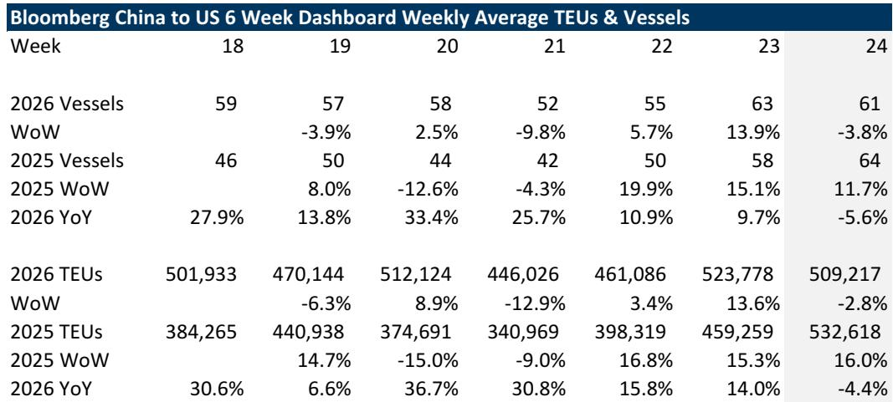
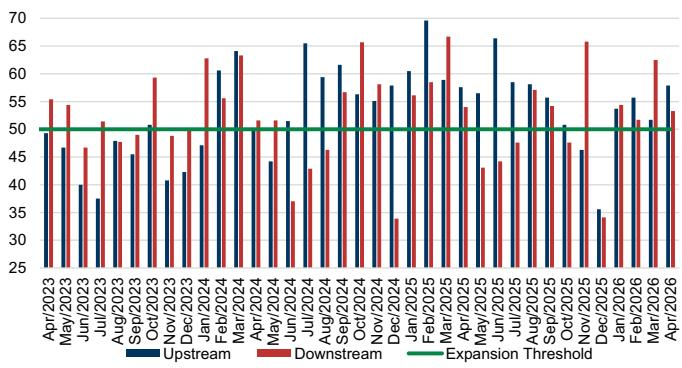

# GS：中国对美出口已转负，但真正的拐点藏在6月之后

这份来自GS的最新周度关税影响追踪报告，传递了一个清晰但容易被忽视的信号：中国对美集装箱货流在最新一周出现了同比和环比的双重下滑。但这并非简单的“需求退潮”，而是一个更复杂格局的开端——去年“解放日”关税暂停期带来的提前抢运效应正在消退，同比基数将变得陡峭，而真正的考验在于，船公司、货主和物流商如何在不确定性中重新校准他们的库存与航线决策。

报告的核心价值不在于给出一个方向性的看多或看空，而在于它用高频数据拆解了“关税影响”这个宏观概念，将其还原为每周的船舶离港数、TEU（标准箱）变动、港口吞吐量与运价波动。对于产业决策者和关注全球贸易格局的投资者而言，理解这些数据背后的逻辑，远比猜测下一个关税公告更重要。

## 1. 中国出发的满载集装箱船已出现同比负增长，抢运效应正在快速消退

GS追踪的数据显示，截至6月18日当周，从中国驶往美国的满载集装箱船数量环比下降4%，同比下降6%。这与前一周10%的同比增长形成了鲜明对比。TEU（标准箱）数据同样印证了这一趋势，同比下降4%，环比下降3%。

这组数据最直接的解读是：去年“解放日”关税暂停后引发的集中抢运潮，其基数效应正在快速放大。2025年同期，大量货物为了赶在关税恢复前涌入美国，形成了异常高企的同比基数。当这个基数效应开始显现，即使绝对货量并未断崖式下跌，同比数据也会自然转负。

> **KC评论：** 同比转负本身并不等同于需求崩溃。它更多是告诉我们，去年那个由政策窗口期驱动的“人造高峰”已经过去。真正值得关注的是未来几周环比数据的走向——如果环比持续负增长，才意味着需求本身在萎缩。GS报告里还有一张“TEU 15日滚动同比”的图表，能更清晰地看到这个拐点是如何形成的，值得完整报告读者细看。

这意味着，单纯用“中国对美出口下降”来推导贸易脱钩加速，可能过于草率。当前的数据更像是市场在消化过去一年的政策扰动，进入一个重新寻找平衡点的阶段。

## 2. 洛杉矶港未来两周的到港计划将转负，但两周后可能反弹，显示供应链仍在高频调整

GS引用的Port Optimizer数据显示，洛杉矶港计划到港的TEU在6月19日当周环比微增1%后，预计下周（6月26日当周）将环比下降6%，而两周后（7月3日当周）又预计环比增长7%。同比方面，这两周预计分别为-0.5%和-6%。

这种“下周跌、下下周涨”的锯齿状波动，恰恰反映了当前供应链决策的极度短视化。船公司和进口商不是在制定半年或季度的运输计划，而是在根据每周的政策风声和关税预期，不断调整发货节奏。这种高频调整本身就是不确定性成本的一部分。

> **KC评论：** 这种“先跌后涨”的节奏，可能暗示部分货主在等待一个更明确的关税信号，然后集中补货。但GS在报告中特别提醒，6月和7月的货量走势，将揭示船公司如何在一个地缘政治不确定的背景下，决定补库存的节奏。这个判断的验证，需要持续追踪未来4-6周的数据，这正是完整报告高频追踪模块的核心价值所在。

对港口和物流企业而言，这种波动意味着产能规划变得极其困难。旺季可能不再是一个连续的峰值，而是一系列不规则的脉冲。

## 3. 海运运价环比大涨19%，但GS认为后续“颠簸”在所难免

尽管货量出现波动，但中国/东亚至美国西海岸的集装箱运价在最新一周环比大涨19%，同比也上涨3%。GS对此的定性是“颠簸”（choppiness）——他们预计未来几周运价仍将保持波动，原因是全球运力可能因地缘政治事件而重新配置，同时也面临潜在的附加费和旺季前的抢运。

运价与货量的背离，揭示了当前市场的一个关键特征：**供给端对价格的影响力超过了需求端。** 红海绕航导致的运力结构性紧张、船公司对运力的主动控制，都使得运价对货量变化的敏感度下降。只要货量不出现断崖式下跌，运价就能在高位维持甚至进一步上涨。

但这对于货主和依赖物流成本的企业来说，是一个危险的信号。高运价环境下，任何需求的边际放缓，都可能触发运价的剧烈回调。GS报告中关于“全球运力可能因地缘政治事件而重新配置”的表述，暗示了这种回调的触发点可能来自供给端而非需求端——比如红海局势的意外缓和。

## 4. 卡车运输的“强现实”与集装箱的“弱预期”形成反差，物流链条出现结构性分化

报告中最值得玩味的对比来自卡车运输端。美国西海岸的卡车装载可用量同比下降3%，但同比仍暴涨79%。卡车现货运价（扣除燃油）环比微涨0.5%，同比大涨50%。

这与集装箱端的疲软形成了鲜明反差。一个可能的解释是：卡车运输更多服务于美国国内的“最后一公里”配送和制造业补库，而集装箱运输反映的是跨太平洋的贸易流。当关税不确定性导致海外采购节奏放缓时，美国国内已经到港的货物仍在通过卡车网络进行分销和消化。这意味着，美国国内的经济活动可能比外贸数据所暗示的更具韧性。

GS在报告中提到，他们看好交通运输板块的周期复苏故事，尽管底部的确认一再推迟。卡车运价的坚挺，可能正是这个“底部”正在形成的早期信号之一。但报告也坦承，这需要更多数据来验证。

## 5. 报告尚未完全回答的关键问题：中国“替代效应”何时能在数据中体现

GS在报告中提出了一个重要的前瞻性判断：那些目前享受较低实际关税税率的国家，可能会增加对美国的出口。但他们也承认，这需要时间才能在数据中体现出来，尤其是对于中国大陆的制造业和航运业而言。

这是一个尚未被数据验证，但逻辑上极为关键的命题。如果“中国+1”或“中国+2”策略真的在加速，那么未来几周，我们将看到越南、印度、墨西哥等国的对美出口数据出现显著增长。但GS的数据目前只覆盖了中国和“亚洲除中国”（包括越南、韩国、台湾、日本）的对比，且后者在最新一周的船舶和TEU同比也出现了负增长（-10%和-9%）。

这意味着，替代效应可能尚未大规模启动，或者其规模还不足以对冲中国出口放缓的影响。这是完整报告中最值得追踪的变量之一——GS是否会调整其“亚洲除中国”的样本范围，或者引入新的数据源来捕捉从中国转移出去的产能。

## 6. 对决策者的观察框架：从“看方向”转向“看节奏”

这份GS报告给所有关注全球贸易的人提供了一个新的观察框架：不要问“贸易是复苏还是衰退”，而要问“供应链调整的节奏是快还是慢”。

具体而言，可以关注三个核心指标：
第一，中国对美货量的环比变化，而非同比。同比数据已被基数严重扭曲。
第二，洛杉矶港的到港计划与实际到港之间的偏差。偏差越大，说明供应链的即时调整越剧烈。
第三，海运运价与卡车运价之间的价差。如果海运运价回落而卡车运价坚挺，说明“堵在港口”的问题正在缓解，而“国内配送”的需求依然强劲。

这三个指标合在一起，才能拼凑出关税影响下全球供应链的真实图景。GS的报告每周更新这些数据，其价值不在于给出一个简单的结论，而在于为决策者提供了一个持续校准判断的仪表盘。

---

关于GS报告中提到的“2026年贸易与运输情景路线图”，以及他们为何在不确定性中仍对周期复苏保持乐观，还有那些尚未在数据中完全体现的“中国+1”策略如何影响物流商的选股逻辑，这些更深层的分析框架，我们会在社群中结合每日更新的投行摘要与数据图表继续讨论。

每天，我们的AI agent与人工review会生成约10-40页的国际投行中文摘要与KC评论，并整理当天最新数据图表合集，既方便喂给AI进行深度分析，也方便人工快速把握全球市场动态。欢迎加入我们的星球微信群，一起追踪这些关键变量的演变。

Personal reading notes and learning share only. Not investment advice.

