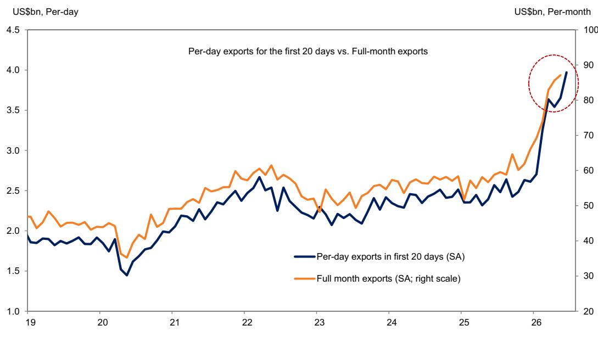

# GS：韩国出口加速，全球贸易最清晰的领先信号已经出现

全球投资者仍在争论“去全球化”与“再全球化”的叙事，但GS最新发布的韩国6月前20天出口数据，给出了一个更直接的答案：全球贸易正在加速，而不是减速。

韩国6月前20个工作日日均出口环比增长8.7%，较前值3.1%明显提速。总出口环比增长5.7%，贸易顺差扩大至175亿美元的历史新高。这不是一个孤立的月度波动，而是一个连续加速的趋势信号——韩国出口在5月环比增长9.8%的基础上，6月进一步走强。

对于任何一个跟踪全球周期的投资者来说，韩国出口数据都是最可靠的先行指标之一。韩国经济体高度外向，半导体、汽车、船舶、机械等产品覆盖全球供应链的各个环节。韩国的出口数据，本质上是全球制造业需求的一张实时心电图。

GS这份报告的核心判断是：韩国出口的加速是广泛的，产品覆盖半导体、其他科技产品和非科技产品，区域覆盖亚洲新兴市场、中国、美国和日本。这不是一个由单一产品或单一市场驱动的脉冲，而是一个需求面同步改善的信号。

> **KC评论：** 韩国出口数据之所以重要，不仅因为它是“全球贸易的煤矿中的金丝雀”，更因为它往往领先全球制造业PMI 1-2个月。6月数据意味着，三季度全球制造业活动大概率会继续改善。完整报告中的Exhibit 1提供了环比走势的时间序列，值得仔细对比历史拐点。

## 1. 半导体增速放缓但仍在扩张，更值得关注的是其他科技产品出口的爆发

GS报告显示，6月前20天韩国半导体出口环比仅增长2.0%，较前值11.9%明显放缓。半导体出口增速的放缓，可能会被部分投资者解读为AI需求见顶的信号。但GS的数据揭示了一个更完整的图景：其他科技产品出口环比增速从前值大幅跃升至17.1%，主要由计算机和家用电器出口驱动。

这意味着什么？半导体出口增速放缓，更多是基数和节奏问题，而非需求拐点。其他科技产品的爆发，反而说明终端需求正在从AI基础设施向更广泛的消费电子和家电领域扩散。这是一个需求面“扩围”的信号，而非“收窄”的信号。

对于关注全球科技周期的投资者来说，这个结构性变化值得追踪。如果其他科技产品出口的加速能够持续，将意味着全球消费电子需求正在走出低谷，而不仅仅是AI算力投资的单点爆发。

## 2. 亚洲新兴市场是出口加速的主要驱动力，中国和美国需求稳定但非主推力

GS报告明确指出，6月前20天韩国出口的环比增长，主要由对亚洲新兴市场的出口驱动。其中，对新加坡出口环比飙升98.4%，对马来西亚增长59.0%，对台湾增长11.1%。这三个目的地合计贡献了总出口环比增量的约三分之二。

相比之下，对中国大陆和日本的出口环比仅增长约2%，对美国出口增长3.6%。这些传统主要市场的表现相对温和。

这个分布特征值得深入解读。亚洲新兴市场出口的爆发，可能反映了两个逻辑：一是全球供应链重构过程中，东南亚国家作为“中转站”和“制造基地”的角色在强化；二是这些国家自身的内需也在改善。新加坡和马来西亚的出口激增，很可能与半导体和电子产品的转口贸易有关，但也可能包含了区域内部需求复苏的因素。

> **KC评论：** 对亚洲新兴市场出口的爆发，是GS这份报告中最容易被忽视但最重要的信号。它暗示全球贸易的“地理结构”正在发生变化。传统的中国-美国-欧洲贸易轴心，正在被中国-东南亚-美国的多层网络所替代。完整报告中对区域出口的细分数据，是理解这一结构性变化的关键素材。

## 3. 非科技出口也在改善，贸易顺差创历史新高，说明增长质量不差

GS报告显示，非科技产品出口环比增长4.8%，高于前值3.1%，汽车、机械、石油产品和船舶出口均出现广泛改善。这意味着韩国出口的加速不是科技行业的“独角戏”，而是制造业的整体回暖。

与此同时，进口环比增长3.1%，增速较前值5.4%有所放缓。贸易顺差扩大至175亿美元的历史新高。这个组合——出口加速+进口增速放缓——通常意味着外部需求强劲而国内需求相对温和，对于韩国这样的出口导向型经济体来说，是一个健康的增长结构。

但这里也有一个需要追问的问题：进口增速放缓，尤其是能源产品进口的收缩，是否反映了韩国国内需求的疲软？如果国内需求持续偏弱，出口的可持续性也会受到质疑。GS报告没有展开讨论这一点，但它是一个值得持续跟踪的风险因素。

## 4. 报告尚未完全回答的关键问题：出口加速的持续性如何评估

GS这份报告提供了清晰的数据和判断，但作为一份以“前20天数据”为基础的快评，它天然存在几个未解问题：

第一，6月前20天的数据是否会被后10天的数据“修正”？历史经验表明，月度前20天出口数据与全月数据之间有时存在偏差。如果后10天出口增速放缓，整个月的表现可能会弱于前20天。

第二，出口加速的“量价结构”如何？GS报告主要关注名义出口金额，但未区分价格因素和数量因素。如果出口增长主要由价格驱动（例如半导体价格上涨），那么实际贸易量的增长可能不如名义数据看起来那么强劲。如果主要由数量驱动，则意味着真实需求确实在改善。

第三，亚洲新兴市场出口的爆发是否可持续？新加坡和马来西亚的出口环比增长98.4%和59.0%，这种增速在月度数据中并不常见，可能存在一次性因素（例如大额订单交付或转口贸易的季节性波动）。需要更多月份的数据来确认这是趋势还是脉冲。

这些未解问题，正是投资者需要阅读完整报告、追踪后续数据的原因。GS报告中的Exhibit 1提供了环比走势的时间序列，但只有结合更长时间维度的数据，才能判断这一轮出口加速是否具有趋势性。

## 5. 对投资者的观察框架：韩国出口数据应该放在什么坐标中解读

基于GS这份报告，我们建议投资者建立一个三层观察框架：

第一层：关注韩国出口的“广度”而非“深度”。不要只盯着半导体出口增速的单一数据，而要看产品覆盖面和区域覆盖面的改善是否同步。GS报告显示，6月的数据在“广度”上是积极的——科技和非科技产品都在改善，亚洲新兴市场、中国、美国、日本都在增长。

第二层：关注出口加速的“驱动力”是否可持续。当前出口加速的主要驱动力是亚洲新兴市场，而这个驱动力是否可持续，取决于东南亚国家的内需和转口贸易能否持续。投资者需要跟踪这些国家的宏观经济数据，以及中美贸易关系的演变。

第三层：关注出口数据与全球资产定价的“映射关系”。韩国出口加速通常意味着全球制造业PMI改善、新兴市场资产受益、以及美元可能承压。但当前的市场环境比历史均值更复杂——AI投资周期、地缘政治风险、以及主要央行的政策路径，都可能改变传统的映射关系。

> **KC评论：** 韩国出口数据是最“硬”的全球贸易数据之一，因为它来自海关统计，而非调查问卷。但它的局限性在于：只能告诉你“发生了什么”，不能告诉你“为什么”。完整的GS报告提供了环比走势图和区域/产品细分，这些图表和数据是投资者构建自己判断的基础，而不仅仅是接受结论。

## 6. 全球贸易的“韩国时刻”：为什么这个数据比很多宏观预测更有价值

在充斥着各种宏观预测和模型假设的时代，韩国出口数据之所以珍贵，是因为它“真实”。它不是经济学家对未来的预测，而是海关已经记录下来的事实。

6月前20天的数据告诉我们：全球贸易正在加速，而且加速是广泛的。半导体在涨，其他科技产品在涨，非科技产品也在涨。亚洲新兴市场在进口，中国和美国也在进口。贸易顺差在扩大，而进口增速在放缓。

当然，一个月的数据不能代表趋势。但连续两个月的加速，至少值得投资者认真对待。如果6月全月数据确认了这一趋势，那么三季度全球经济将获得一个重要的正面信号。

对于决策者来说，这个信号的含义是：不要被“去全球化”的叙事过度影响判断。全球贸易的结构在变化，但总量仍在增长。供应链在重构，但重构本身也在创造新的贸易流。韩国出口数据，正是这个新贸易流的一个清晰映射。

---

**这些未解问题——出口加速的持续性、量价结构、区域驱动力的可持续性——正是我们每天在社群中追踪和讨论的内容。我们的团队每天由AI agent和人工review生成国际投行中文摘要与KC评论，daily更新约10-40页，并整理当天最新数据图表合集。这份GS报告的Exhibit 1、区域细分数据、以及与其他投行观点的交叉验证，都已整理在近期的daily更新中。欢迎加入社群微信群里继续讨论，一起从数据中寻找全球贸易的真正信号。**

Personal reading notes and learning share only. Not investment advice.

