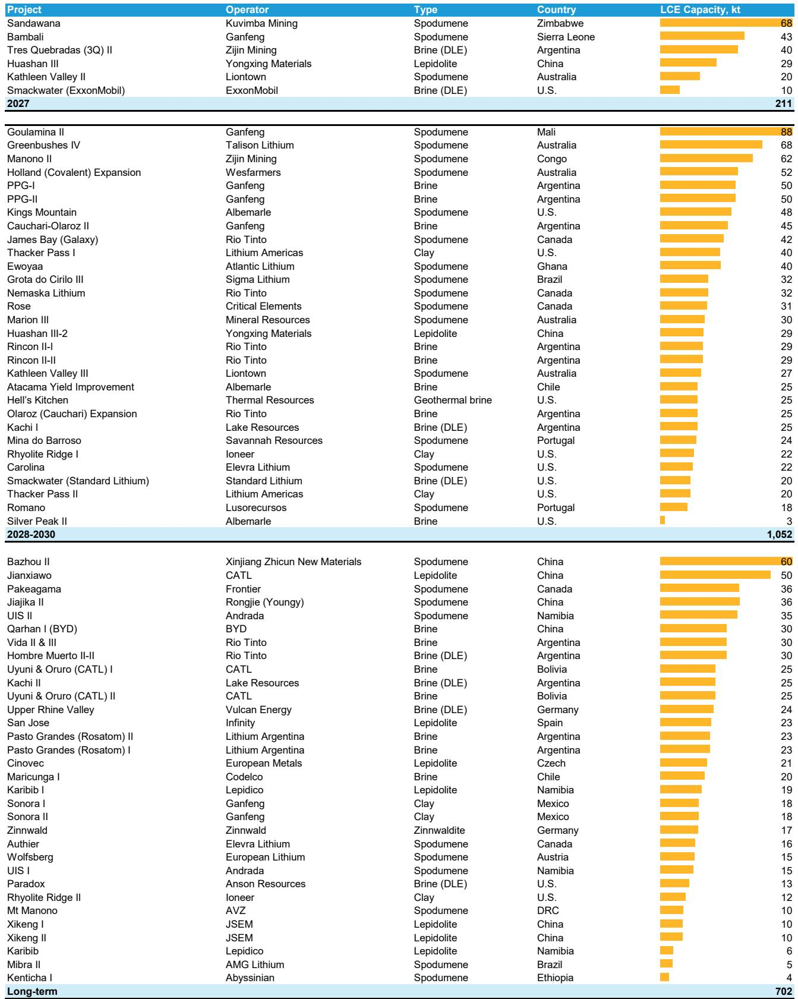
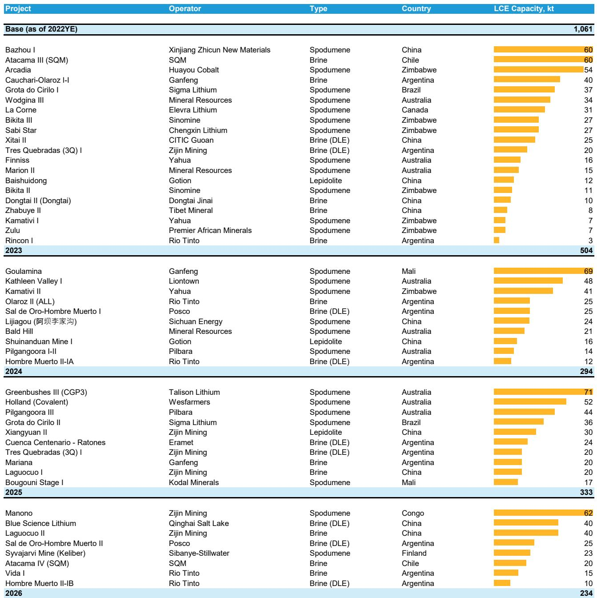
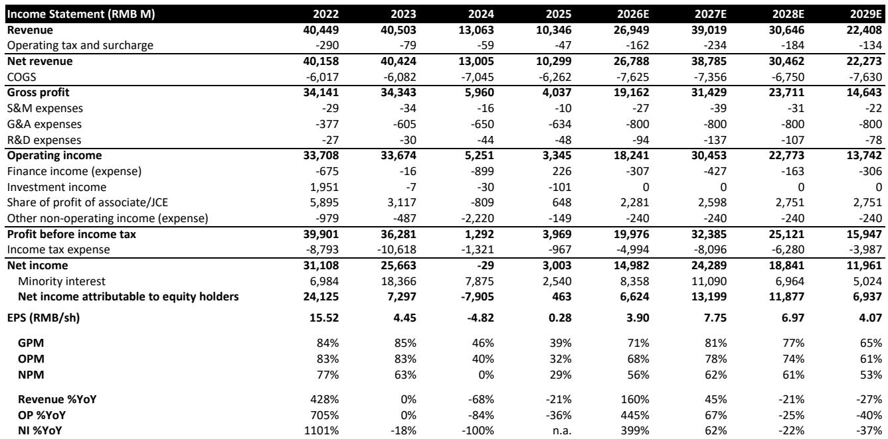

# Bernstein：锂价还没见顶，真正的高点在2027年

碳酸锂价格从2025年低点至今已经上涨超过两倍，市场情绪从极度悲观迅速转向亢奋。但这份Bernstein的最新报告给出了一个与当前市场共识不同的判断：这轮上涨不是周期尾声的狂欢，而是中周期修复的中间站。

报告的核心逻辑链条非常清晰。锂价在2025年触底后快速反弹，5月一度触及每吨3万美元，随后因部分停产产能重启回落至2万至2.5万美元区间。很多人认为这已经是顶部区域，但Bernstein认为，市场仍处于中周期修复阶段，真正的价格高峰可能要到2027年才会出现。

这个判断的底层支撑来自三个相互强化的变量：需求端储能系统（ESS）的超预期爆发、供给端资本开支的滞后响应、以及库存水平已经进入历史性紧张区间。这三个变量共同指向一个结论——当前的价格上涨只是前奏。

> **KC评论：** 这份报告最值得关注的地方不在于它预测了具体价格数字，而在于它提供了一个判断周期位置的框架。当市场情绪从极度悲观快速转向乐观时，最危险的事情就是把中周期误判为尾部。Bernstein用库存天数、资本开支周期和需求结构这三个指标，给出了一个相对清晰的定位工具。完整报告里还有一张历史周期对比图，展示了锂矿股在价格触底后6至12个月的典型表现路径，对于判断当前持仓节奏很有参考价值。

## 1. 储能需求正在改写锂市场的需求结构

锂需求在2026年至今增长了约32%，远超供给24%的增速。这个剪刀差的直接结果是市场供需平衡显著收紧。但真正值得关注的不是总量增速，而是需求结构的变化。

储能系统（ESS）需求同比增长了约100%，成为拉动锂需求最核心的引擎。相比之下，电动汽车（EV）需求增速仅为9%。这意味着锂市场的需求基本面正在发生结构性转变——储能正在从配角变成主角。

这个变化的意义在于，储能需求的价格弹性远低于电动汽车。电动汽车厂商在锂价上涨时可以通过转嫁成本或调整电池化学配方来应对，但储能项目的经济性模型对锂价的容忍度更高。Bernstein的分析显示，储能市场可以吸收每吨3万美元左右的碳酸锂价格，这为锂价提供了比以往更高的价格天花板。

> **KC评论：** 储能需求对锂价的吸收能力是这份报告最核心的假设之一。如果这个假设成立，那么锂价的上行空间将比过去几个周期更大。但这里有一个关键问题：储能项目的经济性是否真的能承受每吨3万美元的锂价？报告给出了正面的判断，但背后的项目级回报率测算需要仔细拆解。完整报告中有详细的ESS项目经济性敏感性分析图表，对于理解这个假设的可靠性很有帮助。

## 2. 库存天数跌破20天，历史经验指向价格加速上行

锂价与库存天数的负相关关系是市场上最被广泛关注的价格信号之一。Bernstein的数据显示，当前锂库存天数已经降至约20天，这是2022年以来的最低水平。

历史规律表明，当库存天数低于20天时，锂价往往会出现更陡峭的上涨。价格飙升通常发生在库存天数接近15天或更低的时候。当前库存水平已经从平衡区间进入收紧区间，这意味着价格上行的概率和幅度都在增加。

但需要注意，库存天数并不是一个完美的预测指标。它更多是一个确认信号——当其他基本面指标已经指向供需紧张时，库存数据可以验证这个判断的可靠性。当前库存数据与需求增速、供给增速的数据形成了相互印证，这增强了整个判断框架的可信度。

## 3. 资本开支的滞后响应是市场持续收紧的核心原因

锂行业在过去两年经历了严重的资本开支压缩。2024年和2025年，锂企普遍聚焦于保现金流和修复资产负债表，资本开支大幅削减。Bernstein估计2025年的资本开支可能降至三年低点，相比峰值下降了约50%。

这个资本开支周期的滞后效应是理解当前市场状态的关键。即使锂价已经显著回升，企业管理者也不太可能在经历深度下行后立即大幅增加投资。这种心理和行为上的惯性，加上项目重启和扩产所需的时间，意味着供给侧的响应速度将明显慢于需求增长。

Bernstein估计，大约有20万吨LCE的停产产能正在逐步恢复。但这只能提供一个短期缓冲。这些重启产能可能在2026年部分填补供需缺口，但2027年之后，随着新增产能增速放缓，市场将重新趋于紧张。

## 4. 报告尚未完全回答的关键问题：长期价格中枢的锚在哪里

Bernstein将长期碳酸锂价格假设维持在每吨1.6万美元。这个数字是基于行业达到约10%的资本回报率所需的价格水平推导出来的。当前价格已经显著高于这个水平，这意味着行业盈利正在快速修复。

但这里有一个尚未完全回答的问题：长期价格中枢是否会因为需求结构的改变而系统性上移？如果储能需求持续超预期增长，并且对锂价的吸收能力确实高于电动汽车，那么行业的长期均衡价格可能需要重新定价。

Bernstein的报告中提到了这个可能性，但没有展开详细的论证。这可能是读者读完报告后最值得继续追问的方向。完整报告中包含了对不同需求情景下的供需平衡表测算，以及各锂企在不同价格假设下的盈利敏感性分析，这些内容对于判断长期价格中枢的走向非常关键。

## 5. 对投资者的观察框架：盯住三个信号比盯住价格更重要

综合这份报告的分析框架，对于关注锂行业和新能源上游的投资者来说，有三个信号比盯住每日价格波动更重要。

第一，储能装机数据的月度变化。这是当前锂需求增量最核心的驱动因素。如果储能装机增速开始放缓，锂价上行的基础将受到削弱。

第二，资本开支的恢复节奏。Bernstein的判断建立在资本开支滞后响应的假设上。如果锂企在价格回升后迅速扩大资本开支，供需平衡的收紧速度可能比预期更快逆转。

第三，库存天数的边际变化。20天是一个重要的心理阈值，但更关键的是库存天数的趋势方向。如果库存天数继续下降至15天以下，价格上行的概率和幅度都将显著增加。

这三个信号共同构成了一个判断周期位置的观察框架。它们比单纯的价格预测更有操作意义，因为价格是结果，而这些信号是原因。

> **KC评论：** 这份报告的价值不仅在于给出了具体的价格预测，更在于提供了一个系统性的分析框架。但每个框架都有它的假设边界。比如，储能需求对锂价的吸收能力是否真的如报告假设的那样强？资本开支的滞后响应是否会因为国企主导的供给结构而缩短？这些都是需要持续跟踪验证的问题。完整报告中包含了对这些假设的详细敏感性分析，以及各家锂企在不同情景下的估值区间，对于希望深入理解这个框架的读者来说是不可或缺的参考资料。

锂价的这轮上涨还远没有讲完故事。但真正重要的是，在价格上涨的过程中，哪些信号在确认趋势的可持续性，哪些信号在提示风险。这份Bernstein的报告提供了一套清晰的判断标准，而剩下的工作，是在市场波动中持续验证这些标准是否仍然成立。

每天，我们的AI agent和人工团队会从国际投行报告中筛选出最值得关注的中文摘要和KC评论，更新约10至40页的精选内容，同时整理当天最新数据图表合集。这些内容既方便喂给AI进行进一步分析，也方便人工快速把握全球市场动态。如果您对锂市场或其他大宗商品的完整报告感兴趣，欢迎加入我们的知识星球和微信群，与更多产业和投资领域的读者一起持续讨论。

Personal reading notes and learning share only. Not investment advice.

