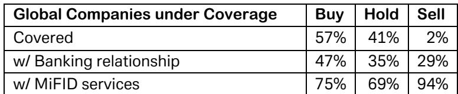

# Deglobalization Is Reshaping Shipping: The Industry Is Now a Hedge Against Geopolitical Risk, Not a Victim of It

The shipping industry has long been viewed as a pure cyclical play on global trade volumes. When the world economy expands, ships carry more cargo, rates rise, and equity holders prosper. When recession hits, rates collapse, and shipping equities become value traps. That framework is no longer sufficient. The defining shift underway is that the primary driver of shipping demand is moving from the volume of goods traded to the *distance and complexity* of how they are traded.

This is not a subtle adjustment. It is a structural reordering of the industry's economic logic. The core thesis emerging from the latest Marine Money Week conference is that deglobalization, geopolitical fragmentation, and the prioritization of supply-chain resiliency over efficiency are creating a sustained tailwind for tonne-mile demand across dry bulk, tanker, LPG, and LNG segments. For investors, this means that shipping equities are no longer merely a bet on economic growth. They are a hedge against geopolitical instability itself.

The implications are uncomfortable but analytically clear: a world that is more fractured, more security-conscious, and less efficient is a world that requires more shipping services. The question for investors is not whether this trend will reverse, but which companies are best positioned to translate this structural shift into durable shareholder value.

## The Old Logic of Trade Efficiency Is Being Replaced by a New Logic of Strategic Redundancy

For decades, the shipping industry optimized for cost and speed. The shortest route, the fastest loading, the most efficient port turnaround—these were the metrics that mattered. Globalization rewarded companies that could move goods from point A to point B with minimal friction. The entire system was built on the assumption that trade would become freer, faster, and more integrated.

That assumption has cracked. The latest closure in the Strait of Hormuz and the broader conflicts in the Middle East have made clear that the risk of disruption is not a theoretical tail event but a recurring operational reality. Ship owners and operators are now planning for a world where trade routes are not fixed but contingent, where rerouting is routine, and where strategic stockpiling is a permanent feature of national policy.

The analytical mistake would be to assume that deglobalization means less trade. In many cases, it means more trade—just less efficient trade. Longer voyage distances, slower loading and discharge at less sophisticated ports, and the need for multiple sourcing points all increase the total distance a ship must travel to deliver the same unit of cargo. This is the tonne-mile effect, and it is the single most important driver of shipping demand in the current environment.

What matters for investors is that this is not a temporary shock. The structural incentives for countries to diversify supply chains, build strategic reserves, and invest in regional storage infrastructure are likely to persist for years. The shipping industry is moving from an efficiency-maximization model to a resiliency-optimization model. That shift is fundamentally supportive for rates and utilization.

## China Remains the Marginal Buyer, But Its Strategy Has Shifted From Growth to Security

China's role in global commodity markets has been a dominant theme for two decades. The conference reinforced that this remains true, but the nature of China's demand is changing in ways that matter for shipping. The old narrative was about Chinese urbanization and industrialization driving ever-increasing volumes of iron ore, coal, and crude oil. The new narrative is about strategic stockpiling, supply-chain diversification, and self-sufficiency.

Conference panelists noted that China continues to be the marginal buyer of many bulk and energy commodities, but its policy orientation is increasingly strategic rather than purely growth-driven. The Belt and Road Initiative is not just about infrastructure investment; it is about integrating sourcing, transport, storage, and use of strategic commodities into a single, state-directed framework. This means that even if China's property-led growth model does not re-accelerate, its commodity import volumes may remain elevated due to stockpiling and diversification.

The bauxite example is instructive. Exports from Guinea have doubled since 2020, driven largely by Chinese demand. But Guinea has proposed an export cap of roughly 150 million tonnes in 2026, about 15% below 2025 levels. If implemented, this would force Chinese buyers to seek alternative sources, likely from longer distances, further boosting tonne-mile demand. Similarly, the declining quality of iron ore imports into China means that more ore must be shipped to produce the same amount of steel—an underappreciated support factor for dry bulk demand.

China's resumed purchases of US grains and stockpiling of corn from Argentina also point to a strategy of agricultural security. The pattern is clear: China is not reducing its dependence on commodity imports; it is increasing the complexity and redundancy of its supply chains. For shipping, this is a structural positive.

## The Tanker Market Faces a Pivotal Question About Sanctions and the Dark Fleet

The tanker segment is at the center of the most important unresolved question in shipping today: what happens to the dark fleet if sanctions on Iranian oil are lifted? The conference provided a nuanced answer that challenges simplistic narratives.

The dark fleet consists of older, less maintained vessels that operate outside mainstream insurance and regulatory frameworks. These ships have been the primary carriers of Iranian crude, largely to smaller Chinese refineries that benefit from discounted prices. If sanctions are lifted, the immediate effect may not be a flood of Iranian oil into global markets, but rather a displacement of dark-fleet vessels by mainstream, compliant tonnage. The Venezuela precedent is telling: previously sanctioned crude volumes are now being lifted using compliant ships, reducing the role of the dark fleet.

For investors, this is a net positive for mainstream tanker demand and rates. The dark fleet currently accounts for an estimated 10-15% of the tanker fleet. If even a portion of that capacity is displaced by compliant vessels, the effective supply of mainstream tonnage tightens. The key question is how quickly this transition occurs and whether the dark fleet vessels are simply scrapped or redirected to other routes.

The growing tanker orderbook is a concern, but the conference tone was not overly bearish. Deliveries are spread out over many years, with most new vessels arriving in 2028 or later. The existing fleet is aging, and current order levels remain below historical peaks. For the next 12 to 24 months, the supply-demand balance appears manageable. The risk is more medium-term, and it depends on whether the orderbook continues to accelerate.

## What the Report Does Not Fully Answer: The Timing and Magnitude of the Orderbook Risk

The most significant analytical gap in the current outlook is the trajectory of newbuilding orders. The report notes that crude tanker newbuilding orders have accelerated in recent months, but it also points to elevated newbuilding prices as a constraint on speculative ordering. The question is whether this constraint will hold.

Shipyards are full through the near term, with new deliveries now scheduled for 2029 or 2030. This suggests that a higher structural floor for newbuilding prices may have been established. If true, it means that fleet replacement becomes more expensive, which supports NAV for existing shipping equities and gives a premium to modern, fuel-efficient tonnage. But if demand remains strong and owners become more willing to place orders at current prices, the supply overhang could become more significant than the current consensus expects.

The report does not resolve this tension. It acknowledges the risk but does not provide a clear framework for determining when the orderbook becomes a critical threat. This is the central uncertainty for long-term investors in the tanker segment. The next 12 months of ordering activity will be decisive.

## A Decision Framework for Investors: Three Questions to Evaluate Shipping Equity Exposure

For investors looking to position for the deglobalization thesis, the shipping sector offers a range of exposures that are not all equally attractive. The following framework can help differentiate between companies that are merely riding the cycle and those that are structurally positioned to benefit.

First, assess the fleet profile. Companies with modern, fuel-efficient fleets have a structural advantage in a world where fuel costs are elevated and regulatory pressures are increasing. They also have greater flexibility to monetize older, non-core assets in the current seller's market. The ability to sell older tonnage and return cash to shareholders or hold it as a strategic option is a sign of balance sheet discipline.

Second, evaluate exposure to spot markets versus long-term charters. In a rising rate environment, spot exposure allows companies to capture upside. But it also introduces volatility. The right balance depends on the investor's risk tolerance. Companies with significant spot exposure, such as Scorpio Tankers and International Seaways in the tanker segment, are positioned to benefit most directly from the tonne-mile tailwind.

Third, consider the broader value chain. The deglobalization thesis extends beyond shipping-as-transport. Companies in the marine-based LNG value chain, such as Excelerate Energy and Golar LNG, benefit from the same structural drivers of energy security and supply-chain diversification. Venture Global, in the land-based LNG liquefaction segment, is also well positioned as US Gulf Coast LNG becomes an increasingly vital part of the global energy mix.

The common thread across all three questions is capital discipline. In a sector that has historically been prone to boom-and-bust cycles, the companies that will deliver sustainable shareholder value are those that resist the temptation to over-order and instead use strong cash flows to strengthen balance sheets and return capital to shareholders.

## The Structural Shift Is Uncomfortable, But It Is Real

The shipping industry is not simply a beneficiary of deglobalization. It is a direct expression of it. Every rerouted vessel, every strategic stockpile, every new storage facility is a physical manifestation of a world that is more fragmented and more security-conscious. This is not a comfortable reality, but it is the reality that investors must work with.

The conference left little doubt that the industry's leadership understands this shift. The tone was solidly optimistic, not because the world is becoming more peaceful or more integrated, but because the shipping industry is being paid for the complexity and risk that deglobalization creates. The old efficiency paradigm is over. The new paradigm is about resiliency, and it is structurally supportive for shipping rates, utilization, and equity valuations.

The open questions remain around the pace of newbuilding, the trajectory of sanctions policy, and the durability of Chinese demand. But the direction of travel is clear. For investors who can tolerate the volatility inherent in the sector, shipping equities offer a rare opportunity to hedge against the very geopolitical risks that are reshaping the global economy.

Join the community to read the full report and review the original charts.

*This article is for learning and discussion only and does not constitute investment advice.*

Personal reading notes and learning share only. Not investment advice.

