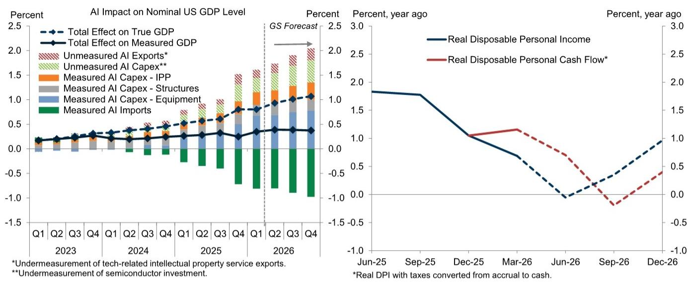
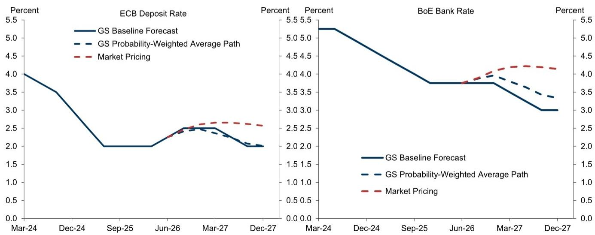
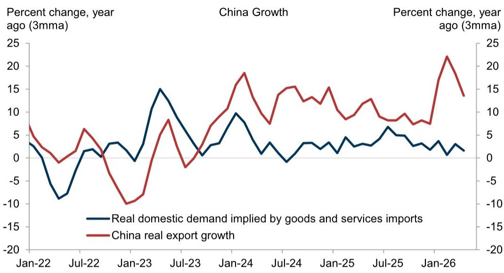

# GS：美国衰退风险已降至15%，但增长引擎比想象更脆弱

这份由GS首席经济学家Jan Hatzius在2026年6月发布的全球宏观报告，给出了一个看似矛盾的核心判断：美国经济衰退风险已从战时高点的25%回落至15%的长期常态水平，但这并不意味着市场可以高枕无忧。真正的风险正从“经济是否会衰退”转向“增长质量是否可持续”。

报告最值得关注的信号不是衰退概率数字本身，而是支撑这一判断的几条逻辑链正在发生结构性变化：油价回落带来的通胀缓解是真实的，但AI资本开支对美国GDP的直接拉动微乎其微，劳动力市场的改善信号存在广泛分歧，而美联储新主席Warsh的沟通方式正在制造新的不确定性。

以下是我们从报告中提炼出的六个关键洞察。

## 1. 衰退风险降至长期常态，但支撑逻辑并非来自内生增长

GS将12个月美国衰退概率从25%进一步下调至15%，这是自2025年以来的最低水平。但支撑这一判断的核心变量并非美国经济自身动能的增强，而是外部冲击的消退。

报告明确指出，下调衰退概率的最直接原因是美伊协议达成后油价预期的大幅回落。GS大宗商品团队将2026年底布伦特原油目标价下调至每桶80美元，且承认风险双向存在——霍尔木兹海峡的反复警告提醒市场，石油供给的恢复可能不会一帆风顺；但短期内，原油快速释放到一个战前就已供过于求的市场，也可能形成阶段性过剩。

> **KC评论：** 衰退概率回到15%是一个重要的锚点信号，但决策者需要追问的是“为什么降下来了”。答案不是因为美国消费强劲或企业投资加速，而是因为地缘政治溢价消退。这意味着如果中东局势再次升温，这个15%的假设会迅速失效。完整报告中有一张美国衰退概率的时间序列图，值得仔细看的是它如何从20%降至15%——那条曲线的斜率比绝对水平更重要。

换言之，当前的低衰退概率建立在一个脆弱的外生变量之上。报告隐含的追问是：如果去掉油价这个“一次性红利”，美国经济的内生韧性到底有多强？

## 2. 下半年GDP预期上调至2%，但AI投资对GDP的拉动几乎为零

GS将2026年下半年美国GDP环比年化增速预期小幅上调至2%，理由是油价下降带来的实际收入正效应，以及AI繁荣通过股权财富和强劲资本开支对经济的持续支撑。

但报告在同一个段落里就给出了关键限制条件。第一，AI资本开支主要由从亚洲进口的商品构成，而半导体这类核心投入品甚至不计入GDP。第二，即使考虑了油价下跌，按现金流口径计算的实际收入增速在下半年仍可能放缓——因为二季度较高的退税和较低的最终税款支付效应正在消退。这使得实际消费支出增速可能仅维持在1.5%左右。

> **KC评论：** 这是一份报告里最容易被忽视但最值得反复读的段落。GS本质上在说：AI是真实的产业趋势，但它对美国GDP的拉动路径是间接的、缓慢的。如果你把AI投资当作短期经济刺激工具来定价，可能会失望。完整报告中有两张图——一张展示AI投资与GDP的关系，另一张展示实际收入增速的拆解——这两张图放在一起看，才能理解为什么GS对2%的增长预期并不兴奋。

这里的核心含义是：2%的增长是“温和”的，甚至低于潜在增速。这意味着劳动力市场很难进一步收紧，通胀压力也不会重新加速。

## 3. 非农就业的强劲是“孤例”，其他指标并未确认改善

过去三个月美国非农就业月均增加18.8万人，表面看远超市场预期。但GS指出，这一数字与多个其他劳动力市场指标存在明显分歧。

家庭调查就业增速远慢于机构调查，就业人口比率持平甚至走低，而GS更新的劳动力市场宽松度综合指标——一个汇总了十项关键指标的追踪器——在经历短暂的稳定后，近期重新回到了过去三年的渐进式宽松趋势中。报告据此预期，工资和单位劳动力成本增速将继续保持温和，尽管此前整体通胀曾一度走高。

这一判断对市场定价有直接含义。如果劳动力市场实际并不像非农数据显示的那样紧张，那么美联储的加息压力就不是来自国内过热，而是来自外部供给冲击的传导。后者是暂时的，前者才是结构性的。

## 4. 6月汽油价格暴跌将推动CPI直接下降，但核心PCE仍然顽固

GS预计，6月汽油价格的暴跌将导致季节性调整后的消费者价格指数出现绝对下降。核心CPI在未来三个月平均仅环比上涨0.17%，主要驱动力来自航空票价随航油价格下跌、酒店价格从世界杯高位回落，以及东北地区房租在5月出现的高位异常值正在回归。

但核心PCE通胀将更为顽固。原因在于：股市上涨正在推高金融服务的估算价格，而软件和配件类价格在核心PCE中的权重是核心CPI的30倍。不过，基于统计学的截尾均值PCE指标将继续表现得更温和。

> **KC评论：** GS在这里做了一个非常精细的通胀结构拆解。CPI和PCE的差异不是技术细节，而是理解美联储决策框架的关键。如果Warsh领导的美联储更关注PCE，那么即使CPI快速回落，加息的风险也不会立即消失。完整报告中的截尾均值PCE与核心PCE的对比图，是判断通胀趋势是否真正转向的最重要图表之一。

## 5. Warsh首次FOMC会议释放鹰派信号，但GS认为加息概率被市场高估

新任美联储主席Warsh的第一次FOMC会议比市场预期更为鹰派。18位提交利率预测的参与者中，有9位在2026年剩余时间内预计至少加息一次，2027年第四季度核心PCE预测中值升至2.5%。

但GS维持不加息的基准预测，理由有二。第一，这9位鹰派中约一半是非投票权的地区联储主席，投票委员中多数仍预计利率不变或更低。第二，这些预测可能已经“过时”——因为它们是在中东局势迅速缓和、能源价格暴跌之前做出的。如果未来几个月通胀（尤其是整体通胀）快速下行，而增长保持温和，多数投票委员将继续支持维持利率不变。

更值得关注的是Warsh对美联储沟通方式的表态。他明确表示：“金融市场在对外部数据做出反应时表现最佳，但当市场追问‘美联储将如何应对这些数据’时，效率反而更低。”GS对此的评论是：由于美联储本质上控制着短期利率，而利率路径对资产定价至关重要，市场不可避免地会追问美联储的反应函数。如果Warsh大幅降低美联储的透明度，金融条件——进而经济表现——可能变得更加波动，因为市场对美联储思考的假设将缺少现实检验。

这一节是报告中最具前瞻性的部分。它暗示的不仅是利率路径本身，更是未来12个月市场波动率的结构性上升来源。

## 6. 中国增长放缓是暂时性的，但内外需分化才是结构性问题

报告对中国4-5月的增长放缓给出了三个解释：油价冲击、消费品以旧换新政策的回撤效应、以及政府在一季度GDP强劲后主动放慢了财政支出节奏。GS预计6月因暴雨仍将疲弱，但三季度将出现反弹，因为临时性拖累消退、油价冲击逆转、且政策制定者将用更多财政支出来回应近期的疲软。

但报告在最后给出了一个更长期的判断：在短期波动之下，中国国内需求与出口之间的差距正在持续扩大，这推高了经常账户盈余，并对许多中国贸易伙伴产生负面影响。

这一判断对全球投资者而言意味着：中国经济的“韧性”主要来自出口端，而国内消费和投资的结构性修复仍需时间。全球贸易再平衡的压力不会因为中国三季度GDP反弹而消失。

## 报告尚未完全回答的关键问题：AI估值是否已脱离基本面支撑？

报告最后一段给出了一个值得反复咀嚼的判断：美国金融市场已经较好消化了鹰派FOMC的冲击，盈亏平衡通胀率和30年期国债收益率下降，同时主要股指反弹。如果近期经济前景趋于平静，市场对AI交易可持续性的关注将进一步上升。

GS权益和跨资产策略团队的研究表明，AI资本开支的持续超预期、标普盈利的韧性、以及私营部门金融失衡的相对缺失，都应有助于股市在未来几个月继续走高。但报告紧接着给出了一个重要的条件句：AI相关股票的估值已经偏高，即便是基于我们对AI在未来十年可能创造的经济价值的乐观预期，也很难证明进一步大幅上涨的合理性。

这一判断是整份报告中最具二阶含义的结论。它意味着：即使宏观环境改善、利率预期稳定，AI板块的进一步上行也需要基本面的超预期兑现，而非仅仅是估值的扩张。而GS自己承认，这种超预期兑现的门槛已经很高。

## 顺着这些未解问题，继续读完整报告

以上六个洞察只是GS这份全球宏观报告的冰山一角。报告中还有大量未被展开的细节和图表：截尾均值PCE与核心PCE的路径分歧到底有多大？GS的劳动力市场宽松度综合指标包含哪十项指标？Warsh的沟通方式变化如何通过金融条件指数传导至实体经济？中国的内外需缺口数据背后，哪些行业正在承受最大的调整压力？

这些问题在本文中没有展开，但正是这些细节决定了上述判断的置信度和投资含义。

我们每天会由AI agent配合人工review，生成国际投行中文摘要与KC评论，daily更新约10-40页，并整理当天最新数据图表合集。这份材料既方便喂给AI做进一步分析，也方便人工快速把握全球市场的动态变化。欢迎来到我们的知识星球微信群，继续讨论这些未解问题，以及更多报告背后的细节。

Personal reading notes and learning share only. Not investment advice.

