Global Hotels & Leisure

# Global Lodging: World Cup boost covers softness elsewhere

Richard J. Clarke, FCA

+44 20 7676 6850

richard.clarke@bernsteinsg.com

Niall Mitchelson

+44 20 7676 7144

niall.mitchelson@bernsteinsg.com

Lasith Siriwardana

+44 20 7550 2191

lasith.siriwardana@bernsteinsg.com

Sabrina Blanc

+33 1 42 13 47 32

sabrina.blanc@bernsteinsg.com

The headline grabbing numbers at Q2 look set to be in US RevPAR. US RevPAR rose 4% across April–May, accelerating to 7% in the first week of June. That week included just eight World Cup matches versus 28 and 36 in the following two weeks. Even without further acceleration, the World Cup boost should push hotel groups to the top end of guidance - or better; Hyatt should lead. US strength more than offsets well-flagged Middle East weakness and slower growth in Europe and China. OTA traffic has softened into Q2, particularly at Booking and Expedia. However, Booking consensus has fallen to 3.5% room night growth (vs. 2–4% guidance); unless cancellations remain elevated, this looks beatable, with \~6.5% achievable. Airbnb looks cleaner, with stronger web and download trends driven more by APAC/LatAm than the World Cup; we expect \~10% night growth, a 1.6% beat to consensus. Expedia looks a bigger concern, and looks to need a big B2B quarter to avoid a miss to consensus.

OTA demand. App traffic growth has slowed across all three major platforms. Web trends are mixed: deterioration at BKNG and EXPE, but resilience at ABNB, driving LDD y/y growth. Agoda remains strong (\~30% app engagement growth), while Booking and Priceline lag. At EXPE, Expedia and Hotels.com face y/y declines, while Vrbo performs well. Overall, Airbnb should deliver the cleanest quarter (\~10% growth), while Booking (\~6.5%) can still beat a low guide and conservative consensus.

AI showing early signs of an inflection? Referral data shows that traffic being directed to the OTAs by AI has returned to growth this quarter, having slowly been in decline since Q3 last year. Despite this inflection, AI referrals still contribute $< 0.5\%$ of total traffic. We still await the launch of Google's AI-mode hotel feature which is expected to leverage Google's suite of AI protocols (Universal Commerce, Model Context, Agentic Payments) to facilitate booking without visiting a brand website or OTA.

Hotel demand: Q2 marks the start of the World Cup effect, which looks positive against muted expectations given strong June run rates ( $\sim$ 4%) and easy comps. North American strength should push RevPAR to or above the top end of guidance despite international softness. The K-shape persists, with luxury outperforming: Hyatt (4.3%), Marriott (3.2%), Hilton (2.9%), IHG (2.6%), the latter weighed down by a slower quarter in China.

Development remains resilient in the face of conflict in the Middle East. The hotel pipeline continues a steady recovery from last year's Liberation day contraction, showing no signs of being impacted by the conflict in the Middle East. The global pipeline is now \~48,000 rooms (1.9%) larger than pre-Liberation day levels, with all regions contributing to this recovery. Construction has been even stronger, with \~54,500 (6.1%) more rooms in construction in May than at the end of 2025. MEA has been resilient given the conflict in the region, with the pipeline 3.5% larger than it was in February and in construction rooms continuing to increase. With the conflict in Iran now in its fourth month, the inflationary pressure of building material prices and fuel are yet to have a meaningful impact on global development.

## BERNSTEIN TICKER TABLE

<table><tr><td rowspan="2"></td><td colspan="4">18 Jun 2026</td><td>TTM</td><td colspan="4">Adjusted EPS</td><td colspan="3">Adjusted P/E (x)</td></tr><tr><td></td><td></td><td rowspan="2">Closing Price</td><td rowspan="2">Price Target</td><td rowspan="2">Rel. Perf.</td><td rowspan="2">Cur</td><td rowspan="2">2025A</td><td rowspan="2">2026E</td><td rowspan="2">2027E</td><td rowspan="2">2025A</td><td rowspan="2">2026E</td><td rowspan="2">2027E</td></tr><tr><td>Ticker</td><td>Rating</td><td>Cur</td></tr><tr><td>BKNG (Booking)</td><td>M</td><td>USD</td><td>171.78</td><td>188.00</td><td>(44.4)%</td><td>USD</td><td>9.12</td><td>10.53</td><td>12.29</td><td>18.8</td><td>16.3</td><td>14.0</td></tr><tr><td>ABNB (Airbnb )</td><td>O</td><td>USD</td><td>142.41</td><td>168.00</td><td>(17.9)%</td><td>USD</td><td>4.03</td><td>5.44</td><td>6.65</td><td>35.3</td><td>26.2</td><td>21.4</td></tr><tr><td>EXPE (Expedia)</td><td>M</td><td>USD</td><td>240.90</td><td>253.00</td><td>22.6%</td><td>USD</td><td>15.86</td><td>20.92</td><td>25.20</td><td>15.2</td><td>11.5</td><td>9.6</td></tr><tr><td>TRIP (TripAdvisor)</td><td>O</td><td>USD</td><td>12.97</td><td>20.00</td><td>(26.3)%</td><td>USD</td><td>1.27</td><td>1.30</td><td>1.88</td><td>10.2</td><td>10.0</td><td>6.9</td></tr><tr><td>HLT (Hilton)</td><td>M</td><td>USD</td><td>348.84</td><td>320.00</td><td>15.2%</td><td>USD</td><td>8.11</td><td>8.96</td><td>10.28</td><td>43.0</td><td>38.9</td><td>33.9</td></tr><tr><td>MAR (Marriott)</td><td>O</td><td>USD</td><td>396.20</td><td>402.00</td><td>28.2%</td><td>USD</td><td>10.02</td><td>11.53</td><td>13.30</td><td>39.5</td><td>34.4</td><td>29.8</td></tr><tr><td>IHG.LN (IHG)</td><td>M</td><td>USD</td><td>171.20</td><td>154.00</td><td>37.0%</td><td>USD</td><td>5.01</td><td>5.69</td><td>6.48</td><td>34.2</td><td>30.1</td><td>26.4</td></tr><tr><td>H (Hyatt)</td><td>O</td><td>USD</td><td>202.09</td><td>202.00</td><td>26.8%</td><td>USD</td><td>2.25</td><td>4.03</td><td>5.17</td><td>89.7</td><td>50.1</td><td>39.1</td></tr><tr><td>AC.FP (Accor)</td><td>O</td><td>EUR</td><td>48.86</td><td>55.70</td><td>(1.0)%</td><td>EUR</td><td>1.86</td><td>2.25</td><td>2.73</td><td>26.3</td><td>21.8</td><td>17.9</td></tr><tr><td>SPX</td><td></td><td></td><td>7,500.58</td><td></td><td></td><td></td><td></td><td></td><td></td><td></td><td></td><td></td></tr><tr><td>EDME</td><td></td><td></td><td>1,578.06</td><td></td><td></td><td></td><td></td><td></td><td></td><td></td><td></td><td></td></tr></table>

O - Outperform, M - Market-Perform, U - Underperform, NR - Not Rated, CS - Coverage Suspended  
Source: Bloomberg, Bernstein estimates and analysis.

## INVESTMENT IMPLICATIONS

In lodging, we rate Marriott, Accor and Hyatt Outperform, and IHG and Hilton Market-Perform. In online travel, we rate Airbnb and Tripadvisor Outperform, and Booking and Expedia Market-Perform.

## Recent research on OTAs:

Tripadvisor: TheFork sale agreed with American Express for \$700m (49% of market cap)

Booking: How it won online travel & can it win AI travel?

Airbnb: Bernstein SDC best ideas slides & key take aways from investor meetings

OTAs in the Quarter (1Q26): Winning the Phony War

OTAs: Updates from Airbnb's Summer Release, Google I/O, and Expedia EXPLORE 26

OTAs: Google didn't kill the OTAs, so why might AI?

## Recent research on Hotels:

Quick Take: Marriott - WSJ letter suggests owners want more Credit Card Cash

Hyatt: Thesis recap & key highlights from the 2026 investor day

Lodging in the Quarter (1Q26): K-Popped? Not yet - Hyatt back to top pick on H2 inflection

Global Hotels: Key takeaways from our expert franchisee calls

Global Hotels and Cruise: Artificial Intelligence.... Sooner or Later - do bots take vacations?

EXHIBIT 1: Under April - May performance and assuming early June performance will continue through the month, we expect Marriott to beat their Q2 RevPAR guidance, and Hilton to come right at the top end of their 2-3% range

Hotels: 26Q2 RevPAR growth estimate (Apr-May run rate + June assumption) vs guidance  
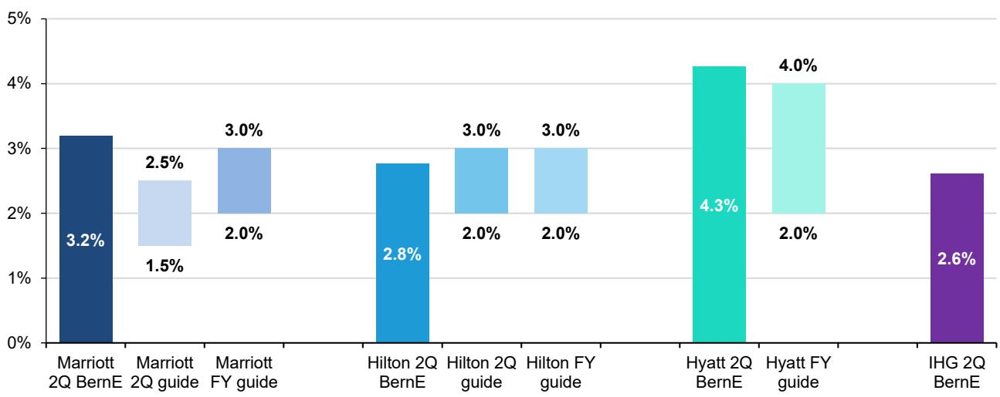  
Source: CoStar, Bernstein analysis & estimates

EXHIBIT 2: Airbnb is set to lead room night growth given the current traffic data  
26Q2 BernE Room Night Growth  

EXHIBIT 3: Based on current traffic data, we expect Airbnb and Booking to outperform consensus on room nights, while Expedia is likely to underperform

<table><tr><td>2Q26</td><td>ABNB</td><td>BKNG</td><td>EXPE</td></tr><tr><td></td><td colspan="2">(Room) Nights Booked</td><td></td></tr><tr><td>BernE</td><td>148.0</td><td>329.7</td><td>109.3</td></tr><tr><td>Consensus</td><td>145.7</td><td>320.0</td><td>110.9</td></tr><tr><td>vs</td><td>1.6%</td><td>3.0%</td><td>-1.5%</td></tr></table>

Source: Bloomberg, Bernstein analysis & estimates  
We have included no effect yet from elevated cancellations or a positive effect from RNPL at Airbnb  
Source: SensorTower, SimilarWeb, Company reports, Bernstein analysis & estimates

## DETAILS

## ONLINE TRAVEL AGENTS

EXHIBIT 4: Based on current traffic data, we expect Airbnb and Booking to outperform consensus on room nights, while Expedia is likely to underperform

<table><tr><td>2Q26</td><td>ABNB</td><td>BKNG</td><td>EXPE</td></tr><tr><td></td><td colspan="2">(Room) Nights Booked</td><td></td></tr><tr><td>BernE</td><td>148.0</td><td>329.7</td><td>109.3</td></tr><tr><td>Consensus</td><td>145.7</td><td>320.0</td><td>110.9</td></tr><tr><td>vs</td><td>1.6%</td><td>3.0%</td><td>-1.5%</td></tr></table>

Source: Bloomberg, Bernstein analysis & estimates

EXHIBIT 5: Airbnb is set to lead room night growth given the current traffic data  
26Q2 BernE Room Night Growth  
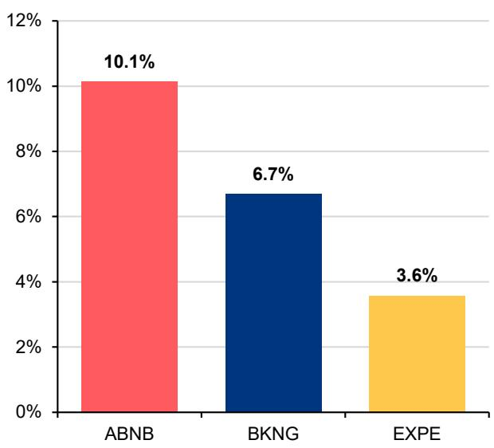  
We have included no effect yet from elevated cancellations or a positive effect from RNPL at Airbnb  
Source: SensorTower, SimilarWeb, Company reports, Bernstein analysis & estimates  
EXHIBIT 6: Only BKNG is preferred to the SPX by the sell side  
OTAs: Sell side ratings

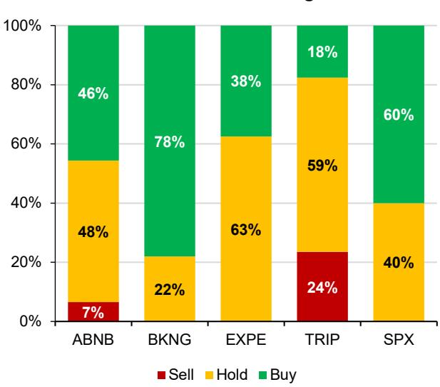  
Ratings as at 19 June 2026  
Source: Bloomberg, Bernstein analysis

■ Since start of Iran War ■ Since Q1 results ■ YTD

Hotels: 26Q2 RevPAR growth estimate (Apr-May run rate + June assumption) vs guidance  
  
EXHIBIT 8: Only Airbnb recorded a gain in share price following the Q1 results

YTD Stock Price Returns  
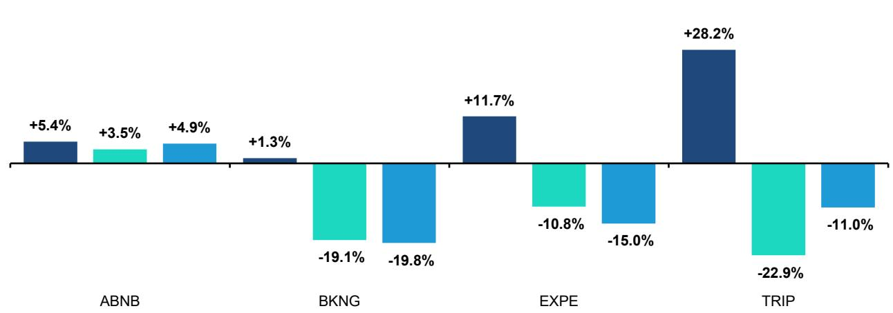  
Share prices as of 19 June 2026
Source: CapIQ, Bernstein analysis & estimates

## AIRBNB

EXHIBIT 9: Airbnb's web traffic continues to accelerate whilst app engagement growth has eased slightly; app downloads has accelerated significantly to \~30% y/y growth

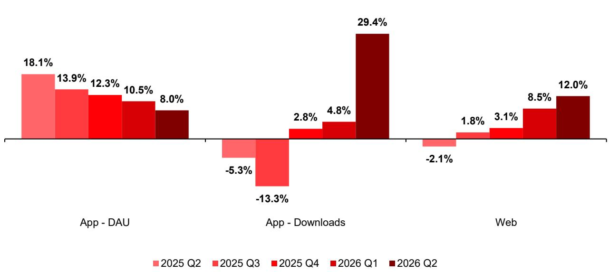  
Source: SensorTower, SimilarWeb, Bernstein analysis  
EXHIBIT 10: Web traffic has grown in the LDDs through the quarter so far with a slight deceleration in app engagement; app downloads has surged with June currently tracking for 43% y/y growth

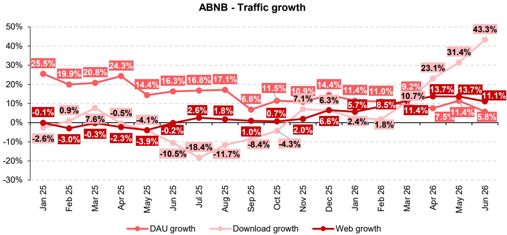  
Source: SensorTower, SimilarWeb, Bernstein analysis

EXHIBIT 11: India saw the largest increase in downloads versus Q2 last year, contributing to 34% of the total increase, following by Pakistan (20%) and Indonesia (6%). This is followed by three South American nations, with MSD % contributions.

Downloads Growth Q2 2026 (#, 000s)  
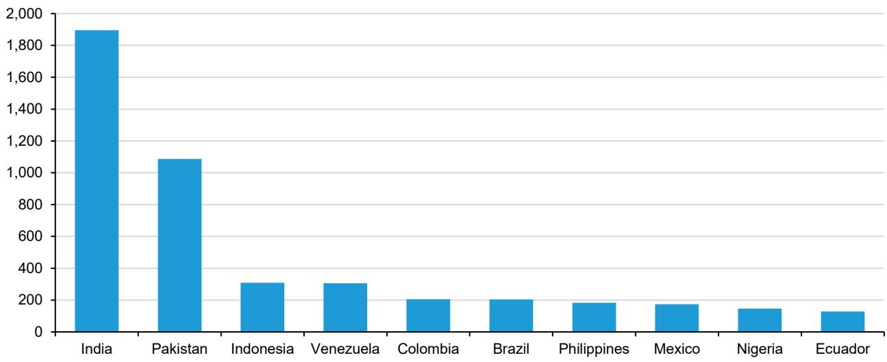  
June downloads number adjusted for partial month
Source: SensorTower, Bernstein analysis  
Airbnb - nights booked (millions) quarterly predictor

EXHIBIT 12: Airbnb model vs actual

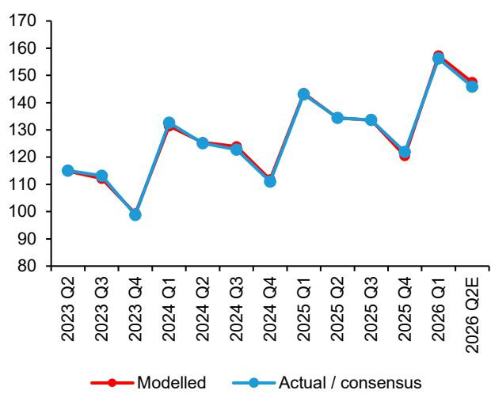  
Source: SensorTower, SimilarWeb, Bernstein analysis  
EXHIBIT 13: Traffic is correlated with nights booked  
Airbnb - Traffic vs nights booked

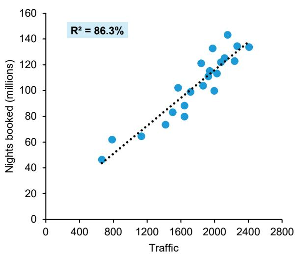  
Source: SensorTower, SimilarWeb, Bernstein analysis

## BOOKING

EXHIBIT 14: Both app and web traffic growth have decelerated in the quarter driven by a weak start to June; app downloads is set to grow y/y in the quarter driven by a strong start to June

BKNG - Quarterly traffic growth  
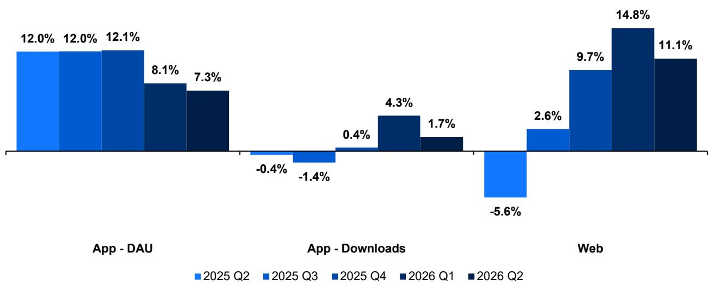  
Source: SensorTower, SimilarWeb, Bernstein analysis

EXHIBIT 15: A weak start to June is the primary driver of weak app engagement and web traffic growth. Despite this, June has started with high app download activity, lapping a 3% y/y decline in 2025.

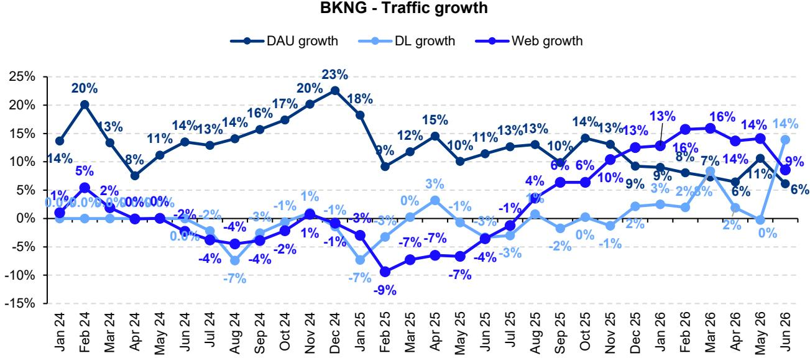  
Source: SensorTower, SimilarWeb, Bernstein analysis

EXHIBIT 16: Growth at Agoda continues to exhibit strength but has slowed down from the $40\%+$ growth seen in Q1; the Booking app's engagement has decelerated whilst Priceline continues to struggle

BKNG - App DAU growth by app  
  
Source: SensorTower, SimilarWeb, Bernstein analysis

EXHIBIT 17: Booking's traffic is correlated to room nights  
BKNG - Traffic vs room nights  
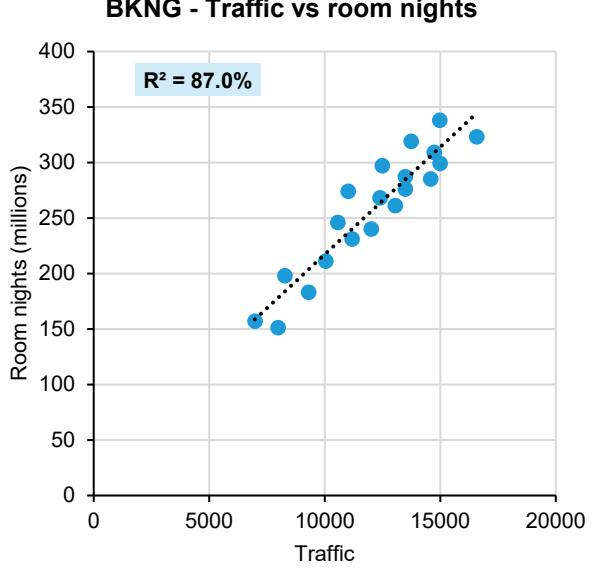  
Source: Company reports, SensorTower, SimilarWeb, Bernstein analysis

EXHIBIT 18: BKNG model vs actual  
BKNG - room nights (millions) quarterly predictor  
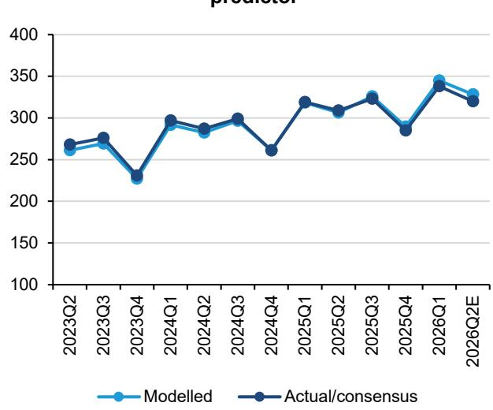  
Source: Company reports, Bloomberg, SensorTower, SimilarWeb, Bernstein analysis & estimates

Traffic growth change since guidance issued

EXHIBIT 19: Without any change to traffic trends post guiding BKNG usually beat their guidance range by \~2%, any change in traffic post guiding can impact how BKNG does on room night growth relative to guidance  
BKNG room night growth relative to guidance vs change in traffic growth post guidance issued  
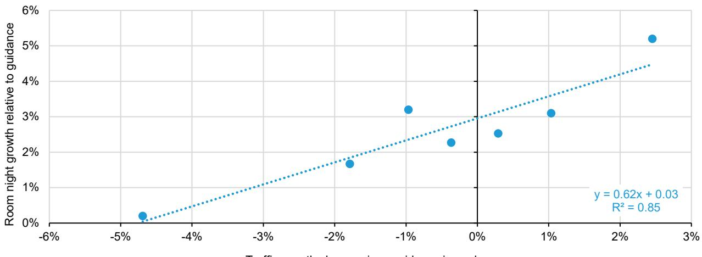  
Source: Company reports, SensorTower, SimilarWeb, Bernstein analysis

## EXPEDIA

EXHIBIT 20: App engagement has been very weak through the quarter, set to grow just 2.3%, whilst web has also slowed following five consecutive quarters of acceleration; downloads growth now laps the beginning of declines in 2Q25

EXPE - Quarterly traffic growth  
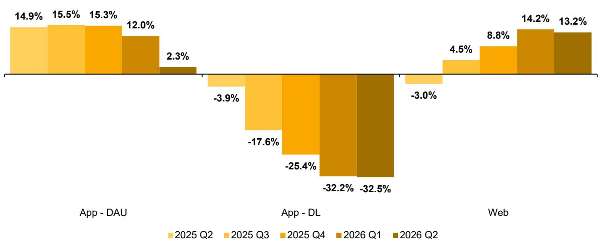  
Source: SensorTower, SimilarWeb, Bernstein analysis

EXHIBIT 21: App engagement and web traffic decelerated through the quarter; the y/y fall in downloads abated in June  
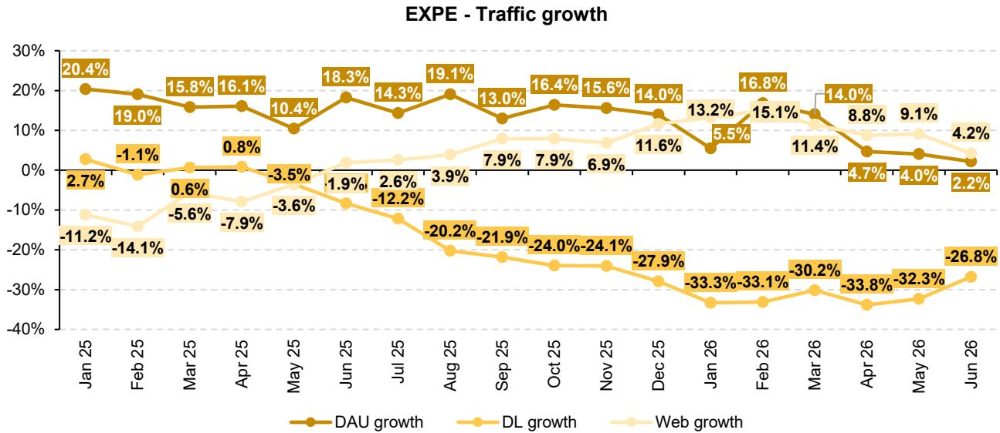  
Source: SensorTower, SimilarWeb, Bernstein analysis

EXHIBIT 22: Both Hotels.com and Expedia have experienced a deceleration in app engagement through the quarter with y/y declines so far in June, whilst Vrbo continues to experience steady growth  
EXPE - DAU growth by app  
  
Source: Bernstein analysis, Sensortower, Similarweb

EXHIBIT 23: Expedia B2C room nights are correlated with traffic  
Actual vs. modelled room nights (B2C)  
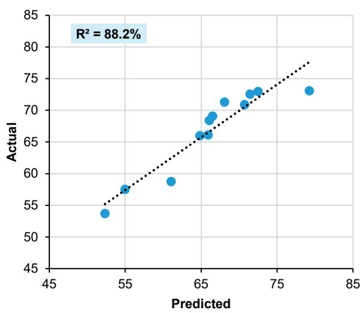  
Source: SensorTower, SimilarWeb, Bernstein analysis

EXHIBIT 24: EXPE model vs actual  
EXPE - Room nights (millions) quarterly predictor  
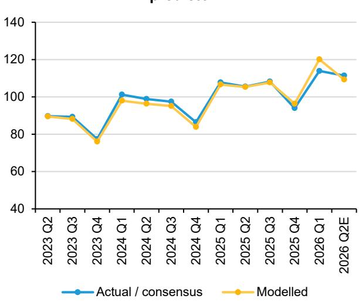  
Source: SensorTower, SimilarWeb, Bernstein analysis

## TRIPADVISOR

EXHIBIT 25: App engagement at TheFork continued its y/y declines into Q2, but but web engagement growth has surged, running at 31% y/y growth so far in June

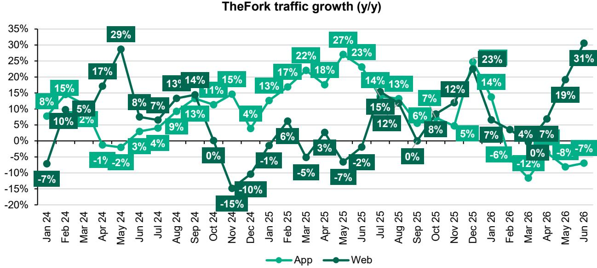  
Source: SimilarWeb, SensorTower, Bernstein analysis

EXHIBIT 26: Tripadvisor continues to struggle with declines in traffic across both web and app channels
Tripadvisor traffic growth (y/y)  
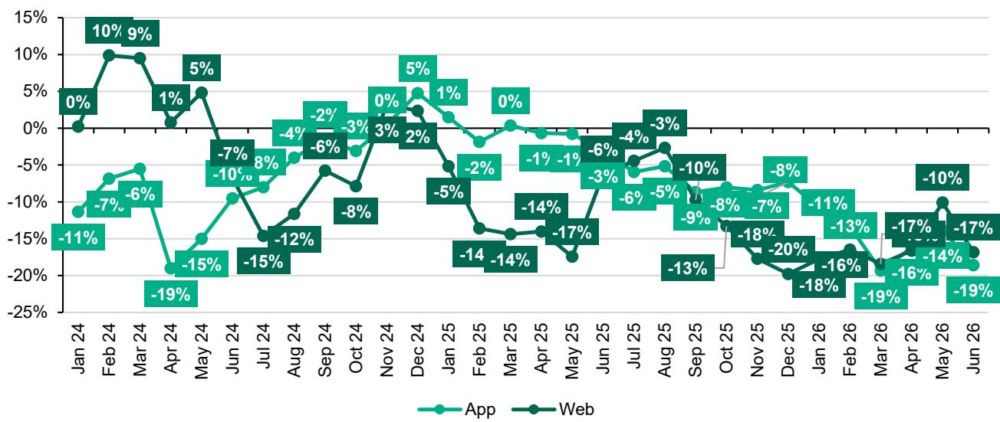  
Source: SimilarWeb, SensorTower, Bernstein analysis

EXHIBIT 27: Viator, which suffered web traffic declines through 2025, has seen declines ease in last six months with y/y traffic up so far in June; app engagement at the Viator was storing in April and May with \~40% y/y growth

Viator traffic growth (y/y)  
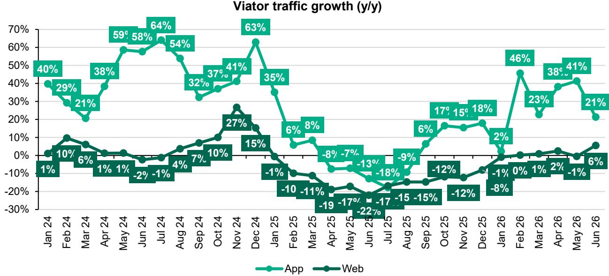  
Source: SimilarWeb, SensorTower, Bernstein analysis

## AI TRAFFIC

Referral traffic to the OTAs from AI seems to have inflected in April and May, with traffic growing 24% m/m in April and 31% in May, averaged across the four platforms. As a proportion of traffic, generative AI referrals have also inflected upwards, increasing by \~15 bps from March to May. However, these referrals continue to make up a very small proportion of overall traffic (<0.5%).

Automatic app suggestions could be driving this referral traffic. Now if a user tells Claude that it wants to book a hotel, Claude will automatically suggest using a Claude connector (equivalent to a ChatGPT app), bringing up a list of relevant hotel booking connectors (i.e. Booking.com, Trivago)

EXHIBIT 28: Traffic generated by AI sources to major OTAs, particularly Booking, saw a notable increase in April and May  
Absolute Generative AI Traffic  
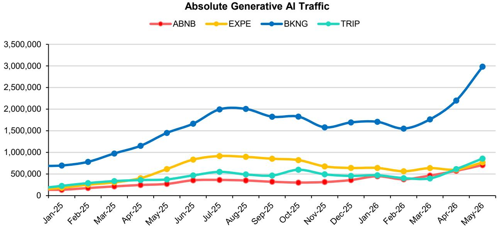  
Source: SimilarWeb, Bernstein analysis  
EXHIBIT 29: The share of traffic the OTAs derive from Generative AI has surged since March, but still sits at very low levels (<0.5%). This is potentially driven by increased leisure travel research ahead of the key summer travel period.

Generative AI Traffic as % of Total Traffic  
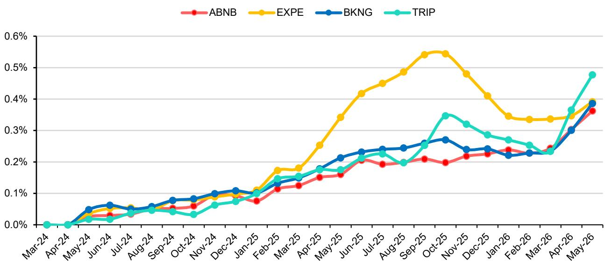  
Source: SimilarWeb, Bernstein analysis

EXHIBIT 30: Claude now automatically suggests relevant connectors (apps) to hotel search queries  
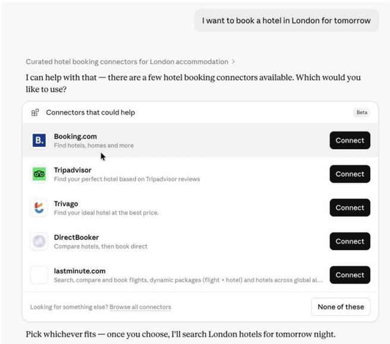  
Source: AgentDiscoverability.com, Claude, Bernstein analysis  
EXHIBIT 31: We can with a little trial and error, now get ChatGPT to call apps mid-flow rather than right at the top. Here is only calls one app - in this case Booking.com  
Stays based on your search
20 Jun – 22 Jun · ⚠ 2

So a query like "Find me a hotel in Barcelona for 2 adults next weekend under €250/night" would normally lead me to search and present hotel options, not redirect you to another app. Sources

Ok run that query

  
Source: ChatGPT

## HOTELS

## REVPAR PERFORMANCE

The US. RevPAR performance accelerated through the first two months of Q2 at Luxury and Upper Upscale hotels, whilst a deceleration was experienced further down the chains scale. Despite this, there are some positive signs at the lower end of the chain scale, with the Midscale segment continuing to grow RevPAR y/y into Q2 and Economy growing RevPAR y/y for the first time since March 2025. With the World Cup underway, we expect June to be a bumper month for US hotel demand, with the told end likely to benefit the most and compression to filter down to the lower end of the market.

International markets. European RevPAR growth has taken a step down since February but continues to grow in the MSDs. Asia has continued its strength with APAC ex-China growing RevPAR at 9.7% y/y in May. However, the recovery in Chinese demand seems less certain, with RevPAR broadly flat in May. Despite the conflict in the Middle East, MEA managed to grow RevPAR in May, following a 25% y/y decline in April. This growth was enabled by strong religious travel demand in Saudi

Arabia which resulted in a 75% y/y increase in RevPAR. The Americas ex-US was able to grow RevPAR in May, following 6 consecutive months of y/y declines. With many of the World Cup spread across the US, Mexico and Canada, Americas ex-US should experience a tailwind from the tournament.

The latest weekly hotel performance. The most recent weekly data for the US shows a surge in y/y RevPAR growth in the first two weeks of June. This has likely a result of World Cup related hotel demand, with the first math played in the US on the 12 $^{th}$ June and many travelers likely integrating wider leisure or even business travel before the tournament began. Luxury RevPAR was up 11.7% in the week commencing 7 $^{th}$ June, with all chains scales bar Upper Upscale seeing an acceleration in y/y growth that week (Exhibit 38, Exhibit 39).

Company RevPAR forecast. Using RevPAR data for April and May, and assuming that the latest June trends will continue through the month, the companies are on track to grow RevPAR at around 3-4.5% in Q2. Given Hyatt and Marriott's exposure to World Cup host cities and over-indexing to the higher end of the chain scale, we expect them to benefit the most from the associated tailwinds in June. Under the current run rate and June assumptions, we expect both Marriott and Hyatt to beat the top end of their guidance range and Hilton to deliver at the top end (Exhibit 43).

EXHIBIT 32: Q2 RevPAR by U.S. chain scale: all segments saw growth.

US chain scale RevPAR growth by quarter  
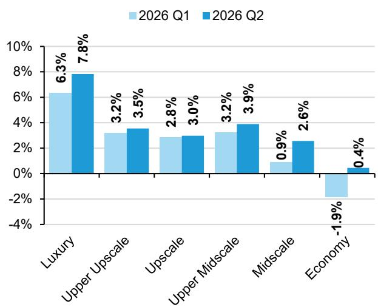  
Source: CoStar, Bernstein analysis  
EXHIBIT 33: Q2 RevPAR by region: Americas and MEA saw declines  
Regional RevPAR growth by quarter

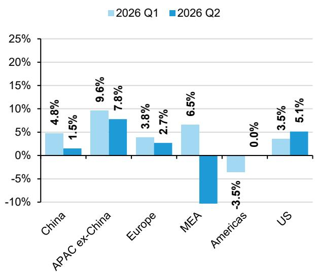  
Source: CoStar, Bernstein analysis

EXHIBIT 34: In the US, the top end of the chain scale continued to exhibit strength but the Economy - Upscale segments experienced a deceleration in May  
Hotels: y/y US RevPAR growth by chain scale  
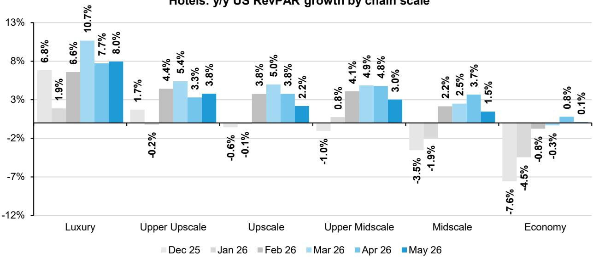  
Source: CoStar, Bernstein analysis

EXHIBIT 35: The Luxury chain scale continues to outperform the rest of the market, with a slowdown at the lower end, with Economy roughly flat in May and Midscale - Upscale decelerating to LSD growth  
Hotels: y/y US RevPAR growth by chain scale  
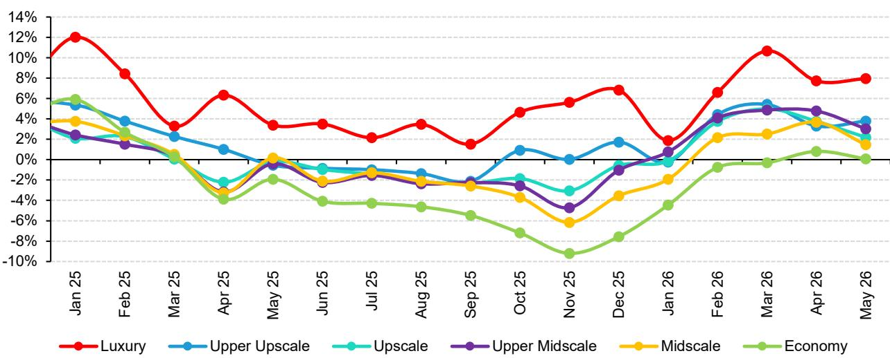  
Midpoint of preliminary data used for Feb-2025  
Source: STR, Bernstein analysis

EXHIBIT 36: The US continued to grow RevPAR in the MSDs whilst European performance slowed; China failed to maintain its recovery with a y/y decline in May despite strength across APAC. The MEA region recovered to 3.7% in May, supported by strong religious travel in the KSA. The Americas returned to y/y growth for the first time since October 2025.

Hotels: y/y global RevPAR growth by region  
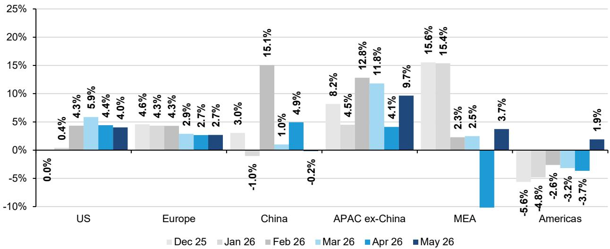  
Source: STR, Bernstein analysis

EXHIBIT 37: The Middle East has rebounded strongly in May after a 25% y/y RevPAR contraction in April, with recent strength driven by Saudi Arabia  
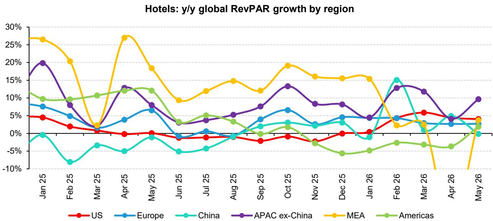  
Source: CoStar, Bernstein analysis

## THE LATEST WEEKLY DATA

EXHIBIT 38: US RevPAR performance has surged in the first month of June, likely due to early demand from the North American World Cup

US weekly RevPAR growth (y/y)  
  
Source: STR, Bernstein analysis

EXHIBIT 39: On a rolling basis, RevPAR has accelerated across the chain scale, with luxury continuing its strength in the LDDs  
US weekly RevPAR growth (rolling L28D y/y)  
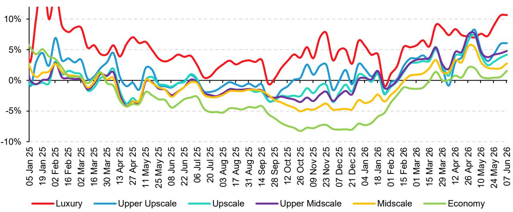  
Source: STR, Bernstein analysis

## RUN RATE ESTIMATES

EXHIBIT 40: The number of tickets available for the World Cup peaks in late June but later games will likely elicit more interest and economic activity. The most important games are almost exclusively being held in the US.

Tickets for Sale through World Cup  
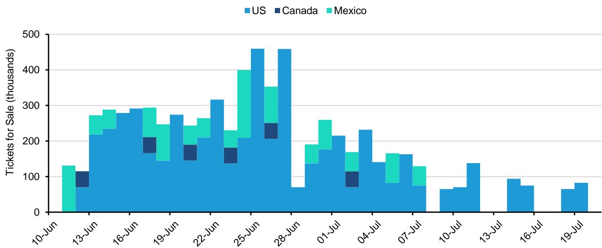  
Source: FIFA, Bernstein analysis & estimates  
EXHIBIT 41: With June likely to be the biggest month for North American hotel demand in Q2, we assume June performance to track the latest weekly data, pushing our estimates above the April - May run rate

Hotels: 26Q2 estimate vs 26Q1 RevPAR growth  
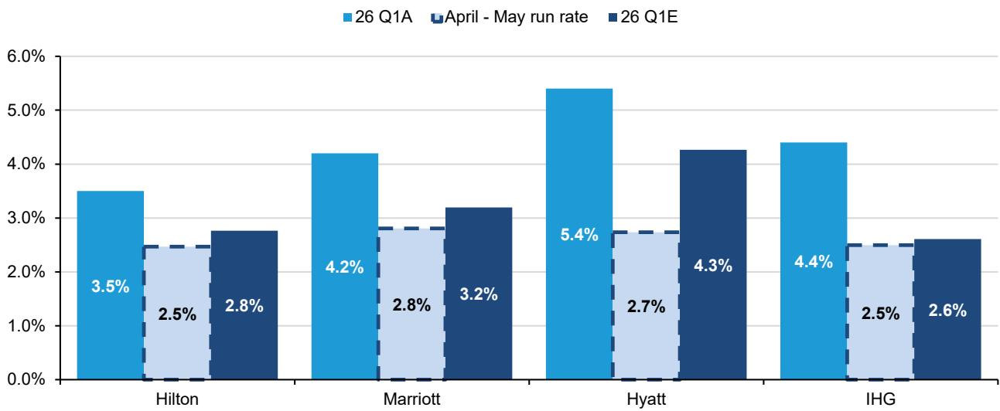  
Source: CoStar, Company reports, Bernstein analysis & estimates

EXHIBIT 42: Hyatt and Marriott lead in terms of exposure to host cities and near stadiums

World Cup Total System Exposure

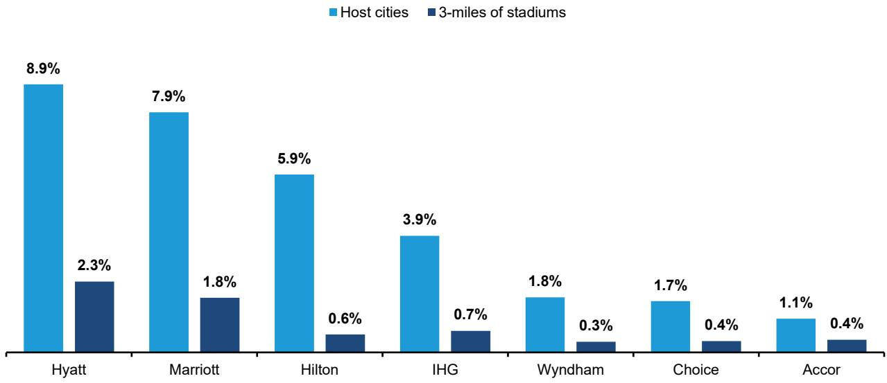  
We use global room counts given in FY25 results  
Source: Company reports, Costar, Bernstein analysis  
EXHIBIT 43: Under April - May performance and assuming early June performance will continue through the month, we expect Hyatt to come in ahead of their FY guide and Marriott to beat their Q2 guide, and Hilton to come right at the top end of their 2-3% range

Hotels: 26Q2 RevPAR growth estimate (Apr-May run rate + June assumption) vs guidance  
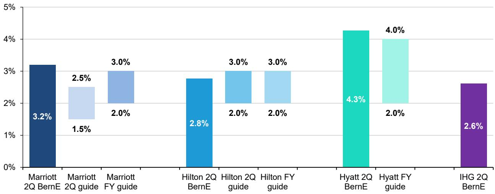  
Source: CoStar, Bernstein analysis & estimates

## THE GLOBAL HOTEL PIPELINE SHOWS SIGNS OF RECOVERY

Following the global macroeconomic disruption from ‘Liberation day’ in April, we saw a sudden pullback in the global hotel pipeline - a rapid reversal of the post-pandemic recovery in 2024. This year we have seen a meaningful recovery, with the global pipeline adding \~134k room from December to May, and the current pipeline now \~48k rooms larger than pre-Liberation day levels. All regions have contributed to this recovery. APAC has been the largest contributor, having added \~61k YTD, with \~29k of these rooms added so-far this quarter. Rooms under construction also continued to increase, growing by \~16k rooms

through the first two months of the quarters (Exhibit 46).

So far the conflict in the Middle East does not look to have had an impact on development, either in the MEA region itself or globally. MEA, which had consistently added to its pipeline since August 2025, saw some weakness in March, with the pipeline contracting by \~3.6k. However, this was more than offset by \~5.6k and 6.2k growth in pipeline in April and May. Rooms in construction is also strong, up 5.3% since February, but strong pipeline growth means the proportion of pipeline under construction has ticked down slightly. In other regions, the pipeline looks unaffected with all regions adding to their pipelines in April.

EXHIBIT 44: The global pipeline added \~55k rooms in April and another \~7k in May, to more than offset the small contraction in March  
STR Hotel Global Pipeline (millions of rooms)  
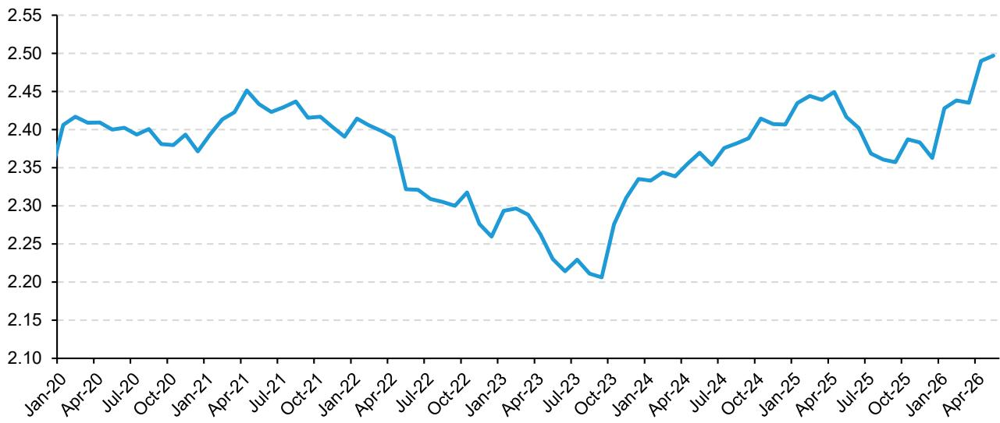  
Source: STR, Bernstein analysis

EXHIBIT 45: The US and Asia Pacific together added \~47k rooms to the global pipeline in April; MEA grew its pipeline in both April and May  
Month-on-Month Change in Pipeline by Geography  
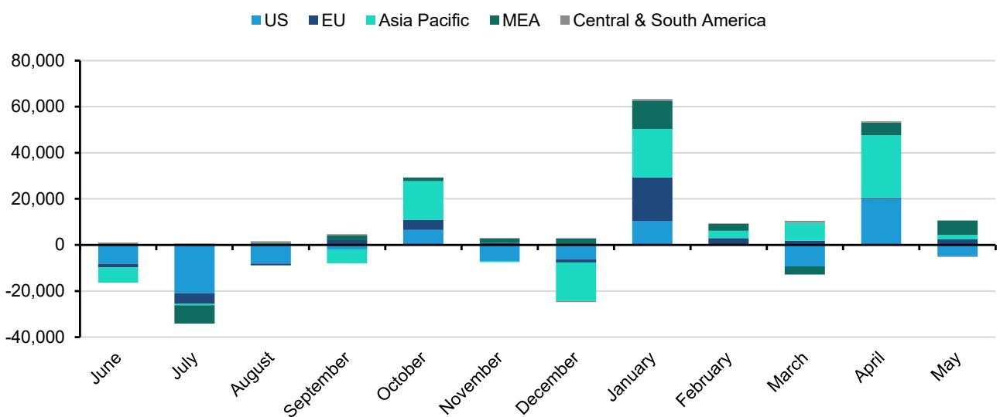  
Source: STR, Bernstein analysis  
STR Hotel Global Pipeline under construction (millions of rooms)

EXHIBIT 46: Rooms under construction has increased through the quarter by \~15.6k

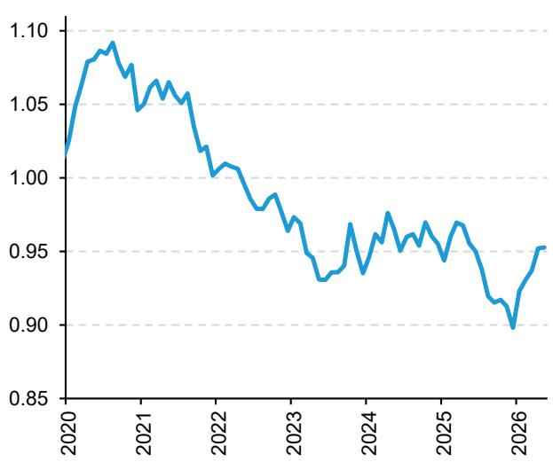  
Source: STR, Bernstein analysis  
EXHIBIT 47: The % of global pipeline under construction ticked down marginally

STR Hotel Global Pipeline - % under construction  
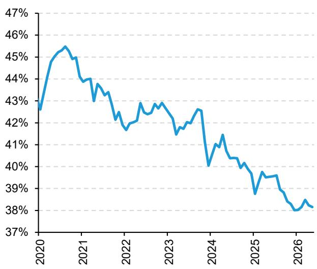  
Source: STR, Bernstein analysis

EXHIBIT 48: The relative size of the hotel pipeline continued to tick up  
STR Hotel Global Pipeline / Supply  
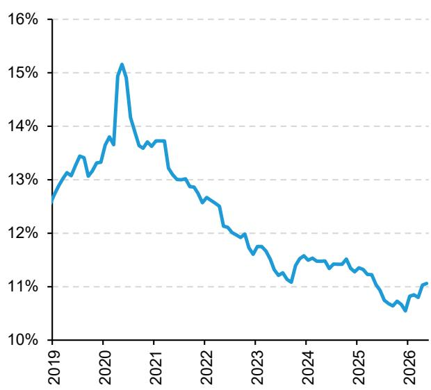  
Source: STR, Bernstein analysis

EXHIBIT 49: STR declared NUG \~1.7%, well off the >2% growth they used to set out  
STR Global Hotel Supply Growth  
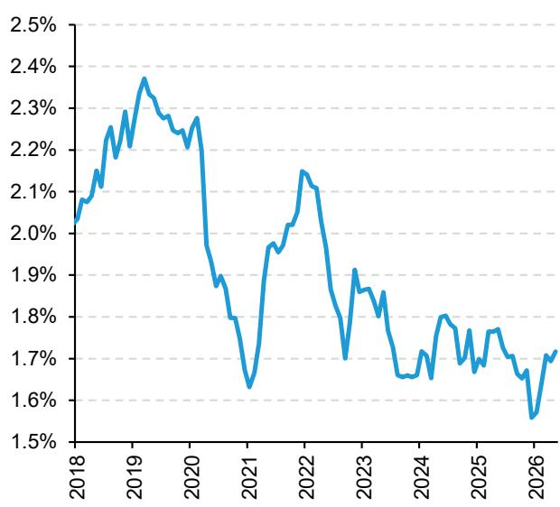  
Source: STR, Bernstein analysis  
EXHIBIT 50: The MEA pipeline continues to grow despite the ongoing conflict in the Middle East, with the pipeline growing by \~12k rooms so far this quarter

STR Hotel MEA Pipeline (millions of rooms)  
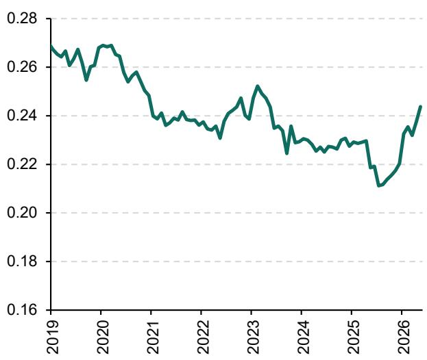  
EXHIBIT 51: Pipeline growth has offset a 5.3% increase in rooms under construction since Februray, resulting in a small tick down in the % of rooms under construction  
Source: STR, Bernstein analysis

STR Hotel MEA Pipeline - % under construction  
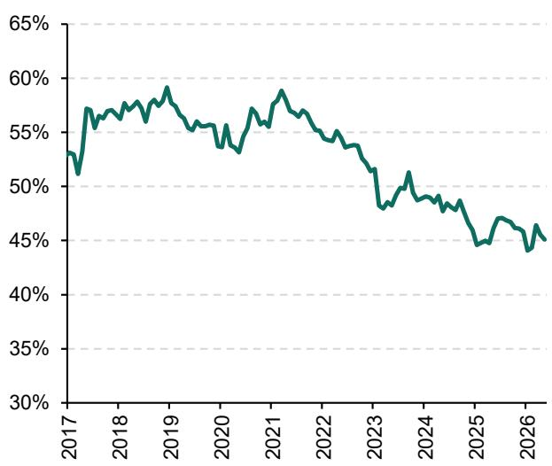  
Source: STR, Bernstein analysis

## How are the brands doing?

The branded share of the global hotel pipeline continues to slowly decline approaching 78%, continuing a trend which began in the second half of 2024 (Exhibit 52). The big asset light groups share, around 50% of global pipeline, remains relatively constant, recovering so far this quarter from a decline at the end of 2025 (Exhibit 53).

Marriott - Marriott continues to have the largest share of the global pipeline of $\sim 19\%$ (Exhibit 54).

Hilton - Hilton's share of the global pipeline suddenly increased in April, as the company added \~26k rooms to its global pipeline (Exhibit 55).

IHG - IHG's share of the global pipeline is stable at around 10.5-11% (Exhibit 56).

Hyatt - Hyatt's share of global pipeline has slowly increased YTD, having taken a step up in January (Exhibit 57).

Overall, brands are taking share in all geographies, making up a larger proportion of pipeline than they do existing supply. Furthermore, branded hotels dominate recent openings with over 90% of recent openings in the US and over 85% of new openings in APAC being branded. Further share gains will be most pronounced in LATAM and MEA where brands are responsible for nearly 90% of pipeline rooms. Gains will be less apparent in the US where the branded proportion of pipeline is roughly equal to branded share of supply (Exhibit 58).

EXHIBIT 52: The branded share of global pipeline has steadily declined since the second half of 2024, now approaching 78%  
Branded share of hotel pipeline (STR)  
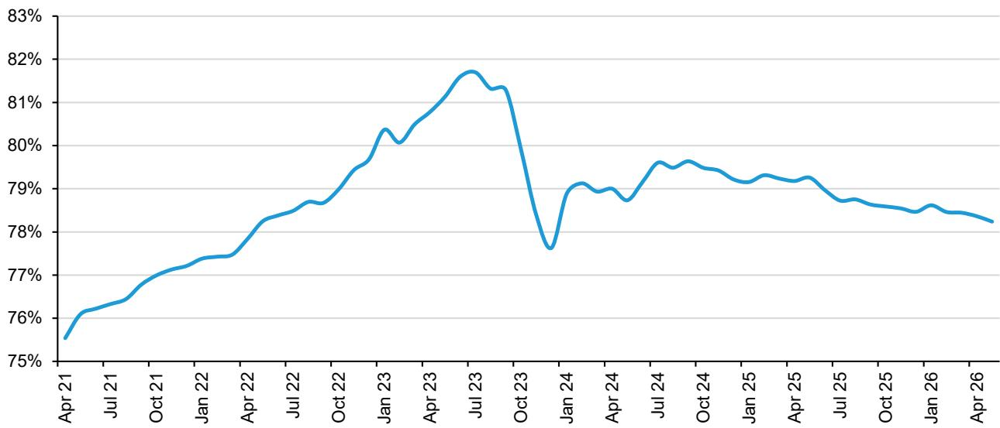  
Source: STR, Bernstein analysis

EXHIBIT 53: The big asset light groups have helped drive pipeline strength YTD  
Hilton, Marriott, Hyatt, and IHG share of global pipeline (STR)  
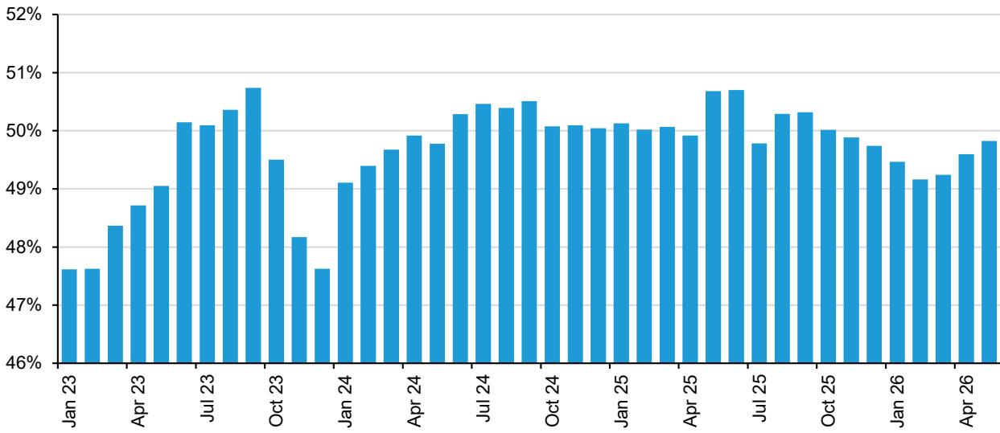  
Source: STR, Bernstein analysis

EXHIBIT 54: Marriott has the biggest share of global pipeline at around 19-19.5%  
Marriott share of global pipeline (STR)  
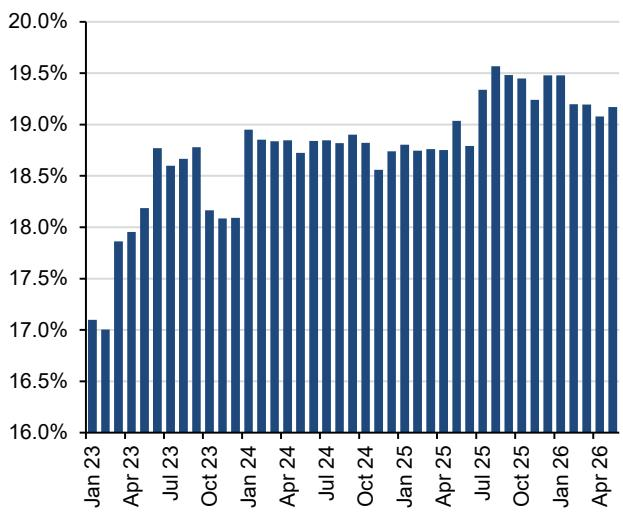  
Source: STR, Bernstein analysis  
EXHIBIT 55: Hilton added \~26k rooms to its pipeline in April, increasing its share of pipeline

Hilton share of global pipeline (STR)  
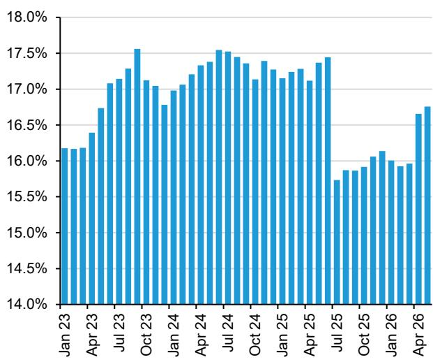  
Source: STR, Bernstein analysis

EXHIBIT 56: IHG share of pipeline is steady  
IHG share of global pipeline (STR)  
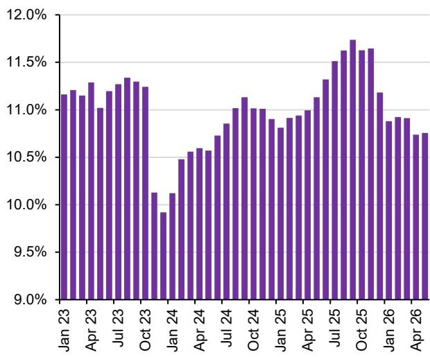  
Source: STR, Bernstein analysis

EXHIBIT 57: Hyatt's share of global pipeline stable at \~3.1%  
Hyatt share of global pipeline (STR)  
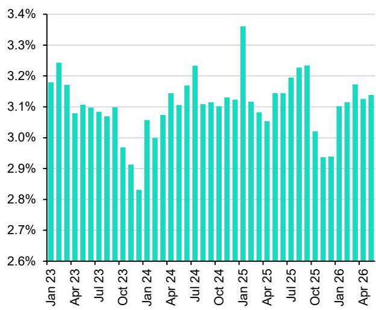  
STR tends to understate Hyatt's pipeline
Source: STR, Bernstein analysis  
Branded share of hotel rooms (May 2026)

EXHIBIT 58: Brands are taking share in all geographies, most notably in MEA and Latin America

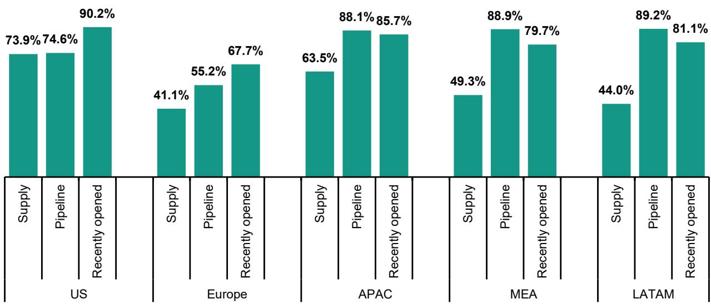  
Source: STR, Bernstein analysis

## I. REQUIRED DISCLOSURES

References to "Bernstein" or the "Firm" in these disclosures relate to the following entities: Bernstein Institutional Services LLC (April 1, 2024 onwards), Bernstein & Co., LLC (pre April 1, 2024), Bernstein Autonomous LLP, BSG France S.A. (April 1, 2024 onwards), Bernstein (Hong Kong) Limited 盛博香港有限公司, Bernstein (Canada) Limited, Bernstein (India) Private Limited (SEBI registration no. INH000006378), Bernstein (Singapore) Private Limited, Bernstein Japan KK (サンフォード・C・バーンスタイン株式会社) and analysts employed by SG Africa Technologies & Services to produce Bernstein under a Global Services Agreement in place between Bernstein and SG.

Bernstein is part of a joint venture between SG (SG) and AllianceBernstein, L.P. (AB). Unless specifically noted otherwise, for purposes of these disclosures, references to Bernstein's “affiliates” relate to both SG and AB and their respective affiliates.

## VALUATION METHODOLOGY

This research publication covers six or more companies. For valuation methodology and other company disclosures: Please visit: https://bernstein-autonomous.bluematrix.com/sellside/Disclosures.action.

Or, you can also write to the Director of Compliance, Bernstein Institutional Services LLC, 245 Park Avenue, New York, NY 10167.

## RISKS

This research publication covers six or more companies. For risks and other company disclosures:

Please visit: https://bernstein-autonomous.bluematrix.com/sellside/Disclosures.action.

Or, you can also write to the Director of Compliance, Bernstein Institutional Services LLC, 245 Park Avenue, New York, NY 10167.

RATINGS DEFINITIONS, BENCHMARKS AND DISTRIBUTION

## EQUITY RATINGS DEFINITIONS

## Bernstein brand

The Bernstein brand rates stocks based on forecasts of relative performance for the next 12 months versus the S&P 500 for stocks listed on the U.S. and Canadian exchanges, versus the Bloomberg Europe Developed Markets Large and Mid Cap Price Return Index EUR (EDME) for stocks listed on the European exchanges and emerging markets exchanges outside of the Asia Pacific region, versus the Bloomberg Japan Large and Mid Cap Price Return Index USD (JPL) for stocks listed on the Japanese exchanges, and versus the Bloomberg Asia ex-Japan Large and Mid Cap Price Return Index (ASIAX) for stocks listed on the Asian (ex-Japan) exchanges -unless otherwise specified.

The Bernstein brand has three categories of ratings:

\- Outperform: Stock will outpace the market index by more than 15 pp

• Market-Perform: Stock will perform in line with the market index to within +/-15 pp

• Underperform: Stock will trail the performance of the market index by more than 15 pp

Coverage Suspended: Coverage of a company under the Bernstein brand has been suspended. Ratings and price targets are suspended temporarily, are no longer current, and should therefore not be relied upon.

Not Rated: A rating assigned when the stock cannot be accurately valued, or the performance of the company accurately predicted, at the present time. The covering analyst may continue to publish research reports on the company to update investors on events and developments.

Not Covered (NC) denotes companies that are not under coverage.

Bernstein brand stock ratings are based on a 12-month time horizon.

Autonomous brand – common stocks

The Autonomous brand rates common stocks as indicated below. As our benchmarks we use the Bloomberg Europe 500 Banks And Financial Services Index (BEBANKS) and Bloomberg Europe Dev Mkt Financials Large and Mid Cap Price Ret Index EUR (EDMFI) index for developed European banks and Payments, the Bloomberg Europe 500 Insurance Index (BEINSUR) for European insurers, the S&P 500 and S&P Financials for US banks and Payments coverage, S5LIFE for US Insurance, the S&P Insurance Select Industry (SPSIINS) for US Non-Life Insurers coverage, and the Bloomberg Emerging Markets Financials Large, Mid and Small Cap Price Return Index (EMLSF) for emerging market banks and insurers and Payments. Ratings are stated relative to the sector (not the market).

The Autonomous brand has three categories of common stock ratings:

\- Outperform (OP): Stock will outpace the relevant index by more than 10 pp

\- Neutral (N): Stock will perform in line with the market index to within +/-10 pp

\- Underperform (UP): Stock will trail the performance of the relevant index by more than 10 pp

Coverage Suspended: Coverage of a company under the Autonomous research brand has been suspended. Ratings and price targets are suspended temporarily, are no longer current, and should therefore not be relied upon.

Not Rated: A rating assigned when the stock cannot be accurately valued, or the performance of the company accurately predicted, at the present time. The covering analyst may continue to publish research reports on the company to update investors on events and developments.

Those denoted as ‘Feature’ (e.g., Feature Outperform FOP, Feature Under Outperform FUP) are our core ideas.

Not Covered (NC) denotes companies that are not under coverage.

Autonomous brand common stock ratings are based on a 12-month time horizon.

## Autonomous brand – preferred stocks

The Autonomous brand has three categories of preferred stock ratings:

\- Outperform (OP): The total return of the preferred instrument is expected to outperform preferred securities of other issuers operating in similar sectors or rating categories over the next six months.

\- Neutral (N): The total return of the preferred instrument is expected to perform in line with preferred securities of other issuers operating in similar sectors or rating categories over the next six months.

\- Underperform (UP): The total return of the preferred instrument is expected to underperform preferred securities of other issuers operating in similar sectors or rating categories over the next six months.

Autonomous preferred stock ratings are based on a 6-month time horizon.

## AUTONOMOUS CREDIT RESEARCH

Where this report contains investment recommendations for credit instruments, as defined in article 3(1)(35) of the Market Abuse Regulation, the information below is presented to comply with its disclosure requirements.

The report may also include reference(s) to published opinions by other Autonomous or Bernstein analysts covering the equity securities of the issuer(s) referenced herein. Please note an investment recommendation for credit instruments published by the author(s) of this report may differ from the published view of the analyst covering equity securities for the issuer(s) contained in this report and vice versa.

## CREDIT RATINGS DEFINITIONS

The Autonomous brand has three categories of credit ratings:

\- Credit Outperform (C-OP): The total return of the Reference Credit Instrument is expected to outperform the credit spread of bonds of other issuers operating in similar sectors or rating categories over the next six months.

\- Credit Neutral (C-N): The total return of the Reference Credit Instrument is expected to perform in line with the credit spread of bonds of other issuers operating in similar sectors or rating categories over the next six months.

\- Credit Underperform (C-UP): The total return of the Reference Credit Instrument is expected to underperform the credit spread of bonds of other issuers operating in similar sectors or rating categories over the next six months.

Autonomous credit ratings are based on a 6-month time horizon.

A list of all investment recommendations produced by the author(s) of this report alongside credit ratings history are available upon request.

It is at the sole discretion of the Firm as to when to initiate, update and cease research coverage. The Firm has established, maintains and relies on information barriers to control the flow of information contained in one or more areas (i.e. the private side) within the Firm, and into other areas, units, groups or affiliates (i.e. public side) of the Firm

## DISTRIBUTION OF EQUITY RATINGS/INVESTMENT BANKING SERVICES

<table><tr><td>Equity Rating</td><td>Market Abuse Regulation (MAR) and FINRA Rating Category</td><td>Global Rating Distribution</td><td>Investment Banking Relationships*</td></tr><tr><td>Outperform</td><td>BUY</td><td>51.1%</td><td>16.5%</td></tr><tr><td>Market-Perform (Bernstein Brand) Neutral (Autonomous Brand)</td><td>HOLD</td><td>36.3%</td><td>17.8%</td></tr><tr><td>Underperform</td><td>SELL</td><td>12.6%</td><td>14.9%</td></tr></table>

\* These figures represent the percentage of companies within each equity rating category for which affiliates of Bernstein have provided investment banking services within the previous 12 months.
As of March 31, 2026. All figures are updated quarterly.

## PRICE CHARTS/ RATINGS AND PRICE TARGET HISTORY

This research publication covers six or more companies. For price chart and other company disclosures, please visit https://bernstein-autonomous.bluematrix.com/sellside/Disclosures.action or you can write to the Director of Compliance, Bernstein Institutional Services LLC, 245 Park Avenue, New York, NY 10167.

## CONFLICTS OF INTEREST

SG and/or its affiliates beneficially own 0.5% or more of [the total issued share capital/any class of common equity securities] with a net [long/short] position of: TripAdvisor Inc and InterContinental Hotels Group PLC.

Bernstein Autonomous LLP or BSG France SA, beneficially, has either a net long or short position of 0.5% or more of the total issued share capital of a class of common equity securities of the following MiFID eligible securities: InterContinental Hotels Group PLC and Hyatt Hotels Corp.

AB and/or its affiliates beneficially own 1% or more of a class of common equity securities of the following company: Hyatt Hotels Corp.

Bernstein and/or affiliates have received compensation for investment banking services in the past twelve months from Accor SA.

Bernstein and/or affiliates have received compensation for non-investment banking securities-related products or services in the previous twelve months from the following clients: Hilton Worldwide Holdings Inc and Accor SA.

Bernstein and/or affiliates expect to receive or intend to seek compensation for investment banking services in the next three months from Accor SA.

Certain affiliates of Bernstein act as market maker or liquidity provider in the equities securities of: Booking Holdings Inc, Airbnb Inc, Expedia Group Inc, TripAdvisor Inc, Hilton Worldwide Holdings Inc, Marriott International Inc, InterContinental Hotels Group PLC and Accor SA.

Certain affiliates of Bernstein act as market maker or liquidity provider in the debt securities of: Booking Holdings Inc, Expedia Group Inc and Accor SA.

Affiliates of Bernstein managed or co-managed in the past twelve months a public offering of securities of Accor SA.

Bernstein and/or affiliates had an investment banking client relationship during the past twelve months with Accor SA.

## OTHER MATTERS

The legal entity(ies) employing the analyst(s) listed in this report, and their location, can be determined by the country code of their phone number, as follows:

+1 Bernstein Institutional Services LLC; New York, New York, USA

+44 Bernstein Autonomous LLP; London UK

+212 SG Africa Technologies & Services; Casablanca, Morocco

+33 BSG France S.A.; Paris, France

+34 BSG France S.A.; Madrid, Spain

+41 Bernstein Autonomous LLP; Geneva, Switzerland

+49 BSG France S.A.; Frankfurt, Germany

+91 Bernstein (India) Private Limited; Mumbai, India

+852 Bernstein (Hong Kong) Limited 盛博香港有限公司; Hong Kong, China

+65 Bernstein (Singapore) Private Limited; Singapore

+81 Bernstein Japan KK; Tokyo, Japan

Where this report has been prepared by research analyst(s) employed by a non-US affiliate, such analyst(s), is/are (unless otherwise expressly noted below) not registered as associated persons of Bernstein Institutional Services LLC or any other SEC-registered broker-dealer and are not licensed or qualified as research analysts with FINRA. Accordingly, such analyst(s) may not be subject to FINRA's restrictions regarding (among other things) communications by research analysts with a subject company, interactions between research analysts and investment banking personnel, participation by research analysts in solicitation and marketing activities relating to investment banking transactions, public appearances by research analysts, and trading securities held by a research analyst account.

Where this report has been prepared by research analyst(s) employed by SG Africa Technologies & Services (part of the SG group of companies), it has been prepared on behalf of a Bernstein company under a Global Services Agreement in place between Bernstein and SG.

## CERTIFICATION

Each research analyst listed in this report, who is primarily responsible for the preparation of the content of this report, certifies that all of the views expressed in this publication accurately reflect that analyst's personal views about any and all of the subject securities or issuers and that no part of that analyst's compensation was, is, or will be, directly or indirectly, related to the specific recommendations or views in this publication.

## II. ADDITIONAL GLOBAL CONFLICT DISCLOSURES

It is at the sole discretion of the Firm as to when to initiate, update and cease research coverage. The Firm has established, maintains and relies on information barriers to control the flow of information contained in one or more areas (i.e., the private side) within the Firm, and into other areas, units, groups or affiliates (i.e., public side) of the Firm.

## III. OTHER IMPORTANT INFORMATION AND DISCLOSURES

Separate branding is maintained for “Bernstein” and “Autonomous” research products.

\- Bernstein produces a number of different types of research products including, among others, fundamental analysis and quantitative analysis under both the “Autonomous” and “Bernstein” brands. Recommendations contained within one type of research product may differ from recommendations contained within other types of research products, whether as a result of differing time horizons, methodologies or otherwise. Furthermore, views or recommendations within a research product issued under one brand may differ from views or recommendations under the same type of research product issued under the other brand. The Research Ratings System for the two brands and other information related to those Rating Systems are included in the previous section.

\- Autonomous operates as a separate business unit within the following entities: Bernstein Institutional Services LLC, Bernstein Autonomous LLP, Bernstein (Hong Kong) Limited 盛博香港有限公司 and Bernstein (India) Private Limited. For information relating to “Autonomous” branded products (including certain Sales materials) please visit: www.autonomous.com. For information relating to Bernstein branded products please visit: www.bernsteinresearch.com.

Analysts are compensated based on aggregate contributions to the research franchise as measured by account penetration, productivity and proactivity of investment ideas. No analysts are compensated based on performance in, or contributions to, generating investment banking revenues.

This report has been produced by an independent analyst as defined in Article 3 (1)(34)(i) of EU 596/2014 Market Abuse Regulation (“MAR”) and the same article of MAR as it forms part of United Kingdom domestic law by virtue of the European Union (Withdrawal) Act 2018.

To our readers in the United States: Bernstein Institutional Services LLC, a broker-dealer registered with the U.S. Securities and Exchange Commission (“SEC”) and a member of the U.S. Financial Industry Regulatory Authority, Inc. (“FINRA”) is distributing this publication in the United States and accepts responsibility for its contents. Where this material contains an analysis of debt product(s), such material is intended only for institutional investors and is not subject to the US independence and disclosure standards applicable to debt research prepared for retail investors.

Bernstein Institutional Services LLC may act as principal for its own account or as agent for another person (including an affiliate) in sales or purchases of any security which is a subject of this report. This report does not purport to meet the objectives or needs of any specific individuals, entities or accounts.

To our readers in Canada: If this publication pertains to a Canadian domiciled company, it is being distributed in Canada by Bernstein (Canada) Limited, which is licensed and regulated by the Canadian Investment Regulatory Organization. If the publication pertains to a non-Canadian domiciled company, it is being distributed by Bernstein Institutional Services LLC, which is licensed and regulated by both the SEC and FINRA, into Canada under the International Dealers Exemption.

This document may not be passed onto any person in Canada unless that person qualifies as "permitted client" as defined in Section 1.1 of NI 31-103.

To our readers in Brazil: This report has been prepared by Bernstein Institutional Services LLC, and Banco BTG Pactual S.A. ("BTG") is responsible for the distribution of this report in Brazil.

To readers in the United Kingdom: This publication has been issued or approved for issue in the United Kingdom by Bernstein Autonomous LLP, authorised and regulated by the Financial Conduct Authority and located at 60 London Wall, London EC2M 5SH, +44 (0)20-7170-5000. Registered in England & Wales No OC343985.

This document is for distribution only to persons who (i) have professional experience in matters relating to investments falling within Article 19(5) of the Financial Services and Markets Act 2000 (Financial Promotion) Order 2005 (as amended, the “Financial Promotion Order”), (ii) are persons falling within Article 49(2)(a) to (d) (“high net worth companies, unincorporated associations, etc.”) of the Financial Promotion Order, (iii) are outside the United Kingdom, or (iv) are persons to whom an invitation or inducement to engage in investment activity (within the meaning of section 21 of the FSMA) in connection with the issue or sale of any securities may otherwise lawfully be communicated or caused to be communicated (all such persons together being referred to as “relevant persons”). This document is directed only at relevant persons and must not be acted on or relied on by persons who are not relevant persons. Any investment or investment activity to which this document relates is available only to relevant persons and will be engaged in only with relevant persons.

To our readers in the member states of the EEA: This publication is being distributed by BSG France SA, which is authorised and regulated by the Autorité de Contrôle Prudentiel et de Résolution (ACPR) and Autorité des Marchés Financiers (AMF).

To our readers in Hong Kong: This publication is being distributed in Hong Kong by Bernstein (Hong Kong) Limited 盛博香港有限公司, which is licensed and regulated by the Hong Kong Securities and Futures Commission (Central Entity No. AXC846) to carry out Type 4 (Advising on Securities) regulated activities and subject to the licensing conditions mentioned in the SFC Public Register (https://www.sfc.hk/publicregWeb/corp/AXC846/details)). This publication is solely for professional investors, as defined in the Securities and Futures Ordinance (Cap. 571). The purpose of this report is solely to provide an analysis of the issuers referred to in this report and is not intended for any purpose contrary to the laws of Hong Kong.

To our readers in Singapore: This publication is being distributed in Singapore by Bernstein (Singapore) Private Limited, only to accredited investors or institutional investors, as defined in the Securities and Futures Act 2001 of Singapore ("SFA"). Recipients in Singapore should contact Bernstein (Singapore) Private Limited in respect of matters arising from, or in connection with, this publication. Bernstein (Singapore) Private Limited is regulated by the Monetary Authority of Singapore and licensed under the SFA as a capital markets services licence holder for dealing in capital markets products that are securities and collective investment schemes and an exempt financial adviser for advising on, issuing and promulgating analyses and reports on securities. Bernstein (Singapore) Private Limited is registered in Singapore with Company Registration No. 20213710W and located at 8 Marina Boulevard, #12-01, Marina Bay Financial Centre, Singapore 018981, +65-6326-7000.

To our readers in the People's Republic of China: The securities referred to in this document are not being offered or sold and may not be offered or sold, directly or indirectly, in the People's Republic of China (for such purposes, not including the Hong Kong and Macau Special Administrative Regions or Taiwan, the "PRC") in contravention of any applicable laws of the PRC.

This document does not constitute an offer to sell or the solicitation of an offer to buy any securities in the PRC to any person to whom it is unlawful to make the offer or solicitation in the PRC.

We do not represent that this document may be lawfully distributed, or that any securities may be lawfully offered, in compliance with any applicable registration or other requirements in the PRC, or pursuant to an exemption available thereunder, or assume any responsibility for facilitating any such distribution or offering. In particular, no action has been taken by us which would permit a public offering of any securities or distribution of this document in the PRC. Accordingly, the securities are not being offered or sold within the PRC by means of this document or any other document. Neither this document nor any advertisement or other offering material may be distributed or published in the PRC, except under circumstances that will result in compliance with any applicable laws and regulations.

To our readers in Japan: This publication is being distributed in Japan by Bernstein Japan KK (サンフォード・C・バーンスタイン株式会社), which is registered in Japan as a Financial Instruments Business Operator with the Kanto Local Finance Bureau (registration number: The Director-General of Kanto Local Finance Bureau (FIBO) No.3387) and regulated by the Financial Services Agency. It is also a member of Investment Management Association of Japan. This publication is solely for qualified institutional investors in Japan only, as defined in Article 2, paragraph (3), items (i) of the Financial Instruments and Exchange Act.

For the institutional client readers in Japan who have been granted access to the Bernstein website by Daiwa Group Inc. ("Daiwa"), your access to this document should not be construed as meaning that Bernstein is providing you with investment advice for any purposes. Whilst Bernstein has prepared this document, your relationship is, and will remain with, Daiwa, and Bernstein has neither any contractual relationship with you nor any obligations towards you.

To our readers in Australia: Bernstein (Hong Kong) Limited 盛博香港有限公司 is responsible for distributing research in Australia. It is regulated by the Securities and Exchange Commission under U.S. laws, by the Financial Conduct Authority under U.K. laws, which differs from Australian laws. Bernstein (Hong Kong) Limited 盛博香港有限公司 is exempt from the requirement to hold an Australian financial services license under the Corporations Act 2001 in respect of the provision of the following financial services to wholesale clients:

• providing financial product advice;

• dealing in a financial product;

\- making a market for a financial product; and

• providing a custodial or depository service.

To our readers in India: This publication is being distributed in India by Bernstein (India) Private Limited (SCB India) which is licensed and regulated by Securities and Exchange Board of India ("SEBI") as a research analyst entity under the SEBI (Research Analyst) Regulations, 2014, having registration no. INH000006378 and as a stock broker having registration no.

INZ000213537. SCB India is currently engaged in the business of providing research and stock broking services. Please refer to www.bernsteinresearch.in for more information.

\- SCB India is a Private limited company incorporated under the Companies Act, 2013, on April 12, 2017 bearing corporate identification number U65999MH2017FTC293762, and registered office at Level 3A, 4th Floor, First International Financial Centre, Plot Nos C-54 and C-55, G Block, Near CBI Office, Bandra Kurla Complex, Bandra (East), Mumbai 400098, Maharashtra, India (Phone No: +91-22-68421401).

\- For details of Associates (i.e., affiliates/group companies) of SCB India, kindly email MUM-BERNSTEIN-InCompliance@bernsteinsg.com.

• SCB India does not have any disciplinary history as on the date of this report.

\- Except as noted above, SCB India and/or its Associates (i.e., affiliates/group companies), the Research Analysts authoring this report, and their relatives

• do not have any financial interest in the subject company

• do not have actual/beneficial ownership of one percent or more in securities of the subject company;

\- is not engaged in any investment banking activities for Indian companies, as such;

• have not managed or co-managed a public offering in the past twelve months for any Indian companies;

\- have not received any compensation for investment banking services or merchant banking services from the subject company in the past 12 months;

• have not received compensation for brokerage services from the subject company in the past twelve months;

\- have not received any compensation or other benefits from the subject company or third party related to the specific recommendations or views in this report; and

\- do not currently, but may in the future, act as a market maker in the financial instruments of the companies covered in the report.

\- do not have any conflict of interest in the subject company as of the date of this report.

\- Except as noted above, the subject company has not been a client of SCB India during twelve months preceding the date of distribution of this research report. Neither SCB India nor its Associates (i.e., affiliates/group companies) have received compensation for products or services other than investment banking, merchant banking or brokerage services from the subject company in the past twelve months.

\- The principal research analyst(s) who prepared this report, members of the analysts' team, and members of their households are not an officer, director, employee or advisory board member of the companies covered in the report.

\- Our Compliance officer / Grievance officer is Ms. Rupal Talati, who can be reached at +91-22-68421451, or MUM-BERNSTEIN-InCompliance@bernsteinsg.com / Scbin-investorgrievance@bernsteinsg.com

\- The Research investor charter and Terms & Conditions of SCB India are available on its website and may be accessed at Bernstein (India) Private Limited (https://bernsteinresearch.in/) for your reference.

\- Disclaimer: Registration granted by SEBI, and certification from NISM, is in no way a guarantee of performance of the intermediary or provide any assurance of returns to investors. Investments in securities market are subject to market risks. Read all the related documents carefully before investing.

To our readers in Switzerland: This document is provided in Switzerland by or through Bernstein Autonomous LLP, and is provided only to qualified investors as defined in article 10 of the Swiss Collective Investment Scheme Act (“CISA”) and related provisions of the Collective Investment Scheme Ordinance and in strict compliance with applicable Swiss law and regulations. The products mentioned in this document may not be suitable for all types of investors. This document is based on the Directives on the Independence of Financial Research issued by the Swiss Bankers Association (SBA) in January 2008.

To our readers in the Middle East: Bernstein Autonomous LLP, DIFC branch has its principal office at Gate Village 06, DIFC, Dubai, UAE. Bernstein Autonomous LLP, DIFC branch is regulated by the Dubai Financial Services Authority (DFSA) with the registration number CL10040 and is provisioned for Arranging Deals in Investments and Advising on Financial Products. All communications and services are directed at Professional Clients and Market Counterparties only (as defined in the DFSA rulebook). Persons other than Professional Clients and Market Counterparties, such as Retail Clients, are not the intended recipients of our communications or services.

## LEGAL

All research publications are disseminated to our clients through posting on the firm's password protected websites, bernsteinresearch.com and autonomous.com. Certain, but not all, research publications are also made available to clients through third-party vendors or redistributed to clients through alternate electronic means as a convenience.

This publication has been published and distributed in accordance with the Firm's policy for management of conflicts of interest in investment research, a copy of which is available from Bernstein Institutional Services LLC, Director of Compliance, 245 Park Avenue, New York, NY 10167. Additional disclosures and information regarding Bernstein's business are available on our website www.bernsteinresearch.com.

The securities described herein may not be eligible for sale in all jurisdictions or to certain categories of investors where that permission profile is not consistent with the licenses held by the entities noted herein. This document is for distribution only as may be permitted by law. This publication is not directed to, or intended for distribution to or use by, any person or entity who is a citizen or resident of, or located in any locality, state, country or other jurisdiction where such distribution, publication, availability or use would be contrary to law or regulation or which would subject any of the entities referenced herein or any of their subsidiaries or affiliates to any registration or licensing requirement within such jurisdiction. This publication is based upon public sources we believe to be reliable, but no representation is made by us that the publication is accurate or complete. We do not undertake to advise you of any change in the reported information or in the opinions herein. This publication was prepared and issued by entity referred to herein for distribution to eligible counterparties or professional clients. This publication is not an offer to buy or sell any security, and it does not constitute investment, legal or tax advice. The investments referred to herein may not be suitable for you. Investors must make their own investment decisions in consultation with their professional advisors in light of their specific circumstances. The value of investments may fluctuate, and investments that are denominated in foreign currencies may fluctuate in value as a result of exposure to exchange rate movements. Information about past performance of an investment is not necessarily a guide to, indicator of, or assurance of, future performance.

This report is directed to and intended only for our clients who are “eligible counterparties”, “professional clients”, “institutional investors” and/or “professional investors” as defined by the aforementioned regulators, and must not be redistributed to retail clients as defined by the aforementioned regulators. Retail clients who receive this report should note that the services of the entities noted herein are not available to them and should not rely on the material herein to make an investment decision. The result of such act will not hold the entities noted herein liable for any loss thus incurred as the entities noted herein are not registered/authorised/licensed to deal with retail clients and will not enter into any contractual agreement/arrangement with retail clients. This report is provided subject to the terms and conditions of any agreement that the clients may have entered into with the entities noted herein. All research reports are disseminated on a simultaneous basis to eligible clients through electronic publication to our client portal.

The information in this report was prepared by Bernstein solely for the internal business use of our clients. Clients may store, display, analyze, reformat and print the information in this report for this limited use only. Clients may not copy, alter, create derivative works, resell, reverse engineer, commercially exploit, share or distribute any part of the information contained herein for any purpose without Bernstein's express written consent. These restrictions include extracting data or using the content to develop indices or other products. Further, you may not use this report, or any portion of this report, to train or finetune any third-party machine learning or artificial intelligence system, or as a prompt or input into any such system. You also may not, without Bernstein's express written consent, do any of the foregoing in connection with your own internal machine learning or artificial intelligence system.

Bernstein may use artificial intelligence tools in the preparation of its materials. Any such materials are reviewed by Bernstein's research analysts prior to publication.

This report has been prepared for information purposes only and is based on current public information that we consider reliable, but the entities noted herein do not warrant or represent (express or implied) as to the sources of information or data contained herein are accurate, complete, not misleading or as to its fitness for the purpose intended even though the entities noted herein rely on reputable or trustworthy data providers, it should not be relied upon as such. Opinions expressed are the author(s)' current opinions as of the date appearing on the material only and we do not undertake to advise you of any change in the reported

information or in the opinions herein.

Any references to SG herein are purely factual, based upon publicly available information, and included for comparative purposes only. They do not constitute an opinion or recommendation with respect to the securities of SG.

This publication was prepared and issued by the entity referred to herein for distribution to eligible counterparties or professional clients. The information in this report is intended for general circulation and does not constitute an offer to buy or sell any security, investment, legal or tax advice nor a personal recommendation, as defined by any of the aforementioned regulators. It does not take into account the particular investment objectives, financial situations, or needs of individual investors. The report has not been reviewed by any of the aforementioned regulators and does not represent any official recommendation from the aforementioned regulators. The investments referred to herein may not be suitable for you. Investors must make their own investment decisions in consultation with advice sought from a financial adviser regarding the suitability of the investment product, taking into account the specific investment objectives, financial situation or particular needs of any recipient of the recommendation, before the recipient makes a commitment to purchase the investment product.

The analysis contained herein is based on numerous assumptions. Different assumptions could result in materially different results. The information in this report does not constitute, or form part of, any offer to sell or issue, or any offer to purchase or subscribe for shares, or to induce engagement in any other investment activity. The value of any securities or financial instruments mentioned in this report may fluctuate subject to market conditions. Information about past performance of an investment is not necessarily a guide to, indicative of, or assurance of future performance. Estimates of future performance mentioned by the research analyst in this report are based on assumptions that may not be realized due to unforeseen factors like market volatility/fluctuation. In relation to securities or financial instruments denominated in a foreign currency other than the clients' home currency, movements in exchange rates will have an effect on the value, either favorable or unfavorable. Before acting on any recommendations in this report, recipients should consider the appropriateness of investing in the subject securities or financial instruments mentioned in this report and, if necessary, seek independent professional advice.

The securities described herein may not be eligible for sale in all jurisdictions or to certain categories of investors where that permission profile is not consistent with the licenses held by the entities noted herein. This document is for distribution only as may be permitted by law. It is not directed to, or intended for distribution to or use by, any person or entity who is a citizen or resident of or located in any locality, state, country or other jurisdiction where such distribution, publication, availability or use would be contrary to law or regulation or would subject the entities noted herein to any regulation or licensing requirement within such jurisdiction.

Source: Bloomberg Index Services Limited. BLOOMBERG® is a trademark and service mark of Bloomberg Finance L.P. and its affiliates (collectively “Bloomberg”). Bloomberg or Bloomberg’s licensors own all proprietary rights in the Bloomberg Indices. Neither Bloomberg nor Bloomberg’s licensors approves or endorses this material, or guarantees the accuracy or completeness of any information herein, or makes any warranty, express or implied, as to the results to be obtained therefrom and, to the maximum extent allowed by law, neither shall have any liability or responsibility for injury or damages arising in connection therewith.

No part of this material may be reproduced, distributed or transmitted or otherwise made available without prior consent of the entities noted herein. Copyright Bernstein Institutional Services LLC Bernstein Autonomous LLP, BSG France S.A., Bernstein (Hong Kong) Limited 盛博香港有限公司, Bernstein (Canada) Limited, Bernstein (India) Private Limited (SEBI registration no. INH000006378), Bernstein (Singapore) Private Limited and Bernstein Japan KK (サンフォード・C・バーンスタイン株式会社). All rights reserved. The trademarks and service marks contained herein are the property of their respective owners. Any unauthorized use or disclosure is strictly prohibited. The entities noted herein may pursue legal action if the unauthorized use results in any defamation and/or reputational risk to the entities noted herein and research published under the Bernstein and Autonomous brands.