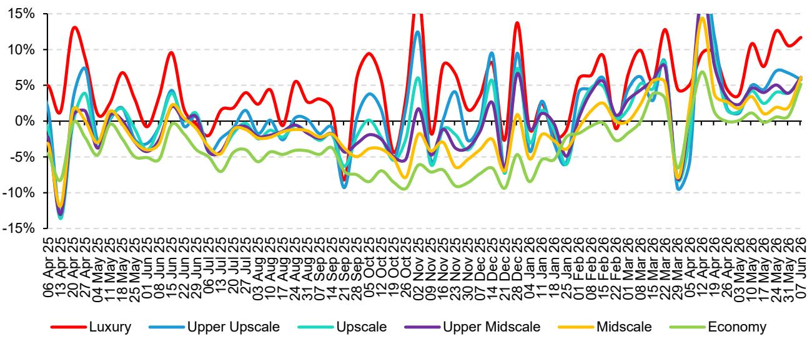
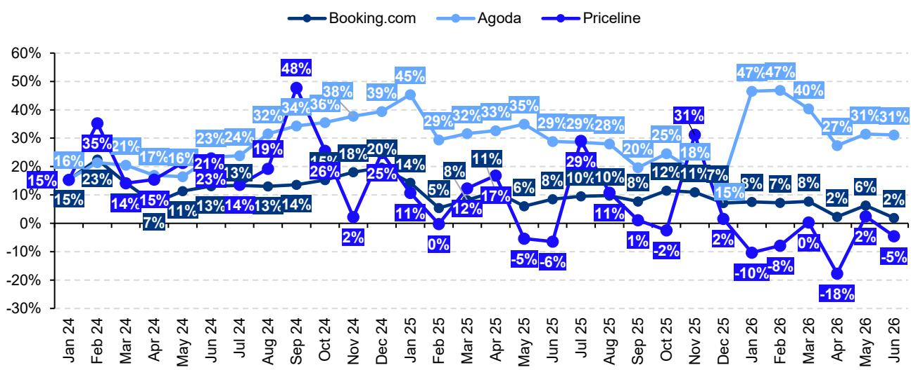
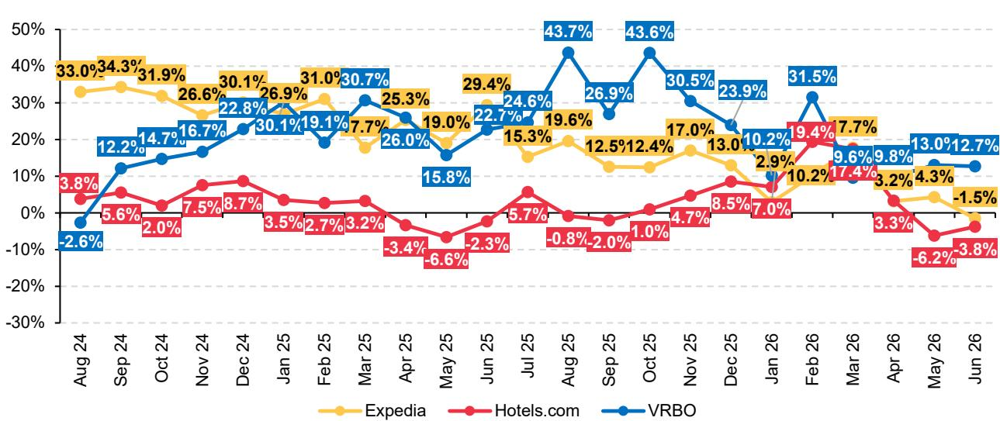

# Bernstein：世界杯掩盖了全球酒店业的真实分化

全球酒店业正在经历一场被世界杯数据掩盖的结构性分化。Bernstein在最新发布的全球酒店与旅游研报中给出了一个核心判断：美国市场的强劲表现正在抵消中东、欧洲和中国的疲软，但这种“对冲”是不可持续的。Q2美国RevPAR同比增长4%，6月第一周加速至7%，世界杯效应将推动酒店集团达到甚至超出指引上限。然而，这份报告真正值得关注的不是世界杯带来的短期脉冲，而是三个正在重塑行业格局的长期变量：OTA流量结构的变化、AI作为新流量入口的早期信号、以及酒店开发在地缘冲突下的韧性。

## 1. 世界杯红利集中在北美，掩盖了全球其他市场的真实疲软

Bernstein的数据显示，美国RevPAR在4-5月增长4%，6月第一周跳升至7%，而这一周仅进行了8场世界杯比赛，后续两周还有28场和36场。即使没有进一步加速，世界杯效应也足以将酒店集团推向指引上限甚至超出。Hyatt被列为最大受益者。

但这份报告没有停留在这个表面利好。真正值得追问的是：世界杯之后，支撑北美需求的结构性因素是什么？Bernstein指出，北美市场的“K型复苏”依然存在——奢侈品酒店表现显著优于中端。Hyatt RevPAR增长4.3%，Marriott 3.2%，Hilton 2.9%，IHG仅2.6%，后者主要受中国业务拖累。

> **KC评论：** 世界杯就像一针强心剂，但它掩盖了一个关键问题——如果没有这个短期事件，北美酒店业的真实需求曲线是怎样的？报告中的图表显示，Hyatt的RevPAR增速领先，但其估值倍数也最高。世界杯效应退潮后，这些高估值能否被持续的经营数据支撑，是完整报告里反复检验的核心假设。

中东市场的疲软已被充分预期，但欧洲和中国增长放缓的信号更值得警惕。Bernstein没有展开中国市场的具体原因，但暗示这可能是IHG表现落后的关键变量。对于持有全球酒店仓位的投资者来说，世界杯窗口期可能是调整配置的时间节点，而非继续加仓的理由。

## 2. OTA流量正在分化：Airbnb最干净，Booking可期，Expedia最令人担忧

Bernstein对三大OTA的Q2房间夜增长预测清晰地揭示了流量分化：Airbnb预计增长约10%，超出共识1.6个百分点；Booking约6.5%，超出共识3个百分点；Expedia则可能低于共识1.5个百分点。

这种分化的背后是流量结构的根本差异。Airbnb的网页和下载增长主要由亚太和拉美驱动，而非世界杯。报告特别指出，印度贡献了Airbnb下载增量的34%，巴基斯坦20%，印度尼西亚6%，随后是三个南美国家。这意味着Airbnb的增长引擎正在从欧美向新兴市场转移，这是一个比世界杯更持久的趋势。

Booking面临更复杂的局面。其Agoda品牌依然强劲，约30%的应用参与度增长，但Booking和Priceline品牌表现滞后。Bernstein的模型显示，如果没有取消率持续高企的干扰，Booking实现约6.5%的房间夜增长是可行的，这足以超越保守的指引和共识。

> **KC评论：** 这里有一个容易被忽略的细节：Booking在发布指引后，如果流量趋势没有恶化，通常能超出指引约2%。但当前流量数据表明，6月初的疲软是主要拖累因素。完整报告里有一张关键图表，展示了“指引发布后的流量变化”与“实际表现相对于指引”的关系——这是判断Booking Q2是否“可beat”的核心逻辑链。

Expedia的问题最为突出。Hotels.com和Expedia品牌都面临同比下滑，只有Vrbo保持稳定增长。Bernstein认为，Expedia需要一个强劲的B2B季度才能避免低于共识。考虑到其B2C流量持续走弱，这种依赖B2B来填补缺口的模式本身就蕴含风险。

## 3. AI作为流量入口出现早期拐点，但规模仍微不足道

这可能是这份报告最值得关注的前瞻性判断。Bernstein的引用数据显示，AI向OTA导流的流量在4月和5月出现拐点，月环比增长24%和31%。更重要的是，AI流量占总流量的比例从3月到5月上升了约15个基点。

但Bernstein非常克制地指出，AI引流的绝对规模仍然极小，不到总流量的0.5%。真正值得期待的是Google即将推出的AI模式酒店功能，该功能将利用Google的通用商务、模型上下文、代理支付等AI协议，让用户无需访问品牌网站或OTA即可完成预订。

> **KC评论：** “AI没有杀死OTA”是过去一年市场讨论的焦点。Bernstein这份报告给出了一个更微妙的信号：AI不是杀死OTA，而是在重新定义OTA的流量获取方式。Claude已经开始自动推荐酒店预订连接器，ChatGPT也能在搜索流程中调用Booking的App。这些变化目前规模很小，但方向明确。完整报告里有一张图表专门分析了Claude和ChatGPT的酒店搜索界面，值得仔细看。

如果Google的AI模式酒店功能如期上线，OTA将面临一个根本性问题：当用户可以通过AI助手直接完成搜索、比价、预订全套流程时，OTA作为“中间人”的价值在哪里？Bernstein没有给出明确答案，但这个问题本身已经足以让长期持有OTA股票的投资者重新审视估值逻辑。

## 4. 酒店开发在地缘冲突中展现韧性，但通胀压力尚未显现

在全球关注中东冲突的背景下，Bernstein的数据提供了一个反直觉的发现：酒店开发管线并未受到明显冲击。全球酒店开发管线目前比冲突前水平高出约1.9%，约48,000间客房。在建客房数量更是比2025年底增加了约54,500间，增幅6.1%。

中东和非洲地区表现尤为韧性，开发管线比2月份高出3.5%，在建客房持续增长。Bernstein指出，尽管伊朗冲突已进入第四个月，建筑材料价格和燃料的通货膨胀压力尚未对全球开发产生实质性影响。

但“尚未”二字值得玩味。报告没有回答的问题是：如果冲突持续更长时间，这种韧性还能维持多久？开发管线的增长是否只是滞后反应，而非真正的结构性需求？对于持有酒店开发相关资产或供应链敞口的投资者，这是一个需要持续跟踪的风险点。

## 5. 报告尚未完全回答的关键问题：世界杯退潮后的真实需求

这份Bernstein报告的最大价值不在于给出Q2的短期预测，而在于揭示了世界杯这一外生变量如何掩盖了行业真正的结构性分化。但报告本身也留下了一些未解问题。

第一，世界杯结束后，美国RevPAR的增长能否持续？Bernstein的数据显示，即使没有世界杯，美国4-5月的RevPAR增长也有4%，但这个数字是否包含了世界杯的提前预订效应？如果剔除世界杯，美国酒店业的真实需求增速是多少？

第二，AI流量的拐点是季节性波动还是结构性变化？Bernstein指出，AI流量增长可能与夏季旅游旺季前的休闲旅行研究增加有关。如果是季节性因素，那么Q3的数据将更加关键。

第三，Expedia的B2B业务能否持续弥补B2C的下滑？B2B业务的利润率通常低于B2C，如果Expedia被迫越来越依赖B2B来达到共识，其长期盈利质量将面临压力。

第四，中国市场的疲软是周期性的还是结构性的？IHG在中国业务的表现明显落后于其他品牌，这背后是中国本土酒店品牌的竞争加剧，还是整体商务旅行需求的结构性放缓？

这些问题在Bernstein的完整报告中都有更深入的探讨和图表支持。对于希望把握全球酒店业投资机会的读者，Q2财报季前的这份研报提供了关键的分析框架。

---

我们每天会由AI agent加上人工review，生成国际投行中文摘要与KC评论，日更约10-40页，同时整理当天最新数据图表合集。这份材料既方便喂给AI做进一步分析，也方便人工快速把握market dynamics。欢迎来星球微信群继续讨论上述未解问题，以及完整报告中关于各家公司的具体估值模型和风险敞口。

Personal reading notes and learning share only. Not investment advice.

