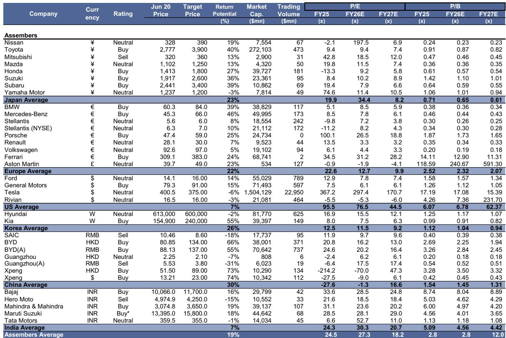
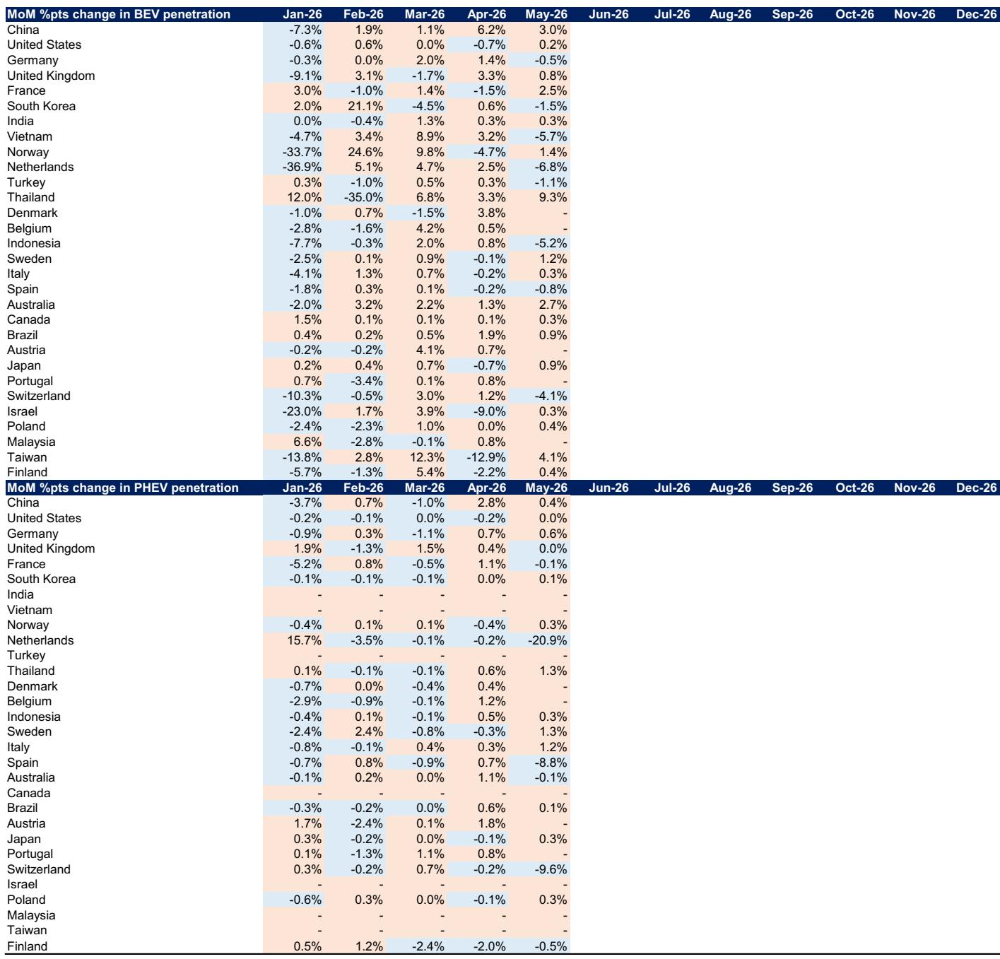
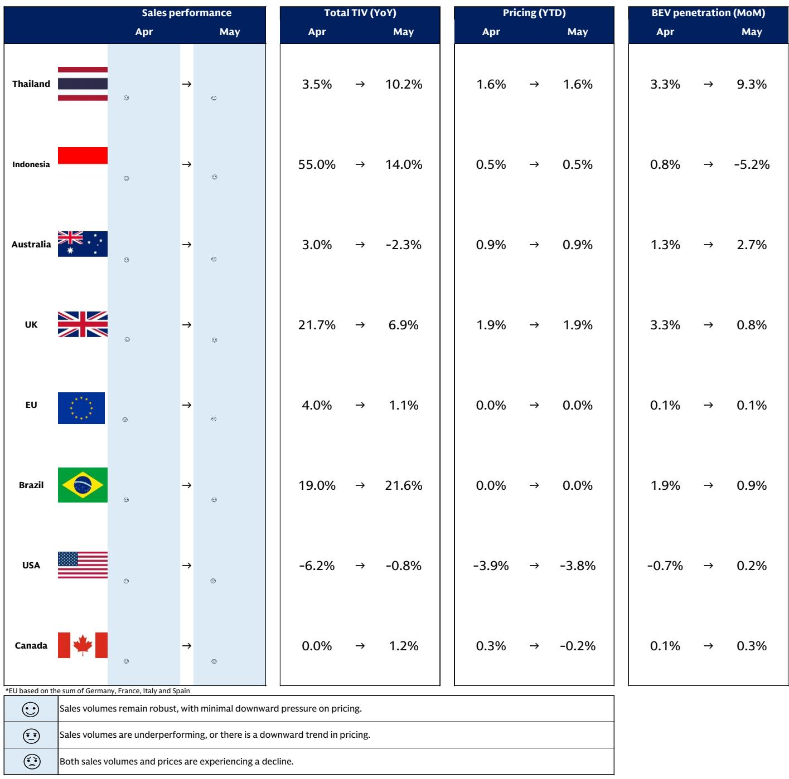

# The Global BEV Market Is Re-Electrifying, But the Real Story Is the Divergence That Will Reshape the Supply Chain

The global electric vehicle narrative has shifted from a slowdown panic to a re-acceleration, but this is not a simple restart of the same trend. Between February and May, the global battery electric vehicle (BEV) sales mix climbed sharply from 13% to 19%, a 6-percentage-point surge that caught many market participants off guard. This is not, however, a uniform recovery across all regions. The headline number masks a critical divergence: China and select emerging markets are driving the rebound, while the United States has actually seen its BEV penetration decline. The controlling insight for strategists is that the re-electrification underway is structurally different from the previous wave, driven less by universal environmental policy and more by acute energy price shocks and shifting cost competitiveness. This creates a fragmented market where the winners and losers will be determined by supply chain localization, not just consumer demand.

Why now matters. The catalyst for this re-acceleration was instability in the Middle East, which drove up gasoline prices and altered consumer calculus in fuel-import-dependent economies. This is a fundamentally different driver than the subsidy-led push of 2021-2023. The implication is that the sustainability of this BEV push is now tied to crude oil prices and geopolitical stability, not just regulatory timelines. As a global investment bank report notes, the commodities team has already lowered WTI forecasts for 2026 through 2028, anticipating normalization of oil exports from the Strait of Hormuz. If crude prices stabilize or decline, the current re-electrification momentum could soften. The strategic question for investors is whether this is a cyclical blip or the beginning of a structural shift in energy mix diversification.

The next layer of complexity involves pricing. During the previous BEV boom, manufacturers engaged in aggressive price wars to capture market share, compressing margins across the industry. The current re-electrification phase is characterized by more moderate pricing behavior. Our proprietary price survey indicates that while prices have declined moderately in the US and Canada, they have stabilized or risen in other regions. This suggests that emerging BEV manufacturers have adopted more conservative pricing strategies, perhaps recognizing that margin destruction is unsustainable. Yet the report also warns that with input costs rising for aluminum, naphtha, and memory, and with a 3-percentage-point year-on-year margin deterioration expected in 2026, no region is currently seeing price hikes sufficient to secure profitability. This creates a tension: volume growth is returning, but the path to sustainable returns remains unclear.

## The Re-Electrification Is Real, But It Is Concentrated in China and Fuel-Import-Dependent Markets, Not in the US

The global BEV mix increase from 13% to 19% is impressive, but the regional breakdown reveals a story of concentration, not breadth. China alone accounted for a 10-percentage-point increase in BEV penetration, while the "other markets" category, including Thailand and Australia, rose by 6 percentage points. Thailand's BEV mix expanded by a staggering 19 percentage points, and Australia saw a 6-point increase. In contrast, the US BEV ratio actually declined by 1 percentage point. Europe overall was up by a modest 2 points, with Germany contributing a 3-point expansion.

The so-what here is that consumer behavior is being shaped by gasoline price sensitivity, not green ideology. In Thailand and Australia, both net fuel importers, rising pump prices directly incentivized BEV adoption. The US, with its relatively lower gasoline price sensitivity and larger vehicle preferences, did not see the same effect. This means that the current BEV wave is geographically narrow and vulnerable to oil price normalization. If crude prices fall as the commodities team forecasts, the re-electrification momentum in these key markets could stall. Investors should not extrapolate the global headline number to assume universal adoption momentum.

## Price Competition Has Moderated, But Margin Pressure Remains Acute and No Region Is Pricing for Profitability

During the re-electrification phase, pricing dynamics have shifted from aggressive discounting to relative stability. In the US and Canada, we observed a moderate decline in sales prices, but in Europe, China, and other markets, prices have stabilized or even risen. This is a meaningful departure from the price war environment of 2024. The report suggests that emerging BEV manufacturers are now pursuing more conservative pricing strategies, likely because they recognize that sustained price cuts are not viable given their cost structures.

However, the moderation in price competition does not mean the industry is healthy. The report flags that aluminum, naphtha, and memory prices are rising, and that a 3-percentage-point year-on-year margin deterioration is expected in 2026. Critically, the report states that "there are currently no regions where price hikes are occurring at a magnitude sufficient to secure profitability." This is a sobering assessment. Volume is recovering, but unit economics are not. The implication is that many BEV manufacturers are still selling vehicles at a loss or at unsustainable margins. The re-electrification is being subsidized by manufacturers' balance sheets, not by end-market pricing power. This cannot persist indefinitely, and it raises the question of which players have the financial stamina to endure this margin squeeze.

## The Rise of Chinese BEVs Is Forcing a Fundamental Restructuring of the Global Automotive Supply Chain

The most consequential strategic development in the report is not the demand data but the supply chain implications. The growing share and cost competitiveness of Chinese BEV manufacturers is triggering defensive reactions from both regulators and traditional automakers. The report highlights two specific developments. First, Europe has begun discussions on the Industrial Accelerator Act (IAA), which would mandate that 70% or more of components, excluding the battery, be procured within the region for BEVs to qualify for purchase subsidies and public procurement. This is a de facto non-tariff barrier against completely built-up (CBU) exports from outside the region, including from Japan and South Korea, not just China. The IAA aims to raise the manufacturing sector's share of GDP to 20% by 2035, from approximately 14.3% in 2024.

Second, traditional automakers, particularly Japanese manufacturers, are actively adopting Chinese parts or Chinese-grade parts into their supply chains. This is a remarkable shift. Japanese automakers, long known for their vertically integrated keiretsu supply networks, are now sourcing from Chinese suppliers to remain cost-competitive. This is not a temporary adjustment; it signals a structural realignment of the global automotive supply chain. The report notes that the IAA could conflict with WTO "national treatment" principles, and that a 70% local content requirement could disrupt existing supply networks and lead to higher vehicle prices. The strategic question for investors is whether this localization push will succeed in protecting European and Japanese manufacturers, or whether it will simply raise costs and reduce competitiveness, ultimately accelerating the shift to Chinese-dominated supply chains.

## The Sustainability of the BEV Shift Hinges on Oil Prices, and the Report Leaves a Critical Analytical Gap for June-July Data

The report explicitly acknowledges a key uncertainty: the sustainability of the re-electrification trend. The commodities team's lowered WTI forecasts for 2026-2028 assume a normalization of oil exports from the Strait of Hormuz. If crude prices stabilize or decline, the current gasoline-price-driven BEV adoption could soften. Conversely, the BEV shift could advance structurally if energy mix diversification becomes a policy priority in response to geopolitical instability. The report positions the global automotive sector at a crossroads, but it does not resolve the question.

What the report does not fully answer is whether the June-July data will confirm or reverse the re-electrification trend. The data presented runs through May, and the report explicitly states that June-July data will be critical for confirming the sustainability of the shift. This is a meaningful analytical gap. Investors are left with a compelling narrative of re-acceleration but without the data to determine if it is durable. The report also does not fully address how the IAA will interact with existing EU countervailing duties on Chinese vehicles. Will the IAA replace or supplement these duties? How will Chinese manufacturers respond? Will they accelerate factory construction in Europe to meet local content requirements, or will they pivot to other markets? These are open questions that the report raises but does not resolve.

## A Decision Framework for Investors: Four Questions to Determine Positioning in the Re-Electrification Cycle

For readers who need to translate this analysis into actionable strategy, the report's insights can be organized into a simple decision framework. Any investor or strategist assessing the global BEV market should ask four questions.

First, what is your view on crude oil prices through 2027? If you believe oil will remain elevated due to geopolitical risk, the re-electrification trend has legs, and you should overweight BEV-exposed names in fuel-import-dependent markets like Thailand, Australia, and parts of Europe. If you believe oil will normalize, the current momentum is cyclical and may fade by the third quarter.

Second, which supply chain are you betting on? The report makes clear that the Chinese supply chain is gaining share and forcing incumbents to adapt. If you believe localization efforts like the IAA will succeed, consider positioning in European and Japanese suppliers who can meet local content requirements. If you believe Chinese cost advantages are insurmountable, the winners will be Chinese manufacturers and their component suppliers, regardless of regulatory barriers.

Third, can the companies you follow sustain margin pressure through 2026? The report indicates that no region is pricing for profitability and that margins will deteriorate by 3 percentage points year-on-year. This means cash burn will be significant. Investors should prioritize companies with strong balance sheets, diversified revenue streams, or captive battery supply chains that can offset some of the input cost inflation.

Fourth, what is the regulatory timeline? The IAA is scheduled for deeper discussions in the second half of 2026, formal adoption in the first half of 2027, and implementation in the second half of 2027. This creates a window of regulatory uncertainty. Companies that can adapt their supply chains quickly will have a first-mover advantage. Those that wait may find themselves locked out of European subsidies.

## The Full Report Contains the Original Charts and Granular Data That This Analysis Only Begins to Unpack

The data presented here is drawn from a comprehensive global investment bank report that includes detailed exhibits on BEV and PHEV sales momentum by region, pricing sentiment maps, and month-on-month penetration changes across 30 markets. The original charts show the exact trajectory of the re-electrification in China, Thailand, Australia, and Brazil, as well as the stagnation in the US. They also include the proprietary sentiment map that tracks sales performance, total TIV, pricing, and BEV penetration across eight key markets. These visuals are essential for any serious investor trying to calibrate their regional exposure.

The report also contains the full analysis of the IAA, including its legislative timeline, its potential conflict with WTO rules, and its implications for Japanese and Korean manufacturers. The second-order effects on parts procurement strategies, particularly the shift by Japanese automakers toward Chinese-grade components, are explored in greater depth than can be summarized here. For investors who need to understand the full landscape of supply chain risk and opportunity, the original charts and data are indispensable.

Join the community to read the full report and review the original charts.

*This article is for learning and discussion only and does not constitute investment advice.*

Personal reading notes and learning share only. Not investment advice.

