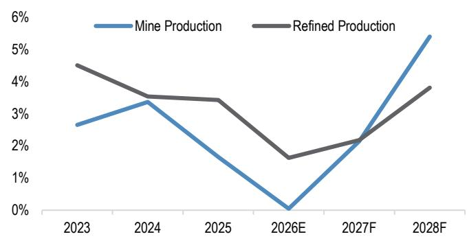
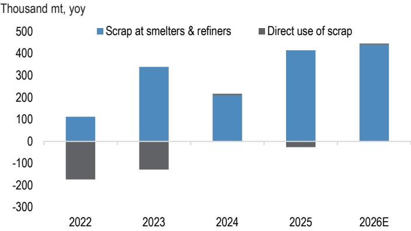
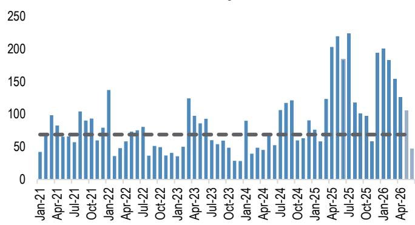
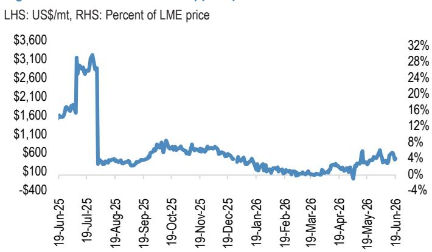
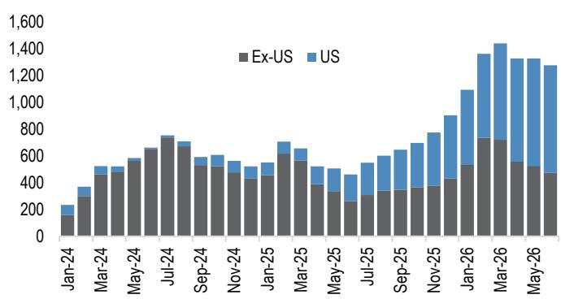
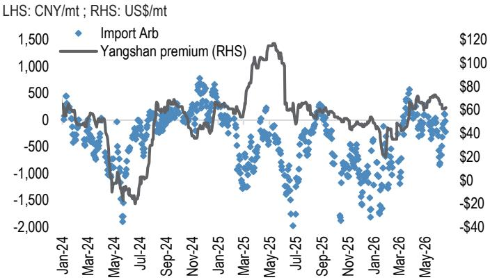
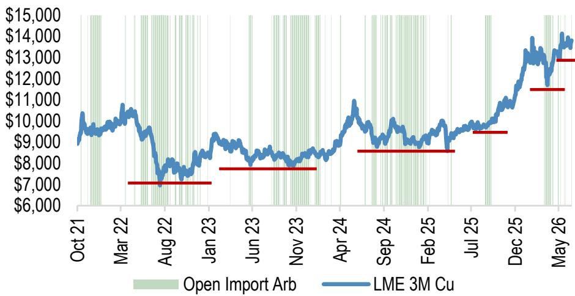
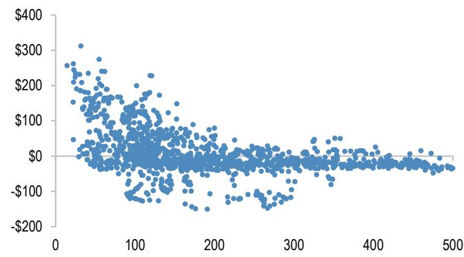

## Copper

Where we're going, we don't need balances

\- With tight mine supply and structurally supported demand, the medium-term environment for copper prices remains supportive. However, at \~\$13,600/mt, up by more than 40% yoy in a surplus global refined market backdrop, it is hard to argue that copper prices look cheap.

\- The key 2H26 catalyst is policy, not balances: the structure/communication following the US review of Section 232 copper tariffs.

\- The market is effectively in a US–China tug of war for copper. The US has been pulling metal via an attractive COMEX/LME arb since early 2025, tightening the ex-US market and reducing China’s historical role as the marginal price setter.

\- Amid this competition, China's buying floor has shifted materially higher. Despite episodic buyer strikes/exports causing volatility, concentrate constraints and the US import pull on copper has forced China to tolerate significantly higher prices to meet overall import needs.

\- We believe the Trump administration will pursue a phased, escalating tariff on refined copper cathode imports following the upcoming review to 1) ensure all the copper that has already been imported into the US stays onshore and 2) keep this excess US inventory as a critical reserve, rather than enact policy which incentivizes it to quickly destock in the coming years.

\- Escalation is everything: For LME copper prices, the most important flip point between a bullish and bearish outcome is how any communication shapes expectations around the future rate of tariffs on refined copper cathode.

\- Escalation equals an incentive to still import copper into the US before tariffs come into force or increase, which is bullish as this US pull on metal continues and China is forced to react. No expectations of escalation, even if an outright tariff is immediately announced, is bearish for LME prices as it will result in a closed US import arb window and a long de-stocking period in the US, giving China its pricing power back.

\- As we see this tug of war continuing, we expect copper prices will likely persistently see higher floors and higher ceilings on a push towards \$15,000/mt over the coming quarters, with risks still skewed towards reaching a very bullish pinch point driven by rapidly dwindling ex-US inventories.

## Global Commodities Research

Gregory C. Shearer
(44-20) 7134-8161
gregory.c.shearer@JPM.com
JPM Securities plc

Ali A. Ibrahim

(44-20) 3493-6438

ali.ibrahim@JPM.com

JPM Securities plc

Ananyashree Gupta
(91-22) 6157 3627
ananyashree.gupta@jpmchase.com
JPM India Private Limited

## Where we're going, we don't need balances

A supportive backdrop, but copper also isn't exactly cheap. The medium-term environment for copper prices remains supportive. Continued tight copper mine supply

— ongoing weak production from Codelco, slower ramp up schedules at disrupted Kamoa Kakula and Grasberg—and structurally supported demand trends around electrification, which tie into insatiable investor appetite to participate in the data center capex megatrend, have not changed. Add in a global industrial upturn that our economists believe has further room to run as destructive energy price and inflation tail risks recede and stronger expected growth momentum in China in 2H26, aided in part by further fiscal support, and the investment narrative in copper looks solid, even with the threat of Fed hikes later this year. Yet, at \~\$13,600/mt, up by more than 40% yoy in a surplus global refined market backdrop, it is hard to argue that copper prices look cheap or aren't already pricing a lot of this good news in.

The structure of the US copper tariffs is the next major catalyst to unlock a push towards \$15,000/mt. So why then, after closely tracking our 2Q26 forecasts, do we remain bullish and now see copper prices continuing to push higher towards \$15,000/mt over the coming quarters (Figure 1)? In short, our expectations around US tariffs on copper cathode imports. In our view, the biggest single catalyst for copper fundamentals and pricing over 2H26 will be the results and actions following the US review of Section 232 copper tariffs. Since April, we have been flagging our view that the Trump administration will pursue a phased, escalating tariff on refined copper cathode imports following the upcoming review. The US’s almost relentless pull on copper from the rest of the world since early 2025 has been a material component to copper’s rise in the last year and we don’t think it's over as we expect the US to structure tariffs and their communication in a way that keeps the COMEX/LME arb open and attractive for continued imports. As we detail further below, despite global oversupply, this has left the rest of world copper market much tighter and has wrenched ultimate price-setting power away from China, the dominant consumer. While Chinese buyer strikes and opportunistic exports at higher prices haven't fully gone away and will still drive volatility, this arb tug of war between the US and China, which we think will continue, is a market where copper prices will likely persistently see higher floors and higher ceilings, and still risks reaching a very bullish pinch point in the coming quarters driven by rapidly dwindling ex-US inventories.

Figure 1: JPM copper price forecasts  
LME cash in US\$ per metric tonne, quarterly and annual averages

<table><tr><td colspan="2"></td><td>4Q2025A</td><td>2025A</td><td>1Q2026A</td><td>2Q2026</td><td>3Q2026</td><td>4Q2026</td><td>2026</td><td>1Q2027</td><td>2Q2027</td><td>3Q2027</td><td>4Q2027</td><td>2027</td></tr><tr><td rowspan="3">Copper</td><td>New</td><td>11,105</td><td>9,947</td><td>12,824</td><td>13,415</td><td>14,500</td><td>14,800</td><td>13,885</td><td>14,000</td><td>13,800</td><td>13,800</td><td>13,600</td><td>13,800</td></tr><tr><td>Old (Feb 2026)</td><td>11,105</td><td>9,947</td><td>12,875</td><td>13,500</td><td>13,000</td><td>12,500</td><td>12,969</td><td>11,800</td><td>11,600</td><td>11,600</td><td>11,500</td><td>11,625</td></tr><tr><td>Change</td><td>0%</td><td>0%</td><td>0%</td><td>-1%</td><td>12%</td><td>18%</td><td>7%</td><td>19%</td><td>19%</td><td>19%</td><td>18%</td><td>19%</td></tr></table>

Source: JPM Commodities Research

## Global S&D balances don't really matter in copper tug of war

Many of our regular balance updates drill deep into our outlook and assumptions for copper supply and demand. This one won't. Given the uncertainty around future tariffs, the persistently open US import arb window for copper cathode and the accompanying material pull of metal into the US means that the global picture of the copper supply and demand balance has significantly lost its pricing power, for now. To this end, our latest balance now shows a refined market surplus of over 500 kmt in 2025, yet LME copper prices were up by 42% on the year. Looking to this year, despite mine supply remaining very tight (this is still very important), our global refined balance has swung to a surplus of around 360 kmt. A slight decrease in our demand growth estimates (+2.2% yoy in '26) loosens things somewhat, but most of this swing comes from another sharp boost to our assumptions of scrap volumes flowing into the supply chain at smelters and refiners, mainly in China, which leaves global refined production growing by +1.6% yoy in 2026 despite flat mine supply growth (Figure 2 & Figure 3). While a tightening in tax invoice regulations disrupted Chinese scrap supply in the last quarter, we largely see this as a bottleneck which will eventually ease, rather than a structural sea change which will diminish available scrap over the long-term.

Figure 2: Global copper mine supply and refined production growth
Percent change, yoy  
  
Source: Company Reports, Government and Industry data, CRU, Wood Mackenzie, BGRIMM, JPM Commodities Research

Figure 3: Global copper scrap usage growth  
  
Source: CRU, BGRIMM, JPM Commodities Research

In summary, despite continued tight concentrate markets, Chinese refined production continues to refuse to yield, utilizing any and all available copper units to maintain output and ultimately leaving the global refined copper market well supplied. For a real life sense check, the US importing another nearly 400 kmt YTD above its implied needs (after 870 kmt of excess imports last year), demonstrably shows we are not in a deficit global refined copper market in our view. The thing is, for as long as the U.S. continues to vacuum up excess copper from the rest of the world, this global oversupply is somewhat irrelevant, as the ex-US refined copper market will remain tight, leaving LME copper prices caught in the middle of a tug of war between the US and China for copper.

## As the US vacuums up copper, China has had to react too

The US has built a $\sim 1.2$ mmt stockpile in 18 months. Since the door was opened for potential refined copper tariffs in early 2025 (and was left open last summer), US monthly refined unwrought copper imports have averaged around $140\mathrm{kmt}$ (Jan 2025-May 2026), nearly double the $75\mathrm{kmt}$ a month average in 2024 (Figure 4 & Figure 5). Adding in estimates for US refined copper supply and demand, excess US imports of copper likely amounted to close to 870 kmt last year. And it has continued so far this year, with estimates through May pointing to nearly an additional 400 kmt excess build YTD. To put this in more general context, actual US refined copper demand is about 6% of global, but in the last year and a half it has been pulling on the market like it's an importer consuming closer to 9% of global demand, a very big shift.

Figure 4: Monthly US refined copper imports
Thousand mt, dashed line is 2021-2024 average  
  
Note: 01 May - 16 Jun 2026 estimated based on bill of lading data.
Source: US Census Bureau, IHS Markit, Bloomberg Finance L.P., JPM Commodities Research

Figure 5: Jul'26 COMEX/LME copper spread
LHS: US\$/mt, RHS: Percent of LME price  
  
Source: Bloomberg Finance L.P.

This US pull on metal has driven China to alter its behavior too. To be clear, the US is importing more copper because price differentials, embedding the potential for tariffs, are incentivizing it, not because it is consuming all this extra metal. But this diversion of copper and dislocation in global inventory has nonetheless driven serious ripple effects (Figure 6). On the other end of the rope in this game of tug of war is China. Given the tightness in global concentrate supply, which limits China's ability (even with greater scrap use) to fully ramp up all its planned smelter/refined supply, China still needs to import serious amounts of copper cathode to feed its own domestic demand, and these imports need to be attracted by an open SHFE/LME import arb. Our balances, which assume around 13.3 mmt of Chinese refined supply (+3.3% yoy) this year and 15.9 mmt of Chinese refined demand (+2.5%), show a net import cathode requirement of around 2.6 mmt in 2026 (this is where balances still do matter quite a lot).

Figure 6: Global visible copper inventories by location
Thousand mt  
  
Includes LME (+ off warrant), COMEX, SHFE, Chinese bonded stocks
Source: CRU, LME, SHFE, COMEX. Includes Chinese bonded stocks in Shanghai, Guangdong and Qingdao. As of 19 $^{th}$ June 2026, LME off-warrant as of 16 $^{th}$ June 2026.

Figure 7: Chinese spot copper import arbitrage and onshore spot premium/discount  
  
Source: SMM, Bloomberg Finance L.P., JPM Commodities Research. \*Arb as of 8:00 AM London.

Before this huge pull into the US emerged, China was the behemoth in the seaborne copper market, making it the ultimate marginal price setter. If prices got too high, Chinese buying would slow (e.g. buyer's strike), closing or even reversing the SHFE/LME import arb (Figure 7). China would then wait for the fever to break and re-engage again after prices had pulled back materially. We can see classic examples of this back when prices pushed up towards \$11,000/mt in early 2022 and mid-2024 (Figure 8). However, the combined pressure from concentrate constraints and boosted US imports have diminished China's price-setting ability, leading to a sharp push higher in Chinese buying floors as China looks to secure its required imports. To be clear, China's influence is far from dead, but they have had to be willing to accept materially higher prices recently.

Figure 8: China's buying floor has moved sharply higher in the last year LME 3M Copper prices (US\$/mt) vs an open Chinese spot copper import arb window  
  
Source: LME, Bloomberg Finance L.P., JPM Commodities Research. \*Arb as of 8:00 AM London.

Case in point, Chinese purchasing went ice cold (buyer's strike, boosted copper cathode exports to the LME) over late 2025 and early 2026 as copper prices first ran up to \$14,000/mt. Come March, a war-driven wobble in risk sentiment drove a correction lower in copper prices. Yet as soon as we approached a still lofty \$12,500/mt China's import arb window jerked open and inventory draws sharply accelerated. This marked more than a \$2,000-3,000/mt jump higher in China's buying floor (Figure 8). And it's continued to creep even higher recently, with the arb window fluttering open on dips to \$13,500/mt.

## US tariffs: Escalation is everything for LME prices

By June 30, 2026 the US Commerce Secretary is to provide President Trump with an update on domestic copper markets so that the President can assess whether additional Section 232 tariff modifications are necessary. More specifically, in the June 30, 2025 report, the Commerce Secretary already recommended “imposing a phased universal import duty on refined copper of 15 percent starting on January 1, 2027, and 30 percent starting on January 1, 2028.” This was not implemented last year but is up for review now.

While high conviction in tariff-related decision-making is admittedly hard to come by, our base case remains that the Trump administration will in fact move forward with enacting a phased tariff approach. Why? Now that the US has likely built more than 1 mmt stockpile of refined copper in the last 18 months and the groundwork for Project Vault has been laid out, we think the administration will tailor a strategic tariff policy on refined copper to accomplish two goals: 1) ensure all the copper that has already been imported into the US stays onshore and 2) keep this excess US inventory as a critical reserve, rather than enact policy which incentivizes it to quickly destock in the coming years. Hence, in our view, the simplest way to ensure both is to follow through by enacting an escalating tariff. Once enacted, the tariff rate sets a very high bar for ex-US prices to incentivize any onshore copper to leave while the escalatory nature of tariffs keeps attracting imports to the US, disincentivizing a destock of inventory already in the US and allowing the government to generate tariff income on these imports. With 50% tariffs already in place on downstream semi-finished copper products, the administration also has some runway for this escalation on copper cathode imports to progress.

Escalation is everything. There are countless iterations of what might be announced, if anything... there is no requirement or specified timeline for a response from President Trump. For LME copper prices, the most important flip point between a bullish and bearish outcome is how any communication shapes (whether formally or informally) expectations around the future rate of tariffs on refined copper cathode. Escalation equals an incentive to still import copper into the US before tariffs come into force or increase, which is bullish as this US pull on metal continues and China is forced to react. No expectations of escalation, even if an outright tariff is immediately announced (e.g. an immediate jump to 50% tariffs on cathode), is bearish for LME prices as it will result in a closed US import arb window and a long de-stocking period in the US. Current implied US inventory of \~1.2 mmt would cover almost 20 months of average 2024 imports. With the US out of the import market, the tug of war pressure is off China and they regain pricing power and are unlikely to re-engage fully until prices are much lower, say \$10,000-\$11,000/mt or below.

Very bullish pinch point risks could return into focus under a forward-starting, escalatory tariff. With our expectation being that the US wants to protect this copper stockpile (not have it disappear via destocking over the next two years), we think any communication will at least re-enforce the threat of future tariffs, even if they are not formally enacted yet. But even within this “escalatory” branch of potential outcomes, there can be differences.

\- A forward-starting, escalatory tariff regime is the most bullish outcome for LME prices as there could be another immense rush to get copper to the US in the coming months ahead of the start date. Even with \~50% of LME copper stocks being of Chinese origin, which won’t go directly to the US, this metal could still quickly be drawn as swap agreements are struck to free up as much US-deliverable metal as possible to divert to the US ahead of the tariff. Under this scenario, as LME inventory likely draws dramatically, we think the risk is skewed towards an overshoot of our already bullish forecasts in 2H26 ahead of the tariff start as LME curve structure likely punches into a sharp backwardation (Figure 9 & Figure 10) (See Metals Weekly: Copper—It’s only the end of the beginning, 04 Dec 2025). Volatility will remain though as opportunistic Chinese exports likely ramp up again to deliver into this backwardation. However, this isn't a long-term solution, just a give and take cycle, as China still remains structurally net short copper cathode.

Moreover, there remains the risk that Chinese policy makers impose more stringent restrictions on copper exports if they start to become more concerned about supply security.

\- Other “escalatory” regimes likely still keep the tug of war ongoing. Given the risk of market disruption, the administration might elect keep the escalation component but start tariffs more immediately (immediate 15% tariff accompanied by either a future escalatory review or scheduled tariff increase). Or they may ultimately decide they can just continue to prolong a period of ambiguity and accomplish their goals (no announced tariff but another review period with the likelihood of a future tariff). These other “escalatory” scenarios, while not as punchily bullish, would nonetheless likely keep this tug of war for copper ongoing (like it has this year). And as long as the COMEX/LME arb remains open, we see the potential for copper prices to continually push towards higher floors and higher ceilings in the coming months and quarters ahead.

Thousand metric tonnes  
Figure 9: LME on-warrant copper stocks vs LME cash-3M spread, weekly  
X-axis: Thousand mt, Y-axis: US\$/mt (+ = backwardation / - = contango)  
  
Data since 2000, x-axis truncated to 500 kmt  
Source: LME, Bloomberg Finance L.P., JPM Commodities Research

Figure 10: Weekly returns of LME 3M copper prices under different LME on-warrant inventory environments

<table><tr><td>On-warrant LME inventory of...</td><td></td><td>Positive Hit Rate</td><td>Average Weekly Return</td><td>Median Weekly Return</td></tr><tr><td rowspan="3">100 kmt or less and...</td><td>Decreasing WoW</td><td>63%</td><td>0.96%</td><td>1.09%</td></tr><tr><td>Increasing WoW</td><td>50%</td><td>0.14%</td><td>0.01%</td></tr><tr><td>Either</td><td>57%</td><td>0.56%</td><td>0.64%</td></tr><tr><td rowspan="3">Greater than 100 kmt and...</td><td>Decreasing WoW</td><td>58%</td><td>0.60%</td><td>0.37%</td></tr><tr><td>Increasing WoW</td><td>46%</td><td>-0.41%</td><td>-0.41%</td></tr><tr><td>Either</td><td>52%</td><td>0.10%</td><td>0.01%</td></tr></table>

Weekly data since 2000  
Source: LME, Bloomberg Finance L.P., JPM Commodities Research

Figure 11: Copper supply and demand balance

<table><tr><td></td><td>2017</td><td>2018</td><td>2019</td><td>2020</td><td>2021</td><td>2022</td><td>2023</td><td>2024</td><td>2025</td><td>2026E</td><td>2027F</td><td>2028F</td></tr><tr><td>Mine Production growth</td><td>20,090-0.4%</td><td>20,8894.0%</td><td>20,8810.0%</td><td>20,9580.4%</td><td>21,3912.1%</td><td>22,0673.2%</td><td>22,6532.7%</td><td>23,4153.4%</td><td>23,8031.7%</td><td>23,8140.0%</td><td>24,3252.1%</td><td>25,6395.4%</td></tr><tr><td>Refined Production growth</td><td>22,6741.0%</td><td>23,4153.3%</td><td>23,4480.1%</td><td>23,5080.3%</td><td>24,2733.3%</td><td>24,5341.1%</td><td>25,6404.5%</td><td>26,5473.5%</td><td>27,4563.4%</td><td>27,9031.6%</td><td>28,5122.2%</td><td>29,5983.8%</td></tr><tr><td>Refined Use growth</td><td>22,7632.8%</td><td>23,5483.4%</td><td>23,5530.0%</td><td>22,954-2.5%</td><td>24,3716.2%</td><td>24,6991.3%</td><td>25,2872.4%</td><td>26,1893.6%</td><td>26,9442.9%</td><td>27,5452.2%</td><td>28,3813.0%</td><td>29,2583.1%</td></tr><tr><td>Balance</td><td>-90</td><td>-133</td><td>-105</td><td>554</td><td>-98</td><td>-165</td><td>353</td><td>358</td><td>512</td><td>359</td><td>132</td><td>341</td></tr><tr><td>Balance adjusted for governmental purchases/sales</td><td>-90</td><td>-133</td><td>-105</td><td>-46</td><td>12</td><td>-165</td><td>353</td><td>358</td><td>512</td><td>359</td><td>132</td><td>341</td></tr></table>

Source: Company Reports, Government and Industry data, CRU, Wood Mackenzie, BGRIMM, JPM Commodities Research

Thousand metric tonnes

Figure 12: Copper supply and demand balance by region

<table><tr><td>Mine Production</td><td>2017</td><td>2018</td><td>2019</td><td>2020</td><td>2021</td><td>2022</td><td>2023</td><td>2024</td><td>2025</td><td>2026E</td><td>2027F</td><td>2028F</td></tr><tr><td>Asia</td><td>3,006</td><td>3,208</td><td>2,956</td><td>3,069</td><td>3,185</td><td>3,390</td><td>3,387</td><td>3,707</td><td>3,432</td><td>3,560</td><td>3,960</td><td>4,272</td></tr><tr><td>China</td><td>1,531</td><td>1,616</td><td>1,691</td><td>1,709</td><td>1,829</td><td>1,886</td><td>1,850</td><td>1,966</td><td>1,996</td><td>2,096</td><td>2,187</td><td>2,294</td></tr><tr><td>North America</td><td>2,635</td><td>2,513</td><td>2,611</td><td>2,493</td><td>2,468</td><td>2,412</td><td>2,308</td><td>2,257</td><td>2,397</td><td>2,384</td><td>2,444</td><td>2,427</td></tr><tr><td>Central &amp; South America</td><td>8,349</td><td>8,619</td><td>8,764</td><td>8,493</td><td>8,686</td><td>8,627</td><td>8,900</td><td>8,852</td><td>8,791</td><td>8,641</td><td>8,982</td><td>9,514</td></tr><tr><td>Europe</td><td>1,106</td><td>1,061</td><td>1,016</td><td>1,039</td><td>1,056</td><td>1,105</td><td>1,087</td><td>1,103</td><td>1,076</td><td>1,207</td><td>1,257</td><td>1,296</td></tr><tr><td>Eurasia</td><td>1,663</td><td>1,768</td><td>1,856</td><td>1,880</td><td>1,799</td><td>1,889</td><td>1,966</td><td>2,040</td><td>2,272</td><td>2,467</td><td>2,572</td><td>2,724</td></tr><tr><td>Middle East</td><td>341</td><td>379</td><td>379</td><td>373</td><td>408</td><td>415</td><td>423</td><td>444</td><td>513</td><td>545</td><td>601</td><td>640</td></tr><tr><td>Africa</td><td>2,128</td><td>2,429</td><td>2,440</td><td>2,708</td><td>2,950</td><td>3,394</td><td>3,776</td><td>4,211</td><td>4,586</td><td>4,881</td><td>5,292</td><td>5,745</td></tr><tr><td>Oceania</td><td>862</td><td>913</td><td>858</td><td>905</td><td>839</td><td>836</td><td>807</td><td>801</td><td>735</td><td>751</td><td>769</td><td>890</td></tr><tr><td>Mine Production</td><td>20,090</td><td>20,889</td><td>20,881</td><td>20,958</td><td>21,391</td><td>22,067</td><td>22,653</td><td>23,415</td><td>23,803</td><td>24,438</td><td>25,878</td><td>27,509</td></tr><tr><td>Refined Use</td><td>2017</td><td>2018</td><td>2019</td><td>2020</td><td>2021</td><td>2022</td><td>2023</td><td>2024</td><td>2025</td><td>2026E</td><td>2027F</td><td>2028F</td></tr><tr><td>Asia</td><td>15,287</td><td>15,907</td><td>16,206</td><td>16,137</td><td>17,005</td><td>17,377</td><td>18,179</td><td>18,948</td><td>19,676</td><td>20,183</td><td>20,800</td><td>21,411</td></tr><tr><td>China</td><td>11,194</td><td>11,873</td><td>12,209</td><td>12,556</td><td>13,207</td><td>13,468</td><td>14,293</td><td>14,938</td><td>15,533</td><td>15,913</td><td>16,375</td><td>16,833</td></tr><tr><td>North America</td><td>2,182</td><td>2,253</td><td>2,260</td><td>2,076</td><td>2,219</td><td>2,224</td><td>2,132</td><td>2,200</td><td>2,188</td><td>2,264</td><td>2,361</td><td>2,459</td></tr><tr><td>Central &amp; South America</td><td>429</td><td>436</td><td>453</td><td>389</td><td>431</td><td>404</td><td>393</td><td>400</td><td>400</td><td>404</td><td>414</td><td>423</td></tr><tr><td>Europe</td><td>3,500</td><td>3,561</td><td>3,298</td><td>3,123</td><td>3,405</td><td>3,422</td><td>3,293</td><td>3,301</td><td>3,331</td><td>3,363</td><td>3,442</td><td>3,560</td></tr><tr><td>Eurasia</td><td>394</td><td>396</td><td>377</td><td>361</td><td>402</td><td>343</td><td>362</td><td>365</td><td>360</td><td>356</td><td>353</td><td>354</td></tr><tr><td>Middle East</td><td>767</td><td>796</td><td>780</td><td>719</td><td>734</td><td>760</td><td>748</td><td>794</td><td>810</td><td>795</td><td>831</td><td>868</td></tr><tr><td>Africa</td><td>185</td><td>181</td><td>164</td><td>137</td><td>164</td><td>158</td><td>168</td><td>169</td><td>167</td><td>167</td><td>169</td><td>170</td></tr><tr><td>Oceania</td><td>19</td><td>19</td><td>15</td><td>11</td><td>11</td><td>12</td><td>12</td><td>12</td><td>12</td><td>12</td><td>12</td><td>12</td></tr><tr><td>Refined Use</td><td>22,763</td><td>23,548</td><td>23,553</td><td>22,954</td><td>24,371</td><td>24,699</td><td>25,287</td><td>26,189</td><td>26,944</td><td>27,545</td><td>28,381</td><td>29,258</td></tr><tr><td>Global Balance</td><td>2017</td><td>2018</td><td>2019</td><td>2020</td><td>2021</td><td>2022</td><td>2023</td><td>2024</td><td>2025</td><td>2026E</td><td>2027F</td><td>2028F</td></tr><tr><td>Refined Production</td><td>22,674</td><td>23,415</td><td>23,448</td><td>23,508</td><td>24,273</td><td>24,534</td><td>25,640</td><td>26,547</td><td>27,456</td><td>27,903</td><td>28,512</td><td>29,598</td></tr><tr><td>Refined Use</td><td>22,763</td><td>23,548</td><td>23,553</td><td>22,954</td><td>24,371</td><td>24,699</td><td>25,287</td><td>26,189</td><td>26,944</td><td>27,545</td><td>28,381</td><td>29,258</td></tr><tr><td>Balance</td><td>-90</td><td>-133</td><td>-105</td><td>554</td><td>-98</td><td>-165</td><td>353</td><td>358</td><td>512</td><td>359</td><td>132</td><td>341</td></tr><tr><td>Balance adjusted for governmental purchases/sales</td><td>-90</td><td>-133</td><td>-105</td><td>-46</td><td>12</td><td>-165</td><td>353</td><td>358</td><td>512</td><td>359</td><td>132</td><td>341</td></tr></table>

Source: Company Reports, Government and Industry data, CRU, Wood Mackenzie, BGRIMM, JPM Commodities Research

## JPM metals price forecasts

Quarterly and annual averages

<table><tr><td></td><td>4Q25A</td><td>1Q26A</td><td>2Q26</td><td>3Q26</td><td>4Q26</td><td>1Q27</td><td>2Q27</td><td>3Q27</td><td>4Q27</td><td>2025</td><td>2026</td><td>2027</td></tr><tr><td colspan="13">Base Metals</td></tr><tr><td>Aluminum</td><td>2,828</td><td>3,198</td><td>3,650</td><td>3,800</td><td>3,700</td><td>3,450</td><td>3,200</td><td>2,900</td><td>2,750</td><td>2,631</td><td>3,587</td><td>3,075</td></tr><tr><td>Copper</td><td>11,105</td><td>12,824</td><td>13,415</td><td>14,500</td><td>14,800</td><td>14,000</td><td>13,800</td><td>13,800</td><td>13,600</td><td>9,947</td><td>13,885</td><td>13,800</td></tr><tr><td>Nickel</td><td>14,892</td><td>17,338</td><td>17,500</td><td>17,000</td><td>17,250</td><td>17,500</td><td>18,000</td><td>18,000</td><td>17,500</td><td>15,164</td><td>17,272</td><td>17,750</td></tr><tr><td>Zinc</td><td>3,165</td><td>3,237</td><td>3,420</td><td>3,500</td><td>3,400</td><td>3,300</td><td>3,200</td><td>3,050</td><td>3,000</td><td>2,867</td><td>3,389</td><td>3,138</td></tr><tr><td colspan="13">Precious Metals</td></tr><tr><td>Gold</td><td>4,152</td><td>4,873</td><td>4,800</td><td>5,300</td><td>6,000</td><td>6,200</td><td>6,250</td><td>6,300</td><td>6,300</td><td>3,440</td><td>5,243</td><td>6,263</td></tr><tr><td>Silver</td><td>55.2</td><td>83.7</td><td>78.5</td><td>85.0</td><td>90.0</td><td>88.0</td><td>87.0</td><td>85.0</td><td>83.0</td><td>40.1</td><td>84.3</td><td>85.8</td></tr><tr><td>Platinum</td><td>1,694</td><td>2,204</td><td>2,050</td><td>2,250</td><td>2,400</td><td>2,450</td><td>2,400</td><td>2,300</td><td>2,250</td><td>1,282</td><td>2,226</td><td>2,350</td></tr><tr><td>Palladium</td><td>1,478</td><td>1,706</td><td>1,490</td><td>1,550</td><td>1,600</td><td>1,550</td><td>1,500</td><td>1,450</td><td>1,400</td><td>1,151</td><td>1,586</td><td>1,475</td></tr></table>

Source: JPM Commodities Research. \*Base metals are LME cash and precious metals are spot.

## Disclosures

## History of Investment Recommendations:

A history of JPM investment recommendations disseminated during the preceding 12 months can be accessed on the Research & Commentary page of http://www.JPMmarkets.com where you can also search by analyst name, sector or financial instrument.

Analysts' Compensation: The research analysts responsible for the preparation of this report receive compensation based upon various factors, including the quality and accuracy of research, client feedback, competitive factors, and overall firm revenues.

Company-Specific Disclosures: Important disclosures, including price charts and credit opinion history tables (if applicable), are available for compendium reports and all JPM-covered companies, and certain non-covered companies, by visiting https://www.jpmm.com/research/disclosures, calling 1-800-477-0406, or e-mailing research.disclosure.inquiries@JPM.com with your request.

## Other Disclosures

JPM is a marketing name for investment banking businesses of JPM Chase & Co. and its subsidiaries and affiliates worldwide.

UK MIFID FICC research unbundling exemption: UK clients should refer to UK MIFID Research Unbundling exemption for details of JPM's implementation of the FICC research exemption and guidance on relevant FICC research categorisation.

JPM may, from time to time, write on issuers or securities targeted by economic or financial sanctions imposed or administered by the governmental authorities of the U.S., EU, UK or other relevant jurisdictions (Sanctioned Securities). Nothing in this report is intended to be read or construed as encouraging, facilitating, promoting or otherwise approving investment or dealing in such Sanctioned Securities. Clients should be aware of their own legal and compliance obligations when making investment decisions.

Any digital or crypto assets discussed in this research report are subject to a rapidly changing regulatory landscape. For relevant regulatory advisories on crypto assets, including bitcoin and ether, please see https://www.JPM.com/disclosures/cryptoasset-disclosure.

The author(s) of this research report may not be licensed to carry on regulated activities in your jurisdiction and, if not licensed, do not hold themselves out as being able to do so.

Exchange-Traded Funds (ETFs): JPM Securities LLC (“JPMS”) acts as authorized participant for substantially all U.S.-listed ETFs. To the extent that any ETFs are mentioned in this report, JPMS may earn commissions and transaction-based compensation in connection with the distribution of those ETF shares and may earn fees for performing other trade-related services, such as securities lending to short sellers of the ETF shares. JPMS may also perform services for the ETFs themselves, including acting as a broker or dealer to the ETFs. In addition, affiliates of JPMS may perform services for the ETFs, including trust, custodial, administration, lending, index calculation and/or maintenance and other services.

Options and Futures related research: If the information contained herein regards options- or futures-related research, such information is available only to persons who have received the proper options or futures risk disclosure documents. Please contact your JPM Representative or visit https://www.theocc.com/components/docs/riskstoc.pdf for a copy of the Option Clearing Corporation's Characteristics and Risks of Standardized Options or

https://www.finra.org/sites/default/files/2020-08/Security\_Futures\_Risk\_Disclosure\_Statement\_2020.pdf for a copy of the Security Futures Risk Disclosure Statement.

Changes to Interbank Offered Rates (IBORs) and other benchmark rates: Certain interest rate benchmarks are, or may in the future become, subject to ongoing international, national and other regulatory guidance, reform and proposals for reform. For more information, please consult: https://www.JPM.com/global/disclosures/interbank\_offered\_rates

Private Bank Clients: Where you are receiving research as a client of the private banking businesses offered by JPM Chase & Co. and its subsidiaries (“JPM Private Bank”), research is provided to you by JPM Private Bank and not by any other division of JPM, including, but not limited to, the JPM Corporate and Investment Bank and its Global Research division.

Legal entity responsible for the production and distribution of research: The legal entity identified below the name of the Reg AC Research Analyst who authored this material is the legal entity responsible for the production of this research. Where multiple Reg AC Research Analysts authored this material with different legal entities identified below their names, these legal entities are jointly responsible for the production of this research. Where more than one legal entity is listed under an analyst's name, the first legal entity is responsible for the production unless stated otherwise. Research Analysts from various JPM affiliates may have contributed to the production of this material but may not be licensed to carry out regulated activities in your jurisdiction (and do not hold themselves out as being able to do so). Unless otherwise stated below in the legal entity disclosures, this material has been distributed by the legal entity responsible for production, or where more than one legal entity is listed under the analyst's name, the first legal entity will be responsible for distribution. If you have any queries, please contact the relevant Research Analyst in your jurisdiction or the entity in your jurisdiction that has distributed this research material.

Legal Entities Disclosures and Country-/Region-Specific Disclosures:

Argentina: JPM Chase Bank N.A Sucursal Buenos Aires is regulated by Banco Central de la República Argentina (“BCRA”- Central Bank of Argentina) and Comisión Nacional de Valores (“CNV”- Argentinian Securities Commission - ALYC y AN Integral N°51).

Australia: JPM Securities Australia Limited (“JPMSAL”) (ABN 61 003 245 234/AFS Licence No: 238066) is regulated by the Australian Securities and Investments Commission and is a Market Participant of ASX Limited, a Clearing and Settlement Participant of ASX Clear Pty Limited and a Clearing Participant of ASX Clear (Futures) Pty Limited. This material is issued and distributed in Australia by or on behalf of JPMSAL only to "wholesale clients" (as defined in section 761G of the Corporations Act 2001). A list of all financial products covered can be found by visiting https://www.jpmm.com/research/disclosures. JPM seeks to cover companies of relevance to the domestic and international investor base across all Global Industry Classification Standard (GICS) sectors, as well as across a range of market capitalisation sizes. If applicable, in the course of conducting public side due diligence on the subject company(ies), the Research Analyst team may at times perform such diligence through corporate engagements such as site visits, discussions with company representatives, management presentations, etc. Research issued by JPMSAL has been prepared in accordance with JPM Australia’s Research Independence Policy which can be found at the following link: JPM Australia - Research Independence Policy.

Brazil: Banco JPM S.A. is regulated by the Comissao de Valores Mobiliarios (CVM) and by the Central Bank of Brazil. Ombudsman JPM: 0800-7700847 / 0800-7700810 (For Hearing Impaired) / ouvidoria.jp.morgan@jpmchase.com.

Canada: JPM Securities Canada Inc. is a registered investment dealer, regulated by the Canadian Investment Regulatory Organization and the Ontario Securities Commission and is the participating member on Canadian exchanges. This material is distributed in Canada by or on behalf of JPM Securities Canada Inc.

Chile: Inversiones JPM Limitada is an unregulated entity incorporated in Chile.

China: JPM Securities (China) Company Limited has been approved by CSRC to conduct the securities investment consultancy business.

Colombia: Banco JPM Colombia S.A. is supervised by the Superintendencia Financiera de Colombia (SFC). Any reference in this material to products or services offered abroad by entities other than the Bank in Colombia is included exclusively for descriptive purposes. Such references do not constitute, and should not be construed as, promotional activity or the provision of financial products or services within Colombian territory, as defined under applicable Colombian regulation.

Dubai International Financial Centre (DIFC): JPM Chase Bank, N.A., Dubai Branch is regulated by the Dubai Financial Services Authority (DFSA) and its registered address is Dubai International Financial Centre - The Gate, West Wing, Level 3 and 9 PO Box 506551, Dubai, UAE. This material has been distributed by JPM Chase Bank, N.A., Dubai Branch to persons regarded as professional clients or market counterparties as defined under the DFSA rules.

European Economic Area (EEA): Unless specified to the contrary, research is distributed in the EEA by JPM SE (“JPM SE”), which is authorised as a credit institution by the Federal Financial Supervisory Authority (Bundesanstalt für Finanzdienstleistungsaufsicht, BaFin) and jointly supervised by the BaFin, the German Central Bank (Deutsche Bundesbank) and the European Central Bank (ECB). JPM SE is a company headquartered in Frankfurt with registered address at TaunusTurm, Taunustor 1, Frankfurt am Main, 60310, Germany. The material has been distributed in the EEA to persons regarded as professional investors (or equivalent) pursuant to Art. 4 para. 1 no. 10 and Annex II of MiFID II and its respective implementation in their home jurisdictions (“EEA professional investors”). This material must not be acted on or relied on by persons who are not EEA professional investors. Any investment or investment activity to which this material relates is only available to EEA relevant persons and will be engaged in only with EEA relevant persons.

Hong Kong: JPM Securities (Asia Pacific) Limited (CE number AAJ321) is regulated by the Hong Kong Monetary Authority and the Securities and Futures Commission in Hong Kong, and JPM Broking (Hong Kong) Limited (CE number AAB027) is regulated by the Securities and Futures Commission in Hong Kong. JPM Chase Bank, N.A., Hong Kong Branch (CE Number AAL996) is regulated by the Hong Kong Monetary Authority and the Securities and Futures Commission, is organized under the laws of the United States with limited liability. Where the distribution of this material is a regulated activity in Hong Kong, the material is distributed in Hong Kong by or through JPM Securities (Asia Pacific) Limited and/or JPM Broking (Hong Kong) Limited.

India: JPM India Private Limited (Corporate Identity Number - U67120MH1992FTC068724), having its registered office at JPM Tower, Off. C.S.T. Road, Kalina, Santacruz - East, Mumbai – 400098, is registered with the Securities and Exchange Board of India (SEBI) as a 'Research Analyst' having registration number INH000001873. JPM India Private Limited is also registered with SEBI as a member of the National Stock Exchange of India Limited and the Bombay Stock Exchange Limited (SEBI Registration Number – INZ000239730) and as a Merchant Banker (SEBI Registration Number - MB/INM000002970). Telephone: 91-22-6157 3000, Facsimile: 91-22-6157 3990 and Website: http://www.jpmipl.com. JPM Chase Bank, N.A. - Mumbai Branch is licensed by the Reserve Bank of India (RBI) (Licence No. 53/Licence No. BY.4/94; SEBI - IN/CUS/014/ CDSL : IN-DP-CDSL-444-2008/ IN-DP-NSDL-285-2008/ INBI00000984/ INE231311239) as a Scheduled Commercial Bank in India, which is its primary license allowing it to carry on Banking business in India and other activities, which a Bank branch in India are permitted to undertake. For non-local research material, this material is not distributed in India by JPM India Private Limited. Compliance Officer: Ashutosh Sharma; ashutosh.j.sharma@jpmchase.com; +912261575002. Grievance Officer: Ramprasadh K, jpmipl.research.feedback@JPM.com; +912261573000. Registration granted by SEBI and certification from NISM in no way guarantee performance of the intermediary or provide any assurance of returns to investors. Please visit Terms and Conditions and Most Important Terms and Conditions (MITC). The annual Compliance audit report is available at http://www.jpmipl.com/#research.

Indonesia: PT JPM Sekuritas Indonesia is a member of the Indonesia Stock Exchange and is registered and supervised by the Otoritas Jasa Keuangan (OJK).

Korea: JPM Securities (Far East) Limited, Seoul Branch, is a member of the Korea Exchange (KRX). JPM Chase Bank, N.A., Seoul Branch, is licensed as a branch office of foreign bank (JPM Chase Bank, N.A.) in Korea. Both entities are regulated by the Financial Services Commission (FSC) and the Financial Supervisory Service (FSS). For non-macro research material, the material is distributed in Korea by or through JPM Securities (Far East) Limited, Seoul Branch.

Japan: JPM Securities Japan Co., Ltd. and JPM Chase Bank, N.A., Tokyo Branch are regulated by the Financial Services Agency in Japan.

Malaysia: This material is issued and distributed in Malaysia by JPM Securities (Malaysia) Sdn Bhd (18146-X), which is a Participating Organization of Bursa Malaysia Berhad and holds a Capital Markets Services License issued by the Securities Commission in Malaysia.

Mexico: JPM Casa de Bolsa, S.A. de C.V., JPM Grupo Financiero is member of the Mexican Stock Exchange (“Bolsa Mexicana de Valores”) and the Institutional Stock Exchange (“Bolsa Institucional de Valores”), and it is authorized to act as a broker dealer by the National Banking and Securities Exchange Commission (“Comisión Nacional Bancaria y de Valores”).

New Zealand: This material is issued and distributed by JPMSAL in New Zealand only to "wholesale clients" (as defined in the Financial Markets Conduct Act 2013). JPMSAL is registered as a Financial Service Provider under the Financial Service providers (Registration and Dispute Resolution) Act of 2008.

Philippines: JPM Securities Philippines Inc. is a Trading Participant of the Philippine Stock Exchange and a member of the Securities Clearing Corporation of the Philippines and the Securities Investor Protection Fund. It is regulated by the Securities and Exchange Commission.

Singapore: This material is issued and distributed in Singapore by or through JPM Securities Singapore Private Limited (JPMSS) [MDDI (P) 057/08/2025 and Co. Reg. No.: 199405335R], which is a member of the Singapore Exchange Securities Trading Limited, and/or JPM Chase Bank, N.A., Singapore branch (JPMCB Singapore), both of which are regulated by the Monetary Authority of Singapore. This material is issued and distributed in Singapore only to accredited investors, expert investors and institutional investors, as defined in Section 4A of the Securities and Futures Act, Cap. 289 (SFA). This material is not intended to be issued or distributed to any retail investors or any other investors that do not fall into the classes of “accredited investors,” “expert investors” or “institutional investors,” as defined under Section 4A of the SFA. Recipients of this material in Singapore are to contact JPMSS or JPMCB Singapore in respect of any matters arising from, or in connection with, the material.

South Africa: JPM Equities South Africa Proprietary Limited and JPM Chase Bank, N.A., Johannesburg Branch are members of the Johannesburg Securities Exchange and are regulated by the Financial Services Conduct Authority (FSCA).

Taiwan: JPM Securities (Taiwan) Limited is a participant of the Taiwan Stock Exchange (company-type) and regulated by the Taiwan Securities and Futures Bureau. Material relating to equity securities is issued and distributed in Taiwan by JPM Securities (Taiwan) Limited, subject to the license scope and the applicable laws and the regulations in Taiwan. To the extent that JPM Securities (Taiwan) Limited produces research materials on securities not listed on the Taiwan Stock Exchange or Taipei Exchange (“Non-Taiwan Listed Securities”), these materials shall not constitute securities recommendations for the purpose of applicable Taiwan regulations, and, for the avoidance of doubt, JPM Securities (Taiwan) Limited does not act as broker for Non-Taiwan Listed Securities. According to Paragraph 2, Article 7-1 of Operational Regulations Governing Securities Firms Recommending Trades in Securities to Customers (as amended or supplemented) and/or other applicable laws or regulations, please note that the recipient of this material is not permitted to engage in any activities in connection with the material that may give rise to conflicts of interests, unless otherwise disclosed in the “Important Disclosures” in this material.

Thailand: This material is issued and distributed in Thailand by JPM Securities (Thailand) Ltd., which is a member of the Stock Exchange of Thailand and is regulated by the Ministry of Finance and the Securities and Exchange Commission. The registered address is 548 One City Center Building, 50th Floor, Ploenchit Road, Lymphini, Pathum Wan, Bangkok 10330.

UK: Research is produced in the UK by JPM Securities plc (“JPMS plc”) which is a member of the London Stock Exchange and is authorised by the Prudential Regulation Authority and regulated by the Financial Conduct Authority and the Prudential Regulation Authority or JPM Markets Limited (“JPMML Ltd”) which is authorised and regulated by the Financial Conduct Authority. Unless specified to the contrary, this material is distributed in the UK by JPMS plc and is directed in the UK only to: (a) persons having professional experience in matters relating to investments falling within article 19(5) of the Financial Services and Markets Act 2000 (Financial Promotion) (Order) 2005 (“the FPO”); (b) persons outlined in article 49 of the FPO (high net worth companies, unincorporated associations or partnerships, the trustees of high value trusts, etc.); or (c) any persons to whom this communication may otherwise lawfully be made; all such persons being referred to as "UK relevant persons". This material must not be acted on or relied on by persons who are not UK relevant persons. Any investment or investment activity to which this material relates is only available to UK relevant persons and will be engaged in only with UK relevant persons. A description of JPM EMEA’s policy for prevention and avoidance of conflicts of interest related to the production of Research can be found at the following link: JPM EMEA - Research Independence Policy.

U.S.: JPM Securities LLC (“JPMS”) is a member of the NYSE, FINRA, SIPC, and the NFA. JPM Chase Bank, N.A. is a member of the FDIC. Material published by non-U.S. affiliates is distributed in the U.S. by JPMS who accepts responsibility for its content.

General: Additional information is available upon request. The information in this material has been obtained from sources believed to be reliable. While all reasonable care has been taken to ensure that the facts stated in this material are accurate and that the forecasts, opinions and expectations contained herein are fair and reasonable, JPM Chase & Co. or its affiliates and/or subsidiaries (collectively JPM) make no representations or warranties whatsoever to the completeness or accuracy of the material provided, except with respect to any disclosures relative to JPM and the Research Analyst's involvement with the issuer that is the subject of the material. Accordingly, no reliance should be placed on the accuracy, fairness or completeness of the information contained in this material. There may be certain discrepancies with data and/or limited content in this material as a result of calculations, adjustments, translations to different languages, and/or local regulatory restrictions, as applicable. These discrepancies should not impact the overall investment analysis, views and/or recommendations of the subject company(ies) that may be discussed in the material. Artificial intelligence tools may have been used in the preparation of this material, including assisting in data analysis, pattern recognition, and content drafting for research material. JPM accepts no liability whatsoever for any loss arising from any use of this material or its contents, and neither JPM nor any of its respective directors, officers or employees, shall be in any way responsible for the contents hereof, apart from the liabilities and responsibilities that may be imposed on them by the relevant regulatory authority in the jurisdiction in question, or the regulatory regime thereunder. Opinions, forecasts or projections contained in this material represent JPM's current opinions or judgment as of the date of the material only and are therefore subject to change without notice. Periodic updates may be provided on companies/industries based on company-specific developments or announcements, market conditions or any other publicly available information. There can be no assurance that future results or events will be consistent with any such opinions, forecasts or projections, which represent only one possible outcome. Furthermore, such opinions, forecasts or projections are subject to certain risks, uncertainties and assumptions that have not been verified, and future actual results or events could differ materially. The value of, or income from, any investments referred to in this material may fluctuate and/or be affected by changes in exchange rates. All pricing is indicative as of the close of market for the securities discussed, unless otherwise stated. Past performance is not indicative of future results. Accordingly, investors may receive back less than originally invested. This material is not intended as an offer or solicitation for the purchase or sale of any financial instrument. The opinions and recommendations herein do not take into account individual client circumstances, objectives, or needs and are not intended as recommendations of particular securities, financial instruments or strategies to particular clients. This material may include views on structured securities, options, futures and other derivatives. These are complex instruments, may involve a high degree of risk and may be appropriate investments only for sophisticated investors who are capable of understanding and assuming the risks involved. The recipients of this material must make their own independent decisions regarding any securities or financial instruments mentioned herein and should seek advice from such independent financial, legal, tax or other adviser as they deem necessary. JPM may trade as a principal on the basis of the Research Analysts' views and research, and it may also engage in transactions for its own account or for its clients' accounts in a manner inconsistent with the views taken in this material, and JPM is under no obligation to ensure that such other communication is brought to the attention of any recipient of this material. Others within JPM, including Strategists, Sales staff and other Research Analysts, may take views that are inconsistent with those taken in this material. Employees of JPM not involved in the preparation of this material may have investments in the securities (or derivatives of such securities) mentioned in this material and may trade them in ways different from those discussed in this material. This material is not an advertisement for or marketing of any issuer, its products or services, or its securities in any jurisdiction.

Confidentiality and Security Notice: This transmission may contain information that is privileged, confidential, legally privileged, and/or exempt from disclosure under applicable law. If you are not the intended recipient, you are hereby notified that any disclosure, copying, distribution, or use of the information contained herein (including any reliance thereon) is STRICTLY PROHIBITED. Although this transmission and any attachments are believed to be free of any virus or other defect that might affect any computer system into which it is received and opened, it is the responsibility of the recipient to ensure that it is virus free and no responsibility is accepted by JPM Chase & Co., its subsidiaries and affiliates, as applicable, for any loss or damage arising in any way from its use. If you received this transmission in error, please immediately contact the sender and destroy the material in its entirety, whether in electronic or hard copy format. This message is subject to electronic monitoring: https://www.JPM.com/disclosures/email

MSCI: Certain information herein (“Information”) is reproduced by permission of MSCI Inc., its affiliates and information providers (“MSCI”) ©2026. No reproduction or dissemination of the Information is permitted without an appropriate license. MSCI MAKES NO EXPRESS OR IMPLIED WARRANTIES (INCLUDING MERCHANTABILITY OR FITNESS) AS TO THE INFORMATION AND DISCLAIMS ALL LIABILITY TO THE EXTENT PERMITTED BY LAW. No Information constitutes investment advice, except for any applicable Information from MSCI ESG Research. Subject also to msci.com/disclaimer

Sustainalytics: Certain information, data, analyses and opinions contained herein are reproduced by permission of Sustainalytics and: (1) includes the proprietary information of Sustainalytics; (2) may not be copied or redistributed except as specifically authorized; (3) do not constitute investment advice nor an endorsement of any product or project; (4) are provided solely for informational purposes; and (5) are not warranted to be complete, accurate or timely. Sustainalytics is not responsible for any trading decisions, damages or other losses related to it or its use. The use of the data is subject to conditions available at https://www.sustainalytics.com/legal-disclaimers. ©2026 Sustainalytics. All Rights Reserved.

"Other Disclosures" last revised May 16, 2026.

Copyright 2026 JPM Chase & Co. All rights reserved. This material or any portion hereof may not be reprinted, sold or redistributed without the written consent of JPM. It is strictly prohibited to use or share without prior written consent from JPM any research material received from JPM or an authorized third-party (“JPM Data”) in any third-party artificial intelligence (“AI”) systems or models when such JPM Data is accessible by a third-party.

Completed 21 Jun 2026 09:01 PM BST

Disseminated 21 Jun 2026 09:01 PM BST