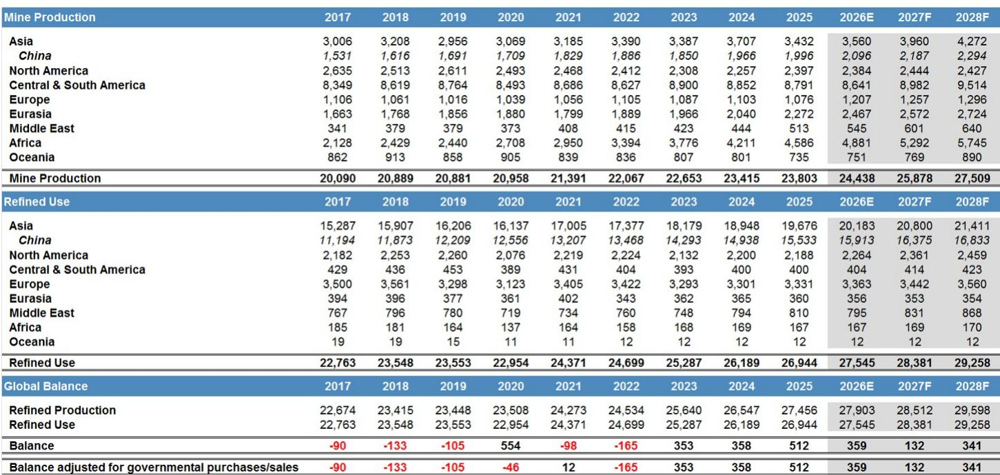
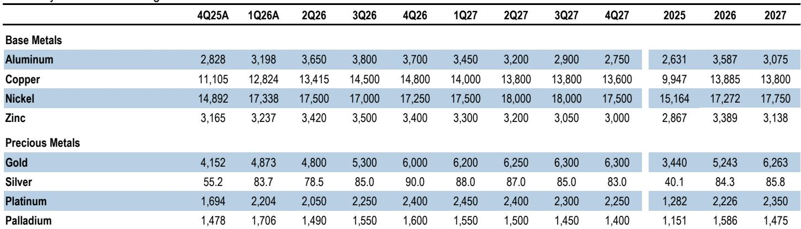

# JPM：铜价核心矛盾已从供需转向关税，中国正失去定价权

这份JPM最新发布的铜市场深度报告，给出了一个反直觉的判断：全球精炼铜市场正处于2025年超过50万吨的过剩状态，但LME铜价在过去一年却上涨了超过40%，并在2026年持续高位运行。供需基本面与价格走势之间的背离，并非市场失灵，而是全球铜定价权的结构性转移。

报告的核心主张清晰而锐利：当前铜市场的核心驱动力已不再是全球供需平衡表，而是美国关税政策预期所引发的“美中铜拉锯战”。在这场拉锯中，中国作为全球最大铜消费国的传统边际定价权正在被削弱，而美国通过COMEX/LME价差机制，正在以前所未有的力度从全球市场“虹吸”铜资源。报告预测，这一格局将推动铜价在未来几个季度向每吨15000美元迈进，而2026年下半年的关键催化剂，并非任何供需数据，而是美国对铜232条款关税审查的沟通与执行节奏。

以下是我们对这份报告核心逻辑与投资含义的拆解。

## 1. 全球供需平衡表已失去定价权，美国才是新的边际买家

传统铜市场分析框架中，全球精炼铜的供需缺口是判断价格方向的核心变量。但JPM这份报告明确指出，这一框架在当前阶段已基本失效。2025年全球精炼铜市场过剩超过50万吨，LME铜价却全年上涨42%；2026年过剩预计仍有约36万吨，但价格依然在每吨13600美元附近高位运行。

这种背离的直接原因，是美国自2025年初以来通过持续高企的COMEX/LME价差，从全球市场大量进口铜。报告估算，过去18个月，美国累计建立了约120万吨的铜库存——这相当于2024年全年美国铜进口量的近20个月水平。美国实际铜消费仅占全球约6%，但过去一年半的进口行为，使其对全球铜市场的拉动力度相当于一个消费占比9%的经济体。

这意味着，全球铜市场的边际定价者已经从“中国是否愿意在某个价位买入”转变为“美国是否愿意在某个价位继续进口”。只要COMEX/LME价差保持吸引力，美国就会持续从全球市场抽走铜资源，使得全球过剩的铜资源在“除去美国以外的市场”中变得相对紧张。LME价格正是在这一“美中拉锯”的中间地带被重新定价。

> **KC评论：** 传统铜研究最依赖的“供需平衡表”在当前环境下已经沦为背景噪音。投资者如果仍然盯着全球库存与消费比来预测铜价，可能会持续误判。真正需要关注的，是美国的关税预期如何影响COMEX价差，以及这种价差何时会关闭。完整报告中包含了对美国库存水平、进口流量的详细图表，这些数据是理解当前市场结构的起点。

## 2. 中国被迫接受更高买入价，定价权正在转移

中国是全球最大的铜消费国和进口国，历史上一直是铜价的边际定价者。当LME铜价过高时，中国买家会通过“买方罢工”减少采购，压低现货升水，最终迫使价格回落。但这一机制正在被打破。

报告用一组对比数据揭示了变化：2022年初和2024年中，当铜价升至每吨11000美元附近时，中国的进口套利窗口均迅速关闭，价格随后出现回调。但在2026年3月，当铜价因风险事件从14000美元回调至12500美元时，中国的进口套利窗口几乎立即打开，库存加速下降。12500美元——这比历史买点高出2000至3000美元。更近期的数据显示，中国甚至在铜价回调至13500美元时就开始重新买入。

这种“买入地板”的显著上移，背后是两重压力：一是全球铜精矿供应持续紧张，限制了中国的冶炼产量弹性；二是美国的大规模进口分流了原本可流向中国的铜资源。中国要满足自身每年约260万吨的阴极铜净进口需求，必须在更高的价位上与国际买家竞争。中国的定价权并未完全消失，但其容忍的价格区间已经系统性上移。

> **KC评论：** 这一判断对理解铜价的下行风险至关重要。过去认为“铜价涨到中国买不动就会跌”的逻辑，在当前环境下可能不再成立。中国买不动，不是因为价格太高，而是因为买不到足够的量。报告中的图8清晰地展示了中国买入地板的跃迁过程，值得反复推敲。

## 3. 关税“升级预期”才是多头最核心的支撑

报告用大量篇幅分析了美国232条款铜关税审查可能带来的不同情境，并给出了一个明确结论：对LME铜价而言，最重要的变量不是关税的绝对值，而是关税路径的“升级预期”。

如果美国宣布的是立即生效的高额关税（例如直接跳升至50%），这反而是利空。因为这会立即关闭COMEX/LME进口套利窗口，美国将不再从全球市场抽走铜资源。届时，美国国内超过120万吨的库存将面临漫长的去库存周期，而中国将重新获得定价权，铜价可能回落至每吨10000至11000美元区间。

反之，如果美国宣布的是“阶梯式、逐步升级”的关税（例如2027年1月1日起15%，2028年1月1日起30%），这将是强烈的利多信号。因为这种结构会激励进口商在关税生效前加速将铜运入美国，从而延长甚至加剧美国对全球铜资源的虹吸效应。在这种情境下，LME库存可能急剧下降，期货曲线可能转为深度现货溢价，铜价可能突破每吨15000美元，甚至出现超调。

报告明确指出，特朗普政府的目标是“保护已经运入美国的铜库存不流出”，而非“立即关闭进口大门”。因此，阶梯式关税是最符合其政策逻辑的选择。

> **KC评论：** 关税审查的最终结果固然重要，但市场更关注的是“沟通”本身。任何暗示未来关税将逐步升级的信号，都可能引发新一轮抢运。反之，如果沟通模糊或缺乏升级暗示，即使关税未正式落地，市场也可能理解为利空。投资者需要密切跟踪6月30日前后美国商务部的任何公开表态。完整报告中对不同关税情境下的价格路径推演，是理解这一逻辑的必备素材。

## 4. 报告尚未完全回答的关键问题：中国政策反制的可能性

JPM报告在分析中国行为时，主要聚焦于市场化的“买方罢工”和套利出口。但报告也提及了一个尚未展开的关键风险：中国政策制定者可能在供应安全压力下，出台更严格的铜出口限制措施。

如果中国开始限制阴极铜出口，或者通过调整增值税、出口关税等方式干预套利行为，美国的进口来源将受到实质性影响。考虑到中国是全球最大的精炼铜生产国，任何出口限制都将迅速改变全球铜资源的流向。

报告对这一可能性着墨不多，但这一变量恰恰是当前市场定价中最容易被忽视的风险点。如果中国选择主动收紧出口，铜价的上行风险将进一步放大，因为美国将更难从全球市场获得足够的铜资源来维持其库存积累。更值得关注的是，中国是否会通过战略收储或调整国储铜库存来应对美国的“虹吸”，这将是影响未来铜价走势的另一个关键变量。

## 5. 投资者的观察框架：从“供需平衡”转向“关税博弈”

基于以上分析，投资者需要调整对铜市场的分析框架。传统的全球供需平衡表、中国进口溢价、LME库存变化等指标，在当前环境下已部分失效。新的观察框架应该聚焦于以下三个维度：

第一，美国关税预期与COMEX价差。这是当前铜价最直接的驱动力。建议重点关注6月30日美国商务部报告后的政策沟通节奏，以及COMEX/LME价差的变化方向。价差扩大意味着美国仍在吸引进口，价差收窄则可能预示着拉锯战的缓解。

第二，中国进口套利窗口的实际位置。中国买入地板的上移幅度，是衡量中国定价权被削弱程度的最直接指标。如果中国在更高价位上仍能维持稳定的进口量，说明美国的虹吸效应仍在持续；如果中国开始出现进口量下降或套利窗口长期关闭，则可能意味着转折点临近。

第三，非美国市场的库存紧张程度。LME注册仓库中，非美国库存的持续下降是铜价上行风险的重要预警信号。报告指出，如果美国实施阶梯式关税，LME库存可能急剧下降，期货曲线转为现货溢价，这将是铜价加速上冲的前兆。

> **KC评论：** 当前铜市场的核心矛盾已经从“供需是否平衡”转变为“美国关税如何影响全球铜资源的流向”。投资者如果仍然沿用传统的库存与消费比框架，可能会持续误判。建议将COMEX/LME价差、中国进口套利窗口的阈值、以及LME非美国库存这三个指标作为日常跟踪的核心。

---

这份JPM报告的核心价值，在于它清晰揭示了铜市场定价权的结构性转移，并给出了一个可验证的、基于关税博弈的分析框架。报告中的多个核心判断——包括中国买入地板的上移、美国库存积累的规模、以及阶梯式关税对价格的支撑——都建立在详实的数据和严谨的逻辑之上。

但正如报告自身所承认的，关税决策存在高度的不确定性，任何判断都需要持续验证。报告中还包含了对铜矿供应增长、中国废铜利用、以及不同关税情境下价格路径的详细量化分析，这些内容因篇幅限制未能在此展开。

我们每天会由AI agent结合人工review，生成国际投行中文摘要与KC评论，daily更新约10-40页，并整理当天最新数据图表合集，方便喂给AI，也方便人工快速把握market dynamics。欢迎来星球和微信群里继续讨论。

Personal reading notes and learning share only. Not investment advice.

