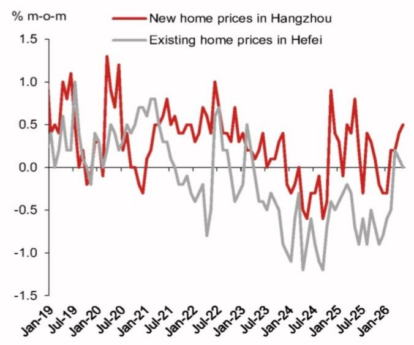
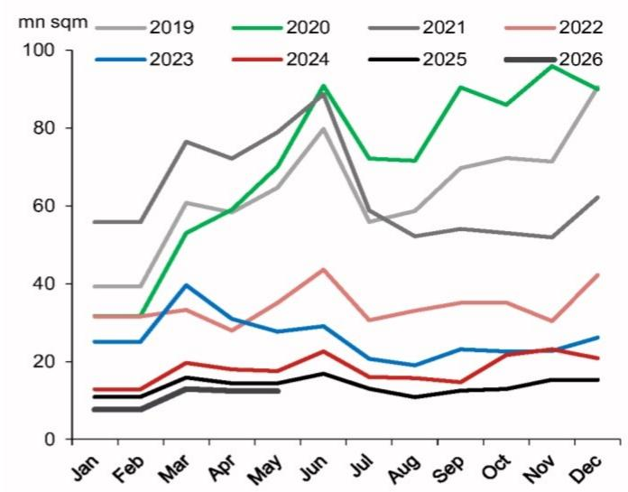
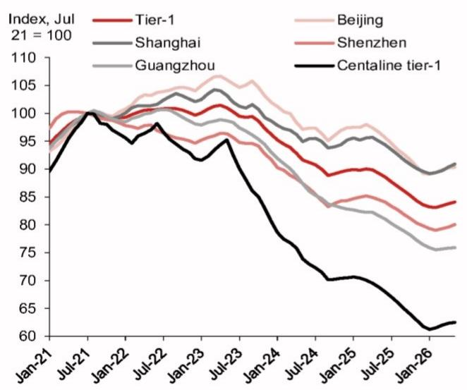

# NOM：中国楼市K型分化已成定局，全国复苏仍是伪命题

中国房地产市场正在上演一场“冰与火之歌”。少数“聪明城市”的房价已经企稳甚至反弹，但全国平均房价跌幅却在5月重新扩大，地产投资与销售数据持续恶化。NOM在最新研报中给出了一个清晰但令人不安的判断：中国楼市正出现地理上的“K型分化”，而AI带来的股市繁荣，非但无法成为全国楼市的解药，反而可能加剧了区域与人群间的财富不平等。

这份报告的核心洞察在于：市场期待已久的“全面复苏”可能根本不会到来。取而代之的，是一个被AI与政策选择性托举的“头部城市”与基本面持续恶化的“广大低线城市”之间的结构性断裂。对于投资者和决策者而言，理解这个“K型”的走向，远比押注一个模糊的“底部”更为关键。

## 1. 头部城市房价已连续三个月上涨，但支撑逻辑并非普适

NOM的数据显示，北京、上海、广州、深圳四个一线城市的二手房价格在5月实现了0.4%的环比平均涨幅，且已连续三个月保持正增长。其中，上海是70个大中城市中表现最强劲的，5月环比上涨0.6%，从1月低点累计反弹1.9%。深圳紧随其后，同样录得0.6%的月度涨幅，这得益于4月30日进一步放松的限购政策。

但这份回暖的“含金量”需要仔细拆解。以上海为例，其价格稳定的背后是成交量的大幅放量和挂牌量的急剧萎缩。5月10日，上海单日二手房成交量创下1664套的五年新高。同时，安居客数据显示，截至5月31日，上海有效二手房挂牌量同比下降近20%。更关键的结构性变化在于，成交主力正在从“老破小”向改善型房源迁移。链家数据显示，5月上海总价500-800万元的房源成交环比激增9.3%，而300万元以下的低总价房源成交反而环比下降2.6%。

> **KC评论：** 这意味着，上海楼市的回暖并非“雨露均沾”，而是由高净值人群的财富效应和改善性需求驱动的。这部分人群恰恰是AI与股市繁荣的最大受益者。全国其他城市能否复制这种模式，答案不言自明。

## 2. 全国平均房价跌幅扩大，低线城市拖累效应远超预期

与头部城市的“小阳春”形成鲜明对比的是，全国70城二手房平均价格在5月环比下跌0.26%，这打破了此前连续四个月收窄的趋势。NOM指出，拖累主要来自低线城市：二线城市跌幅从4月的-0.10%扩大至5月的-0.19%；三四线城市则维持在-0.35%的深度下跌区间。

更值得警惕的是，全国新房销售与投资数据在4-5月出现了全面恶化。房地产投资增速从一季度的-11.2%骤降至4-5月的-22.3%。新房销售面积增速则从-10.4%进一步下滑至-11.4%。NOM特别强调，头部城市虽然贡献了约18%的新房销售额，但按面积计算仅占全国总量的5%左右。这意味着，少数城市的微光根本无法照亮整个市场。

> **KC评论：** 这个数据对比揭示了问题的本质：头部城市的“量价齐升”在宏观层面更像一个统计上的“幸存者偏差”。决策者如果只盯着上海、深圳的月度数据来评估政策效果，可能会严重误判全国房地产市场的真实压力和潜在风险。完整报告中对CRIC百强房企销售数据的拆解，展示了更为悲观的图景。

## 3. AI牛市并非灵丹妙药，财富效应高度集中且边际递减

市场上一度流行一种叙事：AI带来的股市繁荣将通过财富效应提振楼市。NOM的报告对此给出了明确的否定。数据显示，从2025年7月到2026年6月中旬，万得全A指数上涨了33.2%，科技股市值已占A股总市值的30%以上。然而，NOM早在2025年9月就判断，这种股市上涨对全国范围内的财富效应和经济影响十分有限。

报告指出，本轮股市上涨的主要资金来源是高净值个人，而非普通家庭储蓄的转移。因此，财富效应高度集中在金融中心城市的富裕阶层。上海和深圳的楼市确实从中受益，但这种受益是通过两个狭窄的渠道传导的：一是股票上涨带来的直接财富效应，二是交易量激增推高了金融从业者的薪酬。这两个渠道都无法惠及全国大多数居民。

> **KC评论：** NOM的这个判断对于理解当前资产定价的逻辑至关重要。它意味着，不能简单地将股市上涨视为楼市复苏的先行指标。两者之间的联系正在被“结构性分化”所切断。完整报告中关于“冰山指数”等领先指标的图表，为判断6月及后续房价走势提供了更清晰的参考框架。

## 4. 政策面临两难：托举头部还是拯救尾部？

报告揭示的政策困境是：北京最终可能被迫加大力度，以清理房地产行业的不良债务并加速财政改革，来支持那些被“K型增长”抛在后面的城市。但具体路径仍不清晰。

一方面，如果政策继续向头部城市倾斜，比如进一步放松限购、提供信贷支持，可能会加剧房价分化，并推高系统性金融风险。另一方面，如果在低线城市采取大规模刺激，又可能面临“边际效用递减”和库存去化周期过长的难题。NOM的报告暗示，当前的“因城施策”可能已无法应对这种全面的结构性挑战。

这引出了一个报告尚未完全回答的关键问题：在AI驱动的新经济周期里，房地产市场的“底部”是否已经被永久性地改变了？传统意义上等待一个“全国性底部”出现的投资策略，可能已经失效。未来的机会与风险，将完全取决于资产所在的城市能否抓住AI与产业升级的浪潮。

## 5. 投资者需要建立新的观察框架：从“全国周期”到“城市赛道”

这份NOM报告对读者的最大启示，是必须彻底放弃“全国一盘棋”的房地产分析框架。未来的观察框架应该聚焦于三个维度：

第一，城市的基本面硬实力。这不仅是GDP增速，更包括科技企业的聚集度、高端人才的净流入、以及金融市场的活跃度。NOM报告中提到的“聪明城市”，如上海、深圳、杭州、合肥，无一不是AI、半导体、生物医药等前沿产业的聚集地。

第二，政策工具的精准度。未来政策的有效性将取决于能否精准识别并支持那些有“自生能力”的城市，而非普惠式放水。投资者需要密切关注各城市在土地供应、保障房建设和产业基金方面的具体动作。

第三，财富效应的扩散半径。股市的繁荣能否转化为楼市的购买力，关键看这种财富效应能否从金融中心向周边卫星城或产业强市扩散。目前看来，这个半径非常有限。

NOM这份报告的完整版提供了详尽的图表数据，包括各城市房价的月度热力图、冰山指数的周度追踪、以及百强房企销售的结构性分析。这些数据对于验证上述观察框架、做出更审慎的资产配置决策至关重要。

每天，我们的团队会由AI agent与人工review相结合，生成国际投行（包括NOM、GS、MS等）的中文摘要与KC评论，daily更新约10-40页，并整理当天最新数据图表合集。这些内容既方便喂给AI进行深度分析，也方便人工快速把握全球市场的核心动态。欢迎来我们的星球微信群里继续讨论这些未解的问题，共同追踪K型分化的演进路径。

Personal reading notes and learning share only. Not investment advice.

