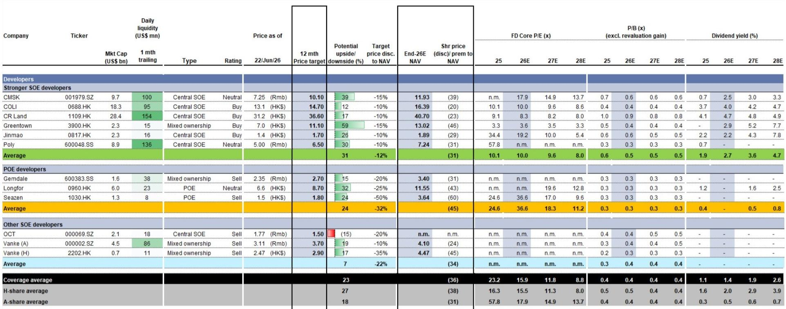
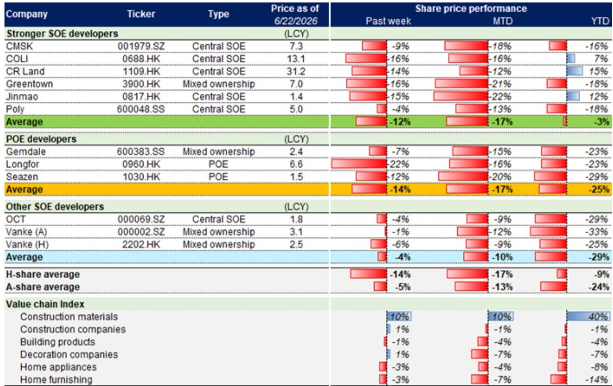
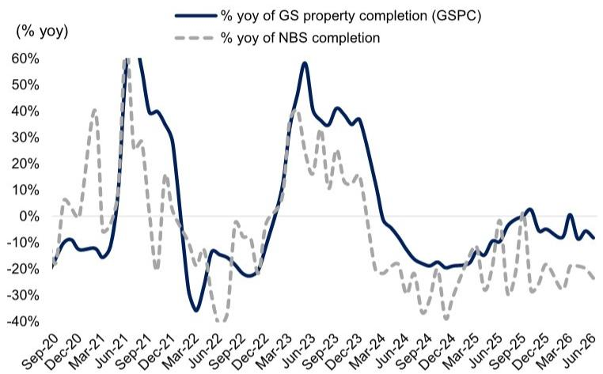

# China’s Property Market Is Not Stabilizing — It Is Recalibrating Toward a Two-Tier Equilibrium

The headline numbers from Week 25 of China’s property market look like a setback. Primary transaction volumes fell 5% week-on-week. Secondary volumes dropped 20%. Developer share prices tumbled an average of 12% for stronger state-owned enterprises and 14% for private developers. A casual observer would conclude that the tentative recovery of recent months has stalled.

That conclusion would be wrong. The data reveals something more structurally significant: the Chinese property market is not simply rising or falling in aggregate. It is undergoing a recalibration into two distinct regimes — one for new supply, one for existing stock — and each is responding to fundamentally different forces. Investors who treat this as a single market will misallocate capital. Those who understand the divergence will find the strategic entry points.

The Dragon Boat Festival holiday artificially compressed activity, masking an underlying improvement. When adjusted for the holiday effect, primary market volumes actually rose 6% week-on-week, and secondary volumes gained 2%. Both segments now trade well above their month-to-date June daily averages — primary by 7%, secondary by 31%. The real story is not a recovery that is fading. It is a recovery that is bifurcating.

This week’s data demands a new analytical framework. The old question — “is the market recovering?” — is no longer useful. The new question is: “which parts of the market are recovering, for whom, and at what price?”

## The Secondary Market Is Leading the Recovery, but Price Expectations Are Cracking

The most encouraging signal in Week 25 is the sustained outperformance of secondary transactions relative to primary. Year-to-date, secondary GFA sold is flat year-on-year. That compares to a 12% decline in primary volumes. Against the 2024 baseline, secondary volumes are up 20%; against 2023, up 9%. These are not trivial numbers. They indicate genuine demand — not speculative froth, but end-user transactions.

This matters for a strategic reason. Secondary market liquidity is the transmission mechanism for the entire property ecosystem. When homeowners can sell, they can move. When they can move, they generate demand for new furnishings, renovations, and eventually new homes. The secondary market is not a competitor to the primary market. It is the precursor.

Yet there is a tension beneath this volume growth. Price appreciation expectations are edging lower among both home-sellers and agents. This is the critical nuance: volume is recovering, but pricing power is not. In a normal cyclical recovery, volume and price move together. In this cycle, they are decoupling. Sellers are accepting lower prices to close deals. Agents are adjusting their guidance downward. The market is clearing, but at a discount.

For investors, this creates a paradox. The volume recovery is real and should be respected. But the absence of price recovery means that developers’ revenue and margin trajectories will remain under pressure even as transaction counts improve. The equity market is pricing this correctly — developer valuations have compressed despite the volume uptick. The question is whether valuations have compressed enough.

## Primary Supply Discipline Is the Only Reason Prices Have Not Collapsed

While secondary volumes are rising, primary supply is being deliberately constrained. New listing supply fell 15% week-on-week, sending month-to-date June supply to 5% below May and 18% below the prior year. This is not a demand problem. It is a supply strategy.

Developers — particularly state-owned enterprises — have learned the lesson of 2022-2024: flooding the market with inventory destroys pricing power and accelerates balance sheet stress. The current approach is surgical. Listings are curtailed. Inventory months now stand at 27.7, below the May average of 28.5. Inventory balances are down 4.7% from end-2025 levels.

This supply discipline is the single most important factor supporting transaction prices. With fewer units available, the marginal transaction can occur at a higher price. Week 25 saw transaction prices improve 0.8% week-on-week across monitored cities. That is modest, but it is positive — and it is directly attributable to the supply constraint.

The strategic implication is clear: the primary market is no longer a volume game. It is a price management game. Developers who can control their release schedule and avoid distress sales will preserve more value than those who chase market share. The market is rewarding discipline, not aggression.

But this strategy has a limit. Developers cannot hold supply indefinitely. Land banks have carrying costs. Debt maturities do not pause. At some point, supply must be released. When it is, the price impact will depend entirely on whether demand has grown sufficiently to absorb it. The data so far suggests demand is growing, but not fast enough to absorb a wave of new supply without price erosion.

## Completions and Starts Are Telling Two Different Stories About Future Supply

The report’s proprietary GSPC tracker provides a forward-looking lens that the weekly transaction data cannot. The tracker implies a roughly 20% year-on-year decline in completions for June 2026, consistent with the May trend. For the full fiscal year 2026, completions are expected to decline 1% year-on-year.

A 1% decline is essentially flat. That is not a crash. It is a stabilization of the completion pipeline after years of sharp contraction. For investors, this is a meaningful data point. It suggests that the worst of the supply adjustment is behind us. The construction pipeline is no longer collapsing. It is finding a floor.

New starts, however, tell a different story. The tracker indicates a high-twenties percent year-on-year decline in new starts for June, following a 25% decline in May. This is a much sharper contraction than completions, and it signals a structural shift in developer behavior. Developers are not starting new projects because they cannot finance them profitably, and because they do not believe future demand will justify the investment.

The divergence between completions and starts is the market’s most important leading indicator. Completions reflect past decisions. Starts reflect current convictions. The fact that starts are falling far faster than completions means that the supply pipeline will thin considerably over the next 12 to 18 months. That is bullish for pricing power in the medium term, but it is bearish for construction-related employment, local government land sales, and the broader economic multiplier that the property sector provides.

For investors, this creates a time arbitrage opportunity. Near-term pricing is supported by supply discipline and stable completions. Medium-term pricing will be supported by a much thinner pipeline of new starts. The window for entry into well-capitalized developers may be narrowing, not expanding.

## Valuations Are at Historic Troughs — But Not All Troughs Are Equal

Developer valuations are now at levels that historically have marked the bottom of major cycles. Offshore coverage trades at a 38% discount to end-2026E NAV and at 0.5x 2026E P/B. Onshore coverage trades at a 31% discount and 0.4x P/B.

Comparing these to previous troughs is instructive. The 2H2008 trough saw offshore developers at a 39% discount to NAV and 0.7x P/B. The 2H2011 trough was 73% discount and 0.9x P/B. The 1H2014 trough was 58% discount and 0.9x P/B. Current valuations are at or below these levels on a NAV discount basis, and significantly below on a P/B basis.

But history is not a mechanical guide. The 2008, 2011, and 2014 troughs occurred in fundamentally different environments. In each of those cycles, the property market was structurally growing. The policy response was unambiguous stimulus. The developer base was largely private and financially integrated with the banking system.

Today’s environment is different. The market is structurally shrinking. The policy response is measured and targeted, not broad-based. The developer base is bifurcated between state-owned enterprises that have access to capital and private developers that do not. The banking system is cautious. The demographic tailwind is gone.

This does not mean valuations cannot mean-revert. It means that mean reversion will be slower and more selective. The developers that will re-rate are those with strong SOE backing, disciplined supply management, and balance sheets that do not require distress sales. The developers that will not re-rate are those facing refinancing risk, inventory overhang, or weak parent support.

The data shows this divergence clearly. Stronger SOE developers saw share prices decline 12% week-on-week, while private developers fell 14% and other SOEs fell only 4%. The dispersion is not random. It reflects the market’s assessment of which developers can survive and which cannot.

## The Question the Report Does Not Fully Answer: What Happens When Stimulus Fades?

The report provides a detailed snapshot of current conditions, but it leaves one critical question open: how much of the current stabilization is organic, and how much is policy-supported?

Since late 2024, Chinese authorities have rolled out a series of measures to support the property market: lower mortgage rates, relaxed purchase restrictions, direct government purchases of unsold inventory, and increased credit availability for developers. These measures have clearly had an effect. Transaction volumes have stabilized. Developer liquidity has improved. The worst-case scenario of a systemic credit event has been avoided.

But stimulus measures have diminishing returns. Each new round of policy support generates a smaller marginal response than the previous one. The market is becoming habituated to intervention. The risk is that when the pace of new policy measures slows — as it inevitably must — the underlying weakness in demand will reassert itself.

The report’s data does not allow us to isolate the organic component of demand from the policy-induced component. The transaction volume improvements could be genuine end-user demand, or they could be pulled forward by policy incentives. If they are pulled forward, the market could face a demand vacuum in the second half of 2026.

This is the analytical frontier. Investors need a framework for distinguishing between policy-driven transactions and structurally sustainable demand. The report provides the data to ask the question, but not yet to answer it.

## A Decision Framework for Navigating the Two-Tier Market

For investors trying to act on this analysis, the following framework may be useful. It is not a prediction. It is a set of conditions to monitor and thresholds to trigger action.

First, track the ratio of secondary to primary transaction volumes. If secondary volumes continue to grow faster than primary, it confirms that end-user demand is real and that the market is functioning as a normal housing ecosystem rather than a developer-driven speculation cycle. If primary volumes begin to catch up without price erosion, it signals that developers have regained pricing power.

Second, monitor the inventory month trend. If inventory months continue to decline toward the 24-25 range, developers will have increasing pricing power and the risk of distress sales will diminish. If inventory months stabilize or rise, supply discipline is breaking and prices will come under pressure.

Third, watch the new starts data closely. If new starts continue to decline at a high-twenties percent rate through the third quarter, the medium-term supply outlook will become significantly tighter, supporting a valuation re-rating for well-capitalized developers. If new starts stabilize or improve, it suggests developers see a demand recovery that justifies investment, which would be a bullish signal for the broader economy.

Fourth, focus on developer type over developer size. The market is no longer rewarding scale. It is rewarding balance sheet strength, access to state capital, and supply discipline. SOE developers with low leverage and controlled release schedules are the only segment where the risk-reward is attractive. Private developers and mixed-ownership entities with high leverage remain structurally disadvantaged regardless of volume trends.

Finally, do not confuse volume recovery with price recovery. The market is clearing at lower prices. That is good for transaction volumes. It is not good for developer margins or equity valuations. A volume recovery without price recovery is a trading environment, not an investment environment.

Join the community to read the full report and review the original charts.

*This article is for learning and discussion only and does not constitute investment advice.*

Personal reading notes and learning share only. Not investment advice.

