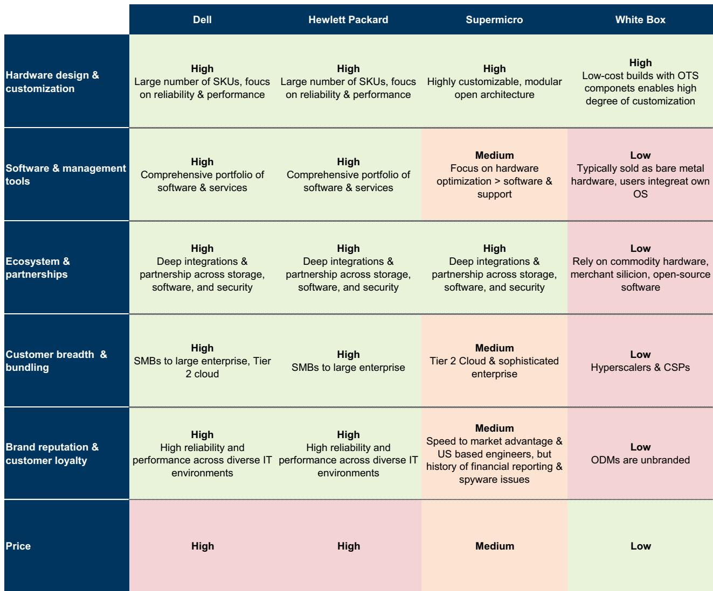
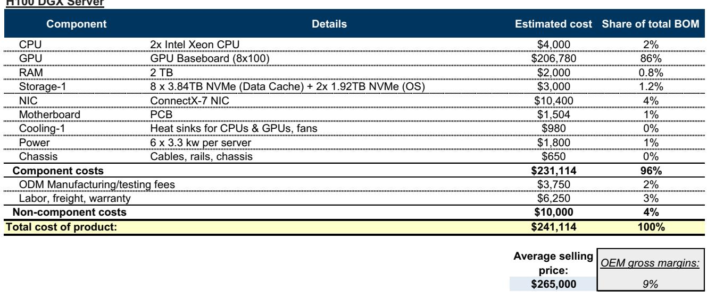
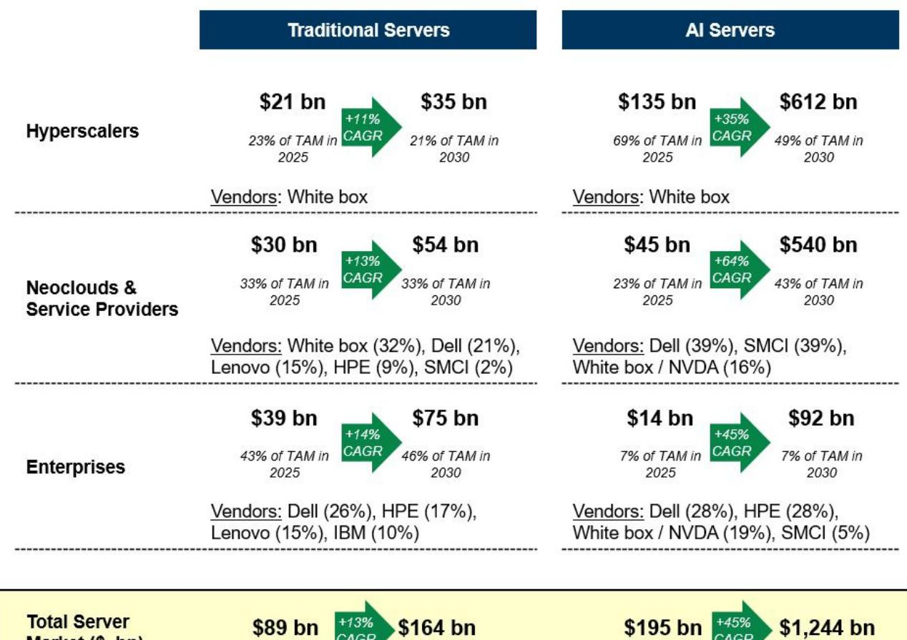

# GS：传统服务器正在被AI“吃掉”

当所有人都在谈论英伟达的GPU如何改变世界时，GS一份长达数十页的服务器产业报告揭示了一个被忽视的结构性变化：传统服务器市场正在被AI服务器“吃掉”，而这场吞噬不仅发生在营收数字上，更在重塑整个硬件产业的利润池和竞争规则。

这份由GS硬件分析师团队完成的产业入门报告，并非简单的行业科普。它给出了一个清晰的判断框架：到2030年，全球服务器市场将从2025年的2840亿美元增长至1.4万亿美元，复合年增长率38%。但真正值得关注的不是总量，而是结构——加速服务器（AI服务器）将以45%的五年复合增速增长至1.2万亿美元，而传统服务器即便保持13%的增速，到2030年也只有1640亿美元。

这意味着什么？AI服务器将在五年内吃掉整个服务器市场85%的营收份额。传统服务器不仅增长缓慢，其单位出货量甚至可能进入长期收缩通道。

但这份报告最锋利的地方，不在市场预测，而在它揭示了一个隐蔽的囚徒困境：传统服务器越高效，OEM厂商的利润池越危险。

> **KC评论：** GS这份报告的核心贡献不是给出了一个万亿级市场的预测数字——这个数字市场早有共识——而是把“服务器密度提升”和“OEM利润”之间的冲突量化了出来。如果你只看营收预测，你会觉得这是个稳健增长的行业。但如果你看单位经济模型，你会意识到传统服务器OEM正在面临一个“量缩价难升”的困局。完整报告里有详细的BOM拆解和情景分析，值得仔细推敲。

## 1. 传统服务器正在经历一场“自我吞噬”式的效率革命

GS估计，全球传统服务器装机量约为7000万台，平均使用寿命已从2003-2019年的4.4年延长至目前的5.7年。这背后有两个动力：一是超大规模云服务商将服务器折旧年限从3年拉长到5-6年；二是企业在不确定的宏观环境下被迫“压榨”现有设备。

但更关键的是新一代服务器带来的“密度飞跃”。HPE报告称，一台Gen12服务器可以替代7台Gen11或14台Gen10，同时功耗降低65%。戴尔的数据更惊人：其17G服务器对14G旧服务器的替换比率可达6:1或7:1。目前戴尔超过70%的装机量仍在使用2017年发布的14G或更旧机型。

GS做了一个情景分析：如果所有旧服务器被新一代产品以3:1或7:1的比例替换，戴尔的传统服务器装机量将减少60%。即便考虑到工作负载增长带来的新增需求，传统服务器年出货量也可能从2018-2022年平均的1300万台，降至1000万台左右的“新常态”。

这个数字背后隐藏着一个残酷的算术：如果每年出货的服务器数量大幅减少，要保持利润池稳定，要么ASP大幅上升，要么利润率显著提高。但问题在于——客户凭什么为更高效的硬件支付溢价？

## 2. 内存价格正在成为传统服务器OEM的“隐形利润杀手”

GS对传统服务器单位经济模型做了详细拆解，结论令人警觉：OEM厂商在CPU服务器销售中通常只能获得15%的毛利率和5-7%的营业利润率。而DRAM和NAND历史上占传统服务器BOM的约30%。

但报告指出，根据当前行业对2026/27年内存价格上涨的预期，到2026年底，内存可能占传统服务器BOM的60%以上。这意味着，在没有任何对冲措施的情况下，OEM厂商将面临严重的成本挤压。

这不是一个遥远的风险。如果内存成本占比从30%跃升至60%，OEM厂商的利润空间将被压缩到几乎不可持续的水平。而他们能做的选择有限：要么涨价（但可能失去客户），要么压缩其他BOM成本（但空间有限），要么接受利润率下滑。

> **KC评论：** 这是整份报告最容易被忽视但最值得追问的部分。传统服务器OEM的利润本来就薄，如果内存价格持续上涨，他们的单位经济模型可能从“微利”变成“亏损”。GS在报告里给出了详细的BOM拆解和情景分析，但没有完全展开的是：OEM厂商是否有能力通过设计优化或供应链管理来对冲这个风险？这需要读者去完整报告里找答案。

## 3. AI服务器正在改变OEM的竞争规则，但利润分配可能更集中

传统服务器市场是OEM的天下：戴尔、HPE、联想、IBM在企业市场占据主导，而超大规模云服务商则主要采购白牌服务器。但AI服务器市场的竞争格局完全不同——GPU供应商（主要是英伟达）掌握了最大的议价权，OEM更多扮演系统集成和交付的角色。

GS预测，到2030年加速服务器市场规模将达到1.2万亿美元，五年复合增速45%。这个市场不仅规模大，增长速度也远超传统服务器。但问题是，这个市场的利润分配逻辑是什么？

在传统服务器市场，OEM靠品牌、渠道和服务赚钱。在AI服务器市场，GPU是价值核心，OEM的附加值相对有限。除非OEM能在系统级优化、散热、网络等方面建立独特的竞争优势，否则他们可能只能获得比传统服务器更低的利润率。

报告没有直接给出答案，但它提供了一个观察框架：不同客户垂直领域的市场结构差异巨大。企业市场高度集中，由品牌OEM主导；超大规模市场以白牌为主；而“新云”（neocloud）市场目前混合使用OEM和ODM。这意味着OEM厂商需要针对不同客户群体制定不同的策略。

## 4. 报告没有完全回答的一个关键问题：传统服务器的利润池到底会缩水多少？

GS在报告中做了一个情景分析：如果传统服务器年出货量从目前的约1200万台降至400万台（3:1替换率），ASP需要从8036美元上涨75%至14063美元，才能维持67亿美元的行业利润池不变。如果替换率达到7:1，ASP需要上涨150%至20090美元，利润率需要从7%提升到20%。

这些情景是“假设利润池不变”的推算，而不是预测。但问题在于：ASP真的能涨这么多吗？企业客户是否愿意为更高效的硬件支付远高于历史水平的单价？

答案并不明确。报告本身也承认，这只是一个“简化情景分析”，没有考虑工作负载增长带来的新增需求。但即使考虑新增需求，传统服务器出货量的长期趋势仍然是下降的。

这意味着，传统服务器OEM面临的核心挑战是：如何在出货量下降的情况下维持利润？他们可能需要从硬件销售转向服务、软件或解决方案销售，但这需要完全不同的能力禀赋。

## 5. 对产业决策者的观察框架：你需要关注三个变量

基于GS这份报告的框架，我们认为产业决策者（无论是OEM厂商、云服务商还是企业IT采购者）需要关注三个核心变量：

**第一，传统服务器的“密度效应”何时会从利好变成利空？** 短期内，服务器升级带来的效率提升是好事——客户用更少的硬件做更多的事。但长期看，如果出货量持续下降，整个生态系统的利润池就会萎缩。关键在于：这个拐点何时到来？GS认为可能在2026-2027年。

**第二，内存价格走势对OEM利润的影响有多大？** 如果内存占比真的超过60%，OEM厂商的利润空间将被极度压缩。这可能导致行业整合，或者倒逼OEM厂商向更高附加值的细分领域转移。

**第三，AI服务器市场的利润分配格局是否会发生改变？** 目前英伟达攫取了AI服务器市场的大部分利润，但这不是静态的。如果AMD、英特尔或定制芯片（如AWS Graviton、Google Axion）在AI推理市场获得更大份额，或者如果OEM能在系统级优化上建立壁垒，利润分配可能发生变化。

---

这份GS报告的完整版包含了对服务器BOM的详细拆解、不同客户垂直领域的市场份额分析、以及关于利润池的情景模拟。每天，我们的AI agent会与人工review协作，生成国际投行中文摘要与KC评论，daily更新约10-40页，并整理当天最新数据图表合集，方便喂给AI，也方便人工快速把握market dynamics。欢迎来星球微信群里继续讨论，一起追踪这些关键变量的变化。

Personal reading notes and learning share only. Not investment advice.

