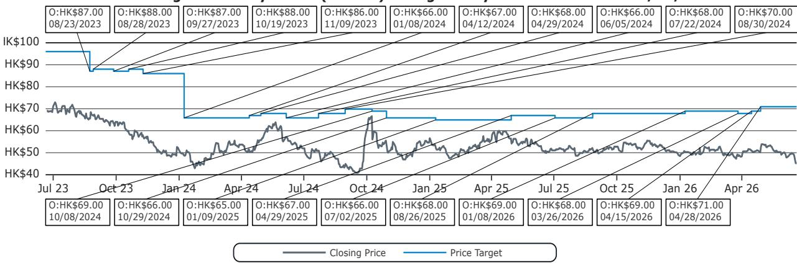

# Heineken Is Winning China’s Beer Premiumization Race While Budweiser Remains Stuck in Neutral

China’s beer market is not a single story. It is a tale of two strategies playing out in real time. In May 2026, total national beer sell-out value grew a modest 2% year-over-year, a slight improvement from April’s 1% growth. But beneath this aggregate figure lies a divergence that carries significant implications for investors. CR Beer, powered by its Heineken partnership, is accelerating with clear momentum across channels and provinces. Budweiser China, despite incremental improvements, continues to underperform the industry with a 3% value decline. The question is no longer whether premiumization is happening in China’s beer market. The question is which companies have the operational architecture to capture it.

The data from May 2026 reveals a market where Heineken’s growth trajectory within CR Beer’s portfolio is now unmistakable. Heineken posted 37% value growth in the month, driving CR Beer’s overall Premium segment outperformance of 11% versus the segment’s 5% average. This is not a one-month anomaly. The pattern has been building for quarters. Meanwhile, Budweiser China’s value has now declined for multiple consecutive months, with its off-trade channel still contracting at 10% in May, barely improved from 12% declines in March and April. The market is rewarding companies that have built genuine distribution muscle, not just brand equity.

The stakes are high. China’s beer market is transitioning from volume-driven growth to value-driven growth, and the winners will be those who can execute in both the on-trade and off-trade channels simultaneously. The May data shows that few are doing this well. One company is. Most are not.

## CR Beer’s Heineken-Led Premium Surge Is Now Visible Across Both Channels and Key Provinces

The most striking finding from the May data is the breadth of CR Beer’s momentum. Unlike many competitors who show strength in only one channel, CR Beer grew value in both the restaurant channel and the off-trade channel in May. The growth was most pronounced in Guangdong and Fujian provinces, where both channels registered double-digit growth. This is not a narrow or fragile improvement.

Heineken’s 37% value growth is the engine. But the story is bigger than one brand. CR Beer’s overall Premium segment value grew 11% in May, more than double the segment average. This suggests that the company’s route-to-market expansion, particularly through its partnership with Heineken, is creating a flywheel effect. The stronger Heineken performs, the more shelf space and tap handles CR Beer can command, which in turn lifts the entire portfolio.

The regression analysis in the report supports this forward view. Based on Q2-to-date monthly sales, CR Beer’s topline growth is projected to accelerate to approximately 2% in the second quarter. That may sound modest, but in a market growing 1-2% overall, it represents share gain. More importantly, it signals that the company’s premiumization strategy is translating into reported revenue, not just sell-out data. The correlation between BigOne Lab’s sell-out data and reported revenue is 96% for Budweiser China over the last 15 months, but CR Beer’s correlation is lower because it reports semi-annually. When CR Beer does report, the May data suggests the numbers will be supportive.

## Budweiser China’s Stabilization Is Real But Incomplete, and the Off-Trade Channel Remains the Critical Weakness

Budweiser China’s May value decline of 3% is an improvement from the 8% decline in Q1 and 11% decline in Q4. That is the good news. The bad news is that the improvement is narrow and fragile. The restaurant channel showed modest trajectory improvement, but the off-trade channel remains the core problem. Off-trade value was still down 10% in May, barely changed from 12% declines in March and April.

This matters because the off-trade channel represents a significant portion of Budweiser China’s revenue base. If the route-to-market expansion strategy is not delivering in this channel, the entire turnaround thesis is at risk. The report notes that Budweiser China’s performance in the Guangdong restaurant channel slowed down in May and was materially behind the overall channel performance. Guangdong is Budweiser China’s largest province by value weight, so this is not a minor issue.

There are some green shoots. Budweiser China improved in both channels in Zhejiang province and showed relative strength in the Premium segment of the restaurant channel, where it even gained share. But these are isolated data points, not a trend. The share loss at the national level remains across the board. In the off-trade, Budweiser China maintained its share only in the Mainstream+ segment, which is not where the growth is. The company is defending ground in lower-value segments while losing ground in premium.

The critical open question is whether Budweiser China’s distribution expansion will eventually translate into off-trade improvement, or whether the structural challenges in its route-to-market model are deeper than the market appreciates. The data through May suggests the latter is more likely.

## Tsingtao’s Home Province Problem Is Getting Worse, Not Better

Tsingtao’s May value decline of 2% is in line with Q1’s 2% decline, but the composition is worsening. The company’s home province of Shandong, which accounts for 36% of its national sell-out value, was the biggest drag in May. The restaurant channel in Shandong performed much worse in May than in March and April, with value declining 20% year-over-year. This is a structural problem, not a seasonal one.

The report’s regression analysis projects that Tsingtao’s Q2 topline decline will widen to approximately 3%. That would make Tsingtao the only major brewer in the report whose trajectory is deteriorating, not improving. The company’s H-share is rated Outperform by the report’s authors, but the May data raises questions about whether the home province headwind is being fully priced in.

Tsingtao’s challenge is that Shandong is both its strength and its vulnerability. The province gives the company scale and distribution density, but it also means that any weakness in Shandong directly hits the national numbers. The off-trade channel in Shandong was essentially flat in May, which is better than the restaurant channel, but not enough to offset the restaurant decline. The question for investors is whether Tsingtao can diversify its geographic exposure fast enough to matter, or whether the Shandong drag will persist through the rest of 2026.

## The Off-Trade Recovery Is Real But Concentrated, and the Super Premium Segment Remains a Warning Sign

One of the more encouraging data points in the May report is the improvement in off-trade value growth. After declining 3% in March and 1% in April, the off-trade channel grew 1% in May. This was driven by strong recoveries in Zhejiang and Jiangsu, where off-trade growth improved to 11% and 5% respectively from declines of 7% and 11% in April. Guangdong’s off-trade growth continued to accelerate to 14%.

But the recovery is not uniform. All segments except Mainstream+ bounced back to growth in the off-trade, which is positive. However, the Super Premium segment continues to struggle, declining 10% in May overall and 16% in the restaurant channel. This is a concern because Super Premium is supposed to be the future of China’s beer market. If consumers are trading down within premium tiers, the volume-to-value transition may be slower than expected.

The report’s data does not fully explain why Super Premium is underperforming. It could be a comp issue, a consumer sentiment issue, or a channel-specific issue. The data set does not cover the nightlife channel, which is a significant omission for the Super Premium segment. This is one of the meaningful open questions in the report: is Super Premium’s weakness a temporary phenomenon, or is it signaling a broader shift in consumer behavior that will affect all premium brewers?

## A Decision Framework for Investors: Four Questions to Ask Before Taking a Position

Based on the May data, investors evaluating China beer stocks should use a structured framework rather than relying on aggregate growth numbers. The following four questions can help distinguish between companies that are genuinely gaining share and those that are merely benefiting from favorable comps.

First, is the company growing value in both channels? The May data shows that only CR Beer achieved positive growth in both the restaurant and off-trade channels simultaneously. Budweiser China and Tsingtao both have one channel dragging down the other. A company that cannot grow in both channels is carrying structural risk.

Second, is the company gaining or losing share in the Premium segment? Premium is where the growth is, with value up 8% in the restaurant channel and 5% overall in May. CR Beer gained share in Premium. Budweiser China lost share in Premium in the off-trade but gained in the restaurant channel. Tsingtao’s position in Premium is ambiguous. Share gain in Premium is the single best leading indicator of sustainable growth.

Third, is the company’s home province a tailwind or a headwind? Tsingtao’s Shandong problem is a clear negative. Budweiser China’s Guangdong performance is mixed. CR Beer’s strength in Guangdong and Fujian is a positive. Geographic concentration is a risk factor that the market may be underestimating.

Fourth, what is the trajectory of the off-trade channel? The off-trade channel is the hardest to fix because it requires broad distribution infrastructure. Budweiser China’s off-trade has been declining for months with minimal improvement. CR Beer’s off-trade is growing. This is the most important operational metric to track in the coming quarters.

## What the Report Does Not Fully Answer: The Nightlife Channel, Super Premium Dynamics, and the Sustainability of Heineken’s Growth

The report provides rich data on the restaurant and off-trade channels, but it explicitly notes that the data set does not cover the nightlife channel. This is a meaningful gap. The nightlife channel is disproportionately important for Super Premium brands and for imported beer. If Budweiser China is holding up in nightlife while declining in other channels, the overall picture might be less negative than the report suggests. Conversely, if CR Beer’s Heineken growth is concentrated in channels that are easier to win, the sustainability of that growth may be lower than it appears.

The Super Premium segment’s continued decline is another unresolved question. The report shows Super Premium value down 10% in May and 16% in the restaurant channel. This is the fourth consecutive month of decline. If Super Premium does not recover, the entire premiumization thesis for China beer needs to be recalibrated. The report does not offer a hypothesis for why Super Premium is weak, which leaves investors to speculate.

Finally, the sustainability of Heineken’s 37% growth within CR Beer is an open question. Is this market share gain coming from competitors, or is it a one-time boost from distribution expansion? The report shows that Heineken is accelerating, not just growing. But acceleration at 37% is difficult to maintain. Investors need to watch whether the growth rate stabilizes or decelerates in the second half of 2026.

These are the questions that the full report and its underlying data can help answer. The monthly sell-out data from BigOne Lab provides a granularity that is rare in China equity research, and the regression analysis linking sell-out to reported revenue gives investors a tool to anticipate earnings surprises.

Join the community to read the full report and review the original charts.

*This article is for learning and discussion only and does not constitute investment advice.*

Personal reading notes and learning share only. Not investment advice.

