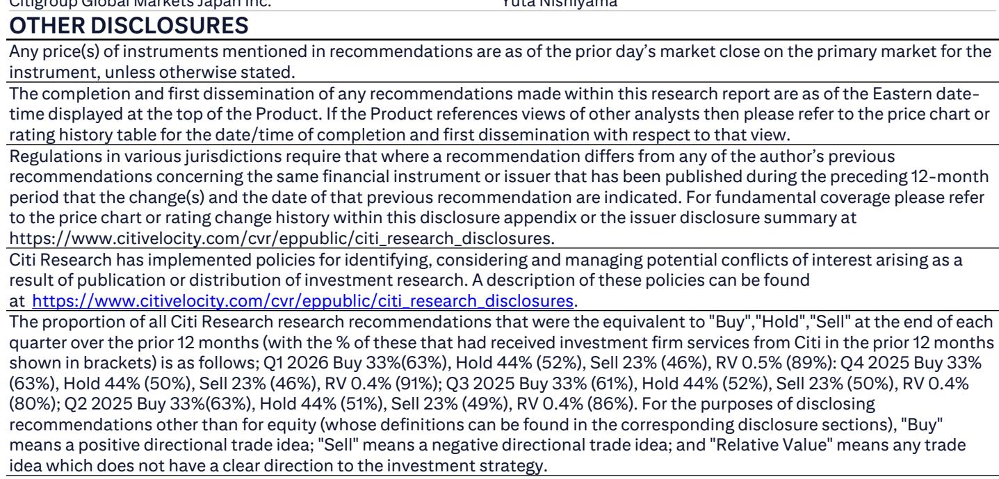
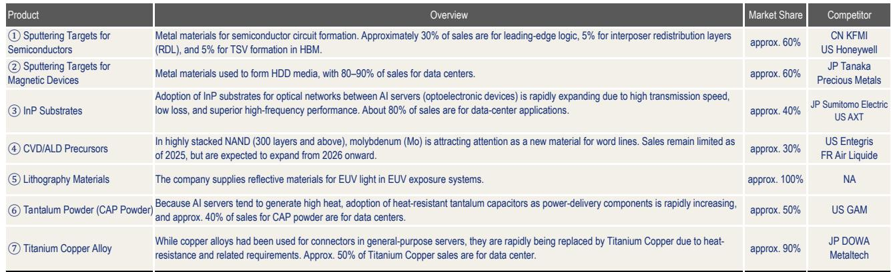
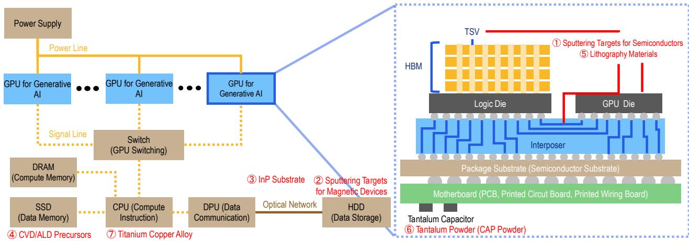

# Japan's Hidden Advantage in the AI Supply Chain Is Its Materials Dominance—But Only If These Companies Learn to Price Like They Innovate

The conventional narrative about artificial intelligence hardware has focused on chip designers, foundries, and hyperscalers. Yet the most strategically important bottleneck in the AI supply chain may not be lithography or architecture. It is the specialized materials that enable the physical infrastructure of AI computing—the substrates, glass cloths, resins, and substrates that make high-speed data transmission, thermal management, and advanced packaging possible. Japan's materials companies dominate these niches with market shares that often exceed 60 percent, and in some cases approach 100 percent. But this technological supremacy masks a strategic vulnerability: a persistent conservatism in pricing and a structural blind spot in understanding downstream demand. The question for investors is whether these firms can overcome their own cultural inertia to capture the full economic value of their position, or whether the opportunity will be squandered through incrementalism.

The AI buildout is entering a new phase. The first phase was about scaling compute through more GPUs and larger data centers. The second phase, now underway, is about optimizing the physical interconnects, packaging, and thermal solutions that determine whether those chips can actually perform at their theoretical limits. This is where materials science becomes the binding constraint. Copper interconnects are giving way to optical transmission within and between servers. Standard packaging substrates are being replaced by advanced materials that can handle higher layer counts and tighter thermal budgets. Glass cloth specifications are shifting from first-generation low-dielectric materials to second and third-generation variants. Each of these transitions represents a multi-billion-dollar market opportunity for the companies that control the enabling materials.

The timing of this shift is critical. The report's interviews with senior management across six Japanese materials companies reveal a consistent picture: AI-related demand is accelerating faster than internal forecasts, capacity expansions are being pulled forward, and new product evaluations are proceeding at an unprecedented pace. This is not a cyclical uptick. It is a structural transformation in the materials composition of computing infrastructure. And Japan's materials companies are, for now, irreplaceable suppliers within that transformation. But irreplaceability is not the same as profitability, and the gap between market position and market capture is where the most interesting investment questions lie.

## Japanese Materials Companies Hold Near-Monopoly Positions in AI-Critical Inputs, but Their Pricing Strategy Lags Far Behind Their Technology

The market structure of AI-related materials is remarkable. Nittobo is effectively the sole global supplier of T-glass, the low-coefficient-of-thermal-expansion glass cloth required for advanced substrates. JX Advanced Metals commands approximately 60 percent market share in semiconductor sputtering targets, 60 percent in magnetic device sputtering targets, 40 percent in InP substrates, and 90 percent in titanium copper alloy for data center connectors. Asahi Kasei's PIMEL redistribution layer material has an extremely high share at key customers, with supply struggling to keep up with demand. Mitsui Kinzoku holds an 80 percent share in HVLP5 copper foil. These are not competitive markets in the traditional sense. They are oligopolies, and in some cases near-monopolies, built on decades of proprietary process engineering and customer qualification cycles that create formidable barriers to entry.

Yet the report notes a persistent frustration among investors: these companies are not aggressive enough in price negotiations. Despite tight supply-demand dynamics and involvement in key AI supply chains, Japanese materials makers still appear conservative in pricing strategy compared with foreign counterparts. This is not a minor behavioral quirk. It is a structural issue that directly impacts return on capital employed, reinvestment incentives, and ultimately shareholder value. When a company holds an 80 percent market share in a product that is essential for AI server manufacturing, and demand is growing at 30-40 percent annually, the pricing power should be extraordinary. The fact that investors perceive these companies as leaving money on the table suggests a cultural or organizational barrier to value capture.

The exception that proves the rule is JX Advanced Metals. The company announced plans to increase InP substrate production capacity by up to ten times through fiscal 2028, citing demand growth of 30-40 percent annually. More importantly, management explicitly noted the importance of pricing strategy, with the report suggesting that negotiations could be geared toward price increases of two to three times. Foreign investors have responded positively, describing this as untypically aggressive capacity expansion and pricing direction for a Japanese company. This is the template that other Japanese materials firms need to follow: align capacity investment with demand visibility, and use capacity tightness as leverage for price increases that reflect the true value of the product.

## The Shift from Electrical to Optical Interconnects Will Create a Step-Change in Demand for Specialty Materials That Most Market Participants Have Not Yet Priced In

The most significant technological inflection point in the AI infrastructure buildout is the transition from electrical to optical transmission within servers and racks. Currently, optical communication is used primarily between racks and between data centers. But from 2028 onward, the report indicates that there could be a transition to optical transmission within servers and within racks. This shift is driven by the fundamental physics of data transmission at higher speeds: electrical interconnects face signal integrity challenges, power dissipation constraints, and bandwidth limitations that optical interconnects can overcome.

For materials companies, this transition has profound implications. Optical transceivers require InP substrates, and JX Advanced Metals is positioning for this demand with its tenfold capacity expansion. But the optical transition also drives demand for low-dielectric materials across the entire signal path. Higher data rates require lower dielectric loss, which means advanced resins, glass cloths, and copper foils. The report notes that AGC's cutting-edge ELL series within its Meteorwave line is being evaluated for 1.6T switches and routers, representing a 224 Gbps per lane data rate. These are not incremental improvements. They represent a generational leap in performance requirements.

The compound effect is striking. Future GPU models are expected to have thermal design powers approximately three times those of current models, with maximum power consumption eight times higher or more. This creates explosive growth in demand for tantalum powder used in tantalum capacitors, as AI servers generate high heat and require heat-resistant power delivery components. JX Advanced Metals estimates that approximately 40 percent of its tantalum powder sales are already for data center applications. As power densities continue to increase, this share will rise, and the absolute market size will grow even faster.

What the market may not fully appreciate is the non-linearity of these demand drivers. The transition from electrical to optical interconnects does not simply add a new product category. It changes the material requirements for the entire system. Substrates that were adequate for electrical signaling become performance-limiting for optical transmission. Glass cloths that met the specifications for 100 Gbps signaling are insufficient for 1.6T applications. The result is a simultaneous upgrade cycle across multiple material categories, creating a demand environment that is far more robust than any single product cycle would suggest.

## The Structural Blind Spot: Upstream Materials Companies Struggle to Gauge Downstream Demand, Creating Both Risk and Opportunity

The report identifies a critical vulnerability that is often overlooked in analyses of Japan's materials sector: the difficulty that upstream materials companies have in discerning demand and technological trends in downstream segments. Many business division managers indicated that while their upstream positions give them high sensitivity to primary customer demand trends, they struggle to understand demand patterns and technology trajectories at the secondary and final customer levels. In some cases, the final application breakout is unknown, and the reasons underlying the magnitude of growth in demand are not clearly understood.

This is not a trivial information gap. It has direct implications for capacity planning, R&D prioritization, and pricing strategy. If a company does not fully understand why its customers are ordering more product, it cannot distinguish between sustainable structural demand and temporary inventory building. The risk of over-investing in capacity during a demand surge, only to face oversupply when the cycle turns, is real. Conversely, the risk of under-investing and ceding market share to competitors who move faster is equally problematic.

The report suggests that improvements to capabilities for gauging downstream trends should facilitate early moves on next-generation product development and accurate assessment of underlying demand. This is correct but incomplete. The challenge is not simply one of data collection. It is one of organizational capability and strategic mindset. Upstream materials companies have historically focused on process excellence and customer relationships with direct buyers. Developing the capability to understand end-market dynamics requires different analytical frameworks, different talent, and different incentive structures.

This is where the opportunity lies for investors who can identify which companies are making progress on this front. Asahi Kasei's combination of fiber and chemicals technologies gives it a unique vantage point, as it participates in both the glass cloth and the resin markets. Mitsubishi Gas Chemical's progress in developing RS material for FC-BGA packaging suggests a sophisticated understanding of semiconductor packaging trends. But the report leaves open the question of whether these capabilities are systematic or idiosyncratic. It also does not address whether the industry structure itself—fragmented across multiple specialized companies—inhibits the development of downstream visibility.

## A Decision Framework for Investors: Four Questions to Evaluate Japanese Materials Companies in the AI Supply Chain

The report provides rich qualitative evidence but does not offer a structured framework for investment decision-making. Based on the material presented, four questions emerge as critical differentiators.

First, what is the company's pricing strategy, and is it aligned with market power? The report makes clear that pricing conservatism is a systemic issue, but JX Advanced Metals demonstrates that change is possible. Investors should evaluate whether management explicitly discusses pricing as a strategic lever, whether recent price increases have been implemented, and whether capacity expansion announcements are accompanied by pricing language. Companies that treat pricing as a passive outcome of market conditions are likely to underperform those that treat it as an active value capture mechanism.

Second, does the company have visibility into downstream demand, and how is it improving that visibility? The report identifies this as a structural weakness. Companies that are investing in downstream analytics, building closer relationships with end customers, or participating in multiple layers of the supply chain are better positioned to make informed capacity and R&D decisions. The risk of order duplication and subsequent oversupply is real, and companies with better downstream visibility can navigate this risk more effectively.

Third, is the company's technology position sustainable, and what are the substitution risks? The report discusses several substitution dynamics. PTFE threatens low-Dk glass but faces adoption hurdles related to rigidity and lamination. Hydrocarbon and PPE resins are competing with PTFE in some applications. Third-generation low-Dk glass (NEZ-glass) may not be required if resin technology advances sufficiently. Investors need to assess whether a company's technology moat is widening or narrowing. Nittobo's position in T-glass appears uniquely defensible, but its position in NER-glass faces increasing competition from overseas suppliers.

Fourth, is the company investing sufficiently in capacity to capture the demand opportunity? The report highlights significant capacity expansion plans at JX Advanced Metals and Asahi Kasei, but the question is whether other companies are keeping pace. Nittobo may need to look at further capacity expansion in T-glass, given tightening supply-demand. Mitsubishi Gas Chemical is making progress in securing alternative glass suppliers. The companies that invest aggressively in capacity, while maintaining pricing discipline, are likely to capture disproportionate share of the AI-related demand growth.

## What the Report Does Not Fully Answer: The Sustainability of Japan's Materials Advantage and the Threat of Competitive Entry

The report provides compelling evidence of Japan's current dominance in AI-related materials. But it leaves several important questions unanswered. The most significant is the sustainability of this advantage. The report notes that in low-Dk glass, overseas competitors have been making up ground sooner than expected. Nittobo's management commented that this catching-up was not necessarily unfavorable from an overall market perspective, given that the market was expected to expand beyond the size where Nittobo alone could handle all supply. This is a diplomatic way of acknowledging that competition is coming.

The question is whether the competitive threat is manageable or existential. Japanese materials companies have historically benefited from long customer qualification cycles, proprietary process know-how, and deep relationships with Japanese equipment and chemical suppliers. These advantages are not easily replicated. But they are not permanent either. Chinese competitors in particular have demonstrated an ability to scale quickly in semiconductor materials, often with government support and a willingness to accept lower initial margins. The report does not provide a framework for assessing the speed or likelihood of competitive entry in specific product categories.

Another open question is the impact of potential technology discontinuities. The report discusses PTFE as a potential substitute for low-Dk glass, while noting the adoption hurdles. But there are other technology pathways that could disrupt incumbent materials positions. The development of new resin systems could reduce the performance requirements for glass cloth. Advances in packaging technology could change the material requirements for substrates. The report provides snapshots of current technology trends but does not model the probability or timing of alternative technology pathways.

Finally, the report does not address the macroeconomic and geopolitical risks that could affect Japanese materials companies. Export controls, supply chain localization requirements, and shifts in data center investment patterns could all impact demand. The concentration of AI infrastructure investment in a small number of hyperscalers creates customer concentration risk. And the possibility of a cyclical downturn in semiconductor demand, even if temporary, could test the pricing discipline that the report advocates.

These unanswered questions are not weaknesses of the report. They are the natural boundaries of any research effort. But they also represent the analytical frontier for investors who want to develop a differentiated view. The companies that can sustain their technological advantage, improve their downstream visibility, and adopt more aggressive pricing strategies are likely to be the long-term winners. Identifying those companies requires going beyond the report's qualitative assessments and developing proprietary frameworks for evaluating competitive dynamics and technology trajectories.

Join the community to read the full report and review the original charts.

*This article is for learning and discussion only and does not constitute investment advice.*

Personal reading notes and learning share only. Not investment advice.

