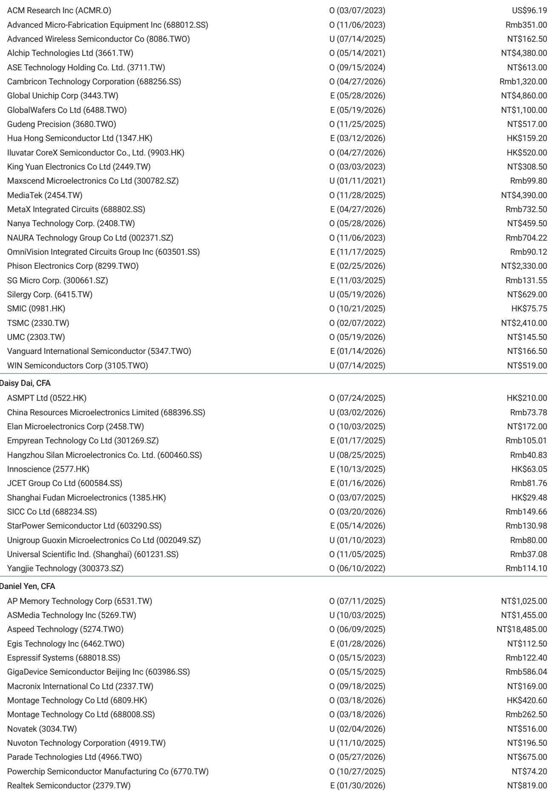
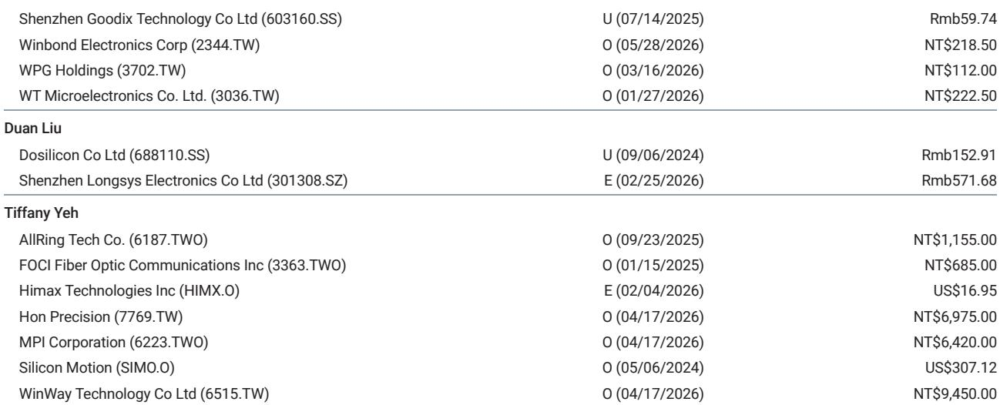
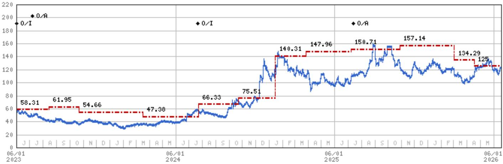

# 摩根斯坦利：MS：MCU涨价不是需求回暖，是供给被AI“挤”出来的

MCU现货价格在6月走平，但这只是暴风雨前的宁静。MS最新研报发出明确信号：下半年MCU价格将再次上涨，但驱动因素并非终端需求复苏，而是成熟制程产能被AI相关应用大量挤占。这是半导体周期中一种罕见的“无需求复苏的涨价”，对产业格局和投资逻辑的影响需要重新审视。

这份由Daniel Yen、Charlie Chan等分析师联合撰写的报告，在6月21日更新了对大中华区MCU市场的判断。核心结论清晰而克制：供给紧张将在下半年持续，现货价格有望再次上行，但最终用户需求并未明显改善。这意味着，当前的价格上涨更多是成本推动和渠道补库，而非终端拉动的健康循环。

对于关注半导体周期的投资者来说，这是一个需要警惕的信号。当涨价不是来自需求扩张，而是来自供给收缩，企业的议价能力和利润持续性将出现显著分化。MS在报告中对不同MCU厂商给出了截然不同的评级，正是基于对这一结构性差异的判断。

## 1. 这轮涨价的核心驱动力不是需求，而是AI对成熟制程产能的挤出

MS报告中最反直觉的判断是：MCU涨价并非下游需求回暖的结果。6月现货价格环比持平，STMicro的32位MCU现货价维持在12.8元人民币，GigaDevice同规格产品为8.5元人民币，均未出现明显波动。同时，报告明确指出“消费和工业终端需求与上月基本持平”。

那么涨价动力来自哪里？答案是供给端。成熟制程代工厂正在将更多产能分配给AI电源相关应用。这是一个容易被忽视但影响深远的结构性变化。当台积电、联电等代工厂的成熟制程产能被AI基础设施的电源管理芯片、驱动芯片等持续占用，留给MCU设计公司的产能空间就被压缩了。而新产能上线有限，供给紧张局面在下半年难以缓解。

这意味着一件事：MCU行业正在经历一次“被动涨价”。设计公司不得不将代工厂涨价的成本向下游传导，而非因为产品供不应求而主动提价。两种涨价的利润含金量完全不同。

> **KC评论：** 理解这个区别很重要。需求驱动的涨价，企业可以同步提升毛利率；成本推动的涨价，毛利率可能不变甚至被压缩。投资者需要关注的不是“价格涨了没有”，而是“涨价之后利润留在了谁手里”。完整报告中对各家公司的成本结构和代工议价能力有更细致的拆解，值得仔细比对。

## 2. 渠道补库放大了价格信号，终端真实需求仍待验证

报告提到一个关键细节：分销商的采购意愿在增强，原因是“库存低和对下半年进一步涨价的担忧”。这解释了为何在终端需求持平的情况下，现货市场仍然可能出现价格上涨。

渠道补库是一个典型的“二阶效应”。当分销商预期未来涨价时，他们会提前采购、增加库存，这种行为本身就会推高短期价格，形成一种自我实现的涨价预期。但这与终端消费者真正购买产品、消耗库存的“真实需求”是两回事。

MS对此保持清醒：报告虽然预期下半年现货价格再次上涨，但明确强调驱动因素是“供给紧张和代工成本上升，而非需求”。这意味着，如果终端需求始终没有起色，渠道补库带来的涨价将是不可持续的。一旦补库周期结束，价格可能面临回调压力。

对于产业链参与者来说，这个判断意味着需要区分“价格信号”和“需求信号”。当前的价格上涨更多是前者，后者尚未确认。

## 3. 大厂和WiFi MCU厂商是结构性赢家，而新唐科技需要等待毛利率修复

在供给紧张、成本上升的环境中，不同MCU厂商的处境截然不同。MS明确表达了偏好：大型MCU厂商（如GigaDevice）和WiFi MCU厂商（如乐鑫科技）因其在边缘AI领域的长期机会而获得青睐。

这背后的逻辑是：当涨价是成本推动而非需求拉动时，企业的规模优势和产品差异化能力成为关键。GigaDevice作为国内MCU龙头，在供应链议价、产品组合和客户基础上具有明显优势，能够更好地消化成本压力甚至维持利润。乐鑫科技则受益于WiFi MCU在AIoT和边缘计算中的结构性增长，其产品具有更高的附加值和定价权。

相比之下，MS对新唐科技维持“低配”评级，理由是“等待毛利率恢复后再转为更积极的看法”。这是一个明确的信号：在当前环境下，毛利率承压的公司面临更大风险。新唐科技需要证明其有能力在成本上升的环境中恢复盈利水平，否则将被市场边缘化。

> **KC评论：** MS对不同MCU公司的差异化评级，本质上是在回答一个问题：在“无需求复苏的涨价”中，谁有定价权，谁没有？这个问题的答案决定了哪些公司能真正受益于涨价周期，哪些只是被动跟随。完整报告中对各家公司的估值模型和风险因素有详细展开，特别是对GigaDevice和乐鑫科技的边缘AI机会有更深度的分析。

## 4. 报告尚未完全回答的关键问题：涨价能持续多久，以及终端需求何时恢复

MS这份报告给出了清晰的短期判断，但有两个关键问题仍有待验证。

第一个问题是涨价的持续性。供给紧张在2026年下半年难以缓解，这支持价格继续上行。但如果终端需求始终疲软，渠道补库的动能能持续多久？一旦分销商库存达到合理水平，价格是否会出现快速回落？报告没有给出明确的时间表。

第二个问题是终端需求何时恢复。报告指出消费和工业终端需求“基本持平”，但没有深入分析需求疲软的原因——是宏观经济压力、库存消化周期，还是产品换代节奏？更重要的是，没有给出需求恢复的催化剂或时间预期。这意味着当前的投资逻辑高度依赖供给侧的判断，一旦供给格局发生变化，整个故事可能需要重写。

这些问题不是报告的缺陷，而是任何前瞻性分析都必须面对的边界。它们恰恰是投资者需要持续跟踪和判断的核心变量。

## 5. 对投资者的观察框架：从“价格涨跌”转向“利润分配”

基于MS这份报告，可以提炼出一个更实用的分析框架。在“供给紧张、需求平淡”的MCU周期中，传统上关注“价格是否上涨”已经不够，需要转向三个更深层的问题：

第一，成本传导能力。哪家公司能将代工成本上涨完全转嫁给客户？这取决于产品差异化程度、客户粘性和竞争格局。GigaDevice和乐鑫科技在这方面具有优势。

第二，毛利率韧性。在成本上涨的环境中，毛利率能否维持甚至提升？这需要分析公司的产品结构、规模效应和成本控制能力。新唐科技被MS列为低配，正是因为其毛利率恢复存在不确定性。

第三，长期结构性机会。即使短期周期波动，哪些公司在AIoT、边缘计算等长期趋势中占据有利位置？MS对GigaDevice和乐鑫科技的看好，很大程度上是基于其边缘AI的长期逻辑，而非短期涨价周期。

这个框架可以帮助投资者在MCU板块中做出更精细的区分，而不是简单地将所有公司归为“受益于涨价”或“受损于涨价”。

---

MS这份报告的价值在于，它提供了一个清晰的周期定位和差异化分析框架。但正如报告自身所承认的，终端需求的恢复时间仍不确定，涨价周期的持续性和利润分配格局也有待验证。这些正是需要持续跟踪和深度讨论的问题。

在我们的社群中，每天会由AI agent和人工review生成国际投行中文摘要与KC评论，日更新约10-40页，并整理当天最新数据图表合集，既方便喂给AI，也方便人工快速把握market dynamics。如果你对MCU周期的后续演变、各家公司的毛利率走势，或者边缘AI的长期机会有进一步兴趣，欢迎来星球和微信群中继续讨论。

Personal reading notes and learning share only. Not investment advice.

