## One-stop Outlook 2026 Mid-Year Check-In

June 2026

Andrew Casella | Ryan Dowling | Miles Highsmith | Aaron Watts | Sean-M Wondrack
Brett Ryan | Steve Caprio | Karthik Nagalingam

\- US HY Research - Organizational Structure and Contact Info 3
- Introduction | 2026 Mid-Year Check-in 4
- Single-Name Top Picks - Summary 5
- Single-Name Top Picks – Potential Total Return Categorization by Ticker 6
- Topical Datasite Names – Aggregate Table 7
- US Economics 8
- Growth: Oil drag versus fiscal and FCI boost 9
- Labor market: Growing confidence in stabilization 10
- Inflation: Another year well above target 11
- Risks to our outlook... 12
- DB US Forecast Summary 13
- Strategy Outlook 14
- Nimble? More dispersion is coming 15
- Technicals remain strong, which can moderate \$HY spread widening 16
- US recession probability remains low, even as pockets of weakness will lead to dispersion 17
- A US Software glitch can materially tighten funding markets 18
- \$HY Ratings: Mind \$B3 downgrade risks 20
- Which sectors are more exposed to defaults and fundamental risks? 21
- Consumer and Retail 23
- Key Themes in Consumer 24
- Crocs Inc. (CROX) – Apparel 25
- Dave & Buster's (PLAY) – Restaurants 26

■ Healthcare
• Still Many Moving Parts
• Community Health Systems, Inc. (CYH) – Healthcare
■ Industrials
• U.S. Building Products | Residential and Non-residential – 2026 Outlook
• Bristow (VTOL) – Aerospace & Defense
• Park River Holdings Inc. (a/k/a Primesource) (PRIMBP) – Building Products
• Iris Holding, Inc. (a/k/a Intertape Polymer Group) (ITPCN) - Packaging
• Whirlpool Corporation (WHR) – Building Products
• Media / Business Services
• HY Media Mid-Year 2026 Outlook
• Gray Television (GTN) – TV Broadcaster
• iHeart Media (IHRT) – Radio Broadcasting
• Rental Services, Auto Suppliers and Metals & Mining
• Equipment Rental Services – 2026 Mid-year Outlook
• Herc Rentals (HRI) – Rental Services
• EquipmentShare (EQPT, EQMSRM) – Rental Services
• Auto Suppliers – 2026 Mid-year Outlook
• Rivian Automotive (RIVN, RIVHOL) – Automotive Suppliers
• Datasite Issuers
• Cox Media (CMGMCO) – TV Broadcasting – Datasite
• Global Auto Holdings (GLOBAU) (B3,B+) – Automotive Suppliers - Datasite
• Lifepoint Health, Inc. (RGCARE) – Healthcare - Datasite
• R1 RCM, Inc. (RCM) – Healthcare – Debt domain
• Shearer’s Foods (SHEARE) – Food & Beverage - Debtdomain
• U.S. Acute Care Solutions, Inc. (USACUT) – Healthcare - Intralinks

Andrew Casella, CFA
Head of US HY Research
(212) 250-0777
Industrials
Building Products, Packaging,
Chemicals,
General Industrials

Aaron Watts
Managing Director
(212) 250-2592
Media, Cable,
Satellites, Business
Services

Miles Highsmith
Managing Director
(212) 250-1606
Healthcare

Sean Wondrack
Director
(212) 250-8980
Metals, Mining,
Rentals, Auto
Suppliers

Marisa Moss
Director
(212) 250-8113
Energy & Utilities

Harsha Mohan
Associate
(212) 250-2599
Media, Cable,
Satellites, Business
Services

Anna Yang
Vice President
(212) 250-9980
Gaming, Lodging,
Leisure

Ryan Dowling
Vice President
(212) 250-4549
Food/Bev, Consumer,
Retail, Restaurants

Angeline Mathew
Vice President
(212) 250-3328
FIG & Technology

Amelia Srebnik
Analyst
(212) 250-0775
Building Products,
Packaging, Chemicals,
General Industrials

We have structured our 2026 Mid-Year Check-in as follows:

\- Updating 2026's macroeconomic framework: We have included updated summaries of the respective 2026 outlooks from DB's US Economics and US HY Credit Strategy teams. These are meant to refresh from our 2026 outlook (released in December 2025).

\- High-conviction single-name credit ideas and brief sector overviews: Each of the HY sector analysts have provided a high-level sector outlook, followed by their highest-conviction and published, single-name ideas. These have been put into three one-year potential total return baskets: 5-9.99%, 10-14.99% and >15%.

\- Topical VDR names: We have included a section to highlight what the HY analyst team has considered to be the most topical datasite-based (i.e. private) corporate issuers amongst our clients. As a reminder, these are not formally covered securities due to financial data confidentiality obligations with the respective issuers.

■ General housekeeping: All pricing is as of 6/16/26, unless noted otherwise, and all term loans have been priced with the swapped curve.

The US HY Research team has extensive knowledge across both public and private (datasite) names, across both HY bonds and broadly-syndicated loan. As always, the team is ready and available to assist clients navigate what has already been an eventful 2026.

Andrew Casella
Head of US HY Research

<table><tr><td>Analyst</td><td>DB Rec</td><td>BBG Ticker</td><td>Ranking/ Seniority</td><td>Coupon</td><td>Amt O/S</td><td>Maturity</td><td>Price</td><td>YTW/YTM</td><td>DM / OAS</td><td>Mdy&#x27;s/ S&amp;P</td></tr><tr><td>Aaron Watts</td><td>HOLD</td><td>*GTN</td><td>1L</td><td>S+300</td><td>$739</td><td>12/1/2028</td><td>100.250</td><td>6.92%</td><td>292</td><td>Ba3 / B+</td></tr><tr><td>Aaron Watts</td><td>HOLD</td><td>*GTN</td><td>1L</td><td>10.500%</td><td>$1,125</td><td>7/15/2029</td><td>105.625</td><td>5.09%</td><td>139</td><td>Ba3 / B+</td></tr><tr><td>Aaron Watts</td><td>NR</td><td>*GTN</td><td>1L</td><td>7.250%</td><td>$775</td><td>8/15/2033</td><td>97.500</td><td>7.71%</td><td>337</td><td>Ba3 / B+</td></tr><tr><td>Aaron Watts</td><td>BUY</td><td>*GTN</td><td>2L</td><td>9.625%</td><td>$900</td><td>7/15/2032</td><td>95.250</td><td>10.69%</td><td>643</td><td>B3 / CCC</td></tr><tr><td>Aaron Watts</td><td>BUY</td><td>*GTN</td><td>Sr Unsec&#x27;d</td><td>4.750%</td><td>$790</td><td>10/15/2030</td><td>71.750</td><td>13.61%</td><td>944</td><td>Caa1 / CCC</td></tr><tr><td>Aaron Watts</td><td>BUY</td><td>*GTN</td><td>Sr Unsec&#x27;d</td><td>5.375%</td><td>$1,220</td><td>11/15/2031</td><td>69.625</td><td>13.46%</td><td>923</td><td>Caa1 / CCC</td></tr><tr><td>Aaron Watts</td><td>BUY</td><td>*IHRT</td><td>1L</td><td>S +577.5</td><td>$2,119</td><td>5/1/2029</td><td>95.750</td><td>11.47%</td><td>753</td><td>Caa1/CCC+</td></tr><tr><td>Aaron Watts</td><td>BUY</td><td>*IHRT</td><td>1L</td><td>4.750%</td><td>$277</td><td>1/15/2028</td><td>96.250</td><td>7.42%</td><td>343</td><td>Caa1/CCC+</td></tr><tr><td>Aaron Watts</td><td>BUY</td><td>*IHRT</td><td>1L</td><td>9.125%</td><td>$718</td><td>5/1/2029</td><td>97.750</td><td>10.09%</td><td>596</td><td>Caa1/CCC+</td></tr><tr><td>Aaron Watts</td><td>BUY</td><td>*IHRT</td><td>1L</td><td>7.750%</td><td>$661</td><td>8/15/2030</td><td>93.500</td><td>9.72%</td><td>555</td><td>Caa1/CCC+</td></tr><tr><td>Aaron Watts</td><td>BUY</td><td>*IHRT</td><td>1L</td><td>7.000%</td><td>$178</td><td>1/15/2031</td><td>89.375</td><td>10.04%</td><td>584</td><td>Caa1/CCC+</td></tr><tr><td>Aaron Watts</td><td>BUY</td><td>*IHRT</td><td>2L</td><td>10.875%</td><td>$675</td><td>5/1/2030</td><td>86.500</td><td>15.70%</td><td>1,153</td><td>Caa3/CCC-</td></tr><tr><td>Andrew Casella</td><td>BUY</td><td>VTOL</td><td>1L</td><td>6.750%</td><td>$500</td><td>2/1/2033</td><td>101.125</td><td>6.47%</td><td>199</td><td>Ba3/BB</td></tr><tr><td>Andrew Casella</td><td>BUY</td><td>PRIMBP</td><td>1L</td><td>S+450</td><td>$1,020</td><td>3/17/2031</td><td>99.875</td><td>8.34%</td><td>453</td><td>B3/B-</td></tr><tr><td>Andrew Casella</td><td>BUY</td><td>PRIMBP</td><td>1L</td><td>8.000%</td><td>$800</td><td>3/15/2031</td><td>101.250</td><td>7.39%</td><td>305</td><td>B3/B-</td></tr><tr><td>Andrew Casella</td><td>BUY</td><td>PRIMBP</td><td>2L</td><td>8.750%</td><td>$538</td><td>12/31/2030</td><td>98.125</td><td>9.25%</td><td>492</td><td>Caa2/CCC</td></tr><tr><td>Andrew Casella</td><td>BUY</td><td>ITPCN</td><td>1L</td><td>S+475</td><td>$1,448</td><td>6/28/2028</td><td>95.625</td><td>11.21%</td><td>718</td><td>B3/B-</td></tr><tr><td>Andrew Casella</td><td>BUY</td><td>ITPCN</td><td>Sr Unsec&#x27;d</td><td>10.000%</td><td>$400</td><td>12/15/2028</td><td>88.250</td><td>15.89%</td><td>1,179</td><td>Caa3/CCC</td></tr><tr><td>Andrew Casella</td><td>BUY</td><td>WHR</td><td>2L</td><td>7.500%</td><td>$1,000</td><td>7/1/2031</td><td>101.625</td><td>7.02%</td><td>288</td><td>Ba1/BB+</td></tr><tr><td>Andrew Casella</td><td>BUY</td><td>WHR</td><td>2L</td><td>7.875%</td><td>$1,000</td><td>7/1/2034</td><td>101.125</td><td>7.60%</td><td>342</td><td>Ba1/BB+</td></tr><tr><td>Andrew Casella</td><td>SELL</td><td>WHR</td><td>Sr Unsec&#x27;d</td><td>4.750%</td><td>$700</td><td>2/26/2029</td><td>94.375</td><td>7.08%</td><td>299</td><td>B2/B+</td></tr><tr><td>Andrew Casella</td><td>SELL</td><td>WHR</td><td>Sr Unsec&#x27;d</td><td>6.125%</td><td>$600</td><td>6/15/2030</td><td>93.625</td><td>8.00%</td><td>386</td><td>B2/B+</td></tr><tr><td>Andrew Casella</td><td>SELL</td><td>WHR</td><td>Sr Unsec&#x27;d</td><td>2.400%</td><td>$300</td><td>5/15/2031</td><td>75.125</td><td>8.75%</td><td>458</td><td>B2/B+</td></tr><tr><td>Andrew Casella</td><td>SELL</td><td>WHR</td><td>Sr Unsec&#x27;d</td><td>4.700%</td><td>$300</td><td>5/14/2032</td><td>79.625</td><td>9.24%</td><td>500</td><td>B2/B+</td></tr><tr><td>Andrew Casella</td><td>SELL</td><td>WHR</td><td>Sr Unsec&#x27;d</td><td>5.500%</td><td>$300</td><td>3/1/2033</td><td>80.250</td><td>9.56%</td><td>527</td><td>B2/B+</td></tr><tr><td>Andrew Casella</td><td>SELL</td><td>WHR</td><td>Sr Unsec&#x27;d</td><td>6.500%</td><td>$600</td><td>6/15/2033</td><td>88.500</td><td>8.73%</td><td>443</td><td>B2/B+</td></tr><tr><td>Andrew Casella</td><td>SELL</td><td>WHR</td><td>Sr Unsec&#x27;d</td><td>5.750%</td><td>$300</td><td>3/1/2034</td><td>79.250</td><td>9.62%</td><td>528</td><td>B2/B+</td></tr><tr><td>Andrew Casella</td><td>SELL</td><td>WHR</td><td>Sr Unsec&#x27;d</td><td>5.150%</td><td>$250</td><td>3/1/2043</td><td>63.875</td><td>9.50%</td><td>471</td><td>B2/B+</td></tr><tr><td>Andrew Casella</td><td>SELL</td><td>WHR</td><td>Sr Unsec&#x27;d</td><td>4.500%</td><td>$500</td><td>6/1/2046</td><td>60.250</td><td>8.74%</td><td>378</td><td>B2/B+</td></tr><tr><td>Andrew Casella</td><td>SELL</td><td>WHR</td><td>Sr Unsec&#x27;d</td><td>4.600%</td><td>$500</td><td>5/15/2050</td><td>59.750</td><td>8.59%</td><td>364</td><td>B2/B+</td></tr><tr><td>Andrew Casella</td><td>BUY</td><td>WHRCORP SR 5Y</td><td></td><td>Spread:</td><td>441</td><td></td><td></td><td></td><td></td><td></td></tr></table>

<table><tr><td>Analyst</td><td>DB Rec</td><td>BBG Ticker</td><td>Ranking/ Seniority</td><td>Coupon</td><td>Amt O/S</td><td>Maturity</td><td>Price</td><td>YTW/YTM</td><td>DM / OAS</td><td>Mdy&#x27;s/ S&amp;P</td></tr><tr><td>Miles Highsmith</td><td>BUY</td><td>CYH</td><td>1L</td><td>6.000%</td><td>$644</td><td>1/15/2029</td><td>99.375</td><td>6.29%</td><td>199</td><td>Caa1 / B-</td></tr><tr><td>Miles Highsmith</td><td>BUY</td><td>CYH</td><td>1L</td><td>5.250%</td><td>$1,535</td><td>5/15/2030</td><td>94.250</td><td>6.94%</td><td>280</td><td>Caa1 / B-</td></tr><tr><td>Miles Highsmith</td><td>BUY</td><td>CYH</td><td>1L</td><td>4.750%</td><td>$689</td><td>2/15/2031</td><td>91.750</td><td>6.83%</td><td>267</td><td>Caa1 / B-</td></tr><tr><td>Miles Highsmith</td><td>BUY</td><td>CYH</td><td>1L</td><td>10.875%</td><td>$1,549</td><td>1/15/2032</td><td>107.750</td><td>6.86%</td><td>278</td><td>Caa1 / B-</td></tr><tr><td>Miles Highsmith</td><td>BUY</td><td>CYH</td><td>1L</td><td>10.750%</td><td>$700</td><td>6/15/2033</td><td>107.250</td><td>9.16%</td><td>487</td><td>Caa1 / B-</td></tr><tr><td>Miles Highsmith</td><td>BUY</td><td>CYH</td><td>1L</td><td>9.750%</td><td>$1,790</td><td>1/15/2034</td><td>104.625</td><td>8.42%</td><td>399</td><td>Caa1 / B-</td></tr><tr><td>Miles Highsmith</td><td>HOLD</td><td>CYH</td><td>2L</td><td>6.875%</td><td>$1,244</td><td>4/15/2029</td><td>98.750</td><td>7.37%</td><td>315</td><td>Caa3 / CCC-</td></tr><tr><td>Miles Highsmith</td><td>HOLD</td><td>CYH</td><td>2L</td><td>6.125%</td><td>$1,227</td><td>4/1/2030</td><td>90.250</td><td>9.22%</td><td>510</td><td>Caa3 / CCC-</td></tr><tr><td>Miles Highsmith</td><td>HOLD</td><td>CYH</td><td>Sr. Unsec&#x27;d</td><td>6.875%</td><td>$42</td><td>4/1/2028</td><td>97.000</td><td>8.71%</td><td>468</td><td>Ca / CCC-</td></tr><tr><td>Ryan Dowling</td><td>BUY</td><td>PLAY</td><td>1L</td><td>S + 325</td><td>$691</td><td>6/29/2029</td><td>85.625</td><td>12.66%</td><td>901</td><td>B3/B-</td></tr><tr><td>Ryan Dowling</td><td>BUY</td><td>PLAY</td><td>1L</td><td>S + 325</td><td>$690</td><td>10/31/2031</td><td>79.375</td><td>12.33%</td><td>868</td><td>B3/B-</td></tr><tr><td>Ryan Dowling</td><td>BUY</td><td>CROX</td><td>1L</td><td>S + 225</td><td>$500</td><td>2/20/2029</td><td>100.625</td><td>5.66%</td><td>199</td><td>Ba1/BBB-</td></tr><tr><td>Ryan Dowling</td><td>BUY</td><td>CROX</td><td>Sr. Unsec&#x27;d</td><td>4.250%</td><td>$350</td><td>3/15/2029</td><td>97.500</td><td>5.24%</td><td>113</td><td>Ba3/BB</td></tr><tr><td>Ryan Dowling</td><td>BUY</td><td>CROX</td><td>Sr. Unsec&#x27;d</td><td>4.125%</td><td>$350</td><td>8/15/2031</td><td>94.000</td><td>5.46%</td><td>127</td><td>Ba3/BB</td></tr><tr><td>Sean Wondrack</td><td>BUY</td><td>HRI</td><td>1L</td><td>S+175</td><td>$748</td><td>6/2/2032</td><td>100.125</td><td>3.12%</td><td>172</td><td>Baa3 / BBB-</td></tr><tr><td>Sean Wondrack</td><td>BUY</td><td>HRI</td><td>Sr. Unsec&#x27;d</td><td>6.625%</td><td>$800</td><td>6/15/2029</td><td>102.500</td><td>5.28%</td><td>109</td><td>Ba3 / BB-</td></tr><tr><td>Sean Wondrack</td><td>BUY</td><td>HRI</td><td>Sr. Unsec&#x27;d</td><td>7.000%</td><td>$1,650</td><td>6/15/2030</td><td>103.875</td><td>5.59%</td><td>125</td><td>Ba3 / BB-</td></tr><tr><td>Sean Wondrack</td><td>BUY</td><td>HRI</td><td>Sr. Unsec&#x27;d</td><td>5.750%</td><td>$600</td><td>3/15/2031</td><td>100.125</td><td>5.72%</td><td>139</td><td>Ba3 / BB-</td></tr><tr><td>Sean Wondrack</td><td>BUY</td><td>HRI</td><td>Sr. Unsec&#x27;d</td><td>7.250%</td><td>$1,100</td><td>6/15/2033</td><td>104.625</td><td>5.94%</td><td>141</td><td>Ba3 / BB-</td></tr><tr><td>Sean Wondrack</td><td>BUY</td><td>HRI</td><td>Sr. Unsec&#x27;d</td><td>6.000%</td><td>$600</td><td>3/15/2034</td><td>99.375</td><td>6.10%</td><td>149</td><td>Ba3 / BB-</td></tr><tr><td>Sean Wondrack</td><td>BUY</td><td>EQMSRM</td><td>2L</td><td>9.000%</td><td>$1,040</td><td>5/15/2028</td><td>103.375</td><td>5.19%</td><td>136</td><td>B3 / B</td></tr><tr><td>Sean Wondrack</td><td>BUY</td><td>EQMSRM</td><td>2L</td><td>8.625%</td><td>$600</td><td>5/15/2032</td><td>104.875</td><td>6.76%</td><td>235</td><td>B3 / B</td></tr><tr><td>Sean Wondrack</td><td>BUY</td><td>EQMSRM</td><td>2L</td><td>8.000%</td><td>$500</td><td>3/15/2033</td><td>103.625</td><td>6.74%</td><td>227</td><td>B3 / B</td></tr><tr><td>Sean Wondrack</td><td>BUY</td><td>RIVHOL</td><td>1L HoldCo</td><td>10.000%</td><td>$1,250</td><td>1/15/2031</td><td>99.500</td><td>10.12%</td><td>584</td><td>N/A / N/A</td></tr></table>

Sources: Bloomberg Finance LP and DB \* Indicates pricing from EOD 6/17/26

<table><tr><td colspan="3">Potential Total Return Categorization by Ticker</td></tr><tr><td>Carry/low-beta5% - 9.99%</td><td>Moderate risk/mid-beta10% - 14.99%</td><td>Higher risk/high-beta&gt;15%</td></tr><tr><td>CROX</td><td>EQMSRM</td><td>WHR 5Y CDS</td></tr><tr><td>CYH</td><td>GTN</td><td></td></tr><tr><td>IHRT</td><td>HRI</td><td></td></tr><tr><td>PRIMBP</td><td>ITPCN</td><td></td></tr><tr><td>VTOL</td><td>PLAY</td><td></td></tr><tr><td></td><td>RIVHOL</td><td></td></tr><tr><td></td><td>WHR Bonds</td><td></td></tr></table>

<table><tr><td>Analyst</td><td>DB Rec</td><td>BBG Ticker</td><td>Ranking/ Seniority</td><td>Coupon</td><td>Amt O/S</td><td>Maturity</td><td>Price</td><td>YTW/YTM</td><td>STW</td><td>Mdy&#x27;s/ S&amp;P</td></tr><tr><td>Aaron Watts</td><td>NR</td><td>*CMGMCO</td><td>1L</td><td>S+350</td><td>$1.82bn</td><td>6/18/2029</td><td>90.000</td><td>11.23%</td><td>737</td><td>B3/B</td></tr><tr><td>Aaron Watts</td><td>NR</td><td>*CMGMCO</td><td>2L</td><td>8.875%</td><td>$574mm</td><td>6/18/2029</td><td>74.500</td><td>20.77%</td><td>1668</td><td>Caa3/CCC</td></tr><tr><td>Miles Highsmith</td><td>NR</td><td>RGCARE</td><td>1L</td><td>9.875%</td><td>$800</td><td>8/15/2030</td><td>105.625</td><td>4.89%</td><td>121</td><td>B2 / B</td></tr><tr><td>Miles Highsmith</td><td>NR</td><td>RGCARE</td><td>1L</td><td>7.000%</td><td>$1,500</td><td>5/1/2034</td><td>97.125</td><td>7.49%</td><td>300</td><td>B2 / B</td></tr><tr><td>Miles Highsmith</td><td>NR</td><td>RGCARE</td><td>Sr. Unsec&#x27;d</td><td>5.375%</td><td>$500</td><td>1/15/2029</td><td>96.000</td><td>7.11%</td><td>302</td><td>Caa1 / CCC+</td></tr><tr><td>Miles Highsmith</td><td>NR</td><td>RGCARE</td><td>Sr. Unsec&#x27;d</td><td>10.000%</td><td>$800</td><td>6/1/2032</td><td>101.750</td><td>9.31%</td><td>489</td><td>Caa1 / CCC+</td></tr><tr><td>Miles Highsmith</td><td>NR</td><td>RCM</td><td>Secured</td><td>6.875%</td><td>$1,300</td><td>11/15/2031</td><td>98.375</td><td>7.24%</td><td>287</td><td>B3/B-</td></tr><tr><td>Miles Highsmith</td><td>NR</td><td>USACUT</td><td>1L</td><td>9.750%</td><td>$1,000</td><td>5/15/2029</td><td>96.875</td><td>11.00%</td><td>691</td><td>B3 / B-</td></tr><tr><td>Ryan Dowling</td><td>NR</td><td>SHEARE</td><td>1L</td><td>S+275</td><td>$1,199</td><td>2/12/2031</td><td>98.250</td><td>6.83%</td><td>320</td><td>B2/B</td></tr><tr><td>Ryan Dowling</td><td>NR</td><td>SHEARE</td><td>1L</td><td>7.875%</td><td>$500</td><td>3/1/2031</td><td>100.750</td><td>7.56%</td><td>320</td><td>B2/B</td></tr><tr><td>Ryan Dowling</td><td>NR</td><td>SHEARE</td><td>Sr. Unsec&#x27;d</td><td>9.625%</td><td>$450</td><td>9/15/2032</td><td>97.500</td><td>10.17%</td><td>577</td><td>Caa2/CCC+</td></tr><tr><td>Sean Wondrack</td><td>NR</td><td>GLOBAU</td><td>Sr. Unsec&#x27;d</td><td>8.375%</td><td>$525</td><td>1/15/2029</td><td>99.375</td><td>8.63%</td><td>442</td><td>B3 / B+</td></tr><tr><td>Sean Wondrack</td><td>NR</td><td>GLOBAU</td><td>Sr. Unsec&#x27;d</td><td>8.750%</td><td>$525</td><td>1/15/2032</td><td>96.375</td><td>9.60%</td><td>528</td><td>B3 / B+</td></tr></table>

Sources: Bloomberg Finance LP and DB  
\* Indicates pricing from EOD 6/17/26

## 01. US Economics

Brett Ryan | +1 212 250-6294 | brett.ryan@db.com

Our baseline is that as long as oil prices have peaked, the economy is likely to weather another substantial shock relatively well. We currently project real GDP growth of 2.2% (Q4/Q4) this year, down only slightly from our estimate of 2.4% before the US/Iran war.

This downgrade reflects the drag from higher oil prices (roughly -0.2pp) as well as weaker consumer spending to start the year, counterbalanced by continued tailwinds for growth that include: supportive financial conditions and fiscal policy, robust productivity, and a continued strong pace of AI investments.

Our growth forecast assumes oil prices broadly follow the DB commodity team's expectation that Brent will moderate towards \$75-80/barrel by year end.

Fed staff model of US economy shows a modest drag on growth from oil price shocks  
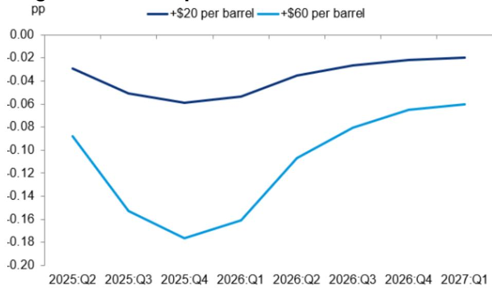  
Source: Laforte (2018), DB  
Financial conditions still a meaningful buffer against oil shock

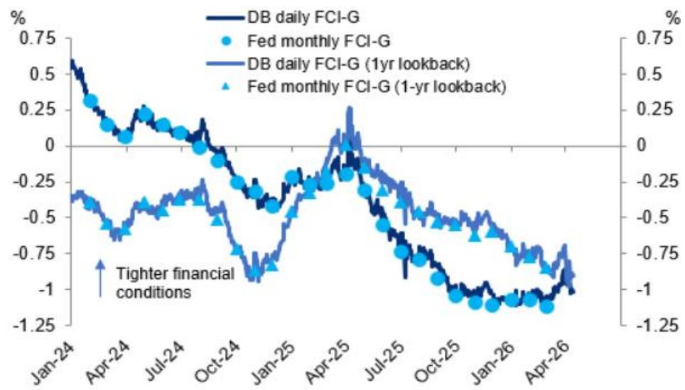  
Source: FRB, ICE/BofA, Dow Jones, Optimal Blue LLC, Redfin, Zillow, Bloomberg Finance LP, Haver Analytics, DB

Most measures of labor market slack have been stable over the past 12-18 months. Together with the recent decline in the unemployment rate to 4.3% confirms that the monthly breakeven payroll number has fallen to \~0-50k jobs/month.

Our baseline is that the unemployment rate will remain near current levels through year-end. Despite greater confidence in stabilization, the labor market remains in an uncomfortable equilibrium of low hiring and low firing along with a relatively narrow base of sectors producing growth.

Downside risks are therefore present, including from AI beyond the near term, even though we do not believe the latter has had a material adverse effect on the labor market thus far.

Payrolls have shown signs of stabilizing and firming

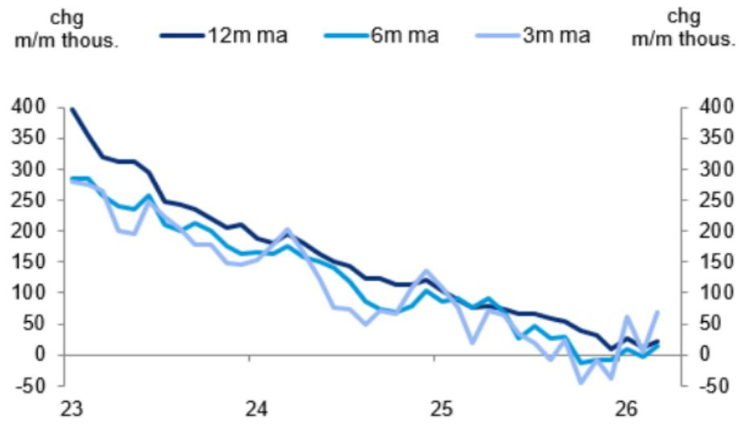  
Source: BLS, Haver Analytics, DB  
Fragile equilibrium of low hiring and firing persists

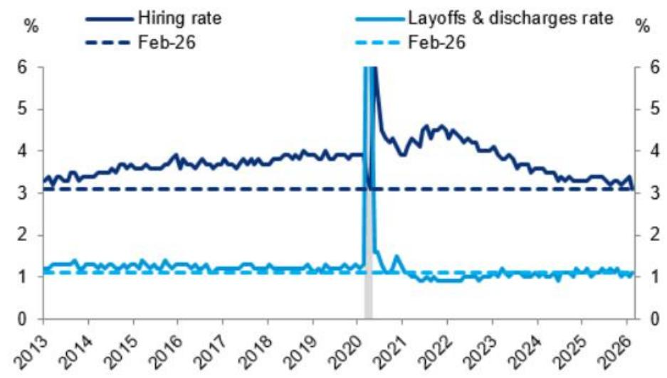  
Source: BLS, Macrobond, DB

Inflation likely to remain well above target this year and approach target over next two years

The disinflation path is murkier. Shelter disinflation is likely to continue modestly further, and core goods may reverse tariff effects later this year, but "super core" inflation has proven sticky.

We see core CPI and PCE remaining elevated in H2, ending the year at 2.7% and 3.0% (Q4/Q4), respectively. A more sustained oil price shock would impart upside risks, while further shelter disinflation or a quicker reversal in tariff effects represent downsides.

Further out, we continue to project core inflation will remain modestly (\~0.25pp) above the Fed's target over the forecast horizon. Inflation likely to remain well above target this year

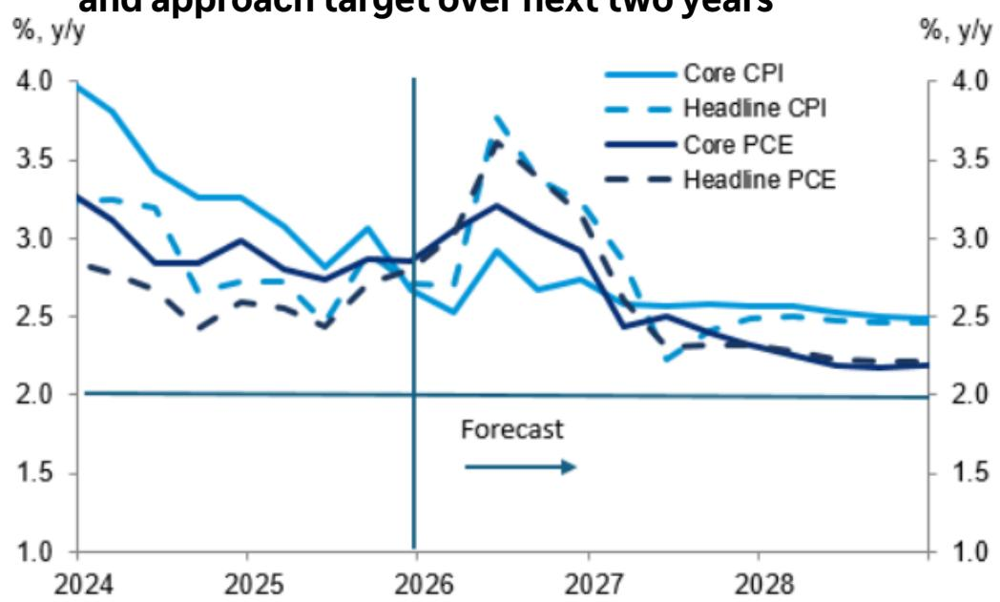  
Source: BEA, BLS, Macrobond, DB

Risks are to our Fed view skew hawkish. A rate hike this year is no longer a trivial possibility, in our view, but we do not expect such conditions to manifest in 2026. Getting there likely requires: a re-tightening of the labor market such that it returns as a source of inflationary pressures as well as an acceleration in core PCE above 3%. To be sure, recent de-escalation of tensions in the Middle East should take some of the near-term hiking pressure off the Fed, but would not fully remove the risk of hikes in 2027.

A resumption of hostilities between the US and Iran presents a clear and present danger as the two sides pursue a final agreement to settle the core dispute over Iran's nuclear program. Tech supply chain disruptions from Asia due to middle East tensions could also delay the AI-related capex implementation we expect this year. Aside from elevated geopolitical risk, we have not made any additional tariff assumptions with respect to the Section 301 investigation into “forced labor” practices of the US’ main trading partners and the USTR’s recommendations of 10-12.5% tariffs on approximately 60 countries. While the Administration has signaled its intent to impose 301 tariffs to partially replace its previous IEEPA tariff regime, it remains unclear if these 301 measures will be used as a negotiating tool (e.g. during USMCA negotiations in H2) or as a more lasting revenue source.

Regarding upside risks, it is possible that GOP majorities in both houses of Congress pursue another budget reconciliation bill this year to add fiscal support to consumers ahead of the midterm elections in November. However, there appears little appetite at present given the challenging budget outlook, for which we project federal deficits of roughly 6.5% of GDP over the next couple of years. Indeed, Iran war costs as well as other defense priorities could drive deficits closer to 7% over the next couple of years. Our base case is that another reconciliation bill this year will be narrow in scope and unlikely to provide meaningful further support for the economy (e.g., we do not expect substantial stimulus checks for households).

<table><tr><td rowspan="2">Economic Activity(% qoq, saar)</td><td colspan="4">2026</td><td colspan="4">2027</td><td colspan="4">2028</td><td rowspan="2">2025FQ4/Q4</td><td rowspan="2">2026FQ4/Q4</td><td rowspan="2">2027FQ4/Q4</td><td rowspan="2">2028FQ4/Q4</td></tr><tr><td>Q1</td><td>Q2F</td><td>Q3F</td><td>Q4F</td><td>Q1F</td><td>Q2F</td><td>Q3F</td><td>Q4F</td><td>Q1F</td><td>Q2F</td><td>Q3F</td><td>Q4F</td></tr><tr><td>GDP</td><td>1.6</td><td>2.8</td><td>2.3</td><td>1.9</td><td>2.1</td><td>2.5</td><td>2.2</td><td>2.0</td><td>2.6</td><td>1.9</td><td>2.1</td><td>1.8</td><td>2.0</td><td>2.2</td><td>2.2</td><td>2.1</td></tr><tr><td>Private consumption</td><td>1.4</td><td>2.4</td><td>1.9</td><td>1.6</td><td>2.0</td><td>2.2</td><td>2.1</td><td>2.2</td><td>2.3</td><td>2.2</td><td>2.3</td><td>2.1</td><td>2.1</td><td>1.8</td><td>2.1</td><td>2.2</td></tr><tr><td>Investment</td><td>7.0</td><td>6.1</td><td>6.1</td><td>4.8</td><td>3.9</td><td>5.2</td><td>4.1</td><td>3.0</td><td>6.2</td><td>2.7</td><td>3.6</td><td>2.6</td><td>2.1</td><td>6.0</td><td>4.1</td><td>3.7</td></tr><tr><td>Nonresidential</td><td>10.1</td><td>5.9</td><td>5.4</td><td>4.8</td><td>4.8</td><td>4.5</td><td>4.1</td><td>3.9</td><td>3.3</td><td>3.3</td><td>3.4</td><td>3.2</td><td>5.6</td><td>6.5</td><td>4.3</td><td>3.3</td></tr><tr><td>Residential</td><td>-6.3</td><td>-1.0</td><td>-1.0</td><td>-1.0</td><td>1.5</td><td>1.0</td><td>1.2</td><td>0.9</td><td>2.5</td><td>2.3</td><td>2.4</td><td>2.0</td><td>-3.8</td><td>-2.3</td><td>1.1</td><td>2.3</td></tr><tr><td>Gov&#x27;t consumption</td><td>4.4</td><td>1.3</td><td>1.0</td><td>0.7</td><td>0.5</td><td>0.3</td><td>0.1</td><td>-0.1</td><td>-0.3</td><td>-0.4</td><td>-0.3</td><td>-0.3</td><td>-1.2</td><td>1.8</td><td>0.2</td><td>-0.3</td></tr><tr><td>Exports</td><td>13.1</td><td>1.5</td><td>2.1</td><td>2.0</td><td>2.0</td><td>2.1</td><td>2.0</td><td>2.1</td><td>2.0</td><td>2.1</td><td>2.0</td><td>2.1</td><td>1.1</td><td>4.6</td><td>2.0</td><td>2.0</td></tr><tr><td>Imports</td><td>21.1</td><td>1.5</td><td>3.1</td><td>3.0</td><td>2.2</td><td>2.0</td><td>1.9</td><td>2.0</td><td>2.1</td><td>2.2</td><td>2.1</td><td>2.2</td><td>-1.9</td><td>6.9</td><td>2.0</td><td>2.1</td></tr><tr><td>Contribution (pp): Inventories</td><td>0.1</td><td>0.3</td><td>0.3</td><td>0.2</td><td>-0.1</td><td>0.2</td><td>0.1</td><td>-0.1</td><td>0.6</td><td>-0.1</td><td>0.1</td><td>-0.1</td><td>-0.1</td><td>-0.1</td><td>0.1</td><td>0.1</td></tr><tr><td>Net trade</td><td>-1.3</td><td>-0.1</td><td>-0.2</td><td>-0.2</td><td>-0.1</td><td>-0.1</td><td>-0.1</td><td>-0.1</td><td>-0.1</td><td>-0.1</td><td>-0.1</td><td>-0.1</td><td>-0.2</td><td>-0.2</td><td>-0.1</td><td>-0.1</td></tr><tr><td>Unemployment rate, %</td><td>4.3</td><td>4.3</td><td>4.3</td><td>4.3</td><td>4.3</td><td>4.3</td><td>4.2</td><td>4.2</td><td>4.2</td><td>4.2</td><td>4.2</td><td>4.2</td><td>4.5</td><td>4.3</td><td>4.2</td><td>4.2</td></tr><tr><td>Prices (% yoy)</td><td></td><td></td><td></td><td></td><td></td><td></td><td></td><td></td><td></td><td></td><td></td><td></td><td></td><td></td><td></td><td></td></tr><tr><td>CPI</td><td>2.7</td><td>4.1</td><td>3.9</td><td>3.8</td><td>3.4</td><td>2.3</td><td>2.4</td><td>2.6</td><td>2.7</td><td>2.6</td><td>2.6</td><td>2.7</td><td>2.8</td><td>3.8</td><td>2.6</td><td>2.7</td></tr><tr><td>Core CPI</td><td>2.5</td><td>2.8</td><td>2.6</td><td>2.7</td><td>2.5</td><td>2.3</td><td>2.5</td><td>2.6</td><td>2.6</td><td>2.6</td><td>2.6</td><td>2.6</td><td>2.8</td><td>2.7</td><td>2.6</td><td>2.6</td></tr><tr><td>PCE</td><td>3.1</td><td>3.8</td><td>3.5</td><td>3.3</td><td>2.7</td><td>2.0</td><td>2.2</td><td>2.3</td><td>2.3</td><td>2.3</td><td>2.2</td><td>2.2</td><td>2.8</td><td>3.3</td><td>2.3</td><td>2.2</td></tr><tr><td>Core PCE</td><td>3.1</td><td>3.3</td><td>3.1</td><td>3.0</td><td>2.5</td><td>2.2</td><td>2.3</td><td>2.3</td><td>2.3</td><td>2.2</td><td>2.2</td><td>2.2</td><td>2.9</td><td>3.0</td><td>2.3</td><td>2.2</td></tr><tr><td>Fed Funds</td><td>3.63</td><td>3.63</td><td>3.63</td><td>3.63</td><td>3.63</td><td>3.63</td><td>3.63</td><td>3.63</td><td>3.63</td><td>3.63</td><td>3.63</td><td>3.63</td><td>3.63</td><td>3.63</td><td>3.63</td><td>3.63</td></tr></table>

Sources: DB

## 02. Strategy Outlook

Steve Caprio | +44(0) 2075 416176 | steve.caprio@db.com
Karthik Nagalingam | +1 212 250-0521 | Karthik-a.nagalingam@db.com

## Credit Strategy – 2026 Mid-Year Outlook Nimble? More dispersion is coming

\- Public credit is shrugging its shoulders in the face of: 1) more hawkish central banks & 2) private credit market woes. From a macro perspective, global credit investors aren’t overly concerned about growth woes or supply chain bottlenecks emerging from the Iran conflict.

\- There are numerous headwinds including sticky inflation, rising shipping costs, memory chip shortages that could impact key cyclical sectors & continued tariff uncertainty. The US economy is still very K-shaped, with leveraged loan & private credit markets heavily exposed to AI software disruption. At a minimum, the outlook until year-end calls for more dispersion and some spread widening.

\- \$HY spreads are forecasted to widen to 305bps (+42bps) by year-end, with total returns finishing just above +1.1% over the next 6 months when incorporating our rate strategists' forecast.

• We project \$-spec-grade default rates to decline from 4.0% to 3.6% by YE'26, and then rising back to 4.0% by Jun'27.

<table><tr><td></td><td colspan="2">OAS (vs. Gov)</td><td>Excess Returns</td><td>Total Returns</td></tr><tr><td></td><td>Current</td><td>Q3-Q4&#x27;26</td><td colspan="2">Year-end</td></tr><tr><td>$IG</td><td>72</td><td>82</td><td>-0.29%</td><td>1.03%</td></tr><tr><td>$HY</td><td>266</td><td>305</td><td>-0.78%</td><td>1.11%</td></tr></table>

<table><tr><td></td><td colspan="3">Trailing 12m default rates (issuer-weighted, incl. exchanges)</td></tr><tr><td></td><td>Current</td><td>YE&#x27;26</td><td>Q2&#x27;27</td></tr><tr><td>US Spec-Grade</td><td>4.0%</td><td>3.6%</td><td>4.0%</td></tr></table>

Source: Bloomberg Finance L.P., Moody's, DB. N.B.: Returns are based as of closing values from June 12, 2026

<table><tr><td></td><td>Ratings</td><td>Curves</td><td>TopSector Overweights</td><td>TopSector Underweights</td><td>Off-Benchmark</td></tr><tr><td>$IG</td><td>A = BBB</td><td>OW 1-7yr; UW +7yr</td><td>Large US Banks, Cap Goods, Hyperscalers, Energy, Utilities</td><td>Insurance, Consumer Cyclicals &amp; Staples, Pharma, Transports</td><td rowspan="2">BBB &lt; BB</td></tr><tr><td>$HY</td><td>BB = B1 &amp; B2 &gt; B3 &amp; CCCs</td><td></td><td>Higher-rated Basic Industrials, Capital Goods, Energy, Wireless &amp; Wirelines</td><td>Consumer Cyclicals. Healthcare, Technology, Cable &amp; Satellites</td></tr></table>

## Credit Strategy – 2026 Mid-Year Outlook Technicals remain strong, which can moderate \$HY spread widening

\- \$HY markets are seeing low net supply numbers, outside a few key pockets of strength (Data Centers, LBOs, Hybrids). This offsets the weaker fund flows in \$HY, which are further mitigated by high cash balances for \$HY mutual fund managers.

\- HY fund flows have been mixed, with periods of outflows, given retail investors are more responsive to market vol.

\- However, \$HY fund manager cash balances are elevated, which helps to offset the impact of recent outflows and boost the technical resilience of the market

Rolling 1M \$HY Fund Flows

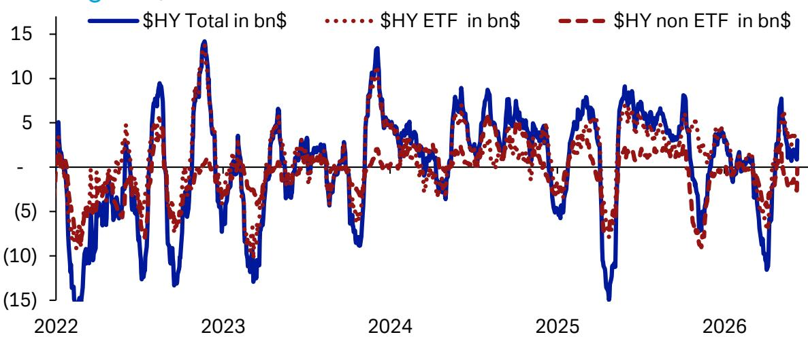  
Source: DB, EPFR

\$HY net supply (incl. coupons) can continue to be positive for spreads  
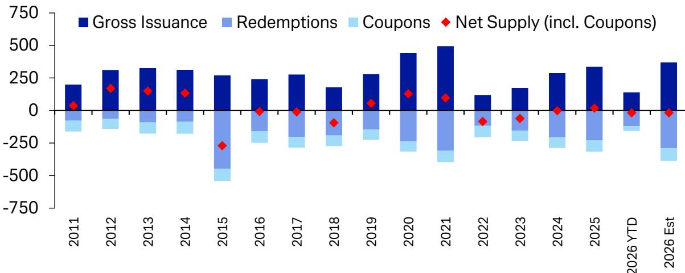  
Source: DB, Bloomberg Finance L.P.  
\$HY real money cash balances (% AUM)

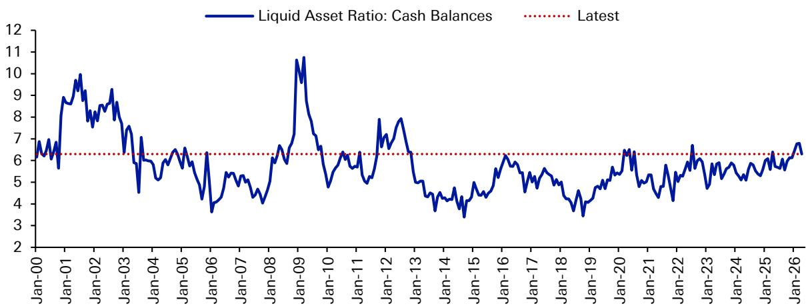

US recession probability remains low, even as pockets of weakness will lead to dispersion

\- The K-shaped US economy still lives, and US credit dispersion will persist. Our “fire & ice” theme from the start of the year should perhaps be reframed as an “AI & ice” US economy, given how narrow we believe the drivers of US growth to be.

\- US artificial intelligence tailwinds feed back into very strong US corporate profits and a wealth effect that supports the high-income US consumer, and this is a major reason why our US credit-based recession model is still only forecasting a 12% probability of a US downturn through Q1'27. It is very hard to see a spike in US defaults with overall US growth so solid.

\- However, US businesses today are forecasting future demand expectations and future margin compression at near the worst rate in 5 years. This would certainly imply higher \$HY & \$Lev Loan defaults, than what the aggregate macroeconomic data would imply.

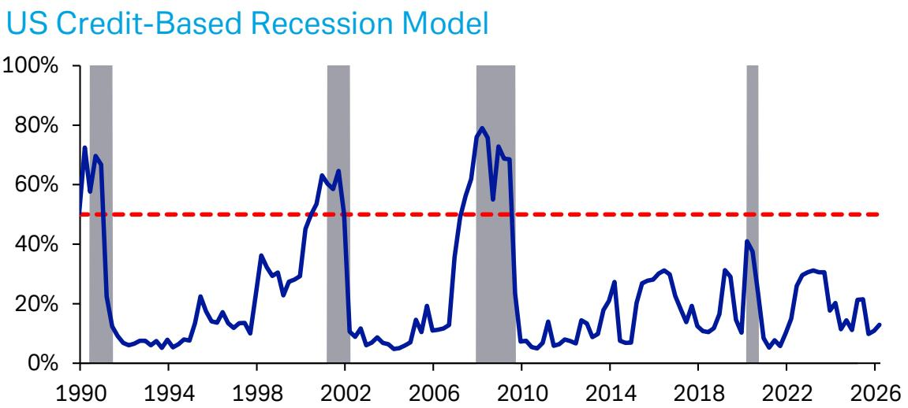  
Source: DB, Bloomberg Finance L.P.
Given our concerns that US GDP-based interest coverage is being skewed lower by a few large IG-rated firms, we illustrate our US recession indicator above without interest coverage as well.  
% of businesses expecting a net increase in demand 6m from now

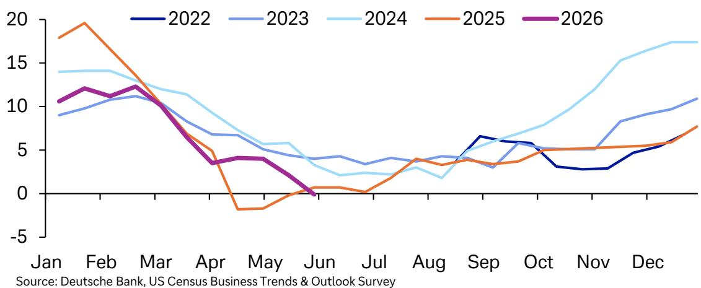  
Source: DB, US Census Business Trends & Outlook Survey

## A US Software glitch can materially tighten funding markets

\- \$LL software spreads are trading near 750bps, at the YTD wides and near March 2020 levels. But ex-software spreads are only trading at 385bps, below 2021 levels. The market is pricing software as an isolated issue.

\- Market prices imply that nearly 30% of US software lev loans should be CCC-rated\*. If true, the share of CCCs in the US Lev Loan index will swell to 7.5%+. That is the risk of the largest sector in the index facing AI disruption.

\- This software stress can propagate more broadly. Especially if the stale software loan marks in US Private BDCs are marked lower in coming quarters. And if they are not marked down, it can continue to feed into US BDC liquidity pressures.

If software fundamentals weaken, PC software loans will need to be marked materially lower

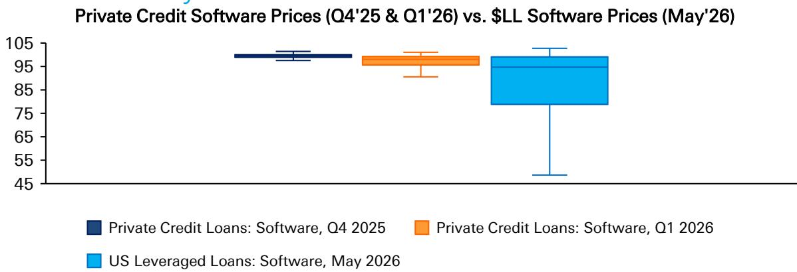  
Source: DB, Pitchbook

US Lev Loan software spreads are approaching Covid-era wides  
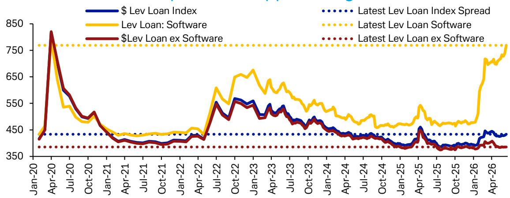  
Source: DB, Pitchbook  
Market prices imply that $\sim 30\%$ of US software LL should be CCC-rated\*  
Bloomberg US Lev Loan Index Software Ratings: Current vs. Market-Implied

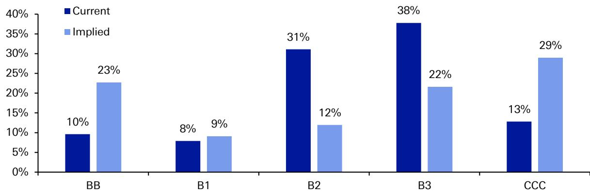  
Source: DB, Bloomberg Finance LP,  
\*Market-implied ratings are calculated by comparing current individual \$LL software prices vs the average price per \$LL rating bucket. We assign a market-implied software rating based on the average rating bucket price that is closest to the individual software loan price

## Credit Strategy – 2026 Mid-Year Outlook A US Software glitch can materially tighten funding markets

\- The tailwinds of AI adoption will eventually become headwinds for spec-grade credit as they trigger tighter financial conditions for B rated firms.

\- The market is in an uneasy equilibrium. The health of the broader \$LL market and the lack of any tangible software fundamental deterioration yet has limited the amount of loan markdowns that private credit funds have had to take. However, a few weak software earnings, coupled with rating downgrades and rising CCC buckets in US Loan indices, would lead both macro- and company-specific fundamental factors to deteriorate quickly.

\- We suspect software stress is likely to spread more broadly, within both private credit & leveraged loan markets over the next 6-12 months. With 80% of all \$B rated debt financed in either private credit or leveraged loans, the reality of still near record-high T+2 & T+3 maturity walls for \$B & CCC rated credit highlights that this is a risk not to forget.

$LL$ & sub- $BB$ HY cumulative maturity wall as % of notional  
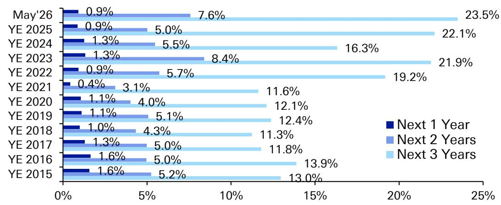  
Source: DB, Bloomberg Finance L.P. Pitchbook

% of Spec-Grade Debt Financed by Private Credit & Leveraged Loans  
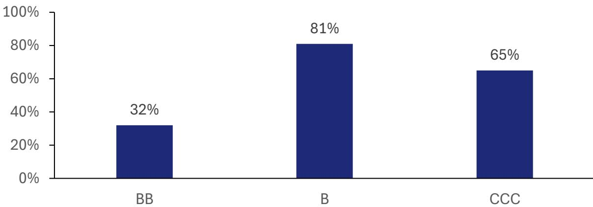  
Source: DB, Bloomberg Finance L.P. Pitchbook

## Credit Strategy – 2026 Mid-Year Outlook \$HY Ratings: Mind \$B3 downgrade risks

\- Given the relatively tight $BB$ valuations and how cheap $Bs$ continue to be, we largely maintain our neutral stance between B & BBs.

\- The one caveat is that B3 risks look to have larger-than-average "downgrade risk". At a rating notch level, the CCC1-B3 spread differential has remained near the all-time wides over the last few months.

\- Meanwhile, B3-B1 spread differentials are historically tight, as are CCC2-CCC1s.

\- B3 debt could be quite risky here if there were a surprise downgrade or if the market started to price in more downgrade/default risks.

\- Despite how cheap $CCC$ spreads look relative to $Bs$ on a spread ratio basis, we remain wary of $CCC$ risk, even at current spreads.

\$B spreads have been trending wider in recent months to \$BBs  
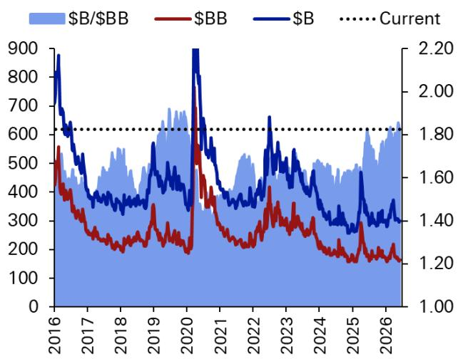

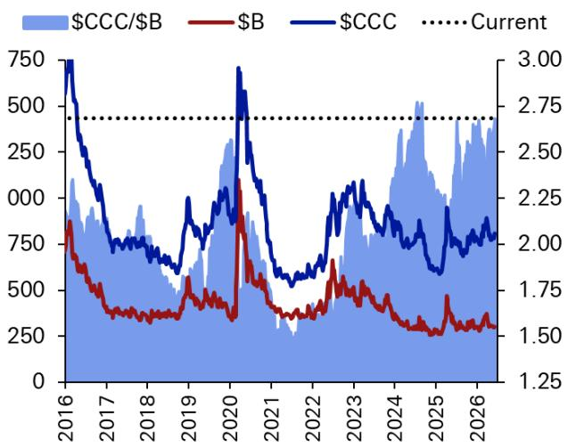

B3s are trading tight to B1s, with a big cliff to where CCC1s trade  
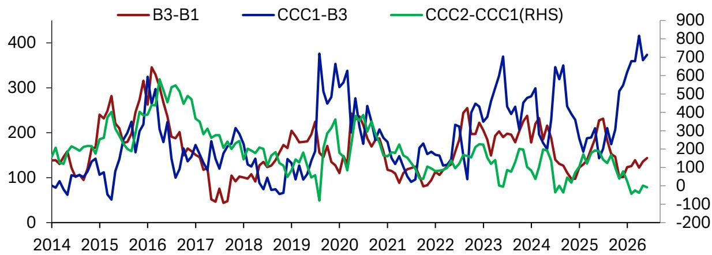  
Source: DB, Bloomberg Finance L.P., ICE Indices

## Credit Strategy – 2026 Mid-Year Outlook Which sectors are more exposed to defaults and fundamental risks?

\- Looking ahead to the next 6 months, there will be greater \$HY dispersion led by two major factors. The energy shock and rising inflation worries are translating into higher US Treasury yields which could lead to a re-rating of frothy multiples. Meanwhile, elevated energy and commodity costs can also weigh on margins, leading to higher future leverage.

\- We created two scenarios looking at a moderate and large energy shock and the ensuing multiple compression as the Fed responded to rising inflation expectations. Given the US-Iran deal, it appears we are heading to the milder scenario wherein the Strait of Hormuz is opened by month's end.

\- Cyclicals see the biggest jump in leverage on the back of both compressed margins and re-rated multiples. \$HY Capital Goods, Technology, and Consumer Goods see the biggest jump in leverage, with Consumer Goods in particular reaching a high level in their own history.

\$HY Median Debt/EV by Sector and Z-score since 2004

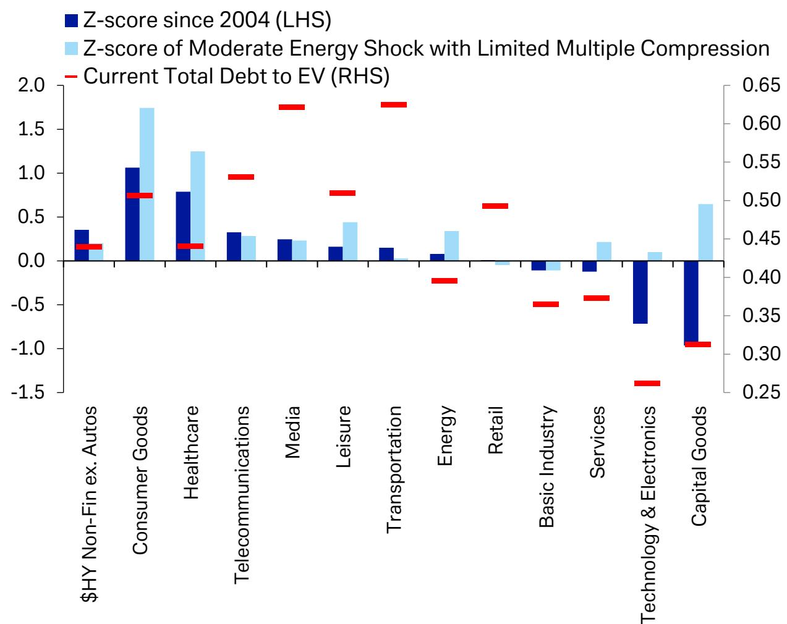  
Source: DB, Bloomberg Finance L.P.

## Which sectors are more exposed to defaults and fundamental risks?

• We maintain our overall sector preference wrapper, wherein we lean away from any consumer-oriented risks while getting as close to the firms benefiting from the AI-buildout as possible.

<table><tr><td>Positioning</td><td></td><td>Total</td><td>BB</td><td>B</td><td>CCC</td></tr><tr><td></td><td>$HY</td><td>266</td><td>155</td><td>273</td><td>711</td></tr><tr><td></td><td>Financials</td><td></td><td></td><td></td><td></td></tr><tr><td>UW</td><td>Finance Companies</td><td>262</td><td>213</td><td>381</td><td>1022</td></tr><tr><td>MW</td><td>Insurance</td><td>225</td><td>173</td><td>245</td><td>336</td></tr><tr><td>MW</td><td>Real Estate</td><td>241</td><td>188</td><td>217</td><td>440</td></tr></table>

<table><tr><td></td><td>Cyclicals</td><td></td><td></td><td></td><td></td></tr><tr><td>OW</td><td>Basic Industry</td><td>258</td><td>145</td><td>242</td><td>906</td></tr><tr><td>OW</td><td>Capital Goods</td><td>219</td><td>104</td><td>221</td><td>940</td></tr><tr><td>MW</td><td>Media &amp; Entertainment</td><td>321</td><td>218</td><td>324</td><td>465</td></tr><tr><td>UW</td><td>Consumer Cyclicals</td><td>233</td><td>148</td><td>259</td><td>739</td></tr><tr><td>OW</td><td>Consumer Cyc Services</td><td>299</td><td>139</td><td>302</td><td>811</td></tr><tr><td>OW</td><td>Energy</td><td>156</td><td>127</td><td>213</td><td>224</td></tr><tr><td>MW</td><td>Technology</td><td>327</td><td>161</td><td>467</td><td>1051</td></tr><tr><td>UW</td><td>Transportation</td><td>427</td><td>180</td><td>435</td><td>1270</td></tr></table>

<table><tr><td></td><td>Non-Cyclicals</td><td></td><td></td><td></td><td></td></tr><tr><td>UW</td><td>Cable &amp; Satellite</td><td>561</td><td>217</td><td>246</td><td>1510</td></tr><tr><td>OW</td><td>Wireless</td><td>257</td><td>240</td><td></td><td>289</td></tr><tr><td>OW</td><td>Wirelines</td><td>380</td><td>186</td><td>188</td><td>860</td></tr><tr><td>UW</td><td>Consumer Non-Cyclicals</td><td>258</td><td>123</td><td>230</td><td>596</td></tr><tr><td>UW</td><td>Healthcare</td><td>230</td><td>108</td><td>262</td><td>625</td></tr><tr><td>UW</td><td>Pharmaceuticals</td><td>398</td><td>109</td><td>144</td><td>521</td></tr></table>

\$HY Debt/EV metrics have improved in recent quarters as growth trends have supported Cyclical issuers in particular  
\$HY Non-Fin ex. Autos Total Debt/EV

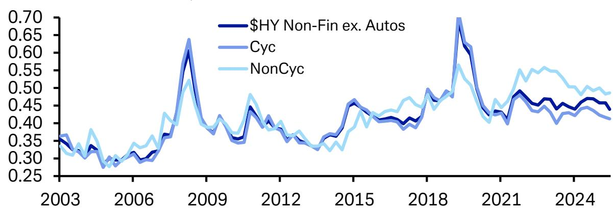  
Cyclical \$HY spreads are meaningfully underperforming Non-Cyclicals

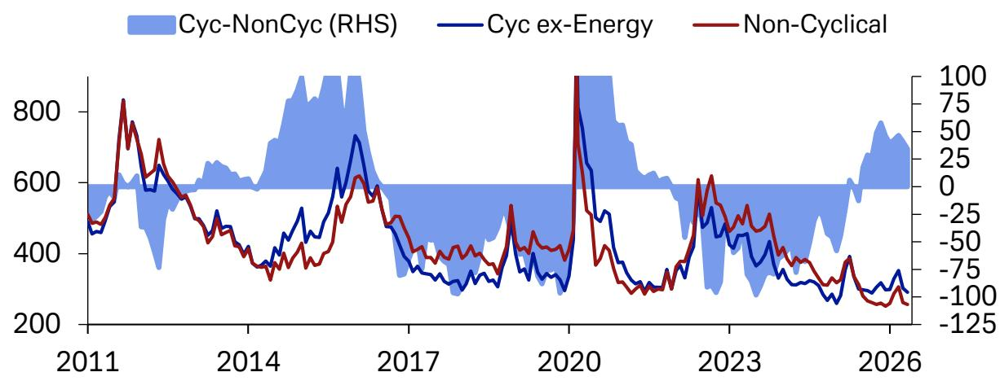  
Source: DB, Bloomberg Finance L.P., ICE Indices  
2026 Mid-Year Check-In - US High Yield Research | Steve Caprio | HY US Credit Strategy

## 03. Consumer and Retail

Ryan Dowling | +1 212 250-4549 | ryan.dowling@db.com

## Consumer | 2026 Outlook Key Themes in Consumer

## Sector Highlights:

■ Geopolitical & Supply Chain Volatility. Ongoing conflicts and trade disruptions are increasing energy, logistics, and input costs. Companies with resilient supply chains and dynamic sourcing strategies are expected to outperform amid continued uncertainty.

\- Margin Discipline. With inflationary and competitive pressures persisting, organizations are prioritizing simplification, automation, and cost optimization to protect profitability while funding growth initiatives.

\- Value-Seeking Consumer. The consumer landscape remains characterized by selectivity, with a continued emphasis on affordability, promotions, and value. Private label offerings will remain relevant as consumers look for ways to save.

■ Discretionary Spend Remains Pressured. In addition to higher interest rates, elevated gas prices have caused consumers to spend less on discretionary items which we anticipate will continue through the back half of 2026.

## Crocs Inc. (CROX) – Apparel BUY TLB due ‘29 and SUNs due ‘29 & ‘31

Business Description: Crocs, Inc. designs, manufactures, and markets casual lifestyle footwear and accessories for men, women, and children. CROX markets its products in more than 80 countries through two distribution channels, wholesale and direct-to-consumer.

Credit Highlights:

\- Expanding its international presence: International sales for its Crocs Brand were up 7.2% last quarter. CROX converted its Malaysian business to be directly owned and operated adding 21 retail stress in the region.

■ DTC Resilience Counters Wholesale Headwinds: DTC segment is seeing continued growth from new products and collaborations, countering wholesale declines

## Catalysts:

■ Strong FCF generation: We expect CROX will continue to generate healthy levels of FCF (DBe of \$411mn for FYE26, and \$699mn for FYE27)

\- Solid liquidity of \$971mn and a large equity cushion (16% LTV)

Outstanding Issues

<table><tr><td>DB Rec</td><td>BBG Ticker</td><td>Ranking/ Seniority</td><td>Coupon</td><td>Amt O/S</td><td>Maturity</td><td>Price</td><td>YTW/YTM*</td><td>DM / Sprd</td><td>Mdy&#x27;s/ S&amp;P</td></tr><tr><td>BUY</td><td>CROX</td><td>1L</td><td>S + 225</td><td>$500</td><td>2/20/2029</td><td>100.625</td><td>5.66%</td><td>199</td><td>Ba1/BBB-</td></tr><tr><td>BUY</td><td>CROX</td><td>Sr. Unsec&#x27;d</td><td>4.250%</td><td>$350</td><td>3/15/2029</td><td>97.500</td><td>5.24%</td><td>113</td><td>Ba3/BB</td></tr><tr><td>BUY</td><td>CROX</td><td>Sr. Unsec&#x27;d</td><td>4.125%</td><td>$350</td><td>8/15/2031</td><td>94.125</td><td>5.45%</td><td>126</td><td>Ba3/BB</td></tr></table>

Sources: Company reports and Bloomberg Finance LP.

Capital Structure Summary:

<table><tr><td>Description</td><td>Amt O/S</td><td>Gross</td><td>Net</td><td>at Mkt</td><td colspan="2">Other Info:</td></tr><tr><td>$1.0bn RCF &#x27;27</td><td>$159</td><td></td><td></td><td></td><td>Adj. EBITDA</td><td>$1,003</td></tr><tr><td>TLB due 2029 (S + 225)</td><td>$500</td><td></td><td></td><td></td><td>(-) Capex</td><td>$54</td></tr><tr><td rowspan="2">Secured Debt</td><td rowspan="2">$659</td><td rowspan="2">0.7x</td><td rowspan="2">0.5x</td><td rowspan="2">0.5x</td><td>(-) Cash Interest</td><td>$75</td></tr><tr><td>(-) Cash Taxes</td><td>$188</td></tr><tr><td>Senior Notes due 2029 - 4.250%</td><td>$350</td><td></td><td></td><td></td><td>&quot;Simple&quot; FCF</td><td>$686</td></tr><tr><td>Senior Notes due 2031 - 4.125%</td><td>$350</td><td></td><td></td><td></td><td>as % of TD</td><td>50.5%</td></tr><tr><td>Total Debt</td><td>$1,359</td><td>1.4x</td><td>1.2x</td><td>1.2x</td><td></td><td></td></tr><tr><td>Cash on hand</td><td>($131)</td><td></td><td></td><td></td><td colspan="2">Liquidity:</td></tr><tr><td>Net Debt</td><td>$1,228</td><td></td><td></td><td></td><td>Cash on hand</td><td>$131</td></tr><tr><td>Market Cap</td><td>$6,362</td><td></td><td></td><td></td><td>Credit Lines</td><td>$840</td></tr><tr><td>Enterprise Value</td><td>$7,590</td><td></td><td>7.6x</td><td></td><td>Total Liquidity</td><td>$971</td></tr></table>

Sources: Company reports and Bloomberg Finance LP.

## Dave & Buster's (PLAY) – Restaurants BUY TLB due ‘29 and ‘31

Business Description: Dave & Buster's (PLAY) operates 247 venues in North America offering entertainment and dining experiences for customers under both its Dave & Busters and Main Event brands.

## Credit Highlights:

■ New management team: implemented a targeted marketing campaign, revamped menu, and rolling out new games

■ Expansion plans: anticipates 11 new stores openings in FY26 and targeting 10-20 store remodels in FY27

■ Strong liquidity and maturity runway: total liquidity sits at \$499 million and no maturities until 2029

## Catalysts:

\- SSS inflection point: anticipate improvement throughout the year on SSS and an inflection point to come (World Cup boost, \~15 new games introduced, IP partnerships, targeted marketing campaigns)

\- CapEx set to come down: mgmt. is planning for half as many new store openings and more remodels of existing stores in FY27 & FY28, which will lead to lower capex and more FCF for debt repayment (paid down \$20 million RCF in 1Q26)

■ We believe the DM should be closer to 600 bps resulting in 5-8 pts upside

## Outstanding Issues

<table><tr><td>DB Rec</td><td>BBG Ticker</td><td>Ranking/ Seniority</td><td>Coupon</td><td>Amt O/S</td><td>Maturity</td><td>Price</td><td>YTW/YTM*</td><td>DM/Sprd</td><td>Mdy&#x27;s/ S&amp;P</td></tr><tr><td>BUY</td><td>PLAY</td><td>Sr. Unsec&#x27;d</td><td>S + 325</td><td>$691</td><td>6/29/2029</td><td>85.625</td><td>12.66%</td><td>901</td><td>B3/B-</td></tr><tr><td>BUY</td><td>PLAY</td><td>Sr. Unsec&#x27;d</td><td>S + 325</td><td>$690</td><td>10/31/2031</td><td>79.313</td><td>12.33%</td><td>868</td><td>B3/B-</td></tr></table>

Sources: Company reports and Bloomberg Finance LP.

## Capital Structure Summary:

<table><tr><td>Description</td><td>Amt O/S</td><td>Gross</td><td>Net</td><td>at Mkt</td><td colspan="2">Other Info:</td></tr><tr><td>RCF due 2029</td><td>$150</td><td></td><td></td><td></td><td>Adj. EBITDAR</td><td>$677</td></tr><tr><td>TLB due 2029 (S + 325)</td><td>$691</td><td></td><td></td><td></td><td>(-) Rent</td><td>$253</td></tr><tr><td>TLB due 2031 (S + 325)</td><td>$690</td><td></td><td></td><td></td><td>(-) Net Capex</td><td>$219</td></tr><tr><td>Financing Obligation</td><td>$1,589</td><td></td><td></td><td></td><td>(-) Cash Interest</td><td>$134</td></tr><tr><td>Secured Debt</td><td>$3,119</td><td>4.6x</td><td>4.6x</td><td>4.2x</td><td>(-) Cash Taxes</td><td>$12</td></tr><tr><td></td><td></td><td></td><td></td><td></td><td>&quot;Simple&quot; FCF</td><td>$59</td></tr><tr><td>Total Debt</td><td>$3,119</td><td></td><td></td><td></td><td>as % of TD</td><td>1.9%</td></tr><tr><td>Cash on hand</td><td>($20)</td><td></td><td></td><td></td><td></td><td></td></tr><tr><td>Net Debt</td><td>$3,100</td><td></td><td></td><td></td><td>Liquidity:</td><td></td></tr><tr><td>Market Cap</td><td>$389</td><td></td><td></td><td></td><td>Cash on hand</td><td>$20</td></tr><tr><td>Enterprise Value</td><td>$3,489</td><td></td><td>5.2x</td><td></td><td>Credit Lines</td><td>$480</td></tr><tr><td></td><td></td><td></td><td></td><td></td><td>Total Liquidity</td><td>$499</td></tr></table>

Sources: Company reports and Bloomberg Finance LP.

## Crocs (CROX)

■ Risks to the downside of our BUY rating consist of:

■ Trends in the fashion industry evolving away from casual footwear

■ Management pursuing more shareholder friendly activities

■ Continued declines in its HEYDUDE Brand

## Dave & Busters (PLAY)

■ Risks to the downside of our BUY rating consist of:

■ Challenging macro environment persisting leading to continued elevated gas prices and pressure on overall consumer discretionary spending

■ SSS remaining negative for longer than anticipated

■ A change in capital allocation policy towards more shareholder friendly activities

■ Increased competitive environment

## 04. Healthcare

Miles Highsmith | +1 212 250-1606 | miles.highsmith@db.com

## Healthcare – 2026 Outlook Still Many Moving Parts

## Healthcare Themes/Concerns:

■ Commercial Payor Behavior. We believe denials, downcoding, etc. continue to present challenges for some providers.

■ Potentially Soft Q226 Results. Per certain channel checks Q226 provider results could be below expectations.

\- Exchange Subsidies. The loss of expanded subsidies should be meaningful to certain providers as this plays out over the balance of 2026.

\- OBBBA Impact. Following the OBBBA legislation in 2025, there are significant Medicaid risks (and mitigations) that become more pronounced in 2028 and ensuing years.

## Healthcare Themes/Concerns (continued):

■ AI Adoption. We believe this could create opportunities and threats for various sub-sectors of healthcare.

■ GLP-1 Uncertainty. Although these risks could play out over a longer time, products and services related to certain disease states could be impacted by increased GLP-1 adoption.

\- Business Disruption. We believe business disruption risk (AMZN, channel, better IT, etc.) can continue to be a broader risk to certain healthcare businesses.

\- Tariffs. There continues to be uncertainty around tariffs for medical products and pharmaceutical companies, and how these could directly or indirectly impact certain of our companies under coverage.

## Community Health Systems, Inc. (CYH) – Healthcare BUY 1L Bonds

Business Description: Community Health operates hospitals and related facilities, primarily in rural and small city markets. At 6/1/26 CYH owned or leased 60 hospitals and operated over 800 sites of care.

## Credit Highlights:

■ Incremental Yield and Lower Dollar. At a price of 91.79, the 4.75% 1L bonds of '31 trade at a YTW of 6.83% versus the HY Healthcare index of 6.75%.

\- Total Return. Based on a price of 95 (\$368 mm bonds tendered there), the 1-year total return would be 8.59%.

\- Leverage Through 1Ls Manageable. By our calculations LTM net 1L leverage was 4.9x.

Outperformance Rationale/Catalysts

\- Bonds Lower. We believe uncertainty with Q226 results, payor pressure, and expected Medicaid cuts have negatively impacted bonds / created some opportunities.

\- Limited Dollar Downside. In our opinion, dollar downside is limited in CYH's 4.75% 1Ls.

■ Create Secured Capacity. CYH could continue to target 4.75% 1Ls among other tranches to create secured capacity with future divestiture proceeds.

\- Hospitals are a Protected Class. It’s our view that the importance of healthcare delivery and jobs render hospitals a protected class.

Outstanding Issues

<table><tr><td>DB Rec</td><td>BBG Ticker</td><td>Ranking/ Seniority</td><td>Coupon</td><td>Amt O/S</td><td>Maturity</td><td>Price</td><td>YTW/YTM*</td><td>STW</td><td>Mdy&#x27;s/ S&amp;P</td></tr><tr><td>BUY</td><td>CYH</td><td>1L</td><td>6.000%</td><td>$644</td><td>1/15/2029</td><td>99.319</td><td>6.29%</td><td>199</td><td>Caa1 / B-</td></tr><tr><td>BUY</td><td>CYH</td><td>1L</td><td>5.250%</td><td>$1,535</td><td>5/15/2030</td><td>94.284</td><td>6.94%</td><td>280</td><td>Caa1 / B-</td></tr><tr><td>BUY</td><td>CYH</td><td>1L</td><td>4.750%</td><td>$689</td><td>2/15/2031</td><td>91.799</td><td>6.83%</td><td>267</td><td>Caa1 / B-</td></tr><tr><td>BUY</td><td>CYH</td><td>1L</td><td>10.875%</td><td>$1,549</td><td>1/15/2032</td><td>107.734</td><td>6.86%</td><td>278</td><td>Caa1 / B-</td></tr><tr><td>BUY</td><td>CYH</td><td>1L</td><td>10.750%</td><td>$700</td><td>6/15/2033</td><td>107.205</td><td>9.16%</td><td>487</td><td>Caa1 / B-</td></tr><tr><td>BUY</td><td>CYH</td><td>1L</td><td>9.750%</td><td>$1,790</td><td>1/15/2034</td><td>104.564</td><td>8.42%</td><td>399</td><td>Caa1 / B-</td></tr><tr><td>HOLD</td><td>CYH</td><td>2L</td><td>6.875%</td><td>$1,244</td><td>4/15/2029</td><td>98.732</td><td>7.37%</td><td>315</td><td>Caa3 / CCC-</td></tr><tr><td>HOLD</td><td>CYH</td><td>2L</td><td>6.125%</td><td>$1,227</td><td>4/1/2030</td><td>90.261</td><td>9.22%</td><td>510</td><td>Caa3 / CCC-</td></tr><tr><td>HOLD</td><td>CYH</td><td>Sr. Unsec&#x27;d</td><td>6.875%</td><td>$42</td><td>4/1/2028</td><td>96.995</td><td>8.71%</td><td>468</td><td>Ca / CCC-</td></tr></table>

Capital Structure Summary:

<table><tr><td>Description</td><td>Amt O/S</td><td>Gross</td><td>Net</td><td>at Mkt</td><td colspan="2">Other Info:</td></tr><tr><td>$1900 mm 5.625% Secured Bond due 03/15/27</td><td>$0</td><td></td><td></td><td></td><td>Adj. EBITDA</td><td>$1,460</td></tr><tr><td>$700 mm 8% Secured Bond due 12/15/27</td><td>$0</td><td></td><td></td><td></td><td>(-) Capex</td><td>$361</td></tr><tr><td>$900 mm 6% Secured Bond due 01/15/29</td><td>$644</td><td></td><td></td><td></td><td>(-) Cash Interest</td><td>$836</td></tr><tr><td>$1535 mm 5.25% Secured Bond due 05/15/30</td><td>$1,535</td><td></td><td></td><td></td><td>(-) Cash Taxes</td><td>$0</td></tr><tr><td>$1095 mm 4.75% Secured Bond due 02/15/31</td><td>$1,058</td><td></td><td></td><td></td><td>&quot;Simple&quot; FCF</td><td>$263</td></tr><tr><td>$1000 mm 10.875% Secured Bond due 01/15/32</td><td>$1,780</td><td></td><td></td><td></td><td>as % of TD</td><td>2.6%</td></tr><tr><td>$700 mm 10.75% Secured Bond due 06/15/33</td><td>$700</td><td></td><td></td><td></td><td></td><td></td></tr><tr><td>$1790 mm 9.75% Secured Bond due 01/15/34</td><td>$1,790</td><td></td><td></td><td></td><td></td><td></td></tr><tr><td>ABL due 6/5/2029</td><td>$0</td><td></td><td></td><td></td><td></td><td></td></tr><tr><td>Receivables Facility</td><td>$0</td><td></td><td></td><td></td><td></td><td></td></tr><tr><td>Capital Leases</td><td>$299</td><td></td><td></td><td></td><td></td><td></td></tr><tr><td>Other</td><td>$42</td><td></td><td></td><td></td><td></td><td></td></tr><tr><td>Total 1L Debt</td><td>$7,848</td><td>5.4x</td><td>4.9x</td><td>4.8x</td><td></td><td></td></tr><tr><td>$1775 mm 6.875% 2nd Lien Bond due 04/15/29</td><td>$1,244</td><td></td><td></td><td></td><td></td><td></td></tr><tr><td>$1440 mm 6.125% 2nd Lien Bond due 04/01/30</td><td>$1,227</td><td></td><td></td><td></td><td></td><td></td></tr><tr><td>Total 2L Debt</td><td>$10,319</td><td>7.1x</td><td>6.6x</td><td>6.4x</td><td></td><td></td></tr><tr><td>$1700 mm 6.875% Bond due 04/01/28</td><td>$42</td><td></td><td></td><td></td><td></td><td></td></tr><tr><td>Unamortized Deferred Debt Issuance Costs and Note Premium</td><td>($205)</td><td></td><td></td><td></td><td></td><td></td></tr><tr><td>Total Debt</td><td>$10,156</td><td>7.0x</td><td>6.5x</td><td>6.3x</td><td></td><td></td></tr><tr><td>Cash</td><td>($712)</td><td></td><td></td><td></td><td colspan="2">Liquidity:</td></tr><tr><td>Net Debt</td><td>$9,444</td><td></td><td></td><td></td><td>Cash</td><td>$712</td></tr><tr><td>Market Cap</td><td>$411</td><td></td><td></td><td></td><td>Availability</td><td>$824</td></tr><tr><td>Enterprise Value</td><td>$9,855</td><td>NA</td><td>6.8x</td><td>6.5x</td><td>Total Liquidity</td><td>$1,536</td></tr></table>

Sources: Company Disclosures and Bloomberg Finance LP.

## Community Health Systems (CYH)

• We believe the risks to our Buy rating are largely regulatory and operational in nature. If greater-than expected Medicaid cuts come through legislative or regulatory changes, bonds could underperform. In addition, if CYH is unable to grow EBITDA and generate sustainable FCF, bonds could underperform.

## 05. Industrials

Andrew Casella | +1 212 250-0777 | andrew.casella@db.com

## U.S. Building Products | Residential and Non-residential – 2026 Outlook No 2H recovery, is 2027 any different? SF New Resi –LSD/MSD, MF +HSD, R&R +LSD, Light commercial +LSD

Sector Highlights:

■ 2026 Outlook (in %): New SF (-LSD/MSD), New MF (+HSD), residential R&R (+LSD), non-residential (light commercial) (+LSD).

\- New residential construction showing no turnaround, we continue to see little to no recovery in 2H26. SF residential starts continue to remain soft, down about (6)% YTD in 2026. We continue to see limited scope for a 2H26 recovery based on permit momentum. We are concerned about a no recovery year in 2027.

\- Resi R&R held back by limited improvement in EHS and deteriorating Fed rate path. Fed rate path has re-priced to +1 hike by FYE26, up from the low of almost 7 cuts in September '25. Lack of activity holding back ‘coiling’ demand. Structural backdrop remains favorable with 85% of mortgages with LTV ≤70% providing ample ‘dry powder’, aging housing stock.

\- Non-residential markets flat, dispersion underneath. We expect light commercial (within the broader non-residential sector) to be +LSD. 2026 YTD: Infra +MSD, Office (incl. data centers) +MSD, Manufacturing -DD.

Key Risks: Cost inflation – although the Iran conflict is (as of now) being resolved, material inflation is likely to run hot in 2026. We think many companies will face margin compression due to a combination of inability to fully pass through this inflation and reaching the maximum level of cost-cutting available.

Affordability – remains at the forefront of housing malaise, 30Y mortgage rates at about 6.6% (up from 2026 lows in 2026).

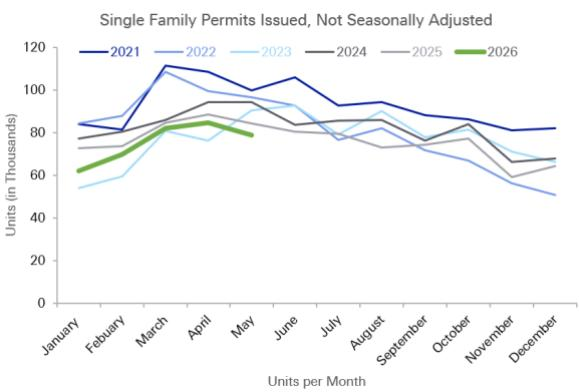

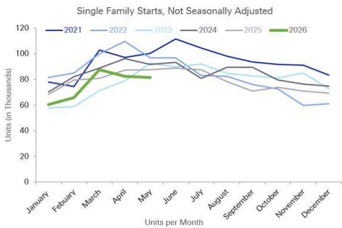

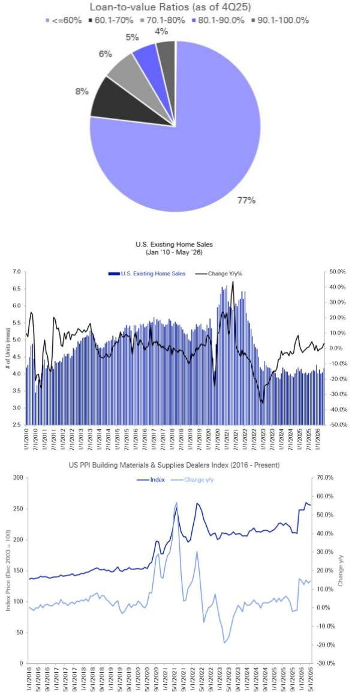  
Sources: FHFA.gov, Bloomberg Finance LP, U.S. Census Bureau, U.S Bureau of Labor Statistics and DB

## Bristow (VTOL) – Aerospace & Defense BUY on 6.75% Sr Sec'd Nts '33

Business Description: Leading global provider of helicopter transportation services into offshore energy and government services end-markets.

## Credit Highlights:

\- Fleet investment masking attractive FCF characteristics. The company is spending well above annual maintenance capex (of \~\$20mn) in 2026 and in 1H27.

\- Net leverage should end FYE26 at 1x and FYE27 at 0.4x. We see significant EBITDA growth and overall FCF of \$280mn over 2026 and 2027 which should drive organic de-leveraging.

\- Pledged collateral well covers notes. FMV of underlying helicopter-based collateral is \$1bn based on recent appraisal.

## Outperformance Rationale/Catalysts

\- Risk-reward favorable with ‘hard asset’ pledge under-appreciated, bonds slightly wide to BB-index, potential 8%+ total return. We think investors are over-looking the hard-asset value of the collateral of \$1bn which covers the notes by 2x. At an OAS of \~200bp, the bonds trade wide to BB-index of 160bp and should trade at or inside the index.

\- 2H27 run-rate cash flow expected to be about \$240mn. We estimate as fleet investment subsides, run-rate overall FCF will be about \$240mn in 2H27.

\- SAR ramp and O&G pricing should drive EBITDA improvement in 2026 and 2027. The ramping of recently won search-and-rescue (SAR) contracts with governments and favorable pricing resets on OES contracts should drive EBITDA to about \$298mn in 2026 (+21.1% y/y) and \$335mn in 2027 (+12.6% y/y).

Outstanding Issues

<table><tr><td>DBRec</td><td>BBGTicker</td><td>Ranking/Seniority</td><td>Coupon</td><td>Amt O/S</td><td>Maturity</td><td>Price</td><td>YTW/YTM*</td><td>DM/Sprd</td><td>Mdy&#x27;s/S&amp;P</td></tr><tr><td>BUY</td><td>VTOL</td><td>1L</td><td>6.750%</td><td>$500</td><td>2/1/2033</td><td>101.125</td><td>6.47%</td><td>199</td><td>Ba3/BB</td></tr></table>

Capital Structure Summary:

<table><tr><td>Description</td><td>Amt O/S</td><td>Gross</td><td>Net</td><td>at Mkt</td><td colspan="2">Other Info:</td></tr><tr><td>$70mn ABL Facility &#x27;31 (S+175)</td><td>$0</td><td></td><td></td><td></td><td>Adj. EBITDA</td><td>$247</td></tr><tr><td>IRCG Debt (E+195) &#x27;31 (€100mn)</td><td>$114</td><td></td><td></td><td></td><td>(-) Capex</td><td>$131</td></tr><tr><td>6.75% Sr Sec&#x27;d Nts &#x27;33</td><td>$500</td><td></td><td></td><td></td><td>(-) Cash Interest</td><td>$49</td></tr><tr><td>UKSAR Debt &#x27;36 (SONIA +275) (GBP 200)</td><td>$160</td><td></td><td></td><td></td><td>(-) Cash Taxes</td><td>$17</td></tr><tr><td rowspan="2">Total 1L Debt</td><td rowspan="2">$774</td><td rowspan="2">3.1x</td><td rowspan="2">1.7x</td><td rowspan="2">1.8x</td><td>&quot;Simple&quot; FCF</td><td>$50</td></tr><tr><td>as % of TD</td><td>6.4%</td></tr><tr><td>Total Debt</td><td>$774</td><td>3.1x</td><td>1.7x</td><td>1.8x</td><td></td><td></td></tr><tr><td>Cash on hand</td><td>($342)</td><td></td><td></td><td></td><td></td><td></td></tr><tr><td rowspan="2">Net Debt</td><td rowspan="2">$432</td><td rowspan="2"></td><td rowspan="2"></td><td rowspan="2"></td><td colspan="2">Liquidity:</td></tr><tr><td>Cash on hand</td><td>$342</td></tr><tr><td>MV of Equity</td><td>$1,277</td><td></td><td></td><td></td><td>Credit Lines</td><td>$52</td></tr><tr><td>Enterprise Value</td><td>$1,709</td><td></td><td>6.9x</td><td></td><td>Total Liquidity</td><td>$394</td></tr></table>

Sources: Company reports, DB and Bloomberg Finance LP.

# Park River Holdings Inc. (a/k/a Primesource) (PRIMBP) – Building Products BUY S+450 TL '31, 8.0% 1L Nts '31 and 8.75% 2L Nts '31

Business Description: Manufacturer and distributor of a range of building products including fasteners, cabinets and related accessories, and fencing hardware, among others. Owned by Clearlake Capital since 2020.

## Credit Highlights:

\- No near-term maturities through 2029. PRIMBP extended its capital structure in late-2025 with no near-term maturities until 2029 (RCF).

\- Significant prospective FCF generation of about \$66mn (p.a.) 2026 – 2027. Business requires limited capex at about 1% of total sales.

\- Overweight R&R, diverse product offering. \~70% of sales are from residential R&R. PRIMBP has a diversified set of product verticals including fasteners, kitchen and bath, and outdoor living.

## Outperformance Rationale/Catalysts

\- Mostly a carry trade, we view structure as attractive risk-adjusted total return at around $9 - 10\%$ . We think PRIMBP will continue to perform well as investors better appreciate the platform's unique credit characteristics relative to the sector. We prefer reaching down the quality curve to the 2Ls.

\- Limited drawdown risk to earnings on ‘asset-light’ model. We see revenue of decline of only (1.4)% y/y and EBITDA of \$355mn (-5.3% y/y) in 2026. Asset-lite model and inflation-resilience limit declines seen elsewhere across the sector.

\- Inflationary-resistant model with gross margins likely stable in 2026. Historically PRIMBP has managed well through inflationary periods (e.g. Section 232 tariffs) and we expect nothing different in 2026 with GMs flat at $35.4\%$ y/y.

■ Monetization potential as investment ages. Sponsor has been in PRIMBP since 2020, and we think monetization could be a catalyst in the next 12-24 months (subject to cyclical considerations).

Outstanding Issues

<table><tr><td>DB Rec</td><td>BBG Ticker</td><td>Ranking/ Seniority</td><td>Coupon</td><td>Amt O/S</td><td>Maturity</td><td>Price</td><td>YTW/YTM*</td><td>DM/Sprd</td><td>Mdy&#x27;s/ S&amp;P</td></tr><tr><td>BUY</td><td>PRIMBP</td><td>1L</td><td>S+450</td><td>$1,020</td><td>3/17/2031</td><td>99.875</td><td>8.34%</td><td>453</td><td>B3/B-</td></tr><tr><td>BUY</td><td>PRIMBP</td><td>1L</td><td>8.000%</td><td>$800</td><td>3/15/2031</td><td>101.250</td><td>7.39%</td><td>305</td><td>B3/B-</td></tr><tr><td>BUY</td><td>PRIMBP</td><td>2L</td><td>8.750%</td><td>$538</td><td>12/31/2030</td><td>98.125</td><td>9.25%</td><td>492</td><td>Caa2/CCC</td></tr></table>

Capital Structure Summary:

<table><tr><td>Description</td><td>Amt O/S</td><td>Gross</td><td>Net</td><td>at Mkt</td><td colspan="2">Other Info:</td></tr><tr><td>$790mn ABL Facility (S+200bp) &#x27;29</td><td>$218</td><td></td><td></td><td></td><td>Adj. EBITDA</td><td>$382</td></tr><tr><td>1L TL (S+450) &#x27;31</td><td>$1,020</td><td></td><td></td><td></td><td>(-) Capex</td><td>$34</td></tr><tr><td>8% Sr. Sec&#x27;d Nts &#x27;31</td><td>$800</td><td></td><td></td><td></td><td>(-) Cash Interest</td><td>$214</td></tr><tr><td>Finance leases / other</td><td>$55</td><td></td><td></td><td></td><td>(-) Cash Taxes</td><td>$25</td></tr><tr><td rowspan="2">Total 1L Debt</td><td rowspan="2">$2,093</td><td rowspan="2">5.5x</td><td rowspan="2">5.4x</td><td rowspan="2">5.5x</td><td>&quot;Simple&quot; FCF</td><td>$109</td></tr><tr><td>as % of TD</td><td>4.1%</td></tr><tr><td>8.75% 2L Nts &#x27;30</td><td>$538</td><td></td><td></td><td></td><td></td><td></td></tr><tr><td>Total Debt</td><td>$2,631</td><td>6.9x</td><td>6.9x</td><td>6.8x</td><td></td><td></td></tr><tr><td>Cash on hand</td><td>($12)</td><td></td><td></td><td></td><td></td><td></td></tr><tr><td rowspan="2">Net Debt</td><td rowspan="2">$2,620</td><td rowspan="2"></td><td rowspan="2"></td><td rowspan="2"></td><td colspan="2">Liquidity:</td></tr><tr><td>Cash on hand</td><td>$12</td></tr><tr><td>MV of Equity</td><td>NA</td><td></td><td></td><td></td><td>Credit Lines</td><td>$407</td></tr><tr><td>Enterprise Value</td><td>NA</td><td></td><td>NA</td><td></td><td>Total Liquidity</td><td>$419</td></tr></table>

Sources: Company reports, DB and Bloomberg Finance LP.

# Iris Holding, Inc. (a/k/a Intertape Polymer Group) (ITPCN) – Packaging BUY S+475 TL '28 and 10% SUNs '28

Business Description: Leading developer and manufacturer of a variety of packaging materials including tapes, shrink films, and protective, woven and non-woven products. Owned by Clearlake Capital since 2022.

## Credit Highlights:

■ Revenue positive due mostly to pricing, volumes outperforming ‘market’. We see ITPCN continuing to grow top-line, although mostly as a function of pricing/inflation pass-throughs. E-commerce driving above-market growth.

\- Extension needed in the relatively near-term. TL and bonds mature in 2028 likely requiring near-term A&E. Liquidity solid at \$269mn.

■ Cost initiatives driving margins. Gross margins continue to outperform expectations on high-ROIC capex investments and operational initiatives.

## Outperformance Rationale/Catalysts

\- Relative value compelling, total return likely 10%+. We see no performing credits in this yield context, on a risk-adjusted basis.

We see “friendly” A&E as most likely outcome. Conventional refinancing may be challenged at current levels, but we think there are a recent precedent A&E ‘trades’ that provide a playbook towards a creditor-friendly outcome.

\- Resin concerns over-blown with ability to pass-through costs quickly, relief from Iran conflict resolution (over time). We think concerns over Iran-conflict driven resin increases are overblown. ITPCN has historically been successful showing pricing power in past inflationary instances. Dilution to GMs is likely, but dollar-spread should remain stable. Limited contractual pass-throughs provide for timely realization.

■ FCF turning positive in 2027 and leverage falling to 6.5x (FYE27). We estimate EBITDA of \$277mn, +9% y/y, and see overall FCF of +\$20mn. We calculate net leverage of 6.5x at FYE27.

We think structure is covered through SUNs. We value the business at about 8x '27E, equal to an LTV of about 65% (1L) and 84% (SUNs).

Outstanding Issues

<table><tr><td>DBRec</td><td>BBGTicker</td><td>Ranking/Seniority</td><td>Coupon</td><td>Amt O/S</td><td>Maturity</td><td>Price</td><td>YTW/YTM*</td><td>DM/Sprd</td><td>Mdy&#x27;s/S&amp;P</td></tr><tr><td>BUY</td><td>ITPCN</td><td>1L</td><td>S+475</td><td>$1,448</td><td>6/28/2028</td><td>95.625</td><td>11.21%</td><td>718</td><td>B3/B-</td></tr><tr><td>BUY</td><td>ITPCN</td><td>Sr Unsec&#x27;d</td><td>10.000%</td><td>$400</td><td>12/15/2028</td><td>88.250</td><td>15.89%</td><td>1,179</td><td>Caa3/CCC</td></tr></table>

Capital Structure Summary:

<table><tr><td>Description</td><td>Amt O/S</td><td>Gross</td><td>Net</td><td>at Mkt</td><td colspan="2">Other Info:</td></tr><tr><td>$250mn ABL &#x27;31</td><td>$3</td><td></td><td></td><td></td><td>Adj. EBITDA</td><td>$263</td></tr><tr><td>1L TL (S+475bp, 50bpfl) &#x27;28</td><td>$1,448</td><td></td><td></td><td></td><td>(-) Capex</td><td>$56</td></tr><tr><td>Capital leases and other</td><td>$1</td><td></td><td></td><td></td><td>(-) Cash Interest</td><td>$164</td></tr><tr><td>Total 1L Debt</td><td>$1,452</td><td>5.5x</td><td>5.4x</td><td>5.1x</td><td>(-) Cash Taxes</td><td>$11</td></tr><tr><td></td><td></td><td></td><td></td><td></td><td>&quot;Simple&quot; FCF</td><td>$32</td></tr><tr><td>10% Sr. Unsec&#x27;d Nts &#x27;28</td><td>$400</td><td></td><td></td><td></td><td>as % of TD</td><td>1.7%</td></tr><tr><td>Other</td><td>$7</td><td></td><td></td><td></td><td></td><td></td></tr><tr><td>Total Debt</td><td>$1,859</td><td>7.1x</td><td>6.9x</td><td>6.7x</td><td></td><td></td></tr><tr><td>Cash on hand</td><td>($46)</td><td></td><td></td><td></td><td></td><td></td></tr><tr><td>Net Debt</td><td>$1,813</td><td></td><td></td><td></td><td colspan="2">Liquidity:</td></tr><tr><td></td><td></td><td></td><td></td><td></td><td>Cash on hand</td><td>$46</td></tr><tr><td>MV of Equity (private)</td><td>NA</td><td></td><td></td><td></td><td>Credit Lines</td><td>$223</td></tr><tr><td>Enterprise Value</td><td>NA</td><td></td><td></td><td></td><td>Total Liquidity</td><td>$269</td></tr></table>

Sources: Company reports, DB and Bloomberg Finance LP.

# Whirlpool Corporation (WHR) – Building Products BUY 2L Notes ‘31 & ’34 and 5Y CDS, SELL USD SUNs ‘29-‘50 Business Description: Manufactures and markets a full line of major home appliances and related products.

## Credit Highlights:

\- PF leverage now about \~8x (ex. foreign cash). Significant cash sits in foreign subsidiaries (Brazil/Mexico) which investors should heavily discount.

\- WHR has cleared near-term runway with \$2bn 2L deal. \$2bn ABL to be finalized, although terms not yet finalized.

■ Prospective FCF impacted by higher cash interest costs, earnings decline. We estimate EBITDA of \$823mn (20)% y/y and see risks skewed to the downside in 2026. PF annual cash interest increases by +\$125mn (+49% versus old structure) due to the recent deal.

## Outperformance Rationale/Catalysts

\- Outright short longer-dated SUNs, de-comp trades, and CDS are all attractive, offering total returns of 10%. We think SUNs should trade at +600bp or more and CDS at 525-550bp. Attractive trades we suggest are 1) outright long the 7.5s '31 2) paired/de-comp trades involving the 7.875s and SUNs with maturities above 5y+, 3) long 5Y CDS. To illustrate a couple examples, we see the 7.5s '31 potentially trading below +260bp (102+). We think the 6.5s '33 could trade at 81 (or below).

\- Leverage to peak at 9x+, earnings impacted by ongoing macro weakness in housing and inflation. We think leverage will peak at 9x in 3Q before finishing FYE26 at 8.4x. This is driven by EBITDA declines and FCF ‘burn’.

\- LTV through 2Ls at 29%, SUNs at \~95%. Based on our sum-of-the-parts analysis, we calculate a range of TEV at \$6.9bn - \$8.2bn (\$7.5bn mid-point). We think spreads on the SUNs (absolute and relative to 2Ls) need to be wider (SUNs) to compensate investors appropriately.

\- Secured indentures provide for more secured debt, further diluting creditors. We think risks are high that WHR will continue to use 1L/2L secured baskets to address relatively near-term maturities. Creditors with longer-duration maturities will see value eroded and need to price in this dynamic.

\- Contingent Brazilian liability remains a significant tail-risk. The company maintains a US\$775mn contingent liability (as of 1Q26) related to a basket of Brazilian export and tax-related issues. No view on timing but they remain a potential tail-risk.

Outstanding Issues

<table><tr><td>DB Rec</td><td>BBG Ticker</td><td>Ranking/ Seniority</td><td>Coupon</td><td>Amt O/S</td><td>Maturity</td><td>Price</td><td>YTW/YTM*</td><td>G-Spread</td><td>Mdy&#x27;s/ S&amp;P</td></tr><tr><td>BUY</td><td>WHR</td><td>2L</td><td>7.500%</td><td>$1,000</td><td>7/1/2031</td><td>101.625</td><td>7.02%</td><td>288</td><td>Ba1/BB+</td></tr><tr><td>BUY</td><td>WHR</td><td>2L</td><td>7.875%</td><td>$1,000</td><td>7/1/2034</td><td>101.125</td><td>7.60%</td><td>342</td><td>Ba1/BB+</td></tr><tr><td>SELL</td><td>WHR</td><td>Sr Unsec&#x27;d</td><td>4.750%</td><td>$700</td><td>2/26/2029</td><td>94.375</td><td>7.08%</td><td>299</td><td>B2/B+</td></tr><tr><td>SELL</td><td>WHR</td><td>Sr Unsec&#x27;d</td><td>6.125%</td><td>$600</td><td>6/15/2030</td><td>93.625</td><td>8.00%</td><td>386</td><td>B2/B+</td></tr><tr><td>SELL</td><td>WHR</td><td>Sr Unsec&#x27;d</td><td>2.400%</td><td>$300</td><td>5/15/2031</td><td>75.125</td><td>8.75%</td><td>458</td><td>B2/B+</td></tr><tr><td>SELL</td><td>WHR</td><td>Sr Unsec&#x27;d</td><td>4.700%</td><td>$300</td><td>5/14/2032</td><td>79.625</td><td>9.24%</td><td>500</td><td>B2/B+</td></tr><tr><td>SELL</td><td>WHR</td><td>Sr Unsec&#x27;d</td><td>5.500%</td><td>$300</td><td>3/1/2033</td><td>80.250</td><td>9.56%</td><td>527</td><td>B2/B+</td></tr><tr><td>SELL</td><td>WHR</td><td>Sr Unsec&#x27;d</td><td>6.500%</td><td>$600</td><td>6/15/2033</td><td>88.500</td><td>8.73%</td><td>443</td><td>B2/B+</td></tr><tr><td>SELL</td><td>WHR</td><td>Sr Unsec&#x27;d</td><td>5.750%</td><td>$300</td><td>3/1/2034</td><td>79.250</td><td>9.62%</td><td>528</td><td>B2/B+</td></tr><tr><td>SELL</td><td>WHR</td><td>Sr Unsec&#x27;d</td><td>5.150%</td><td>$250</td><td>3/1/2043</td><td>63.875</td><td>9.50%</td><td>471</td><td>B2/B+</td></tr><tr><td>SELL</td><td>WHR</td><td>Sr Unsec&#x27;d</td><td>4.500%</td><td>$500</td><td>6/1/2046</td><td>60.250</td><td>8.74%</td><td>378</td><td>B2/B+</td></tr><tr><td>SELL</td><td>WHR</td><td>Sr Unsec&#x27;d</td><td>4.600%</td><td>$500</td><td>5/15/2050</td><td>59.750</td><td>8.59%</td><td>364</td><td>B2/B+</td></tr><tr><td>BUY</td><td colspan="2">WHRCORP SR 5Y</td><td>Spread:</td><td>441</td><td></td><td></td><td></td><td></td><td></td></tr></table>

Capital Structure Summary:

<table><tr><td>Description</td><td>Amt O/S</td><td>Gross</td><td>Net</td><td>at Mkt</td><td colspan="2">Other Info:</td></tr><tr><td>$2bn ABL Facility &#x27;31</td><td>$211</td><td></td><td></td><td></td><td>Adj. EBITDA</td><td>$889</td></tr><tr><td>Subtotal - 1L</td><td>$211</td><td>0.2x</td><td>0.1x</td><td>0.1x</td><td>(-) Capex</td><td>$371</td></tr><tr><td>7.5% 2L Sr. Nts &#x27;31</td><td>$1,000</td><td></td><td></td><td></td><td>(-) Cash Interest</td><td>$428</td></tr><tr><td>7.875% 2L Sr. Nts &#x27;34</td><td>$1,000</td><td></td><td></td><td></td><td>(-) Cash Taxes</td><td>$214</td></tr><tr><td>Subtotal - 2L</td><td>$2,211</td><td>2.5x</td><td>2.4x</td><td>2.4x</td><td>&quot;Simple&quot; FCF</td><td>($124)</td></tr><tr><td>0.5% Sr. Nts &#x27;28 (€500mn)</td><td>$578</td><td></td><td></td><td></td><td>as % of TD</td><td>-1.7%</td></tr><tr><td>USD Notes Due &#x27;29-50</td><td>$4,350</td><td></td><td></td><td></td><td></td><td></td></tr><tr><td>Other / Commercial Paper</td><td>$22</td><td></td><td></td><td></td><td></td><td></td></tr><tr><td>Total Debt</td><td>$7,161</td><td>8.1x</td><td>8.0x</td><td>6.9x</td><td></td><td></td></tr><tr><td>Cash on hand</td><td>($94)</td><td></td><td></td><td></td><td></td><td></td></tr><tr><td>Net Debt</td><td>$7,067</td><td></td><td></td><td></td><td></td><td></td></tr><tr><td>8.5% Convertible Pref &#x27;29</td><td>$575</td><td></td><td></td><td></td><td></td><td></td></tr><tr><td>Net Debt + Pref</td><td>$7,642</td><td>8.7x</td><td>8.6x</td><td>8.4x</td><td colspan="2">Liquidity:</td></tr><tr><td></td><td></td><td></td><td></td><td></td><td>Cash on hand</td><td>$94</td></tr><tr><td>MV of Equity</td><td>$2,713</td><td></td><td></td><td></td><td>Credit Lines</td><td>$1,981</td></tr><tr><td>Enterprise Value</td><td>$10,356</td><td></td><td>11.7x</td><td></td><td>Total Liquidity</td><td>$2,075</td></tr></table>

Sources: Company reports, DB and Bloomberg Finance LP.

## Bristow (VTOL) downside risks

■ VTOL's exposure to offshore energy services makes them sensitive to volatility in oil & gas prices and drilling activity

■ A decline in the commodity could impact end-market/customer demand, with 15% exposure (within OES) to E&P activity

■ Management may seek to accelerate shareholder-friendly activity including M&A, buybacks and dividends

■ The collateral value of the helicopters could decline due to lower asset values

■ The company has incumbency under its SAR contracts but failure to perform could impact customer relationships

## Park River Holdings (PRIMBP) downside risks

■ PRIMBP has significant leverage, especially if one excludes prospective synergies.

\- The company competes in the highly competitive building products industry in addition to having cyclical end markets, including residential repair & remodeling and new residential construction.

A significant amount of the company's COGS are sourced from outside the US, which could be impacted by changes to tariff policies.

The company is 100% owned by private equity, and their economic interests could conflict with those of creditors, which could lead to aggressive shareholder-friendly activities.

## Iris Holdings (ITPCN) downside risks

■ Company is owned by private shareholders and their interests may differ from those of its creditors.

■ Significant customer concentration to Amazon.

■ Some of the businesses are sub-scale businesses (outside of water-activated tape) and compete with more diversified and larger competitors.

■ Many end markets are susceptible to macroeconomic challenges.

## Whirlpool Corporation (WHR) downside risks

■ Low housing and consumer demand could persist longer than expected and hamper a recovery in earnings.

\- With the new pro forma cash interest costs and a weak operating environment WHR could burn more FCF than expected and impede any sort of de-leveraging from current levels.

■ The company could, and is likely to, issue more secured debt that will be priming or dilutive to existing 2L holders.

## Whirlpool Corporation (WHR) upside risks

■ WHR could be a consolidation candidate (as reported in the press in 2024, re: Bosch's interest), which could cause a tightening in spreads.

■ WHR has significant exposure to consumer and housing end markets; a recovery could lead to better operating performance, earnings and credit metrics.

■ The company could seek to fully eliminate its dividend, which would improve free cash flow

## 06. Media/Business Services

Aaron Watts | +1 212 250-2592 | aaron.watts@db.com
Angeline Mathew | +1 212 250-3328 | angeline.Mathew@db.com

## HY Media Mid-Year 2026 Outlook

Ad-supported Media continues to face secular pressures (shift to digital). Advertising had a reasonably healthy start to the year but recently has faced some macro headwinds. Deregulation/consolidation remains topical.

## Advertising Themes:

■ Ad spend started the year on a positive note for many of the media sub-sectors we focus on, but conflict overseas and the macro backdrop here in the US has modestly cooled growth rates into 2Q.

■ For FY26, US advertising is projected to rise HSD% YoY, with growth fueled by digital and cyclicals (e.g. Olympics, Political, World Cup).

■ Political Ramping: The current (midterm) election is projected to be the most expensive ever, even surpassing the 2024 presidential cycle. CTV is seeing the largest share gains, while Broadcast TV is holding steady.

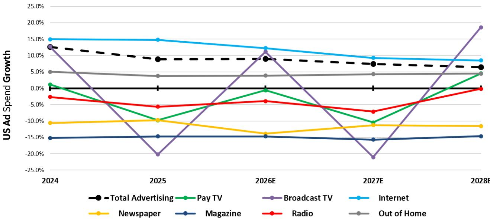  
Source: Magna, Bloomberg

## Secular Headwinds Persist:

■ Traditional media outlets continue to encounter...

■ Evolving linear viewership/listenership.

■ Loss of exclusive content.

■ Declining video subs and ad share erosion to Digital.

## Reasons for Optimism:

■ Deregulation & Consolidation: despite uncertainty due to the Nexstar+TEGNA process, we believe Media deregulation (FCC) & consolidation will play out over the near-term.

\- Re-bundling the Bundle: several MVPDs offering smaller/genre-focused packages and/or including streaming services as part of bundles appear to be fuelling a stabilization of video sub declines (potentially benefitting retrans fee income for TV broadcasters).

\- Record political spend expected in 2026. We do not believe the pending NRSC Supreme Court case will have a material impact on this year’s tallies.

■ Maturity runways extended as companies tap the market

■ Potential NFL TV Rights Extension: While there are questions & concerns around cost, locking in the most popular content is strategically imperative for traditional media.

Business Description: Gray Television, Inc. (GTN) is a local TV broadcaster that owns/operates television stations in 120 markets reaching \~37% of total US television households. The portfolio includes 103 markets with the #1/#2 rated station.

## Credit Highlights:

■ Top-Ranked Stations: 88% of markets with #1 and/or #2 ranked local stations (important for political)

■ Core Advertising: An encouraging start to the year (core +2% in 1Q) cooled off on macro factors (-MSD% in 2Q)

■ Distribution Visibility: Gray renewed 39% of its MVPD footprint YTD and is done for the year. Despite the DISH blackout, mgmt. see retrans growing for the full year.

■ Extended Maturity Runway: Gray has proactively pushed out front-end maturities, a theme we expect to continue.

## Outperformance Rationale/Catalysts

■ Focus on Debt Reduction: deleveraging a top priority with a repurchase authorization in place

■ Deregulation/Consolidation: Acquired stations at deleveraging prices. We expect Gray to continue seeking accretive M&A ops.

■ Political Ads: we expect GTN revs to be up vs 2024 cycle

■ NFL Rights Renewal: we view potential extension as +

## Return Profile

■ We think the 2L Notes and '30/'31 SUN's could trade towards HSD% and LDD% yields, resp.

Outstanding Issues

<table><tr><td>DB Rec</td><td>BBG Ticker</td><td>Ranking/ Seniority</td><td>Coupon</td><td>Amt O/S</td><td>Maturity</td><td>Price</td><td>YTW/YTM*</td><td>STW</td><td>Mdy&#x27;s/ S&amp;P</td></tr><tr><td>HOLD</td><td>GTN</td><td>1L TL</td><td>6.735%</td><td>$739</td><td>12/1/2028</td><td>100.188</td><td>6.9%</td><td>292</td><td>Ba3 / B+</td></tr><tr><td>HOLD</td><td>GTN</td><td>1L Notes</td><td>10.500%</td><td>$1,125</td><td>7/15/2029</td><td>105.618</td><td>5.1%</td><td>139</td><td>Ba3 / B+</td></tr><tr><td>NR</td><td>GTN</td><td>1L Notes</td><td>7.250%</td><td>$775</td><td>8/15/2033</td><td>97.498</td><td>7.7%</td><td>337</td><td>Ba3 / B+</td></tr><tr><td>BUY</td><td>GTN</td><td>2L Notes</td><td>9.625%</td><td>$900</td><td>7/15/2032</td><td>95.298</td><td>10.7%</td><td>643</td><td>B3 / CCC</td></tr><tr><td>BUY</td><td>GTN</td><td>Senior Notes</td><td>4.750%</td><td>$790</td><td>10/15/2030</td><td>71.719</td><td>13.6%</td><td>944</td><td>Caa1 / CCC</td></tr><tr><td>BUY</td><td>GTN</td><td>Senior Notes</td><td>5.375%</td><td>$1,220</td><td>11/15/2031</td><td>69.628</td><td>13.5%</td><td>923</td><td>Caa1 / CCC</td></tr></table>

Source: Company reports, DB, and Bloomberg Finance LP

Capital Structure Summary:

<table><tr><td>Description</td><td>Amt O/S</td><td>Gross</td><td>Net</td><td>at Mkt</td><td colspan="2">Other Info:</td></tr><tr><td>RCF ($700mm) mat 12/1/28</td><td>$0</td><td></td><td></td><td></td><td>Adj. LTM EBITDA</td><td>$664</td></tr><tr><td>TL D (S+300; 0% flr) mat 12/1/28</td><td>$739</td><td></td><td></td><td></td><td>(-) Capex</td><td>$112</td></tr><tr><td>TL F (S+525; 0% flr) mat 6/4/29</td><td>$10</td><td></td><td></td><td></td><td>(-) Cash Interest</td><td>$473</td></tr><tr><td>10.5% Senior Secured Notes due &#x27;29</td><td>$1,125</td><td></td><td></td><td></td><td>(-) Cash Taxes</td><td>$35</td></tr><tr><td>7.25% 1L Notes due 8/15/33</td><td>$775</td><td></td><td></td><td></td><td>&quot;Simple&quot; FCF</td><td>$44</td></tr><tr><td rowspan="2">Total 1L Debt</td><td rowspan="2">$2,649</td><td>4.0x</td><td>3.6x</td><td>3.6x</td><td rowspan="2">as % of TD</td><td rowspan="2">0.8%</td></tr><tr><td>2.8x</td><td>2.6x</td><td>2.5x</td></tr><tr><td>9.625% 2L Notes due &#x27;32</td><td>$1,150</td><td></td><td></td><td></td><td rowspan="7">L8Q EBITDA</td><td rowspan="7">$934</td></tr><tr><td rowspan="2">Total 2nd Lien Debt</td><td rowspan="2">$3,799</td><td>5.7x</td><td>5.3x</td><td>5.2x</td></tr><tr><td>4.1x</td><td>3.8x</td><td>3.7x</td></tr><tr><td>5.875% Senior Notes due &#x27;26</td><td>$0</td><td></td><td></td><td></td></tr><tr><td>4.75% Senior Notes due &#x27;30</td><td>$790</td><td></td><td></td><td></td></tr><tr><td>5.375% Senior Notes due &#x27;31</td><td>$1,219</td><td></td><td></td><td></td></tr><tr><td>Total Debt</td><td>$5,808</td><td>8.7x</td><td>8.4x</td><td>7.5x</td></tr><tr><td>Cash on hand</td><td>($259)</td><td>6.2x</td><td>5.9x</td><td>5.3x</td><td colspan="2">Liquidity:</td></tr><tr><td>Net Debt</td><td>$5,549</td><td></td><td></td><td></td><td>Cash on hand</td><td>$259</td></tr><tr><td>Series A Perpetual Pref Stock</td><td>$650</td><td></td><td></td><td></td><td>Credit Lines</td><td>$745</td></tr><tr><td>Market Cap</td><td>$370</td><td></td><td></td><td></td><td rowspan="2">Total Liquidity</td><td rowspan="2">$1,004</td></tr><tr><td>Enterprise Value</td><td>$6,569</td><td></td><td>9.9x</td><td></td></tr></table>

Business Description: iHeartMedia, Inc (IHRT) is the largest radio operator in the U.S., with a portfolio that includes >860 live broadcast stations in >160 markets, a leading digital/podcast platform, Premiere Networks, and rep firm Katz Media.

## Credit Highlights:

\- Scale Matters: IHRT’s stations + leading digital offerings provide a unique selling benefit to advertisers that allows for outperformance relative to peers

■ Diversification: No ad vertical >5% of revenue

\- Tightened Docs: Prior LME exercise (late 2024) tightened up docs/covenants up for lenders

■ Free Cash Flow: IHRT continues to produce positive FCF

## Outperformance Rationale/Catalysts

\- Cost Save Plan: recently announced \$50mm of incremental savings beginning in 2H26, in additional to previously announced \$100mm of in-year reductions.

\- Targets Affirmed: In tandem with 1Q earnings, mgmt. affirmed full year guidance calling for \$800mm of EBITDA and \$200mm free cash flow.

Digital Growth: we expect continued double-digit digital growth, fueled by iHeart's leading podcast platform

■ Political: with a revamped sales team & tech stack, iHeart should benefit from what is expected to be record ad spend. Digitization of Broadcast Ad Inventory: broadcast programmatic revenue trajectory exp. to mirror podcasting

## Return Profile

■ We think the 1L debt can trade towards \~HSD% yields

Outstanding Issues

<table><tr><td>DB Rec</td><td>BBG Ticker</td><td>Ranking/ Seniority</td><td>Coupon</td><td>Amt O/S</td><td>Maturity</td><td>Price</td><td>YTW/YTM*</td><td>STW</td><td>Mdy&#x27;s/ S&amp;P</td></tr><tr><td>BUY</td><td>IHRT</td><td>1L</td><td>S +577.5</td><td>$2,119</td><td>5/1/2029</td><td>95.750</td><td>11.5%</td><td>753</td><td>Caa1/CCC+</td></tr><tr><td>BUY</td><td>IHRT</td><td>1L</td><td>4.750%</td><td>$277</td><td>1/15/2028</td><td>96.241</td><td>7.4%</td><td>343</td><td>Caa1/CCC+</td></tr><tr><td>BUY</td><td>IHRT</td><td>1L</td><td>9.125%</td><td>$718</td><td>5/1/2029</td><td>97.766</td><td>10.1%</td><td>596</td><td>Caa1/CCC+</td></tr><tr><td>BUY</td><td>IHRT</td><td>1L</td><td>7.750%</td><td>$661</td><td>8/15/2030</td><td>93.456</td><td>9.7%</td><td>555</td><td>Caa1/CCC+</td></tr><tr><td>BUY</td><td>IHRT</td><td>1L</td><td>7.000%</td><td>$178</td><td>1/15/2031</td><td>89.395</td><td>10.0%</td><td>584</td><td>Caa1/CCC+</td></tr><tr><td>HOLD</td><td>IHRT</td><td>2L</td><td>10.875%</td><td>$675</td><td>5/1/2030</td><td>86.464</td><td>15.7%</td><td>1,153</td><td>Caa3/CCC-</td></tr></table>

Source: Company reports, DB, and Bloomberg Finance LP

Capital Structure Summary:

<table><tr><td>Description</td><td>Amt O/S</td><td>Gross</td><td>Net</td><td>at Mkt</td><td colspan="2">Other Info:</td></tr><tr><td>ABL Facility due 2027 ($450mm)</td><td>$50</td><td></td><td></td><td></td><td>Adj. EBITDA</td><td>$668</td></tr><tr><td>4.75% 1L Notes due 2028</td><td>$277</td><td></td><td></td><td></td><td>(-) Capex</td><td>$84</td></tr><tr><td>2029 TL (S+577.5) mat May 2029</td><td>$2,119</td><td></td><td></td><td></td><td>(-) Cash Interest</td><td>$399</td></tr><tr><td>9.125% Sr Sec&#x27;d Notes due May 2029</td><td>$718</td><td></td><td></td><td></td><td>(-) Cash Taxes</td><td>$14</td></tr><tr><td>7.750% Sr Sec&#x27;d Notes due Aug 2030</td><td>$661</td><td></td><td></td><td></td><td>&quot;Simple&quot; FCF</td><td>$171</td></tr><tr><td>7.000% Sr Sec&#x27;d Notes due Jan 2031</td><td>$178</td><td></td><td></td><td></td><td>as % of TD</td><td>3.6%</td></tr><tr><td>Other debt</td><td>$5</td><td></td><td></td><td></td><td></td><td></td></tr><tr><td>1st Lien - Subtotal</td><td>$4,008</td><td>5.4x</td><td>5.3x</td><td>5.0x</td><td></td><td></td></tr><tr><td></td><td></td><td></td><td></td><td></td><td>Less: Cash Reorg</td><td>$61</td></tr><tr><td>10.875% 2L Notes due May 2030</td><td>$675</td><td></td><td></td><td></td><td>Plus: Δ WC</td><td>$36</td></tr><tr><td>2nd Lien - Subtotal</td><td>$4,683</td><td>6.4x</td><td>6.2x</td><td>6.1x</td><td>FCF</td><td>$146</td></tr><tr><td></td><td></td><td></td><td></td><td></td><td>as % of TD</td><td>3.0%</td></tr><tr><td>Holdout 1L TL due 2026</td><td>$5</td><td></td><td></td><td></td><td></td><td></td></tr><tr><td>Holdout 1L Incr TL due 2026</td><td>$2</td><td></td><td></td><td></td><td></td><td></td></tr><tr><td>3rd Priority - Subtotal</td><td>$4,690</td><td>6.4x</td><td>6.2x</td><td>6.2x</td><td></td><td></td></tr><tr><td>Holdout 6.375% 1L Notes due 2026</td><td>$45</td><td></td><td></td><td></td><td></td><td></td></tr><tr><td>Holdout 5.250% 1L Notes due 2027</td><td>$7</td><td></td><td></td><td></td><td></td><td></td></tr><tr><td>Sr Uns Notes due 2027</td><td>$72</td><td></td><td></td><td></td><td></td><td></td></tr><tr><td>Total Debt</td><td>$4,814</td><td>6.5x</td><td>6.4x</td><td>6.4x</td><td colspan="2">Liquidity:</td></tr><tr><td>Cash on hand</td><td>($135)</td><td></td><td></td><td></td><td>Cash on hand</td><td>$135</td></tr><tr><td>Net Debt</td><td>$4,679</td><td></td><td></td><td></td><td>Credit Lines</td><td>$370</td></tr><tr><td>Market Cap</td><td>$622</td><td></td><td></td><td></td><td>Total Liquidity</td><td>$505</td></tr><tr><td>Enterprise Value</td><td>$5,304</td><td></td><td>7.2x</td><td></td><td></td><td></td></tr></table>

Source: Company reports, DB, and Bloomberg Finance LP

## Gray Television (GTN)

\- Downside Risks

• Economic downturn resulting in material pull back of advertising spend

• Acceleration in MVPD subscriber losses, and continued shift of viewers from linear TV to streaming outlets

• Slower than expected activity levels at Assembly Atlanta, limiting income generation

\- Inability to de-lever as planned, and/or further erosion in LTV cushion

\- Upside Risks

\- Faster-than-expected advertising recovery

• Near-term materially deleveraging M&A transaction

## iHeart Media (IHRT)

\- Downside Risks

• Company failing to deliver on cost cutting initiatives

\- Broadcast radio listenership declines accelerating, resulting in further advertising pullback

• Digital advertising growth slowing

\- Upside Risks

• Better-than-expected core advertising performance (macro pressures easing)

• Reported M&A coming to fruition

## Rental Services, Auto Suppliers and Metals & Mining

Sean Wondrack | +1 917 609-2501 | sean-m.wondrack@db.com

## Equipment Rental Services – 2026 Mid-year Outlook Constructive on equipment rental credits heading into 2H-2026

## Sector Highlights:

Large projects are driving demand, offsetting sluggish non-res demand. Mega projects continue to drive underlying growth in the sector and offset soft local markets. Manufacturing, infrastructure, power, utility and data center demand is effectively masking weak nonresidential construction trends.

\- The scale advantage is accelerating share gains for larger rental companies. Companies with a national reach continue to take market share from smaller local and regional operators. Serving mega projects requires a large number of units, breadth of equipment and technology.

\- While mega projects may moderate in future years, the level of demand should remain elevated. Large data centers can take 2-4 years to build, while semiconductor fabs consume \~3-5 years and transmission/utility projects frequently span multiple years (i.e.. a \$125 billion project-start environment in 2026 supports utilization and fleet demand through 2028-2030). While mega-project starts may normalize from roughly \$125 billion today to \~\$105-\$110 billion by 2030, they are still > 2x pre-2022 levels and supportive of above-cycle demand for URI, EQMSRM, HRI, SUNB and others.

The ARA raised its growth forecast in May and now expects U.S. construction/industrial equipment and tool rental revenue to grow 3.6% (vs. 2.8%). Traditional nonresidential construction remains soft, meaning much of the current resilience is being driven by a relatively narrow set of very large projects rather than broad-based construction strength, coupled with continued secular penetration. This is expected to improve to 3.8% in '27 and 4.4% in '28.

North America Construction Mkts  
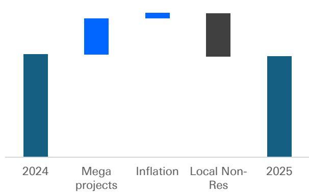  
Planned Mega Projects (\$B, N. America)

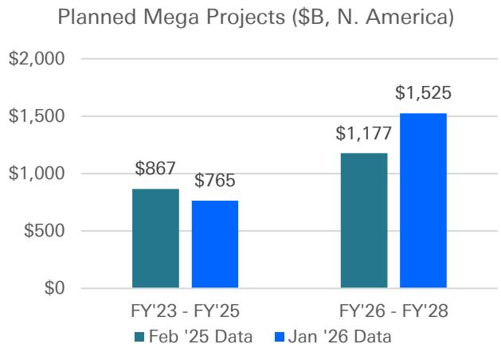

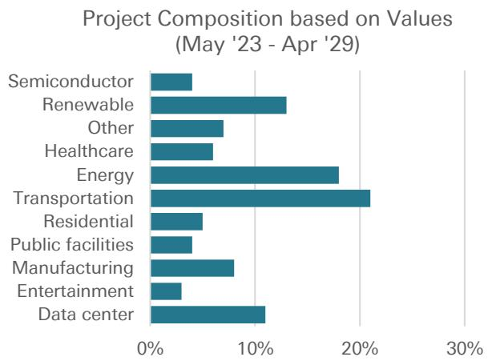

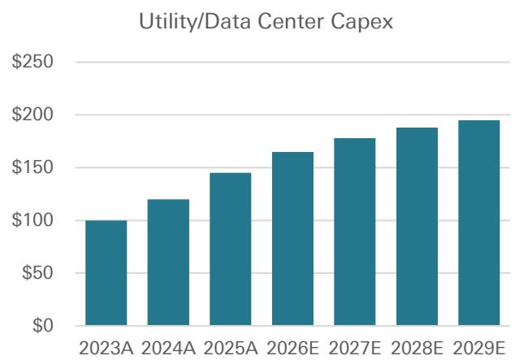  
Sources: Company Reports, Bloomberg Finance LP, United Rentals, SunBelt Rentals, Herc Rentals, IIR, Dodge, ARA.

Business Description: Herc is one of the largest and most diversified equipment rental companies in North America.

## Credit Highlights

\- Combination with HEES created third-largest rental operator. Purchased HEES for 8.1x (ex-synergies) with PF net leverage of 3.6x at close. HRI guided to below \~3.0x within 2 years.

\- Size & Scale benefits. Herc's scale increased dramatically with the H&E merger and strengthened in many end markets.

■ Secular tailwinds. Beneficiary of secular shift to rent vs. own.

■ Mega Project activity continues to drive cycle... Mega projects are driving underlying growth and offsetting soft local non-res construction markets.

## Outperformance Rationale/Catalysts

■ EBITDA to benefit from synergies. Should help offset any organic declines or weaker non-res construction demand.

■ HRI should gain operating leverage over fixed costs as it integrates H&E. Now that HRI has achieved critical scale, it should generate stronger incremental margins over fixed costs in a market still expected to grow in 2H-2026.

\- Solid total return prospects. Should HRI delever from \~4.1x currently to \~3.0x over the next 12-18 months, could see 100bp of spread tightening for total return of \~9-11%.

Outstanding Issues

<table><tr><td>DB Rec</td><td>BBG Ticker</td><td>Ranking/ Seniority</td><td>Coupon</td><td>Amt O/S</td><td>Maturity</td><td>Price</td><td>YTW/YTM*</td><td>STW</td><td>Mdy&#x27;s/ S&amp;P</td></tr><tr><td>BUY</td><td>HRI</td><td>1L</td><td>S+175</td><td>$748</td><td>6/2/2032</td><td>100.125</td><td>3.12%</td><td>172</td><td>Baa3 / BBB-</td></tr><tr><td>BUY</td><td>HRI</td><td>Sr. Unsec&#x27;d</td><td>6.625%</td><td>$800</td><td>6/15/2029</td><td>102.513</td><td>5.28%</td><td>109</td><td>Ba3 / BB-</td></tr><tr><td>BUY</td><td>HRI</td><td>Sr. Unsec&#x27;d</td><td>7.000%</td><td>$1,650</td><td>6/15/2030</td><td>103.830</td><td>5.59%</td><td>125</td><td>Ba3 / BB-</td></tr><tr><td>BUY</td><td>HRI</td><td>Sr. Unsec&#x27;d</td><td>5.750%</td><td>$600</td><td>3/15/2031</td><td>100.102</td><td>5.72%</td><td>139</td><td>Ba3 / BB-</td></tr><tr><td>BUY</td><td>HRI</td><td>Sr. Unsec&#x27;d</td><td>7.250%</td><td>$1,100</td><td>6/15/2033</td><td>104.603</td><td>5.94%</td><td>141</td><td>Ba3 / BB-</td></tr><tr><td>BUY</td><td>HRI</td><td>Sr. Unsec&#x27;d</td><td>6.000%</td><td>$600</td><td>3/15/2034</td><td>99.352</td><td>6.10%</td><td>149</td><td>Ba3 / BB-</td></tr></table>

\*swapped where applicable

Capital Structure Summary  
Sources: DB, Company Reports, Bloomberg Finance LP.

<table><tr><td>Description</td><td>Amt O/S</td><td>Gross</td><td>Net</td><td>at Mkt</td><td colspan="2">Other info:</td></tr><tr><td>ABL Credit Facility</td><td>$1,981</td><td></td><td></td><td></td><td>LTM Adj. EBITDA</td><td>$1,924</td></tr><tr><td>A/R Securitization</td><td>$475</td><td></td><td></td><td></td><td>PF Adj. EBITDA</td><td>$2,324</td></tr><tr><td>1L S+200bp TL-B &#x27;32</td><td>$748</td><td></td><td></td><td></td><td>2026 EBITDA Est.</td><td>$2,042</td></tr><tr><td>Other secured debt</td><td>$31</td><td></td><td></td><td></td><td>(-) Capex</td><td>$712</td></tr><tr><td>Total Secured Debt</td><td>$3,235</td><td>1.7x</td><td>1.7x</td><td>1.7x</td><td>(-) Cash Interest</td><td>$512</td></tr><tr><td>6.625% Sr. Nts &#x27;29</td><td>$800</td><td></td><td></td><td></td><td>(-) Cash Taxes</td><td>$48</td></tr><tr><td>7.000% Sr. Nts &#x27;30</td><td>$1,650</td><td></td><td></td><td></td><td>(-) Dividends</td><td>$98</td></tr><tr><td>5.750% Sr. Nts &#x27;31</td><td>$600</td><td></td><td></td><td></td><td>(-) Chg in W/C</td><td>$103</td></tr><tr><td>7.250% Sr. Nts &#x27;33</td><td>$1,100</td><td></td><td></td><td></td><td>2026 Simple FCF</td><td>$569</td></tr><tr><td>6.000% Sr. Nts &#x27;34</td><td>$600</td><td></td><td></td><td></td><td>Simple FCF % TD</td><td>7.1%</td></tr><tr><td>Total Debt</td><td>$7,985</td><td>4.2x</td><td>4.1x</td><td>4.1x</td><td></td><td></td></tr><tr><td>Cash on hand</td><td>($43)</td><td></td><td></td><td></td><td colspan="2">Liquidity:</td></tr><tr><td>Net Debt</td><td>$7,942</td><td></td><td></td><td></td><td>Cash</td><td>$43</td></tr><tr><td>Market Cap</td><td>$5,124</td><td></td><td></td><td></td><td>Credit Lines</td><td>$1,906</td></tr><tr><td>Enterprise Value</td><td>$13,066</td><td></td><td>6.8x</td><td></td><td>Total Liquidity</td><td>$1,949</td></tr></table>

Sources: DB, Company Reports, Bloomberg Finance LP.

## E

## al Services

## Buy the 2L bonds

Business Description: One of the largest rental firms in North America, EquipmentShare is a nationwide construction technology and equipment solutions provider dedicated to transforming the construction industry through innovative tools, platforms and data-driven insights.

## Credit Highlights

\- T3 Engagement Drives Recurring National Account business. Existing customers \~80% of revenue at new stores.

■ Secular tailwinds. Beneficiary of secular shift to rent vs. own.

\- OWN program allows EquipmentShare to scale faster than peers. The OWN program effectively cuts capex in half. EQPT gets the benefit of scale from the higher capex and a stream of cash flows without investing any capex on OWN fleet.

\- >80% of mega projects are in serviceable range of existing markets... Mega projects are backfilling softer non-residential construction trends and EQPT is capitalizing.

## Outperformance Rationale/Catalysts

\- Stable credit metrics, excess yield. Company has said it expects net leverage in the high 2x's to low 3x's, \~7% yield.

\- Will tighten as investors grow more familiar. The company operates differently than peers and it takes some getting used to; growing track record should allow spreads to normalize more in line with peers, driving outperformance.

\- Nice total return prospects. We believe we could see OAS tighten \~50bp for \~3 points of upside potential and a total return of \~12%, especially if we see upward ratings pressure.

Outstanding Issues

<table><tr><td>DB Rec</td><td>BBG Ticker</td><td>Ranking/ Seniority</td><td>Coupon</td><td>Amt O/S</td><td>Maturity</td><td>Price</td><td>YTW/YTM</td><td>STW</td><td>Mdy&#x27;s/ S&amp;P</td></tr><tr><td>BUY</td><td>EQMSRM</td><td>2L</td><td>9.000%</td><td>$1,040</td><td>5/15/2028</td><td>103.343</td><td>5.19%</td><td>136</td><td>B3 / B</td></tr><tr><td>BUY</td><td>EQMSRM</td><td>2L</td><td>8.625%</td><td>$600</td><td>5/15/2032</td><td>104.857</td><td>6.76%</td><td>235</td><td>B3 / B</td></tr><tr><td>BUY</td><td>EQMSRM</td><td>2L</td><td>8.000%</td><td>$500</td><td>3/15/2033</td><td>103.596</td><td>6.74%</td><td>227</td><td>B3 / B</td></tr></table>

\*swapped where applicable

Sources: DB, Company Reports, Bloomberg Finance LP.  
Capital Structure Summary

<table><tr><td>Description</td><td>Amt O/S</td><td>Gross</td><td>Net</td><td>at Mkt</td><td colspan="2">Other Info:</td></tr><tr><td></td><td></td><td></td><td></td><td></td><td>LTM Adj. EBITDA</td><td>$1,043</td></tr><tr><td>$3.0bn ABL RCF &#x27;30</td><td>$999</td><td></td><td></td><td></td><td>&#x27;26 Adj. EBITDA</td><td>$1,078</td></tr><tr><td>Capital leases/other secured</td><td>$244</td><td></td><td></td><td></td><td>&#x27;26 Cash EBITDA</td><td>$878</td></tr><tr><td>Other 1L debt</td><td>$12</td><td></td><td></td><td></td><td>(-) Net Capex</td><td>$895</td></tr><tr><td>Total 1L Debt</td><td>$1,255</td><td>1.2x</td><td>0.9x</td><td>0.9x</td><td>(-) Cash Interest</td><td>$282</td></tr><tr><td></td><td></td><td></td><td></td><td></td><td>(-) Cash Taxes</td><td>$2</td></tr><tr><td>9.000% 2L &#x27;28</td><td>$1,034</td><td></td><td></td><td></td><td>(-) Chg in W/C</td><td>$308</td></tr><tr><td>8.625% 2L &#x27;32</td><td>$600</td><td></td><td></td><td></td><td>(-) Acq/IPO/Div</td><td>($669)</td></tr><tr><td>8.000% 2L &#x27;33</td><td>$500</td><td></td><td></td><td></td><td>(-) Pay/add debt</td><td>$201</td></tr><tr><td>Total Debt</td><td>$3,389</td><td>3.2x</td><td>2.9x</td><td>2.9x</td><td>&quot;Simple&quot; FCF</td><td>($141)</td></tr><tr><td></td><td></td><td></td><td></td><td></td><td>&#x27;26 as a % of TD</td><td>NM</td></tr><tr><td>Cash on hand</td><td>($329)</td><td></td><td></td><td></td><td colspan="2">Liquidity:</td></tr><tr><td>Net Debt</td><td>$3,060</td><td></td><td></td><td></td><td>Cash on hand</td><td>$329</td></tr><tr><td>Market Cap</td><td>$5,497</td><td></td><td></td><td></td><td>Credit Lines</td><td>$1,276</td></tr><tr><td>Enterprise Value</td><td>$8,557</td><td></td><td>8.2x</td><td></td><td>Total Liquidity</td><td>$1,605</td></tr></table>

Sources: DB, Company Reports, Bloomberg Finance LP.

## Sector Highlights:

\- North American production stable but growth remains muted. OEM inventories have largely normalized and production schedules have improved, though affordability and higher financing costs continue to constrain industry volumes. Most forecasts call for relatively flat NA production through 2027.

\- Tariffs and supply localization requirements are creating winners and losers. Suppliers with smaller U.S. footprints and high levels of imported content exposure face structural margin pressure, while domestic manufacturers and service-oriented businesses have been relatively insulated.

\- Supplier trends are nuanced. Exposure to SUVs, pickups and ICE-powertrain remains favorable, while suppliers tied to EV-only programs, European OEMs and the Chinese luxury market continue to face pressure. Aftermarket trends seem marginally better but are still oscillating at lower levels.

\- USMCA + Tariffs. The largest risk to the sector remains uncertainty surrounding USMCA implementation/ rule changes and tariff pass-through timing.

\- Collision repair appears to be stabilizing and potentially improving from low levels. Fundamentals remain strong with an aging car parc, higher repair complexity driven by ADAS, better repair versus total loss economics and share gains by multi-store operators including CRASHC, CALCOL and BYDCN.

\- The Middle East conflict has increased inflation risks. Many auto suppliers were operating under the assumption that inflationary aluminum, oil, petrochemical and logistics costs would normalize to some degree into the summer and 2H-2026. Iran-related commodity inflation remains a growing headwind with the greatest exposure around tires, interiors and rubber-intensive suppliers. Customer recoveries often lag commodity movements by 1-2 quarters.

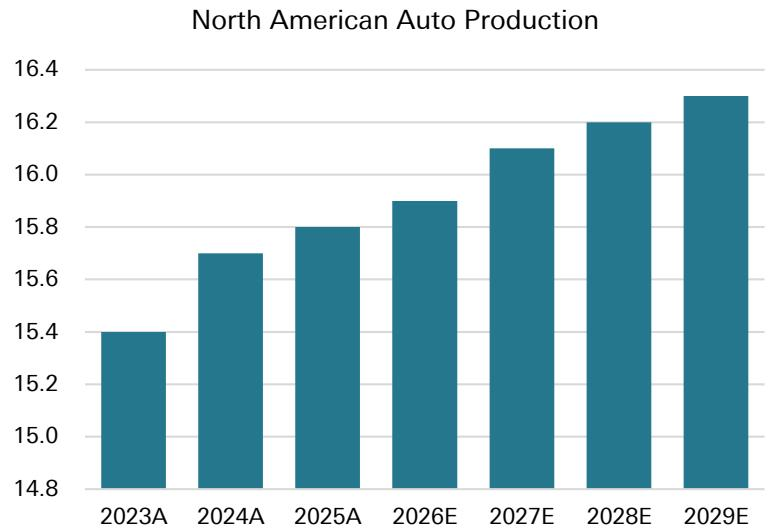

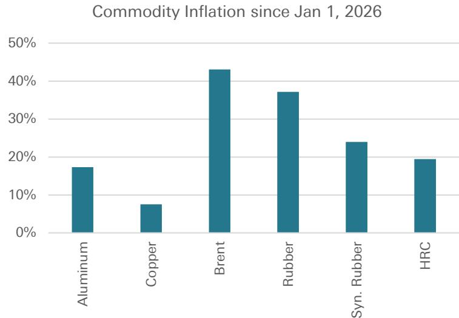

## Rivian Automotive (RIVN, RIVHOL) – Automotive Suppliers BUY the HoldCo notes

Business Description: Rivian Automotive is an electric vehicle manufacturer and technology company that designs, builds and sells vehicles.

## Credit Highlights

\- \$13.6 billion of liquidity and future capital. Rivian has \~\$13.6 billion of liquidity and expected milestone payments (conditional) that should alleviate liquidity burden for the next two years as R2 ramps and Rivian drives towards profits.

\- Software is becoming a real business. Rivian is creating an enterprise not solely dependent on continuously selling new vehicles; VW partnership validates Rivian's software.

\- Significant imbedded asset value. Aside from a rapidly expanding auto business Rivian also has software, robots, a last-mile venture and autonomous IP in its portfolio.

## Outperformance Rationale/Catalysts

\- R2 ramp. If Rivian is able to manage the R2 ramp with good demand and without meaningful disruption, investors will find the “scalable EV-automaker” story far more credible.

■ Additional capital raises/partnerships. Should Rivian raise additional equity capital in the coming year, this would further ease investor concerns around liquidity through the ramp of the R2, and Rivian appears willing to partner.

■ Continued reduction in cash burn. Each quarter that Rivian narrows EBITDA losses/FCF burn extends its liquidity runway.

\- Bonds offer double-digit yields YoY (\~14%). If Rivian is able to ramp R2 and preserve liquidity, we see bond yields falling below 10% and 100bp of tightening for \~14% total return.

Outstanding Issues

<table><tr><td>DB Rec</td><td>BBG Ticker</td><td>Ranking/ Seniority</td><td>Coupon</td><td>Amt O/S</td><td>Maturity</td><td>Price</td><td>YTW/YTM</td><td>STW</td><td>Mdy&#x27;s/ S&amp;P</td></tr><tr><td>BUY</td><td>RIVHOL</td><td>1L HoldCo</td><td>10.000%</td><td>$1,250</td><td>1/15/2031</td><td>99.544</td><td>10.12%</td><td>584</td><td>N/A / N/A</td></tr></table>

Sources: DB, Company Reports, Bloomberg Finance LP.

Capital Structure Summary

<table><tr><td>Description</td><td>Amt O/S</td><td>Gross</td><td>Net</td><td>at Mkt</td><td colspan="2">Other Info:</td></tr><tr><td>$1.5bn ABL RCF &#x27;30</td><td>-</td><td></td><td></td><td></td><td>&#x27;29 Adj. EBITDA</td><td>$2,042</td></tr><tr><td>Other OpCo debt</td><td>-</td><td></td><td></td><td></td><td>&#x27;29 PF Net Debt</td><td>$3,286</td></tr><tr><td>Total Debt - OpCo</td><td>-</td><td>0.0x</td><td>-0.6x</td><td>-0.6x</td><td></td><td></td></tr><tr><td>Cash on hand</td><td>($4,830)</td><td></td><td></td><td></td><td>&#x27;29 OCF</td><td>$2,128</td></tr><tr><td>Net Debt - OpCo</td><td>($4,830)</td><td></td><td></td><td></td><td>(-) Net Capex</td><td>$2,000</td></tr><tr><td rowspan="2">10.0% Sr Sec&#x27;d Holdco Nts 1/15/31</td><td rowspan="2">$1,250</td><td></td><td></td><td></td><td>Simple FCF</td><td>$128</td></tr><tr><td></td><td></td><td></td><td>Simple FCF/PF Debt</td><td>4%</td></tr><tr><td>Total Debt - HoldCo</td><td>$1,250</td><td>0.6x</td><td>0.0x</td><td>0.0x</td><td></td><td></td></tr><tr><td>Cash on hand</td><td>($4,830)</td><td></td><td></td><td></td><td></td><td></td></tr><tr><td>Net Debt - HoldCo</td><td>($3,580)</td><td></td><td></td><td></td><td></td><td></td></tr><tr><td>4.625% Convertible Nts 3/15/29</td><td>$1,500</td><td></td><td></td><td></td><td>Liquidity</td><td></td></tr><tr><td>3.625% Convertible Nts 10/15/30</td><td>$1,725</td><td></td><td></td><td></td><td>Cash on hand</td><td>$4,830</td></tr><tr><td>Total Debt - TopCo</td><td>$4,475</td><td>2.2x</td><td>1.6x</td><td>1.6x</td><td>Credit Lines</td><td>$564</td></tr><tr><td>Cash on hand</td><td>($4,830)</td><td></td><td></td><td></td><td>Future VW Capital</td><td>$2,460</td></tr><tr><td>Net Debt - TopCo</td><td>($355)</td><td></td><td></td><td></td><td>Future Uber Capital</td><td>$950</td></tr><tr><td>Market Cap</td><td>$20,085</td><td></td><td></td><td></td><td>Future DOE Loan *</td><td>$4,500</td></tr><tr><td>Enterprise Value</td><td>$19,730</td><td></td><td>11.4x</td><td></td><td>Total Liquidity</td><td>$13,304</td></tr></table>

\* Allocated to build new Georgia plant  
Sources: DB, Company Reports, Bloomberg Finance LP.

## Herc Rentals (HRI)

\- Downside risks include cyclical and competitive end markets, H&E integration, synergy realization, non-residential construction demand, local market demand, interest rates, mega project activity, inflation, technological innovation, cost overruns, employee losses and delays in federal funding reaching end projects.

## EquipmentShare (EQPT, EQMSRM)

\- Downside risks include utilization, access to capital (including the OWN program), mega project activity, non-residential construction demand, inflation, shareholder disputes, bottlenecks or delays in funding for mega projects, equity-friendly disbursements, tech disruptions, key man risk and delays in federal funding reaching end projects.

## Rivian (RIVN, RIVHOL)

\- Downside risks include R2 launch execution, demand, margins, achieving funding milestones or other capital contingencies, competition, strategic partner risk, structural subordination, value migration, policy, technology, recovery, liquidity preservation, supply chain security and capital markets and/or rates risk.

## 08. Datasite Issuers

## Cox Media (CMGMCO) – TV Broadcasting – Data site Not Rated

Business Description: Cox Media Group is a local TV and radio broadcaster operating 13 TV stations in 9 markets, reaching \~11% of US TV households, as well as 44 radio stations across 9 markets.

## Company Considerations

■ Apollo is majority owner. The firm purchased the company back in February 2019.

\- Big Four affiliations in major markets. Most of CMG’s stations are affiliated with Big Four networks – CBS (3), NBC (1), ABC (3) and FOX (3) and located in major markets including Atlanta (DMA #6), Boston (#9), Seattle (#12), Orlando (#21), and Charlotte (#21).

\- Highly rated stations. Over 75% of CMG TV Stations are rated #1 or #2 in their markets. Over 80% of CMG radio stations are Top 10 ranked in their local markets.

\- Bloomberg reports Apollo exploring a sale. In March 2025 Bloomberg reported that Apollo was exploring a sale of Cox's TV & Radio stations, with a possible valuation of \$4 billion.

Outstanding Issues

<table><tr><td>BBG Ticker</td><td>Ranking/ Seniority</td><td>Coupon</td><td>Amt O/S</td><td>Maturity</td><td>Price</td><td>Yield</td><td>Spread</td><td>Tranche Ratings</td></tr><tr><td>CMGMCO</td><td>1L TL</td><td>S+350</td><td>$1.82bn</td><td>6/18/29</td><td>90.000</td><td>11.2%</td><td>737</td><td>B3/B</td></tr><tr><td>CMGMCO</td><td>2L Notes</td><td>8.875%</td><td>$574mm</td><td>6/18/29</td><td>74.442</td><td>20.8%</td><td>1,668</td><td>Caa3/CCC</td></tr></table>

Source: Bloomberg Finance LP

## Global Auto Holdings (GLOBAU) (B3,B+) – Automotive Suppliers – Datasite Not Rated

Business Description: One of the world's largest automotive retail groups operating dealerships and distribution businesses across North America, U.K., Ireland and Scandinavia.

## Company Considerations

\- Huge revenue base. Founded in 2014, Global Auto Holdings (GAHL) generates approx. \$8 billion of annual revenue across its automotive retail and distribution businesses, which employ >7,500 associates globally.

■ Combination of major platforms. Global Auto Holdings operates through major regional platforms including Alpha Auto Group (North America), Lookers (U.K./Ireland) and Wismo Group (Scandinavia).

\- Operates 173 franchised dealerships across 8 countries. GAHL works with more than 50 OEM brands and sells \~250,000 vehicles annually through the value chain.

Outstanding Issues

<table><tr><td>DB Rec</td><td>BBG Ticker</td><td>Ranking/ Seniority</td><td>Coupon</td><td>Amt O/S</td><td>Maturity</td><td>Price</td><td>YTW/YTM</td><td>STW</td><td>Mdy&#x27;s/ S&amp;P</td></tr><tr><td>NR</td><td>GLOBAU</td><td>Sr. Unsec&#x27;d</td><td>8.375%</td><td>$525</td><td>1/15/2029</td><td>99.455</td><td>8.61%</td><td>441</td><td>B3 / B+</td></tr><tr><td>NR</td><td>GLOBAU</td><td>Sr. Unsec&#x27;d</td><td>11.500%</td><td>$540</td><td>8/15/2029</td><td>105.274</td><td>9.02%</td><td>487</td><td>B3 / B+</td></tr><tr><td>NR</td><td>GLOBAU</td><td>Sr. Unsec&#x27;d</td><td>8.750%</td><td>$525</td><td>1/15/2032</td><td>95.962</td><td>9.70%</td><td>540</td><td>B3 / B+</td></tr></table>

Source: Bloomberg Finance LP.

Sources: The above information is sourced from the Issuer/Company website, along with Bloomberg and other publicly available sources. While DB does not cover this company's securities, we include these factual highlights given the name is a key industry player and is topical to our clients.

## Lifepoint Health, Inc. (RGCARE) – Healthcare – Datasite Not Rated

Business Description: Lifepoint Health is largely a hospital, behavioral, and rehab operator.

## Company Considerations

■ Q226, Medicaid, Other Uncertainty. We believe uncertainty with Q226 results, commercial payor pressure, and expected Medicaid cuts have negatively impacted certain bonds.

\- Hospitals are a Protected Class. In our opinion, the importance of healthcare delivery and jobs render hospitals are a protected class.

\- Bonds Yield Roughly 9.31%. Based on a price of 101.72, the 10% unsecured bonds of '32 trade at a YTW of 9.31%. This compares to a HY Healthcare index of 6.75%.

## Outstanding Issues

<table><tr><td>BBG Ticker</td><td>Ranking/ Seniority</td><td>Coupon</td><td>Amt O/S</td><td>Maturity</td><td>Price</td><td>YTW/YTM*</td><td>STW</td><td>Mdy&#x27;s/ S&amp;P</td></tr><tr><td>RGCARE</td><td>1L</td><td>9.875%</td><td>$800</td><td>8/15/2030</td><td>105.671</td><td>4.89%</td><td>121</td><td>B2 / B</td></tr><tr><td>RGCARE</td><td>Sr. Unsec&#x27;d</td><td>5.375%</td><td>$500</td><td>1/15/2029</td><td>95.978</td><td>7.11%</td><td>302</td><td>Caa1 / CCC+</td></tr><tr><td>RGCARE</td><td>Sr. Unsec&#x27;d</td><td>10.000%</td><td>$800</td><td>6/1/2032</td><td>101.728</td><td>9.31%</td><td>489</td><td>Caa1 / CCC+</td></tr><tr><td>RGCARE</td><td>1L</td><td>7.000%</td><td>$1,500</td><td>5/1/2034</td><td>97.087</td><td>7.49%</td><td>300</td><td>B2 / B</td></tr></table>

Sources: Bloomberg Finance LP.

## R1 RCM, Inc. (RCM) – Healthcare – Debt domain Not Rated

Business Description: R1 RCM Inc. is a leading provider of technology-driven solutions and works largely in the revenue cycle management market with customers including health systems, hospitals, and physician groups.

## Company Considerations

\- Attractive Market. It’s our understanding that RCM operates in an attractive and growing market.

■ Cyber Attacks. RCM experienced some negative impacts from the Change Health and Ascension cyberattacks in 2024.

■ AI. AI could be an opportunity or a risk for RCM.

\- Bonds Yield Roughly 7.24%. Based on a price of 98.37, the 6 7/8 bonds of '31 trade at a YTW of 7.24%. This compares to a HY Healthcare index of 6.75%.

## Outstanding Issues

<table><tr><td>DB Rec</td><td>BBG Ticker</td><td>Ranking/ Seniority</td><td>Coupon</td><td>Amt O/S</td><td>Maturity</td><td>Price</td><td>YTW/YTM*</td><td>STW</td><td>Mdy&#x27;s/ S&amp;P</td></tr><tr><td>NA</td><td>RCM</td><td>Secured</td><td>6.875%</td><td>$1,300</td><td>11/15/2031</td><td>98.370</td><td>7.24%</td><td>287</td><td>B3/B-</td></tr></table>

Sources: Bloomberg Finance LP.

## Shearer's Foods (SHEARE) – Food & Beverage - Debtdomain Not Rated

Business Description: Shearer's Foods, LLC manufactures and distributes snack food products. The Company offers products within two segments, Salty and Cookies & Crackers. It produces private label and contract-manufactured tortilla, kettle and potato chips, cheese curls, corn puffs, pretzels, popcorn, cookies and wafers.

## Company Considerations

■ Leading producer of private label snacks: Strong relationship with its largest customers and a broad national manufacturing footprint

■ Balance between co-manufacturing and private label: Allows them to benefit from most economic and pricing environments

■ Multi-pack opportunity: Seeking to capture share in the underpenetrated private label multi-pack

\- “Better-for-you” snacking provides opportunity: see this as a growth opportunity (protein chips, non-seed oil etc.) as there is increasing interest from customers

Outstanding Issues

<table><tr><td>DB Rec</td><td>BBG Ticker</td><td>Ranking/ Seniority</td><td>Coupon</td><td>Amt O/S</td><td>Maturity</td><td>Price</td><td>YTW/YTM*</td><td>DM/ Sprd</td><td>Mdy&#x27;s/ S&amp;P</td></tr><tr><td>NA</td><td>SHEARE</td><td>1L</td><td>S+275</td><td>$1,199</td><td>2/12/2031</td><td>98.250</td><td>6.83%</td><td>320</td><td>B2/B</td></tr><tr><td>NA</td><td>SHEARE</td><td>1L</td><td>7.875%</td><td>$500</td><td>3/1/2031</td><td>100.750</td><td>7.56%</td><td>320</td><td>B2/B</td></tr><tr><td>NA</td><td>SHEARE</td><td>Sr. Unsec&#x27;d</td><td>9.625%</td><td>$450</td><td>9/15/2032</td><td>97.500</td><td>10.17%</td><td>577</td><td>Caa2/CCC+</td></tr></table>

Sources: Company reports and Bloomberg Finance LP.

## U.S. Acute Care Solutions, Inc. (USACUT) – Healthcare – Intralinks Not Rated

Business Description: USACUT is a physician-owned provider of acute care medicine including ED, hospital, and other.

## Company Considerations

■ Doctor Ownership. USACUT is a physician owned model, and we believe this is broadly beneficial to patients and customers among others.

■ Staffing Model Beneficial for Hospitals. We believe the ED staffing model is beneficial for many hospitals.

\- Bonds Yield Roughly 11.00%. At a price of 96.93, bonds trade at a YTW of 11.00%. This compares to a HY Healthcare index of 6.75%.

## Outstanding Issues

<table><tr><td>BBG Ticker</td><td>Ranking/ Seniority</td><td>Coupon</td><td>Amt O/S</td><td>Maturity</td><td>Price</td><td>YTW/YTM*</td><td>STW</td><td>Mdy&#x27;s/ S&amp;P</td></tr><tr><td>USACUT</td><td>1L</td><td>9.750%</td><td>$1,000</td><td>5/15/2029</td><td>96.930</td><td>11.00%</td><td>691</td><td>B3 / B-</td></tr></table>

Sources: Bloomberg Finance LP.

## Appendix 1 Important Disclosures \*Other information available upon request

\*Prices are current as of the end of the previous trading session unless otherwise indicated and are sourced from local exchanges via Reuters, Bloomberg and other vendors. Other information is sourced from DB, subject companies, and other sources. For further information regarding disclosures relevant to DB, please visit our global disclosure look-up page on our website at https://research.db.com/Research/Disclosures/FICCDisclosures. Aside from within this report, important risk and conflict disclosures can also be found at https://research.db.com/Research/Disclosures/Disclaimer. Investors are strongly encouraged to review this information before investing.

## Analyst Certification

The views expressed in this report accurately reflect the personal views of the undersigned lead analyst(s). In addition, the undersigned lead analyst(s) has not and will not receive any compensation for providing a specific recommendation or view in this report. Andrew Casella.

## Additional Information

The information and opinions in this report were prepared by DB AG or one of its affiliates (collectively 'DB'). Though the information herein is believed to be reliable and has been obtained from public sources believed to be reliable, DB makes no representation as to its accuracy or completeness. Hyperlinks to third-party websites in this report are provided for reader convenience only. DB neither endorses the content nor is responsible for the accuracy or security controls of those websites.

If you use the services of DB in connection with a purchase or sale of a security that is discussed in this report, or is included or discussed in another communication (oral or written) from a DB analyst, DB may act as principal for its own account or as agent for another person.

DB may consider this report in deciding to trade as principal. It may also engage in transactions, for its own account or with customers, in a manner inconsistent with the views taken in this research report. Others within DB, including strategists, sales staff and other analysts, may take views that are inconsistent with those taken in this research report. DB issues a variety of research products, including fundamental analysis, equity-linked analysis, quantitative analysis and trade ideas. Recommendations contained in one type of communication may differ from recommendations contained in others, whether as a result of differing time horizons, methodologies, perspectives or otherwise. DB and/or its affiliates may also be holding debt or equity securities of the issuers it writes on. Analysts are paid in part based on the profitability of DB AG and its affiliates, which includes investment banking, trading and principal trading revenues.

Opinions, estimates and projections constitute the current judgment of the author as of the date of this report. They do not necessarily reflect the opinions of DB and are subject to change without notice. DB provides liquidity for buyers and sellers of securities issued by the companies it covers. DB analysts sometimes have shorter-term trade ideas that may be inconsistent with DB's existing longer-term ratings. Some trade ideas for equities are listed as Catalyst Calls on the Research Website (https://research.db.com/Research/), and can be found on the general coverage list and also on the covered company's page. A Catalyst Call represents a high-conviction belief by an analyst that a stock will outperform or underperform the market and/or a specified sector over a time frame of no less than two weeks and no more than three months. In addition to Catalyst Calls, analysts may occasionally discuss with our clients, and with DB salespersons and traders, trading strategies or ideas that reference catalysts or events that may have a near-term or medium-term impact on the market price of the securities discussed in this report, which impact may be directionally counter to the analysts' current 12-month view of total return or investment return as described herein. DB has no obligation to update, modify or amend this report or to otherwise notify a recipient thereof if an opinion, forecast or estimate changes or becomes inaccurate. Coverage and the frequency of changes in market conditions and in both general and company-specific economic prospects make it difficult to update research at defined intervals. Updates are at the sole discretion of the coverage analyst or of the Research Department Management, and the majority of reports are published at irregular intervals. This report is provided for informational purposes only and does not take into account the particular investment objectives, financial situations, or needs of individual clients. It is not an offer or a solicitation of an offer to buy or sell any financial instruments or to participate in any particular trading strategy. Target prices are inherently imprecise and a product of the analyst's judgment. The financial instruments discussed in this report may not be suitable for all investors, and investors must make their own informed investment decisions. Prices and availability of financial instruments are subject to change without notice, and investment transactions can lead to losses as a result of price fluctuations and other factors. If a financial instrument is denominated in a currency other than an investor's currency, a change in exchange rates may adversely affect the investment. Past performance is not necessarily indicative of future results. Performance calculations exclude transaction costs, unless otherwise indicated. Unless otherwise indicated, prices are current as of the end of the previous trading session and are sourced from local exchanges via Reuters, Bloomberg and other vendors. Data is also sourced from DB, subject companies, and other parties. Artificial intelligence tools may be used in the preparation of this material, including but not limited to assist in fact-finding, data analysis, pattern recognition, content drafting and editorial corrections pertaining to research material.

The DB Department is independent of other business divisions of the Bank. Details regarding our organizational arrangements and information barriers we have to prevent and avoid conflicts of interest with respect to our research are available on our website (https://research.db.com/Research/) under Disclaimer.

Macroeconomic fluctuations often account for most of the risks associated with exposures to instruments that promise to pay fixed or variable interest rates. For an investor who is long fixed-rate instruments (thus receiving these cash flows), increases in interest rates naturally lift the discount factors applied to the expected cash flows and thus cause a loss. The longer the maturity of a certain cash flow and the higher the move in the discount factor, the higher will be the loss. Upside surprises in inflation, fiscal funding needs, and FX depreciation rates are among the most common adverse macroeconomic shocks to receivers. But counterparty exposure, issuer creditworthiness, client segmentation, regulation (including changes in assets holding limits for different types of investors), changes in tax policies, currency convertibility (which may constrain currency conversion, repatriation of profits and/or liquidation of positions), and settlement issues related to local clearing houses are also important risk factors. The sensitivity of fixed-income instruments to macroeconomic shocks may be mitigated by indexing the contracted cash flows to inflation, to FX depreciation, or to specified interest rates - these are common in emerging markets. The index fixings may - by construction - lag or mis-measure the actual move in the underlying variables they are intended to track. The choice of the proper fixing (or metric) is particularly important in swaps markets, where floating coupon rates (i.e., coupons indexed to a typically short-dated interest rate reference index) are exchanged for fixed coupons. Funding in a currency that differs from the currency in which coupons are denominated carries FX risk. Options on swaps (swaptions) the risks typical to options in addition to the risks related to rates movements.

Derivative transactions involve numerous risks including market, counterparty default and illiquidity risk. The appropriateness of these products for use by investors depends on the investors' own circumstances, including their tax position, their regulatory environment and the nature of their other assets and liabilities; as such, investors should take expert legal and financial advice before entering into any transaction similar to or inspired by the contents of this publication. The risk of loss in futures trading and options, foreign or domestic, can be substantial. As a result of the high degree of leverage obtainable in futures and options trading, losses may be incurred that are greater than the amount of funds initially deposited - up to theoretically unlimited losses. Trading in options involves risk and is not suitable for all investors. Prior to buying or selling an option, investors must review the 'Characteristics and Risks of Standardized Options", at https://www.theocc.com/company-information/documents-and-archives/options-disclosure-document. If you are unable to access the website, please contact your DB representative for a copy of this important document.

Participants in foreign exchange transactions may incur risks arising from several factors, including the following: (i) exchange rates can be volatile and are subject to large fluctuations; (ii) the value of currencies may be affected by numerous market factors, including world and national economic, political and regulatory events, events in equity and debt markets and changes in interest rates; and (iii) currencies may be subject to devaluation or government-imposed exchange controls, which could affect the value of the currency. Investors in securities such as ADRs, whose values are affected by the currency of an underlying security, effectively assume currency risk.

Unless governing law provides otherwise, all transactions should be executed through the DB entity in the investor's home jurisdiction. Aside from within this report, important conflict disclosures can also be found at https://research.db.com/Research/ on each company's research page or under the 'Disclosures' tab. Investors are strongly encouraged to review this information before investing.

DB (which includes DB AG, its branches and affiliated companies) is not acting as a financial adviser, consultant or fiduciary to you or any of your agents (collectively, "You" or "Your") with respect to any information provided in this report. DB does not provide investment, legal, tax or accounting advice, DB is not acting as your impartial adviser, and does not express any opinion or recommendation whatsoever as to any strategies, products or any other information presented in the materials. Information contained herein is being provided solely on the basis that the recipient will make an independent assessment of the merits of any investment decision, and it does not constitute a recommendation of, or express an opinion on, any product or service or any trading strategy.

The information presented is general in nature and is not directed to retirement accounts or any specific person or account type, and is therefore provided to You on the express basis that it is not advice, and You may not rely upon it in making Your decision. The information we provide is being directed only to persons we believe to be financially sophisticated, who are capable of evaluating investment risks independently, both in general and with regard to particular transactions and investment strategies, and who understand that DB has financial interests in the offering of its products and services. If this is not the case, or if You are an IRA or other retail investor receiving this directly from us, we ask that you inform us immediately.

In July 2018, DB revised its rating system for short term ideas whereby the branding has been changed to Catalyst Calls ("CC") from SOLAR ideas; the rating categories for Catalyst Calls originated in the Americas region have been made consistent with the categories used by Analysts globally; and the effective time period for CCs has been reduced from a maximum of 180 days to 90 days.

United States: Approved and/or distributed by DB Securities Incorporated, a member of FINRA and SIPC. Analysts located outside of the United States are employed by non-US affiliates and are not registered/qualified as research analysts with FINRA.

European Economic Area (exc. United Kingdom): Approved and/or distributed by DB AG, a joint stock corporation with limited liability incorporated in the Federal Republic of Germany with its principal office in Frankfurt am Main. DB AG is authorized under German Banking Law and is subject to supervision by the European Central Bank and by BaFin, Germany's Federal Financial Supervisory Authority.

United Kingdom: Approved and/or distributed by DB AG acting through its London Branch at 21 Moorfields, London EC2Y 9DB. DB AG in the United Kingdom is authorised by the Prudential Regulation Authority and is subject to limited regulation by the Prudential Regulation Authority and Financial Conduct Authority. Details about the extent of our authorisation and regulation are available on request.

Hong Kong SAR: Distributed by DB AG, Hong Kong Branch except for any research content relating to futures contracts within the meaning of the Hong Kong Securities and Futures Ordinance Cap. 571. Research reports on such futures contracts are not intended for access by persons who are located, incorporated, constituted or resident in Hong Kong. The author(s) of a research report, and the entities for which they act and/or are affiliated with, may not be licensed to carry on regulated activities in Hong Kong and, if not licensed, do not hold themselves out as being able to do so. The provisions set out above in the "Additional Information" section shall apply to the fullest extent permissible by local laws and regulations, including without limitation the Code of Conduct for Persons Licensed or Registered with the Securities and Futures Commission. This report is intended for distribution only to "professional investors" as defined in Part 1 of Schedule of the SFO. This document must not be acted or relied on by persons who are not professional investors. Any investment or investment activity to which this document relates is only available to professional investors and will be engaged only with professional investors.

India: Prepared by Deutsche Equities India Private Limited (DEIPL) having CIN: U65990MH2002PTC137431 and registered office at 14th Floor, The Capital, C-70, G Block, Bandra Kurla Complex, Mumbai (India) 400051. Tel: +91 22 7180 4444. It is registered by the Securities and Exchange Board of India (SEBI) as a Stock broker bearing registration no.: INZ000252437; Merchant Banker bearing SEBI Registration no.: INM000010833 and Research Analyst bearing SEBI Registration no.: INH000001741. DEIPL's Compliance / Grievance officer is Ms. Rashmi Poddar (Tel: +91 22 7180 4929 email ID: complaints.deipl@db.com). Registration granted by SEBI and certification from NISM in no way guarantee performance of DEIPL or provide any assurance of returns to investors. Investment in securities market are subject to market risks. Read all the related documents carefully before investing. DEIPL may have received administrative warnings from the SEBI for breaches of Indian regulations. DB and/or its affiliate(s) may have debt holdings or positions in the subject company. With regard to information on associates, please refer to the "Shareholdings" section in the Annual Report at: https://www.db.com/ir/en/annual-reports.htm. For latest India research audit report, refer https://country.db.com/india/deutsche-equities-india/index?language\_id=1.

Japan: Approved and/or distributed by Deutsche Securities Inc.(DSI). Registration number - Registered as a financial instruments dealer by the Head of the Kanto Local Finance Bureau (Kinsho) No. 117. Member of associations: JSDA, Type II Financial Instruments Firms Association and The Financial Futures Association of Japan. Commissions and risks involved in stock transactions - for stock transactions, we charge stock commissions and consumption tax by multiplying the transaction amount by the commission rate agreed with each customer. Stock transactions can lead to losses as a result of share price fluctuations and other factors. Transactions in foreign stocks can lead to additional losses stemming from foreign exchange fluctuations. We may also charge commissions and fees for certain categories of investment advice, products and services. Recommended investment strategies, products and services carry the risk of losses to principal and other losses as a result of changes in market and/or economic trends, and/or fluctuations in market value. Before deciding on the purchase of financial products and/or services, customers should carefully read the relevant disclosures, prospectuses and other documentation. 'Moody's', 'Standard Poor's', and 'Fitch' mentioned in this report are not registered credit rating agencies in Japan unless Japan or 'Nippon' is specifically designated in the name of the entity. Reports on Japanese listed companies not written by analysts of DSI are written by DB Group's analysts with the coverage companies specified by DSI. Some of the foreign securities stated on this report are not disclosed according to the Financial Instruments and Exchange Law of Japan. Target prices set by DB's equity analysts are based on a 12-month forecast period.

Korea: Distributed by Deutsche Securities Korea Co.

South Africa: DB AG Johannesburg is incorporated in the Federal Republic of Germany (Branch Register Number in South Africa: 1998/003298/10).

Singapore: This report is issued by DB AG, Singapore Branch (One Raffles Quay #18-00 South Tower Singapore 048583, 65 6423 8001), which may be contacted in respect of any matters arising from, or in connection with, this report. Where this report is issued or promulgated by DB in Singapore to a person who is not an accredited investor, expert investor or institutional investor (as defined in the applicable Singapore laws and regulations), they accept legal responsibility to such person for its contents.

Taiwan: Information on securities/investments that trade in Taiwan is for your reference only. Readers should independently evaluate investment risks and are solely responsible for their investment decisions. DB may not be distributed to the Taiwan public media or quoted or used by the Taiwan public media without written consent. Information on securities/instruments that do not trade in Taiwan is for informational purposes only and is not to be construed as a recommendation to trade in such securities/instruments.

Qatar: DB AG in the Qatar Financial Centre (registered no. 00032) is regulated by the Qatar Financial Centre Regulatory Authority. DB AG - QFC Branch may undertake only the financial services activities that fall within the scope of its existing QFCRA license. Its principal place of business in the QFC: Qatar Financial Centre, Tower, West Bay, Level 5, PO Box 14928, Doha, Qatar. This information has been distributed by DB AG. Related financial products or services are only available only to Business Customers, as defined by the Qatar Financial Centre Regulatory Authority.

Russia: The information, interpretation and opinions submitted herein are not in the context of, and do not constitute, any appraisal or evaluation activity requiring a license in the Russian Federation.

Kingdom of Saudi Arabia: Deutsche Securities Saudi Arabia (DSSA) is a closed joint stock company authorized by the Capital Market Authority of the Kingdom of Saudi Arabia with a license number (No. 37-07073) to conduct the following business activities: Dealing, Arranging, Advising, and Custody activities. DSSA registered office is Faisaliah Tower, 17th Floor, King Fahad Road - Al Olaya District Riyadh, Kingdom of Saudi Arabia P.O. Box 301806.

United Arab Emirates: DB AG in the Dubai International Financial Centre (registered no. 00045) is regulated by the Dubai Financial Services Authority. DB AG - DIFC Branch may only undertake the financial services activities that fall within the scope of its existing DFSA license. Principal place of business in the DIFC: Dubai International Financial Centre, The Gate Village, Building 5, PO Box 504902, Dubai, U.A.E. This information has been distributed by DB AG. Related financial products or services are available only to Professional Clients, as defined by the Dubai Financial Services Authority.

Australia and New Zealand: This research is intended only for 'wholesale clients' within the meaning of the Australian Corporations Act and New Zealand Financial Advisors Act, respectively. Please refer to Australia-specific research disclosures and related information at https://www.dbresearch.com/PROD/RPS\_EN-PROD/PROD0000000000521304.xhtml. Where research refers to any particular financial product recipients of the research should consider any product disclosure statement, prospectus or other applicable disclosure document before making any decision about whether to acquire the product. In preparing this report, the primary analyst or an individual who assisted in the preparation of this report has likely been in contact with the company that is the subject of this research for confirmation/clarification of data, facts, statements, permission to use company-sourced material in the report, and/or site-visit attendance. Without prior approval from Research Management, analysts may not accept from current or potential Banking clients the costs of travel, accommodations, or other expenses incurred by analysts attending site visits, conferences, social events, and the like. Similarly, without prior approval from Research Management and Anti-Bribery and Corruption ("ABC") team, analysts may not accept perks or other items of value for their personal use from issuers they cover.

Additional information relative to securities, other financial products or issuers discussed in this report is available upon request. This report may not be reproduced, distributed or published without DB's prior written consent.

Backtested, hypothetical or simulated performance results have inherent limitations. Unlike an actual performance record based on trading actual client portfolios, simulated results are achieved by means of the retroactive application of a backtested model itself designed with the benefit of hindsight. Taking into account historical events the backtesting of performance also differs from actual account performance because an actual investment strategy may be adjusted any time, for any reason, including a response to material, economic or market factors. The backtested performance includes hypothetical results that do not reflect the reinvestment of dividends and other earnings or the deduction of advisory fees, brokerage or other commissions, and any other expenses that a client would have paid or actually paid. No representation is made that any trading strategy or account will or is likely to achieve profits or losses similar to those shown. Alternative modeling techniques or assumptions might produce significantly different results and prove to be more appropriate. Past hypothetical backtest results are neither an indicator nor guarantee of future returns. Actual results will vary, perhaps materially, from the analysis.

The method for computing individual E,S,G and composite ESG scores set forth herein is a novel method developed by the Research department within DB AG, computed using a systematic approach without human intervention. Different data providers, market sectors and geographies approach ESG analysis and incorporate the findings in a variety of ways. As such, the ESG scores referred to herein may differ from equivalent ratings developed and implemented by other ESG data providers in the market and may also differ from equivalent ratings developed and implemented by other divisions within the DB Group. Such ESG scores also differ from other ratings and rankings that have historically been applied in research reports published by DB AG. Further, such ESG scores do not represent a formal or official view of DB AG. It should be noted that the decision to incorporate ESG factors into any investment strategy may inhibit the ability to participate in certain investment opportunities that otherwise would be consistent with your investment objective and other principal investment strategies. The returns on a portfolio consisting primarily of sustainable investments may be lower or higher than portfolios where ESG factors, exclusions, or other sustainability issues are not considered, and the investment opportunities available to such portfolios may differ. Companies may not necessarily meet high performance standards on all aspects of ESG or sustainable investing issues; there is also no guarantee that any company will meet expectations in connection with corporate responsibility, sustainability, and/or impact performance.

Copyright © 2026 DB AG