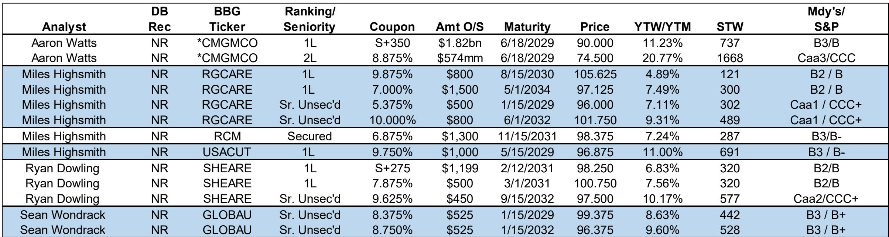
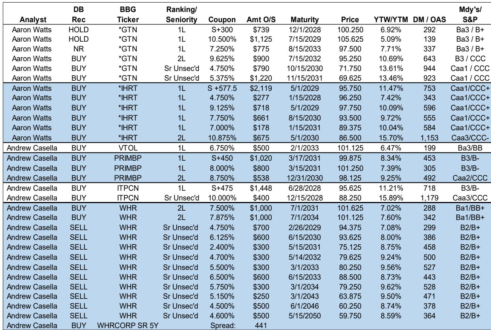
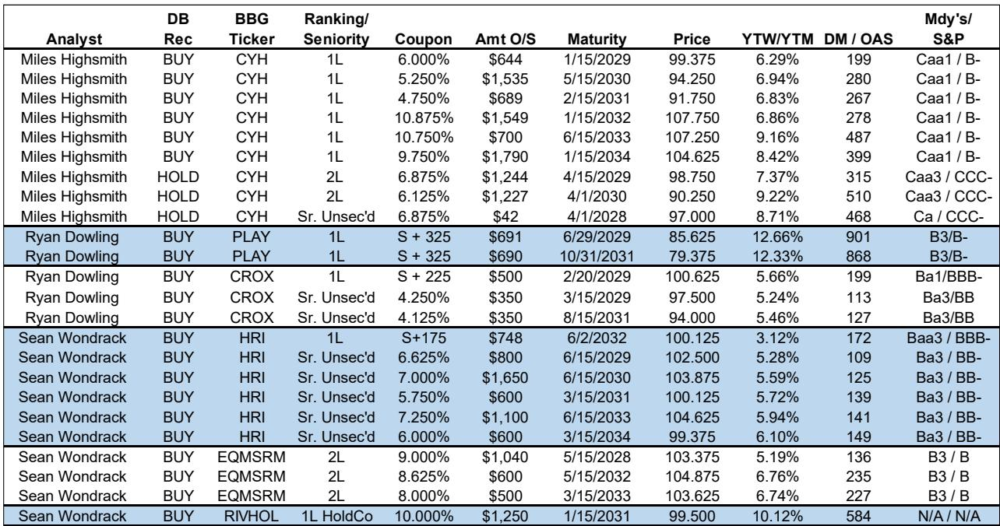

# DB：美国高收益债市场真正的风险不是衰退，而是分层

2026年过半，美国高收益债市场正在经历一场“安静的洗牌”。DB在最新发布的《2026年中检查》报告中给出一个核心判断：美国经济衰退概率仍然很低，但市场内部的“分散度”正在快速上升——这意味着，过去两年“买一篮子高收益债就能赚钱”的简单策略，正在失效。

这份报告的价值不在于它预测了宏观方向，而在于它拆解了“低衰退概率”之下，哪些行业、哪些资本结构、哪些信用层级正在积累真正的风险。对于持有高收益债敞口的机构投资者而言，现在需要回答的问题不是“要不要撤”，而是“应该怎样筛选”。

## 1. 宏观没有崩，但增长引擎正在切换

DB美国经济团队维持了对2026年实际GDP增长2.2%（Q4/Q4）的预测，仅比美伊冲突前的2.4%小幅下调。报告明确指出，拖累主要来自油价冲击（约-0.2个百分点）和年初消费走弱，但财政政策、金融条件、生产率和AI投资的持续强劲形成了对冲。

这是一个“软着陆叙事”的延续。但真正值得注意的不是GDP数字本身，而是增长引擎的结构性变化。报告提到“劳动力市场信心正在修复”，通胀仍将“显著高于目标水平”，这意味着美联储不会很快转向宽松。

> **KC评论：** 对于高收益债投资者，低衰退假设是定价的“底层操作系统”。只要这个假设不破裂，信用利差就不会系统性走阔。但DB提醒：利差不扩，不等于所有债券都安全。关键在于，谁能在增长引擎切换中保持现金流。

## 2. 技术面仍然强劲，但这恰恰是最大的“温水煮青蛙”信号

报告在策略展望部分指出，“技术面仍然强劲，这可以缓和HY利差的走阔幅度”。换句话说，资金仍在流入高收益债市场，供需关系对价格有支撑。

但问题在于，技术面的韧性掩盖了基本面的分化。DB用了一个精妙的表述：“美国经济衰退概率仍然很低，即使薄弱环节将导致分散度上升。” 这句话的潜台词是：当整体水位不降时，投资者容易忽视哪些板块在漏水。

报告特别点名了几个需要警惕的领域：B3评级的下调风险、特定行业的违约暴露、以及“美国软件故障可能导致融资市场大幅收紧”的情景。这个“软件故障”假设值得反复咀嚼——它指向的不是经济基本面，而是金融基础设施的脆弱性。

## 3. 消费板块：不是所有“打折”都值得买

消费和零售是高收益债市场最大的板块之一。DB在报告中覆盖了Crocs和Dave & Buster‘s两个典型案例，但它们的信用质量差异巨大。

Crocs（CROX）被归入“低beta/5-9.99%潜在总回报”篮子，其优先无担保债收益率仅5.24%-5.46%，利差在113-127个基点。这是一个典型的“防御型持仓”：现金流稳定、杠杆可控、市场地位清晰。

而Dave & Buster’s（PLAY）则完全不同。它的第一留置权贷款报价在79.375-85.625美元，收益率高达12.33%-12.66%，利差超过860个基点。报告将其归入“中beta/10-14.99%”篮子，但价格本身已经反映了相当程度的压力。

> **KC评论：** 同一个板块，两张截然不同的信用画像。CROX的利差告诉我们市场认为它“安全”，PLAY的折价则暗示市场在定价某种重组风险。完整报告中对这两个名字的现金流模型、杠杆路径和流动性缓冲有更细致的拆解，这些才是判断“哪个折扣值得捡”的关键。

## 4. 工业与租赁：AI投资的红利能否传导到信用？

工业板块中，DB重点推荐了Herc Rentals（HRI）和EquipmentShare（EQMSRM），两者均被给予BUY评级。

HRI的优先无担保债收益率在5.28%-6.10%之间，利差109-149个基点，评级为Ba3/BB-，属于高收益债中的“准投资级”。报告将其归入中beta篮子，意味着它提供了比Crocs更高的收益，但信用风险仍然可控。

EquipmentShare的二级债收益率在5.19%-6.76%之间，评级B3/B，略低于HRI。但值得关注的是，这两家公司都受益于非住宅建筑和基础设施投资的持续增长——而这正是AI算力中心建设、能源转型和制造业回流的核心载体。

问题在于：AI投资的红利是否足够大、足够持久，来抵消住宅建筑市场的疲软？DB在报告中提到了“美国住宅和非住宅建筑产品”的2026年展望，但没有给出明确的结论。这个问题的答案，直接决定了工业板块高收益债的估值锚点。

## 5. 媒体板块：结构性衰退中的深度价值陷阱

媒体是高收益债市场中最具“结构性挑战”的板块之一。DB覆盖了Gray Television（GTN）和iHeart Media（IHRT），两者的评级都在B-到CCC区间，且都被给予BUY评级——但它们的价格和收益率差异巨大。

GTN的第二留置权债和优先无担保债收益率在10.69%-13.61%之间，价格在69.625-95.25美元。IHRT的第一留置权债收益率在7.42%-11.47%之间，二级债收益率高达15.70%。

这些数字非常诱人，但背后是线性电视和广播广告收入的长期下滑。DB认为这些公司的现金流仍然足以覆盖债务服务，但前提是“衰退不会发生”。如果经济放缓超出预期，广告收入的下滑将直接侵蚀偿债能力。

> **KC评论：** 媒体高收益债是典型的“深度价值”投资——收益率高，但容错空间极低。完整报告中对GTN和IHRT的自由现金流预测、债务到期结构和 covenant 保护条款有详细分析，这些才是决定“15%收益率是机会还是陷阱”的关键变量。

## 6. 报告尚未完全回答的关键问题：B3评级下调的“多米诺骨牌”

DB在报告中专门用一节讨论“HY评级：警惕B3下调风险”。这是一个非常技术性但极其重要的观察。

在高收益债的评级体系中，B3/B-是“投机级”和“高度投机级”的分水岭。一旦发行人从B2被下调至B3，很多机构投资者的持仓限制会被触发，导致被动卖出。如果多个B2评级发行人同时面临下调压力，市场可能会出现“评级悬崖”——价格下跌 -> 评级下调 -> 更多卖出 -> 价格进一步下跌的负反馈循环。

报告提到了哪些行业更容易暴露于违约和基本面风险，但没有量化“如果B3下调潮发生，利差会走阔多少”。这是一个关键的未解问题。完整报告中包含了对每个覆盖发行人的评级展望、杠杆倍数和流动性覆盖率的详细拆解，这些数据是判断“谁最危险”的基础。

## 7. 对投资者的观察框架：从“买beta”到“买alpha”

综合DB的这份报告，可以提炼出一个三层筛选框架：

第一层：宏观情景。低衰退概率是当前持仓的“通行证”。如果这个假设变化，所有高收益债的定价都需要重估。

第二层：行业景气。消费、工业、媒体、医疗、租赁、汽车——每个行业面临的增长动力和结构性压力不同。AI投资和财政刺激是顺风，油价和消费疲软是逆风。

第三层：资本结构选择。同一个发行人，第一留置权、第二留置权和优先无担保债的收益率和风险差异可能高达500-1000个基点。在分散度上升的环境下，资本结构的选择比行业选择更重要。

DB这份报告的价值，在于它提供了从宏观到微观的完整分析框架，而不是简单地给出“买入”或“卖出”的指令。真正稀缺的，是这些判断背后的数据支撑和假设验证——而这些东西，只有在完整报告中才能看到。

---

这份报告共涵盖超过20个发行人的详细分析，包括每个名字的评级、收益率、利差、到期结构和DB的评级建议。报告还包含了对私人公司（datasite issuer）的专题讨论，这些通常不在公开覆盖范围内，但对机构投资者来说可能是最具信息优势的部分。

每天，我们会由AI agent加上人工review，生成国际投行的中文摘要与KC评论，daily更新约10-40页，并整理当天最新数据图表合集。这些内容既方便喂给AI做进一步分析，也方便人工快速把握market dynamics。欢迎来知识星球微信群中继续讨论，一起拆解这些报告的深层含义。

Personal reading notes and learning share only. Not investment advice.

