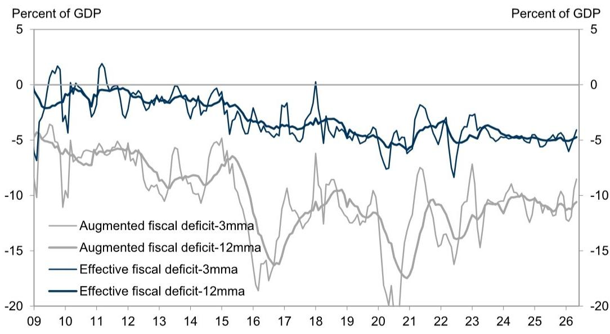
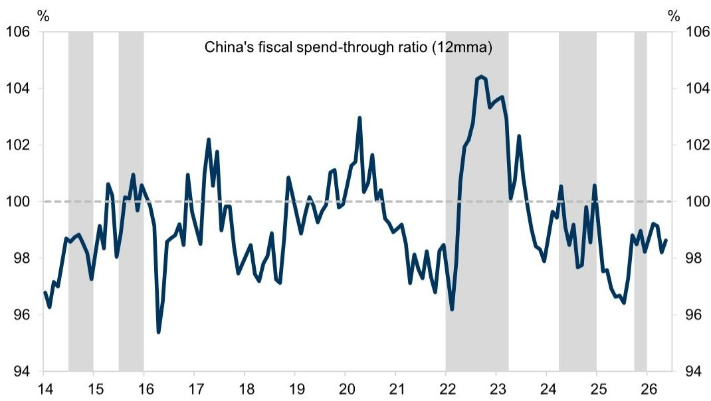
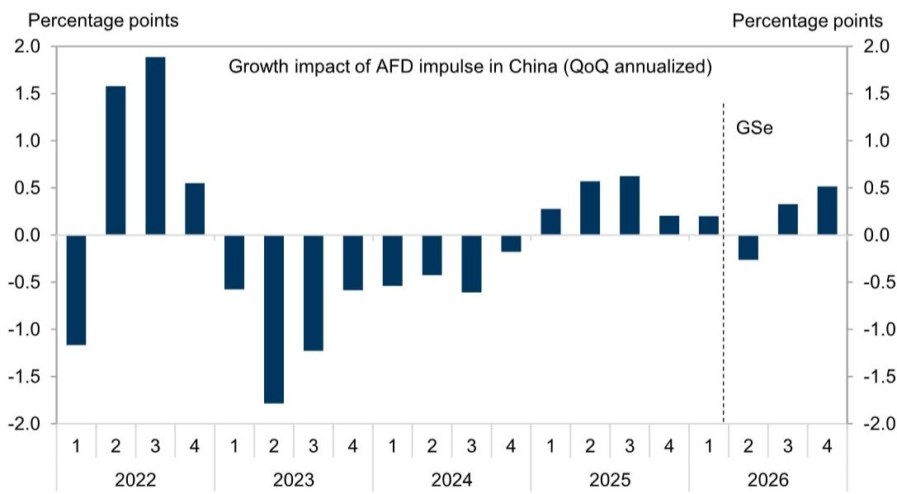

# China's Fiscal Tightening Is Real, and It Is Reshaping Growth in the Second Half

The most important signal from China's May fiscal data is not the modest improvement in headline expenditure, but the unmistakable tightening of the augmented fiscal deficit. On a three-month moving average basis, our proprietary measure of fiscal support narrowed to -8.5% of GDP in May from -9.5% in April, and the twelve-month measure tightened to -10.6% from -10.8%. This is not a statistical quirk. It is a structural shift driven by the sustained collapse in land sales revenue and the deliberate scaling back of policy bank lending. Fiscal policy has become less supportive of growth in the second quarter than it was in the first, and the implications for the trajectory of infrastructure investment, local government spending capacity, and overall GDP growth are more profound than the modest expenditure recovery suggests.

The conventional narrative that China will simply ramp up bond issuance and spending in the second half misses the deeper constraint. The funding capacity exists—RMB 7.7 trillion of unspent government bond quota as of end-May, RMB 800 billion in policy bank new financing tools, and RMB 536 billion in year-on-year fiscal deposit increases—but the willingness and ability to deploy these funds effectively are being tested by the property sector's ongoing revenue drain. The central government can accelerate its own spending, but the local governments that execute the bulk of infrastructure and social spending are still bleeding from the land sales channel. The fiscal impulse for the second half will be determined less by the size of the bond quota and more by how quickly the central government can bypass the local revenue constraint.

This article unpacks the mechanics of China's fiscal tightening, explains why the property revenue collapse is the binding constraint, and provides a decision framework for investors navigating the second-half growth outlook. The report from which this analysis is drawn contains the original charts and seasonal adjustment methodology that underpin these conclusions.

## On-Budget Revenue Held Up in May, but the Composition Reveals a Narrowing Tax Base

May's on-budget fiscal revenue growth of 6.6% year-on-year appeared resilient, almost identical to April's 6.7% pace. This headline stability, however, masks a significant internal shift. Tax revenue growth slowed to 6.8% year-on-year from 8.2% in April, while non-tax revenue growth swung from a 5.3% contraction to a 5.6% increase. The acceleration in non-tax revenue was driven by favorable base effects, not by a structural improvement in government income. This matters because non-tax revenue is inherently less predictable and less sustainable than tax revenue, and its reliance on one-off items such as state asset transfers and administrative fees makes it a poor foundation for medium-term fiscal planning.

The slowdown in tax revenue was broad-based across major categories. Individual income tax, corporate income tax, and consumption tax all decelerated in May relative to April. The only notable outlier was stamp duty on stock trading, which surged 145.9% year-on-year, up from 62.9% in April. But this line item accounts for just 1.2% of total tax revenue. It is a volatility amplifier, not a structural driver. The broad-based deceleration in core tax categories suggests that the underlying economic activity growth, while still positive, is not generating the tax uplift that a normal recovery would produce. The combination of still-soft real activity growth and rising PPI inflation has created a nominal revenue boost that masks the weakness in real tax generation.

The so-what for investors is clear: the on-budget revenue story is less supportive than it appears. The deceleration in tax revenue, even as non-tax revenue temporarily fills the gap, points to a fiscal system that is increasingly reliant on one-off and volatile income streams. This reduces the predictability of government spending plans and increases the likelihood that the central government will need to intervene more directly to maintain aggregate demand.

## Infrastructure Spending Remains Subdued Despite the Narrowing Expenditure Contraction

On-budget fiscal expenditure contracted 1.6% year-on-year in May, an improvement from the 3.2% contraction in April. The narrowing was driven by faster spending in science and technology, urban and rural community affairs, and energy saving and environmental protection. These are important categories, but they are not the primary drivers of infrastructure investment. The critical line item for understanding the growth impulse is infrastructure-related on-budget fiscal spending, which remained deeply negative at -12.0% year-on-year in May, even after improving from -18.6% in April.

This persistent weakness in infrastructure-related spending is the most direct channel through which fiscal tightening is weighing on growth. Infrastructure investment growth slowed to -11.2% year-on-year in May from -5.6% in April, confirming that the on-budget spending contraction is translating into real economic outcomes. The improvement from April to May is too modest to signal a turning point. It is more consistent with a stabilization at a low level than with a recovery.

The implication is that the bond issuance acceleration expected in the second half will need to be deployed with unusual speed and efficiency to offset the first-half drag. The unspent quota is large, but the historical pattern in China is that local governments take time to identify, approve, and begin spending on new projects. If the central government wants to see a meaningful infrastructure rebound in the third quarter, it will need to front-load approvals and potentially bypass normal local government procurement processes. The risk is that the spending acceleration comes too late to prevent a further deceleration in sequential GDP growth in the second quarter.

## The Property Revenue Collapse Is the Binding Constraint on Fiscal Capacity

The most concerning data point in the May report is the continued deterioration in property-related government revenue. Off-budget land sales revenue contracted 35.8% year-on-year in May, wider than the 34.9% contraction in April. On-budget property-related tax revenue growth slowed to -2.6% year-on-year from -0.7% in April. Combining these two channels, total government revenue directly from the property sector contracted 23.9% year-on-year in May, compared with -20.1% in April.

This is not a temporary fluctuation. The property downturn has been prolonged, construction activity remains weak, and developer funding conditions are still stretched. The green shoots in home transactions in some large cities have not translated into improved land sales, and they are unlikely to do so in the near term. Developers are still focused on completing existing projects and reducing debt, not on acquiring new land. The land sales revenue decline is structural, not cyclical, and it will persist even if home transaction volumes stabilize.

The fiscal impact of this revenue collapse is amplified by the fact that land sales are the primary funding source for local governments' off-budget spending. When land sales revenue falls, local governments cannot simply replace it with on-budget transfers from the center. The central government can increase its own spending, but the local governments that execute the bulk of infrastructure and social spending are facing a binding revenue constraint. This is why the augmented fiscal deficit has tightened even as the on-budget deficit has narrowed. The off-budget channel is where the real fiscal pressure is concentrated.

The so-what for investors is that the property sector's impact on the macroeconomy is not limited to its direct contribution to GDP through construction and real estate services. It is also the primary determinant of local government fiscal capacity, which in turn determines the pace of infrastructure investment and broader public spending. A recovery in home transactions is necessary but not sufficient to resolve this constraint. Land sales need to stabilize, and that requires a resolution of developer funding stress that is not yet visible in the data.

## The Augmented Fiscal Deficit Is the Right Metric, and It Is Signaling Caution

The proprietary augmented fiscal deficit metric, which combines on-budget and off-budget financing channels, tightened further in May on both a three-month and twelve-month moving average basis. The three-month measure improved to -8.5% of GDP from -9.5% in April, but this improvement is entirely a base effect from the earlier period of wider deficits. The twelve-month measure, which is a better indicator of the underlying trend, tightened to -10.6% from -10.8%. The direction is unambiguous: fiscal policy has become less supportive of growth in the second quarter relative to the first.

The fiscal "spend-through" ratio, which measures the pace at which the government is spending previously raised funds, rose slightly in May on a twelve-month moving average basis. This suggests that the government is drawing down its fiscal deposits to maintain spending, which is a positive sign for near-term demand. But the tightening of the augmented fiscal deficit indicates that this drawdown is not sufficient to offset the decline in new revenue and policy bank support. The government is spending its savings, but it is not generating enough new fiscal impulse to sustain the growth momentum from the first quarter.

The most important question for the second half is whether the central government can reverse this tightening through accelerated bond issuance and policy bank lending. The funding capacity is clearly there. The RMB 7.7 trillion of unspent bond quota is more than enough to cover the first-half shortfall. The RMB 800 billion policy bank new financing tool is larger than last year's RMB 500 billion. And the RMB 536 billion year-on-year increase in fiscal deposits provides additional buffer. But capacity is not the same as execution. The historical record shows that China's fiscal stimulus tends to be back-loaded, and the lag between bond issuance and actual spending can be several months. If the government waits until the third quarter to accelerate issuance, the impact on growth may not be felt until the fourth quarter or later.

## What the Report Does Not Fully Answer: The Transmission Mechanism from Central to Local

The report provides a comprehensive picture of the aggregate fiscal position, but it leaves several important questions unanswered. The most critical is the transmission mechanism from central government funding to local government spending. The central government can issue bonds and transfer funds to local governments, but the local governments are the ones that execute the spending. If local governments are constrained by land sales revenue losses and are prioritizing debt repayment over new spending, even a large central transfer may not translate into a commensurate increase in infrastructure investment.

The report does not provide granular data on local government spending by province or city, nor does it analyze the distribution of the unspent bond quota across regions. It is possible that the aggregate unspent quota masks significant regional disparities, with wealthier provinces having ample capacity and weaker provinces facing binding constraints. If the central government's bond issuance is concentrated in regions that are already spending at capacity, the marginal impact on growth may be smaller than the headline numbers suggest.

A second unanswered question is the role of local government financing vehicles. These off-balance-sheet entities were a major source of infrastructure funding in previous stimulus cycles, but they are now subject to tighter regulatory oversight and higher borrowing costs. The report notes that policy bank support has shrunk, but it does not fully explore the extent to which the LGFV channel has been closed. If LGFVs are unable to borrow, the central government's bond issuance will need to compensate for a much larger funding gap than the on-budget numbers suggest.

These open questions are why the original report is worth reading in full. The charts and seasonal adjustment methodology provide the analytical foundation for the conclusions drawn here, and the data on fiscal deposits and policy bank lending offer additional context that cannot be fully captured in a summary.

## A Decision Framework for Investors Navigating the Second-Half Outlook

For investors trying to position for the second half of the year, the fiscal data provides a clear but incomplete signal. The following framework can help translate the fiscal tightening into actionable investment themes.

First, monitor the pace of bond issuance and the drawdown of fiscal deposits as leading indicators. If the government accelerates issuance in June and July, and if fiscal deposits begin to decline meaningfully, that would signal that the central government is serious about front-loading spending. If issuance remains slow and deposits continue to accumulate, the tightening of the augmented fiscal deficit is likely to persist into the third quarter.

Second, focus on infrastructure-related spending data rather than headline expenditure. The headline numbers can be misleading because they include categories like science and technology that have a smaller multiplier effect on GDP. Infrastructure-related spending is the direct channel through which fiscal policy affects industrial production, construction employment, and fixed asset investment. If this category remains in negative territory through June, the sequential GDP growth in the second quarter is likely to be weaker than current consensus estimates.

Third, watch the property sector for signs of land sales stabilization, not just home transaction improvement. Home transactions are a leading indicator for developer confidence, but land sales are the direct driver of local government revenue. A stabilization in land sales would signal that the local government fiscal constraint is beginning to ease. Without it, even a large central bond issuance may not be enough to offset the off-budget revenue loss.

Fourth, consider the policy trade-off between growth and reform. The report notes that the government has a conservative growth target of 4.5-5% for this year, and that exports have been firmer than expected. This reduces the urgency for significant, broad-based stimulus in the near term. The government may choose to tolerate a period of slower growth in the second quarter in order to maintain fiscal discipline and avoid adding to local government debt. If this is the case, the fiscal tightening is not a temporary deviation but a deliberate policy choice.

Fifth, prepare for a back-loaded growth profile. If the government does accelerate spending in the second half, the impact on GDP growth is likely to be concentrated in the fourth quarter and into next year. This has implications for sector allocation. Infrastructure-related sectors may see a delayed but significant boost, while consumer-facing sectors may continue to face headwinds from slower income growth and weaker local government spending on social services.

The bottom line is that the fiscal tightening in May is real, and it is driven by structural factors that will not resolve quickly. The central government has the tools to offset the tightening, but the timing and effectiveness of its response remain uncertain. Investors should not assume that the second half will automatically deliver a stronger fiscal impulse. They should watch the data, understand the transmission mechanisms, and position for a range of outcomes.

## The Full Picture Requires the Original Charts and Methodology

The analysis in this article is based on a detailed research report that includes the seasonal adjustment methodology, the construction of the augmented fiscal deficit metric, and the historical comparison charts that put the current data in context. The charts on fiscal revenue and expenditure trends, property-related government revenue, and the augmented fiscal deficit trajectory are essential for understanding the magnitude of the tightening and the speed of the deterioration. They also provide the basis for the forward-looking analysis that cannot be fully captured in a written summary.

Join the community to read the full report and review the original charts.

*This article is for learning and discussion only and does not constitute investment advice.*

Personal reading notes and learning share only. Not investment advice.

